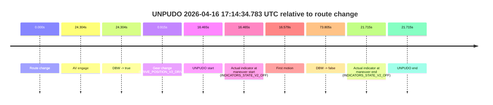
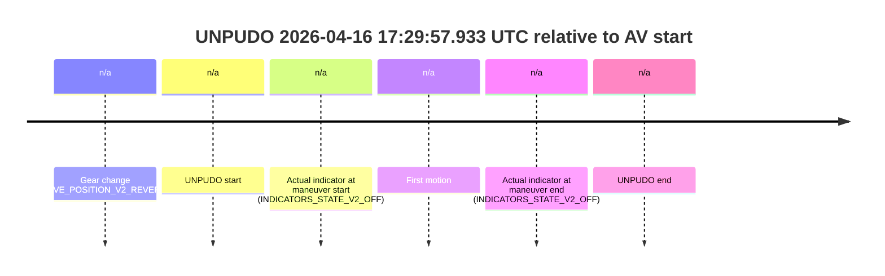
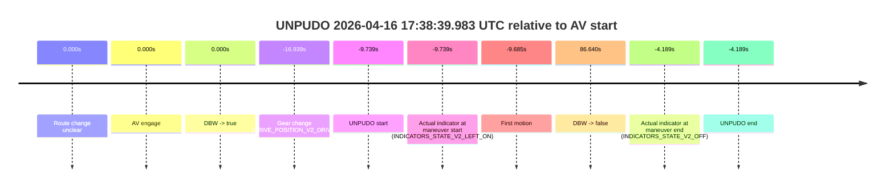
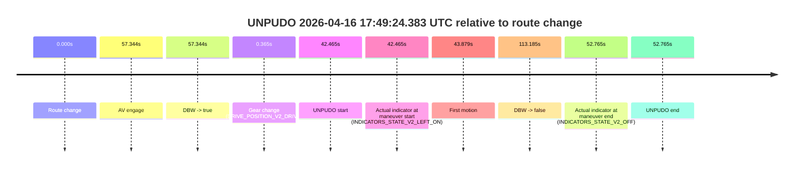
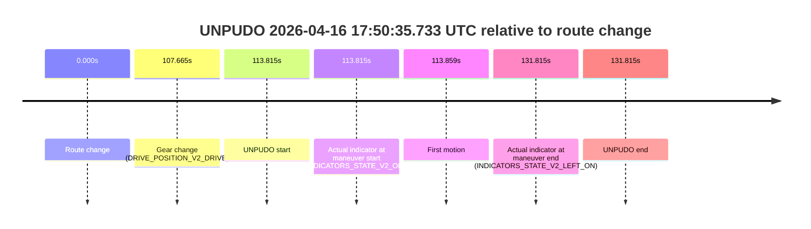

# Run Report: fme10005/2026-04-16--16-55-19--gen2-av-e0e9f57d-f4bb-4b40-aaf9-9bfb99fb60b2

| Field | Value |
|---|---|
| Run ID | `fme10005/2026-04-16--16-55-19--gen2-av-e0e9f57d-f4bb-4b40-aaf9-9bfb99fb60b2` |
| Date | `2026-04-16` |
| Model(s) | `plum-timeless-beaver` |
| Author | `peng.tang` |
| Event count | `9` |

## unpudo 2026-04-16 17:14:34.783 UTC

| Field | Value |
|---|---|
| Model | `plum-timeless-beaver` |
| Author | `peng.tang` |
| Run ID | `fme10005/2026-04-16--16-55-19--gen2-av-e0e9f57d-f4bb-4b40-aaf9-9bfb99fb60b2` |
| Date | `2026-04-16` |
| Time (UTC) | `17:14:34.783` |
| Event type | `unpudo` |
| Disengagement type | `failed_to_unpudo` |
| Route change | `found` |
| Console | [run](https://console.sso.wayve.ai/run/fme10005/2026-04-16--16-55-19--gen2-av-e0e9f57d-f4bb-4b40-aaf9-9bfb99fb60b2?id=&time-unixus=1776359674783301) |
| Foxglove | [segment](https://app.foxglove.dev/wayve-on-prem/p/prj_0dX18KZdVHg1fmmI/view?ds=foxglove-stream&ds.deviceName=fme10005&ds.start=2026-04-16T17%3A14%3A08.318230Z&ds.end=2026-04-16T17%3A15%3A42.123372Z&layoutId=lay_0e7VD4WIKDQGU73Y&time=2026-04-16T17%3A14%3A34.783301Z) |

### Event card: non-av

- Non-AV: there is no AV-owned portion anywhere inside the detected unpudo timeline, so it is kept for coverage but excluded from model success / failure scoring.

| Event | Time (UTC) | Delta from route change |
|---|---:|---:|
| Route change | 2026-04-16 17:14:18.318 | `0.000s` |
| AV engage | 2026-04-16 17:14:42.622 | `24.304s` |
| DBW -> true | 2026-04-16 17:14:42.622 | `24.304s` |
| Gear change (DRIVE_POSITION_V2_DRIVE) | 2026-04-16 17:14:19.233 | `0.915s` |
| UNPUDO start | 2026-04-16 17:14:34.783 | `16.465s` |
| Actual indicator at maneuver start (INDICATORS_STATE_V2_OFF) | 2026-04-16 17:14:34.783 | `16.465s` |
| First motion | 2026-04-16 17:14:34.897 | `16.579s` |
| DBW -> false | 2026-04-16 17:15:32.123 | `73.805s` |
| Actual indicator at maneuver end (INDICATORS_STATE_V2_OFF) | 2026-04-16 17:14:40.033 | `21.715s` |
| UNPUDO end | 2026-04-16 17:14:40.033 | `21.715s` |

| Metric | Value |
|---|---|
| Outcome | `non-av` |
| Effective failure type | `none` |
| Route change status | `found` |
| DBW at event start | `false` |
| DBW at event end | `false` |
| Predicted gear at AV start | `DRIVE_POSITION_V2_DRIVE` |
| Actual gear at AV start | `DRIVE_POSITION_V2_DRIVE` |
| Predicted gear at event start | `DRIVE_POSITION_V2_DRIVE` |
| Actual gear at event start | `DRIVE_POSITION_V2_DRIVE` |
| Planned indicator direction | `INDICATORS_STATE_V2_LEFT_ON` |
| Controller indicator direction | `INDICATORS_STATE_V2_LEFT_ON` |
| Actual indicator direction | `INDICATORS_STATE_V2_OFF` |
| Actual indicator at maneuver end | `INDICATORS_STATE_V2_OFF` |
| Driver accel help in AV | `false` |
| Driver accel help timestamp | `n/a` |
| Max accel pedal pct in AV | `0.0%` |
| Max brake pedal pct in AV | `0.0%` |
| Max speed mps in AV | `0.000` |
| Route -> AV | `24.304s` |
| AV -> event start | `-7.839s` |
| AV -> first motion | `-7.725s` |
| AV duration before disengagement | `49.501s` |
| Trajectory waypoint count | `37` |
| Driving-plan step count | `11` |

The scored portion starts from the AV-owned window, not from the pre-AV setup. Route-change search in the stopped pre-event segment was `found`, with the baseline therefore set to route change. At the event anchor the model predicts `DRIVE_POSITION_V2_DRIVE` and the actual gear is `DRIVE_POSITION_V2_DRIVE`. The effective model outcome is `non-av` because `there is no AV-owned overlap inside the event timeline`.

### Resolution

| Field | Value |
|---|---|
| Final outcome | `non-av` |
| Do we agree with this label? | `yes` |
| Source disengagement type | `failed_to_unpudo` |
| Resolved effective failure type | `none` |
| Confidence | `high` |

## unpudo 2026-04-16 17:23:13.133 UTC

| Field | Value |
|---|---|
| Model | `plum-timeless-beaver` |
| Author | `peng.tang` |
| Run ID | `fme10005/2026-04-16--16-55-19--gen2-av-e0e9f57d-f4bb-4b40-aaf9-9bfb99fb60b2` |
| Date | `2026-04-16` |
| Time (UTC) | `17:23:13.133` |
| Event type | `unpudo` |
| Disengagement type | `failed_to_unpudo` |
| Route change | `found` |
| Console | [run](https://console.sso.wayve.ai/run/fme10005/2026-04-16--16-55-19--gen2-av-e0e9f57d-f4bb-4b40-aaf9-9bfb99fb60b2?id=&time-unixus=1776360193133306) |
| Foxglove | [segment](https://app.foxglove.dev/wayve-on-prem/p/prj_0dX18KZdVHg1fmmI/view?ds=foxglove-stream&ds.deviceName=fme10005&ds.start=2026-04-16T17%3A22%3A52.018255Z&ds.end=2026-04-16T17%3A26%3A12.602633Z&layoutId=lay_0e7VD4WIKDQGU73Y&time=2026-04-16T17%3A23%3A13.133306Z) |

### Event card: non-av

- Non-AV: there is no AV-owned portion anywhere inside the detected unpudo timeline, so it is kept for coverage but excluded from model success / failure scoring.

| Event | Time (UTC) | Delta from route change |
|---|---:|---:|
| Route change | 2026-04-16 17:23:02.018 | `0.000s` |
| AV engage | 2026-04-16 17:23:21.583 | `19.565s` |
| DBW -> true | 2026-04-16 17:23:21.583 | `19.565s` |
| Gear change (DRIVE_POSITION_V2_DRIVE) | 2026-04-16 17:23:08.583 | `6.565s` |
| UNPUDO start | 2026-04-16 17:23:13.133 | `11.115s` |
| Actual indicator at maneuver start (INDICATORS_STATE_V2_OFF) | 2026-04-16 17:23:13.133 | `11.115s` |
| First motion | 2026-04-16 17:23:13.156 | `11.139s` |
| DBW -> false | 2026-04-16 17:26:02.602 | `180.584s` |
| Actual indicator at maneuver end (INDICATORS_STATE_V2_OFF) | 2026-04-16 17:23:17.083 | `15.065s` |
| UNPUDO end | 2026-04-16 17:23:17.083 | `15.065s` |

| Metric | Value |
|---|---|
| Outcome | `non-av` |
| Effective failure type | `none` |
| Route change status | `found` |
| DBW at event start | `false` |
| DBW at event end | `false` |
| Predicted gear at AV start | `DRIVE_POSITION_V2_DRIVE` |
| Actual gear at AV start | `DRIVE_POSITION_V2_DRIVE` |
| Predicted gear at event start | `DRIVE_POSITION_V2_DRIVE` |
| Actual gear at event start | `DRIVE_POSITION_V2_DRIVE` |
| Planned indicator direction | `INDICATORS_STATE_V2_LEFT_ON` |
| Controller indicator direction | `INDICATORS_STATE_V2_LEFT_ON` |
| Actual indicator direction | `INDICATORS_STATE_V2_OFF` |
| Actual indicator at maneuver end | `INDICATORS_STATE_V2_OFF` |
| Driver accel help in AV | `false` |
| Driver accel help timestamp | `n/a` |
| Max accel pedal pct in AV | `0.0%` |
| Max brake pedal pct in AV | `0.0%` |
| Max speed mps in AV | `0.000` |
| Route -> AV | `19.565s` |
| AV -> event start | `-8.450s` |
| AV -> first motion | `-8.426s` |
| AV duration before disengagement | `161.019s` |
| Trajectory waypoint count | `38` |
| Driving-plan step count | `11` |

The scored portion starts from the AV-owned window, not from the pre-AV setup. Route-change search in the stopped pre-event segment was `found`, with the baseline therefore set to route change. At the event anchor the model predicts `DRIVE_POSITION_V2_DRIVE` and the actual gear is `DRIVE_POSITION_V2_DRIVE`. The effective model outcome is `non-av` because `there is no AV-owned overlap inside the event timeline`.

### Resolution

| Field | Value |
|---|---|
| Final outcome | `non-av` |
| Do we agree with this label? | `yes` |
| Source disengagement type | `failed_to_unpudo` |
| Resolved effective failure type | `none` |
| Confidence | `high` |

## unpudo 2026-04-16 17:27:42.933 UTC

| Field | Value |
|---|---|
| Model | `plum-timeless-beaver` |
| Author | `peng.tang` |
| Run ID | `fme10005/2026-04-16--16-55-19--gen2-av-e0e9f57d-f4bb-4b40-aaf9-9bfb99fb60b2` |
| Date | `2026-04-16` |
| Time (UTC) | `17:27:42.933` |
| Event type | `unpudo` |
| Disengagement type | `failed_to_unpudo` |
| Route change | `found` |
| Console | [run](https://console.sso.wayve.ai/run/fme10005/2026-04-16--16-55-19--gen2-av-e0e9f57d-f4bb-4b40-aaf9-9bfb99fb60b2?id=&time-unixus=1776360462933315) |
| Foxglove | [segment](https://app.foxglove.dev/wayve-on-prem/p/prj_0dX18KZdVHg1fmmI/view?ds=foxglove-stream&ds.deviceName=fme10005&ds.start=2026-04-16T17%3A27%3A20.318271Z&ds.end=2026-04-16T17%3A29%3A32.023376Z&layoutId=lay_0e7VD4WIKDQGU73Y&time=2026-04-16T17%3A27%3A42.933315Z) |

### Event card: non-av

- Non-AV: there is no AV-owned portion anywhere inside the detected unpudo timeline, so it is kept for coverage but excluded from model success / failure scoring.

| Event | Time (UTC) | Delta from route change |
|---|---:|---:|
| Route change | 2026-04-16 17:27:30.318 | `0.000s` |
| AV engage | 2026-04-16 17:27:57.042 | `26.724s` |
| DBW -> true | 2026-04-16 17:27:57.042 | `26.724s` |
| Gear change (DRIVE_POSITION_V2_DRIVE) | 2026-04-16 17:27:41.183 | `10.865s` |
| UNPUDO start | 2026-04-16 17:27:42.933 | `12.615s` |
| Actual indicator at maneuver start (INDICATORS_STATE_V2_LEFT_ON) | 2026-04-16 17:27:42.933 | `12.615s` |
| First motion | 2026-04-16 17:27:42.977 | `12.659s` |
| DBW -> false | 2026-04-16 17:29:22.023 | `111.705s` |
| Actual indicator at maneuver end (INDICATORS_STATE_V2_OFF) | 2026-04-16 17:27:49.133 | `18.815s` |
| UNPUDO end | 2026-04-16 17:27:49.133 | `18.815s` |

| Metric | Value |
|---|---|
| Outcome | `non-av` |
| Effective failure type | `none` |
| Route change status | `found` |
| DBW at event start | `false` |
| DBW at event end | `false` |
| Predicted gear at AV start | `DRIVE_POSITION_V2_DRIVE` |
| Actual gear at AV start | `DRIVE_POSITION_V2_DRIVE` |
| Predicted gear at event start | `DRIVE_POSITION_V2_DRIVE` |
| Actual gear at event start | `DRIVE_POSITION_V2_DRIVE` |
| Planned indicator direction | `INDICATORS_STATE_V2_LEFT_ON` |
| Controller indicator direction | `INDICATORS_STATE_V2_LEFT_ON` |
| Actual indicator direction | `INDICATORS_STATE_V2_LEFT_ON` |
| Actual indicator at maneuver end | `INDICATORS_STATE_V2_OFF` |
| Driver accel help in AV | `false` |
| Driver accel help timestamp | `n/a` |
| Max accel pedal pct in AV | `0.0%` |
| Max brake pedal pct in AV | `0.0%` |
| Max speed mps in AV | `0.000` |
| Route -> AV | `26.724s` |
| AV -> event start | `-14.109s` |
| AV -> first motion | `-14.065s` |
| AV duration before disengagement | `84.981s` |
| Trajectory waypoint count | `36` |
| Driving-plan step count | `11` |

The scored portion starts from the AV-owned window, not from the pre-AV setup. Route-change search in the stopped pre-event segment was `found`, with the baseline therefore set to route change. At the event anchor the model predicts `DRIVE_POSITION_V2_DRIVE` and the actual gear is `DRIVE_POSITION_V2_DRIVE`. The effective model outcome is `non-av` because `there is no AV-owned overlap inside the event timeline`.

### Resolution

| Field | Value |
|---|---|
| Final outcome | `non-av` |
| Do we agree with this label? | `yes` |
| Source disengagement type | `failed_to_unpudo` |
| Resolved effective failure type | `none` |
| Confidence | `high` |

## unpudo 2026-04-16 17:29:57.933 UTC

| Field | Value |
|---|---|
| Model | `plum-timeless-beaver` |
| Author | `peng.tang` |
| Run ID | `fme10005/2026-04-16--16-55-19--gen2-av-e0e9f57d-f4bb-4b40-aaf9-9bfb99fb60b2` |
| Date | `2026-04-16` |
| Time (UTC) | `17:29:57.933` |
| Event type | `unpudo` |
| Disengagement type | `failed_to_pudo` |
| Route change | `unclear` |
| Console | [run](https://console.sso.wayve.ai/run/fme10005/2026-04-16--16-55-19--gen2-av-e0e9f57d-f4bb-4b40-aaf9-9bfb99fb60b2?id=&time-unixus=1776360597933320) |
| Foxglove | [segment](https://app.foxglove.dev/wayve-on-prem/p/prj_0dX18KZdVHg1fmmI/view?ds=foxglove-stream&ds.deviceName=fme10005&ds.start=2026-04-16T17%3A29%3A47.383308Z&ds.end=2026-04-16T17%3A30%3A07.933320Z&layoutId=lay_0e7VD4WIKDQGU73Y&time=2026-04-16T17%3A29%3A57.933320Z) |

### Event card: non-av

- Non-AV: there is no AV-owned portion anywhere inside the detected unpudo timeline, so it is kept for coverage but excluded from model success / failure scoring.

| Event | Time (UTC) | Delta from AV start |
|---|---:|---:|
| Gear change (DRIVE_POSITION_V2_REVERSE) | 2026-04-16 17:29:57.383 | `n/a` |
| UNPUDO start | 2026-04-16 17:29:57.933 | `n/a` |
| Actual indicator at maneuver start (INDICATORS_STATE_V2_OFF) | 2026-04-16 17:29:57.933 | `n/a` |
| First motion | 2026-04-16 17:29:58.136 | `n/a` |
| Actual indicator at maneuver end (INDICATORS_STATE_V2_OFF) | 2026-04-16 17:29:57.933 | `n/a` |
| UNPUDO end | 2026-04-16 17:29:57.933 | `n/a` |

| Metric | Value |
|---|---|
| Outcome | `non-av` |
| Effective failure type | `none` |
| Route change status | `unclear` |
| DBW at event start | `false` |
| DBW at event end | `false` |
| Predicted gear at AV start | `n/a` |
| Actual gear at AV start | `n/a` |
| Predicted gear at event start | `DRIVE_POSITION_V2_DRIVE` |
| Actual gear at event start | `DRIVE_POSITION_V2_REVERSE` |
| Planned indicator direction | `INDICATORS_STATE_V2_OFF` |
| Controller indicator direction | `INDICATORS_STATE_V2_OFF` |
| Actual indicator direction | `INDICATORS_STATE_V2_OFF` |
| Actual indicator at maneuver end | `INDICATORS_STATE_V2_OFF` |
| Driver accel help in AV | `false` |
| Driver accel help timestamp | `n/a` |
| Max accel pedal pct in AV | `0.0%` |
| Max brake pedal pct in AV | `0.0%` |
| Max speed mps in AV | `0.000` |
| Route -> AV | `n/a` |
| AV -> event start | `n/a` |
| AV -> first motion | `n/a` |
| AV duration before disengagement | `n/a` |
| Trajectory waypoint count | `36` |
| Driving-plan step count | `11` |

The scored portion starts from the AV-owned window, not from the pre-AV setup. Route-change search in the stopped pre-event segment was `unclear`, with the baseline therefore set to AV start. At the event anchor the model predicts `DRIVE_POSITION_V2_DRIVE` and the actual gear is `DRIVE_POSITION_V2_REVERSE`. The effective model outcome is `non-av` because `there is no AV-owned overlap inside the event timeline`.

### Resolution

| Field | Value |
|---|---|
| Final outcome | `non-av` |
| Do we agree with this label? | `yes` |
| Source disengagement type | `failed_to_pudo` |
| Resolved effective failure type | `none` |
| Confidence | `medium` |

## unpudo 2026-04-16 17:38:39.983 UTC

| Field | Value |
|---|---|
| Model | `plum-timeless-beaver` |
| Author | `peng.tang` |
| Run ID | `fme10005/2026-04-16--16-55-19--gen2-av-e0e9f57d-f4bb-4b40-aaf9-9bfb99fb60b2` |
| Date | `2026-04-16` |
| Time (UTC) | `17:38:39.983` |
| Event type | `unpudo` |
| Disengagement type | `failed_to_accelerate` |
| Route change | `unclear` |
| Console | [run](https://console.sso.wayve.ai/run/fme10005/2026-04-16--16-55-19--gen2-av-e0e9f57d-f4bb-4b40-aaf9-9bfb99fb60b2?id=&time-unixus=1776361119983311) |
| Foxglove | [segment](https://app.foxglove.dev/wayve-on-prem/p/prj_0dX18KZdVHg1fmmI/view?ds=foxglove-stream&ds.deviceName=fme10005&ds.start=2026-04-16T17%3A38%3A22.783308Z&ds.end=2026-04-16T17%3A40%3A26.362217Z&layoutId=lay_0e7VD4WIKDQGU73Y&time=2026-04-16T17%3A38%3A39.983311Z) |

### Event card: non-av

- Non-AV: there is no AV-owned portion anywhere inside the detected unpudo timeline, so it is kept for coverage but excluded from model success / failure scoring.

| Event | Time (UTC) | Delta from AV start |
|---|---:|---:|
| Route change unclear | 2026-04-16 17:38:49.722 | `0.000s` |
| AV engage | 2026-04-16 17:38:49.722 | `0.000s` |
| DBW -> true | 2026-04-16 17:38:49.722 | `0.000s` |
| Gear change (DRIVE_POSITION_V2_DRIVE) | 2026-04-16 17:38:32.783 | `-16.939s` |
| UNPUDO start | 2026-04-16 17:38:39.983 | `-9.739s` |
| Actual indicator at maneuver start (INDICATORS_STATE_V2_LEFT_ON) | 2026-04-16 17:38:39.983 | `-9.739s` |
| First motion | 2026-04-16 17:38:40.036 | `-9.685s` |
| DBW -> false | 2026-04-16 17:40:16.362 | `86.640s` |
| Actual indicator at maneuver end (INDICATORS_STATE_V2_OFF) | 2026-04-16 17:38:45.533 | `-4.189s` |
| UNPUDO end | 2026-04-16 17:38:45.533 | `-4.189s` |

| Metric | Value |
|---|---|
| Outcome | `non-av` |
| Effective failure type | `none` |
| Route change status | `unclear` |
| DBW at event start | `false` |
| DBW at event end | `false` |
| Predicted gear at AV start | `DRIVE_POSITION_V2_DRIVE` |
| Actual gear at AV start | `DRIVE_POSITION_V2_DRIVE` |
| Predicted gear at event start | `DRIVE_POSITION_V2_DRIVE` |
| Actual gear at event start | `DRIVE_POSITION_V2_DRIVE` |
| Planned indicator direction | `INDICATORS_STATE_V2_LEFT_ON` |
| Controller indicator direction | `INDICATORS_STATE_V2_LEFT_ON` |
| Actual indicator direction | `INDICATORS_STATE_V2_LEFT_ON` |
| Actual indicator at maneuver end | `INDICATORS_STATE_V2_OFF` |
| Driver accel help in AV | `false` |
| Driver accel help timestamp | `n/a` |
| Max accel pedal pct in AV | `0.0%` |
| Max brake pedal pct in AV | `0.0%` |
| Max speed mps in AV | `0.000` |
| Route -> AV | `n/a` |
| AV -> event start | `-9.739s` |
| AV -> first motion | `-9.685s` |
| AV duration before disengagement | `86.640s` |
| Trajectory waypoint count | `37` |
| Driving-plan step count | `11` |

The scored portion starts from the AV-owned window, not from the pre-AV setup. Route-change search in the stopped pre-event segment was `unclear`, with the baseline therefore set to AV start. At the event anchor the model predicts `DRIVE_POSITION_V2_DRIVE` and the actual gear is `DRIVE_POSITION_V2_DRIVE`. The effective model outcome is `non-av` because `there is no AV-owned overlap inside the event timeline`.

### Resolution

| Field | Value |
|---|---|
| Final outcome | `non-av` |
| Do we agree with this label? | `yes` |
| Source disengagement type | `failed_to_accelerate` |
| Resolved effective failure type | `none` |
| Confidence | `medium` |

## unpudo 2026-04-16 17:41:04.183 UTC

| Field | Value |
|---|---|
| Model | `plum-timeless-beaver` |
| Author | `peng.tang` |
| Run ID | `fme10005/2026-04-16--16-55-19--gen2-av-e0e9f57d-f4bb-4b40-aaf9-9bfb99fb60b2` |
| Date | `2026-04-16` |
| Time (UTC) | `17:41:04.183` |
| Event type | `unpudo` |
| Disengagement type | `none observed` |
| Route change | `unclear` |
| Console | [run](https://console.sso.wayve.ai/run/fme10005/2026-04-16--16-55-19--gen2-av-e0e9f57d-f4bb-4b40-aaf9-9bfb99fb60b2?id=&time-unixus=1776361264183303) |
| Foxglove | [segment](https://app.foxglove.dev/wayve-on-prem/p/prj_0dX18KZdVHg1fmmI/view?ds=foxglove-stream&ds.deviceName=fme10005&ds.start=2026-04-16T17%3A40%3A52.583307Z&ds.end=2026-04-16T17%3A41%3A57.943313Z&layoutId=lay_0e7VD4WIKDQGU73Y&time=2026-04-16T17%3A41%3A04.183303Z) |

### Event card: non-av

- Non-AV: there is no AV-owned portion anywhere inside the detected unpudo timeline, so it is kept for coverage but excluded from model success / failure scoring.

| Event | Time (UTC) | Delta from AV start |
|---|---:|---:|
| Route change unclear | 2026-04-16 17:41:24.902 | `0.000s` |
| AV engage | 2026-04-16 17:41:24.902 | `0.000s` |
| DBW -> true | 2026-04-16 17:41:24.902 | `0.000s` |
| Gear change (DRIVE_POSITION_V2_DRIVE) | 2026-04-16 17:41:02.583 | `-22.319s` |
| UNPUDO start | 2026-04-16 17:41:04.183 | `-20.719s` |
| Actual indicator at maneuver start (INDICATORS_STATE_V2_LEFT_ON) | 2026-04-16 17:41:04.183 | `-20.719s` |
| First motion | 2026-04-16 17:41:04.217 | `-20.685s` |
| DBW -> false | 2026-04-16 17:41:47.943 | `23.041s` |
| Actual indicator at maneuver end (INDICATORS_STATE_V2_OFF) | 2026-04-16 17:41:08.983 | `-15.919s` |
| UNPUDO end | 2026-04-16 17:41:08.983 | `-15.919s` |

| Metric | Value |
|---|---|
| Outcome | `non-av` |
| Effective failure type | `none` |
| Route change status | `unclear` |
| DBW at event start | `false` |
| DBW at event end | `false` |
| Predicted gear at AV start | `DRIVE_POSITION_V2_PARK` |
| Actual gear at AV start | `DRIVE_POSITION_V2_PARK` |
| Predicted gear at event start | `DRIVE_POSITION_V2_DRIVE` |
| Actual gear at event start | `DRIVE_POSITION_V2_DRIVE` |
| Planned indicator direction | `INDICATORS_STATE_V2_OFF` |
| Controller indicator direction | `INDICATORS_STATE_V2_OFF` |
| Actual indicator direction | `INDICATORS_STATE_V2_LEFT_ON` |
| Actual indicator at maneuver end | `INDICATORS_STATE_V2_OFF` |
| Driver accel help in AV | `false` |
| Driver accel help timestamp | `n/a` |
| Max accel pedal pct in AV | `0.0%` |
| Max brake pedal pct in AV | `0.0%` |
| Max speed mps in AV | `0.000` |
| Route -> AV | `n/a` |
| AV -> event start | `-20.719s` |
| AV -> first motion | `-20.685s` |
| AV duration before disengagement | `23.041s` |
| Trajectory waypoint count | `37` |
| Driving-plan step count | `11` |

The scored portion starts from the AV-owned window, not from the pre-AV setup. Route-change search in the stopped pre-event segment was `unclear`, with the baseline therefore set to AV start. At the event anchor the model predicts `DRIVE_POSITION_V2_DRIVE` and the actual gear is `DRIVE_POSITION_V2_DRIVE`. The effective model outcome is `non-av` because `there is no AV-owned overlap inside the event timeline`.

### Resolution

| Field | Value |
|---|---|
| Final outcome | `non-av` |
| Do we agree with this label? | `yes` |
| Source disengagement type | `none observed` |
| Resolved effective failure type | `none` |
| Confidence | `medium` |

## unpudo 2026-04-16 17:41:48.533 UTC

| Field | Value |
|---|---|
| Model | `plum-timeless-beaver` |
| Author | `peng.tang` |
| Run ID | `fme10005/2026-04-16--16-55-19--gen2-av-e0e9f57d-f4bb-4b40-aaf9-9bfb99fb60b2` |
| Date | `2026-04-16` |
| Time (UTC) | `17:41:48.533` |
| Event type | `unpudo` |
| Disengagement type | `failed_to_unpudo` |
| Route change | `found` |
| Console | [run](https://console.sso.wayve.ai/run/fme10005/2026-04-16--16-55-19--gen2-av-e0e9f57d-f4bb-4b40-aaf9-9bfb99fb60b2?id=&time-unixus=1776361308533307) |
| Foxglove | [segment](https://app.foxglove.dev/wayve-on-prem/p/prj_0dX18KZdVHg1fmmI/view?ds=foxglove-stream&ds.deviceName=fme10005&ds.start=2026-04-16T17%3A41%3A31.818266Z&ds.end=2026-04-16T17%3A43%3A48.523351Z&layoutId=lay_0e7VD4WIKDQGU73Y&time=2026-04-16T17%3A41%3A48.533307Z) |

### Event card: non-av

- Non-AV: there is no AV-owned portion anywhere inside the detected unpudo timeline, so it is kept for coverage but excluded from model success / failure scoring.

| Event | Time (UTC) | Delta from route change |
|---|---:|---:|
| Route change | 2026-04-16 17:41:41.818 | `0.000s` |
| AV engage | 2026-04-16 17:41:59.662 | `17.844s` |
| DBW -> true | 2026-04-16 17:41:59.662 | `17.844s` |
| Gear change (DRIVE_POSITION_V2_DRIVE) | 2026-04-16 17:41:42.583 | `0.765s` |
| UNPUDO start | 2026-04-16 17:41:48.533 | `6.715s` |
| Actual indicator at maneuver start (INDICATORS_STATE_V2_OFF) | 2026-04-16 17:41:48.533 | `6.715s` |
| First motion | 2026-04-16 17:41:48.577 | `6.759s` |
| DBW -> false | 2026-04-16 17:43:38.523 | `116.705s` |
| Actual indicator at maneuver end (INDICATORS_STATE_V2_OFF) | 2026-04-16 17:41:52.333 | `10.515s` |
| UNPUDO end | 2026-04-16 17:41:52.333 | `10.515s` |

| Metric | Value |
|---|---|
| Outcome | `non-av` |
| Effective failure type | `none` |
| Route change status | `found` |
| DBW at event start | `false` |
| DBW at event end | `false` |
| Predicted gear at AV start | `DRIVE_POSITION_V2_DRIVE` |
| Actual gear at AV start | `DRIVE_POSITION_V2_DRIVE` |
| Predicted gear at event start | `DRIVE_POSITION_V2_DRIVE` |
| Actual gear at event start | `DRIVE_POSITION_V2_DRIVE` |
| Planned indicator direction | `INDICATORS_STATE_V2_OFF` |
| Controller indicator direction | `INDICATORS_STATE_V2_OFF` |
| Actual indicator direction | `INDICATORS_STATE_V2_OFF` |
| Actual indicator at maneuver end | `INDICATORS_STATE_V2_OFF` |
| Driver accel help in AV | `false` |
| Driver accel help timestamp | `n/a` |
| Max accel pedal pct in AV | `0.0%` |
| Max brake pedal pct in AV | `0.0%` |
| Max speed mps in AV | `0.000` |
| Route -> AV | `17.844s` |
| AV -> event start | `-11.129s` |
| AV -> first motion | `-11.085s` |
| AV duration before disengagement | `98.861s` |
| Trajectory waypoint count | `36` |
| Driving-plan step count | `11` |

The scored portion starts from the AV-owned window, not from the pre-AV setup. Route-change search in the stopped pre-event segment was `found`, with the baseline therefore set to route change. At the event anchor the model predicts `DRIVE_POSITION_V2_DRIVE` and the actual gear is `DRIVE_POSITION_V2_DRIVE`. The effective model outcome is `non-av` because `there is no AV-owned overlap inside the event timeline`.

### Resolution

| Field | Value |
|---|---|
| Final outcome | `non-av` |
| Do we agree with this label? | `yes` |
| Source disengagement type | `failed_to_unpudo` |
| Resolved effective failure type | `none` |
| Confidence | `high` |

## unpudo 2026-04-16 17:49:24.383 UTC

| Field | Value |
|---|---|
| Model | `plum-timeless-beaver` |
| Author | `peng.tang` |
| Run ID | `fme10005/2026-04-16--16-55-19--gen2-av-e0e9f57d-f4bb-4b40-aaf9-9bfb99fb60b2` |
| Date | `2026-04-16` |
| Time (UTC) | `17:49:24.383` |
| Event type | `unpudo` |
| Disengagement type | `failed_to_unpudo` |
| Route change | `found` |
| Console | [run](https://console.sso.wayve.ai/run/fme10005/2026-04-16--16-55-19--gen2-av-e0e9f57d-f4bb-4b40-aaf9-9bfb99fb60b2?id=&time-unixus=1776361764383315) |
| Foxglove | [segment](https://app.foxglove.dev/wayve-on-prem/p/prj_0dX18KZdVHg1fmmI/view?ds=foxglove-stream&ds.deviceName=fme10005&ds.start=2026-04-16T17%3A48%3A31.918255Z&ds.end=2026-04-16T17%3A50%3A45.103231Z&layoutId=lay_0e7VD4WIKDQGU73Y&time=2026-04-16T17%3A49%3A24.383315Z) |

### Event card: non-av

- Non-AV: there is no AV-owned portion anywhere inside the detected unpudo timeline, so it is kept for coverage but excluded from model success / failure scoring.

| Event | Time (UTC) | Delta from route change |
|---|---:|---:|
| Route change | 2026-04-16 17:48:41.918 | `0.000s` |
| AV engage | 2026-04-16 17:49:39.262 | `57.344s` |
| DBW -> true | 2026-04-16 17:49:39.262 | `57.344s` |
| Gear change (DRIVE_POSITION_V2_DRIVE) | 2026-04-16 17:48:42.283 | `0.365s` |
| UNPUDO start | 2026-04-16 17:49:24.383 | `42.465s` |
| Actual indicator at maneuver start (INDICATORS_STATE_V2_LEFT_ON) | 2026-04-16 17:49:24.383 | `42.465s` |
| First motion | 2026-04-16 17:49:25.797 | `43.879s` |
| DBW -> false | 2026-04-16 17:50:35.103 | `113.185s` |
| Actual indicator at maneuver end (INDICATORS_STATE_V2_OFF) | 2026-04-16 17:49:34.683 | `52.765s` |
| UNPUDO end | 2026-04-16 17:49:34.683 | `52.765s` |

| Metric | Value |
|---|---|
| Outcome | `non-av` |
| Effective failure type | `none` |
| Route change status | `found` |
| DBW at event start | `false` |
| DBW at event end | `false` |
| Predicted gear at AV start | `DRIVE_POSITION_V2_DRIVE` |
| Actual gear at AV start | `DRIVE_POSITION_V2_DRIVE` |
| Predicted gear at event start | `DRIVE_POSITION_V2_DRIVE` |
| Actual gear at event start | `DRIVE_POSITION_V2_DRIVE` |
| Planned indicator direction | `INDICATORS_STATE_V2_LEFT_ON` |
| Controller indicator direction | `INDICATORS_STATE_V2_LEFT_ON` |
| Actual indicator direction | `INDICATORS_STATE_V2_LEFT_ON` |
| Actual indicator at maneuver end | `INDICATORS_STATE_V2_OFF` |
| Driver accel help in AV | `false` |
| Driver accel help timestamp | `n/a` |
| Max accel pedal pct in AV | `0.0%` |
| Max brake pedal pct in AV | `0.0%` |
| Max speed mps in AV | `0.000` |
| Route -> AV | `57.344s` |
| AV -> event start | `-14.879s` |
| AV -> first motion | `-13.465s` |
| AV duration before disengagement | `55.841s` |
| Trajectory waypoint count | `37` |
| Driving-plan step count | `11` |

The scored portion starts from the AV-owned window, not from the pre-AV setup. Route-change search in the stopped pre-event segment was `found`, with the baseline therefore set to route change. At the event anchor the model predicts `DRIVE_POSITION_V2_DRIVE` and the actual gear is `DRIVE_POSITION_V2_DRIVE`. The effective model outcome is `non-av` because `there is no AV-owned overlap inside the event timeline`.

### Resolution

| Field | Value |
|---|---|
| Final outcome | `non-av` |
| Do we agree with this label? | `yes` |
| Source disengagement type | `failed_to_unpudo` |
| Resolved effective failure type | `none` |
| Confidence | `high` |

## unpudo 2026-04-16 17:50:35.733 UTC

| Field | Value |
|---|---|
| Model | `plum-timeless-beaver` |
| Author | `peng.tang` |
| Run ID | `fme10005/2026-04-16--16-55-19--gen2-av-e0e9f57d-f4bb-4b40-aaf9-9bfb99fb60b2` |
| Date | `2026-04-16` |
| Time (UTC) | `17:50:35.733` |
| Event type | `unpudo` |
| Disengagement type | `failed_to_unpudo` |
| Route change | `found` |
| Console | [run](https://console.sso.wayve.ai/run/fme10005/2026-04-16--16-55-19--gen2-av-e0e9f57d-f4bb-4b40-aaf9-9bfb99fb60b2?id=&time-unixus=1776361835733311) |
| Foxglove | [segment](https://app.foxglove.dev/wayve-on-prem/p/prj_0dX18KZdVHg1fmmI/view?ds=foxglove-stream&ds.deviceName=fme10005&ds.start=2026-04-16T17%3A48%3A31.918255Z&ds.end=2026-04-16T17%3A51%3A03.733306Z&layoutId=lay_0e7VD4WIKDQGU73Y&time=2026-04-16T17%3A50%3A35.733311Z) |

### Event card: non-av

- Non-AV: there is no AV-owned portion anywhere inside the detected unpudo timeline, so it is kept for coverage but excluded from model success / failure scoring.

| Event | Time (UTC) | Delta from route change |
|---|---:|---:|
| Route change | 2026-04-16 17:48:41.918 | `0.000s` |
| Gear change (DRIVE_POSITION_V2_DRIVE) | 2026-04-16 17:50:29.583 | `107.665s` |
| UNPUDO start | 2026-04-16 17:50:35.733 | `113.815s` |
| Actual indicator at maneuver start (INDICATORS_STATE_V2_OFF) | 2026-04-16 17:50:35.733 | `113.815s` |
| First motion | 2026-04-16 17:50:35.776 | `113.859s` |
| Actual indicator at maneuver end (INDICATORS_STATE_V2_LEFT_ON) | 2026-04-16 17:50:53.733 | `131.815s` |
| UNPUDO end | 2026-04-16 17:50:53.733 | `131.815s` |

| Metric | Value |
|---|---|
| Outcome | `non-av` |
| Effective failure type | `none` |
| Route change status | `found` |
| DBW at event start | `false` |
| DBW at event end | `false` |
| Predicted gear at AV start | `n/a` |
| Actual gear at AV start | `n/a` |
| Predicted gear at event start | `DRIVE_POSITION_V2_DRIVE` |
| Actual gear at event start | `DRIVE_POSITION_V2_DRIVE` |
| Planned indicator direction | `INDICATORS_STATE_V2_OFF` |
| Controller indicator direction | `INDICATORS_STATE_V2_OFF` |
| Actual indicator direction | `INDICATORS_STATE_V2_OFF` |
| Actual indicator at maneuver end | `INDICATORS_STATE_V2_LEFT_ON` |
| Driver accel help in AV | `false` |
| Driver accel help timestamp | `n/a` |
| Max accel pedal pct in AV | `0.0%` |
| Max brake pedal pct in AV | `0.0%` |
| Max speed mps in AV | `0.000` |
| Route -> AV | `n/a` |
| AV -> event start | `n/a` |
| AV -> first motion | `n/a` |
| AV duration before disengagement | `n/a` |
| Trajectory waypoint count | `38` |
| Driving-plan step count | `11` |

The scored portion starts from the AV-owned window, not from the pre-AV setup. Route-change search in the stopped pre-event segment was `found`, with the baseline therefore set to route change. At the event anchor the model predicts `DRIVE_POSITION_V2_DRIVE` and the actual gear is `DRIVE_POSITION_V2_DRIVE`. The effective model outcome is `non-av` because `there is no AV-owned overlap inside the event timeline`.

### Resolution

| Field | Value |
|---|---|
| Final outcome | `non-av` |
| Do we agree with this label? | `yes` |
| Source disengagement type | `failed_to_unpudo` |
| Resolved effective failure type | `none` |
| Confidence | `high` |
