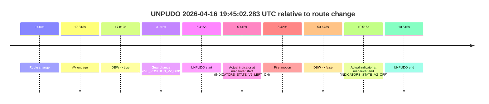
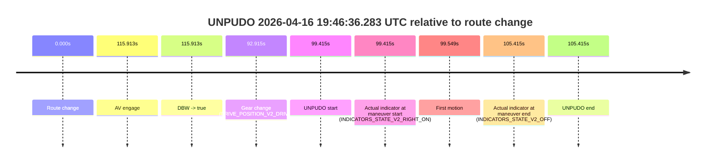

# Run Report: fme10005/2026-04-16--19-05-51--gen2-av-d8889615-b270-492d-845e-f04e526f1455

| Field | Value |
|---|---|
| Run ID | `fme10005/2026-04-16--19-05-51--gen2-av-d8889615-b270-492d-845e-f04e526f1455` |
| Date | `2026-04-16` |
| Model(s) | `plum-timeless-beaver` |
| Author | `peng.tang` |
| Event count | `8` |

## unpudo 2026-04-16 19:17:55.783 UTC

| Field | Value |
|---|---|
| Model | `plum-timeless-beaver` |
| Author | `peng.tang` |
| Run ID | `fme10005/2026-04-16--19-05-51--gen2-av-d8889615-b270-492d-845e-f04e526f1455` |
| Date | `2026-04-16` |
| Time (UTC) | `19:17:55.783` |
| Event type | `unpudo` |
| Disengagement type | `failed_to_unpudo` |
| Route change | `found` |
| Console | [run](https://console.sso.wayve.ai/run/fme10005/2026-04-16--19-05-51--gen2-av-d8889615-b270-492d-845e-f04e526f1455?id=&time-unixus=1776367075783309) |
| Foxglove | [segment](https://app.foxglove.dev/wayve-on-prem/p/prj_0dX18KZdVHg1fmmI/view?ds=foxglove-stream&ds.deviceName=fme10005&ds.start=2026-04-16T19%3A17%3A23.768282Z&ds.end=2026-04-16T19%3A19%3A48.919586Z&layoutId=lay_0e7VD4WIKDQGU73Y&time=2026-04-16T19%3A17%3A55.783309Z) |

### Event card: non-av

- Non-AV: there is no AV-owned portion anywhere inside the detected unpudo timeline, so it is kept for coverage but excluded from model success / failure scoring.

| Event | Time (UTC) | Delta from route change |
|---|---:|---:|
| Route change | 2026-04-16 19:17:33.768 | `0.000s` |
| AV engage | 2026-04-16 19:18:44.899 | `71.131s` |
| DBW -> true | 2026-04-16 19:18:44.899 | `71.131s` |
| Gear change (DRIVE_POSITION_V2_DRIVE) | 2026-04-16 19:17:34.183 | `0.415s` |
| UNPUDO start | 2026-04-16 19:17:55.783 | `22.015s` |
| Actual indicator at maneuver start (INDICATORS_STATE_V2_OFF) | 2026-04-16 19:17:55.783 | `22.015s` |
| First motion | 2026-04-16 19:17:56.557 | `22.789s` |
| DBW -> false | 2026-04-16 19:19:38.919 | `125.151s` |
| Actual indicator at maneuver end (INDICATORS_STATE_V2_OFF) | 2026-04-16 19:18:35.333 | `61.565s` |
| UNPUDO end | 2026-04-16 19:18:35.333 | `61.565s` |

| Metric | Value |
|---|---|
| Outcome | `non-av` |
| Effective failure type | `none` |
| Route change status | `found` |
| DBW at event start | `false` |
| DBW at event end | `false` |
| Predicted gear at AV start | `DRIVE_POSITION_V2_DRIVE` |
| Actual gear at AV start | `DRIVE_POSITION_V2_DRIVE` |
| Predicted gear at event start | `DRIVE_POSITION_V2_DRIVE` |
| Actual gear at event start | `DRIVE_POSITION_V2_DRIVE` |
| Planned indicator direction | `INDICATORS_STATE_V2_OFF` |
| Controller indicator direction | `INDICATORS_STATE_V2_OFF` |
| Actual indicator direction | `INDICATORS_STATE_V2_OFF` |
| Actual indicator at maneuver end | `INDICATORS_STATE_V2_OFF` |
| Driver accel help in AV | `false` |
| Driver accel help timestamp | `n/a` |
| Max accel pedal pct in AV | `0.0%` |
| Max brake pedal pct in AV | `0.0%` |
| Max speed mps in AV | `0.000` |
| Route -> AV | `71.131s` |
| AV -> event start | `-49.116s` |
| AV -> first motion | `-48.342s` |
| AV duration before disengagement | `54.020s` |
| Trajectory waypoint count | `37` |
| Driving-plan step count | `11` |

The scored portion starts from the AV-owned window, not from the pre-AV setup. Route-change search in the stopped pre-event segment was `found`, with the baseline therefore set to route change. At the event anchor the model predicts `DRIVE_POSITION_V2_DRIVE` and the actual gear is `DRIVE_POSITION_V2_DRIVE`. The effective model outcome is `non-av` because `there is no AV-owned overlap inside the event timeline`.

### Resolution

| Field | Value |
|---|---|
| Final outcome | `non-av` |
| Do we agree with this label? | `yes` |
| Source disengagement type | `failed_to_unpudo` |
| Resolved effective failure type | `none` |
| Confidence | `high` |

## unpudo 2026-04-16 19:20:40.083 UTC

| Field | Value |
|---|---|
| Model | `plum-timeless-beaver` |
| Author | `peng.tang` |
| Run ID | `fme10005/2026-04-16--19-05-51--gen2-av-d8889615-b270-492d-845e-f04e526f1455` |
| Date | `2026-04-16` |
| Time (UTC) | `19:20:40.083` |
| Event type | `unpudo` |
| Disengagement type | `failed_to_unpudo` |
| Route change | `found` |
| Console | [run](https://console.sso.wayve.ai/run/fme10005/2026-04-16--19-05-51--gen2-av-d8889615-b270-492d-845e-f04e526f1455?id=&time-unixus=1776367240083303) |
| Foxglove | [segment](https://app.foxglove.dev/wayve-on-prem/p/prj_0dX18KZdVHg1fmmI/view?ds=foxglove-stream&ds.deviceName=fme10005&ds.start=2026-04-16T19%3A20%3A20.118240Z&ds.end=2026-04-16T19%3A21%3A37.879647Z&layoutId=lay_0e7VD4WIKDQGU73Y&time=2026-04-16T19%3A20%3A40.083303Z) |

### Event card: non-av

- Non-AV: there is no AV-owned portion anywhere inside the detected unpudo timeline, so it is kept for coverage but excluded from model success / failure scoring.

| Event | Time (UTC) | Delta from route change |
|---|---:|---:|
| Route change | 2026-04-16 19:20:30.118 | `0.000s` |
| AV engage | 2026-04-16 19:20:49.040 | `18.923s` |
| DBW -> true | 2026-04-16 19:20:49.040 | `18.923s` |
| Gear change (DRIVE_POSITION_V2_DRIVE) | 2026-04-16 19:20:30.483 | `0.365s` |
| UNPUDO start | 2026-04-16 19:20:40.083 | `9.965s` |
| Actual indicator at maneuver start (INDICATORS_STATE_V2_OFF) | 2026-04-16 19:20:40.083 | `9.965s` |
| First motion | 2026-04-16 19:20:40.097 | `9.979s` |
| DBW -> false | 2026-04-16 19:21:27.879 | `57.761s` |
| Actual indicator at maneuver end (INDICATORS_STATE_V2_OFF) | 2026-04-16 19:20:44.683 | `14.565s` |
| UNPUDO end | 2026-04-16 19:20:44.683 | `14.565s` |

| Metric | Value |
|---|---|
| Outcome | `non-av` |
| Effective failure type | `none` |
| Route change status | `found` |
| DBW at event start | `false` |
| DBW at event end | `false` |
| Predicted gear at AV start | `DRIVE_POSITION_V2_DRIVE` |
| Actual gear at AV start | `DRIVE_POSITION_V2_DRIVE` |
| Predicted gear at event start | `DRIVE_POSITION_V2_DRIVE` |
| Actual gear at event start | `DRIVE_POSITION_V2_DRIVE` |
| Planned indicator direction | `INDICATORS_STATE_V2_LEFT_ON` |
| Controller indicator direction | `INDICATORS_STATE_V2_LEFT_ON` |
| Actual indicator direction | `INDICATORS_STATE_V2_OFF` |
| Actual indicator at maneuver end | `INDICATORS_STATE_V2_OFF` |
| Driver accel help in AV | `false` |
| Driver accel help timestamp | `n/a` |
| Max accel pedal pct in AV | `0.0%` |
| Max brake pedal pct in AV | `0.0%` |
| Max speed mps in AV | `0.000` |
| Route -> AV | `18.923s` |
| AV -> event start | `-8.958s` |
| AV -> first motion | `-8.944s` |
| AV duration before disengagement | `38.839s` |
| Trajectory waypoint count | `37` |
| Driving-plan step count | `11` |

The scored portion starts from the AV-owned window, not from the pre-AV setup. Route-change search in the stopped pre-event segment was `found`, with the baseline therefore set to route change. At the event anchor the model predicts `DRIVE_POSITION_V2_DRIVE` and the actual gear is `DRIVE_POSITION_V2_DRIVE`. The effective model outcome is `non-av` because `there is no AV-owned overlap inside the event timeline`.

### Resolution

| Field | Value |
|---|---|
| Final outcome | `non-av` |
| Do we agree with this label? | `yes` |
| Source disengagement type | `failed_to_unpudo` |
| Resolved effective failure type | `none` |
| Confidence | `high` |

## unpudo 2026-04-16 19:22:49.083 UTC

| Field | Value |
|---|---|
| Model | `plum-timeless-beaver` |
| Author | `peng.tang` |
| Run ID | `fme10005/2026-04-16--19-05-51--gen2-av-d8889615-b270-492d-845e-f04e526f1455` |
| Date | `2026-04-16` |
| Time (UTC) | `19:22:49.083` |
| Event type | `unpudo` |
| Disengagement type | `failed_to_unpudo` |
| Route change | `found` |
| Console | [run](https://console.sso.wayve.ai/run/fme10005/2026-04-16--19-05-51--gen2-av-d8889615-b270-492d-845e-f04e526f1455?id=&time-unixus=1776367369083314) |
| Foxglove | [segment](https://app.foxglove.dev/wayve-on-prem/p/prj_0dX18KZdVHg1fmmI/view?ds=foxglove-stream&ds.deviceName=fme10005&ds.start=2026-04-16T19%3A21%3A53.718278Z&ds.end=2026-04-16T19%3A24%3A05.980313Z&layoutId=lay_0e7VD4WIKDQGU73Y&time=2026-04-16T19%3A22%3A49.083314Z) |

### Event card: non-av

- Non-AV: there is no AV-owned portion anywhere inside the detected unpudo timeline, so it is kept for coverage but excluded from model success / failure scoring.

| Event | Time (UTC) | Delta from route change |
|---|---:|---:|
| Route change | 2026-04-16 19:22:03.718 | `0.000s` |
| AV engage | 2026-04-16 19:23:00.459 | `56.741s` |
| DBW -> true | 2026-04-16 19:23:00.459 | `56.741s` |
| Gear change (DRIVE_POSITION_V2_DRIVE) | 2026-04-16 19:22:04.083 | `0.365s` |
| UNPUDO start | 2026-04-16 19:22:49.083 | `45.365s` |
| Actual indicator at maneuver start (INDICATORS_STATE_V2_OFF) | 2026-04-16 19:22:49.083 | `45.365s` |
| First motion | 2026-04-16 19:22:49.097 | `45.379s` |
| DBW -> false | 2026-04-16 19:23:55.980 | `112.262s` |
| Actual indicator at maneuver end (INDICATORS_STATE_V2_OFF) | 2026-04-16 19:22:54.583 | `50.865s` |
| UNPUDO end | 2026-04-16 19:22:54.583 | `50.865s` |

| Metric | Value |
|---|---|
| Outcome | `non-av` |
| Effective failure type | `none` |
| Route change status | `found` |
| DBW at event start | `false` |
| DBW at event end | `false` |
| Predicted gear at AV start | `DRIVE_POSITION_V2_DRIVE` |
| Actual gear at AV start | `DRIVE_POSITION_V2_DRIVE` |
| Predicted gear at event start | `DRIVE_POSITION_V2_DRIVE` |
| Actual gear at event start | `DRIVE_POSITION_V2_DRIVE` |
| Planned indicator direction | `INDICATORS_STATE_V2_LEFT_ON` |
| Controller indicator direction | `INDICATORS_STATE_V2_LEFT_ON` |
| Actual indicator direction | `INDICATORS_STATE_V2_OFF` |
| Actual indicator at maneuver end | `INDICATORS_STATE_V2_OFF` |
| Driver accel help in AV | `false` |
| Driver accel help timestamp | `n/a` |
| Max accel pedal pct in AV | `0.0%` |
| Max brake pedal pct in AV | `0.0%` |
| Max speed mps in AV | `0.000` |
| Route -> AV | `56.741s` |
| AV -> event start | `-11.376s` |
| AV -> first motion | `-11.362s` |
| AV duration before disengagement | `55.521s` |
| Trajectory waypoint count | `37` |
| Driving-plan step count | `11` |

The scored portion starts from the AV-owned window, not from the pre-AV setup. Route-change search in the stopped pre-event segment was `found`, with the baseline therefore set to route change. At the event anchor the model predicts `DRIVE_POSITION_V2_DRIVE` and the actual gear is `DRIVE_POSITION_V2_DRIVE`. The effective model outcome is `non-av` because `there is no AV-owned overlap inside the event timeline`.

### Resolution

| Field | Value |
|---|---|
| Final outcome | `non-av` |
| Do we agree with this label? | `yes` |
| Source disengagement type | `failed_to_unpudo` |
| Resolved effective failure type | `none` |
| Confidence | `high` |

## unpudo 2026-04-16 19:23:56.683 UTC

| Field | Value |
|---|---|
| Model | `plum-timeless-beaver` |
| Author | `peng.tang` |
| Run ID | `fme10005/2026-04-16--19-05-51--gen2-av-d8889615-b270-492d-845e-f04e526f1455` |
| Date | `2026-04-16` |
| Time (UTC) | `19:23:56.683` |
| Event type | `unpudo` |
| Disengagement type | `failed_to_unpudo` |
| Route change | `found` |
| Console | [run](https://console.sso.wayve.ai/run/fme10005/2026-04-16--19-05-51--gen2-av-d8889615-b270-492d-845e-f04e526f1455?id=&time-unixus=1776367436683295) |
| Foxglove | [segment](https://app.foxglove.dev/wayve-on-prem/p/prj_0dX18KZdVHg1fmmI/view?ds=foxglove-stream&ds.deviceName=fme10005&ds.start=2026-04-16T19%3A21%3A53.718278Z&ds.end=2026-04-16T19%3A24%3A38.700742Z&layoutId=lay_0e7VD4WIKDQGU73Y&time=2026-04-16T19%3A23%3A56.683295Z) |

### Event card: non-av

- Non-AV: there is no AV-owned portion anywhere inside the detected unpudo timeline, so it is kept for coverage but excluded from model success / failure scoring.

| Event | Time (UTC) | Delta from route change |
|---|---:|---:|
| Route change | 2026-04-16 19:22:03.718 | `0.000s` |
| AV engage | 2026-04-16 19:24:11.499 | `127.781s` |
| DBW -> true | 2026-04-16 19:24:11.499 | `127.781s` |
| Gear change (DRIVE_POSITION_V2_DRIVE) | 2026-04-16 19:23:34.783 | `91.065s` |
| UNPUDO start | 2026-04-16 19:23:56.683 | `112.965s` |
| Actual indicator at maneuver start (INDICATORS_STATE_V2_LEFT_ON) | 2026-04-16 19:23:56.683 | `112.965s` |
| First motion | 2026-04-16 19:23:56.717 | `112.999s` |
| DBW -> false | 2026-04-16 19:24:28.700 | `144.982s` |
| Actual indicator at maneuver end (INDICATORS_STATE_V2_OFF) | 2026-04-16 19:24:00.183 | `116.465s` |
| UNPUDO end | 2026-04-16 19:24:00.183 | `116.465s` |

| Metric | Value |
|---|---|
| Outcome | `non-av` |
| Effective failure type | `none` |
| Route change status | `found` |
| DBW at event start | `false` |
| DBW at event end | `false` |
| Predicted gear at AV start | `DRIVE_POSITION_V2_DRIVE` |
| Actual gear at AV start | `DRIVE_POSITION_V2_DRIVE` |
| Predicted gear at event start | `DRIVE_POSITION_V2_DRIVE` |
| Actual gear at event start | `DRIVE_POSITION_V2_DRIVE` |
| Planned indicator direction | `INDICATORS_STATE_V2_LEFT_ON` |
| Controller indicator direction | `INDICATORS_STATE_V2_LEFT_ON` |
| Actual indicator direction | `INDICATORS_STATE_V2_LEFT_ON` |
| Actual indicator at maneuver end | `INDICATORS_STATE_V2_OFF` |
| Driver accel help in AV | `false` |
| Driver accel help timestamp | `n/a` |
| Max accel pedal pct in AV | `0.0%` |
| Max brake pedal pct in AV | `0.0%` |
| Max speed mps in AV | `0.000` |
| Route -> AV | `127.781s` |
| AV -> event start | `-14.816s` |
| AV -> first motion | `-14.782s` |
| AV duration before disengagement | `17.201s` |
| Trajectory waypoint count | `37` |
| Driving-plan step count | `11` |

The scored portion starts from the AV-owned window, not from the pre-AV setup. Route-change search in the stopped pre-event segment was `found`, with the baseline therefore set to route change. At the event anchor the model predicts `DRIVE_POSITION_V2_DRIVE` and the actual gear is `DRIVE_POSITION_V2_DRIVE`. The effective model outcome is `non-av` because `there is no AV-owned overlap inside the event timeline`.

### Resolution

| Field | Value |
|---|---|
| Final outcome | `non-av` |
| Do we agree with this label? | `yes` |
| Source disengagement type | `failed_to_unpudo` |
| Resolved effective failure type | `none` |
| Confidence | `high` |

## unpudo 2026-04-16 19:26:14.133 UTC

| Field | Value |
|---|---|
| Model | `plum-timeless-beaver` |
| Author | `peng.tang` |
| Run ID | `fme10005/2026-04-16--19-05-51--gen2-av-d8889615-b270-492d-845e-f04e526f1455` |
| Date | `2026-04-16` |
| Time (UTC) | `19:26:14.133` |
| Event type | `unpudo` |
| Disengagement type | `failed_to_unpudo` |
| Route change | `found` |
| Console | [run](https://console.sso.wayve.ai/run/fme10005/2026-04-16--19-05-51--gen2-av-d8889615-b270-492d-845e-f04e526f1455?id=&time-unixus=1776367574133315) |
| Foxglove | [segment](https://app.foxglove.dev/wayve-on-prem/p/prj_0dX18KZdVHg1fmmI/view?ds=foxglove-stream&ds.deviceName=fme10005&ds.start=2026-04-16T19%3A25%3A57.418298Z&ds.end=2026-04-16T19%3A27%3A55.100845Z&layoutId=lay_0e7VD4WIKDQGU73Y&time=2026-04-16T19%3A26%3A14.133315Z) |

### Event card: non-av

- Non-AV: there is no AV-owned portion anywhere inside the detected unpudo timeline, so it is kept for coverage but excluded from model success / failure scoring.

| Event | Time (UTC) | Delta from route change |
|---|---:|---:|
| Route change | 2026-04-16 19:26:07.418 | `0.000s` |
| AV engage | 2026-04-16 19:26:49.499 | `42.081s` |
| DBW -> true | 2026-04-16 19:26:49.499 | `42.081s` |
| Gear change (DRIVE_POSITION_V2_DRIVE) | 2026-04-16 19:26:07.783 | `0.365s` |
| UNPUDO start | 2026-04-16 19:26:14.133 | `6.715s` |
| Actual indicator at maneuver start (INDICATORS_STATE_V2_OFF) | 2026-04-16 19:26:14.133 | `6.715s` |
| First motion | 2026-04-16 19:26:14.156 | `6.739s` |
| DBW -> false | 2026-04-16 19:27:45.100 | `97.683s` |
| Actual indicator at maneuver end (INDICATORS_STATE_V2_LEFT_ON) | 2026-04-16 19:26:41.933 | `34.515s` |
| UNPUDO end | 2026-04-16 19:26:41.933 | `34.515s` |

| Metric | Value |
|---|---|
| Outcome | `non-av` |
| Effective failure type | `none` |
| Route change status | `found` |
| DBW at event start | `false` |
| DBW at event end | `false` |
| Predicted gear at AV start | `DRIVE_POSITION_V2_DRIVE` |
| Actual gear at AV start | `DRIVE_POSITION_V2_DRIVE` |
| Predicted gear at event start | `DRIVE_POSITION_V2_DRIVE` |
| Actual gear at event start | `DRIVE_POSITION_V2_DRIVE` |
| Planned indicator direction | `INDICATORS_STATE_V2_OFF` |
| Controller indicator direction | `INDICATORS_STATE_V2_OFF` |
| Actual indicator direction | `INDICATORS_STATE_V2_OFF` |
| Actual indicator at maneuver end | `INDICATORS_STATE_V2_LEFT_ON` |
| Driver accel help in AV | `false` |
| Driver accel help timestamp | `n/a` |
| Max accel pedal pct in AV | `0.0%` |
| Max brake pedal pct in AV | `0.0%` |
| Max speed mps in AV | `0.000` |
| Route -> AV | `42.081s` |
| AV -> event start | `-35.366s` |
| AV -> first motion | `-35.343s` |
| AV duration before disengagement | `55.601s` |
| Trajectory waypoint count | `36` |
| Driving-plan step count | `11` |

The scored portion starts from the AV-owned window, not from the pre-AV setup. Route-change search in the stopped pre-event segment was `found`, with the baseline therefore set to route change. At the event anchor the model predicts `DRIVE_POSITION_V2_DRIVE` and the actual gear is `DRIVE_POSITION_V2_DRIVE`. The effective model outcome is `non-av` because `there is no AV-owned overlap inside the event timeline`.

### Resolution

| Field | Value |
|---|---|
| Final outcome | `non-av` |
| Do we agree with this label? | `yes` |
| Source disengagement type | `failed_to_unpudo` |
| Resolved effective failure type | `none` |
| Confidence | `high` |

## unpudo 2026-04-16 19:34:56.883 UTC

| Field | Value |
|---|---|
| Model | `plum-timeless-beaver` |
| Author | `peng.tang` |
| Run ID | `fme10005/2026-04-16--19-05-51--gen2-av-d8889615-b270-492d-845e-f04e526f1455` |
| Date | `2026-04-16` |
| Time (UTC) | `19:34:56.883` |
| Event type | `unpudo` |
| Disengagement type | `failed_to_unpudo` |
| Route change | `found` |
| Console | [run](https://console.sso.wayve.ai/run/fme10005/2026-04-16--19-05-51--gen2-av-d8889615-b270-492d-845e-f04e526f1455?id=&time-unixus=1776368096883306) |
| Foxglove | [segment](https://app.foxglove.dev/wayve-on-prem/p/prj_0dX18KZdVHg1fmmI/view?ds=foxglove-stream&ds.deviceName=fme10005&ds.start=2026-04-16T19%3A34%3A16.018295Z&ds.end=2026-04-16T19%3A37%3A47.159618Z&layoutId=lay_0e7VD4WIKDQGU73Y&time=2026-04-16T19%3A34%3A56.883306Z) |

### Event card: non-av

- Non-AV: there is no AV-owned portion anywhere inside the detected unpudo timeline, so it is kept for coverage but excluded from model success / failure scoring.

| Event | Time (UTC) | Delta from route change |
|---|---:|---:|
| Route change | 2026-04-16 19:34:26.018 | `0.000s` |
| AV engage | 2026-04-16 19:35:09.560 | `43.543s` |
| DBW -> true | 2026-04-16 19:35:09.560 | `43.543s` |
| Gear change (DRIVE_POSITION_V2_DRIVE) | 2026-04-16 19:34:26.283 | `0.265s` |
| UNPUDO start | 2026-04-16 19:34:56.883 | `30.865s` |
| Actual indicator at maneuver start (INDICATORS_STATE_V2_OFF) | 2026-04-16 19:34:56.883 | `30.865s` |
| First motion | 2026-04-16 19:34:56.916 | `30.899s` |
| DBW -> false | 2026-04-16 19:37:37.159 | `191.141s` |
| Actual indicator at maneuver end (INDICATORS_STATE_V2_OFF) | 2026-04-16 19:35:00.083 | `34.065s` |
| UNPUDO end | 2026-04-16 19:35:00.083 | `34.065s` |

| Metric | Value |
|---|---|
| Outcome | `non-av` |
| Effective failure type | `none` |
| Route change status | `found` |
| DBW at event start | `false` |
| DBW at event end | `false` |
| Predicted gear at AV start | `DRIVE_POSITION_V2_DRIVE` |
| Actual gear at AV start | `DRIVE_POSITION_V2_DRIVE` |
| Predicted gear at event start | `DRIVE_POSITION_V2_DRIVE` |
| Actual gear at event start | `DRIVE_POSITION_V2_DRIVE` |
| Planned indicator direction | `INDICATORS_STATE_V2_LEFT_ON` |
| Controller indicator direction | `INDICATORS_STATE_V2_LEFT_ON` |
| Actual indicator direction | `INDICATORS_STATE_V2_OFF` |
| Actual indicator at maneuver end | `INDICATORS_STATE_V2_OFF` |
| Driver accel help in AV | `false` |
| Driver accel help timestamp | `n/a` |
| Max accel pedal pct in AV | `0.0%` |
| Max brake pedal pct in AV | `0.0%` |
| Max speed mps in AV | `0.000` |
| Route -> AV | `43.543s` |
| AV -> event start | `-12.678s` |
| AV -> first motion | `-12.644s` |
| AV duration before disengagement | `147.599s` |
| Trajectory waypoint count | `37` |
| Driving-plan step count | `11` |

The scored portion starts from the AV-owned window, not from the pre-AV setup. Route-change search in the stopped pre-event segment was `found`, with the baseline therefore set to route change. At the event anchor the model predicts `DRIVE_POSITION_V2_DRIVE` and the actual gear is `DRIVE_POSITION_V2_DRIVE`. The effective model outcome is `non-av` because `there is no AV-owned overlap inside the event timeline`.

### Resolution

| Field | Value |
|---|---|
| Final outcome | `non-av` |
| Do we agree with this label? | `yes` |
| Source disengagement type | `failed_to_unpudo` |
| Resolved effective failure type | `none` |
| Confidence | `high` |

## unpudo 2026-04-16 19:45:02.283 UTC

| Field | Value |
|---|---|
| Model | `plum-timeless-beaver` |
| Author | `peng.tang` |
| Run ID | `fme10005/2026-04-16--19-05-51--gen2-av-d8889615-b270-492d-845e-f04e526f1455` |
| Date | `2026-04-16` |
| Time (UTC) | `19:45:02.283` |
| Event type | `unpudo` |
| Disengagement type | `failed_to_unpudo` |
| Route change | `found` |
| Console | [run](https://console.sso.wayve.ai/run/fme10005/2026-04-16--19-05-51--gen2-av-d8889615-b270-492d-845e-f04e526f1455?id=&time-unixus=1776368702283316) |
| Foxglove | [segment](https://app.foxglove.dev/wayve-on-prem/p/prj_0dX18KZdVHg1fmmI/view?ds=foxglove-stream&ds.deviceName=fme10005&ds.start=2026-04-16T19%3A44%3A46.868303Z&ds.end=2026-04-16T19%3A46%3A00.540931Z&layoutId=lay_0e7VD4WIKDQGU73Y&time=2026-04-16T19%3A45%3A02.283316Z) |

### Event card: non-av

- Non-AV: there is no AV-owned portion anywhere inside the detected unpudo timeline, so it is kept for coverage but excluded from model success / failure scoring.

| Event | Time (UTC) | Delta from route change |
|---|---:|---:|
| Route change | 2026-04-16 19:44:56.868 | `0.000s` |
| AV engage | 2026-04-16 19:45:14.680 | `17.813s` |
| DBW -> true | 2026-04-16 19:45:14.680 | `17.813s` |
| Gear change (DRIVE_POSITION_V2_DRIVE) | 2026-04-16 19:45:00.783 | `3.915s` |
| UNPUDO start | 2026-04-16 19:45:02.283 | `5.415s` |
| Actual indicator at maneuver start (INDICATORS_STATE_V2_LEFT_ON) | 2026-04-16 19:45:02.283 | `5.415s` |
| First motion | 2026-04-16 19:45:02.297 | `5.429s` |
| DBW -> false | 2026-04-16 19:45:50.540 | `53.673s` |
| Actual indicator at maneuver end (INDICATORS_STATE_V2_OFF) | 2026-04-16 19:45:07.383 | `10.515s` |
| UNPUDO end | 2026-04-16 19:45:07.383 | `10.515s` |

| Metric | Value |
|---|---|
| Outcome | `non-av` |
| Effective failure type | `none` |
| Route change status | `found` |
| DBW at event start | `false` |
| DBW at event end | `false` |
| Predicted gear at AV start | `DRIVE_POSITION_V2_DRIVE` |
| Actual gear at AV start | `DRIVE_POSITION_V2_DRIVE` |
| Predicted gear at event start | `DRIVE_POSITION_V2_DRIVE` |
| Actual gear at event start | `DRIVE_POSITION_V2_DRIVE` |
| Planned indicator direction | `INDICATORS_STATE_V2_LEFT_ON` |
| Controller indicator direction | `INDICATORS_STATE_V2_LEFT_ON` |
| Actual indicator direction | `INDICATORS_STATE_V2_LEFT_ON` |
| Actual indicator at maneuver end | `INDICATORS_STATE_V2_OFF` |
| Driver accel help in AV | `false` |
| Driver accel help timestamp | `n/a` |
| Max accel pedal pct in AV | `0.0%` |
| Max brake pedal pct in AV | `0.0%` |
| Max speed mps in AV | `0.000` |
| Route -> AV | `17.813s` |
| AV -> event start | `-12.398s` |
| AV -> first motion | `-12.384s` |
| AV duration before disengagement | `35.860s` |
| Trajectory waypoint count | `37` |
| Driving-plan step count | `11` |

The scored portion starts from the AV-owned window, not from the pre-AV setup. Route-change search in the stopped pre-event segment was `found`, with the baseline therefore set to route change. At the event anchor the model predicts `DRIVE_POSITION_V2_DRIVE` and the actual gear is `DRIVE_POSITION_V2_DRIVE`. The effective model outcome is `non-av` because `there is no AV-owned overlap inside the event timeline`.

### Resolution

| Field | Value |
|---|---|
| Final outcome | `non-av` |
| Do we agree with this label? | `yes` |
| Source disengagement type | `failed_to_unpudo` |
| Resolved effective failure type | `none` |
| Confidence | `high` |

## unpudo 2026-04-16 19:46:36.283 UTC

| Field | Value |
|---|---|
| Model | `plum-timeless-beaver` |
| Author | `peng.tang` |
| Run ID | `fme10005/2026-04-16--19-05-51--gen2-av-d8889615-b270-492d-845e-f04e526f1455` |
| Date | `2026-04-16` |
| Time (UTC) | `19:46:36.283` |
| Event type | `unpudo` |
| Disengagement type | `failed_to_unpudo` |
| Route change | `found` |
| Console | [run](https://console.sso.wayve.ai/run/fme10005/2026-04-16--19-05-51--gen2-av-d8889615-b270-492d-845e-f04e526f1455?id=&time-unixus=1776368796283318) |
| Foxglove | [segment](https://app.foxglove.dev/wayve-on-prem/p/prj_0dX18KZdVHg1fmmI/view?ds=foxglove-stream&ds.deviceName=fme10005&ds.start=2026-04-16T19%3A44%3A46.868303Z&ds.end=2026-04-16T19%3A46%3A52.283303Z&layoutId=lay_0e7VD4WIKDQGU73Y&time=2026-04-16T19%3A46%3A36.283318Z) |

### Event card: non-av

- Non-AV: there is no AV-owned portion anywhere inside the detected unpudo timeline, so it is kept for coverage but excluded from model success / failure scoring.

| Event | Time (UTC) | Delta from route change |
|---|---:|---:|
| Route change | 2026-04-16 19:44:56.868 | `0.000s` |
| AV engage | 2026-04-16 19:46:52.780 | `115.913s` |
| DBW -> true | 2026-04-16 19:46:52.780 | `115.913s` |
| Gear change (DRIVE_POSITION_V2_DRIVE) | 2026-04-16 19:46:29.783 | `92.915s` |
| UNPUDO start | 2026-04-16 19:46:36.283 | `99.415s` |
| Actual indicator at maneuver start (INDICATORS_STATE_V2_RIGHT_ON) | 2026-04-16 19:46:36.283 | `99.415s` |
| First motion | 2026-04-16 19:46:36.417 | `99.549s` |
| Actual indicator at maneuver end (INDICATORS_STATE_V2_OFF) | 2026-04-16 19:46:42.283 | `105.415s` |
| UNPUDO end | 2026-04-16 19:46:42.283 | `105.415s` |

| Metric | Value |
|---|---|
| Outcome | `non-av` |
| Effective failure type | `none` |
| Route change status | `found` |
| DBW at event start | `false` |
| DBW at event end | `false` |
| Predicted gear at AV start | `DRIVE_POSITION_V2_DRIVE` |
| Actual gear at AV start | `DRIVE_POSITION_V2_DRIVE` |
| Predicted gear at event start | `DRIVE_POSITION_V2_DRIVE` |
| Actual gear at event start | `DRIVE_POSITION_V2_DRIVE` |
| Planned indicator direction | `INDICATORS_STATE_V2_RIGHT_ON` |
| Controller indicator direction | `INDICATORS_STATE_V2_RIGHT_ON` |
| Actual indicator direction | `INDICATORS_STATE_V2_RIGHT_ON` |
| Actual indicator at maneuver end | `INDICATORS_STATE_V2_OFF` |
| Driver accel help in AV | `false` |
| Driver accel help timestamp | `n/a` |
| Max accel pedal pct in AV | `0.0%` |
| Max brake pedal pct in AV | `0.0%` |
| Max speed mps in AV | `0.000` |
| Route -> AV | `115.913s` |
| AV -> event start | `-16.498s` |
| AV -> first motion | `-16.364s` |
| AV duration before disengagement | `n/a` |
| Trajectory waypoint count | `37` |
| Driving-plan step count | `11` |

The scored portion starts from the AV-owned window, not from the pre-AV setup. Route-change search in the stopped pre-event segment was `found`, with the baseline therefore set to route change. At the event anchor the model predicts `DRIVE_POSITION_V2_DRIVE` and the actual gear is `DRIVE_POSITION_V2_DRIVE`. The effective model outcome is `non-av` because `there is no AV-owned overlap inside the event timeline`.

### Resolution

| Field | Value |
|---|---|
| Final outcome | `non-av` |
| Do we agree with this label? | `yes` |
| Source disengagement type | `failed_to_unpudo` |
| Resolved effective failure type | `none` |
| Confidence | `high` |
