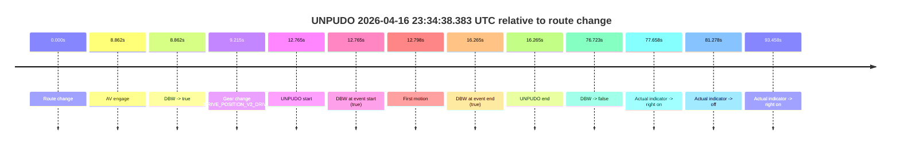
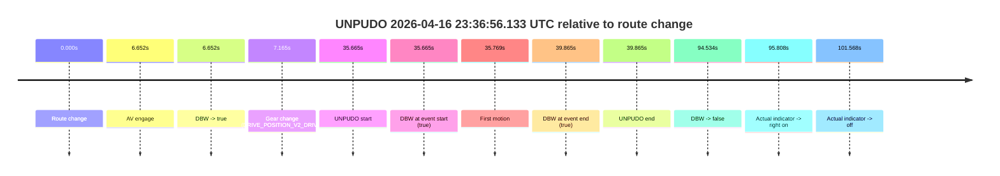
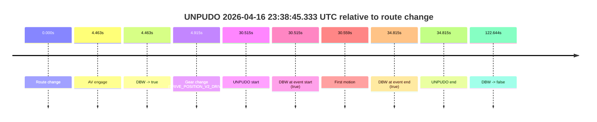

# Run Report: fme10005/2026-04-16--22-18-53--gen2-av-57500da3-ea29-49a9-8e24-8d20ec47e5a0

| Field | Value |
|---|---|
| Run ID | `fme10005/2026-04-16--22-18-53--gen2-av-57500da3-ea29-49a9-8e24-8d20ec47e5a0` |
| Date | `2026-04-16` |
| Model(s) | `eel-teal-outspoken` |
| Author | `zak` |
| Event count | `3` |

## unpudo 2026-04-16 23:34:38.383 UTC

| Field | Value |
|---|---|
| Model | `eel-teal-outspoken` |
| Author | `zak` |
| Run ID | `fme10005/2026-04-16--22-18-53--gen2-av-57500da3-ea29-49a9-8e24-8d20ec47e5a0` |
| Date | `2026-04-16` |
| Time (UTC) | `23:34:38.383` |
| Event type | `unpudo` |
| Disengagement type | `none observed` |
| Route change | `found` |
| Console | [run](https://console.sso.wayve.ai/run/fme10005/2026-04-16--22-18-53--gen2-av-57500da3-ea29-49a9-8e24-8d20ec47e5a0?id=&time-unixus=1776382478383300) |
| Foxglove | [segment](https://app.foxglove.dev/wayve-on-prem/p/prj_0dX18KZdVHg1fmmI/view?ds=foxglove-stream&ds.deviceName=fme10005&ds.start=2026-04-16T23%3A34%3A15.618733Z&ds.end=2026-04-16T23%3A35%3A52.341407Z&layoutId=lay_0e7VD4WIKDQGU73Y&time=2026-04-16T23%3A34%3A38.383300Z) |

### Event card: pass

- Pass: AV owns the credited unpudo from route change through the official unpudo window, the gear state is aligned at the anchor, and the vehicle moves without driver accelerator help in AV.

| Event | Time (UTC) | Delta from route change |
|---|---:|---:|
| Route change | 2026-04-16 23:34:25.618 | `0.000s` |
| AV engage | 2026-04-16 23:34:34.481 | `8.862s` |
| DBW -> true | 2026-04-16 23:34:34.481 | `8.862s` |
| Gear change (DRIVE_POSITION_V2_DRIVE) | 2026-04-16 23:34:34.833 | `9.215s` |
| UNPUDO start | 2026-04-16 23:34:38.383 | `12.765s` |
| DBW at event start (true) | 2026-04-16 23:34:38.383 | `12.765s` |
| First motion | 2026-04-16 23:34:38.416 | `12.798s` |
| DBW at event end (true) | 2026-04-16 23:34:41.883 | `16.265s` |
| UNPUDO end | 2026-04-16 23:34:41.883 | `16.265s` |
| DBW -> false | 2026-04-16 23:35:42.341 | `76.723s` |
| Actual indicator -> right on | 2026-04-16 23:35:43.277 | `77.658s` |
| Actual indicator -> off | 2026-04-16 23:35:46.897 | `81.278s` |
| Actual indicator -> right on | 2026-04-16 23:35:59.076 | `93.458s` |

| Metric | Value |
|---|---|
| Outcome | `pass` |
| Effective failure type | `none` |
| Route change status | `found` |
| DBW at event start | `true` |
| DBW at event end | `true` |
| Predicted gear at AV start | `DRIVE_POSITION_V2_DRIVE` |
| Actual gear at AV start | `DRIVE_POSITION_V2_PARK` |
| Predicted gear at event start | `DRIVE_POSITION_V2_DRIVE` |
| Actual gear at event start | `DRIVE_POSITION_V2_DRIVE` |
| Planned indicator direction | `INDICATORS_STATE_V2_LEFT_ON` |
| Controller indicator direction | `INDICATORS_STATE_V2_LEFT_ON` |
| Actual indicator direction | `INDICATORS_STATE_V2_OFF` |
| Actual indicator at maneuver end | `INDICATORS_STATE_V2_OFF` |
| Driver accel help in AV | `false` |
| Driver accel help timestamp | `n/a` |
| Max accel pedal pct in AV | `0.0%` |
| Max brake pedal pct in AV | `8.9%` |
| Max speed mps in AV | `4.719` |
| Success timing baseline | `route change` |
| Route -> AV | `8.862s` |
| AV -> event start | `3.902s` |
| AV -> first motion | `3.936s` |
| Success baseline -> event start | `12.765s` |
| Success baseline -> first motion | `12.798s` |
| AV duration before disengagement | `67.860s` |
| Trajectory waypoint count | `37` |
| Driving-plan step count | `11` |

The scored portion starts from the AV-owned window, not from the pre-AV setup. Route-change search in the stopped pre-event segment was `found`, with the baseline therefore set to route change. At the event anchor the model predicts `DRIVE_POSITION_V2_DRIVE` and the actual gear is `DRIVE_POSITION_V2_DRIVE`. The effective model outcome is `pass` because `the credited unpudo stays AV-owned through the official unpudo window.`

### Resolution

| Field | Value |
|---|---|
| Final outcome | `pass` |
| Do we agree with this label? | `yes` |
| Source disengagement type | `none observed` |
| Resolved effective failure type | `none` |
| Confidence | `high` |

## unpudo 2026-04-16 23:36:56.133 UTC

| Field | Value |
|---|---|
| Model | `eel-teal-outspoken` |
| Author | `zak` |
| Run ID | `fme10005/2026-04-16--22-18-53--gen2-av-57500da3-ea29-49a9-8e24-8d20ec47e5a0` |
| Date | `2026-04-16` |
| Time (UTC) | `23:36:56.133` |
| Event type | `unpudo` |
| Disengagement type | `none observed` |
| Route change | `found` |
| Console | [run](https://console.sso.wayve.ai/run/fme10005/2026-04-16--22-18-53--gen2-av-57500da3-ea29-49a9-8e24-8d20ec47e5a0?id=&time-unixus=1776382616133309) |
| Foxglove | [segment](https://app.foxglove.dev/wayve-on-prem/p/prj_0dX18KZdVHg1fmmI/view?ds=foxglove-stream&ds.deviceName=fme10005&ds.start=2026-04-16T23%3A36%3A10.468642Z&ds.end=2026-04-16T23%3A38%3A05.002343Z&layoutId=lay_0e7VD4WIKDQGU73Y&time=2026-04-16T23%3A36%3A56.133309Z) |

### Event card: pass

- Pass: AV owns the credited unpudo from route change through the official unpudo window, the gear state is aligned at the anchor, and the vehicle moves without driver accelerator help in AV.

| Event | Time (UTC) | Delta from route change |
|---|---:|---:|
| Route change | 2026-04-16 23:36:20.468 | `0.000s` |
| AV engage | 2026-04-16 23:36:27.120 | `6.652s` |
| DBW -> true | 2026-04-16 23:36:27.120 | `6.652s` |
| Gear change (DRIVE_POSITION_V2_DRIVE) | 2026-04-16 23:36:27.633 | `7.165s` |
| UNPUDO start | 2026-04-16 23:36:56.133 | `35.665s` |
| DBW at event start (true) | 2026-04-16 23:36:56.133 | `35.665s` |
| First motion | 2026-04-16 23:36:56.237 | `35.769s` |
| DBW at event end (true) | 2026-04-16 23:37:00.333 | `39.865s` |
| UNPUDO end | 2026-04-16 23:37:00.333 | `39.865s` |
| DBW -> false | 2026-04-16 23:37:55.002 | `94.534s` |
| Actual indicator -> right on | 2026-04-16 23:37:56.276 | `95.808s` |
| Actual indicator -> off | 2026-04-16 23:38:02.037 | `101.568s` |

| Metric | Value |
|---|---|
| Outcome | `pass` |
| Effective failure type | `none` |
| Route change status | `found` |
| DBW at event start | `true` |
| DBW at event end | `true` |
| Predicted gear at AV start | `DRIVE_POSITION_V2_DRIVE` |
| Actual gear at AV start | `DRIVE_POSITION_V2_PARK` |
| Predicted gear at event start | `DRIVE_POSITION_V2_DRIVE` |
| Actual gear at event start | `DRIVE_POSITION_V2_DRIVE` |
| Planned indicator direction | `INDICATORS_STATE_V2_LEFT_ON` |
| Controller indicator direction | `INDICATORS_STATE_V2_LEFT_ON` |
| Actual indicator direction | `INDICATORS_STATE_V2_OFF` |
| Actual indicator at maneuver end | `INDICATORS_STATE_V2_OFF` |
| Driver accel help in AV | `false` |
| Driver accel help timestamp | `n/a` |
| Max accel pedal pct in AV | `0.0%` |
| Max brake pedal pct in AV | `8.5%` |
| Max speed mps in AV | `5.161` |
| Success timing baseline | `route change` |
| Route -> AV | `6.652s` |
| AV -> event start | `29.013s` |
| AV -> first motion | `29.117s` |
| Success baseline -> event start | `35.665s` |
| Success baseline -> first motion | `35.769s` |
| AV duration before disengagement | `87.882s` |
| Trajectory waypoint count | `36` |
| Driving-plan step count | `11` |

The scored portion starts from the AV-owned window, not from the pre-AV setup. Route-change search in the stopped pre-event segment was `found`, with the baseline therefore set to route change. At the event anchor the model predicts `DRIVE_POSITION_V2_DRIVE` and the actual gear is `DRIVE_POSITION_V2_DRIVE`. The effective model outcome is `pass` because `the credited unpudo stays AV-owned through the official unpudo window.`

### Resolution

| Field | Value |
|---|---|
| Final outcome | `pass` |
| Do we agree with this label? | `yes` |
| Source disengagement type | `none observed` |
| Resolved effective failure type | `none` |
| Confidence | `high` |

## unpudo 2026-04-16 23:38:45.333 UTC

| Field | Value |
|---|---|
| Model | `eel-teal-outspoken` |
| Author | `zak` |
| Run ID | `fme10005/2026-04-16--22-18-53--gen2-av-57500da3-ea29-49a9-8e24-8d20ec47e5a0` |
| Date | `2026-04-16` |
| Time (UTC) | `23:38:45.333` |
| Event type | `unpudo` |
| Disengagement type | `none observed` |
| Route change | `found` |
| Console | [run](https://console.sso.wayve.ai/run/fme10005/2026-04-16--22-18-53--gen2-av-57500da3-ea29-49a9-8e24-8d20ec47e5a0?id=&time-unixus=1776382725333312) |
| Foxglove | [segment](https://app.foxglove.dev/wayve-on-prem/p/prj_0dX18KZdVHg1fmmI/view?ds=foxglove-stream&ds.deviceName=fme10005&ds.start=2026-04-16T23%3A38%3A04.818295Z&ds.end=2026-04-16T23%3A40%3A27.462302Z&layoutId=lay_0e7VD4WIKDQGU73Y&time=2026-04-16T23%3A38%3A45.333312Z) |

### Event card: pass

- Pass: AV owns the credited unpudo from route change through the official unpudo window, the gear state is aligned at the anchor, and the vehicle moves without driver accelerator help in AV.

| Event | Time (UTC) | Delta from route change |
|---|---:|---:|
| Route change | 2026-04-16 23:38:14.818 | `0.000s` |
| AV engage | 2026-04-16 23:38:19.281 | `4.463s` |
| DBW -> true | 2026-04-16 23:38:19.281 | `4.463s` |
| Gear change (DRIVE_POSITION_V2_DRIVE) | 2026-04-16 23:38:19.733 | `4.915s` |
| UNPUDO start | 2026-04-16 23:38:45.333 | `30.515s` |
| DBW at event start (true) | 2026-04-16 23:38:45.333 | `30.515s` |
| First motion | 2026-04-16 23:38:45.377 | `30.559s` |
| DBW at event end (true) | 2026-04-16 23:38:49.633 | `34.815s` |
| UNPUDO end | 2026-04-16 23:38:49.633 | `34.815s` |
| DBW -> false | 2026-04-16 23:40:17.462 | `122.644s` |

| Metric | Value |
|---|---|
| Outcome | `pass` |
| Effective failure type | `none` |
| Route change status | `found` |
| DBW at event start | `true` |
| DBW at event end | `true` |
| Predicted gear at AV start | `DRIVE_POSITION_V2_DRIVE` |
| Actual gear at AV start | `DRIVE_POSITION_V2_PARK` |
| Predicted gear at event start | `DRIVE_POSITION_V2_DRIVE` |
| Actual gear at event start | `DRIVE_POSITION_V2_DRIVE` |
| Planned indicator direction | `INDICATORS_STATE_V2_LEFT_ON` |
| Controller indicator direction | `INDICATORS_STATE_V2_LEFT_ON` |
| Actual indicator direction | `INDICATORS_STATE_V2_OFF` |
| Actual indicator at maneuver end | `INDICATORS_STATE_V2_OFF` |
| Driver accel help in AV | `false` |
| Driver accel help timestamp | `n/a` |
| Max accel pedal pct in AV | `0.0%` |
| Max brake pedal pct in AV | `8.0%` |
| Max speed mps in AV | `4.394` |
| Success timing baseline | `route change` |
| Route -> AV | `4.463s` |
| AV -> event start | `26.052s` |
| AV -> first motion | `26.096s` |
| Success baseline -> event start | `30.515s` |
| Success baseline -> first motion | `30.559s` |
| AV duration before disengagement | `118.181s` |
| Trajectory waypoint count | `38` |
| Driving-plan step count | `11` |

The scored portion starts from the AV-owned window, not from the pre-AV setup. Route-change search in the stopped pre-event segment was `found`, with the baseline therefore set to route change. At the event anchor the model predicts `DRIVE_POSITION_V2_DRIVE` and the actual gear is `DRIVE_POSITION_V2_DRIVE`. The effective model outcome is `pass` because `the credited unpudo stays AV-owned through the official unpudo window.`

### Resolution

| Field | Value |
|---|---|
| Final outcome | `pass` |
| Do we agree with this label? | `yes` |
| Source disengagement type | `none observed` |
| Resolved effective failure type | `none` |
| Confidence | `high` |
