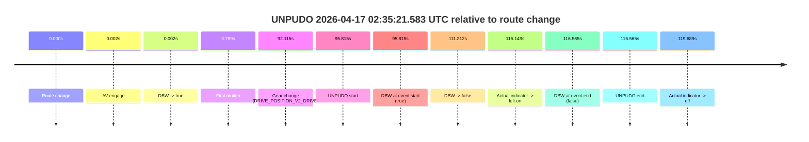
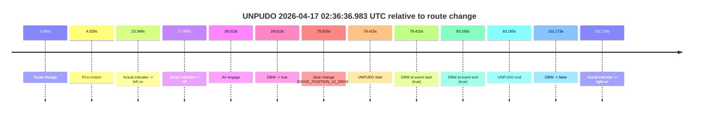

# Run Report: fme10005/2026-04-17--02-22-03--gen2-av-ac26e7cc-757e-4a3d-891d-b16e70ae53f1

| Field | Value |
|---|---|
| Run ID | `fme10005/2026-04-17--02-22-03--gen2-av-ac26e7cc-757e-4a3d-891d-b16e70ae53f1` |
| Date | `2026-04-17` |
| Model(s) | `eel-teal-outspoken` |
| Author | `zak` |
| Event count | `2` |

## unpudo 2026-04-17 02:35:21.583 UTC

| Field | Value |
|---|---|
| Model | `eel-teal-outspoken` |
| Author | `zak` |
| Run ID | `fme10005/2026-04-17--02-22-03--gen2-av-ac26e7cc-757e-4a3d-891d-b16e70ae53f1` |
| Date | `2026-04-17` |
| Time (UTC) | `02:35:21.583` |
| Event type | `unpudo` |
| Disengagement type | `failed_to_slow` |
| Route change | `found` |
| Console | [run](https://console.sso.wayve.ai/run/fme10005/2026-04-17--02-22-03--gen2-av-ac26e7cc-757e-4a3d-891d-b16e70ae53f1?id=&time-unixus=1776393321583314) |
| Foxglove | [segment](https://app.foxglove.dev/wayve-on-prem/p/prj_0dX18KZdVHg1fmmI/view?ds=foxglove-stream&ds.deviceName=fme10005&ds.start=2026-04-17T02%3A33%3A35.768241Z&ds.end=2026-04-17T02%3A35%3A52.333304Z&layoutId=lay_0e7VD4WIKDQGU73Y&time=2026-04-17T02%3A35%3A21.583314Z) |

### Event card: fail

- Fail: AV owns part of the segment, but the event still resolves as a model-performance failure under the AV-only scoring rule.

| Event | Time (UTC) | Delta from route change |
|---|---:|---:|
| Route change | 2026-04-17 02:33:45.768 | `0.000s` |
| AV engage | 2026-04-17 02:33:45.770 | `0.002s` |
| DBW -> true | 2026-04-17 02:33:45.770 | `0.002s` |
| First motion | 2026-04-17 02:33:49.557 | `3.789s` |
| Gear change (DRIVE_POSITION_V2_DRIVE) | 2026-04-17 02:35:17.883 | `92.115s` |
| UNPUDO start | 2026-04-17 02:35:21.583 | `95.815s` |
| DBW at event start (true) | 2026-04-17 02:35:21.583 | `95.815s` |
| DBW -> false | 2026-04-17 02:35:36.980 | `111.212s` |
| Actual indicator -> left on | 2026-04-17 02:35:40.917 | `115.149s` |
| DBW at event end (false) | 2026-04-17 02:35:42.333 | `116.565s` |
| UNPUDO end | 2026-04-17 02:35:42.333 | `116.565s` |
| Actual indicator -> off | 2026-04-17 02:35:45.457 | `119.689s` |

| Metric | Value |
|---|---|
| Outcome | `fail` |
| Effective failure type | `failed_to_slow` |
| Route change status | `found` |
| DBW at event start | `true` |
| DBW at event end | `false` |
| Predicted gear at AV start | `DRIVE_POSITION_V2_PARK` |
| Actual gear at AV start | `DRIVE_POSITION_V2_PARK` |
| Predicted gear at event start | `DRIVE_POSITION_V2_DRIVE` |
| Actual gear at event start | `DRIVE_POSITION_V2_DRIVE` |
| Planned indicator direction | `INDICATORS_STATE_V2_OFF` |
| Controller indicator direction | `INDICATORS_STATE_V2_OFF` |
| Actual indicator direction | `INDICATORS_STATE_V2_OFF` |
| Actual indicator at maneuver end | `INDICATORS_STATE_V2_LEFT_ON` |
| Driver accel help in AV | `false` |
| Driver accel help timestamp | `n/a` |
| Max accel pedal pct in AV | `0.0%` |
| Max brake pedal pct in AV | `26.1%` |
| Max speed mps in AV | `9.475` |
| Success timing baseline | `route change` |
| Route -> AV | `0.002s` |
| AV -> event start | `95.813s` |
| AV -> first motion | `3.787s` |
| Success baseline -> event start | `95.815s` |
| Success baseline -> first motion | `3.789s` |
| AV duration before disengagement | `111.210s` |
| Trajectory waypoint count | `37` |
| Driving-plan step count | `11` |

The scored portion starts from the AV-owned window, not from the pre-AV setup. Route-change search in the stopped pre-event segment was `found`, with the baseline therefore set to route change. At the event anchor the model predicts `DRIVE_POSITION_V2_DRIVE` and the actual gear is `DRIVE_POSITION_V2_DRIVE`. The effective model outcome is `fail` because `failed_to_slow.`

### Resolution

| Field | Value |
|---|---|
| Final outcome | `fail` |
| Do we agree with this label? | `yes` |
| Source disengagement type | `failed_to_slow` |
| Resolved effective failure type | `failed_to_slow` |
| Confidence | `high` |

## unpudo 2026-04-17 02:36:36.983 UTC

| Field | Value |
|---|---|
| Model | `eel-teal-outspoken` |
| Author | `zak` |
| Run ID | `fme10005/2026-04-17--02-22-03--gen2-av-ac26e7cc-757e-4a3d-891d-b16e70ae53f1` |
| Date | `2026-04-17` |
| Time (UTC) | `02:36:36.983` |
| Event type | `unpudo` |
| Disengagement type | `none observed` |
| Route change | `found` |
| Console | [run](https://console.sso.wayve.ai/run/fme10005/2026-04-17--02-22-03--gen2-av-ac26e7cc-757e-4a3d-891d-b16e70ae53f1?id=&time-unixus=1776393396983317) |
| Foxglove | [segment](https://app.foxglove.dev/wayve-on-prem/p/prj_0dX18KZdVHg1fmmI/view?ds=foxglove-stream&ds.deviceName=fme10005&ds.start=2026-04-17T02%3A35%3A07.568243Z&ds.end=2026-04-17T02%3A37%3A08.741143Z&layoutId=lay_0e7VD4WIKDQGU73Y&time=2026-04-17T02%3A36%3A36.983317Z) |

### Event card: pass

- Pass: AV owns the credited unpudo from route change through the official unpudo window, the gear state is aligned at the anchor, and the vehicle moves without driver accelerator help in AV.

| Event | Time (UTC) | Delta from route change |
|---|---:|---:|
| Route change | 2026-04-17 02:35:17.568 | `0.000s` |
| First motion | 2026-04-17 02:35:21.596 | `4.029s` |
| Actual indicator -> left on | 2026-04-17 02:35:40.917 | `23.349s` |
| Actual indicator -> off | 2026-04-17 02:35:45.457 | `27.889s` |
| AV engage | 2026-04-17 02:35:46.581 | `29.013s` |
| DBW -> true | 2026-04-17 02:35:46.581 | `29.013s` |
| Gear change (DRIVE_POSITION_V2_DRIVE) | 2026-04-17 02:36:33.483 | `75.915s` |
| UNPUDO start | 2026-04-17 02:36:36.983 | `79.415s` |
| DBW at event start (true) | 2026-04-17 02:36:36.983 | `79.415s` |
| DBW at event end (true) | 2026-04-17 02:36:40.733 | `83.165s` |
| UNPUDO end | 2026-04-17 02:36:40.733 | `83.165s` |
| DBW -> false | 2026-04-17 02:36:58.741 | `101.173s` |
| Actual indicator -> right on | 2026-04-17 02:36:59.296 | `101.729s` |

| Metric | Value |
|---|---|
| Outcome | `pass` |
| Effective failure type | `none` |
| Route change status | `found` |
| DBW at event start | `true` |
| DBW at event end | `true` |
| Predicted gear at AV start | `DRIVE_POSITION_V2_DRIVE` |
| Actual gear at AV start | `DRIVE_POSITION_V2_DRIVE` |
| Predicted gear at event start | `DRIVE_POSITION_V2_DRIVE` |
| Actual gear at event start | `DRIVE_POSITION_V2_DRIVE` |
| Planned indicator direction | `INDICATORS_STATE_V2_LEFT_ON` |
| Controller indicator direction | `INDICATORS_STATE_V2_LEFT_ON` |
| Actual indicator direction | `INDICATORS_STATE_V2_OFF` |
| Actual indicator at maneuver end | `INDICATORS_STATE_V2_OFF` |
| Driver accel help in AV | `false` |
| Driver accel help timestamp | `n/a` |
| Max accel pedal pct in AV | `0.0%` |
| Max brake pedal pct in AV | `8.1%` |
| Max speed mps in AV | `8.172` |
| Success timing baseline | `route change` |
| Route -> AV | `29.013s` |
| AV -> event start | `50.402s` |
| AV -> first motion | `-24.984s` |
| Success baseline -> event start | `79.415s` |
| Success baseline -> first motion | `4.029s` |
| AV duration before disengagement | `72.160s` |
| Trajectory waypoint count | `37` |
| Driving-plan step count | `11` |

The scored portion starts from the AV-owned window, not from the pre-AV setup. Route-change search in the stopped pre-event segment was `found`, with the baseline therefore set to route change. At the event anchor the model predicts `DRIVE_POSITION_V2_DRIVE` and the actual gear is `DRIVE_POSITION_V2_DRIVE`. The effective model outcome is `pass` because `the credited unpudo stays AV-owned through the official unpudo window.`

### Resolution

| Field | Value |
|---|---|
| Final outcome | `pass` |
| Do we agree with this label? | `yes` |
| Source disengagement type | `none observed` |
| Resolved effective failure type | `none` |
| Confidence | `high` |
