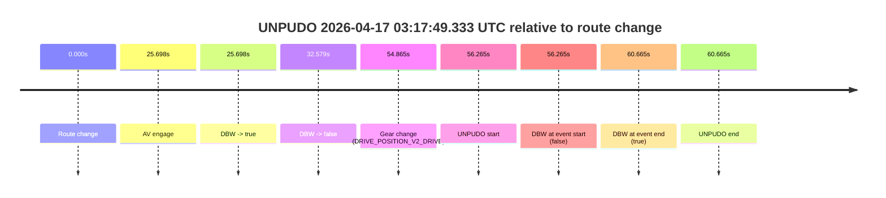
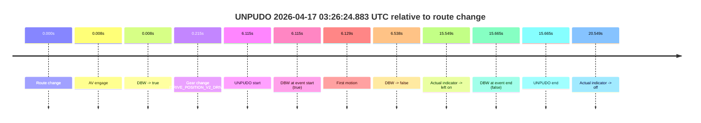
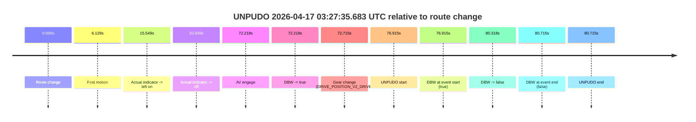
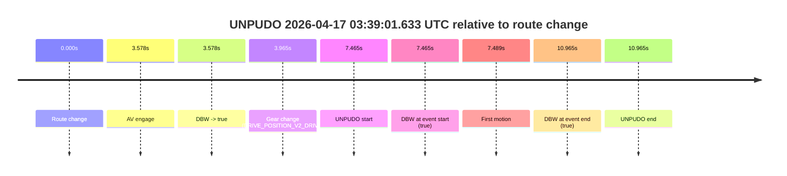

# Run Report: fme10005/2026-04-17--03-14-37--gen2-av-4cd403f2-b1b7-4e7c-afe5-42579f71b741

| Field | Value |
|---|---|
| Run ID | `fme10005/2026-04-17--03-14-37--gen2-av-4cd403f2-b1b7-4e7c-afe5-42579f71b741` |
| Date | `2026-04-17` |
| Model(s) | `pink-manta-ray-smooth` |
| Author | `guy.geva` |
| Event count | `4` |

## unpudo 2026-04-17 03:17:49.333 UTC

| Field | Value |
|---|---|
| Model | `pink-manta-ray-smooth` |
| Author | `guy.geva` |
| Run ID | `fme10005/2026-04-17--03-14-37--gen2-av-4cd403f2-b1b7-4e7c-afe5-42579f71b741` |
| Date | `2026-04-17` |
| Time (UTC) | `03:17:49.333` |
| Event type | `unpudo` |
| Disengagement type | `none observed` |
| Route change | `found` |
| Console | [run](https://console.sso.wayve.ai/run/fme10005/2026-04-17--03-14-37--gen2-av-4cd403f2-b1b7-4e7c-afe5-42579f71b741?id=&time-unixus=1776395869333301) |
| Foxglove | [segment](https://app.foxglove.dev/wayve-on-prem/p/prj_0dX18KZdVHg1fmmI/view?ds=foxglove-stream&ds.deviceName=fme10005&ds.start=2026-04-17T03%3A16%3A43.068282Z&ds.end=2026-04-17T03%3A18%3A03.733321Z&layoutId=lay_0e7VD4WIKDQGU73Y&time=2026-04-17T03%3A17%3A49.333301Z) |

### Event card: fail

- Fail: the credited unpudo does not stay AV-owned. The event window starts with DBW false, and the maneuver outcome lands outside a clean AV-owned segment.

| Event | Time (UTC) | Delta from route change |
|---|---:|---:|
| Route change | 2026-04-17 03:16:53.068 | `0.000s` |
| AV engage | 2026-04-17 03:17:18.766 | `25.698s` |
| DBW -> true | 2026-04-17 03:17:18.766 | `25.698s` |
| DBW -> false | 2026-04-17 03:17:25.647 | `32.579s` |
| Gear change (DRIVE_POSITION_V2_DRIVE) | 2026-04-17 03:17:47.933 | `54.865s` |
| UNPUDO start | 2026-04-17 03:17:49.333 | `56.265s` |
| DBW at event start (false) | 2026-04-17 03:17:49.333 | `56.265s` |
| DBW at event end (true) | 2026-04-17 03:17:53.733 | `60.665s` |
| UNPUDO end | 2026-04-17 03:17:53.733 | `60.665s` |

| Metric | Value |
|---|---|
| Outcome | `fail` |
| Effective failure type | `not_av_owned` |
| Route change status | `found` |
| DBW at event start | `false` |
| DBW at event end | `true` |
| Predicted gear at AV start | `DRIVE_POSITION_V2_REVERSE` |
| Actual gear at AV start | `DRIVE_POSITION_V2_PARK` |
| Predicted gear at event start | `DRIVE_POSITION_V2_DRIVE` |
| Actual gear at event start | `DRIVE_POSITION_V2_DRIVE` |
| Planned indicator direction | `INDICATORS_STATE_V2_OFF` |
| Controller indicator direction | `INDICATORS_STATE_V2_OFF` |
| Actual indicator direction | `INDICATORS_STATE_V2_OFF` |
| Actual indicator at maneuver end | `INDICATORS_STATE_V2_OFF` |
| Driver accel help in AV | `false` |
| Driver accel help timestamp | `n/a` |
| Max accel pedal pct in AV | `0.0%` |
| Max brake pedal pct in AV | `8.0%` |
| Max speed mps in AV | `0.000` |
| Success timing baseline | `route change` |
| Route -> AV | `25.698s` |
| AV -> event start | `30.567s` |
| AV -> first motion | `n/a` |
| Success baseline -> event start | `56.265s` |
| Success baseline -> first motion | `n/a` |
| AV duration before disengagement | `6.881s` |
| Trajectory waypoint count | `37` |
| Driving-plan step count | `11` |

The scored portion starts from the AV-owned window, not from the pre-AV setup. Route-change search in the stopped pre-event segment was `found`, with the baseline therefore set to route change. At the event anchor the model predicts `DRIVE_POSITION_V2_DRIVE` and the actual gear is `DRIVE_POSITION_V2_DRIVE`. The effective model outcome is `fail` because `not_av_owned.`

### Resolution

| Field | Value |
|---|---|
| Final outcome | `fail` |
| Do we agree with this label? | `yes` |
| Source disengagement type | `none observed` |
| Resolved effective failure type | `not_av_owned` |
| Confidence | `high` |

## unpudo 2026-04-17 03:26:24.883 UTC

| Field | Value |
|---|---|
| Model | `pink-manta-ray-smooth` |
| Author | `guy.geva` |
| Run ID | `fme10005/2026-04-17--03-14-37--gen2-av-4cd403f2-b1b7-4e7c-afe5-42579f71b741` |
| Date | `2026-04-17` |
| Time (UTC) | `03:26:24.883` |
| Event type | `unpudo` |
| Disengagement type | `failed_to_unpudo` |
| Route change | `found` |
| Console | [run](https://console.sso.wayve.ai/run/fme10005/2026-04-17--03-14-37--gen2-av-4cd403f2-b1b7-4e7c-afe5-42579f71b741?id=&time-unixus=1776396384883294) |
| Foxglove | [segment](https://app.foxglove.dev/wayve-on-prem/p/prj_0dX18KZdVHg1fmmI/view?ds=foxglove-stream&ds.deviceName=fme10005&ds.start=2026-04-17T03%3A26%3A08.768245Z&ds.end=2026-04-17T03%3A26%3A44.433306Z&layoutId=lay_0e7VD4WIKDQGU73Y&time=2026-04-17T03%3A26%3A24.883294Z) |

### Event card: fail

- Fail: AV owns part of the segment, but the event still resolves as a model-performance failure under the AV-only scoring rule.

| Event | Time (UTC) | Delta from route change |
|---|---:|---:|
| Route change | 2026-04-17 03:26:18.768 | `0.000s` |
| AV engage | 2026-04-17 03:26:18.776 | `0.008s` |
| DBW -> true | 2026-04-17 03:26:18.776 | `0.008s` |
| Gear change (DRIVE_POSITION_V2_DRIVE) | 2026-04-17 03:26:18.983 | `0.215s` |
| UNPUDO start | 2026-04-17 03:26:24.883 | `6.115s` |
| DBW at event start (true) | 2026-04-17 03:26:24.883 | `6.115s` |
| First motion | 2026-04-17 03:26:24.897 | `6.129s` |
| DBW -> false | 2026-04-17 03:26:25.306 | `6.538s` |
| Actual indicator -> left on | 2026-04-17 03:26:34.316 | `15.549s` |
| DBW at event end (false) | 2026-04-17 03:26:34.433 | `15.665s` |
| UNPUDO end | 2026-04-17 03:26:34.433 | `15.665s` |
| Actual indicator -> off | 2026-04-17 03:26:39.317 | `20.549s` |

| Metric | Value |
|---|---|
| Outcome | `fail` |
| Effective failure type | `failed_to_unpudo` |
| Route change status | `found` |
| DBW at event start | `true` |
| DBW at event end | `false` |
| Predicted gear at AV start | `DRIVE_POSITION_V2_PARK` |
| Actual gear at AV start | `DRIVE_POSITION_V2_PARK` |
| Predicted gear at event start | `DRIVE_POSITION_V2_DRIVE` |
| Actual gear at event start | `DRIVE_POSITION_V2_DRIVE` |
| Planned indicator direction | `INDICATORS_STATE_V2_LEFT_ON` |
| Controller indicator direction | `INDICATORS_STATE_V2_LEFT_ON` |
| Actual indicator direction | `INDICATORS_STATE_V2_OFF` |
| Actual indicator at maneuver end | `INDICATORS_STATE_V2_LEFT_ON` |
| Driver accel help in AV | `false` |
| Driver accel help timestamp | `n/a` |
| Max accel pedal pct in AV | `0.0%` |
| Max brake pedal pct in AV | `10.6%` |
| Max speed mps in AV | `1.122` |
| Success timing baseline | `route change` |
| Route -> AV | `0.008s` |
| AV -> event start | `6.107s` |
| AV -> first motion | `6.121s` |
| Success baseline -> event start | `6.115s` |
| Success baseline -> first motion | `6.129s` |
| AV duration before disengagement | `6.530s` |
| Trajectory waypoint count | `36` |
| Driving-plan step count | `11` |

The scored portion starts from the AV-owned window, not from the pre-AV setup. Route-change search in the stopped pre-event segment was `found`, with the baseline therefore set to route change. At the event anchor the model predicts `DRIVE_POSITION_V2_DRIVE` and the actual gear is `DRIVE_POSITION_V2_DRIVE`. The effective model outcome is `fail` because `failed_to_unpudo.`

### Resolution

| Field | Value |
|---|---|
| Final outcome | `fail` |
| Do we agree with this label? | `yes` |
| Source disengagement type | `failed_to_unpudo` |
| Resolved effective failure type | `failed_to_unpudo` |
| Confidence | `high` |

## unpudo 2026-04-17 03:27:35.683 UTC

| Field | Value |
|---|---|
| Model | `pink-manta-ray-smooth` |
| Author | `guy.geva` |
| Run ID | `fme10005/2026-04-17--03-14-37--gen2-av-4cd403f2-b1b7-4e7c-afe5-42579f71b741` |
| Date | `2026-04-17` |
| Time (UTC) | `03:27:35.683` |
| Event type | `unpudo` |
| Disengagement type | `failed_to_unpudo` |
| Route change | `found` |
| Console | [run](https://console.sso.wayve.ai/run/fme10005/2026-04-17--03-14-37--gen2-av-4cd403f2-b1b7-4e7c-afe5-42579f71b741?id=&time-unixus=1776396455683307) |
| Foxglove | [segment](https://app.foxglove.dev/wayve-on-prem/p/prj_0dX18KZdVHg1fmmI/view?ds=foxglove-stream&ds.deviceName=fme10005&ds.start=2026-04-17T03%3A26%3A08.768245Z&ds.end=2026-04-17T03%3A27%3A49.483322Z&layoutId=lay_0e7VD4WIKDQGU73Y&time=2026-04-17T03%3A27%3A35.683307Z) |

### Event card: fail

- Fail: AV owns part of the segment, but the event still resolves as a model-performance failure under the AV-only scoring rule.

| Event | Time (UTC) | Delta from route change |
|---|---:|---:|
| Route change | 2026-04-17 03:26:18.768 | `0.000s` |
| First motion | 2026-04-17 03:26:24.897 | `6.129s` |
| Actual indicator -> left on | 2026-04-17 03:26:34.316 | `15.549s` |
| Actual indicator -> off | 2026-04-17 03:26:39.317 | `20.549s` |
| AV engage | 2026-04-17 03:27:30.986 | `72.218s` |
| DBW -> true | 2026-04-17 03:27:30.986 | `72.218s` |
| Gear change (DRIVE_POSITION_V2_DRIVE) | 2026-04-17 03:27:31.483 | `72.715s` |
| UNPUDO start | 2026-04-17 03:27:35.683 | `76.915s` |
| DBW at event start (true) | 2026-04-17 03:27:35.683 | `76.915s` |
| DBW -> false | 2026-04-17 03:27:39.086 | `80.318s` |
| DBW at event end (false) | 2026-04-17 03:27:39.483 | `80.715s` |
| UNPUDO end | 2026-04-17 03:27:39.483 | `80.715s` |

| Metric | Value |
|---|---|
| Outcome | `fail` |
| Effective failure type | `failed_to_unpudo` |
| Route change status | `found` |
| DBW at event start | `true` |
| DBW at event end | `false` |
| Predicted gear at AV start | `DRIVE_POSITION_V2_DRIVE` |
| Actual gear at AV start | `DRIVE_POSITION_V2_PARK` |
| Predicted gear at event start | `DRIVE_POSITION_V2_DRIVE` |
| Actual gear at event start | `DRIVE_POSITION_V2_DRIVE` |
| Planned indicator direction | `INDICATORS_STATE_V2_LEFT_ON` |
| Controller indicator direction | `INDICATORS_STATE_V2_LEFT_ON` |
| Actual indicator direction | `INDICATORS_STATE_V2_OFF` |
| Actual indicator at maneuver end | `INDICATORS_STATE_V2_OFF` |
| Driver accel help in AV | `false` |
| Driver accel help timestamp | `n/a` |
| Max accel pedal pct in AV | `0.0%` |
| Max brake pedal pct in AV | `8.0%` |
| Max speed mps in AV | `3.781` |
| Success timing baseline | `route change` |
| Route -> AV | `72.218s` |
| AV -> event start | `4.697s` |
| AV -> first motion | `-66.089s` |
| Success baseline -> event start | `76.915s` |
| Success baseline -> first motion | `6.129s` |
| AV duration before disengagement | `8.100s` |
| Trajectory waypoint count | `36` |
| Driving-plan step count | `11` |

The scored portion starts from the AV-owned window, not from the pre-AV setup. Route-change search in the stopped pre-event segment was `found`, with the baseline therefore set to route change. At the event anchor the model predicts `DRIVE_POSITION_V2_DRIVE` and the actual gear is `DRIVE_POSITION_V2_DRIVE`. The effective model outcome is `fail` because `failed_to_unpudo.`

### Resolution

| Field | Value |
|---|---|
| Final outcome | `fail` |
| Do we agree with this label? | `yes` |
| Source disengagement type | `failed_to_unpudo` |
| Resolved effective failure type | `failed_to_unpudo` |
| Confidence | `high` |

## unpudo 2026-04-17 03:39:01.633 UTC

| Field | Value |
|---|---|
| Model | `pink-manta-ray-smooth` |
| Author | `guy.geva` |
| Run ID | `fme10005/2026-04-17--03-14-37--gen2-av-4cd403f2-b1b7-4e7c-afe5-42579f71b741` |
| Date | `2026-04-17` |
| Time (UTC) | `03:39:01.633` |
| Event type | `unpudo` |
| Disengagement type | `none observed` |
| Route change | `found` |
| Console | [run](https://console.sso.wayve.ai/run/fme10005/2026-04-17--03-14-37--gen2-av-4cd403f2-b1b7-4e7c-afe5-42579f71b741?id=&time-unixus=1776397141633304) |
| Foxglove | [segment](https://app.foxglove.dev/wayve-on-prem/p/prj_0dX18KZdVHg1fmmI/view?ds=foxglove-stream&ds.deviceName=fme10005&ds.start=2026-04-17T03%3A38%3A44.168331Z&ds.end=2026-04-17T03%3A39%3A15.133312Z&layoutId=lay_0e7VD4WIKDQGU73Y&time=2026-04-17T03%3A39%3A01.633304Z) |

### Event card: pass

- Pass: AV owns the credited unpudo from route change through the official unpudo window, the gear state is aligned at the anchor, and the vehicle moves without driver accelerator help in AV.

| Event | Time (UTC) | Delta from route change |
|---|---:|---:|
| Route change | 2026-04-17 03:38:54.168 | `0.000s` |
| AV engage | 2026-04-17 03:38:57.746 | `3.578s` |
| DBW -> true | 2026-04-17 03:38:57.746 | `3.578s` |
| Gear change (DRIVE_POSITION_V2_DRIVE) | 2026-04-17 03:38:58.133 | `3.965s` |
| UNPUDO start | 2026-04-17 03:39:01.633 | `7.465s` |
| DBW at event start (true) | 2026-04-17 03:39:01.633 | `7.465s` |
| First motion | 2026-04-17 03:39:01.657 | `7.489s` |
| DBW at event end (true) | 2026-04-17 03:39:05.133 | `10.965s` |
| UNPUDO end | 2026-04-17 03:39:05.133 | `10.965s` |

| Metric | Value |
|---|---|
| Outcome | `pass` |
| Effective failure type | `none` |
| Route change status | `found` |
| DBW at event start | `true` |
| DBW at event end | `true` |
| Predicted gear at AV start | `DRIVE_POSITION_V2_DRIVE` |
| Actual gear at AV start | `DRIVE_POSITION_V2_PARK` |
| Predicted gear at event start | `DRIVE_POSITION_V2_DRIVE` |
| Actual gear at event start | `DRIVE_POSITION_V2_DRIVE` |
| Planned indicator direction | `INDICATORS_STATE_V2_LEFT_ON` |
| Controller indicator direction | `INDICATORS_STATE_V2_LEFT_ON` |
| Actual indicator direction | `INDICATORS_STATE_V2_OFF` |
| Actual indicator at maneuver end | `INDICATORS_STATE_V2_OFF` |
| Driver accel help in AV | `false` |
| Driver accel help timestamp | `n/a` |
| Max accel pedal pct in AV | `0.0%` |
| Max brake pedal pct in AV | `8.0%` |
| Max speed mps in AV | `4.983` |
| Success timing baseline | `route change` |
| Route -> AV | `3.578s` |
| AV -> event start | `3.887s` |
| AV -> first motion | `3.911s` |
| Success baseline -> event start | `7.465s` |
| Success baseline -> first motion | `7.489s` |
| AV duration before disengagement | `n/a` |
| Trajectory waypoint count | `35` |
| Driving-plan step count | `11` |

The scored portion starts from the AV-owned window, not from the pre-AV setup. Route-change search in the stopped pre-event segment was `found`, with the baseline therefore set to route change. At the event anchor the model predicts `DRIVE_POSITION_V2_DRIVE` and the actual gear is `DRIVE_POSITION_V2_DRIVE`. The effective model outcome is `pass` because `the credited unpudo stays AV-owned through the official unpudo window.`

### Resolution

| Field | Value |
|---|---|
| Final outcome | `pass` |
| Do we agree with this label? | `yes` |
| Source disengagement type | `none observed` |
| Resolved effective failure type | `none` |
| Confidence | `high` |
