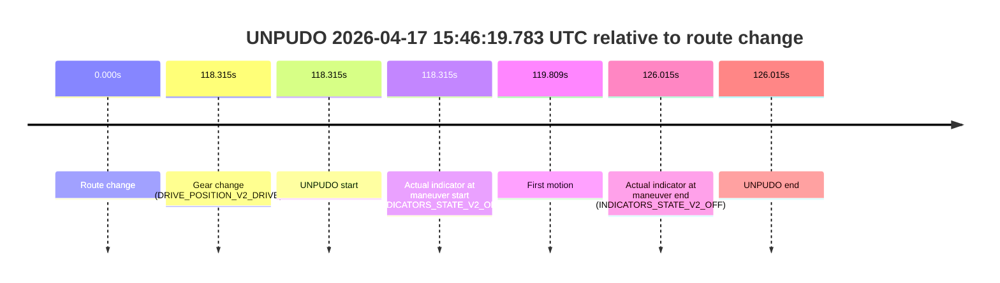
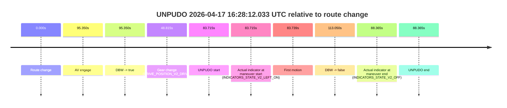
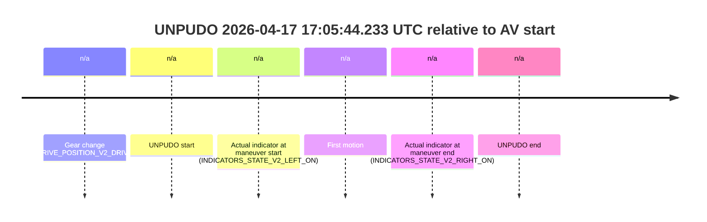
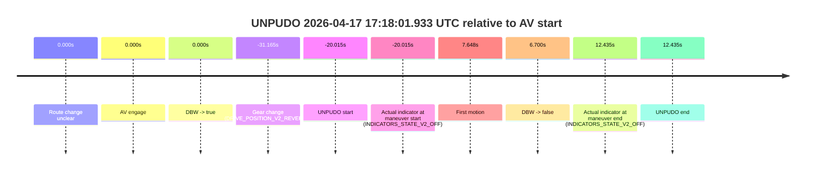
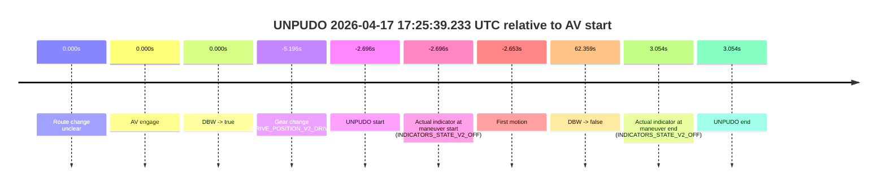
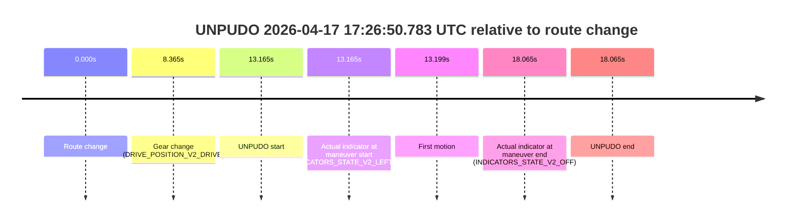
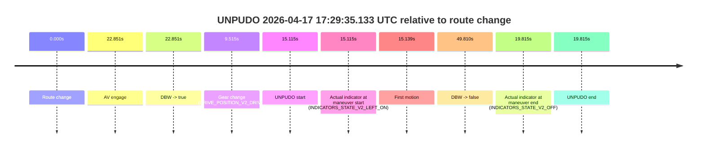
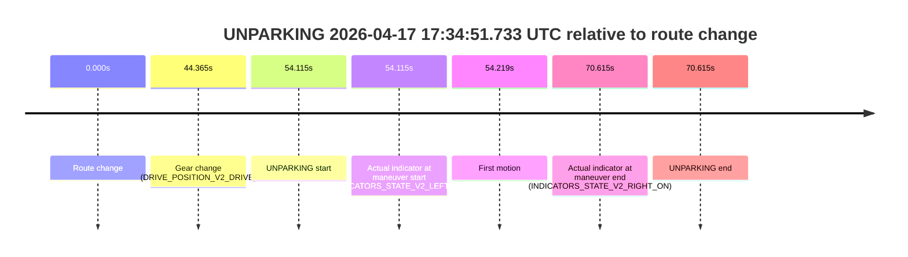

# Run Report: fme10005/2026-04-17--15-43-51--gen2-av-ecc082bf-83de-422f-9659-33433bb7325e

| Field | Value |
|---|---|
| Run ID | `fme10005/2026-04-17--15-43-51--gen2-av-ecc082bf-83de-422f-9659-33433bb7325e` |
| Date | `2026-04-17` |
| Model(s) | `satisfied-amber-moose` |
| Author | `guy.geva` |
| Event count | `16` |

## unpudo 2026-04-17 15:46:19.783 UTC

| Field | Value |
|---|---|
| Model | `satisfied-amber-moose` |
| Author | `guy.geva` |
| Run ID | `fme10005/2026-04-17--15-43-51--gen2-av-ecc082bf-83de-422f-9659-33433bb7325e` |
| Date | `2026-04-17` |
| Time (UTC) | `15:46:19.783` |
| Event type | `unpudo` |
| Disengagement type | `none observed` |
| Route change | `found` |
| Console | [run](https://console.sso.wayve.ai/run/fme10005/2026-04-17--15-43-51--gen2-av-ecc082bf-83de-422f-9659-33433bb7325e?id=&time-unixus=1776440779783311) |
| Foxglove | [segment](https://app.foxglove.dev/wayve-on-prem/p/prj_0dX18KZdVHg1fmmI/view?ds=foxglove-stream&ds.deviceName=fme10005&ds.start=2026-04-17T15%3A44%3A11.468375Z&ds.end=2026-04-17T15%3A46%3A37.483296Z&layoutId=lay_0e7VD4WIKDQGU73Y&time=2026-04-17T15%3A46%3A19.783311Z) |

### Event card: non-av

- Non-AV: the detected unpudo starts outside AV ownership, so it is kept for coverage but excluded from model success / failure scoring.

| Event | Time (UTC) | Delta from route change |
|---|---:|---:|
| Route change | 2026-04-17 15:44:21.468 | `0.000s` |
| Gear change (DRIVE_POSITION_V2_DRIVE) | 2026-04-17 15:46:19.783 | `118.315s` |
| UNPUDO start | 2026-04-17 15:46:19.783 | `118.315s` |
| Actual indicator at maneuver start (INDICATORS_STATE_V2_OFF) | 2026-04-17 15:46:19.783 | `118.315s` |
| First motion | 2026-04-17 15:46:21.276 | `119.809s` |
| Actual indicator at maneuver end (INDICATORS_STATE_V2_OFF) | 2026-04-17 15:46:27.483 | `126.015s` |
| UNPUDO end | 2026-04-17 15:46:27.483 | `126.015s` |

| Metric | Value |
|---|---|
| Outcome | `non-av` |
| Effective failure type | `none` |
| Route change status | `found` |
| DBW at event start | `false` |
| DBW at event end | `false` |
| Predicted gear at AV start | `n/a` |
| Actual gear at AV start | `n/a` |
| Predicted gear at event start | `DRIVE_POSITION_V2_REVERSE` |
| Actual gear at event start | `DRIVE_POSITION_V2_DRIVE` |
| Planned indicator direction | `INDICATORS_STATE_V2_OFF` |
| Controller indicator direction | `INDICATORS_STATE_V2_OFF` |
| Actual indicator direction | `INDICATORS_STATE_V2_OFF` |
| Actual indicator at maneuver end | `INDICATORS_STATE_V2_OFF` |
| Driver accel help in AV | `false` |
| Driver accel help timestamp | `n/a` |
| Max accel pedal pct in AV | `0.0%` |
| Max brake pedal pct in AV | `0.0%` |
| Max speed mps in AV | `0.000` |
| Route -> AV | `n/a` |
| AV -> event start | `n/a` |
| AV -> first motion | `n/a` |
| AV duration before disengagement | `n/a` |
| Trajectory waypoint count | `37` |
| Driving-plan step count | `11` |

The scored portion starts from the AV-owned window, not from the pre-AV setup. Route-change search in the stopped pre-event segment was `found`, with the baseline therefore set to route change. At the event anchor the model predicts `DRIVE_POSITION_V2_REVERSE` and the actual gear is `DRIVE_POSITION_V2_DRIVE`. The effective model outcome is `non-av` because `the event does not begin in AV ownership`.

### Resolution

| Field | Value |
|---|---|
| Final outcome | `non-av` |
| Do we agree with this label? | `yes` |
| Source disengagement type | `none observed` |
| Resolved effective failure type | `none` |
| Confidence | `high` |

## unpudo 2026-04-17 15:57:04.033 UTC

| Field | Value |
|---|---|
| Model | `satisfied-amber-moose` |
| Author | `guy.geva` |
| Run ID | `fme10005/2026-04-17--15-43-51--gen2-av-ecc082bf-83de-422f-9659-33433bb7325e` |
| Date | `2026-04-17` |
| Time (UTC) | `15:57:04.033` |
| Event type | `unpudo` |
| Disengagement type | `failed_to_unpudo` |
| Route change | `found` |
| Console | [run](https://console.sso.wayve.ai/run/fme10005/2026-04-17--15-43-51--gen2-av-ecc082bf-83de-422f-9659-33433bb7325e?id=&time-unixus=1776441424033316) |
| Foxglove | [segment](https://app.foxglove.dev/wayve-on-prem/p/prj_0dX18KZdVHg1fmmI/view?ds=foxglove-stream&ds.deviceName=fme10005&ds.start=2026-04-17T15%3A56%3A33.218272Z&ds.end=2026-04-17T15%3A58%3A40.728290Z&layoutId=lay_0e7VD4WIKDQGU73Y&time=2026-04-17T15%3A57%3A04.033316Z) |

### Event card: accidental

- Accidental: AV ownership is present for less than `2s`, so this is treated as an accidental brush with the maneuver rather than a meaningful model attempt.

| Event | Time (UTC) | Delta from route change |
|---|---:|---:|
| Route change | 2026-04-17 15:56:43.218 | `0.000s` |
| AV engage | 2026-04-17 15:57:46.028 | `62.810s` |
| DBW -> true | 2026-04-17 15:57:46.028 | `62.810s` |
| Gear change (DRIVE_POSITION_V2_REVERSE) | 2026-04-17 15:56:54.683 | `11.465s` |
| UNPUDO start | 2026-04-17 15:57:04.033 | `20.815s` |
| Actual indicator at maneuver start (INDICATORS_STATE_V2_OFF) | 2026-04-17 15:57:04.033 | `20.815s` |
| First motion | 2026-04-17 15:57:16.037 | `32.819s` |
| DBW -> false | 2026-04-17 15:58:30.728 | `107.510s` |
| Actual indicator at maneuver end (INDICATORS_STATE_V2_OFF) | 2026-04-17 15:57:26.683 | `43.465s` |
| UNPUDO end | 2026-04-17 15:57:26.683 | `43.465s` |

| Metric | Value |
|---|---|
| Outcome | `accidental` |
| Effective failure type | `none` |
| Route change status | `found` |
| DBW at event start | `false` |
| DBW at event end | `false` |
| Predicted gear at AV start | `DRIVE_POSITION_V2_DRIVE` |
| Actual gear at AV start | `DRIVE_POSITION_V2_DRIVE` |
| Predicted gear at event start | `DRIVE_POSITION_V2_REVERSE` |
| Actual gear at event start | `DRIVE_POSITION_V2_REVERSE` |
| Planned indicator direction | `INDICATORS_STATE_V2_OFF` |
| Controller indicator direction | `INDICATORS_STATE_V2_OFF` |
| Actual indicator direction | `INDICATORS_STATE_V2_OFF` |
| Actual indicator at maneuver end | `INDICATORS_STATE_V2_OFF` |
| Driver accel help in AV | `false` |
| Driver accel help timestamp | `n/a` |
| Max accel pedal pct in AV | `0.0%` |
| Max brake pedal pct in AV | `0.0%` |
| Max speed mps in AV | `0.000` |
| Route -> AV | `62.810s` |
| AV -> event start | `-41.995s` |
| AV -> first motion | `-29.992s` |
| AV duration before disengagement | `44.700s` |
| Trajectory waypoint count | `36` |
| Driving-plan step count | `11` |

The scored portion starts from the AV-owned window, not from the pre-AV setup. Route-change search in the stopped pre-event segment was `found`, with the baseline therefore set to route change. At the event anchor the model predicts `DRIVE_POSITION_V2_REVERSE` and the actual gear is `DRIVE_POSITION_V2_REVERSE`. The effective model outcome is `accidental` because `the AV-owned portion is shorter than 2s`.

### Resolution

| Field | Value |
|---|---|
| Final outcome | `accidental` |
| Do we agree with this label? | `yes` |
| Source disengagement type | `failed_to_unpudo` |
| Resolved effective failure type | `none` |
| Confidence | `high` |

## unpudo 2026-04-17 15:59:33.533 UTC

| Field | Value |
|---|---|
| Model | `satisfied-amber-moose` |
| Author | `guy.geva` |
| Run ID | `fme10005/2026-04-17--15-43-51--gen2-av-ecc082bf-83de-422f-9659-33433bb7325e` |
| Date | `2026-04-17` |
| Time (UTC) | `15:59:33.533` |
| Event type | `unpudo` |
| Disengagement type | `failed_to_unpudo` |
| Route change | `found` |
| Console | [run](https://console.sso.wayve.ai/run/fme10005/2026-04-17--15-43-51--gen2-av-ecc082bf-83de-422f-9659-33433bb7325e?id=&time-unixus=1776441573533307) |
| Foxglove | [segment](https://app.foxglove.dev/wayve-on-prem/p/prj_0dX18KZdVHg1fmmI/view?ds=foxglove-stream&ds.deviceName=fme10005&ds.start=2026-04-17T15%3A58%3A36.618260Z&ds.end=2026-04-17T15%3A59%3A58.589012Z&layoutId=lay_0e7VD4WIKDQGU73Y&time=2026-04-17T15%3A59%3A33.533307Z) |

### Event card: accidental

- Accidental: AV ownership is present for less than `2s`, so this is treated as an accidental brush with the maneuver rather than a meaningful model attempt.

| Event | Time (UTC) | Delta from route change |
|---|---:|---:|
| Route change | 2026-04-17 15:58:46.618 | `0.000s` |
| AV engage | 2026-04-17 15:59:43.589 | `56.971s` |
| DBW -> true | 2026-04-17 15:59:43.589 | `56.971s` |
| Gear change (DRIVE_POSITION_V2_DRIVE) | 2026-04-17 15:59:23.383 | `36.765s` |
| UNPUDO start | 2026-04-17 15:59:33.533 | `46.915s` |
| Actual indicator at maneuver start (INDICATORS_STATE_V2_LEFT_ON) | 2026-04-17 15:59:33.533 | `46.915s` |
| First motion | 2026-04-17 15:59:33.637 | `47.019s` |
| DBW -> false | 2026-04-17 15:59:48.589 | `61.971s` |
| Actual indicator at maneuver end (INDICATORS_STATE_V2_OFF) | 2026-04-17 15:59:37.883 | `51.265s` |
| UNPUDO end | 2026-04-17 15:59:37.883 | `51.265s` |

| Metric | Value |
|---|---|
| Outcome | `accidental` |
| Effective failure type | `none` |
| Route change status | `found` |
| DBW at event start | `false` |
| DBW at event end | `false` |
| Predicted gear at AV start | `DRIVE_POSITION_V2_DRIVE` |
| Actual gear at AV start | `DRIVE_POSITION_V2_DRIVE` |
| Predicted gear at event start | `DRIVE_POSITION_V2_DRIVE` |
| Actual gear at event start | `DRIVE_POSITION_V2_DRIVE` |
| Planned indicator direction | `INDICATORS_STATE_V2_LEFT_ON` |
| Controller indicator direction | `INDICATORS_STATE_V2_OFF` |
| Actual indicator direction | `INDICATORS_STATE_V2_LEFT_ON` |
| Actual indicator at maneuver end | `INDICATORS_STATE_V2_OFF` |
| Driver accel help in AV | `false` |
| Driver accel help timestamp | `n/a` |
| Max accel pedal pct in AV | `0.0%` |
| Max brake pedal pct in AV | `0.0%` |
| Max speed mps in AV | `0.000` |
| Route -> AV | `56.971s` |
| AV -> event start | `-10.056s` |
| AV -> first motion | `-9.952s` |
| AV duration before disengagement | `5.000s` |
| Trajectory waypoint count | `36` |
| Driving-plan step count | `11` |

The scored portion starts from the AV-owned window, not from the pre-AV setup. Route-change search in the stopped pre-event segment was `found`, with the baseline therefore set to route change. At the event anchor the model predicts `DRIVE_POSITION_V2_DRIVE` and the actual gear is `DRIVE_POSITION_V2_DRIVE`. The effective model outcome is `accidental` because `the AV-owned portion is shorter than 2s`.

### Resolution

| Field | Value |
|---|---|
| Final outcome | `accidental` |
| Do we agree with this label? | `yes` |
| Source disengagement type | `failed_to_unpudo` |
| Resolved effective failure type | `none` |
| Confidence | `high` |

## unpudo 2026-04-17 16:21:47.783 UTC

| Field | Value |
|---|---|
| Model | `satisfied-amber-moose` |
| Author | `guy.geva` |
| Run ID | `fme10005/2026-04-17--15-43-51--gen2-av-ecc082bf-83de-422f-9659-33433bb7325e` |
| Date | `2026-04-17` |
| Time (UTC) | `16:21:47.783` |
| Event type | `unpudo` |
| Disengagement type | `failed_to_unpudo` |
| Route change | `unclear` |
| Console | [run](https://console.sso.wayve.ai/run/fme10005/2026-04-17--15-43-51--gen2-av-ecc082bf-83de-422f-9659-33433bb7325e?id=&time-unixus=1776442907783301) |
| Foxglove | [segment](https://app.foxglove.dev/wayve-on-prem/p/prj_0dX18KZdVHg1fmmI/view?ds=foxglove-stream&ds.deviceName=fme10005&ds.start=2026-04-17T16%3A21%3A37.783301Z&ds.end=2026-04-17T16%3A22%3A44.383300Z&layoutId=lay_0e7VD4WIKDQGU73Y&time=2026-04-17T16%3A21%3A47.783301Z) |

### Event card: non-av

- Non-AV: the detected unpudo starts outside AV ownership, so it is kept for coverage but excluded from model success / failure scoring.

| Event | Time (UTC) | Delta from AV start |
|---|---:|---:|
| Route change unclear | 2026-04-17 16:22:12.008 | `0.000s` |
| AV engage | 2026-04-17 16:22:12.008 | `0.000s` |
| DBW -> true | 2026-04-17 16:22:12.008 | `0.000s` |
| Gear change (DRIVE_POSITION_V2_DRIVE) | 2026-04-17 16:21:47.783 | `-24.225s` |
| UNPUDO start | 2026-04-17 16:21:47.783 | `-24.225s` |
| Actual indicator at maneuver start (INDICATORS_STATE_V2_OFF) | 2026-04-17 16:21:47.783 | `-24.225s` |
| First motion | 2026-04-17 16:21:49.037 | `-22.971s` |
| DBW -> false | 2026-04-17 16:22:19.548 | `7.540s` |
| Actual indicator at maneuver end (INDICATORS_STATE_V2_OFF) | 2026-04-17 16:22:34.383 | `22.375s` |
| UNPUDO end | 2026-04-17 16:22:34.383 | `22.375s` |

| Metric | Value |
|---|---|
| Outcome | `non-av` |
| Effective failure type | `none` |
| Route change status | `unclear` |
| DBW at event start | `false` |
| DBW at event end | `false` |
| Predicted gear at AV start | `DRIVE_POSITION_V2_REVERSE` |
| Actual gear at AV start | `DRIVE_POSITION_V2_PARK` |
| Predicted gear at event start | `DRIVE_POSITION_V2_PARK` |
| Actual gear at event start | `DRIVE_POSITION_V2_DRIVE` |
| Planned indicator direction | `INDICATORS_STATE_V2_OFF` |
| Controller indicator direction | `INDICATORS_STATE_V2_OFF` |
| Actual indicator direction | `INDICATORS_STATE_V2_OFF` |
| Actual indicator at maneuver end | `INDICATORS_STATE_V2_OFF` |
| Driver accel help in AV | `false` |
| Driver accel help timestamp | `n/a` |
| Max accel pedal pct in AV | `0.0%` |
| Max brake pedal pct in AV | `8.0%` |
| Max speed mps in AV | `0.000` |
| Route -> AV | `n/a` |
| AV -> event start | `-24.225s` |
| AV -> first motion | `-22.971s` |
| AV duration before disengagement | `7.540s` |
| Trajectory waypoint count | `37` |
| Driving-plan step count | `11` |

The scored portion starts from the AV-owned window, not from the pre-AV setup. Route-change search in the stopped pre-event segment was `unclear`, with the baseline therefore set to AV start. At the event anchor the model predicts `DRIVE_POSITION_V2_PARK` and the actual gear is `DRIVE_POSITION_V2_DRIVE`. The effective model outcome is `non-av` because `the event does not begin in AV ownership`.

### Resolution

| Field | Value |
|---|---|
| Final outcome | `non-av` |
| Do we agree with this label? | `yes` |
| Source disengagement type | `failed_to_unpudo` |
| Resolved effective failure type | `none` |
| Confidence | `medium` |

## unpudo 2026-04-17 16:28:12.033 UTC

| Field | Value |
|---|---|
| Model | `satisfied-amber-moose` |
| Author | `guy.geva` |
| Run ID | `fme10005/2026-04-17--15-43-51--gen2-av-ecc082bf-83de-422f-9659-33433bb7325e` |
| Date | `2026-04-17` |
| Time (UTC) | `16:28:12.033` |
| Event type | `unpudo` |
| Disengagement type | `failed_to_unpudo` |
| Route change | `found` |
| Console | [run](https://console.sso.wayve.ai/run/fme10005/2026-04-17--15-43-51--gen2-av-ecc082bf-83de-422f-9659-33433bb7325e?id=&time-unixus=1776443292033309) |
| Foxglove | [segment](https://app.foxglove.dev/wayve-on-prem/p/prj_0dX18KZdVHg1fmmI/view?ds=foxglove-stream&ds.deviceName=fme10005&ds.start=2026-04-17T16%3A26%3A38.318275Z&ds.end=2026-04-17T16%3A28%3A51.368701Z&layoutId=lay_0e7VD4WIKDQGU73Y&time=2026-04-17T16%3A28%3A12.033309Z) |

### Event card: accidental

- Accidental: AV ownership is present for less than `2s`, so this is treated as an accidental brush with the maneuver rather than a meaningful model attempt.

| Event | Time (UTC) | Delta from route change |
|---|---:|---:|
| Route change | 2026-04-17 16:26:48.318 | `0.000s` |
| AV engage | 2026-04-17 16:28:23.668 | `95.350s` |
| DBW -> true | 2026-04-17 16:28:23.668 | `95.350s` |
| Gear change (DRIVE_POSITION_V2_DRIVE) | 2026-04-17 16:27:37.133 | `48.815s` |
| UNPUDO start | 2026-04-17 16:28:12.033 | `83.715s` |
| Actual indicator at maneuver start (INDICATORS_STATE_V2_LEFT_ON) | 2026-04-17 16:28:12.033 | `83.715s` |
| First motion | 2026-04-17 16:28:12.057 | `83.739s` |
| DBW -> false | 2026-04-17 16:28:41.368 | `113.050s` |
| Actual indicator at maneuver end (INDICATORS_STATE_V2_OFF) | 2026-04-17 16:28:16.683 | `88.365s` |
| UNPUDO end | 2026-04-17 16:28:16.683 | `88.365s` |

| Metric | Value |
|---|---|
| Outcome | `accidental` |
| Effective failure type | `none` |
| Route change status | `found` |
| DBW at event start | `false` |
| DBW at event end | `false` |
| Predicted gear at AV start | `DRIVE_POSITION_V2_DRIVE` |
| Actual gear at AV start | `DRIVE_POSITION_V2_DRIVE` |
| Predicted gear at event start | `DRIVE_POSITION_V2_DRIVE` |
| Actual gear at event start | `DRIVE_POSITION_V2_DRIVE` |
| Planned indicator direction | `INDICATORS_STATE_V2_LEFT_ON` |
| Controller indicator direction | `INDICATORS_STATE_V2_LEFT_ON` |
| Actual indicator direction | `INDICATORS_STATE_V2_LEFT_ON` |
| Actual indicator at maneuver end | `INDICATORS_STATE_V2_OFF` |
| Driver accel help in AV | `false` |
| Driver accel help timestamp | `n/a` |
| Max accel pedal pct in AV | `0.0%` |
| Max brake pedal pct in AV | `0.0%` |
| Max speed mps in AV | `0.000` |
| Route -> AV | `95.350s` |
| AV -> event start | `-11.635s` |
| AV -> first motion | `-11.611s` |
| AV duration before disengagement | `17.700s` |
| Trajectory waypoint count | `36` |
| Driving-plan step count | `11` |

The scored portion starts from the AV-owned window, not from the pre-AV setup. Route-change search in the stopped pre-event segment was `found`, with the baseline therefore set to route change. At the event anchor the model predicts `DRIVE_POSITION_V2_DRIVE` and the actual gear is `DRIVE_POSITION_V2_DRIVE`. The effective model outcome is `accidental` because `the AV-owned portion is shorter than 2s`.

### Resolution

| Field | Value |
|---|---|
| Final outcome | `accidental` |
| Do we agree with this label? | `yes` |
| Source disengagement type | `failed_to_unpudo` |
| Resolved effective failure type | `none` |
| Confidence | `high` |

## unpudo 2026-04-17 16:51:43.083 UTC

| Field | Value |
|---|---|
| Model | `satisfied-amber-moose` |
| Author | `guy.geva` |
| Run ID | `fme10005/2026-04-17--15-43-51--gen2-av-ecc082bf-83de-422f-9659-33433bb7325e` |
| Date | `2026-04-17` |
| Time (UTC) | `16:51:43.083` |
| Event type | `unpudo` |
| Disengagement type | `failed_to_unpudo` |
| Route change | `found` |
| Console | [run](https://console.sso.wayve.ai/run/fme10005/2026-04-17--15-43-51--gen2-av-ecc082bf-83de-422f-9659-33433bb7325e?id=&time-unixus=1776444703083294) |
| Foxglove | [segment](https://app.foxglove.dev/wayve-on-prem/p/prj_0dX18KZdVHg1fmmI/view?ds=foxglove-stream&ds.deviceName=fme10005&ds.start=2026-04-17T16%3A51%3A00.868316Z&ds.end=2026-04-17T16%3A52%3A16.788322Z&layoutId=lay_0e7VD4WIKDQGU73Y&time=2026-04-17T16%3A51%3A43.083294Z) |

### Event card: accidental

- Accidental: AV ownership is present for less than `2s`, so this is treated as an accidental brush with the maneuver rather than a meaningful model attempt.

| Event | Time (UTC) | Delta from route change |
|---|---:|---:|
| Route change | 2026-04-17 16:51:10.868 | `0.000s` |
| AV engage | 2026-04-17 16:51:50.128 | `39.260s` |
| DBW -> true | 2026-04-17 16:51:50.128 | `39.260s` |
| Gear change (DRIVE_POSITION_V2_DRIVE) | 2026-04-17 16:51:32.333 | `21.465s` |
| UNPUDO start | 2026-04-17 16:51:43.083 | `32.215s` |
| Actual indicator at maneuver start (INDICATORS_STATE_V2_LEFT_ON) | 2026-04-17 16:51:43.083 | `32.215s` |
| First motion | 2026-04-17 16:51:43.177 | `32.309s` |
| DBW -> false | 2026-04-17 16:52:06.788 | `55.920s` |
| Actual indicator at maneuver end (INDICATORS_STATE_V2_LEFT_ON) | 2026-04-17 16:51:47.383 | `36.515s` |
| UNPUDO end | 2026-04-17 16:51:47.383 | `36.515s` |

| Metric | Value |
|---|---|
| Outcome | `accidental` |
| Effective failure type | `none` |
| Route change status | `found` |
| DBW at event start | `false` |
| DBW at event end | `false` |
| Predicted gear at AV start | `DRIVE_POSITION_V2_DRIVE` |
| Actual gear at AV start | `DRIVE_POSITION_V2_DRIVE` |
| Predicted gear at event start | `DRIVE_POSITION_V2_DRIVE` |
| Actual gear at event start | `DRIVE_POSITION_V2_DRIVE` |
| Planned indicator direction | `INDICATORS_STATE_V2_LEFT_ON` |
| Controller indicator direction | `INDICATORS_STATE_V2_LEFT_ON` |
| Actual indicator direction | `INDICATORS_STATE_V2_LEFT_ON` |
| Actual indicator at maneuver end | `INDICATORS_STATE_V2_LEFT_ON` |
| Driver accel help in AV | `false` |
| Driver accel help timestamp | `n/a` |
| Max accel pedal pct in AV | `0.0%` |
| Max brake pedal pct in AV | `0.0%` |
| Max speed mps in AV | `0.000` |
| Route -> AV | `39.260s` |
| AV -> event start | `-7.045s` |
| AV -> first motion | `-6.951s` |
| AV duration before disengagement | `16.660s` |
| Trajectory waypoint count | `37` |
| Driving-plan step count | `11` |

The scored portion starts from the AV-owned window, not from the pre-AV setup. Route-change search in the stopped pre-event segment was `found`, with the baseline therefore set to route change. At the event anchor the model predicts `DRIVE_POSITION_V2_DRIVE` and the actual gear is `DRIVE_POSITION_V2_DRIVE`. The effective model outcome is `accidental` because `the AV-owned portion is shorter than 2s`.

### Resolution

| Field | Value |
|---|---|
| Final outcome | `accidental` |
| Do we agree with this label? | `yes` |
| Source disengagement type | `failed_to_unpudo` |
| Resolved effective failure type | `none` |
| Confidence | `high` |

## unpudo 2026-04-17 17:03:50.833 UTC

| Field | Value |
|---|---|
| Model | `satisfied-amber-moose` |
| Author | `guy.geva` |
| Run ID | `fme10005/2026-04-17--15-43-51--gen2-av-ecc082bf-83de-422f-9659-33433bb7325e` |
| Date | `2026-04-17` |
| Time (UTC) | `17:03:50.833` |
| Event type | `unpudo` |
| Disengagement type | `failed_to_unpudo` |
| Route change | `found` |
| Console | [run](https://console.sso.wayve.ai/run/fme10005/2026-04-17--15-43-51--gen2-av-ecc082bf-83de-422f-9659-33433bb7325e?id=&time-unixus=1776445430833313) |
| Foxglove | [segment](https://app.foxglove.dev/wayve-on-prem/p/prj_0dX18KZdVHg1fmmI/view?ds=foxglove-stream&ds.deviceName=fme10005&ds.start=2026-04-17T17%3A03%3A28.618248Z&ds.end=2026-04-17T17%3A05%3A12.748516Z&layoutId=lay_0e7VD4WIKDQGU73Y&time=2026-04-17T17%3A03%3A50.833313Z) |

### Event card: accidental

- Accidental: AV ownership is present for less than `2s`, so this is treated as an accidental brush with the maneuver rather than a meaningful model attempt.

| Event | Time (UTC) | Delta from route change |
|---|---:|---:|
| Route change | 2026-04-17 17:03:38.618 | `0.000s` |
| AV engage | 2026-04-17 17:04:03.189 | `24.571s` |
| DBW -> true | 2026-04-17 17:04:03.189 | `24.571s` |
| Gear change (DRIVE_POSITION_V2_DRIVE) | 2026-04-17 17:03:38.933 | `0.315s` |
| UNPUDO start | 2026-04-17 17:03:50.833 | `12.215s` |
| Actual indicator at maneuver start (INDICATORS_STATE_V2_LEFT_ON) | 2026-04-17 17:03:50.833 | `12.215s` |
| First motion | 2026-04-17 17:03:50.876 | `12.259s` |
| DBW -> false | 2026-04-17 17:05:02.748 | `84.130s` |
| Actual indicator at maneuver end (INDICATORS_STATE_V2_OFF) | 2026-04-17 17:03:55.233 | `16.615s` |
| UNPUDO end | 2026-04-17 17:03:55.233 | `16.615s` |

| Metric | Value |
|---|---|
| Outcome | `accidental` |
| Effective failure type | `none` |
| Route change status | `found` |
| DBW at event start | `false` |
| DBW at event end | `false` |
| Predicted gear at AV start | `DRIVE_POSITION_V2_DRIVE` |
| Actual gear at AV start | `DRIVE_POSITION_V2_DRIVE` |
| Predicted gear at event start | `DRIVE_POSITION_V2_DRIVE` |
| Actual gear at event start | `DRIVE_POSITION_V2_DRIVE` |
| Planned indicator direction | `INDICATORS_STATE_V2_LEFT_ON` |
| Controller indicator direction | `INDICATORS_STATE_V2_LEFT_ON` |
| Actual indicator direction | `INDICATORS_STATE_V2_LEFT_ON` |
| Actual indicator at maneuver end | `INDICATORS_STATE_V2_OFF` |
| Driver accel help in AV | `false` |
| Driver accel help timestamp | `n/a` |
| Max accel pedal pct in AV | `0.0%` |
| Max brake pedal pct in AV | `0.0%` |
| Max speed mps in AV | `0.000` |
| Route -> AV | `24.571s` |
| AV -> event start | `-12.356s` |
| AV -> first motion | `-12.313s` |
| AV duration before disengagement | `59.559s` |
| Trajectory waypoint count | `36` |
| Driving-plan step count | `11` |

The scored portion starts from the AV-owned window, not from the pre-AV setup. Route-change search in the stopped pre-event segment was `found`, with the baseline therefore set to route change. At the event anchor the model predicts `DRIVE_POSITION_V2_DRIVE` and the actual gear is `DRIVE_POSITION_V2_DRIVE`. The effective model outcome is `accidental` because `the AV-owned portion is shorter than 2s`.

### Resolution

| Field | Value |
|---|---|
| Final outcome | `accidental` |
| Do we agree with this label? | `yes` |
| Source disengagement type | `failed_to_unpudo` |
| Resolved effective failure type | `none` |
| Confidence | `high` |

## unpudo 2026-04-17 17:05:44.233 UTC

| Field | Value |
|---|---|
| Model | `satisfied-amber-moose` |
| Author | `guy.geva` |
| Run ID | `fme10005/2026-04-17--15-43-51--gen2-av-ecc082bf-83de-422f-9659-33433bb7325e` |
| Date | `2026-04-17` |
| Time (UTC) | `17:05:44.233` |
| Event type | `unpudo` |
| Disengagement type | `none observed` |
| Route change | `unclear` |
| Console | [run](https://console.sso.wayve.ai/run/fme10005/2026-04-17--15-43-51--gen2-av-ecc082bf-83de-422f-9659-33433bb7325e?id=&time-unixus=1776445544233292) |
| Foxglove | [segment](https://app.foxglove.dev/wayve-on-prem/p/prj_0dX18KZdVHg1fmmI/view?ds=foxglove-stream&ds.deviceName=fme10005&ds.start=2026-04-17T17%3A05%3A31.633313Z&ds.end=2026-04-17T17%3A06%3A01.483312Z&layoutId=lay_0e7VD4WIKDQGU73Y&time=2026-04-17T17%3A05%3A44.233292Z) |

### Event card: non-av

- Non-AV: the detected unpudo starts outside AV ownership, so it is kept for coverage but excluded from model success / failure scoring.

| Event | Time (UTC) | Delta from AV start |
|---|---:|---:|
| Gear change (DRIVE_POSITION_V2_DRIVE) | 2026-04-17 17:05:41.633 | `n/a` |
| UNPUDO start | 2026-04-17 17:05:44.233 | `n/a` |
| Actual indicator at maneuver start (INDICATORS_STATE_V2_LEFT_ON) | 2026-04-17 17:05:44.233 | `n/a` |
| First motion | 2026-04-17 17:05:44.277 | `n/a` |
| Actual indicator at maneuver end (INDICATORS_STATE_V2_RIGHT_ON) | 2026-04-17 17:05:51.483 | `n/a` |
| UNPUDO end | 2026-04-17 17:05:51.483 | `n/a` |

| Metric | Value |
|---|---|
| Outcome | `non-av` |
| Effective failure type | `none` |
| Route change status | `unclear` |
| DBW at event start | `false` |
| DBW at event end | `false` |
| Predicted gear at AV start | `n/a` |
| Actual gear at AV start | `n/a` |
| Predicted gear at event start | `DRIVE_POSITION_V2_DRIVE` |
| Actual gear at event start | `DRIVE_POSITION_V2_DRIVE` |
| Planned indicator direction | `INDICATORS_STATE_V2_OFF` |
| Controller indicator direction | `INDICATORS_STATE_V2_OFF` |
| Actual indicator direction | `INDICATORS_STATE_V2_LEFT_ON` |
| Actual indicator at maneuver end | `INDICATORS_STATE_V2_RIGHT_ON` |
| Driver accel help in AV | `false` |
| Driver accel help timestamp | `n/a` |
| Max accel pedal pct in AV | `0.0%` |
| Max brake pedal pct in AV | `0.0%` |
| Max speed mps in AV | `0.000` |
| Route -> AV | `n/a` |
| AV -> event start | `n/a` |
| AV -> first motion | `n/a` |
| AV duration before disengagement | `n/a` |
| Trajectory waypoint count | `36` |
| Driving-plan step count | `11` |

The scored portion starts from the AV-owned window, not from the pre-AV setup. Route-change search in the stopped pre-event segment was `unclear`, with the baseline therefore set to AV start. At the event anchor the model predicts `DRIVE_POSITION_V2_DRIVE` and the actual gear is `DRIVE_POSITION_V2_DRIVE`. The effective model outcome is `non-av` because `the event does not begin in AV ownership`.

### Resolution

| Field | Value |
|---|---|
| Final outcome | `non-av` |
| Do we agree with this label? | `yes` |
| Source disengagement type | `none observed` |
| Resolved effective failure type | `none` |
| Confidence | `medium` |

## unpudo 2026-04-17 17:07:08.483 UTC

| Field | Value |
|---|---|
| Model | `satisfied-amber-moose` |
| Author | `guy.geva` |
| Run ID | `fme10005/2026-04-17--15-43-51--gen2-av-ecc082bf-83de-422f-9659-33433bb7325e` |
| Date | `2026-04-17` |
| Time (UTC) | `17:07:08.483` |
| Event type | `unpudo` |
| Disengagement type | `failed_to_unpudo` |
| Route change | `found` |
| Console | [run](https://console.sso.wayve.ai/run/fme10005/2026-04-17--15-43-51--gen2-av-ecc082bf-83de-422f-9659-33433bb7325e?id=&time-unixus=1776445628483300) |
| Foxglove | [segment](https://app.foxglove.dev/wayve-on-prem/p/prj_0dX18KZdVHg1fmmI/view?ds=foxglove-stream&ds.deviceName=fme10005&ds.start=2026-04-17T17%3A06%3A21.668310Z&ds.end=2026-04-17T17%3A09%3A28.187719Z&layoutId=lay_0e7VD4WIKDQGU73Y&time=2026-04-17T17%3A07%3A08.483300Z) |

### Event card: accidental

- Accidental: AV ownership is present for less than `2s`, so this is treated as an accidental brush with the maneuver rather than a meaningful model attempt.

| Event | Time (UTC) | Delta from route change |
|---|---:|---:|
| Route change | 2026-04-17 17:06:31.668 | `0.000s` |
| AV engage | 2026-04-17 17:07:23.888 | `52.220s` |
| DBW -> true | 2026-04-17 17:07:23.888 | `52.220s` |
| Gear change (DRIVE_POSITION_V2_DRIVE) | 2026-04-17 17:06:54.183 | `22.515s` |
| UNPUDO start | 2026-04-17 17:07:08.483 | `36.815s` |
| Actual indicator at maneuver start (INDICATORS_STATE_V2_LEFT_ON) | 2026-04-17 17:07:08.483 | `36.815s` |
| First motion | 2026-04-17 17:07:08.516 | `36.849s` |
| DBW -> false | 2026-04-17 17:09:18.187 | `166.519s` |
| Actual indicator at maneuver end (INDICATORS_STATE_V2_OFF) | 2026-04-17 17:07:13.283 | `41.615s` |
| UNPUDO end | 2026-04-17 17:07:13.283 | `41.615s` |

| Metric | Value |
|---|---|
| Outcome | `accidental` |
| Effective failure type | `none` |
| Route change status | `found` |
| DBW at event start | `false` |
| DBW at event end | `false` |
| Predicted gear at AV start | `DRIVE_POSITION_V2_DRIVE` |
| Actual gear at AV start | `DRIVE_POSITION_V2_DRIVE` |
| Predicted gear at event start | `DRIVE_POSITION_V2_DRIVE` |
| Actual gear at event start | `DRIVE_POSITION_V2_DRIVE` |
| Planned indicator direction | `INDICATORS_STATE_V2_LEFT_ON` |
| Controller indicator direction | `INDICATORS_STATE_V2_LEFT_ON` |
| Actual indicator direction | `INDICATORS_STATE_V2_LEFT_ON` |
| Actual indicator at maneuver end | `INDICATORS_STATE_V2_OFF` |
| Driver accel help in AV | `false` |
| Driver accel help timestamp | `n/a` |
| Max accel pedal pct in AV | `0.0%` |
| Max brake pedal pct in AV | `0.0%` |
| Max speed mps in AV | `0.000` |
| Route -> AV | `52.220s` |
| AV -> event start | `-15.405s` |
| AV -> first motion | `-15.371s` |
| AV duration before disengagement | `114.299s` |
| Trajectory waypoint count | `37` |
| Driving-plan step count | `11` |

The scored portion starts from the AV-owned window, not from the pre-AV setup. Route-change search in the stopped pre-event segment was `found`, with the baseline therefore set to route change. At the event anchor the model predicts `DRIVE_POSITION_V2_DRIVE` and the actual gear is `DRIVE_POSITION_V2_DRIVE`. The effective model outcome is `accidental` because `the AV-owned portion is shorter than 2s`.

### Resolution

| Field | Value |
|---|---|
| Final outcome | `accidental` |
| Do we agree with this label? | `yes` |
| Source disengagement type | `failed_to_unpudo` |
| Resolved effective failure type | `none` |
| Confidence | `high` |

## unpudo 2026-04-17 17:18:01.933 UTC

| Field | Value |
|---|---|
| Model | `satisfied-amber-moose` |
| Author | `guy.geva` |
| Run ID | `fme10005/2026-04-17--15-43-51--gen2-av-ecc082bf-83de-422f-9659-33433bb7325e` |
| Date | `2026-04-17` |
| Time (UTC) | `17:18:01.933` |
| Event type | `unpudo` |
| Disengagement type | `uncategorised` |
| Route change | `unclear` |
| Console | [run](https://console.sso.wayve.ai/run/fme10005/2026-04-17--15-43-51--gen2-av-ecc082bf-83de-422f-9659-33433bb7325e?id=&time-unixus=1776446281933310) |
| Foxglove | [segment](https://app.foxglove.dev/wayve-on-prem/p/prj_0dX18KZdVHg1fmmI/view?ds=foxglove-stream&ds.deviceName=fme10005&ds.start=2026-04-17T17%3A17%3A40.783320Z&ds.end=2026-04-17T17%3A18%3A44.383306Z&layoutId=lay_0e7VD4WIKDQGU73Y&time=2026-04-17T17%3A18%3A01.933310Z) |

### Event card: non-av

- Non-AV: the detected unpudo starts outside AV ownership, so it is kept for coverage but excluded from model success / failure scoring.

| Event | Time (UTC) | Delta from AV start |
|---|---:|---:|
| Route change unclear | 2026-04-17 17:18:21.948 | `0.000s` |
| AV engage | 2026-04-17 17:18:21.948 | `0.000s` |
| DBW -> true | 2026-04-17 17:18:21.948 | `0.000s` |
| Gear change (DRIVE_POSITION_V2_REVERSE) | 2026-04-17 17:17:50.783 | `-31.165s` |
| UNPUDO start | 2026-04-17 17:18:01.933 | `-20.015s` |
| Actual indicator at maneuver start (INDICATORS_STATE_V2_OFF) | 2026-04-17 17:18:01.933 | `-20.015s` |
| First motion | 2026-04-17 17:18:29.596 | `7.648s` |
| DBW -> false | 2026-04-17 17:18:28.648 | `6.700s` |
| Actual indicator at maneuver end (INDICATORS_STATE_V2_OFF) | 2026-04-17 17:18:34.383 | `12.435s` |
| UNPUDO end | 2026-04-17 17:18:34.383 | `12.435s` |

| Metric | Value |
|---|---|
| Outcome | `non-av` |
| Effective failure type | `none` |
| Route change status | `unclear` |
| DBW at event start | `false` |
| DBW at event end | `false` |
| Predicted gear at AV start | `DRIVE_POSITION_V2_DRIVE` |
| Actual gear at AV start | `DRIVE_POSITION_V2_PARK` |
| Predicted gear at event start | `DRIVE_POSITION_V2_REVERSE` |
| Actual gear at event start | `DRIVE_POSITION_V2_REVERSE` |
| Planned indicator direction | `INDICATORS_STATE_V2_OFF` |
| Controller indicator direction | `INDICATORS_STATE_V2_OFF` |
| Actual indicator direction | `INDICATORS_STATE_V2_OFF` |
| Actual indicator at maneuver end | `INDICATORS_STATE_V2_OFF` |
| Driver accel help in AV | `false` |
| Driver accel help timestamp | `n/a` |
| Max accel pedal pct in AV | `0.0%` |
| Max brake pedal pct in AV | `11.1%` |
| Max speed mps in AV | `0.000` |
| Route -> AV | `n/a` |
| AV -> event start | `-20.015s` |
| AV -> first motion | `7.648s` |
| AV duration before disengagement | `6.700s` |
| Trajectory waypoint count | `36` |
| Driving-plan step count | `11` |

The scored portion starts from the AV-owned window, not from the pre-AV setup. Route-change search in the stopped pre-event segment was `unclear`, with the baseline therefore set to AV start. At the event anchor the model predicts `DRIVE_POSITION_V2_REVERSE` and the actual gear is `DRIVE_POSITION_V2_REVERSE`. The effective model outcome is `non-av` because `the event does not begin in AV ownership`.

### Resolution

| Field | Value |
|---|---|
| Final outcome | `non-av` |
| Do we agree with this label? | `yes` |
| Source disengagement type | `uncategorised` |
| Resolved effective failure type | `none` |
| Confidence | `medium` |

## unpudo 2026-04-17 17:22:39.933 UTC

| Field | Value |
|---|---|
| Model | `satisfied-amber-moose` |
| Author | `guy.geva` |
| Run ID | `fme10005/2026-04-17--15-43-51--gen2-av-ecc082bf-83de-422f-9659-33433bb7325e` |
| Date | `2026-04-17` |
| Time (UTC) | `17:22:39.933` |
| Event type | `unpudo` |
| Disengagement type | `failed_to_unpudo` |
| Route change | `found` |
| Console | [run](https://console.sso.wayve.ai/run/fme10005/2026-04-17--15-43-51--gen2-av-ecc082bf-83de-422f-9659-33433bb7325e?id=&time-unixus=1776446559933299) |
| Foxglove | [segment](https://app.foxglove.dev/wayve-on-prem/p/prj_0dX18KZdVHg1fmmI/view?ds=foxglove-stream&ds.deviceName=fme10005&ds.start=2026-04-17T17%3A21%3A21.118305Z&ds.end=2026-04-17T17%3A25%3A31.068305Z&layoutId=lay_0e7VD4WIKDQGU73Y&time=2026-04-17T17%3A22%3A39.933299Z) |

### Event card: accidental

- Accidental: AV ownership is present for less than `2s`, so this is treated as an accidental brush with the maneuver rather than a meaningful model attempt.

| Event | Time (UTC) | Delta from route change |
|---|---:|---:|
| Route change | 2026-04-17 17:21:31.118 | `0.000s` |
| AV engage | 2026-04-17 17:22:56.708 | `85.590s` |
| DBW -> true | 2026-04-17 17:22:56.708 | `85.590s` |
| Gear change (DRIVE_POSITION_V2_REVERSE) | 2026-04-17 17:22:27.183 | `56.065s` |
| UNPUDO start | 2026-04-17 17:22:39.933 | `68.815s` |
| Actual indicator at maneuver start (INDICATORS_STATE_V2_OFF) | 2026-04-17 17:22:39.933 | `68.815s` |
| First motion | 2026-04-17 17:22:42.397 | `71.279s` |
| DBW -> false | 2026-04-17 17:25:21.068 | `229.950s` |
| Actual indicator at maneuver end (INDICATORS_STATE_V2_OFF) | 2026-04-17 17:22:45.933 | `74.815s` |
| UNPUDO end | 2026-04-17 17:22:45.933 | `74.815s` |

| Metric | Value |
|---|---|
| Outcome | `accidental` |
| Effective failure type | `none` |
| Route change status | `found` |
| DBW at event start | `false` |
| DBW at event end | `false` |
| Predicted gear at AV start | `DRIVE_POSITION_V2_DRIVE` |
| Actual gear at AV start | `DRIVE_POSITION_V2_DRIVE` |
| Predicted gear at event start | `DRIVE_POSITION_V2_REVERSE` |
| Actual gear at event start | `DRIVE_POSITION_V2_REVERSE` |
| Planned indicator direction | `INDICATORS_STATE_V2_OFF` |
| Controller indicator direction | `INDICATORS_STATE_V2_OFF` |
| Actual indicator direction | `INDICATORS_STATE_V2_OFF` |
| Actual indicator at maneuver end | `INDICATORS_STATE_V2_OFF` |
| Driver accel help in AV | `false` |
| Driver accel help timestamp | `n/a` |
| Max accel pedal pct in AV | `0.0%` |
| Max brake pedal pct in AV | `0.0%` |
| Max speed mps in AV | `0.000` |
| Route -> AV | `85.590s` |
| AV -> event start | `-16.775s` |
| AV -> first motion | `-14.311s` |
| AV duration before disengagement | `144.360s` |
| Trajectory waypoint count | `36` |
| Driving-plan step count | `11` |

The scored portion starts from the AV-owned window, not from the pre-AV setup. Route-change search in the stopped pre-event segment was `found`, with the baseline therefore set to route change. At the event anchor the model predicts `DRIVE_POSITION_V2_REVERSE` and the actual gear is `DRIVE_POSITION_V2_REVERSE`. The effective model outcome is `accidental` because `the AV-owned portion is shorter than 2s`.

### Resolution

| Field | Value |
|---|---|
| Final outcome | `accidental` |
| Do we agree with this label? | `yes` |
| Source disengagement type | `failed_to_unpudo` |
| Resolved effective failure type | `none` |
| Confidence | `high` |

## unpudo 2026-04-17 17:25:39.233 UTC

| Field | Value |
|---|---|
| Model | `satisfied-amber-moose` |
| Author | `guy.geva` |
| Run ID | `fme10005/2026-04-17--15-43-51--gen2-av-ecc082bf-83de-422f-9659-33433bb7325e` |
| Date | `2026-04-17` |
| Time (UTC) | `17:25:39.233` |
| Event type | `unpudo` |
| Disengagement type | `none observed` |
| Route change | `unclear` |
| Console | [run](https://console.sso.wayve.ai/run/fme10005/2026-04-17--15-43-51--gen2-av-ecc082bf-83de-422f-9659-33433bb7325e?id=&time-unixus=1776446739233322) |
| Foxglove | [segment](https://app.foxglove.dev/wayve-on-prem/p/prj_0dX18KZdVHg1fmmI/view?ds=foxglove-stream&ds.deviceName=fme10005&ds.start=2026-04-17T17%3A25%3A26.733313Z&ds.end=2026-04-17T17%3A26%3A54.288510Z&layoutId=lay_0e7VD4WIKDQGU73Y&time=2026-04-17T17%3A25%3A39.233322Z) |

### Event card: non-av

- Non-AV: the detected unpudo starts outside AV ownership, so it is kept for coverage but excluded from model success / failure scoring.

| Event | Time (UTC) | Delta from AV start |
|---|---:|---:|
| Route change unclear | 2026-04-17 17:25:41.929 | `0.000s` |
| AV engage | 2026-04-17 17:25:41.929 | `0.000s` |
| DBW -> true | 2026-04-17 17:25:41.929 | `0.000s` |
| Gear change (DRIVE_POSITION_V2_DRIVE) | 2026-04-17 17:25:36.733 | `-5.196s` |
| UNPUDO start | 2026-04-17 17:25:39.233 | `-2.696s` |
| Actual indicator at maneuver start (INDICATORS_STATE_V2_OFF) | 2026-04-17 17:25:39.233 | `-2.696s` |
| First motion | 2026-04-17 17:25:39.276 | `-2.653s` |
| DBW -> false | 2026-04-17 17:26:44.288 | `62.359s` |
| Actual indicator at maneuver end (INDICATORS_STATE_V2_OFF) | 2026-04-17 17:25:44.983 | `3.054s` |
| UNPUDO end | 2026-04-17 17:25:44.983 | `3.054s` |

| Metric | Value |
|---|---|
| Outcome | `non-av` |
| Effective failure type | `none` |
| Route change status | `unclear` |
| DBW at event start | `false` |
| DBW at event end | `true` |
| Predicted gear at AV start | `DRIVE_POSITION_V2_DRIVE` |
| Actual gear at AV start | `DRIVE_POSITION_V2_DRIVE` |
| Predicted gear at event start | `DRIVE_POSITION_V2_DRIVE` |
| Actual gear at event start | `DRIVE_POSITION_V2_DRIVE` |
| Planned indicator direction | `INDICATORS_STATE_V2_OFF` |
| Controller indicator direction | `INDICATORS_STATE_V2_OFF` |
| Actual indicator direction | `INDICATORS_STATE_V2_OFF` |
| Actual indicator at maneuver end | `INDICATORS_STATE_V2_OFF` |
| Driver accel help in AV | `false` |
| Driver accel help timestamp | `n/a` |
| Max accel pedal pct in AV | `0.0%` |
| Max brake pedal pct in AV | `0.0%` |
| Max speed mps in AV | `3.678` |
| Route -> AV | `n/a` |
| AV -> event start | `-2.696s` |
| AV -> first motion | `-2.653s` |
| AV duration before disengagement | `62.359s` |
| Trajectory waypoint count | `36` |
| Driving-plan step count | `11` |

The scored portion starts from the AV-owned window, not from the pre-AV setup. Route-change search in the stopped pre-event segment was `unclear`, with the baseline therefore set to AV start. At the event anchor the model predicts `DRIVE_POSITION_V2_DRIVE` and the actual gear is `DRIVE_POSITION_V2_DRIVE`. The effective model outcome is `non-av` because `the event does not begin in AV ownership`.

### Resolution

| Field | Value |
|---|---|
| Final outcome | `non-av` |
| Do we agree with this label? | `yes` |
| Source disengagement type | `none observed` |
| Resolved effective failure type | `none` |
| Confidence | `medium` |

## unpudo 2026-04-17 17:26:50.783 UTC

| Field | Value |
|---|---|
| Model | `satisfied-amber-moose` |
| Author | `guy.geva` |
| Run ID | `fme10005/2026-04-17--15-43-51--gen2-av-ecc082bf-83de-422f-9659-33433bb7325e` |
| Date | `2026-04-17` |
| Time (UTC) | `17:26:50.783` |
| Event type | `unpudo` |
| Disengagement type | `uncategorised` |
| Route change | `found` |
| Console | [run](https://console.sso.wayve.ai/run/fme10005/2026-04-17--15-43-51--gen2-av-ecc082bf-83de-422f-9659-33433bb7325e?id=&time-unixus=1776446810783296) |
| Foxglove | [segment](https://app.foxglove.dev/wayve-on-prem/p/prj_0dX18KZdVHg1fmmI/view?ds=foxglove-stream&ds.deviceName=fme10005&ds.start=2026-04-17T17%3A26%3A27.618271Z&ds.end=2026-04-17T17%3A27%3A05.683313Z&layoutId=lay_0e7VD4WIKDQGU73Y&time=2026-04-17T17%3A26%3A50.783296Z) |

### Event card: non-av

- Non-AV: the detected unpudo starts outside AV ownership, so it is kept for coverage but excluded from model success / failure scoring.

| Event | Time (UTC) | Delta from route change |
|---|---:|---:|
| Route change | 2026-04-17 17:26:37.618 | `0.000s` |
| Gear change (DRIVE_POSITION_V2_DRIVE) | 2026-04-17 17:26:45.983 | `8.365s` |
| UNPUDO start | 2026-04-17 17:26:50.783 | `13.165s` |
| Actual indicator at maneuver start (INDICATORS_STATE_V2_LEFT_ON) | 2026-04-17 17:26:50.783 | `13.165s` |
| First motion | 2026-04-17 17:26:50.816 | `13.199s` |
| Actual indicator at maneuver end (INDICATORS_STATE_V2_OFF) | 2026-04-17 17:26:55.683 | `18.065s` |
| UNPUDO end | 2026-04-17 17:26:55.683 | `18.065s` |

| Metric | Value |
|---|---|
| Outcome | `non-av` |
| Effective failure type | `none` |
| Route change status | `found` |
| DBW at event start | `false` |
| DBW at event end | `false` |
| Predicted gear at AV start | `n/a` |
| Actual gear at AV start | `n/a` |
| Predicted gear at event start | `DRIVE_POSITION_V2_DRIVE` |
| Actual gear at event start | `DRIVE_POSITION_V2_DRIVE` |
| Planned indicator direction | `INDICATORS_STATE_V2_OFF` |
| Controller indicator direction | `INDICATORS_STATE_V2_OFF` |
| Actual indicator direction | `INDICATORS_STATE_V2_LEFT_ON` |
| Actual indicator at maneuver end | `INDICATORS_STATE_V2_OFF` |
| Driver accel help in AV | `false` |
| Driver accel help timestamp | `n/a` |
| Max accel pedal pct in AV | `0.0%` |
| Max brake pedal pct in AV | `0.0%` |
| Max speed mps in AV | `0.000` |
| Route -> AV | `n/a` |
| AV -> event start | `n/a` |
| AV -> first motion | `n/a` |
| AV duration before disengagement | `n/a` |
| Trajectory waypoint count | `37` |
| Driving-plan step count | `11` |

The scored portion starts from the AV-owned window, not from the pre-AV setup. Route-change search in the stopped pre-event segment was `found`, with the baseline therefore set to route change. At the event anchor the model predicts `DRIVE_POSITION_V2_DRIVE` and the actual gear is `DRIVE_POSITION_V2_DRIVE`. The effective model outcome is `non-av` because `the event does not begin in AV ownership`.

### Resolution

| Field | Value |
|---|---|
| Final outcome | `non-av` |
| Do we agree with this label? | `yes` |
| Source disengagement type | `uncategorised` |
| Resolved effective failure type | `none` |
| Confidence | `high` |

## unpudo 2026-04-17 17:29:35.133 UTC

| Field | Value |
|---|---|
| Model | `satisfied-amber-moose` |
| Author | `guy.geva` |
| Run ID | `fme10005/2026-04-17--15-43-51--gen2-av-ecc082bf-83de-422f-9659-33433bb7325e` |
| Date | `2026-04-17` |
| Time (UTC) | `17:29:35.133` |
| Event type | `unpudo` |
| Disengagement type | `uncategorised` |
| Route change | `found` |
| Console | [run](https://console.sso.wayve.ai/run/fme10005/2026-04-17--15-43-51--gen2-av-ecc082bf-83de-422f-9659-33433bb7325e?id=&time-unixus=1776446975133294) |
| Foxglove | [segment](https://app.foxglove.dev/wayve-on-prem/p/prj_0dX18KZdVHg1fmmI/view?ds=foxglove-stream&ds.deviceName=fme10005&ds.start=2026-04-17T17%3A29%3A10.018249Z&ds.end=2026-04-17T17%3A30%3A19.828658Z&layoutId=lay_0e7VD4WIKDQGU73Y&time=2026-04-17T17%3A29%3A35.133294Z) |

### Event card: accidental

- Accidental: AV ownership is present for less than `2s`, so this is treated as an accidental brush with the maneuver rather than a meaningful model attempt.

| Event | Time (UTC) | Delta from route change |
|---|---:|---:|
| Route change | 2026-04-17 17:29:20.018 | `0.000s` |
| AV engage | 2026-04-17 17:29:42.869 | `22.851s` |
| DBW -> true | 2026-04-17 17:29:42.869 | `22.851s` |
| Gear change (DRIVE_POSITION_V2_DRIVE) | 2026-04-17 17:29:29.533 | `9.515s` |
| UNPUDO start | 2026-04-17 17:29:35.133 | `15.115s` |
| Actual indicator at maneuver start (INDICATORS_STATE_V2_LEFT_ON) | 2026-04-17 17:29:35.133 | `15.115s` |
| First motion | 2026-04-17 17:29:35.156 | `15.139s` |
| DBW -> false | 2026-04-17 17:30:09.828 | `49.810s` |
| Actual indicator at maneuver end (INDICATORS_STATE_V2_OFF) | 2026-04-17 17:29:39.833 | `19.815s` |
| UNPUDO end | 2026-04-17 17:29:39.833 | `19.815s` |

| Metric | Value |
|---|---|
| Outcome | `accidental` |
| Effective failure type | `none` |
| Route change status | `found` |
| DBW at event start | `false` |
| DBW at event end | `false` |
| Predicted gear at AV start | `DRIVE_POSITION_V2_DRIVE` |
| Actual gear at AV start | `DRIVE_POSITION_V2_DRIVE` |
| Predicted gear at event start | `DRIVE_POSITION_V2_DRIVE` |
| Actual gear at event start | `DRIVE_POSITION_V2_DRIVE` |
| Planned indicator direction | `INDICATORS_STATE_V2_OFF` |
| Controller indicator direction | `INDICATORS_STATE_V2_OFF` |
| Actual indicator direction | `INDICATORS_STATE_V2_LEFT_ON` |
| Actual indicator at maneuver end | `INDICATORS_STATE_V2_OFF` |
| Driver accel help in AV | `false` |
| Driver accel help timestamp | `n/a` |
| Max accel pedal pct in AV | `0.0%` |
| Max brake pedal pct in AV | `0.0%` |
| Max speed mps in AV | `0.000` |
| Route -> AV | `22.851s` |
| AV -> event start | `-7.736s` |
| AV -> first motion | `-7.713s` |
| AV duration before disengagement | `26.959s` |
| Trajectory waypoint count | `36` |
| Driving-plan step count | `11` |

The scored portion starts from the AV-owned window, not from the pre-AV setup. Route-change search in the stopped pre-event segment was `found`, with the baseline therefore set to route change. At the event anchor the model predicts `DRIVE_POSITION_V2_DRIVE` and the actual gear is `DRIVE_POSITION_V2_DRIVE`. The effective model outcome is `accidental` because `the AV-owned portion is shorter than 2s`.

### Resolution

| Field | Value |
|---|---|
| Final outcome | `accidental` |
| Do we agree with this label? | `yes` |
| Source disengagement type | `uncategorised` |
| Resolved effective failure type | `none` |
| Confidence | `high` |

## unpudo 2026-04-17 17:32:54.483 UTC

| Field | Value |
|---|---|
| Model | `satisfied-amber-moose` |
| Author | `guy.geva` |
| Run ID | `fme10005/2026-04-17--15-43-51--gen2-av-ecc082bf-83de-422f-9659-33433bb7325e` |
| Date | `2026-04-17` |
| Time (UTC) | `17:32:54.483` |
| Event type | `unpudo` |
| Disengagement type | `failed_to_unpudo` |
| Route change | `found` |
| Console | [run](https://console.sso.wayve.ai/run/fme10005/2026-04-17--15-43-51--gen2-av-ecc082bf-83de-422f-9659-33433bb7325e?id=&time-unixus=1776447174483307) |
| Foxglove | [segment](https://app.foxglove.dev/wayve-on-prem/p/prj_0dX18KZdVHg1fmmI/view?ds=foxglove-stream&ds.deviceName=fme10005&ds.start=2026-04-17T17%3A32%3A25.318243Z&ds.end=2026-04-17T17%3A33%3A50.668306Z&layoutId=lay_0e7VD4WIKDQGU73Y&time=2026-04-17T17%3A32%3A54.483307Z) |

### Event card: accidental

- Accidental: AV ownership is present for less than `2s`, so this is treated as an accidental brush with the maneuver rather than a meaningful model attempt.

| Event | Time (UTC) | Delta from route change |
|---|---:|---:|
| Route change | 2026-04-17 17:32:35.318 | `0.000s` |
| AV engage | 2026-04-17 17:33:11.168 | `35.850s` |
| DBW -> true | 2026-04-17 17:33:11.168 | `35.850s` |
| Gear change (DRIVE_POSITION_V2_DRIVE) | 2026-04-17 17:32:46.083 | `10.765s` |
| UNPUDO start | 2026-04-17 17:32:54.483 | `19.165s` |
| Actual indicator at maneuver start (INDICATORS_STATE_V2_LEFT_ON) | 2026-04-17 17:32:54.483 | `19.165s` |
| First motion | 2026-04-17 17:32:54.577 | `19.259s` |
| DBW -> false | 2026-04-17 17:33:40.668 | `65.350s` |
| Actual indicator at maneuver end (INDICATORS_STATE_V2_RIGHT_ON) | 2026-04-17 17:33:00.483 | `25.165s` |
| UNPUDO end | 2026-04-17 17:33:00.483 | `25.165s` |

| Metric | Value |
|---|---|
| Outcome | `accidental` |
| Effective failure type | `none` |
| Route change status | `found` |
| DBW at event start | `false` |
| DBW at event end | `false` |
| Predicted gear at AV start | `DRIVE_POSITION_V2_DRIVE` |
| Actual gear at AV start | `DRIVE_POSITION_V2_DRIVE` |
| Predicted gear at event start | `DRIVE_POSITION_V2_DRIVE` |
| Actual gear at event start | `DRIVE_POSITION_V2_DRIVE` |
| Planned indicator direction | `INDICATORS_STATE_V2_OFF` |
| Controller indicator direction | `INDICATORS_STATE_V2_OFF` |
| Actual indicator direction | `INDICATORS_STATE_V2_LEFT_ON` |
| Actual indicator at maneuver end | `INDICATORS_STATE_V2_RIGHT_ON` |
| Driver accel help in AV | `false` |
| Driver accel help timestamp | `n/a` |
| Max accel pedal pct in AV | `0.0%` |
| Max brake pedal pct in AV | `0.0%` |
| Max speed mps in AV | `0.000` |
| Route -> AV | `35.850s` |
| AV -> event start | `-16.685s` |
| AV -> first motion | `-16.591s` |
| AV duration before disengagement | `29.500s` |
| Trajectory waypoint count | `37` |
| Driving-plan step count | `11` |

The scored portion starts from the AV-owned window, not from the pre-AV setup. Route-change search in the stopped pre-event segment was `found`, with the baseline therefore set to route change. At the event anchor the model predicts `DRIVE_POSITION_V2_DRIVE` and the actual gear is `DRIVE_POSITION_V2_DRIVE`. The effective model outcome is `accidental` because `the AV-owned portion is shorter than 2s`.

### Resolution

| Field | Value |
|---|---|
| Final outcome | `accidental` |
| Do we agree with this label? | `yes` |
| Source disengagement type | `failed_to_unpudo` |
| Resolved effective failure type | `none` |
| Confidence | `high` |

## unparking 2026-04-17 17:34:51.733 UTC

| Field | Value |
|---|---|
| Model | `satisfied-amber-moose` |
| Author | `guy.geva` |
| Run ID | `fme10005/2026-04-17--15-43-51--gen2-av-ecc082bf-83de-422f-9659-33433bb7325e` |
| Date | `2026-04-17` |
| Time (UTC) | `17:34:51.733` |
| Event type | `unparking` |
| Disengagement type | `failed_to_unpudo` |
| Route change | `found` |
| Console | [run](https://console.sso.wayve.ai/run/fme10005/2026-04-17--15-43-51--gen2-av-ecc082bf-83de-422f-9659-33433bb7325e?id=&time-unixus=1776447291733305) |
| Foxglove | [segment](https://app.foxglove.dev/wayve-on-prem/p/prj_0dX18KZdVHg1fmmI/view?ds=foxglove-stream&ds.deviceName=fme10005&ds.start=2026-04-17T17%3A33%3A47.618331Z&ds.end=2026-04-17T17%3A35%3A18.233298Z&layoutId=lay_0e7VD4WIKDQGU73Y&time=2026-04-17T17%3A34%3A51.733305Z) |

### Event card: non-av

- Non-AV: the detected unparking starts outside AV ownership, so it is kept for coverage but excluded from model success / failure scoring.

| Event | Time (UTC) | Delta from route change |
|---|---:|---:|
| Route change | 2026-04-17 17:33:57.618 | `0.000s` |
| Gear change (DRIVE_POSITION_V2_DRIVE) | 2026-04-17 17:34:41.983 | `44.365s` |
| UNPARKING start | 2026-04-17 17:34:51.733 | `54.115s` |
| Actual indicator at maneuver start (INDICATORS_STATE_V2_LEFT_ON) | 2026-04-17 17:34:51.733 | `54.115s` |
| First motion | 2026-04-17 17:34:51.837 | `54.219s` |
| Actual indicator at maneuver end (INDICATORS_STATE_V2_RIGHT_ON) | 2026-04-17 17:35:08.233 | `70.615s` |
| UNPARKING end | 2026-04-17 17:35:08.233 | `70.615s` |

| Metric | Value |
|---|---|
| Outcome | `non-av` |
| Effective failure type | `none` |
| Route change status | `found` |
| DBW at event start | `false` |
| DBW at event end | `false` |
| Predicted gear at AV start | `n/a` |
| Actual gear at AV start | `n/a` |
| Predicted gear at event start | `DRIVE_POSITION_V2_DRIVE` |
| Actual gear at event start | `DRIVE_POSITION_V2_DRIVE` |
| Planned indicator direction | `INDICATORS_STATE_V2_OFF` |
| Controller indicator direction | `INDICATORS_STATE_V2_OFF` |
| Actual indicator direction | `INDICATORS_STATE_V2_LEFT_ON` |
| Actual indicator at maneuver end | `INDICATORS_STATE_V2_RIGHT_ON` |
| Driver accel help in AV | `false` |
| Driver accel help timestamp | `n/a` |
| Max accel pedal pct in AV | `0.0%` |
| Max brake pedal pct in AV | `0.0%` |
| Max speed mps in AV | `0.000` |
| Route -> AV | `n/a` |
| AV -> event start | `n/a` |
| AV -> first motion | `n/a` |
| AV duration before disengagement | `n/a` |
| Trajectory waypoint count | `36` |
| Driving-plan step count | `11` |

The scored portion starts from the AV-owned window, not from the pre-AV setup. Route-change search in the stopped pre-event segment was `found`, with the baseline therefore set to route change. At the event anchor the model predicts `DRIVE_POSITION_V2_DRIVE` and the actual gear is `DRIVE_POSITION_V2_DRIVE`. The effective model outcome is `non-av` because `the event does not begin in AV ownership`.

### Resolution

| Field | Value |
|---|---|
| Final outcome | `non-av` |
| Do we agree with this label? | `yes` |
| Source disengagement type | `failed_to_unpudo` |
| Resolved effective failure type | `none` |
| Confidence | `high` |
