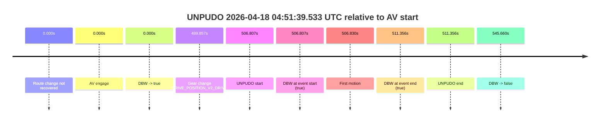
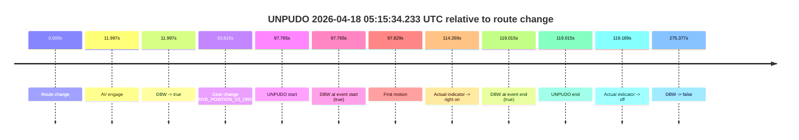

# Run Report: fme10005/2026-04-18--03-53-08--gen2-av-80c1bd2f-a7a8-4fad-9a5d-1b2ba4fc802c

| Field | Value |
|---|---|
| Run ID | `fme10005/2026-04-18--03-53-08--gen2-av-80c1bd2f-a7a8-4fad-9a5d-1b2ba4fc802c` |
| Date | `2026-04-18` |
| Model(s) | `armadillo-amethyst-squeaky` |
| Author | `guy.geva` |
| Event count | `2` |

## unpudo 2026-04-18 04:51:39.533 UTC

| Field | Value |
|---|---|
| Model | `armadillo-amethyst-squeaky` |
| Author | `guy.geva` |
| Run ID | `fme10005/2026-04-18--03-53-08--gen2-av-80c1bd2f-a7a8-4fad-9a5d-1b2ba4fc802c` |
| Date | `2026-04-18` |
| Time (UTC) | `04:51:39.533` |
| Event type | `unpudo` |
| Disengagement type | `none observed` |
| Route change | `not found` |
| Console | [run](https://console.sso.wayve.ai/run/fme10005/2026-04-18--03-53-08--gen2-av-80c1bd2f-a7a8-4fad-9a5d-1b2ba4fc802c?id=&time-unixus=1776487899533299) |
| Foxglove | [segment](https://app.foxglove.dev/wayve-on-prem/p/prj_0dX18KZdVHg1fmmI/view?ds=foxglove-stream&ds.deviceName=fme10005&ds.start=2026-04-18T04%3A43%3A02.726798Z&ds.end=2026-04-18T04%3A52%3A28.386740Z&layoutId=lay_0e7VD4WIKDQGU73Y&time=2026-04-18T04%3A51%3A39.533299Z) |

### Event card: pass

- Pass: AV owns the credited unpudo through the official event window, the gear state is aligned at the anchor, and the vehicle moves without driver accelerator help in AV.

| Event | Time (UTC) | Delta from AV start |
|---|---:|---:|
| Route change not recovered | 2026-04-18 04:43:12.726 | `0.000s` |
| AV engage | 2026-04-18 04:43:12.726 | `0.000s` |
| DBW -> true | 2026-04-18 04:43:12.726 | `0.000s` |
| Gear change (DRIVE_POSITION_V2_DRIVE) | 2026-04-18 04:51:32.583 | `499.857s` |
| UNPUDO start | 2026-04-18 04:51:39.533 | `506.807s` |
| DBW at event start (true) | 2026-04-18 04:51:39.533 | `506.807s` |
| First motion | 2026-04-18 04:51:39.557 | `506.830s` |
| DBW at event end (true) | 2026-04-18 04:51:44.083 | `511.356s` |
| UNPUDO end | 2026-04-18 04:51:44.083 | `511.356s` |
| DBW -> false | 2026-04-18 04:52:18.386 | `545.660s` |

| Metric | Value |
|---|---|
| Outcome | `pass` |
| Effective failure type | `none` |
| Route change status | `not found` |
| DBW at event start | `true` |
| DBW at event end | `true` |
| Predicted gear at AV start | `DRIVE_POSITION_V2_DRIVE` |
| Actual gear at AV start | `DRIVE_POSITION_V2_DRIVE` |
| Predicted gear at event start | `DRIVE_POSITION_V2_DRIVE` |
| Actual gear at event start | `DRIVE_POSITION_V2_DRIVE` |
| Planned indicator direction | `INDICATORS_STATE_V2_LEFT_ON` |
| Controller indicator direction | `INDICATORS_STATE_V2_LEFT_ON` |
| Actual indicator direction | `INDICATORS_STATE_V2_OFF` |
| Actual indicator at maneuver end | `INDICATORS_STATE_V2_OFF` |
| Driver accel help in AV | `false` |
| Driver accel help timestamp | `n/a` |
| Max accel pedal pct in AV | `0.0%` |
| Max brake pedal pct in AV | `0.0%` |
| Max speed mps in AV | `4.550` |
| Success timing baseline | `AV start` |
| Route -> AV | `n/a` |
| AV -> event start | `506.807s` |
| AV -> first motion | `506.830s` |
| Success baseline -> event start | `506.807s` |
| Success baseline -> first motion | `506.830s` |
| AV duration before disengagement | `545.660s` |
| Trajectory waypoint count | `35` |
| Driving-plan step count | `11` |

The scored portion starts from the AV-owned window, not from the pre-AV setup. Route-change search in the stopped pre-event segment was `not found`, with the baseline therefore set to AV start. At the event anchor the model predicts `DRIVE_POSITION_V2_DRIVE` and the actual gear is `DRIVE_POSITION_V2_DRIVE`. The effective model outcome is `pass` because `the credited maneuver stays AV-owned through the official event end`.

### Resolution

| Field | Value |
|---|---|
| Final outcome | `pass` |
| Do we agree with this label? | `yes` |
| Source disengagement type | `none observed` |
| Resolved effective failure type | `none` |
| Confidence | `high` |

## unpudo 2026-04-18 05:15:34.233 UTC

| Field | Value |
|---|---|
| Model | `armadillo-amethyst-squeaky` |
| Author | `guy.geva` |
| Run ID | `fme10005/2026-04-18--03-53-08--gen2-av-80c1bd2f-a7a8-4fad-9a5d-1b2ba4fc802c` |
| Date | `2026-04-18` |
| Time (UTC) | `05:15:34.233` |
| Event type | `unpudo` |
| Disengagement type | `none observed` |
| Route change | `found` |
| Console | [run](https://console.sso.wayve.ai/run/fme10005/2026-04-18--03-53-08--gen2-av-80c1bd2f-a7a8-4fad-9a5d-1b2ba4fc802c?id=&time-unixus=1776489334233302) |
| Foxglove | [segment](https://app.foxglove.dev/wayve-on-prem/p/prj_0dX18KZdVHg1fmmI/view?ds=foxglove-stream&ds.deviceName=fme10005&ds.start=2026-04-18T05%3A13%3A46.468300Z&ds.end=2026-04-18T05%3A18%3A41.845749Z&layoutId=lay_0e7VD4WIKDQGU73Y&time=2026-04-18T05%3A15%3A34.233302Z) |

### Event card: pass

- Pass: AV owns the credited unpudo through the official event window, the gear state is aligned at the anchor, and the vehicle moves without driver accelerator help in AV.

| Event | Time (UTC) | Delta from route change |
|---|---:|---:|
| Route change | 2026-04-18 05:13:56.468 | `0.000s` |
| AV engage | 2026-04-18 05:14:08.465 | `11.997s` |
| DBW -> true | 2026-04-18 05:14:08.465 | `11.997s` |
| Gear change (DRIVE_POSITION_V2_DRIVE) | 2026-04-18 05:15:30.283 | `93.815s` |
| UNPUDO start | 2026-04-18 05:15:34.233 | `97.765s` |
| DBW at event start (true) | 2026-04-18 05:15:34.233 | `97.765s` |
| First motion | 2026-04-18 05:15:34.297 | `97.829s` |
| Actual indicator -> right on | 2026-04-18 05:15:50.737 | `114.269s` |
| DBW at event end (true) | 2026-04-18 05:15:55.483 | `119.015s` |
| UNPUDO end | 2026-04-18 05:15:55.483 | `119.015s` |
| Actual indicator -> off | 2026-04-18 05:15:55.656 | `119.189s` |
| DBW -> false | 2026-04-18 05:18:31.845 | `275.377s` |

| Metric | Value |
|---|---|
| Outcome | `pass` |
| Effective failure type | `none` |
| Route change status | `found` |
| DBW at event start | `true` |
| DBW at event end | `true` |
| Predicted gear at AV start | `DRIVE_POSITION_V2_DRIVE` |
| Actual gear at AV start | `DRIVE_POSITION_V2_DRIVE` |
| Predicted gear at event start | `DRIVE_POSITION_V2_DRIVE` |
| Actual gear at event start | `DRIVE_POSITION_V2_DRIVE` |
| Planned indicator direction | `INDICATORS_STATE_V2_OFF` |
| Controller indicator direction | `INDICATORS_STATE_V2_OFF` |
| Actual indicator direction | `INDICATORS_STATE_V2_OFF` |
| Actual indicator at maneuver end | `INDICATORS_STATE_V2_RIGHT_ON` |
| Driver accel help in AV | `false` |
| Driver accel help timestamp | `n/a` |
| Max accel pedal pct in AV | `0.0%` |
| Max brake pedal pct in AV | `0.0%` |
| Max speed mps in AV | `2.333` |
| Success timing baseline | `route change` |
| Route -> AV | `11.997s` |
| AV -> event start | `85.768s` |
| AV -> first motion | `85.832s` |
| Success baseline -> event start | `97.765s` |
| Success baseline -> first motion | `97.829s` |
| AV duration before disengagement | `263.380s` |
| Trajectory waypoint count | `37` |
| Driving-plan step count | `11` |

The scored portion starts from the AV-owned window, not from the pre-AV setup. Route-change search in the stopped pre-event segment was `found`, with the baseline therefore set to route change. At the event anchor the model predicts `DRIVE_POSITION_V2_DRIVE` and the actual gear is `DRIVE_POSITION_V2_DRIVE`. The effective model outcome is `pass` because `the credited maneuver stays AV-owned through the official event end`.

### Resolution

| Field | Value |
|---|---|
| Final outcome | `pass` |
| Do we agree with this label? | `yes` |
| Source disengagement type | `none observed` |
| Resolved effective failure type | `none` |
| Confidence | `high` |
