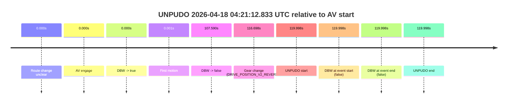
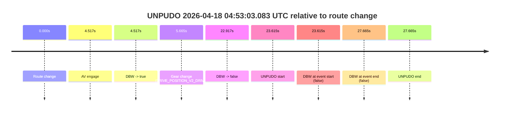
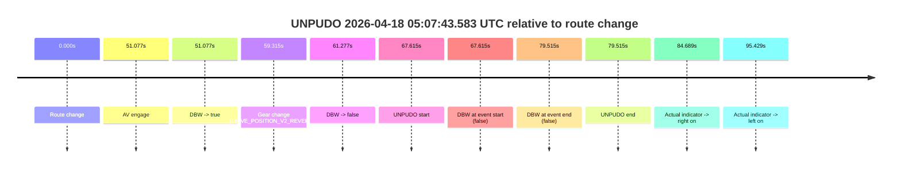
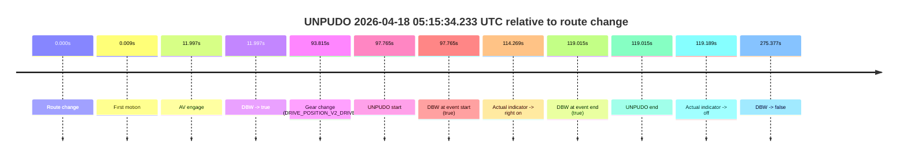
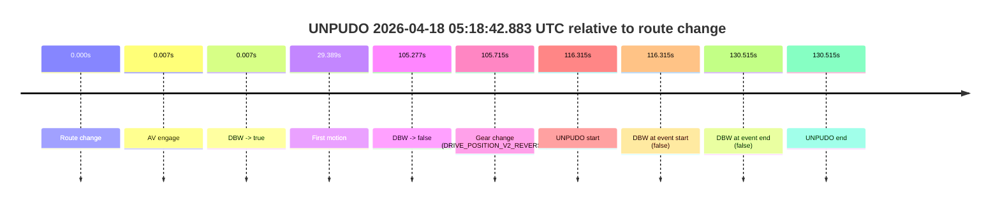

# Run Report: fme10005/2026-04-18--03-53-08--gen2-av-80c1bd2f-a7a8-4fad-9a5d-1b2ba4fc802c

| Field | Value |
|---|---|
| Run ID | `fme10005/2026-04-18--03-53-08--gen2-av-80c1bd2f-a7a8-4fad-9a5d-1b2ba4fc802c` |
| Date | `2026-04-18` |
| Model(s) | `armadillo-amethyst-squeaky` |
| Author | `guy.geva` |
| Event count | `6` |

## unpudo 2026-04-18 04:21:12.833 UTC

| Field | Value |
|---|---|
| Model | `armadillo-amethyst-squeaky` |
| Author | `guy.geva` |
| Run ID | `fme10005/2026-04-18--03-53-08--gen2-av-80c1bd2f-a7a8-4fad-9a5d-1b2ba4fc802c` |
| Date | `2026-04-18` |
| Time (UTC) | `04:21:12.833` |
| Event type | `unpudo` |
| Disengagement type | `failed_to_pudo` |
| Route change | `unclear` |
| Console | [run](https://console.sso.wayve.ai/run/fme10005/2026-04-18--03-53-08--gen2-av-80c1bd2f-a7a8-4fad-9a5d-1b2ba4fc802c?id=&time-unixus=1776486072833315) |
| Foxglove | [segment](https://app.foxglove.dev/wayve-on-prem/p/prj_0dX18KZdVHg1fmmI/view?ds=foxglove-stream&ds.deviceName=fme10005&ds.start=2026-04-18T04%3A19%3A02.835496Z&ds.end=2026-04-18T04%3A21%3A22.833315Z&layoutId=lay_0e7VD4WIKDQGU73Y&time=2026-04-18T04%3A21%3A12.833315Z) |

### Event card: fail

- Fail: AV owns part of the segment, but the event still resolves as a model-performance failure under the AV-only scoring rule.

| Event | Time (UTC) | Delta from AV start |
|---|---:|---:|
| Route change unclear | 2026-04-18 04:19:12.835 | `0.000s` |
| AV engage | 2026-04-18 04:19:12.835 | `0.000s` |
| DBW -> true | 2026-04-18 04:19:12.835 | `0.000s` |
| First motion | 2026-04-18 04:19:12.836 | `0.001s` |
| DBW -> false | 2026-04-18 04:21:00.425 | `107.590s` |
| Gear change (DRIVE_POSITION_V2_REVERSE) | 2026-04-18 04:21:09.533 | `116.698s` |
| UNPUDO start | 2026-04-18 04:21:12.833 | `119.998s` |
| DBW at event start (false) | 2026-04-18 04:21:12.833 | `119.998s` |
| DBW at event end (false) | 2026-04-18 04:21:12.833 | `119.998s` |
| UNPUDO end | 2026-04-18 04:21:12.833 | `119.998s` |

| Metric | Value |
|---|---|
| Outcome | `fail` |
| Effective failure type | `failed_to_pudo` |
| Route change status | `unclear` |
| DBW at event start | `false` |
| DBW at event end | `false` |
| Predicted gear at AV start | `DRIVE_POSITION_V2_DRIVE` |
| Actual gear at AV start | `DRIVE_POSITION_V2_DRIVE` |
| Predicted gear at event start | `DRIVE_POSITION_V2_REVERSE` |
| Actual gear at event start | `DRIVE_POSITION_V2_REVERSE` |
| Planned indicator direction | `INDICATORS_STATE_V2_OFF` |
| Controller indicator direction | `INDICATORS_STATE_V2_OFF` |
| Actual indicator direction | `INDICATORS_STATE_V2_OFF` |
| Actual indicator at maneuver end | `INDICATORS_STATE_V2_OFF` |
| Driver accel help in AV | `false` |
| Driver accel help timestamp | `n/a` |
| Max accel pedal pct in AV | `0.0%` |
| Max brake pedal pct in AV | `0.0%` |
| Max speed mps in AV | `19.606` |
| Success timing baseline | `AV start` |
| Route -> AV | `n/a` |
| AV -> event start | `119.998s` |
| AV -> first motion | `0.001s` |
| Success baseline -> event start | `119.998s` |
| Success baseline -> first motion | `0.001s` |
| AV duration before disengagement | `107.590s` |
| Trajectory waypoint count | `37` |
| Driving-plan step count | `11` |

The scored portion starts from the AV-owned window, not from the pre-AV setup. Route-change search in the stopped pre-event segment was `unclear`, with the baseline therefore set to AV start. At the event anchor the model predicts `DRIVE_POSITION_V2_REVERSE` and the actual gear is `DRIVE_POSITION_V2_REVERSE`. The effective model outcome is `fail` because `failed_to_pudo.`

### Resolution

| Field | Value |
|---|---|
| Final outcome | `fail` |
| Do we agree with this label? | `yes` |
| Source disengagement type | `failed_to_pudo` |
| Resolved effective failure type | `failed_to_pudo` |
| Confidence | `medium` |

## unpudo 2026-04-18 04:51:39.533 UTC

| Field | Value |
|---|---|
| Model | `armadillo-amethyst-squeaky` |
| Author | `guy.geva` |
| Run ID | `fme10005/2026-04-18--03-53-08--gen2-av-80c1bd2f-a7a8-4fad-9a5d-1b2ba4fc802c` |
| Date | `2026-04-18` |
| Time (UTC) | `04:51:39.533` |
| Event type | `unpudo` |
| Disengagement type | `none observed` |
| Route change | `not found` |
| Console | [run](https://console.sso.wayve.ai/run/fme10005/2026-04-18--03-53-08--gen2-av-80c1bd2f-a7a8-4fad-9a5d-1b2ba4fc802c?id=&time-unixus=1776487899533299) |
| Foxglove | [segment](https://app.foxglove.dev/wayve-on-prem/p/prj_0dX18KZdVHg1fmmI/view?ds=foxglove-stream&ds.deviceName=fme10005&ds.start=2026-04-18T04%3A49%3A29.535728Z&ds.end=2026-04-18T04%3A52%3A28.386740Z&layoutId=lay_0e7VD4WIKDQGU73Y&time=2026-04-18T04%3A51%3A39.533299Z) |

### Event card: pass

- Pass: AV owns the credited unpudo from route change through the official unpudo window, the gear state is aligned at the anchor, and the vehicle moves without driver accelerator help in AV.

| Event | Time (UTC) | Delta from AV start |
|---|---:|---:|
| Route change not recovered | 2026-04-18 04:49:39.535 | `0.000s` |
| AV engage | 2026-04-18 04:49:39.535 | `0.000s` |
| DBW -> true | 2026-04-18 04:49:39.535 | `0.000s` |
| Gear change (DRIVE_POSITION_V2_DRIVE) | 2026-04-18 04:51:32.583 | `113.048s` |
| UNPUDO start | 2026-04-18 04:51:39.533 | `119.998s` |
| DBW at event start (true) | 2026-04-18 04:51:39.533 | `119.998s` |
| First motion | 2026-04-18 04:51:39.557 | `120.021s` |
| DBW at event end (true) | 2026-04-18 04:51:44.083 | `124.548s` |
| UNPUDO end | 2026-04-18 04:51:44.083 | `124.548s` |
| DBW -> false | 2026-04-18 04:52:18.386 | `158.851s` |

| Metric | Value |
|---|---|
| Outcome | `pass` |
| Effective failure type | `none` |
| Route change status | `not found` |
| DBW at event start | `true` |
| DBW at event end | `true` |
| Predicted gear at AV start | `DRIVE_POSITION_V2_PARK` |
| Actual gear at AV start | `DRIVE_POSITION_V2_PARK` |
| Predicted gear at event start | `DRIVE_POSITION_V2_DRIVE` |
| Actual gear at event start | `DRIVE_POSITION_V2_DRIVE` |
| Planned indicator direction | `INDICATORS_STATE_V2_LEFT_ON` |
| Controller indicator direction | `INDICATORS_STATE_V2_LEFT_ON` |
| Actual indicator direction | `INDICATORS_STATE_V2_OFF` |
| Actual indicator at maneuver end | `INDICATORS_STATE_V2_OFF` |
| Driver accel help in AV | `false` |
| Driver accel help timestamp | `n/a` |
| Max accel pedal pct in AV | `0.0%` |
| Max brake pedal pct in AV | `10.6%` |
| Max speed mps in AV | `4.550` |
| Success timing baseline | `AV start` |
| Route -> AV | `n/a` |
| AV -> event start | `119.998s` |
| AV -> first motion | `120.021s` |
| Success baseline -> event start | `119.998s` |
| Success baseline -> first motion | `120.021s` |
| AV duration before disengagement | `158.851s` |
| Trajectory waypoint count | `35` |
| Driving-plan step count | `11` |

The scored portion starts from the AV-owned window, not from the pre-AV setup. Route-change search in the stopped pre-event segment was `not found`, with the baseline therefore set to AV start. At the event anchor the model predicts `DRIVE_POSITION_V2_DRIVE` and the actual gear is `DRIVE_POSITION_V2_DRIVE`. The effective model outcome is `pass` because `the credited unpudo stays AV-owned through the official unpudo window.`

### Resolution

| Field | Value |
|---|---|
| Final outcome | `pass` |
| Do we agree with this label? | `yes` |
| Source disengagement type | `none observed` |
| Resolved effective failure type | `none` |
| Confidence | `high` |

## unpudo 2026-04-18 04:53:03.083 UTC

| Field | Value |
|---|---|
| Model | `armadillo-amethyst-squeaky` |
| Author | `guy.geva` |
| Run ID | `fme10005/2026-04-18--03-53-08--gen2-av-80c1bd2f-a7a8-4fad-9a5d-1b2ba4fc802c` |
| Date | `2026-04-18` |
| Time (UTC) | `04:53:03.083` |
| Event type | `unpudo` |
| Disengagement type | `failed_to_unpudo` |
| Route change | `found` |
| Console | [run](https://console.sso.wayve.ai/run/fme10005/2026-04-18--03-53-08--gen2-av-80c1bd2f-a7a8-4fad-9a5d-1b2ba4fc802c?id=&time-unixus=1776487983083314) |
| Foxglove | [segment](https://app.foxglove.dev/wayve-on-prem/p/prj_0dX18KZdVHg1fmmI/view?ds=foxglove-stream&ds.deviceName=fme10005&ds.start=2026-04-18T04%3A52%3A29.468235Z&ds.end=2026-04-18T04%3A53%3A17.133308Z&layoutId=lay_0e7VD4WIKDQGU73Y&time=2026-04-18T04%3A53%3A03.083314Z) |

### Event card: fail

- Fail: AV owns part of the segment, but the event still resolves as a model-performance failure under the AV-only scoring rule.

| Event | Time (UTC) | Delta from route change |
|---|---:|---:|
| Route change | 2026-04-18 04:52:39.468 | `0.000s` |
| AV engage | 2026-04-18 04:52:43.985 | `4.517s` |
| DBW -> true | 2026-04-18 04:52:43.985 | `4.517s` |
| Gear change (DRIVE_POSITION_V2_DRIVE) | 2026-04-18 04:52:45.133 | `5.665s` |
| DBW -> false | 2026-04-18 04:53:02.385 | `22.917s` |
| UNPUDO start | 2026-04-18 04:53:03.083 | `23.615s` |
| DBW at event start (false) | 2026-04-18 04:53:03.083 | `23.615s` |
| DBW at event end (false) | 2026-04-18 04:53:07.133 | `27.665s` |
| UNPUDO end | 2026-04-18 04:53:07.133 | `27.665s` |

| Metric | Value |
|---|---|
| Outcome | `fail` |
| Effective failure type | `failed_to_unpudo` |
| Route change status | `found` |
| DBW at event start | `false` |
| DBW at event end | `false` |
| Predicted gear at AV start | `DRIVE_POSITION_V2_PARK` |
| Actual gear at AV start | `DRIVE_POSITION_V2_PARK` |
| Predicted gear at event start | `DRIVE_POSITION_V2_DRIVE` |
| Actual gear at event start | `DRIVE_POSITION_V2_DRIVE` |
| Planned indicator direction | `INDICATORS_STATE_V2_LEFT_ON` |
| Controller indicator direction | `INDICATORS_STATE_V2_LEFT_ON` |
| Actual indicator direction | `INDICATORS_STATE_V2_OFF` |
| Actual indicator at maneuver end | `INDICATORS_STATE_V2_OFF` |
| Driver accel help in AV | `false` |
| Driver accel help timestamp | `n/a` |
| Max accel pedal pct in AV | `0.0%` |
| Max brake pedal pct in AV | `16.9%` |
| Max speed mps in AV | `0.000` |
| Success timing baseline | `route change` |
| Route -> AV | `4.517s` |
| AV -> event start | `19.098s` |
| AV -> first motion | `n/a` |
| Success baseline -> event start | `23.615s` |
| Success baseline -> first motion | `n/a` |
| AV duration before disengagement | `18.400s` |
| Trajectory waypoint count | `36` |
| Driving-plan step count | `11` |

The scored portion starts from the AV-owned window, not from the pre-AV setup. Route-change search in the stopped pre-event segment was `found`, with the baseline therefore set to route change. At the event anchor the model predicts `DRIVE_POSITION_V2_DRIVE` and the actual gear is `DRIVE_POSITION_V2_DRIVE`. The effective model outcome is `fail` because `failed_to_unpudo.`

### Resolution

| Field | Value |
|---|---|
| Final outcome | `fail` |
| Do we agree with this label? | `yes` |
| Source disengagement type | `failed_to_unpudo` |
| Resolved effective failure type | `failed_to_unpudo` |
| Confidence | `high` |

## unpudo 2026-04-18 05:07:43.583 UTC

| Field | Value |
|---|---|
| Model | `armadillo-amethyst-squeaky` |
| Author | `guy.geva` |
| Run ID | `fme10005/2026-04-18--03-53-08--gen2-av-80c1bd2f-a7a8-4fad-9a5d-1b2ba4fc802c` |
| Date | `2026-04-18` |
| Time (UTC) | `05:07:43.583` |
| Event type | `unpudo` |
| Disengagement type | `none observed` |
| Route change | `found` |
| Console | [run](https://console.sso.wayve.ai/run/fme10005/2026-04-18--03-53-08--gen2-av-80c1bd2f-a7a8-4fad-9a5d-1b2ba4fc802c?id=&time-unixus=1776488863583301) |
| Foxglove | [segment](https://app.foxglove.dev/wayve-on-prem/p/prj_0dX18KZdVHg1fmmI/view?ds=foxglove-stream&ds.deviceName=fme10005&ds.start=2026-04-18T05%3A06%3A25.968475Z&ds.end=2026-04-18T05%3A08%3A05.483292Z&layoutId=lay_0e7VD4WIKDQGU73Y&time=2026-04-18T05%3A07%3A43.583301Z) |

### Event card: fail

- Fail: the credited unpudo does not stay AV-owned. The event window starts with DBW false, and the maneuver outcome lands outside a clean AV-owned segment.

| Event | Time (UTC) | Delta from route change |
|---|---:|---:|
| Route change | 2026-04-18 05:06:35.968 | `0.000s` |
| AV engage | 2026-04-18 05:07:27.045 | `51.077s` |
| DBW -> true | 2026-04-18 05:07:27.045 | `51.077s` |
| Gear change (DRIVE_POSITION_V2_REVERSE) | 2026-04-18 05:07:35.283 | `59.315s` |
| DBW -> false | 2026-04-18 05:07:37.245 | `61.277s` |
| UNPUDO start | 2026-04-18 05:07:43.583 | `67.615s` |
| DBW at event start (false) | 2026-04-18 05:07:43.583 | `67.615s` |
| DBW at event end (false) | 2026-04-18 05:07:55.483 | `79.515s` |
| UNPUDO end | 2026-04-18 05:07:55.483 | `79.515s` |
| Actual indicator -> right on | 2026-04-18 05:08:00.657 | `84.689s` |
| Actual indicator -> left on | 2026-04-18 05:08:11.396 | `95.429s` |

| Metric | Value |
|---|---|
| Outcome | `fail` |
| Effective failure type | `not_av_owned` |
| Route change status | `found` |
| DBW at event start | `false` |
| DBW at event end | `false` |
| Predicted gear at AV start | `DRIVE_POSITION_V2_PARK` |
| Actual gear at AV start | `DRIVE_POSITION_V2_PARK` |
| Predicted gear at event start | `DRIVE_POSITION_V2_REVERSE` |
| Actual gear at event start | `DRIVE_POSITION_V2_REVERSE` |
| Planned indicator direction | `INDICATORS_STATE_V2_OFF` |
| Controller indicator direction | `INDICATORS_STATE_V2_OFF` |
| Actual indicator direction | `INDICATORS_STATE_V2_OFF` |
| Actual indicator at maneuver end | `INDICATORS_STATE_V2_OFF` |
| Driver accel help in AV | `false` |
| Driver accel help timestamp | `n/a` |
| Max accel pedal pct in AV | `0.0%` |
| Max brake pedal pct in AV | `8.0%` |
| Max speed mps in AV | `0.000` |
| Success timing baseline | `route change` |
| Route -> AV | `51.077s` |
| AV -> event start | `16.538s` |
| AV -> first motion | `n/a` |
| Success baseline -> event start | `67.615s` |
| Success baseline -> first motion | `n/a` |
| AV duration before disengagement | `10.200s` |
| Trajectory waypoint count | `36` |
| Driving-plan step count | `11` |

The scored portion starts from the AV-owned window, not from the pre-AV setup. Route-change search in the stopped pre-event segment was `found`, with the baseline therefore set to route change. At the event anchor the model predicts `DRIVE_POSITION_V2_REVERSE` and the actual gear is `DRIVE_POSITION_V2_REVERSE`. The effective model outcome is `fail` because `not_av_owned.`

### Resolution

| Field | Value |
|---|---|
| Final outcome | `fail` |
| Do we agree with this label? | `yes` |
| Source disengagement type | `none observed` |
| Resolved effective failure type | `not_av_owned` |
| Confidence | `high` |

## unpudo 2026-04-18 05:15:34.233 UTC

| Field | Value |
|---|---|
| Model | `armadillo-amethyst-squeaky` |
| Author | `guy.geva` |
| Run ID | `fme10005/2026-04-18--03-53-08--gen2-av-80c1bd2f-a7a8-4fad-9a5d-1b2ba4fc802c` |
| Date | `2026-04-18` |
| Time (UTC) | `05:15:34.233` |
| Event type | `unpudo` |
| Disengagement type | `none observed` |
| Route change | `found` |
| Console | [run](https://console.sso.wayve.ai/run/fme10005/2026-04-18--03-53-08--gen2-av-80c1bd2f-a7a8-4fad-9a5d-1b2ba4fc802c?id=&time-unixus=1776489334233302) |
| Foxglove | [segment](https://app.foxglove.dev/wayve-on-prem/p/prj_0dX18KZdVHg1fmmI/view?ds=foxglove-stream&ds.deviceName=fme10005&ds.start=2026-04-18T05%3A13%3A46.468300Z&ds.end=2026-04-18T05%3A18%3A41.845749Z&layoutId=lay_0e7VD4WIKDQGU73Y&time=2026-04-18T05%3A15%3A34.233302Z) |

### Event card: pass

- Pass: AV owns the credited unpudo from route change through the official unpudo window, the gear state is aligned at the anchor, and the vehicle moves without driver accelerator help in AV.

| Event | Time (UTC) | Delta from route change |
|---|---:|---:|
| Route change | 2026-04-18 05:13:56.468 | `0.000s` |
| First motion | 2026-04-18 05:13:56.477 | `0.009s` |
| AV engage | 2026-04-18 05:14:08.465 | `11.997s` |
| DBW -> true | 2026-04-18 05:14:08.465 | `11.997s` |
| Gear change (DRIVE_POSITION_V2_DRIVE) | 2026-04-18 05:15:30.283 | `93.815s` |
| UNPUDO start | 2026-04-18 05:15:34.233 | `97.765s` |
| DBW at event start (true) | 2026-04-18 05:15:34.233 | `97.765s` |
| Actual indicator -> right on | 2026-04-18 05:15:50.737 | `114.269s` |
| DBW at event end (true) | 2026-04-18 05:15:55.483 | `119.015s` |
| UNPUDO end | 2026-04-18 05:15:55.483 | `119.015s` |
| Actual indicator -> off | 2026-04-18 05:15:55.656 | `119.189s` |
| DBW -> false | 2026-04-18 05:18:31.845 | `275.377s` |

| Metric | Value |
|---|---|
| Outcome | `pass` |
| Effective failure type | `none` |
| Route change status | `found` |
| DBW at event start | `true` |
| DBW at event end | `true` |
| Predicted gear at AV start | `DRIVE_POSITION_V2_DRIVE` |
| Actual gear at AV start | `DRIVE_POSITION_V2_DRIVE` |
| Predicted gear at event start | `DRIVE_POSITION_V2_DRIVE` |
| Actual gear at event start | `DRIVE_POSITION_V2_DRIVE` |
| Planned indicator direction | `INDICATORS_STATE_V2_OFF` |
| Controller indicator direction | `INDICATORS_STATE_V2_OFF` |
| Actual indicator direction | `INDICATORS_STATE_V2_OFF` |
| Actual indicator at maneuver end | `INDICATORS_STATE_V2_RIGHT_ON` |
| Driver accel help in AV | `false` |
| Driver accel help timestamp | `n/a` |
| Max accel pedal pct in AV | `0.0%` |
| Max brake pedal pct in AV | `8.0%` |
| Max speed mps in AV | `10.406` |
| Success timing baseline | `route change` |
| Route -> AV | `11.997s` |
| AV -> event start | `85.768s` |
| AV -> first motion | `-11.989s` |
| Success baseline -> event start | `97.765s` |
| Success baseline -> first motion | `0.009s` |
| AV duration before disengagement | `263.380s` |
| Trajectory waypoint count | `37` |
| Driving-plan step count | `11` |

The scored portion starts from the AV-owned window, not from the pre-AV setup. Route-change search in the stopped pre-event segment was `found`, with the baseline therefore set to route change. At the event anchor the model predicts `DRIVE_POSITION_V2_DRIVE` and the actual gear is `DRIVE_POSITION_V2_DRIVE`. The effective model outcome is `pass` because `the credited unpudo stays AV-owned through the official unpudo window.`

### Resolution

| Field | Value |
|---|---|
| Final outcome | `pass` |
| Do we agree with this label? | `yes` |
| Source disengagement type | `none observed` |
| Resolved effective failure type | `none` |
| Confidence | `high` |

## unpudo 2026-04-18 05:18:42.883 UTC

| Field | Value |
|---|---|
| Model | `armadillo-amethyst-squeaky` |
| Author | `guy.geva` |
| Run ID | `fme10005/2026-04-18--03-53-08--gen2-av-80c1bd2f-a7a8-4fad-9a5d-1b2ba4fc802c` |
| Date | `2026-04-18` |
| Time (UTC) | `05:18:42.883` |
| Event type | `unpudo` |
| Disengagement type | `failed_to_unpudo` |
| Route change | `found` |
| Console | [run](https://console.sso.wayve.ai/run/fme10005/2026-04-18--03-53-08--gen2-av-80c1bd2f-a7a8-4fad-9a5d-1b2ba4fc802c?id=&time-unixus=1776489522883320) |
| Foxglove | [segment](https://app.foxglove.dev/wayve-on-prem/p/prj_0dX18KZdVHg1fmmI/view?ds=foxglove-stream&ds.deviceName=fme10005&ds.start=2026-04-18T05%3A16%3A36.568256Z&ds.end=2026-04-18T05%3A19%3A07.083307Z&layoutId=lay_0e7VD4WIKDQGU73Y&time=2026-04-18T05%3A18%3A42.883320Z) |

### Event card: fail

- Fail: AV owns part of the segment, but the event still resolves as a model-performance failure under the AV-only scoring rule.

| Event | Time (UTC) | Delta from route change |
|---|---:|---:|
| Route change | 2026-04-18 05:16:46.568 | `0.000s` |
| AV engage | 2026-04-18 05:16:46.575 | `0.007s` |
| DBW -> true | 2026-04-18 05:16:46.575 | `0.007s` |
| First motion | 2026-04-18 05:17:15.957 | `29.389s` |
| DBW -> false | 2026-04-18 05:18:31.845 | `105.277s` |
| Gear change (DRIVE_POSITION_V2_REVERSE) | 2026-04-18 05:18:32.283 | `105.715s` |
| UNPUDO start | 2026-04-18 05:18:42.883 | `116.315s` |
| DBW at event start (false) | 2026-04-18 05:18:42.883 | `116.315s` |
| DBW at event end (false) | 2026-04-18 05:18:57.083 | `130.515s` |
| UNPUDO end | 2026-04-18 05:18:57.083 | `130.515s` |

| Metric | Value |
|---|---|
| Outcome | `fail` |
| Effective failure type | `failed_to_unpudo` |
| Route change status | `found` |
| DBW at event start | `false` |
| DBW at event end | `false` |
| Predicted gear at AV start | `DRIVE_POSITION_V2_PARK` |
| Actual gear at AV start | `DRIVE_POSITION_V2_PARK` |
| Predicted gear at event start | `DRIVE_POSITION_V2_REVERSE` |
| Actual gear at event start | `DRIVE_POSITION_V2_REVERSE` |
| Planned indicator direction | `INDICATORS_STATE_V2_OFF` |
| Controller indicator direction | `INDICATORS_STATE_V2_OFF` |
| Actual indicator direction | `INDICATORS_STATE_V2_OFF` |
| Actual indicator at maneuver end | `INDICATORS_STATE_V2_OFF` |
| Driver accel help in AV | `false` |
| Driver accel help timestamp | `n/a` |
| Max accel pedal pct in AV | `0.0%` |
| Max brake pedal pct in AV | `10.3%` |
| Max speed mps in AV | `4.831` |
| Success timing baseline | `route change` |
| Route -> AV | `0.007s` |
| AV -> event start | `116.308s` |
| AV -> first motion | `29.381s` |
| Success baseline -> event start | `116.315s` |
| Success baseline -> first motion | `29.389s` |
| AV duration before disengagement | `105.270s` |
| Trajectory waypoint count | `36` |
| Driving-plan step count | `11` |

The scored portion starts from the AV-owned window, not from the pre-AV setup. Route-change search in the stopped pre-event segment was `found`, with the baseline therefore set to route change. At the event anchor the model predicts `DRIVE_POSITION_V2_REVERSE` and the actual gear is `DRIVE_POSITION_V2_REVERSE`. The effective model outcome is `fail` because `failed_to_unpudo.`

### Resolution

| Field | Value |
|---|---|
| Final outcome | `fail` |
| Do we agree with this label? | `yes` |
| Source disengagement type | `failed_to_unpudo` |
| Resolved effective failure type | `failed_to_unpudo` |
| Confidence | `high` |
