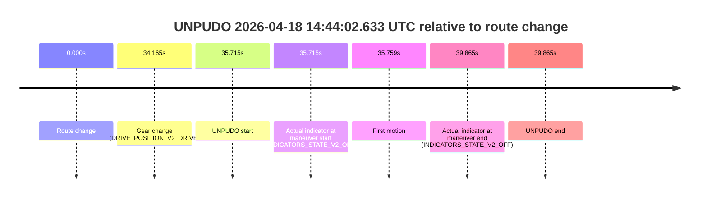
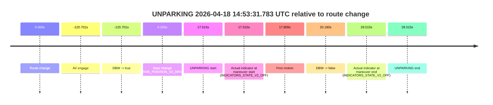

# Run Report: fme10005/2026-04-18--14-41-02--gen2-av-8e8488c0-9d82-4a2e-b633-39e023a988d7

| Field | Value |
|---|---|
| Run ID | `fme10005/2026-04-18--14-41-02--gen2-av-8e8488c0-9d82-4a2e-b633-39e023a988d7` |
| Date | `2026-04-18` |
| Model(s) | `plum-timeless-beaver` |
| Author | `peng.tang` |
| Event count | `2` |

## unpudo 2026-04-18 14:44:02.633 UTC

| Field | Value |
|---|---|
| Model | `plum-timeless-beaver` |
| Author | `peng.tang` |
| Run ID | `fme10005/2026-04-18--14-41-02--gen2-av-8e8488c0-9d82-4a2e-b633-39e023a988d7` |
| Date | `2026-04-18` |
| Time (UTC) | `14:44:02.633` |
| Event type | `unpudo` |
| Disengagement type | `none observed` |
| Route change | `found` |
| Console | [run](https://console.sso.wayve.ai/run/fme10005/2026-04-18--14-41-02--gen2-av-8e8488c0-9d82-4a2e-b633-39e023a988d7?id=&time-unixus=1776523442633300) |
| Foxglove | [segment](https://app.foxglove.dev/wayve-on-prem/p/prj_0dX18KZdVHg1fmmI/view?ds=foxglove-stream&ds.deviceName=fme10005&ds.start=2026-04-18T14%3A43%3A16.918342Z&ds.end=2026-04-18T14%3A44%3A16.783313Z&layoutId=lay_0e7VD4WIKDQGU73Y&time=2026-04-18T14%3A44%3A02.633300Z) |

### Event card: non-av

- Non-AV: the detected unpudo starts outside AV ownership, so it is kept for coverage but excluded from model success / failure scoring.

| Event | Time (UTC) | Delta from route change |
|---|---:|---:|
| Route change | 2026-04-18 14:43:26.918 | `0.000s` |
| Gear change (DRIVE_POSITION_V2_DRIVE) | 2026-04-18 14:44:01.083 | `34.165s` |
| UNPUDO start | 2026-04-18 14:44:02.633 | `35.715s` |
| Actual indicator at maneuver start (INDICATORS_STATE_V2_OFF) | 2026-04-18 14:44:02.633 | `35.715s` |
| First motion | 2026-04-18 14:44:02.677 | `35.759s` |
| Actual indicator at maneuver end (INDICATORS_STATE_V2_OFF) | 2026-04-18 14:44:06.783 | `39.865s` |
| UNPUDO end | 2026-04-18 14:44:06.783 | `39.865s` |

| Metric | Value |
|---|---|
| Outcome | `non-av` |
| Effective failure type | `none` |
| Route change status | `found` |
| DBW at event start | `false` |
| DBW at event end | `false` |
| Predicted gear at AV start | `n/a` |
| Actual gear at AV start | `n/a` |
| Predicted gear at event start | `DRIVE_POSITION_V2_DRIVE` |
| Actual gear at event start | `DRIVE_POSITION_V2_DRIVE` |
| Planned indicator direction | `INDICATORS_STATE_V2_OFF` |
| Controller indicator direction | `INDICATORS_STATE_V2_OFF` |
| Actual indicator direction | `INDICATORS_STATE_V2_OFF` |
| Actual indicator at maneuver end | `INDICATORS_STATE_V2_OFF` |
| Driver accel help in AV | `false` |
| Driver accel help timestamp | `n/a` |
| Max accel pedal pct in AV | `0.0%` |
| Max brake pedal pct in AV | `0.0%` |
| Max speed mps in AV | `0.000` |
| Route -> AV | `n/a` |
| AV -> event start | `n/a` |
| AV -> first motion | `n/a` |
| AV duration before disengagement | `n/a` |
| Trajectory waypoint count | `36` |
| Driving-plan step count | `11` |

The scored portion starts from the AV-owned window, not from the pre-AV setup. Route-change search in the stopped pre-event segment was `found`, with the baseline therefore set to route change. At the event anchor the model predicts `DRIVE_POSITION_V2_DRIVE` and the actual gear is `DRIVE_POSITION_V2_DRIVE`. The effective model outcome is `non-av` because `the event does not begin in AV ownership`.

### Resolution

| Field | Value |
|---|---|
| Final outcome | `non-av` |
| Do we agree with this label? | `yes` |
| Source disengagement type | `none observed` |
| Resolved effective failure type | `none` |
| Confidence | `high` |

## unparking 2026-04-18 14:53:31.783 UTC

| Field | Value |
|---|---|
| Model | `plum-timeless-beaver` |
| Author | `peng.tang` |
| Run ID | `fme10005/2026-04-18--14-41-02--gen2-av-8e8488c0-9d82-4a2e-b633-39e023a988d7` |
| Date | `2026-04-18` |
| Time (UTC) | `14:53:31.783` |
| Event type | `unparking` |
| Disengagement type | `none observed` |
| Route change | `found` |
| Console | [run](https://console.sso.wayve.ai/run/fme10005/2026-04-18--14-41-02--gen2-av-8e8488c0-9d82-4a2e-b633-39e023a988d7?id=&time-unixus=1776524011783307) |
| Foxglove | [segment](https://app.foxglove.dev/wayve-on-prem/p/prj_0dX18KZdVHg1fmmI/view?ds=foxglove-stream&ds.deviceName=fme10005&ds.start=2026-04-18T14%3A51%3A03.567310Z&ds.end=2026-04-18T14%3A53%3A52.783312Z&layoutId=lay_0e7VD4WIKDQGU73Y&time=2026-04-18T14%3A53%3A31.783307Z) |

### Event card: fail

- Fail: the credited unparking does not stay AV-owned. The event window starts with DBW true, and the maneuver outcome lands outside a clean AV-owned segment.

| Event | Time (UTC) | Delta from route change |
|---|---:|---:|
| Route change | 2026-04-18 14:53:14.268 | `0.000s` |
| AV engage | 2026-04-18 14:51:13.567 | `-120.701s` |
| DBW -> true | 2026-04-18 14:51:13.567 | `-120.701s` |
| Gear change (DRIVE_POSITION_V2_DRIVE) | 2026-04-18 14:53:14.533 | `0.265s` |
| UNPARKING start | 2026-04-18 14:53:31.783 | `17.515s` |
| Actual indicator at maneuver start (INDICATORS_STATE_V2_OFF) | 2026-04-18 14:53:31.783 | `17.515s` |
| First motion | 2026-04-18 14:53:32.077 | `17.809s` |
| DBW -> false | 2026-04-18 14:53:34.448 | `20.180s` |
| Actual indicator at maneuver end (INDICATORS_STATE_V2_OFF) | 2026-04-18 14:53:42.783 | `28.515s` |
| UNPARKING end | 2026-04-18 14:53:42.783 | `28.515s` |

| Metric | Value |
|---|---|
| Outcome | `fail` |
| Effective failure type | `driver_completed_maneuver` |
| Route change status | `found` |
| DBW at event start | `true` |
| DBW at event end | `false` |
| Predicted gear at AV start | `DRIVE_POSITION_V2_DRIVE` |
| Actual gear at AV start | `DRIVE_POSITION_V2_DRIVE` |
| Predicted gear at event start | `DRIVE_POSITION_V2_DRIVE` |
| Actual gear at event start | `DRIVE_POSITION_V2_DRIVE` |
| Planned indicator direction | `INDICATORS_STATE_V2_LEFT_ON` |
| Controller indicator direction | `INDICATORS_STATE_V2_LEFT_ON` |
| Actual indicator direction | `INDICATORS_STATE_V2_OFF` |
| Actual indicator at maneuver end | `INDICATORS_STATE_V2_OFF` |
| Driver accel help in AV | `false` |
| Driver accel help timestamp | `n/a` |
| Max accel pedal pct in AV | `0.0%` |
| Max brake pedal pct in AV | `25.4%` |
| Max speed mps in AV | `10.392` |
| Route -> AV | `-120.701s` |
| AV -> event start | `138.216s` |
| AV -> first motion | `138.510s` |
| AV duration before disengagement | `140.881s` |
| Trajectory waypoint count | `36` |
| Driving-plan step count | `11` |

The scored portion starts from the AV-owned window, not from the pre-AV setup. Route-change search in the stopped pre-event segment was `found`, with the baseline therefore set to route change. At the event anchor the model predicts `DRIVE_POSITION_V2_DRIVE` and the actual gear is `DRIVE_POSITION_V2_DRIVE`. The effective model outcome is `fail` because `driver_completed_maneuver`.

### Resolution

| Field | Value |
|---|---|
| Final outcome | `fail` |
| Do we agree with this label? | `yes` |
| Source disengagement type | `none observed` |
| Resolved effective failure type | `driver_completed_maneuver` |
| Confidence | `high` |
