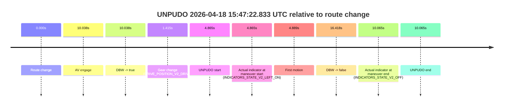

# Run Report: fme10005/2026-04-18--15-29-28--gen2-av-0a637524-c8ea-4bd8-b9af-8c842a5feb24

| Field | Value |
|---|---|
| Run ID | `fme10005/2026-04-18--15-29-28--gen2-av-0a637524-c8ea-4bd8-b9af-8c842a5feb24` |
| Date | `2026-04-18` |
| Model(s) | `plum-timeless-beaver` |
| Author | `peng.tang` |
| Event count | `2` |

## unpudo 2026-04-18 15:40:04.883 UTC

| Field | Value |
|---|---|
| Model | `plum-timeless-beaver` |
| Author | `peng.tang` |
| Run ID | `fme10005/2026-04-18--15-29-28--gen2-av-0a637524-c8ea-4bd8-b9af-8c842a5feb24` |
| Date | `2026-04-18` |
| Time (UTC) | `15:40:04.883` |
| Event type | `unpudo` |
| Disengagement type | `none observed` |
| Route change | `found` |
| Console | [run](https://console.sso.wayve.ai/run/fme10005/2026-04-18--15-29-28--gen2-av-0a637524-c8ea-4bd8-b9af-8c842a5feb24?id=&time-unixus=1776526804883295) |
| Foxglove | [segment](https://app.foxglove.dev/wayve-on-prem/p/prj_0dX18KZdVHg1fmmI/view?ds=foxglove-stream&ds.deviceName=fme10005&ds.start=2026-04-18T15%3A39%3A48.933309Z&ds.end=2026-04-18T15%3A44%3A47.645350Z&layoutId=lay_0e7VD4WIKDQGU73Y&time=2026-04-18T15%3A40%3A04.883295Z) |

### Event card: non-av

- Non-AV: there is no AV-owned portion anywhere inside the detected unpudo timeline, so it is kept for coverage but excluded from model success / failure scoring.

| Event | Time (UTC) | Delta from route change |
|---|---:|---:|
| Route change | 2026-04-18 15:39:59.818 | `0.000s` |
| AV engage | 2026-04-18 15:40:15.165 | `15.347s` |
| DBW -> true | 2026-04-18 15:40:15.165 | `15.347s` |
| Gear change (DRIVE_POSITION_V2_DRIVE) | 2026-04-18 15:39:58.933 | `-0.885s` |
| UNPUDO start | 2026-04-18 15:40:04.883 | `5.065s` |
| Actual indicator at maneuver start (INDICATORS_STATE_V2_OFF) | 2026-04-18 15:40:04.883 | `5.065s` |
| First motion | 2026-04-18 15:40:04.897 | `5.079s` |
| DBW -> false | 2026-04-18 15:44:37.645 | `277.827s` |
| Actual indicator at maneuver end (INDICATORS_STATE_V2_OFF) | 2026-04-18 15:40:11.683 | `11.865s` |
| UNPUDO end | 2026-04-18 15:40:11.683 | `11.865s` |

| Metric | Value |
|---|---|
| Outcome | `non-av` |
| Effective failure type | `none` |
| Route change status | `found` |
| DBW at event start | `false` |
| DBW at event end | `false` |
| Predicted gear at AV start | `DRIVE_POSITION_V2_DRIVE` |
| Actual gear at AV start | `DRIVE_POSITION_V2_DRIVE` |
| Predicted gear at event start | `DRIVE_POSITION_V2_DRIVE` |
| Actual gear at event start | `DRIVE_POSITION_V2_DRIVE` |
| Planned indicator direction | `INDICATORS_STATE_V2_RIGHT_ON` |
| Controller indicator direction | `INDICATORS_STATE_V2_RIGHT_ON` |
| Actual indicator direction | `INDICATORS_STATE_V2_OFF` |
| Actual indicator at maneuver end | `INDICATORS_STATE_V2_OFF` |
| Driver accel help in AV | `false` |
| Driver accel help timestamp | `n/a` |
| Max accel pedal pct in AV | `0.0%` |
| Max brake pedal pct in AV | `0.0%` |
| Max speed mps in AV | `0.000` |
| Route -> AV | `15.347s` |
| AV -> event start | `-10.282s` |
| AV -> first motion | `-10.268s` |
| AV duration before disengagement | `262.480s` |
| Trajectory waypoint count | `36` |
| Driving-plan step count | `11` |

The scored portion starts from the AV-owned window, not from the pre-AV setup. Route-change search in the stopped pre-event segment was `found`, with the baseline therefore set to route change. At the event anchor the model predicts `DRIVE_POSITION_V2_DRIVE` and the actual gear is `DRIVE_POSITION_V2_DRIVE`. The effective model outcome is `non-av` because `there is no AV-owned overlap inside the event timeline`.

### Resolution

| Field | Value |
|---|---|
| Final outcome | `non-av` |
| Do we agree with this label? | `yes` |
| Source disengagement type | `none observed` |
| Resolved effective failure type | `none` |
| Confidence | `high` |

## unpudo 2026-04-18 15:47:22.833 UTC

| Field | Value |
|---|---|
| Model | `plum-timeless-beaver` |
| Author | `peng.tang` |
| Run ID | `fme10005/2026-04-18--15-29-28--gen2-av-0a637524-c8ea-4bd8-b9af-8c842a5feb24` |
| Date | `2026-04-18` |
| Time (UTC) | `15:47:22.833` |
| Event type | `unpudo` |
| Disengagement type | `none observed` |
| Route change | `found` |
| Console | [run](https://console.sso.wayve.ai/run/fme10005/2026-04-18--15-29-28--gen2-av-0a637524-c8ea-4bd8-b9af-8c842a5feb24?id=&time-unixus=1776527242833295) |
| Foxglove | [segment](https://app.foxglove.dev/wayve-on-prem/p/prj_0dX18KZdVHg1fmmI/view?ds=foxglove-stream&ds.deviceName=fme10005&ds.start=2026-04-18T15%3A47%3A07.968267Z&ds.end=2026-04-18T15%3A47%3A44.385961Z&layoutId=lay_0e7VD4WIKDQGU73Y&time=2026-04-18T15%3A47%3A22.833295Z) |

### Event card: accidental

- Accidental: AV ownership is present for less than `2s`, so this is treated as an accidental brush with the maneuver rather than a meaningful model attempt.

| Event | Time (UTC) | Delta from route change |
|---|---:|---:|
| Route change | 2026-04-18 15:47:17.968 | `0.000s` |
| AV engage | 2026-04-18 15:47:28.006 | `10.038s` |
| DBW -> true | 2026-04-18 15:47:28.006 | `10.038s` |
| Gear change (DRIVE_POSITION_V2_DRIVE) | 2026-04-18 15:47:19.383 | `1.415s` |
| UNPUDO start | 2026-04-18 15:47:22.833 | `4.865s` |
| Actual indicator at maneuver start (INDICATORS_STATE_V2_LEFT_ON) | 2026-04-18 15:47:22.833 | `4.865s` |
| First motion | 2026-04-18 15:47:22.856 | `4.889s` |
| DBW -> false | 2026-04-18 15:47:34.385 | `16.418s` |
| Actual indicator at maneuver end (INDICATORS_STATE_V2_OFF) | 2026-04-18 15:47:28.033 | `10.065s` |
| UNPUDO end | 2026-04-18 15:47:28.033 | `10.065s` |

| Metric | Value |
|---|---|
| Outcome | `accidental` |
| Effective failure type | `none` |
| Route change status | `found` |
| DBW at event start | `false` |
| DBW at event end | `true` |
| Predicted gear at AV start | `DRIVE_POSITION_V2_DRIVE` |
| Actual gear at AV start | `DRIVE_POSITION_V2_DRIVE` |
| Predicted gear at event start | `DRIVE_POSITION_V2_DRIVE` |
| Actual gear at event start | `DRIVE_POSITION_V2_DRIVE` |
| Planned indicator direction | `INDICATORS_STATE_V2_RIGHT_ON` |
| Controller indicator direction | `INDICATORS_STATE_V2_RIGHT_ON` |
| Actual indicator direction | `INDICATORS_STATE_V2_LEFT_ON` |
| Actual indicator at maneuver end | `INDICATORS_STATE_V2_OFF` |
| Driver accel help in AV | `false` |
| Driver accel help timestamp | `n/a` |
| Max accel pedal pct in AV | `0.0%` |
| Max brake pedal pct in AV | `0.0%` |
| Max speed mps in AV | `2.283` |
| Route -> AV | `10.038s` |
| AV -> event start | `-5.173s` |
| AV -> first motion | `-5.149s` |
| AV duration before disengagement | `6.379s` |
| Trajectory waypoint count | `35` |
| Driving-plan step count | `11` |

The scored portion starts from the AV-owned window, not from the pre-AV setup. Route-change search in the stopped pre-event segment was `found`, with the baseline therefore set to route change. At the event anchor the model predicts `DRIVE_POSITION_V2_DRIVE` and the actual gear is `DRIVE_POSITION_V2_DRIVE`. The effective model outcome is `accidental` because `the AV-owned portion is shorter than 2s`.

### Resolution

| Field | Value |
|---|---|
| Final outcome | `accidental` |
| Do we agree with this label? | `yes` |
| Source disengagement type | `none observed` |
| Resolved effective failure type | `none` |
| Confidence | `high` |
