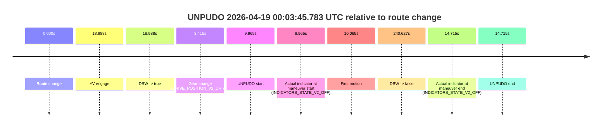
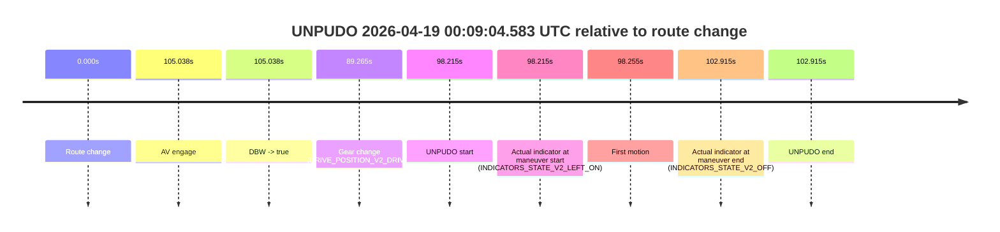

# Run Report: fme10005/2026-04-18--23-12-24--gen2-av-97e85f3a-98c5-4406-870c-7e8acfa3b54d

| Field | Value |
|---|---|
| Run ID | `fme10005/2026-04-18--23-12-24--gen2-av-97e85f3a-98c5-4406-870c-7e8acfa3b54d` |
| Date | `2026-04-18` |
| Model(s) | `satisfied-amber-moose` |
| Author | `guy.geva` |
| Event count | `2` |

## unpudo 2026-04-19 00:03:45.783 UTC

| Field | Value |
|---|---|
| Model | `satisfied-amber-moose` |
| Author | `guy.geva` |
| Run ID | `fme10005/2026-04-18--23-12-24--gen2-av-97e85f3a-98c5-4406-870c-7e8acfa3b54d` |
| Date | `2026-04-18` |
| Time (UTC) | `00:03:45.783` |
| Event type | `unpudo` |
| Disengagement type | `failed_to_unpudo` |
| Route change | `found` |
| Console | [run](https://console.sso.wayve.ai/run/fme10005/2026-04-18--23-12-24--gen2-av-97e85f3a-98c5-4406-870c-7e8acfa3b54d?id=&time-unixus=1776557025783316) |
| Foxglove | [segment](https://app.foxglove.dev/wayve-on-prem/p/prj_0dX18KZdVHg1fmmI/view?ds=foxglove-stream&ds.deviceName=fme10005&ds.start=2026-04-19T00%3A03%3A25.818278Z&ds.end=2026-04-19T00%3A07%3A46.445698Z&layoutId=lay_0e7VD4WIKDQGU73Y&time=2026-04-19T00%3A03%3A45.783316Z) |

### Event card: fail

- Fail: AV owns part of the segment, but the event still resolves as a model-performance failure under the AV-only scoring rule.

| Event | Time (UTC) | Delta from route change |
|---|---:|---:|
| Route change | 2026-04-19 00:03:35.818 | `0.000s` |
| AV engage | 2026-04-19 00:03:54.806 | `18.988s` |
| DBW -> true | 2026-04-19 00:03:54.806 | `18.988s` |
| Gear change (DRIVE_POSITION_V2_DRIVE) | 2026-04-19 00:03:39.233 | `3.415s` |
| UNPUDO start | 2026-04-19 00:03:45.783 | `9.965s` |
| Actual indicator at maneuver start (INDICATORS_STATE_V2_OFF) | 2026-04-19 00:03:45.783 | `9.965s` |
| First motion | 2026-04-19 00:03:45.883 | `10.065s` |
| DBW -> false | 2026-04-19 00:07:36.445 | `240.627s` |
| Actual indicator at maneuver end (INDICATORS_STATE_V2_OFF) | 2026-04-19 00:03:50.533 | `14.715s` |
| UNPUDO end | 2026-04-19 00:03:50.533 | `14.715s` |

| Metric | Value |
|---|---|
| Outcome | `fail` |
| Effective failure type | `failed_to_unpudo` |
| Route change status | `found` |
| DBW at event start | `false` |
| DBW at event end | `false` |
| Predicted gear at AV start | `DRIVE_POSITION_V2_DRIVE` |
| Actual gear at AV start | `DRIVE_POSITION_V2_DRIVE` |
| Predicted gear at event start | `DRIVE_POSITION_V2_DRIVE` |
| Actual gear at event start | `DRIVE_POSITION_V2_DRIVE` |
| Planned indicator direction | `INDICATORS_STATE_V2_LEFT_ON` |
| Controller indicator direction | `INDICATORS_STATE_V2_LEFT_ON` |
| Actual indicator direction | `INDICATORS_STATE_V2_OFF` |
| Actual indicator at maneuver end | `INDICATORS_STATE_V2_OFF` |
| Driver accel help in AV | `false` |
| Driver accel help timestamp | `n/a` |
| Max accel pedal pct in AV | `0.0%` |
| Max brake pedal pct in AV | `0.0%` |
| Max speed mps in AV | `0.000` |
| Route -> AV | `18.988s` |
| AV -> event start | `-9.023s` |
| AV -> first motion | `-8.924s` |
| AV duration before disengagement | `221.639s` |
| Trajectory waypoint count | `36` |
| Driving-plan step count | `11` |

The scored portion starts from the AV-owned window, not from the pre-AV setup. Route-change search in the stopped pre-event segment was `found`, with the baseline therefore set to route change. At the event anchor the model predicts `DRIVE_POSITION_V2_DRIVE` and the actual gear is `DRIVE_POSITION_V2_DRIVE`. The effective model outcome is `fail` because `failed_to_unpudo`.

### Resolution

| Field | Value |
|---|---|
| Final outcome | `fail` |
| Do we agree with this label? | `yes` |
| Source disengagement type | `failed_to_unpudo` |
| Resolved effective failure type | `failed_to_unpudo` |
| Confidence | `high` |

## unpudo 2026-04-19 00:09:04.583 UTC

| Field | Value |
|---|---|
| Model | `satisfied-amber-moose` |
| Author | `guy.geva` |
| Run ID | `fme10005/2026-04-18--23-12-24--gen2-av-97e85f3a-98c5-4406-870c-7e8acfa3b54d` |
| Date | `2026-04-18` |
| Time (UTC) | `00:09:04.583` |
| Event type | `unpudo` |
| Disengagement type | `failed_to_unpudo` |
| Route change | `found` |
| Console | [run](https://console.sso.wayve.ai/run/fme10005/2026-04-18--23-12-24--gen2-av-97e85f3a-98c5-4406-870c-7e8acfa3b54d?id=&time-unixus=1776557344583294) |
| Foxglove | [segment](https://app.foxglove.dev/wayve-on-prem/p/prj_0dX18KZdVHg1fmmI/view?ds=foxglove-stream&ds.deviceName=fme10005&ds.start=2026-04-19T00%3A07%3A16.368273Z&ds.end=2026-04-19T00%3A09%3A19.283301Z&layoutId=lay_0e7VD4WIKDQGU73Y&time=2026-04-19T00%3A09%3A04.583294Z) |

### Event card: fail

- Fail: AV owns part of the segment, but the event still resolves as a model-performance failure under the AV-only scoring rule.

| Event | Time (UTC) | Delta from route change |
|---|---:|---:|
| Route change | 2026-04-19 00:07:26.368 | `0.000s` |
| AV engage | 2026-04-19 00:09:11.406 | `105.038s` |
| DBW -> true | 2026-04-19 00:09:11.406 | `105.038s` |
| Gear change (DRIVE_POSITION_V2_DRIVE) | 2026-04-19 00:08:55.633 | `89.265s` |
| UNPUDO start | 2026-04-19 00:09:04.583 | `98.215s` |
| Actual indicator at maneuver start (INDICATORS_STATE_V2_LEFT_ON) | 2026-04-19 00:09:04.583 | `98.215s` |
| First motion | 2026-04-19 00:09:04.622 | `98.255s` |
| Actual indicator at maneuver end (INDICATORS_STATE_V2_OFF) | 2026-04-19 00:09:09.283 | `102.915s` |
| UNPUDO end | 2026-04-19 00:09:09.283 | `102.915s` |

| Metric | Value |
|---|---|
| Outcome | `fail` |
| Effective failure type | `failed_to_unpudo` |
| Route change status | `found` |
| DBW at event start | `false` |
| DBW at event end | `false` |
| Predicted gear at AV start | `DRIVE_POSITION_V2_DRIVE` |
| Actual gear at AV start | `DRIVE_POSITION_V2_DRIVE` |
| Predicted gear at event start | `DRIVE_POSITION_V2_DRIVE` |
| Actual gear at event start | `DRIVE_POSITION_V2_DRIVE` |
| Planned indicator direction | `INDICATORS_STATE_V2_LEFT_ON` |
| Controller indicator direction | `INDICATORS_STATE_V2_LEFT_ON` |
| Actual indicator direction | `INDICATORS_STATE_V2_LEFT_ON` |
| Actual indicator at maneuver end | `INDICATORS_STATE_V2_OFF` |
| Driver accel help in AV | `false` |
| Driver accel help timestamp | `n/a` |
| Max accel pedal pct in AV | `0.0%` |
| Max brake pedal pct in AV | `0.0%` |
| Max speed mps in AV | `0.000` |
| Route -> AV | `105.038s` |
| AV -> event start | `-6.823s` |
| AV -> first motion | `-6.784s` |
| AV duration before disengagement | `n/a` |
| Trajectory waypoint count | `36` |
| Driving-plan step count | `11` |

The scored portion starts from the AV-owned window, not from the pre-AV setup. Route-change search in the stopped pre-event segment was `found`, with the baseline therefore set to route change. At the event anchor the model predicts `DRIVE_POSITION_V2_DRIVE` and the actual gear is `DRIVE_POSITION_V2_DRIVE`. The effective model outcome is `fail` because `failed_to_unpudo`.

### Resolution

| Field | Value |
|---|---|
| Final outcome | `fail` |
| Do we agree with this label? | `yes` |
| Source disengagement type | `failed_to_unpudo` |
| Resolved effective failure type | `failed_to_unpudo` |
| Confidence | `high` |
