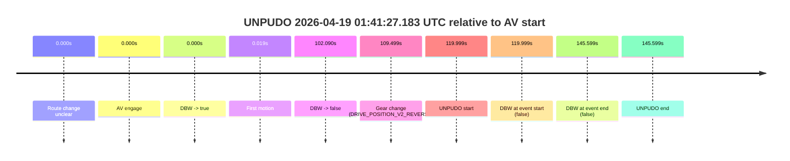

# Run Report: fme10005/2026-04-19--00-47-38--gen2-av-3f0d5fb3-b27c-4f38-9595-d20a00b51acc

| Field | Value |
|---|---|
| Run ID | `fme10005/2026-04-19--00-47-38--gen2-av-3f0d5fb3-b27c-4f38-9595-d20a00b51acc` |
| Date | `2026-04-19` |
| Model(s) | `eel-teal-outspoken` |
| Author | `zak` |
| Event count | `1` |

## unpudo 2026-04-19 01:41:27.183 UTC

| Field | Value |
|---|---|
| Model | `eel-teal-outspoken` |
| Author | `zak` |
| Run ID | `fme10005/2026-04-19--00-47-38--gen2-av-3f0d5fb3-b27c-4f38-9595-d20a00b51acc` |
| Date | `2026-04-19` |
| Time (UTC) | `01:41:27.183` |
| Event type | `unpudo` |
| Disengagement type | `failed_to_pudo` |
| Route change | `unclear` |
| Console | [run](https://console.sso.wayve.ai/run/fme10005/2026-04-19--00-47-38--gen2-av-3f0d5fb3-b27c-4f38-9595-d20a00b51acc?id=&time-unixus=1776562887183311) |
| Foxglove | [segment](https://app.foxglove.dev/wayve-on-prem/p/prj_0dX18KZdVHg1fmmI/view?ds=foxglove-stream&ds.deviceName=fme10005&ds.start=2026-04-19T01%3A39%3A17.184196Z&ds.end=2026-04-19T01%3A42%3A02.783309Z&layoutId=lay_0e7VD4WIKDQGU73Y&time=2026-04-19T01%3A41%3A27.183311Z) |

### Event card: fail

- Fail: AV owns part of the segment, but the event still resolves as a model-performance failure under the AV-only scoring rule.

| Event | Time (UTC) | Delta from AV start |
|---|---:|---:|
| Route change unclear | 2026-04-19 01:39:27.184 | `0.000s` |
| AV engage | 2026-04-19 01:39:27.184 | `0.000s` |
| DBW -> true | 2026-04-19 01:39:27.184 | `0.000s` |
| First motion | 2026-04-19 01:39:27.202 | `0.019s` |
| DBW -> false | 2026-04-19 01:41:09.274 | `102.090s` |
| Gear change (DRIVE_POSITION_V2_REVERSE) | 2026-04-19 01:41:16.683 | `109.499s` |
| UNPUDO start | 2026-04-19 01:41:27.183 | `119.999s` |
| DBW at event start (false) | 2026-04-19 01:41:27.183 | `119.999s` |
| DBW at event end (false) | 2026-04-19 01:41:52.783 | `145.599s` |
| UNPUDO end | 2026-04-19 01:41:52.783 | `145.599s` |

| Metric | Value |
|---|---|
| Outcome | `fail` |
| Effective failure type | `failed_to_pudo` |
| Route change status | `unclear` |
| DBW at event start | `false` |
| DBW at event end | `false` |
| Predicted gear at AV start | `DRIVE_POSITION_V2_DRIVE` |
| Actual gear at AV start | `DRIVE_POSITION_V2_DRIVE` |
| Predicted gear at event start | `DRIVE_POSITION_V2_REVERSE` |
| Actual gear at event start | `DRIVE_POSITION_V2_REVERSE` |
| Planned indicator direction | `INDICATORS_STATE_V2_OFF` |
| Controller indicator direction | `INDICATORS_STATE_V2_OFF` |
| Actual indicator direction | `INDICATORS_STATE_V2_OFF` |
| Actual indicator at maneuver end | `INDICATORS_STATE_V2_OFF` |
| Driver accel help in AV | `false` |
| Driver accel help timestamp | `n/a` |
| Max accel pedal pct in AV | `0.0%` |
| Max brake pedal pct in AV | `11.0%` |
| Max speed mps in AV | `9.944` |
| Success timing baseline | `AV start` |
| Route -> AV | `n/a` |
| AV -> event start | `119.999s` |
| AV -> first motion | `0.019s` |
| Success baseline -> event start | `119.999s` |
| Success baseline -> first motion | `0.019s` |
| AV duration before disengagement | `102.090s` |
| Trajectory waypoint count | `37` |
| Driving-plan step count | `11` |

The scored portion starts from the AV-owned window, not from the pre-AV setup. Route-change search in the stopped pre-event segment was `unclear`, with the baseline therefore set to AV start. At the event anchor the model predicts `DRIVE_POSITION_V2_REVERSE` and the actual gear is `DRIVE_POSITION_V2_REVERSE`. The effective model outcome is `fail` because `failed_to_pudo.`

### Resolution

| Field | Value |
|---|---|
| Final outcome | `fail` |
| Do we agree with this label? | `yes` |
| Source disengagement type | `failed_to_pudo` |
| Resolved effective failure type | `failed_to_pudo` |
| Confidence | `medium` |
