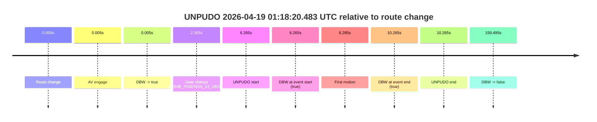
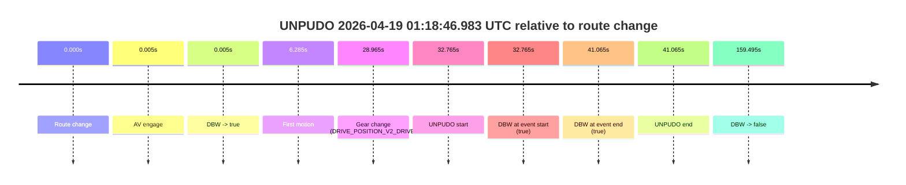
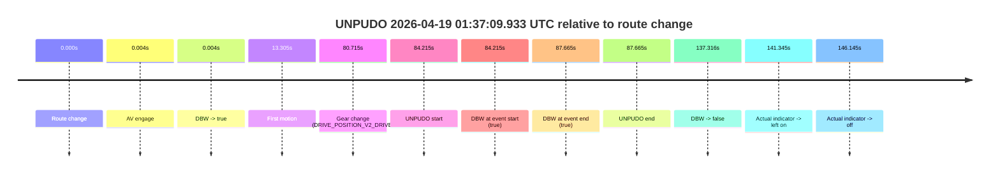
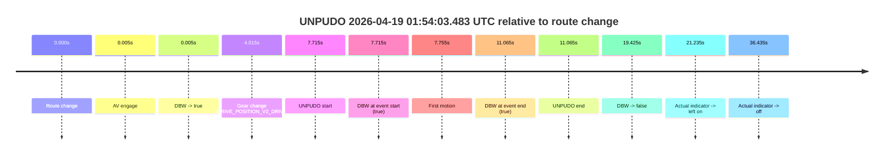
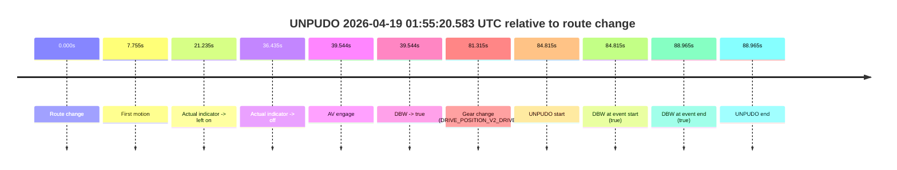

# Run Report: fme10005/2026-04-19--00-47-38--gen2-av-3f0d5fb3-b27c-4f38-9595-d20a00b51acc

| Field | Value |
|---|---|
| Run ID | `fme10005/2026-04-19--00-47-38--gen2-av-3f0d5fb3-b27c-4f38-9595-d20a00b51acc` |
| Date | `2026-04-19` |
| Model(s) | `eel-teal-outspoken` |
| Author | `zak` |
| Event count | `6` |

## unpudo 2026-04-19 01:18:20.483 UTC

| Field | Value |
|---|---|
| Model | `eel-teal-outspoken` |
| Author | `zak` |
| Run ID | `fme10005/2026-04-19--00-47-38--gen2-av-3f0d5fb3-b27c-4f38-9595-d20a00b51acc` |
| Date | `2026-04-19` |
| Time (UTC) | `01:18:20.483` |
| Event type | `unpudo` |
| Disengagement type | `none observed` |
| Route change | `found` |
| Console | [run](https://console.sso.wayve.ai/run/fme10005/2026-04-19--00-47-38--gen2-av-3f0d5fb3-b27c-4f38-9595-d20a00b51acc?id=&time-unixus=1776561500483313) |
| Foxglove | [segment](https://app.foxglove.dev/wayve-on-prem/p/prj_0dX18KZdVHg1fmmI/view?ds=foxglove-stream&ds.deviceName=fme10005&ds.start=2026-04-19T01%3A18%3A04.218205Z&ds.end=2026-04-19T01%3A21%3A03.712727Z&layoutId=lay_0e7VD4WIKDQGU73Y&time=2026-04-19T01%3A18%3A20.483313Z) |

### Event card: pass

- Pass: AV owns the credited unpudo from route change through the official unpudo window, the gear state is aligned at the anchor, and the vehicle moves without driver accelerator help in AV.

| Event | Time (UTC) | Delta from route change |
|---|---:|---:|
| Route change | 2026-04-19 01:18:14.218 | `0.000s` |
| AV engage | 2026-04-19 01:18:14.222 | `0.005s` |
| DBW -> true | 2026-04-19 01:18:14.222 | `0.005s` |
| Gear change (DRIVE_POSITION_V2_DRIVE) | 2026-04-19 01:18:16.583 | `2.365s` |
| UNPUDO start | 2026-04-19 01:18:20.483 | `6.265s` |
| DBW at event start (true) | 2026-04-19 01:18:20.483 | `6.265s` |
| First motion | 2026-04-19 01:18:20.502 | `6.285s` |
| DBW at event end (true) | 2026-04-19 01:18:24.483 | `10.265s` |
| UNPUDO end | 2026-04-19 01:18:24.483 | `10.265s` |
| DBW -> false | 2026-04-19 01:20:53.712 | `159.495s` |

| Metric | Value |
|---|---|
| Outcome | `pass` |
| Effective failure type | `none` |
| Route change status | `found` |
| DBW at event start | `true` |
| DBW at event end | `true` |
| Predicted gear at AV start | `DRIVE_POSITION_V2_PARK` |
| Actual gear at AV start | `DRIVE_POSITION_V2_PARK` |
| Predicted gear at event start | `DRIVE_POSITION_V2_DRIVE` |
| Actual gear at event start | `DRIVE_POSITION_V2_DRIVE` |
| Planned indicator direction | `INDICATORS_STATE_V2_LEFT_ON` |
| Controller indicator direction | `INDICATORS_STATE_V2_LEFT_ON` |
| Actual indicator direction | `INDICATORS_STATE_V2_OFF` |
| Actual indicator at maneuver end | `INDICATORS_STATE_V2_OFF` |
| Driver accel help in AV | `false` |
| Driver accel help timestamp | `n/a` |
| Max accel pedal pct in AV | `0.0%` |
| Max brake pedal pct in AV | `23.2%` |
| Max speed mps in AV | `3.486` |
| Success timing baseline | `route change` |
| Route -> AV | `0.005s` |
| AV -> event start | `6.260s` |
| AV -> first motion | `6.280s` |
| Success baseline -> event start | `6.265s` |
| Success baseline -> first motion | `6.285s` |
| AV duration before disengagement | `159.490s` |
| Trajectory waypoint count | `37` |
| Driving-plan step count | `11` |

The scored portion starts from the AV-owned window, not from the pre-AV setup. Route-change search in the stopped pre-event segment was `found`, with the baseline therefore set to route change. At the event anchor the model predicts `DRIVE_POSITION_V2_DRIVE` and the actual gear is `DRIVE_POSITION_V2_DRIVE`. The effective model outcome is `pass` because `the credited unpudo stays AV-owned through the official unpudo window.`

### Resolution

| Field | Value |
|---|---|
| Final outcome | `pass` |
| Do we agree with this label? | `yes` |
| Source disengagement type | `none observed` |
| Resolved effective failure type | `none` |
| Confidence | `high` |

## unpudo 2026-04-19 01:18:46.983 UTC

| Field | Value |
|---|---|
| Model | `eel-teal-outspoken` |
| Author | `zak` |
| Run ID | `fme10005/2026-04-19--00-47-38--gen2-av-3f0d5fb3-b27c-4f38-9595-d20a00b51acc` |
| Date | `2026-04-19` |
| Time (UTC) | `01:18:46.983` |
| Event type | `unpudo` |
| Disengagement type | `none observed` |
| Route change | `found` |
| Console | [run](https://console.sso.wayve.ai/run/fme10005/2026-04-19--00-47-38--gen2-av-3f0d5fb3-b27c-4f38-9595-d20a00b51acc?id=&time-unixus=1776561526983306) |
| Foxglove | [segment](https://app.foxglove.dev/wayve-on-prem/p/prj_0dX18KZdVHg1fmmI/view?ds=foxglove-stream&ds.deviceName=fme10005&ds.start=2026-04-19T01%3A18%3A04.218205Z&ds.end=2026-04-19T01%3A21%3A03.712727Z&layoutId=lay_0e7VD4WIKDQGU73Y&time=2026-04-19T01%3A18%3A46.983306Z) |

### Event card: pass

- Pass: AV owns the credited unpudo from route change through the official unpudo window, the gear state is aligned at the anchor, and the vehicle moves without driver accelerator help in AV.

| Event | Time (UTC) | Delta from route change |
|---|---:|---:|
| Route change | 2026-04-19 01:18:14.218 | `0.000s` |
| AV engage | 2026-04-19 01:18:14.222 | `0.005s` |
| DBW -> true | 2026-04-19 01:18:14.222 | `0.005s` |
| First motion | 2026-04-19 01:18:20.502 | `6.285s` |
| Gear change (DRIVE_POSITION_V2_DRIVE) | 2026-04-19 01:18:43.183 | `28.965s` |
| UNPUDO start | 2026-04-19 01:18:46.983 | `32.765s` |
| DBW at event start (true) | 2026-04-19 01:18:46.983 | `32.765s` |
| DBW at event end (true) | 2026-04-19 01:18:55.283 | `41.065s` |
| UNPUDO end | 2026-04-19 01:18:55.283 | `41.065s` |
| DBW -> false | 2026-04-19 01:20:53.712 | `159.495s` |

| Metric | Value |
|---|---|
| Outcome | `pass` |
| Effective failure type | `none` |
| Route change status | `found` |
| DBW at event start | `true` |
| DBW at event end | `true` |
| Predicted gear at AV start | `DRIVE_POSITION_V2_PARK` |
| Actual gear at AV start | `DRIVE_POSITION_V2_PARK` |
| Predicted gear at event start | `DRIVE_POSITION_V2_DRIVE` |
| Actual gear at event start | `DRIVE_POSITION_V2_DRIVE` |
| Planned indicator direction | `INDICATORS_STATE_V2_LEFT_ON` |
| Controller indicator direction | `INDICATORS_STATE_V2_LEFT_ON` |
| Actual indicator direction | `INDICATORS_STATE_V2_OFF` |
| Actual indicator at maneuver end | `INDICATORS_STATE_V2_OFF` |
| Driver accel help in AV | `false` |
| Driver accel help timestamp | `n/a` |
| Max accel pedal pct in AV | `0.0%` |
| Max brake pedal pct in AV | `25.2%` |
| Max speed mps in AV | `4.406` |
| Success timing baseline | `route change` |
| Route -> AV | `0.005s` |
| AV -> event start | `32.760s` |
| AV -> first motion | `6.280s` |
| Success baseline -> event start | `32.765s` |
| Success baseline -> first motion | `6.285s` |
| AV duration before disengagement | `159.490s` |
| Trajectory waypoint count | `37` |
| Driving-plan step count | `11` |

The scored portion starts from the AV-owned window, not from the pre-AV setup. Route-change search in the stopped pre-event segment was `found`, with the baseline therefore set to route change. At the event anchor the model predicts `DRIVE_POSITION_V2_DRIVE` and the actual gear is `DRIVE_POSITION_V2_DRIVE`. The effective model outcome is `pass` because `the credited unpudo stays AV-owned through the official unpudo window.`

### Resolution

| Field | Value |
|---|---|
| Final outcome | `pass` |
| Do we agree with this label? | `yes` |
| Source disengagement type | `none observed` |
| Resolved effective failure type | `none` |
| Confidence | `high` |

## unpudo 2026-04-19 01:37:09.933 UTC

| Field | Value |
|---|---|
| Model | `eel-teal-outspoken` |
| Author | `zak` |
| Run ID | `fme10005/2026-04-19--00-47-38--gen2-av-3f0d5fb3-b27c-4f38-9595-d20a00b51acc` |
| Date | `2026-04-19` |
| Time (UTC) | `01:37:09.933` |
| Event type | `unpudo` |
| Disengagement type | `none observed` |
| Route change | `found` |
| Console | [run](https://console.sso.wayve.ai/run/fme10005/2026-04-19--00-47-38--gen2-av-3f0d5fb3-b27c-4f38-9595-d20a00b51acc?id=&time-unixus=1776562629933300) |
| Foxglove | [segment](https://app.foxglove.dev/wayve-on-prem/p/prj_0dX18KZdVHg1fmmI/view?ds=foxglove-stream&ds.deviceName=fme10005&ds.start=2026-04-19T01%3A35%3A35.718229Z&ds.end=2026-04-19T01%3A38%3A13.033981Z&layoutId=lay_0e7VD4WIKDQGU73Y&time=2026-04-19T01%3A37%3A09.933300Z) |

### Event card: pass

- Pass: AV owns the credited unpudo from route change through the official unpudo window, the gear state is aligned at the anchor, and the vehicle moves without driver accelerator help in AV.

| Event | Time (UTC) | Delta from route change |
|---|---:|---:|
| Route change | 2026-04-19 01:35:45.718 | `0.000s` |
| AV engage | 2026-04-19 01:35:45.722 | `0.004s` |
| DBW -> true | 2026-04-19 01:35:45.722 | `0.004s` |
| First motion | 2026-04-19 01:35:59.022 | `13.305s` |
| Gear change (DRIVE_POSITION_V2_DRIVE) | 2026-04-19 01:37:06.433 | `80.715s` |
| UNPUDO start | 2026-04-19 01:37:09.933 | `84.215s` |
| DBW at event start (true) | 2026-04-19 01:37:09.933 | `84.215s` |
| DBW at event end (true) | 2026-04-19 01:37:13.383 | `87.665s` |
| UNPUDO end | 2026-04-19 01:37:13.383 | `87.665s` |
| DBW -> false | 2026-04-19 01:38:03.033 | `137.316s` |
| Actual indicator -> left on | 2026-04-19 01:38:07.062 | `141.345s` |
| Actual indicator -> off | 2026-04-19 01:38:11.862 | `146.145s` |

| Metric | Value |
|---|---|
| Outcome | `pass` |
| Effective failure type | `none` |
| Route change status | `found` |
| DBW at event start | `true` |
| DBW at event end | `true` |
| Predicted gear at AV start | `DRIVE_POSITION_V2_PARK` |
| Actual gear at AV start | `DRIVE_POSITION_V2_PARK` |
| Predicted gear at event start | `DRIVE_POSITION_V2_DRIVE` |
| Actual gear at event start | `DRIVE_POSITION_V2_DRIVE` |
| Planned indicator direction | `INDICATORS_STATE_V2_LEFT_ON` |
| Controller indicator direction | `INDICATORS_STATE_V2_LEFT_ON` |
| Actual indicator direction | `INDICATORS_STATE_V2_OFF` |
| Actual indicator at maneuver end | `INDICATORS_STATE_V2_OFF` |
| Driver accel help in AV | `false` |
| Driver accel help timestamp | `n/a` |
| Max accel pedal pct in AV | `0.0%` |
| Max brake pedal pct in AV | `8.2%` |
| Max speed mps in AV | `11.917` |
| Success timing baseline | `route change` |
| Route -> AV | `0.004s` |
| AV -> event start | `84.211s` |
| AV -> first motion | `13.301s` |
| Success baseline -> event start | `84.215s` |
| Success baseline -> first motion | `13.305s` |
| AV duration before disengagement | `137.312s` |
| Trajectory waypoint count | `38` |
| Driving-plan step count | `11` |

The scored portion starts from the AV-owned window, not from the pre-AV setup. Route-change search in the stopped pre-event segment was `found`, with the baseline therefore set to route change. At the event anchor the model predicts `DRIVE_POSITION_V2_DRIVE` and the actual gear is `DRIVE_POSITION_V2_DRIVE`. The effective model outcome is `pass` because `the credited unpudo stays AV-owned through the official unpudo window.`

### Resolution

| Field | Value |
|---|---|
| Final outcome | `pass` |
| Do we agree with this label? | `yes` |
| Source disengagement type | `none observed` |
| Resolved effective failure type | `none` |
| Confidence | `high` |

## unpudo 2026-04-19 01:41:27.183 UTC

| Field | Value |
|---|---|
| Model | `eel-teal-outspoken` |
| Author | `zak` |
| Run ID | `fme10005/2026-04-19--00-47-38--gen2-av-3f0d5fb3-b27c-4f38-9595-d20a00b51acc` |
| Date | `2026-04-19` |
| Time (UTC) | `01:41:27.183` |
| Event type | `unpudo` |
| Disengagement type | `failed_to_pudo` |
| Route change | `unclear` |
| Console | [run](https://console.sso.wayve.ai/run/fme10005/2026-04-19--00-47-38--gen2-av-3f0d5fb3-b27c-4f38-9595-d20a00b51acc?id=&time-unixus=1776562887183311) |
| Foxglove | [segment](https://app.foxglove.dev/wayve-on-prem/p/prj_0dX18KZdVHg1fmmI/view?ds=foxglove-stream&ds.deviceName=fme10005&ds.start=2026-04-19T01%3A39%3A17.184196Z&ds.end=2026-04-19T01%3A42%3A02.783309Z&layoutId=lay_0e7VD4WIKDQGU73Y&time=2026-04-19T01%3A41%3A27.183311Z) |

### Event card: fail

- Fail: AV owns part of the segment, but the event still resolves as a model-performance failure under the AV-only scoring rule.

| Event | Time (UTC) | Delta from AV start |
|---|---:|---:|
| Route change unclear | 2026-04-19 01:39:27.184 | `0.000s` |
| AV engage | 2026-04-19 01:39:27.184 | `0.000s` |
| DBW -> true | 2026-04-19 01:39:27.184 | `0.000s` |
| First motion | 2026-04-19 01:39:27.202 | `0.019s` |
| DBW -> false | 2026-04-19 01:41:09.274 | `102.090s` |
| Gear change (DRIVE_POSITION_V2_REVERSE) | 2026-04-19 01:41:16.683 | `109.499s` |
| UNPUDO start | 2026-04-19 01:41:27.183 | `119.999s` |
| DBW at event start (false) | 2026-04-19 01:41:27.183 | `119.999s` |
| DBW at event end (true) | 2026-04-19 01:41:52.783 | `145.599s` |
| UNPUDO end | 2026-04-19 01:41:52.783 | `145.599s` |

| Metric | Value |
|---|---|
| Outcome | `fail` |
| Effective failure type | `failed_to_pudo` |
| Route change status | `unclear` |
| DBW at event start | `false` |
| DBW at event end | `true` |
| Predicted gear at AV start | `DRIVE_POSITION_V2_DRIVE` |
| Actual gear at AV start | `DRIVE_POSITION_V2_DRIVE` |
| Predicted gear at event start | `DRIVE_POSITION_V2_REVERSE` |
| Actual gear at event start | `DRIVE_POSITION_V2_REVERSE` |
| Planned indicator direction | `INDICATORS_STATE_V2_OFF` |
| Controller indicator direction | `INDICATORS_STATE_V2_OFF` |
| Actual indicator direction | `INDICATORS_STATE_V2_OFF` |
| Actual indicator at maneuver end | `INDICATORS_STATE_V2_OFF` |
| Driver accel help in AV | `false` |
| Driver accel help timestamp | `n/a` |
| Max accel pedal pct in AV | `0.0%` |
| Max brake pedal pct in AV | `11.0%` |
| Max speed mps in AV | `9.944` |
| Success timing baseline | `AV start` |
| Route -> AV | `n/a` |
| AV -> event start | `119.999s` |
| AV -> first motion | `0.019s` |
| Success baseline -> event start | `119.999s` |
| Success baseline -> first motion | `0.019s` |
| AV duration before disengagement | `102.090s` |
| Trajectory waypoint count | `37` |
| Driving-plan step count | `11` |

The scored portion starts from the AV-owned window, not from the pre-AV setup. Route-change search in the stopped pre-event segment was `unclear`, with the baseline therefore set to AV start. At the event anchor the model predicts `DRIVE_POSITION_V2_REVERSE` and the actual gear is `DRIVE_POSITION_V2_REVERSE`. The effective model outcome is `fail` because `failed_to_pudo.`

### Resolution

| Field | Value |
|---|---|
| Final outcome | `fail` |
| Do we agree with this label? | `yes` |
| Source disengagement type | `failed_to_pudo` |
| Resolved effective failure type | `failed_to_pudo` |
| Confidence | `medium` |

## unpudo 2026-04-19 01:54:03.483 UTC

| Field | Value |
|---|---|
| Model | `eel-teal-outspoken` |
| Author | `zak` |
| Run ID | `fme10005/2026-04-19--00-47-38--gen2-av-3f0d5fb3-b27c-4f38-9595-d20a00b51acc` |
| Date | `2026-04-19` |
| Time (UTC) | `01:54:03.483` |
| Event type | `unpudo` |
| Disengagement type | `none observed` |
| Route change | `found` |
| Console | [run](https://console.sso.wayve.ai/run/fme10005/2026-04-19--00-47-38--gen2-av-3f0d5fb3-b27c-4f38-9595-d20a00b51acc?id=&time-unixus=1776563643483293) |
| Foxglove | [segment](https://app.foxglove.dev/wayve-on-prem/p/prj_0dX18KZdVHg1fmmI/view?ds=foxglove-stream&ds.deviceName=fme10005&ds.start=2026-04-19T01%3A53%3A45.768225Z&ds.end=2026-04-19T01%3A54%3A25.192817Z&layoutId=lay_0e7VD4WIKDQGU73Y&time=2026-04-19T01%3A54%3A03.483293Z) |

### Event card: pass

- Pass: AV owns the credited unpudo from route change through the official unpudo window, the gear state is aligned at the anchor, and the vehicle moves without driver accelerator help in AV.

| Event | Time (UTC) | Delta from route change |
|---|---:|---:|
| Route change | 2026-04-19 01:53:55.768 | `0.000s` |
| AV engage | 2026-04-19 01:53:55.772 | `0.005s` |
| DBW -> true | 2026-04-19 01:53:55.772 | `0.005s` |
| Gear change (DRIVE_POSITION_V2_DRIVE) | 2026-04-19 01:53:59.783 | `4.015s` |
| UNPUDO start | 2026-04-19 01:54:03.483 | `7.715s` |
| DBW at event start (true) | 2026-04-19 01:54:03.483 | `7.715s` |
| First motion | 2026-04-19 01:54:03.522 | `7.755s` |
| DBW at event end (true) | 2026-04-19 01:54:06.833 | `11.065s` |
| UNPUDO end | 2026-04-19 01:54:06.833 | `11.065s` |
| DBW -> false | 2026-04-19 01:54:15.192 | `19.425s` |
| Actual indicator -> left on | 2026-04-19 01:54:17.002 | `21.235s` |
| Actual indicator -> off | 2026-04-19 01:54:32.202 | `36.435s` |

| Metric | Value |
|---|---|
| Outcome | `pass` |
| Effective failure type | `none` |
| Route change status | `found` |
| DBW at event start | `true` |
| DBW at event end | `true` |
| Predicted gear at AV start | `DRIVE_POSITION_V2_PARK` |
| Actual gear at AV start | `DRIVE_POSITION_V2_PARK` |
| Predicted gear at event start | `DRIVE_POSITION_V2_DRIVE` |
| Actual gear at event start | `DRIVE_POSITION_V2_DRIVE` |
| Planned indicator direction | `INDICATORS_STATE_V2_OFF` |
| Controller indicator direction | `INDICATORS_STATE_V2_LEFT_ON` |
| Actual indicator direction | `INDICATORS_STATE_V2_OFF` |
| Actual indicator at maneuver end | `INDICATORS_STATE_V2_OFF` |
| Driver accel help in AV | `false` |
| Driver accel help timestamp | `n/a` |
| Max accel pedal pct in AV | `0.0%` |
| Max brake pedal pct in AV | `9.3%` |
| Max speed mps in AV | `4.747` |
| Success timing baseline | `route change` |
| Route -> AV | `0.005s` |
| AV -> event start | `7.710s` |
| AV -> first motion | `7.750s` |
| Success baseline -> event start | `7.715s` |
| Success baseline -> first motion | `7.755s` |
| AV duration before disengagement | `19.420s` |
| Trajectory waypoint count | `37` |
| Driving-plan step count | `11` |

The scored portion starts from the AV-owned window, not from the pre-AV setup. Route-change search in the stopped pre-event segment was `found`, with the baseline therefore set to route change. At the event anchor the model predicts `DRIVE_POSITION_V2_DRIVE` and the actual gear is `DRIVE_POSITION_V2_DRIVE`. The effective model outcome is `pass` because `the credited unpudo stays AV-owned through the official unpudo window.`

### Resolution

| Field | Value |
|---|---|
| Final outcome | `pass` |
| Do we agree with this label? | `yes` |
| Source disengagement type | `none observed` |
| Resolved effective failure type | `none` |
| Confidence | `high` |

## unpudo 2026-04-19 01:55:20.583 UTC

| Field | Value |
|---|---|
| Model | `eel-teal-outspoken` |
| Author | `zak` |
| Run ID | `fme10005/2026-04-19--00-47-38--gen2-av-3f0d5fb3-b27c-4f38-9595-d20a00b51acc` |
| Date | `2026-04-19` |
| Time (UTC) | `01:55:20.583` |
| Event type | `unpudo` |
| Disengagement type | `none observed` |
| Route change | `found` |
| Console | [run](https://console.sso.wayve.ai/run/fme10005/2026-04-19--00-47-38--gen2-av-3f0d5fb3-b27c-4f38-9595-d20a00b51acc?id=&time-unixus=1776563720583316) |
| Foxglove | [segment](https://app.foxglove.dev/wayve-on-prem/p/prj_0dX18KZdVHg1fmmI/view?ds=foxglove-stream&ds.deviceName=fme10005&ds.start=2026-04-19T01%3A53%3A45.768225Z&ds.end=2026-04-19T01%3A55%3A34.733307Z&layoutId=lay_0e7VD4WIKDQGU73Y&time=2026-04-19T01%3A55%3A20.583316Z) |

### Event card: pass

- Pass: AV owns the credited unpudo from route change through the official unpudo window, the gear state is aligned at the anchor, and the vehicle moves without driver accelerator help in AV.

| Event | Time (UTC) | Delta from route change |
|---|---:|---:|
| Route change | 2026-04-19 01:53:55.768 | `0.000s` |
| First motion | 2026-04-19 01:54:03.522 | `7.755s` |
| Actual indicator -> left on | 2026-04-19 01:54:17.002 | `21.235s` |
| Actual indicator -> off | 2026-04-19 01:54:32.202 | `36.435s` |
| AV engage | 2026-04-19 01:54:35.312 | `39.544s` |
| DBW -> true | 2026-04-19 01:54:35.312 | `39.544s` |
| Gear change (DRIVE_POSITION_V2_DRIVE) | 2026-04-19 01:55:17.083 | `81.315s` |
| UNPUDO start | 2026-04-19 01:55:20.583 | `84.815s` |
| DBW at event start (true) | 2026-04-19 01:55:20.583 | `84.815s` |
| DBW at event end (true) | 2026-04-19 01:55:24.733 | `88.965s` |
| UNPUDO end | 2026-04-19 01:55:24.733 | `88.965s` |

| Metric | Value |
|---|---|
| Outcome | `pass` |
| Effective failure type | `none` |
| Route change status | `found` |
| DBW at event start | `true` |
| DBW at event end | `true` |
| Predicted gear at AV start | `DRIVE_POSITION_V2_DRIVE` |
| Actual gear at AV start | `DRIVE_POSITION_V2_DRIVE` |
| Predicted gear at event start | `DRIVE_POSITION_V2_DRIVE` |
| Actual gear at event start | `DRIVE_POSITION_V2_DRIVE` |
| Planned indicator direction | `INDICATORS_STATE_V2_LEFT_ON` |
| Controller indicator direction | `INDICATORS_STATE_V2_LEFT_ON` |
| Actual indicator direction | `INDICATORS_STATE_V2_OFF` |
| Actual indicator at maneuver end | `INDICATORS_STATE_V2_OFF` |
| Driver accel help in AV | `false` |
| Driver accel help timestamp | `n/a` |
| Max accel pedal pct in AV | `0.0%` |
| Max brake pedal pct in AV | `8.0%` |
| Max speed mps in AV | `5.447` |
| Success timing baseline | `route change` |
| Route -> AV | `39.544s` |
| AV -> event start | `45.271s` |
| AV -> first motion | `-31.789s` |
| Success baseline -> event start | `84.815s` |
| Success baseline -> first motion | `7.755s` |
| AV duration before disengagement | `n/a` |
| Trajectory waypoint count | `37` |
| Driving-plan step count | `11` |

The scored portion starts from the AV-owned window, not from the pre-AV setup. Route-change search in the stopped pre-event segment was `found`, with the baseline therefore set to route change. At the event anchor the model predicts `DRIVE_POSITION_V2_DRIVE` and the actual gear is `DRIVE_POSITION_V2_DRIVE`. The effective model outcome is `pass` because `the credited unpudo stays AV-owned through the official unpudo window.`

### Resolution

| Field | Value |
|---|---|
| Final outcome | `pass` |
| Do we agree with this label? | `yes` |
| Source disengagement type | `none observed` |
| Resolved effective failure type | `none` |
| Confidence | `high` |
