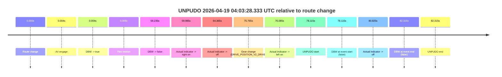
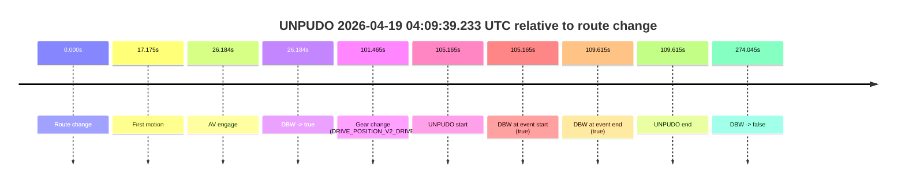
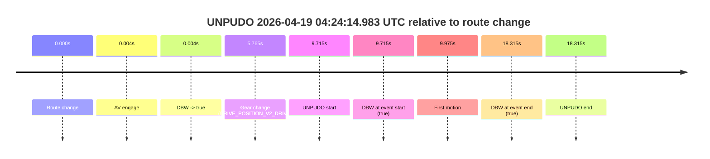

# Run Report: fme10005/2026-04-19--03-57-12--gen2-av-717a27a9-10ef-4f6b-b024-abe144179fbb

| Field | Value |
|---|---|
| Run ID | `fme10005/2026-04-19--03-57-12--gen2-av-717a27a9-10ef-4f6b-b024-abe144179fbb` |
| Date | `2026-04-19` |
| Model(s) | `eel-teal-outspoken` |
| Author | `zak` |
| Event count | `4` |

## unpudo 2026-04-19 04:03:28.333 UTC

| Field | Value |
|---|---|
| Model | `eel-teal-outspoken` |
| Author | `zak` |
| Run ID | `fme10005/2026-04-19--03-57-12--gen2-av-717a27a9-10ef-4f6b-b024-abe144179fbb` |
| Date | `2026-04-19` |
| Time (UTC) | `04:03:28.333` |
| Event type | `unpudo` |
| Disengagement type | `none observed` |
| Route change | `found` |
| Console | [run](https://console.sso.wayve.ai/run/fme10005/2026-04-19--03-57-12--gen2-av-717a27a9-10ef-4f6b-b024-abe144179fbb?id=&time-unixus=1776571408333303) |
| Foxglove | [segment](https://app.foxglove.dev/wayve-on-prem/p/prj_0dX18KZdVHg1fmmI/view?ds=foxglove-stream&ds.deviceName=fme10005&ds.start=2026-04-19T04%3A02%3A00.218206Z&ds.end=2026-04-19T04%3A03%3A42.533292Z&layoutId=lay_0e7VD4WIKDQGU73Y&time=2026-04-19T04%3A03%3A28.333303Z) |

### Event card: fail

- Fail: the credited unpudo does not stay AV-owned. The event window starts with DBW false, and the maneuver outcome lands outside a clean AV-owned segment.

| Event | Time (UTC) | Delta from route change |
|---|---:|---:|
| Route change | 2026-04-19 04:02:10.218 | `0.000s` |
| AV engage | 2026-04-19 04:02:10.221 | `0.004s` |
| DBW -> true | 2026-04-19 04:02:10.221 | `0.004s` |
| First motion | 2026-04-19 04:02:10.222 | `0.005s` |
| DBW -> false | 2026-04-19 04:03:08.453 | `58.235s` |
| Actual indicator -> right on | 2026-04-19 04:03:10.202 | `59.985s` |
| Actual indicator -> off | 2026-04-19 04:03:14.582 | `64.365s` |
| Gear change (DRIVE_POSITION_V2_DRIVE) | 2026-04-19 04:03:25.983 | `75.765s` |
| Actual indicator -> left on | 2026-04-19 04:03:26.302 | `76.085s` |
| UNPUDO start | 2026-04-19 04:03:28.333 | `78.115s` |
| DBW at event start (false) | 2026-04-19 04:03:28.333 | `78.115s` |
| Actual indicator -> off | 2026-04-19 04:03:31.043 | `80.825s` |
| DBW at event end (false) | 2026-04-19 04:03:32.533 | `82.315s` |
| UNPUDO end | 2026-04-19 04:03:32.533 | `82.315s` |

| Metric | Value |
|---|---|
| Outcome | `fail` |
| Effective failure type | `not_av_owned` |
| Route change status | `found` |
| DBW at event start | `false` |
| DBW at event end | `false` |
| Predicted gear at AV start | `DRIVE_POSITION_V2_DRIVE` |
| Actual gear at AV start | `DRIVE_POSITION_V2_DRIVE` |
| Predicted gear at event start | `DRIVE_POSITION_V2_DRIVE` |
| Actual gear at event start | `DRIVE_POSITION_V2_DRIVE` |
| Planned indicator direction | `INDICATORS_STATE_V2_LEFT_ON` |
| Controller indicator direction | `INDICATORS_STATE_V2_LEFT_ON` |
| Actual indicator direction | `INDICATORS_STATE_V2_LEFT_ON` |
| Actual indicator at maneuver end | `INDICATORS_STATE_V2_OFF` |
| Driver accel help in AV | `false` |
| Driver accel help timestamp | `n/a` |
| Max accel pedal pct in AV | `0.0%` |
| Max brake pedal pct in AV | `0.0%` |
| Max speed mps in AV | `14.867` |
| Success timing baseline | `route change` |
| Route -> AV | `0.004s` |
| AV -> event start | `78.112s` |
| AV -> first motion | `0.001s` |
| Success baseline -> event start | `78.115s` |
| Success baseline -> first motion | `0.005s` |
| AV duration before disengagement | `58.231s` |
| Trajectory waypoint count | `38` |
| Driving-plan step count | `11` |

The scored portion starts from the AV-owned window, not from the pre-AV setup. Route-change search in the stopped pre-event segment was `found`, with the baseline therefore set to route change. At the event anchor the model predicts `DRIVE_POSITION_V2_DRIVE` and the actual gear is `DRIVE_POSITION_V2_DRIVE`. The effective model outcome is `fail` because `not_av_owned.`

### Resolution

| Field | Value |
|---|---|
| Final outcome | `fail` |
| Do we agree with this label? | `yes` |
| Source disengagement type | `none observed` |
| Resolved effective failure type | `not_av_owned` |
| Confidence | `high` |

## unpudo 2026-04-19 04:09:39.233 UTC

| Field | Value |
|---|---|
| Model | `eel-teal-outspoken` |
| Author | `zak` |
| Run ID | `fme10005/2026-04-19--03-57-12--gen2-av-717a27a9-10ef-4f6b-b024-abe144179fbb` |
| Date | `2026-04-19` |
| Time (UTC) | `04:09:39.233` |
| Event type | `unpudo` |
| Disengagement type | `none observed` |
| Route change | `found` |
| Console | [run](https://console.sso.wayve.ai/run/fme10005/2026-04-19--03-57-12--gen2-av-717a27a9-10ef-4f6b-b024-abe144179fbb?id=&time-unixus=1776571779233295) |
| Foxglove | [segment](https://app.foxglove.dev/wayve-on-prem/p/prj_0dX18KZdVHg1fmmI/view?ds=foxglove-stream&ds.deviceName=fme10005&ds.start=2026-04-19T04%3A07%3A44.068230Z&ds.end=2026-04-19T04%3A12%3A38.112931Z&layoutId=lay_0e7VD4WIKDQGU73Y&time=2026-04-19T04%3A09%3A39.233295Z) |

### Event card: pass

- Pass: AV owns the credited unpudo from route change through the official unpudo window, the gear state is aligned at the anchor, and the vehicle moves without driver accelerator help in AV.

| Event | Time (UTC) | Delta from route change |
|---|---:|---:|
| Route change | 2026-04-19 04:07:54.068 | `0.000s` |
| First motion | 2026-04-19 04:08:11.242 | `17.175s` |
| AV engage | 2026-04-19 04:08:20.251 | `26.184s` |
| DBW -> true | 2026-04-19 04:08:20.251 | `26.184s` |
| Gear change (DRIVE_POSITION_V2_DRIVE) | 2026-04-19 04:09:35.533 | `101.465s` |
| UNPUDO start | 2026-04-19 04:09:39.233 | `105.165s` |
| DBW at event start (true) | 2026-04-19 04:09:39.233 | `105.165s` |
| DBW at event end (true) | 2026-04-19 04:09:43.683 | `109.615s` |
| UNPUDO end | 2026-04-19 04:09:43.683 | `109.615s` |
| DBW -> false | 2026-04-19 04:12:28.112 | `274.045s` |

| Metric | Value |
|---|---|
| Outcome | `pass` |
| Effective failure type | `none` |
| Route change status | `found` |
| DBW at event start | `true` |
| DBW at event end | `true` |
| Predicted gear at AV start | `DRIVE_POSITION_V2_DRIVE` |
| Actual gear at AV start | `DRIVE_POSITION_V2_DRIVE` |
| Predicted gear at event start | `DRIVE_POSITION_V2_DRIVE` |
| Actual gear at event start | `DRIVE_POSITION_V2_DRIVE` |
| Planned indicator direction | `INDICATORS_STATE_V2_LEFT_ON` |
| Controller indicator direction | `INDICATORS_STATE_V2_LEFT_ON` |
| Actual indicator direction | `INDICATORS_STATE_V2_OFF` |
| Actual indicator at maneuver end | `INDICATORS_STATE_V2_OFF` |
| Driver accel help in AV | `false` |
| Driver accel help timestamp | `n/a` |
| Max accel pedal pct in AV | `0.0%` |
| Max brake pedal pct in AV | `8.1%` |
| Max speed mps in AV | `9.539` |
| Success timing baseline | `route change` |
| Route -> AV | `26.184s` |
| AV -> event start | `78.981s` |
| AV -> first motion | `-9.009s` |
| Success baseline -> event start | `105.165s` |
| Success baseline -> first motion | `17.175s` |
| AV duration before disengagement | `247.861s` |
| Trajectory waypoint count | `38` |
| Driving-plan step count | `11` |

The scored portion starts from the AV-owned window, not from the pre-AV setup. Route-change search in the stopped pre-event segment was `found`, with the baseline therefore set to route change. At the event anchor the model predicts `DRIVE_POSITION_V2_DRIVE` and the actual gear is `DRIVE_POSITION_V2_DRIVE`. The effective model outcome is `pass` because `the credited unpudo stays AV-owned through the official unpudo window.`

### Resolution

| Field | Value |
|---|---|
| Final outcome | `pass` |
| Do we agree with this label? | `yes` |
| Source disengagement type | `none observed` |
| Resolved effective failure type | `none` |
| Confidence | `high` |

## unpudo 2026-04-19 04:22:15.533 UTC

| Field | Value |
|---|---|
| Model | `eel-teal-outspoken` |
| Author | `zak` |
| Run ID | `fme10005/2026-04-19--03-57-12--gen2-av-717a27a9-10ef-4f6b-b024-abe144179fbb` |
| Date | `2026-04-19` |
| Time (UTC) | `04:22:15.533` |
| Event type | `unpudo` |
| Disengagement type | `none observed` |
| Route change | `found` |
| Console | [run](https://console.sso.wayve.ai/run/fme10005/2026-04-19--03-57-12--gen2-av-717a27a9-10ef-4f6b-b024-abe144179fbb?id=&time-unixus=1776572535533317) |
| Foxglove | [segment](https://app.foxglove.dev/wayve-on-prem/p/prj_0dX18KZdVHg1fmmI/view?ds=foxglove-stream&ds.deviceName=fme10005&ds.start=2026-04-19T04%3A21%3A27.818263Z&ds.end=2026-04-19T04%3A22%3A28.983297Z&layoutId=lay_0e7VD4WIKDQGU73Y&time=2026-04-19T04%3A22%3A15.533317Z) |

### Event card: pass

- Pass: AV owns the credited unpudo from route change through the official unpudo window, the gear state is aligned at the anchor, and the vehicle moves without driver accelerator help in AV.

| Event | Time (UTC) | Delta from route change |
|---|---:|---:|
| Route change | 2026-04-19 04:21:37.818 | `0.000s` |
| AV engage | 2026-04-19 04:21:37.821 | `0.004s` |
| DBW -> true | 2026-04-19 04:21:37.821 | `0.004s` |
| Gear change (DRIVE_POSITION_V2_DRIVE) | 2026-04-19 04:21:42.133 | `4.315s` |
| UNPUDO start | 2026-04-19 04:22:15.533 | `37.715s` |
| DBW at event start (true) | 2026-04-19 04:22:15.533 | `37.715s` |
| First motion | 2026-04-19 04:22:15.583 | `37.765s` |
| DBW at event end (true) | 2026-04-19 04:22:18.983 | `41.165s` |
| UNPUDO end | 2026-04-19 04:22:18.983 | `41.165s` |

| Metric | Value |
|---|---|
| Outcome | `pass` |
| Effective failure type | `none` |
| Route change status | `found` |
| DBW at event start | `true` |
| DBW at event end | `true` |
| Predicted gear at AV start | `DRIVE_POSITION_V2_PARK` |
| Actual gear at AV start | `DRIVE_POSITION_V2_PARK` |
| Predicted gear at event start | `DRIVE_POSITION_V2_DRIVE` |
| Actual gear at event start | `DRIVE_POSITION_V2_DRIVE` |
| Planned indicator direction | `INDICATORS_STATE_V2_LEFT_ON` |
| Controller indicator direction | `INDICATORS_STATE_V2_LEFT_ON` |
| Actual indicator direction | `INDICATORS_STATE_V2_OFF` |
| Actual indicator at maneuver end | `INDICATORS_STATE_V2_OFF` |
| Driver accel help in AV | `false` |
| Driver accel help timestamp | `n/a` |
| Max accel pedal pct in AV | `0.0%` |
| Max brake pedal pct in AV | `8.6%` |
| Max speed mps in AV | `5.025` |
| Success timing baseline | `route change` |
| Route -> AV | `0.004s` |
| AV -> event start | `37.711s` |
| AV -> first motion | `37.761s` |
| Success baseline -> event start | `37.715s` |
| Success baseline -> first motion | `37.765s` |
| AV duration before disengagement | `n/a` |
| Trajectory waypoint count | `38` |
| Driving-plan step count | `11` |

The scored portion starts from the AV-owned window, not from the pre-AV setup. Route-change search in the stopped pre-event segment was `found`, with the baseline therefore set to route change. At the event anchor the model predicts `DRIVE_POSITION_V2_DRIVE` and the actual gear is `DRIVE_POSITION_V2_DRIVE`. The effective model outcome is `pass` because `the credited unpudo stays AV-owned through the official unpudo window.`

### Resolution

| Field | Value |
|---|---|
| Final outcome | `pass` |
| Do we agree with this label? | `yes` |
| Source disengagement type | `none observed` |
| Resolved effective failure type | `none` |
| Confidence | `high` |

## unpudo 2026-04-19 04:24:14.983 UTC

| Field | Value |
|---|---|
| Model | `eel-teal-outspoken` |
| Author | `zak` |
| Run ID | `fme10005/2026-04-19--03-57-12--gen2-av-717a27a9-10ef-4f6b-b024-abe144179fbb` |
| Date | `2026-04-19` |
| Time (UTC) | `04:24:14.983` |
| Event type | `unpudo` |
| Disengagement type | `none observed` |
| Route change | `found` |
| Console | [run](https://console.sso.wayve.ai/run/fme10005/2026-04-19--03-57-12--gen2-av-717a27a9-10ef-4f6b-b024-abe144179fbb?id=&time-unixus=1776572654983312) |
| Foxglove | [segment](https://app.foxglove.dev/wayve-on-prem/p/prj_0dX18KZdVHg1fmmI/view?ds=foxglove-stream&ds.deviceName=fme10005&ds.start=2026-04-19T04%3A23%3A55.268217Z&ds.end=2026-04-19T04%3A24%3A33.583317Z&layoutId=lay_0e7VD4WIKDQGU73Y&time=2026-04-19T04%3A24%3A14.983312Z) |

### Event card: pass

- Pass: AV owns the credited unpudo from route change through the official unpudo window, the gear state is aligned at the anchor, and the vehicle moves without driver accelerator help in AV.

| Event | Time (UTC) | Delta from route change |
|---|---:|---:|
| Route change | 2026-04-19 04:24:05.268 | `0.000s` |
| AV engage | 2026-04-19 04:24:05.271 | `0.004s` |
| DBW -> true | 2026-04-19 04:24:05.271 | `0.004s` |
| Gear change (DRIVE_POSITION_V2_DRIVE) | 2026-04-19 04:24:11.033 | `5.765s` |
| UNPUDO start | 2026-04-19 04:24:14.983 | `9.715s` |
| DBW at event start (true) | 2026-04-19 04:24:14.983 | `9.715s` |
| First motion | 2026-04-19 04:24:15.243 | `9.975s` |
| DBW at event end (true) | 2026-04-19 04:24:23.583 | `18.315s` |
| UNPUDO end | 2026-04-19 04:24:23.583 | `18.315s` |

| Metric | Value |
|---|---|
| Outcome | `pass` |
| Effective failure type | `none` |
| Route change status | `found` |
| DBW at event start | `true` |
| DBW at event end | `true` |
| Predicted gear at AV start | `DRIVE_POSITION_V2_PARK` |
| Actual gear at AV start | `DRIVE_POSITION_V2_PARK` |
| Predicted gear at event start | `DRIVE_POSITION_V2_DRIVE` |
| Actual gear at event start | `DRIVE_POSITION_V2_DRIVE` |
| Planned indicator direction | `INDICATORS_STATE_V2_LEFT_ON` |
| Controller indicator direction | `INDICATORS_STATE_V2_LEFT_ON` |
| Actual indicator direction | `INDICATORS_STATE_V2_OFF` |
| Actual indicator at maneuver end | `INDICATORS_STATE_V2_OFF` |
| Driver accel help in AV | `false` |
| Driver accel help timestamp | `n/a` |
| Max accel pedal pct in AV | `0.0%` |
| Max brake pedal pct in AV | `8.6%` |
| Max speed mps in AV | `4.283` |
| Success timing baseline | `route change` |
| Route -> AV | `0.004s` |
| AV -> event start | `9.711s` |
| AV -> first motion | `9.971s` |
| Success baseline -> event start | `9.715s` |
| Success baseline -> first motion | `9.975s` |
| AV duration before disengagement | `n/a` |
| Trajectory waypoint count | `37` |
| Driving-plan step count | `11` |

The scored portion starts from the AV-owned window, not from the pre-AV setup. Route-change search in the stopped pre-event segment was `found`, with the baseline therefore set to route change. At the event anchor the model predicts `DRIVE_POSITION_V2_DRIVE` and the actual gear is `DRIVE_POSITION_V2_DRIVE`. The effective model outcome is `pass` because `the credited unpudo stays AV-owned through the official unpudo window.`

### Resolution

| Field | Value |
|---|---|
| Final outcome | `pass` |
| Do we agree with this label? | `yes` |
| Source disengagement type | `none observed` |
| Resolved effective failure type | `none` |
| Confidence | `high` |
