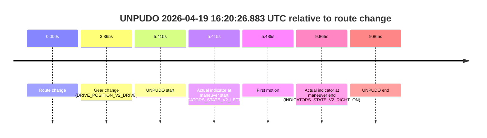
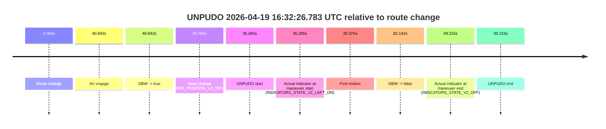
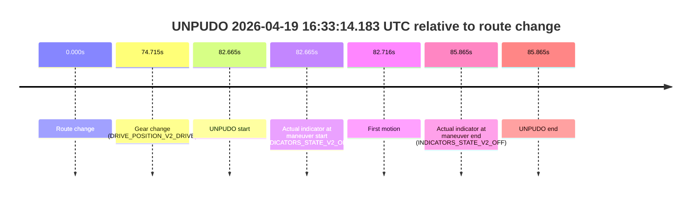

# Run Report: fme10005/2026-04-19--16-04-53--gen2-av-443e440c-8d60-4264-850a-bf54fbfa9ad8

| Field | Value |
|---|---|
| Run ID | `fme10005/2026-04-19--16-04-53--gen2-av-443e440c-8d60-4264-850a-bf54fbfa9ad8` |
| Date | `2026-04-19` |
| Model(s) | `apricot-crocodile-uproarious` |
| Author | `guy.geva` |
| Event count | `8` |

## unpudo 2026-04-19 16:20:26.883 UTC

| Field | Value |
|---|---|
| Model | `apricot-crocodile-uproarious` |
| Author | `guy.geva` |
| Run ID | `fme10005/2026-04-19--16-04-53--gen2-av-443e440c-8d60-4264-850a-bf54fbfa9ad8` |
| Date | `2026-04-19` |
| Time (UTC) | `16:20:26.883` |
| Event type | `unpudo` |
| Disengagement type | `none observed` |
| Route change | `found` |
| Console | [run](https://console.sso.wayve.ai/run/fme10005/2026-04-19--16-04-53--gen2-av-443e440c-8d60-4264-850a-bf54fbfa9ad8?id=&time-unixus=1776615626883293) |
| Foxglove | [segment](https://app.foxglove.dev/wayve-on-prem/p/prj_0dX18KZdVHg1fmmI/view?ds=foxglove-stream&ds.deviceName=fme10005&ds.start=2026-04-19T16%3A20%3A11.468206Z&ds.end=2026-04-19T16%3A20%3A41.333291Z&layoutId=lay_0e7VD4WIKDQGU73Y&time=2026-04-19T16%3A20%3A26.883293Z) |

### Event card: fail

- Fail: the credited unpudo does not stay AV-owned. The event window starts with DBW false, and the maneuver outcome lands outside a clean AV-owned segment.

| Event | Time (UTC) | Delta from route change |
|---|---:|---:|
| Route change | 2026-04-19 16:20:21.468 | `0.000s` |
| Gear change (DRIVE_POSITION_V2_DRIVE) | 2026-04-19 16:20:24.833 | `3.365s` |
| UNPUDO start | 2026-04-19 16:20:26.883 | `5.415s` |
| Actual indicator at maneuver start (INDICATORS_STATE_V2_LEFT_ON) | 2026-04-19 16:20:26.883 | `5.415s` |
| First motion | 2026-04-19 16:20:26.953 | `5.485s` |
| Actual indicator at maneuver end (INDICATORS_STATE_V2_RIGHT_ON) | 2026-04-19 16:20:31.333 | `9.865s` |
| UNPUDO end | 2026-04-19 16:20:31.333 | `9.865s` |

| Metric | Value |
|---|---|
| Outcome | `fail` |
| Effective failure type | `not_av_owned` |
| Route change status | `found` |
| DBW at event start | `false` |
| DBW at event end | `false` |
| Predicted gear at AV start | `n/a` |
| Actual gear at AV start | `n/a` |
| Predicted gear at event start | `DRIVE_POSITION_V2_DRIVE` |
| Actual gear at event start | `DRIVE_POSITION_V2_DRIVE` |
| Planned indicator direction | `INDICATORS_STATE_V2_OFF` |
| Controller indicator direction | `INDICATORS_STATE_V2_OFF` |
| Actual indicator direction | `INDICATORS_STATE_V2_LEFT_ON` |
| Actual indicator at maneuver end | `INDICATORS_STATE_V2_RIGHT_ON` |
| Driver accel help in AV | `false` |
| Driver accel help timestamp | `n/a` |
| Max accel pedal pct in AV | `0.0%` |
| Max brake pedal pct in AV | `0.0%` |
| Max speed mps in AV | `0.000` |
| Route -> AV | `n/a` |
| AV -> event start | `n/a` |
| AV -> first motion | `n/a` |
| AV duration before disengagement | `n/a` |
| Trajectory waypoint count | `37` |
| Driving-plan step count | `11` |

The scored portion starts from the AV-owned window, not from the pre-AV setup. Route-change search in the stopped pre-event segment was `found`, with the baseline therefore set to route change. At the event anchor the model predicts `DRIVE_POSITION_V2_DRIVE` and the actual gear is `DRIVE_POSITION_V2_DRIVE`. The effective model outcome is `fail` because `not_av_owned`.

### Resolution

| Field | Value |
|---|---|
| Final outcome | `fail` |
| Do we agree with this label? | `yes` |
| Source disengagement type | `none observed` |
| Resolved effective failure type | `not_av_owned` |
| Confidence | `high` |

## unpudo 2026-04-19 16:24:31.133 UTC

| Field | Value |
|---|---|
| Model | `apricot-crocodile-uproarious` |
| Author | `guy.geva` |
| Run ID | `fme10005/2026-04-19--16-04-53--gen2-av-443e440c-8d60-4264-850a-bf54fbfa9ad8` |
| Date | `2026-04-19` |
| Time (UTC) | `16:24:31.133` |
| Event type | `unpudo` |
| Disengagement type | `failed_to_unpudo` |
| Route change | `found` |
| Console | [run](https://console.sso.wayve.ai/run/fme10005/2026-04-19--16-04-53--gen2-av-443e440c-8d60-4264-850a-bf54fbfa9ad8?id=&time-unixus=1776615871133314) |
| Foxglove | [segment](https://app.foxglove.dev/wayve-on-prem/p/prj_0dX18KZdVHg1fmmI/view?ds=foxglove-stream&ds.deviceName=fme10005&ds.start=2026-04-19T16%3A24%3A09.818286Z&ds.end=2026-04-19T16%3A25%3A48.301501Z&layoutId=lay_0e7VD4WIKDQGU73Y&time=2026-04-19T16%3A24%3A31.133314Z) |

### Event card: fail

- Fail: AV owns part of the segment, but the event still resolves as a model-performance failure under the AV-only scoring rule.

| Event | Time (UTC) | Delta from route change |
|---|---:|---:|
| Route change | 2026-04-19 16:24:19.818 | `0.000s` |
| AV engage | 2026-04-19 16:24:43.860 | `24.042s` |
| DBW -> true | 2026-04-19 16:24:43.860 | `24.042s` |
| Gear change (DRIVE_POSITION_V2_REVERSE) | 2026-04-19 16:24:20.133 | `0.315s` |
| UNPUDO start | 2026-04-19 16:24:31.133 | `11.315s` |
| Actual indicator at maneuver start (INDICATORS_STATE_V2_OFF) | 2026-04-19 16:24:31.133 | `11.315s` |
| First motion | 2026-04-19 16:24:35.993 | `16.175s` |
| DBW -> false | 2026-04-19 16:25:38.301 | `78.483s` |
| Actual indicator at maneuver end (INDICATORS_STATE_V2_OFF) | 2026-04-19 16:24:40.533 | `20.715s` |
| UNPUDO end | 2026-04-19 16:24:40.533 | `20.715s` |

| Metric | Value |
|---|---|
| Outcome | `fail` |
| Effective failure type | `failed_to_unpudo` |
| Route change status | `found` |
| DBW at event start | `false` |
| DBW at event end | `false` |
| Predicted gear at AV start | `DRIVE_POSITION_V2_DRIVE` |
| Actual gear at AV start | `DRIVE_POSITION_V2_DRIVE` |
| Predicted gear at event start | `DRIVE_POSITION_V2_REVERSE` |
| Actual gear at event start | `DRIVE_POSITION_V2_REVERSE` |
| Planned indicator direction | `INDICATORS_STATE_V2_LEFT_ON` |
| Controller indicator direction | `INDICATORS_STATE_V2_LEFT_ON` |
| Actual indicator direction | `INDICATORS_STATE_V2_OFF` |
| Actual indicator at maneuver end | `INDICATORS_STATE_V2_OFF` |
| Driver accel help in AV | `false` |
| Driver accel help timestamp | `n/a` |
| Max accel pedal pct in AV | `0.0%` |
| Max brake pedal pct in AV | `0.0%` |
| Max speed mps in AV | `0.000` |
| Route -> AV | `24.042s` |
| AV -> event start | `-12.727s` |
| AV -> first motion | `-7.867s` |
| AV duration before disengagement | `54.441s` |
| Trajectory waypoint count | `36` |
| Driving-plan step count | `11` |

The scored portion starts from the AV-owned window, not from the pre-AV setup. Route-change search in the stopped pre-event segment was `found`, with the baseline therefore set to route change. At the event anchor the model predicts `DRIVE_POSITION_V2_REVERSE` and the actual gear is `DRIVE_POSITION_V2_REVERSE`. The effective model outcome is `fail` because `failed_to_unpudo`.

### Resolution

| Field | Value |
|---|---|
| Final outcome | `fail` |
| Do we agree with this label? | `yes` |
| Source disengagement type | `failed_to_unpudo` |
| Resolved effective failure type | `failed_to_unpudo` |
| Confidence | `high` |

## unpudo 2026-04-19 16:28:47.633 UTC

| Field | Value |
|---|---|
| Model | `apricot-crocodile-uproarious` |
| Author | `guy.geva` |
| Run ID | `fme10005/2026-04-19--16-04-53--gen2-av-443e440c-8d60-4264-850a-bf54fbfa9ad8` |
| Date | `2026-04-19` |
| Time (UTC) | `16:28:47.633` |
| Event type | `unpudo` |
| Disengagement type | `none observed` |
| Route change | `found` |
| Console | [run](https://console.sso.wayve.ai/run/fme10005/2026-04-19--16-04-53--gen2-av-443e440c-8d60-4264-850a-bf54fbfa9ad8?id=&time-unixus=1776616127633308) |
| Foxglove | [segment](https://app.foxglove.dev/wayve-on-prem/p/prj_0dX18KZdVHg1fmmI/view?ds=foxglove-stream&ds.deviceName=fme10005&ds.start=2026-04-19T16%3A28%3A33.568337Z&ds.end=2026-04-19T16%3A30%3A45.260306Z&layoutId=lay_0e7VD4WIKDQGU73Y&time=2026-04-19T16%3A28%3A47.633308Z) |

### Event card: fail

- Fail: the credited unpudo does not stay AV-owned. The event window starts with DBW false, and the maneuver outcome lands outside a clean AV-owned segment.

| Event | Time (UTC) | Delta from route change |
|---|---:|---:|
| Route change | 2026-04-19 16:28:43.568 | `0.000s` |
| AV engage | 2026-04-19 16:29:16.001 | `32.433s` |
| DBW -> true | 2026-04-19 16:29:16.001 | `32.433s` |
| Gear change (DRIVE_POSITION_V2_DRIVE) | 2026-04-19 16:28:44.933 | `1.365s` |
| UNPUDO start | 2026-04-19 16:28:47.633 | `4.065s` |
| Actual indicator at maneuver start (INDICATORS_STATE_V2_LEFT_ON) | 2026-04-19 16:28:47.633 | `4.065s` |
| First motion | 2026-04-19 16:28:47.693 | `4.125s` |
| DBW -> false | 2026-04-19 16:30:35.260 | `111.692s` |
| Actual indicator at maneuver end (INDICATORS_STATE_V2_OFF) | 2026-04-19 16:29:08.383 | `24.815s` |
| UNPUDO end | 2026-04-19 16:29:08.383 | `24.815s` |

| Metric | Value |
|---|---|
| Outcome | `fail` |
| Effective failure type | `completed_outside_av` |
| Route change status | `found` |
| DBW at event start | `false` |
| DBW at event end | `false` |
| Predicted gear at AV start | `DRIVE_POSITION_V2_DRIVE` |
| Actual gear at AV start | `DRIVE_POSITION_V2_DRIVE` |
| Predicted gear at event start | `DRIVE_POSITION_V2_DRIVE` |
| Actual gear at event start | `DRIVE_POSITION_V2_DRIVE` |
| Planned indicator direction | `INDICATORS_STATE_V2_OFF` |
| Controller indicator direction | `INDICATORS_STATE_V2_OFF` |
| Actual indicator direction | `INDICATORS_STATE_V2_LEFT_ON` |
| Actual indicator at maneuver end | `INDICATORS_STATE_V2_OFF` |
| Driver accel help in AV | `false` |
| Driver accel help timestamp | `n/a` |
| Max accel pedal pct in AV | `0.0%` |
| Max brake pedal pct in AV | `0.0%` |
| Max speed mps in AV | `0.000` |
| Route -> AV | `32.433s` |
| AV -> event start | `-28.368s` |
| AV -> first motion | `-28.308s` |
| AV duration before disengagement | `79.259s` |
| Trajectory waypoint count | `36` |
| Driving-plan step count | `11` |

The scored portion starts from the AV-owned window, not from the pre-AV setup. Route-change search in the stopped pre-event segment was `found`, with the baseline therefore set to route change. At the event anchor the model predicts `DRIVE_POSITION_V2_DRIVE` and the actual gear is `DRIVE_POSITION_V2_DRIVE`. The effective model outcome is `fail` because `completed_outside_av`.

### Resolution

| Field | Value |
|---|---|
| Final outcome | `fail` |
| Do we agree with this label? | `yes` |
| Source disengagement type | `none observed` |
| Resolved effective failure type | `completed_outside_av` |
| Confidence | `high` |

## unpudo 2026-04-19 16:32:26.783 UTC

| Field | Value |
|---|---|
| Model | `apricot-crocodile-uproarious` |
| Author | `guy.geva` |
| Run ID | `fme10005/2026-04-19--16-04-53--gen2-av-443e440c-8d60-4264-850a-bf54fbfa9ad8` |
| Date | `2026-04-19` |
| Time (UTC) | `16:32:26.783` |
| Event type | `unpudo` |
| Disengagement type | `none observed` |
| Route change | `found` |
| Console | [run](https://console.sso.wayve.ai/run/fme10005/2026-04-19--16-04-53--gen2-av-443e440c-8d60-4264-850a-bf54fbfa9ad8?id=&time-unixus=1776616346783294) |
| Foxglove | [segment](https://app.foxglove.dev/wayve-on-prem/p/prj_0dX18KZdVHg1fmmI/view?ds=foxglove-stream&ds.deviceName=fme10005&ds.start=2026-04-19T16%3A31%3A41.518261Z&ds.end=2026-04-19T16%3A33%3A23.660386Z&layoutId=lay_0e7VD4WIKDQGU73Y&time=2026-04-19T16%3A32%3A26.783294Z) |

### Event card: fail

- Fail: the credited unpudo does not stay AV-owned. The event window starts with DBW false, and the maneuver outcome lands outside a clean AV-owned segment.

| Event | Time (UTC) | Delta from route change |
|---|---:|---:|
| Route change | 2026-04-19 16:31:51.518 | `0.000s` |
| AV engage | 2026-04-19 16:32:32.360 | `40.842s` |
| DBW -> true | 2026-04-19 16:32:32.360 | `40.842s` |
| Gear change (DRIVE_POSITION_V2_DRIVE) | 2026-04-19 16:32:25.283 | `33.765s` |
| UNPUDO start | 2026-04-19 16:32:26.783 | `35.265s` |
| Actual indicator at maneuver start (INDICATORS_STATE_V2_LEFT_ON) | 2026-04-19 16:32:26.783 | `35.265s` |
| First motion | 2026-04-19 16:32:26.893 | `35.375s` |
| DBW -> false | 2026-04-19 16:33:13.660 | `82.142s` |
| Actual indicator at maneuver end (INDICATORS_STATE_V2_OFF) | 2026-04-19 16:32:30.733 | `39.215s` |
| UNPUDO end | 2026-04-19 16:32:30.733 | `39.215s` |

| Metric | Value |
|---|---|
| Outcome | `fail` |
| Effective failure type | `completed_outside_av` |
| Route change status | `found` |
| DBW at event start | `false` |
| DBW at event end | `false` |
| Predicted gear at AV start | `DRIVE_POSITION_V2_DRIVE` |
| Actual gear at AV start | `DRIVE_POSITION_V2_DRIVE` |
| Predicted gear at event start | `DRIVE_POSITION_V2_DRIVE` |
| Actual gear at event start | `DRIVE_POSITION_V2_DRIVE` |
| Planned indicator direction | `INDICATORS_STATE_V2_LEFT_ON` |
| Controller indicator direction | `INDICATORS_STATE_V2_LEFT_ON` |
| Actual indicator direction | `INDICATORS_STATE_V2_LEFT_ON` |
| Actual indicator at maneuver end | `INDICATORS_STATE_V2_OFF` |
| Driver accel help in AV | `false` |
| Driver accel help timestamp | `n/a` |
| Max accel pedal pct in AV | `0.0%` |
| Max brake pedal pct in AV | `0.0%` |
| Max speed mps in AV | `0.000` |
| Route -> AV | `40.842s` |
| AV -> event start | `-5.577s` |
| AV -> first motion | `-5.467s` |
| AV duration before disengagement | `41.300s` |
| Trajectory waypoint count | `37` |
| Driving-plan step count | `11` |

The scored portion starts from the AV-owned window, not from the pre-AV setup. Route-change search in the stopped pre-event segment was `found`, with the baseline therefore set to route change. At the event anchor the model predicts `DRIVE_POSITION_V2_DRIVE` and the actual gear is `DRIVE_POSITION_V2_DRIVE`. The effective model outcome is `fail` because `completed_outside_av`.

### Resolution

| Field | Value |
|---|---|
| Final outcome | `fail` |
| Do we agree with this label? | `yes` |
| Source disengagement type | `none observed` |
| Resolved effective failure type | `completed_outside_av` |
| Confidence | `high` |

## unpudo 2026-04-19 16:33:14.183 UTC

| Field | Value |
|---|---|
| Model | `apricot-crocodile-uproarious` |
| Author | `guy.geva` |
| Run ID | `fme10005/2026-04-19--16-04-53--gen2-av-443e440c-8d60-4264-850a-bf54fbfa9ad8` |
| Date | `2026-04-19` |
| Time (UTC) | `16:33:14.183` |
| Event type | `unpudo` |
| Disengagement type | `failed_to_unpudo` |
| Route change | `found` |
| Console | [run](https://console.sso.wayve.ai/run/fme10005/2026-04-19--16-04-53--gen2-av-443e440c-8d60-4264-850a-bf54fbfa9ad8?id=&time-unixus=1776616394183305) |
| Foxglove | [segment](https://app.foxglove.dev/wayve-on-prem/p/prj_0dX18KZdVHg1fmmI/view?ds=foxglove-stream&ds.deviceName=fme10005&ds.start=2026-04-19T16%3A31%3A41.518261Z&ds.end=2026-04-19T16%3A33%3A27.383318Z&layoutId=lay_0e7VD4WIKDQGU73Y&time=2026-04-19T16%3A33%3A14.183305Z) |

### Event card: fail

- Fail: AV owns part of the segment, but the event still resolves as a model-performance failure under the AV-only scoring rule.

| Event | Time (UTC) | Delta from route change |
|---|---:|---:|
| Route change | 2026-04-19 16:31:51.518 | `0.000s` |
| Gear change (DRIVE_POSITION_V2_DRIVE) | 2026-04-19 16:33:06.233 | `74.715s` |
| UNPUDO start | 2026-04-19 16:33:14.183 | `82.665s` |
| Actual indicator at maneuver start (INDICATORS_STATE_V2_OFF) | 2026-04-19 16:33:14.183 | `82.665s` |
| First motion | 2026-04-19 16:33:14.233 | `82.716s` |
| Actual indicator at maneuver end (INDICATORS_STATE_V2_OFF) | 2026-04-19 16:33:17.383 | `85.865s` |
| UNPUDO end | 2026-04-19 16:33:17.383 | `85.865s` |

| Metric | Value |
|---|---|
| Outcome | `fail` |
| Effective failure type | `failed_to_unpudo` |
| Route change status | `found` |
| DBW at event start | `false` |
| DBW at event end | `false` |
| Predicted gear at AV start | `n/a` |
| Actual gear at AV start | `n/a` |
| Predicted gear at event start | `DRIVE_POSITION_V2_DRIVE` |
| Actual gear at event start | `DRIVE_POSITION_V2_DRIVE` |
| Planned indicator direction | `INDICATORS_STATE_V2_LEFT_ON` |
| Controller indicator direction | `INDICATORS_STATE_V2_LEFT_ON` |
| Actual indicator direction | `INDICATORS_STATE_V2_OFF` |
| Actual indicator at maneuver end | `INDICATORS_STATE_V2_OFF` |
| Driver accel help in AV | `false` |
| Driver accel help timestamp | `n/a` |
| Max accel pedal pct in AV | `0.0%` |
| Max brake pedal pct in AV | `0.0%` |
| Max speed mps in AV | `0.000` |
| Route -> AV | `n/a` |
| AV -> event start | `n/a` |
| AV -> first motion | `n/a` |
| AV duration before disengagement | `n/a` |
| Trajectory waypoint count | `37` |
| Driving-plan step count | `11` |

The scored portion starts from the AV-owned window, not from the pre-AV setup. Route-change search in the stopped pre-event segment was `found`, with the baseline therefore set to route change. At the event anchor the model predicts `DRIVE_POSITION_V2_DRIVE` and the actual gear is `DRIVE_POSITION_V2_DRIVE`. The effective model outcome is `fail` because `failed_to_unpudo`.

### Resolution

| Field | Value |
|---|---|
| Final outcome | `fail` |
| Do we agree with this label? | `yes` |
| Source disengagement type | `failed_to_unpudo` |
| Resolved effective failure type | `failed_to_unpudo` |
| Confidence | `high` |

## unpudo 2026-04-19 16:39:16.133 UTC

| Field | Value |
|---|---|
| Model | `apricot-crocodile-uproarious` |
| Author | `guy.geva` |
| Run ID | `fme10005/2026-04-19--16-04-53--gen2-av-443e440c-8d60-4264-850a-bf54fbfa9ad8` |
| Date | `2026-04-19` |
| Time (UTC) | `16:39:16.133` |
| Event type | `unpudo` |
| Disengagement type | `uncategorised` |
| Route change | `found` |
| Console | [run](https://console.sso.wayve.ai/run/fme10005/2026-04-19--16-04-53--gen2-av-443e440c-8d60-4264-850a-bf54fbfa9ad8?id=&time-unixus=1776616756133304) |
| Foxglove | [segment](https://app.foxglove.dev/wayve-on-prem/p/prj_0dX18KZdVHg1fmmI/view?ds=foxglove-stream&ds.deviceName=fme10005&ds.start=2026-04-19T16%3A38%3A48.718246Z&ds.end=2026-04-19T16%3A40%3A02.740226Z&layoutId=lay_0e7VD4WIKDQGU73Y&time=2026-04-19T16%3A39%3A16.133304Z) |

### Event card: fail

- Fail: AV owns part of the segment, but the event still resolves as a model-performance failure under the AV-only scoring rule.

| Event | Time (UTC) | Delta from route change |
|---|---:|---:|
| Route change | 2026-04-19 16:38:58.718 | `0.000s` |
| AV engage | 2026-04-19 16:39:31.180 | `32.462s` |
| DBW -> true | 2026-04-19 16:39:31.180 | `32.462s` |
| Gear change (DRIVE_POSITION_V2_DRIVE) | 2026-04-19 16:39:10.233 | `11.515s` |
| UNPUDO start | 2026-04-19 16:39:16.133 | `17.415s` |
| Actual indicator at maneuver start (INDICATORS_STATE_V2_LEFT_ON) | 2026-04-19 16:39:16.133 | `17.415s` |
| First motion | 2026-04-19 16:39:16.173 | `17.455s` |
| DBW -> false | 2026-04-19 16:39:52.740 | `54.022s` |
| Actual indicator at maneuver end (INDICATORS_STATE_V2_OFF) | 2026-04-19 16:39:19.783 | `21.065s` |
| UNPUDO end | 2026-04-19 16:39:19.783 | `21.065s` |

| Metric | Value |
|---|---|
| Outcome | `fail` |
| Effective failure type | `uncategorised` |
| Route change status | `found` |
| DBW at event start | `false` |
| DBW at event end | `false` |
| Predicted gear at AV start | `DRIVE_POSITION_V2_DRIVE` |
| Actual gear at AV start | `DRIVE_POSITION_V2_DRIVE` |
| Predicted gear at event start | `DRIVE_POSITION_V2_DRIVE` |
| Actual gear at event start | `DRIVE_POSITION_V2_DRIVE` |
| Planned indicator direction | `INDICATORS_STATE_V2_OFF` |
| Controller indicator direction | `INDICATORS_STATE_V2_OFF` |
| Actual indicator direction | `INDICATORS_STATE_V2_LEFT_ON` |
| Actual indicator at maneuver end | `INDICATORS_STATE_V2_OFF` |
| Driver accel help in AV | `false` |
| Driver accel help timestamp | `n/a` |
| Max accel pedal pct in AV | `0.0%` |
| Max brake pedal pct in AV | `0.0%` |
| Max speed mps in AV | `0.000` |
| Route -> AV | `32.462s` |
| AV -> event start | `-15.047s` |
| AV -> first motion | `-15.007s` |
| AV duration before disengagement | `21.560s` |
| Trajectory waypoint count | `36` |
| Driving-plan step count | `11` |

The scored portion starts from the AV-owned window, not from the pre-AV setup. Route-change search in the stopped pre-event segment was `found`, with the baseline therefore set to route change. At the event anchor the model predicts `DRIVE_POSITION_V2_DRIVE` and the actual gear is `DRIVE_POSITION_V2_DRIVE`. The effective model outcome is `fail` because `uncategorised`.

### Resolution

| Field | Value |
|---|---|
| Final outcome | `fail` |
| Do we agree with this label? | `yes` |
| Source disengagement type | `uncategorised` |
| Resolved effective failure type | `uncategorised` |
| Confidence | `high` |

## unpudo 2026-04-19 16:42:08.383 UTC

| Field | Value |
|---|---|
| Model | `apricot-crocodile-uproarious` |
| Author | `guy.geva` |
| Run ID | `fme10005/2026-04-19--16-04-53--gen2-av-443e440c-8d60-4264-850a-bf54fbfa9ad8` |
| Date | `2026-04-19` |
| Time (UTC) | `16:42:08.383` |
| Event type | `unpudo` |
| Disengagement type | `failed_to_unpudo` |
| Route change | `found` |
| Console | [run](https://console.sso.wayve.ai/run/fme10005/2026-04-19--16-04-53--gen2-av-443e440c-8d60-4264-850a-bf54fbfa9ad8?id=&time-unixus=1776616928383295) |
| Foxglove | [segment](https://app.foxglove.dev/wayve-on-prem/p/prj_0dX18KZdVHg1fmmI/view?ds=foxglove-stream&ds.deviceName=fme10005&ds.start=2026-04-19T16%3A41%3A51.568305Z&ds.end=2026-04-19T16%3A43%3A30.280174Z&layoutId=lay_0e7VD4WIKDQGU73Y&time=2026-04-19T16%3A42%3A08.383295Z) |

### Event card: fail

- Fail: AV owns part of the segment, but the event still resolves as a model-performance failure under the AV-only scoring rule.

| Event | Time (UTC) | Delta from route change |
|---|---:|---:|
| Route change | 2026-04-19 16:42:01.568 | `0.000s` |
| AV engage | 2026-04-19 16:42:15.440 | `13.872s` |
| DBW -> true | 2026-04-19 16:42:15.440 | `13.872s` |
| Gear change (DRIVE_POSITION_V2_DRIVE) | 2026-04-19 16:42:01.833 | `0.265s` |
| UNPUDO start | 2026-04-19 16:42:08.383 | `6.815s` |
| Actual indicator at maneuver start (INDICATORS_STATE_V2_OFF) | 2026-04-19 16:42:08.383 | `6.815s` |
| First motion | 2026-04-19 16:42:08.413 | `6.845s` |
| DBW -> false | 2026-04-19 16:43:20.280 | `78.712s` |
| Actual indicator at maneuver end (INDICATORS_STATE_V2_OFF) | 2026-04-19 16:42:11.583 | `10.015s` |
| UNPUDO end | 2026-04-19 16:42:11.583 | `10.015s` |

| Metric | Value |
|---|---|
| Outcome | `fail` |
| Effective failure type | `failed_to_unpudo` |
| Route change status | `found` |
| DBW at event start | `false` |
| DBW at event end | `false` |
| Predicted gear at AV start | `DRIVE_POSITION_V2_DRIVE` |
| Actual gear at AV start | `DRIVE_POSITION_V2_DRIVE` |
| Predicted gear at event start | `DRIVE_POSITION_V2_DRIVE` |
| Actual gear at event start | `DRIVE_POSITION_V2_DRIVE` |
| Planned indicator direction | `INDICATORS_STATE_V2_LEFT_ON` |
| Controller indicator direction | `INDICATORS_STATE_V2_LEFT_ON` |
| Actual indicator direction | `INDICATORS_STATE_V2_OFF` |
| Actual indicator at maneuver end | `INDICATORS_STATE_V2_OFF` |
| Driver accel help in AV | `false` |
| Driver accel help timestamp | `n/a` |
| Max accel pedal pct in AV | `0.0%` |
| Max brake pedal pct in AV | `0.0%` |
| Max speed mps in AV | `0.000` |
| Route -> AV | `13.872s` |
| AV -> event start | `-7.057s` |
| AV -> first motion | `-7.027s` |
| AV duration before disengagement | `64.840s` |
| Trajectory waypoint count | `37` |
| Driving-plan step count | `11` |

The scored portion starts from the AV-owned window, not from the pre-AV setup. Route-change search in the stopped pre-event segment was `found`, with the baseline therefore set to route change. At the event anchor the model predicts `DRIVE_POSITION_V2_DRIVE` and the actual gear is `DRIVE_POSITION_V2_DRIVE`. The effective model outcome is `fail` because `failed_to_unpudo`.

### Resolution

| Field | Value |
|---|---|
| Final outcome | `fail` |
| Do we agree with this label? | `yes` |
| Source disengagement type | `failed_to_unpudo` |
| Resolved effective failure type | `failed_to_unpudo` |
| Confidence | `high` |

## unpudo 2026-04-19 16:46:18.083 UTC

| Field | Value |
|---|---|
| Model | `apricot-crocodile-uproarious` |
| Author | `guy.geva` |
| Run ID | `fme10005/2026-04-19--16-04-53--gen2-av-443e440c-8d60-4264-850a-bf54fbfa9ad8` |
| Date | `2026-04-19` |
| Time (UTC) | `16:46:18.083` |
| Event type | `unpudo` |
| Disengagement type | `none observed` |
| Route change | `found` |
| Console | [run](https://console.sso.wayve.ai/run/fme10005/2026-04-19--16-04-53--gen2-av-443e440c-8d60-4264-850a-bf54fbfa9ad8?id=&time-unixus=1776617178083306) |
| Foxglove | [segment](https://app.foxglove.dev/wayve-on-prem/p/prj_0dX18KZdVHg1fmmI/view?ds=foxglove-stream&ds.deviceName=fme10005&ds.start=2026-04-19T16%3A44%3A47.118175Z&ds.end=2026-04-19T16%3A46%3A49.040350Z&layoutId=lay_0e7VD4WIKDQGU73Y&time=2026-04-19T16%3A46%3A18.083306Z) |

### Event card: fail

- Fail: the credited unpudo does not stay AV-owned. The event window starts with DBW false, and the maneuver outcome lands outside a clean AV-owned segment.

| Event | Time (UTC) | Delta from route change |
|---|---:|---:|
| Route change | 2026-04-19 16:44:57.118 | `0.000s` |
| AV engage | 2026-04-19 16:46:31.281 | `94.163s` |
| DBW -> true | 2026-04-19 16:46:31.281 | `94.163s` |
| Gear change (DRIVE_POSITION_V2_DRIVE) | 2026-04-19 16:46:14.883 | `77.765s` |
| UNPUDO start | 2026-04-19 16:46:18.083 | `80.965s` |
| Actual indicator at maneuver start (INDICATORS_STATE_V2_LEFT_ON) | 2026-04-19 16:46:18.083 | `80.965s` |
| First motion | 2026-04-19 16:46:18.113 | `80.996s` |
| DBW -> false | 2026-04-19 16:46:39.040 | `101.922s` |
| Actual indicator at maneuver end (INDICATORS_STATE_V2_OFF) | 2026-04-19 16:46:21.683 | `84.565s` |
| UNPUDO end | 2026-04-19 16:46:21.683 | `84.565s` |

| Metric | Value |
|---|---|
| Outcome | `fail` |
| Effective failure type | `completed_outside_av` |
| Route change status | `found` |
| DBW at event start | `false` |
| DBW at event end | `false` |
| Predicted gear at AV start | `DRIVE_POSITION_V2_DRIVE` |
| Actual gear at AV start | `DRIVE_POSITION_V2_DRIVE` |
| Predicted gear at event start | `DRIVE_POSITION_V2_DRIVE` |
| Actual gear at event start | `DRIVE_POSITION_V2_DRIVE` |
| Planned indicator direction | `INDICATORS_STATE_V2_LEFT_ON` |
| Controller indicator direction | `INDICATORS_STATE_V2_LEFT_ON` |
| Actual indicator direction | `INDICATORS_STATE_V2_LEFT_ON` |
| Actual indicator at maneuver end | `INDICATORS_STATE_V2_OFF` |
| Driver accel help in AV | `false` |
| Driver accel help timestamp | `n/a` |
| Max accel pedal pct in AV | `0.0%` |
| Max brake pedal pct in AV | `0.0%` |
| Max speed mps in AV | `0.000` |
| Route -> AV | `94.163s` |
| AV -> event start | `-13.198s` |
| AV -> first motion | `-13.168s` |
| AV duration before disengagement | `7.759s` |
| Trajectory waypoint count | `37` |
| Driving-plan step count | `11` |

The scored portion starts from the AV-owned window, not from the pre-AV setup. Route-change search in the stopped pre-event segment was `found`, with the baseline therefore set to route change. At the event anchor the model predicts `DRIVE_POSITION_V2_DRIVE` and the actual gear is `DRIVE_POSITION_V2_DRIVE`. The effective model outcome is `fail` because `completed_outside_av`.

### Resolution

| Field | Value |
|---|---|
| Final outcome | `fail` |
| Do we agree with this label? | `yes` |
| Source disengagement type | `none observed` |
| Resolved effective failure type | `completed_outside_av` |
| Confidence | `high` |
