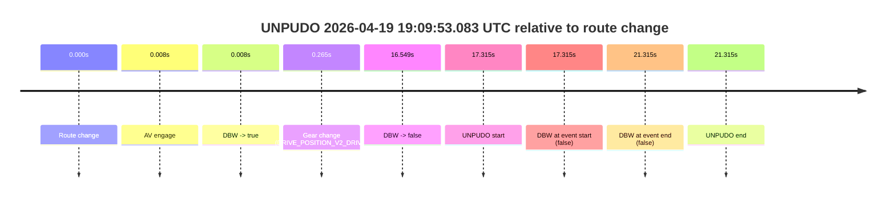
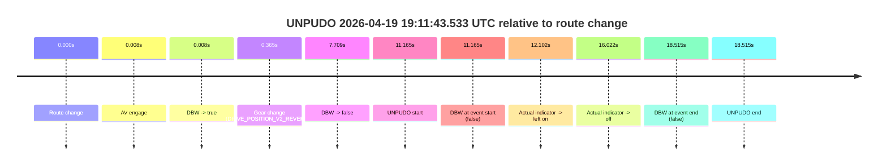

# Run Report: fme10005/2026-04-19--18-53-28--gen2-av-a33797a9-3dad-4832-9161-f24f5c8b595b

| Field | Value |
|---|---|
| Run ID | `fme10005/2026-04-19--18-53-28--gen2-av-a33797a9-3dad-4832-9161-f24f5c8b595b` |
| Date | `2026-04-19` |
| Model(s) | `eel-teal-outspoken` |
| Author | `zak` |
| Event count | `2` |

## unpudo 2026-04-19 19:09:53.083 UTC

| Field | Value |
|---|---|
| Model | `eel-teal-outspoken` |
| Author | `zak` |
| Run ID | `fme10005/2026-04-19--18-53-28--gen2-av-a33797a9-3dad-4832-9161-f24f5c8b595b` |
| Date | `2026-04-19` |
| Time (UTC) | `19:09:53.083` |
| Event type | `unpudo` |
| Disengagement type | `failed_to_unpudo` |
| Route change | `found` |
| Console | [run](https://console.sso.wayve.ai/run/fme10005/2026-04-19--18-53-28--gen2-av-a33797a9-3dad-4832-9161-f24f5c8b595b?id=&time-unixus=1776625793083288) |
| Foxglove | [segment](https://app.foxglove.dev/wayve-on-prem/p/prj_0dX18KZdVHg1fmmI/view?ds=foxglove-stream&ds.deviceName=fme10005&ds.start=2026-04-19T19%3A09%3A25.768394Z&ds.end=2026-04-19T19%3A10%3A07.083290Z&layoutId=lay_0e7VD4WIKDQGU73Y&time=2026-04-19T19%3A09%3A53.083288Z) |

### Event card: fail

- Fail: AV owns part of the segment, but the event still resolves as a model-performance failure under the AV-only scoring rule.

| Event | Time (UTC) | Delta from route change |
|---|---:|---:|
| Route change | 2026-04-19 19:09:35.768 | `0.000s` |
| AV engage | 2026-04-19 19:09:35.776 | `0.008s` |
| DBW -> true | 2026-04-19 19:09:35.776 | `0.008s` |
| Gear change (DRIVE_POSITION_V2_DRIVE) | 2026-04-19 19:09:36.033 | `0.265s` |
| DBW -> false | 2026-04-19 19:09:52.317 | `16.549s` |
| UNPUDO start | 2026-04-19 19:09:53.083 | `17.315s` |
| DBW at event start (false) | 2026-04-19 19:09:53.083 | `17.315s` |
| DBW at event end (false) | 2026-04-19 19:09:57.083 | `21.315s` |
| UNPUDO end | 2026-04-19 19:09:57.083 | `21.315s` |

| Metric | Value |
|---|---|
| Outcome | `fail` |
| Effective failure type | `failed_to_unpudo` |
| Route change status | `found` |
| DBW at event start | `false` |
| DBW at event end | `false` |
| Predicted gear at AV start | `DRIVE_POSITION_V2_PARK` |
| Actual gear at AV start | `DRIVE_POSITION_V2_PARK` |
| Predicted gear at event start | `DRIVE_POSITION_V2_DRIVE` |
| Actual gear at event start | `DRIVE_POSITION_V2_DRIVE` |
| Planned indicator direction | `INDICATORS_STATE_V2_OFF` |
| Controller indicator direction | `INDICATORS_STATE_V2_LEFT_ON` |
| Actual indicator direction | `INDICATORS_STATE_V2_OFF` |
| Actual indicator at maneuver end | `INDICATORS_STATE_V2_OFF` |
| Driver accel help in AV | `false` |
| Driver accel help timestamp | `n/a` |
| Max accel pedal pct in AV | `0.0%` |
| Max brake pedal pct in AV | `10.7%` |
| Max speed mps in AV | `0.000` |
| Success timing baseline | `route change` |
| Route -> AV | `0.008s` |
| AV -> event start | `17.307s` |
| AV -> first motion | `n/a` |
| Success baseline -> event start | `17.315s` |
| Success baseline -> first motion | `n/a` |
| AV duration before disengagement | `16.541s` |
| Trajectory waypoint count | `36` |
| Driving-plan step count | `11` |

The scored portion starts from the AV-owned window, not from the pre-AV setup. Route-change search in the stopped pre-event segment was `found`, with the baseline therefore set to route change. At the event anchor the model predicts `DRIVE_POSITION_V2_DRIVE` and the actual gear is `DRIVE_POSITION_V2_DRIVE`. The effective model outcome is `fail` because `failed_to_unpudo.`

### Resolution

| Field | Value |
|---|---|
| Final outcome | `fail` |
| Do we agree with this label? | `yes` |
| Source disengagement type | `failed_to_unpudo` |
| Resolved effective failure type | `failed_to_unpudo` |
| Confidence | `high` |

## unpudo 2026-04-19 19:11:43.533 UTC

| Field | Value |
|---|---|
| Model | `eel-teal-outspoken` |
| Author | `zak` |
| Run ID | `fme10005/2026-04-19--18-53-28--gen2-av-a33797a9-3dad-4832-9161-f24f5c8b595b` |
| Date | `2026-04-19` |
| Time (UTC) | `19:11:43.533` |
| Event type | `unpudo` |
| Disengagement type | `failed_to_unpudo` |
| Route change | `found` |
| Console | [run](https://console.sso.wayve.ai/run/fme10005/2026-04-19--18-53-28--gen2-av-a33797a9-3dad-4832-9161-f24f5c8b595b?id=&time-unixus=1776625903533307) |
| Foxglove | [segment](https://app.foxglove.dev/wayve-on-prem/p/prj_0dX18KZdVHg1fmmI/view?ds=foxglove-stream&ds.deviceName=fme10005&ds.start=2026-04-19T19%3A11%3A22.368277Z&ds.end=2026-04-19T19%3A12%3A00.883297Z&layoutId=lay_0e7VD4WIKDQGU73Y&time=2026-04-19T19%3A11%3A43.533307Z) |

### Event card: fail

- Fail: AV owns part of the segment, but the event still resolves as a model-performance failure under the AV-only scoring rule.

| Event | Time (UTC) | Delta from route change |
|---|---:|---:|
| Route change | 2026-04-19 19:11:32.368 | `0.000s` |
| AV engage | 2026-04-19 19:11:32.376 | `0.008s` |
| DBW -> true | 2026-04-19 19:11:32.376 | `0.008s` |
| Gear change (DRIVE_POSITION_V2_REVERSE) | 2026-04-19 19:11:32.733 | `0.365s` |
| DBW -> false | 2026-04-19 19:11:40.077 | `7.709s` |
| UNPUDO start | 2026-04-19 19:11:43.533 | `11.165s` |
| DBW at event start (false) | 2026-04-19 19:11:43.533 | `11.165s` |
| Actual indicator -> left on | 2026-04-19 19:11:44.470 | `12.102s` |
| Actual indicator -> off | 2026-04-19 19:11:48.390 | `16.022s` |
| DBW at event end (false) | 2026-04-19 19:11:50.883 | `18.515s` |
| UNPUDO end | 2026-04-19 19:11:50.883 | `18.515s` |

| Metric | Value |
|---|---|
| Outcome | `fail` |
| Effective failure type | `failed_to_unpudo` |
| Route change status | `found` |
| DBW at event start | `false` |
| DBW at event end | `false` |
| Predicted gear at AV start | `DRIVE_POSITION_V2_PARK` |
| Actual gear at AV start | `DRIVE_POSITION_V2_PARK` |
| Predicted gear at event start | `DRIVE_POSITION_V2_REVERSE` |
| Actual gear at event start | `DRIVE_POSITION_V2_REVERSE` |
| Planned indicator direction | `INDICATORS_STATE_V2_OFF` |
| Controller indicator direction | `INDICATORS_STATE_V2_OFF` |
| Actual indicator direction | `INDICATORS_STATE_V2_OFF` |
| Actual indicator at maneuver end | `INDICATORS_STATE_V2_OFF` |
| Driver accel help in AV | `false` |
| Driver accel help timestamp | `n/a` |
| Max accel pedal pct in AV | `0.0%` |
| Max brake pedal pct in AV | `10.9%` |
| Max speed mps in AV | `0.000` |
| Success timing baseline | `route change` |
| Route -> AV | `0.008s` |
| AV -> event start | `11.157s` |
| AV -> first motion | `n/a` |
| Success baseline -> event start | `11.165s` |
| Success baseline -> first motion | `n/a` |
| AV duration before disengagement | `7.701s` |
| Trajectory waypoint count | `37` |
| Driving-plan step count | `11` |

The scored portion starts from the AV-owned window, not from the pre-AV setup. Route-change search in the stopped pre-event segment was `found`, with the baseline therefore set to route change. At the event anchor the model predicts `DRIVE_POSITION_V2_REVERSE` and the actual gear is `DRIVE_POSITION_V2_REVERSE`. The effective model outcome is `fail` because `failed_to_unpudo.`

### Resolution

| Field | Value |
|---|---|
| Final outcome | `fail` |
| Do we agree with this label? | `yes` |
| Source disengagement type | `failed_to_unpudo` |
| Resolved effective failure type | `failed_to_unpudo` |
| Confidence | `high` |
