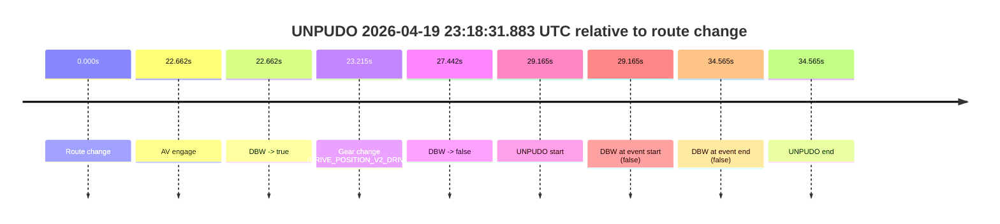
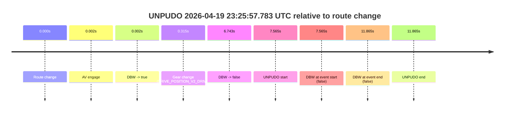
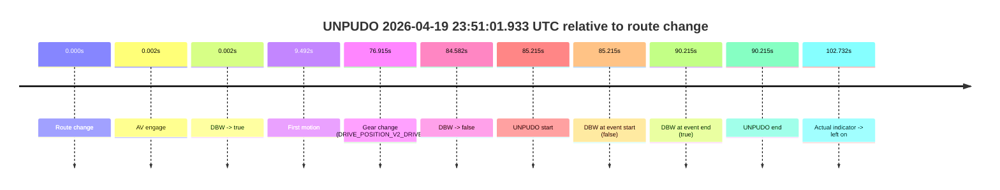

# Run Report: fme10005/2026-04-19--22-20-26--gen2-av-6800b41f-5003-4fe9-8464-bc16819cafb6

| Field | Value |
|---|---|
| Run ID | `fme10005/2026-04-19--22-20-26--gen2-av-6800b41f-5003-4fe9-8464-bc16819cafb6` |
| Date | `2026-04-19` |
| Model(s) | `pink-manta-ray-smooth` |
| Author | `guy.geva` |
| Event count | `4` |

## unpudo 2026-04-19 23:10:54.783 UTC

| Field | Value |
|---|---|
| Model | `pink-manta-ray-smooth` |
| Author | `guy.geva` |
| Run ID | `fme10005/2026-04-19--22-20-26--gen2-av-6800b41f-5003-4fe9-8464-bc16819cafb6` |
| Date | `2026-04-19` |
| Time (UTC) | `23:10:54.783` |
| Event type | `unpudo` |
| Disengagement type | `failed_to_unpudo` |
| Route change | `found` |
| Console | [run](https://console.sso.wayve.ai/run/fme10005/2026-04-19--22-20-26--gen2-av-6800b41f-5003-4fe9-8464-bc16819cafb6?id=&time-unixus=1776640254783304) |
| Foxglove | [segment](https://app.foxglove.dev/wayve-on-prem/p/prj_0dX18KZdVHg1fmmI/view?ds=foxglove-stream&ds.deviceName=fme10005&ds.start=2026-04-19T23%3A10%3A37.468240Z&ds.end=2026-04-19T23%3A11%3A09.933312Z&layoutId=lay_0e7VD4WIKDQGU73Y&time=2026-04-19T23%3A10%3A54.783304Z) |

### Event card: fail

- Fail: AV owns part of the segment, but the event still resolves as a model-performance failure under the AV-only scoring rule.

| Event | Time (UTC) | Delta from route change |
|---|---:|---:|
| Route change | 2026-04-19 23:10:47.468 | `0.000s` |
| AV engage | 2026-04-19 23:10:47.469 | `0.002s` |
| DBW -> true | 2026-04-19 23:10:47.469 | `0.002s` |
| Gear change (DRIVE_POSITION_V2_DRIVE) | 2026-04-19 23:10:47.783 | `0.315s` |
| DBW -> false | 2026-04-19 23:10:53.680 | `6.213s` |
| UNPUDO start | 2026-04-19 23:10:54.783 | `7.315s` |
| DBW at event start (false) | 2026-04-19 23:10:54.783 | `7.315s` |
| DBW at event end (false) | 2026-04-19 23:10:59.933 | `12.465s` |
| UNPUDO end | 2026-04-19 23:10:59.933 | `12.465s` |

| Metric | Value |
|---|---|
| Outcome | `fail` |
| Effective failure type | `failed_to_unpudo` |
| Route change status | `found` |
| DBW at event start | `false` |
| DBW at event end | `false` |
| Predicted gear at AV start | `DRIVE_POSITION_V2_PARK` |
| Actual gear at AV start | `DRIVE_POSITION_V2_PARK` |
| Predicted gear at event start | `DRIVE_POSITION_V2_DRIVE` |
| Actual gear at event start | `DRIVE_POSITION_V2_DRIVE` |
| Planned indicator direction | `INDICATORS_STATE_V2_LEFT_ON` |
| Controller indicator direction | `INDICATORS_STATE_V2_LEFT_ON` |
| Actual indicator direction | `INDICATORS_STATE_V2_OFF` |
| Actual indicator at maneuver end | `INDICATORS_STATE_V2_OFF` |
| Driver accel help in AV | `false` |
| Driver accel help timestamp | `n/a` |
| Max accel pedal pct in AV | `0.0%` |
| Max brake pedal pct in AV | `8.0%` |
| Max speed mps in AV | `0.000` |
| Success timing baseline | `route change` |
| Route -> AV | `0.002s` |
| AV -> event start | `7.313s` |
| AV -> first motion | `n/a` |
| Success baseline -> event start | `7.315s` |
| Success baseline -> first motion | `n/a` |
| AV duration before disengagement | `6.211s` |
| Trajectory waypoint count | `37` |
| Driving-plan step count | `11` |

The scored portion starts from the AV-owned window, not from the pre-AV setup. Route-change search in the stopped pre-event segment was `found`, with the baseline therefore set to route change. At the event anchor the model predicts `DRIVE_POSITION_V2_DRIVE` and the actual gear is `DRIVE_POSITION_V2_DRIVE`. The effective model outcome is `fail` because `failed_to_unpudo.`

### Resolution

| Field | Value |
|---|---|
| Final outcome | `fail` |
| Do we agree with this label? | `yes` |
| Source disengagement type | `failed_to_unpudo` |
| Resolved effective failure type | `failed_to_unpudo` |
| Confidence | `high` |

## unpudo 2026-04-19 23:18:31.883 UTC

| Field | Value |
|---|---|
| Model | `pink-manta-ray-smooth` |
| Author | `guy.geva` |
| Run ID | `fme10005/2026-04-19--22-20-26--gen2-av-6800b41f-5003-4fe9-8464-bc16819cafb6` |
| Date | `2026-04-19` |
| Time (UTC) | `23:18:31.883` |
| Event type | `unpudo` |
| Disengagement type | `failed_to_unpudo` |
| Route change | `found` |
| Console | [run](https://console.sso.wayve.ai/run/fme10005/2026-04-19--22-20-26--gen2-av-6800b41f-5003-4fe9-8464-bc16819cafb6?id=&time-unixus=1776640711883299) |
| Foxglove | [segment](https://app.foxglove.dev/wayve-on-prem/p/prj_0dX18KZdVHg1fmmI/view?ds=foxglove-stream&ds.deviceName=fme10005&ds.start=2026-04-19T23%3A17%3A52.718323Z&ds.end=2026-04-19T23%3A18%3A47.283315Z&layoutId=lay_0e7VD4WIKDQGU73Y&time=2026-04-19T23%3A18%3A31.883299Z) |

### Event card: fail

- Fail: AV owns part of the segment, but the event still resolves as a model-performance failure under the AV-only scoring rule.

| Event | Time (UTC) | Delta from route change |
|---|---:|---:|
| Route change | 2026-04-19 23:18:02.718 | `0.000s` |
| AV engage | 2026-04-19 23:18:25.379 | `22.662s` |
| DBW -> true | 2026-04-19 23:18:25.379 | `22.662s` |
| Gear change (DRIVE_POSITION_V2_DRIVE) | 2026-04-19 23:18:25.933 | `23.215s` |
| DBW -> false | 2026-04-19 23:18:30.160 | `27.442s` |
| UNPUDO start | 2026-04-19 23:18:31.883 | `29.165s` |
| DBW at event start (false) | 2026-04-19 23:18:31.883 | `29.165s` |
| DBW at event end (false) | 2026-04-19 23:18:37.283 | `34.565s` |
| UNPUDO end | 2026-04-19 23:18:37.283 | `34.565s` |

| Metric | Value |
|---|---|
| Outcome | `fail` |
| Effective failure type | `failed_to_unpudo` |
| Route change status | `found` |
| DBW at event start | `false` |
| DBW at event end | `false` |
| Predicted gear at AV start | `DRIVE_POSITION_V2_DRIVE` |
| Actual gear at AV start | `DRIVE_POSITION_V2_PARK` |
| Predicted gear at event start | `DRIVE_POSITION_V2_DRIVE` |
| Actual gear at event start | `DRIVE_POSITION_V2_DRIVE` |
| Planned indicator direction | `INDICATORS_STATE_V2_LEFT_ON` |
| Controller indicator direction | `INDICATORS_STATE_V2_LEFT_ON` |
| Actual indicator direction | `INDICATORS_STATE_V2_OFF` |
| Actual indicator at maneuver end | `INDICATORS_STATE_V2_OFF` |
| Driver accel help in AV | `false` |
| Driver accel help timestamp | `n/a` |
| Max accel pedal pct in AV | `0.0%` |
| Max brake pedal pct in AV | `8.4%` |
| Max speed mps in AV | `0.000` |
| Success timing baseline | `route change` |
| Route -> AV | `22.662s` |
| AV -> event start | `6.503s` |
| AV -> first motion | `n/a` |
| Success baseline -> event start | `29.165s` |
| Success baseline -> first motion | `n/a` |
| AV duration before disengagement | `4.781s` |
| Trajectory waypoint count | `37` |
| Driving-plan step count | `11` |

The scored portion starts from the AV-owned window, not from the pre-AV setup. Route-change search in the stopped pre-event segment was `found`, with the baseline therefore set to route change. At the event anchor the model predicts `DRIVE_POSITION_V2_DRIVE` and the actual gear is `DRIVE_POSITION_V2_DRIVE`. The effective model outcome is `fail` because `failed_to_unpudo.`

### Resolution

| Field | Value |
|---|---|
| Final outcome | `fail` |
| Do we agree with this label? | `yes` |
| Source disengagement type | `failed_to_unpudo` |
| Resolved effective failure type | `failed_to_unpudo` |
| Confidence | `high` |

## unpudo 2026-04-19 23:25:57.783 UTC

| Field | Value |
|---|---|
| Model | `pink-manta-ray-smooth` |
| Author | `guy.geva` |
| Run ID | `fme10005/2026-04-19--22-20-26--gen2-av-6800b41f-5003-4fe9-8464-bc16819cafb6` |
| Date | `2026-04-19` |
| Time (UTC) | `23:25:57.783` |
| Event type | `unpudo` |
| Disengagement type | `failed_to_unpudo` |
| Route change | `found` |
| Console | [run](https://console.sso.wayve.ai/run/fme10005/2026-04-19--22-20-26--gen2-av-6800b41f-5003-4fe9-8464-bc16819cafb6?id=&time-unixus=1776641157783321) |
| Foxglove | [segment](https://app.foxglove.dev/wayve-on-prem/p/prj_0dX18KZdVHg1fmmI/view?ds=foxglove-stream&ds.deviceName=fme10005&ds.start=2026-04-19T23%3A25%3A40.218280Z&ds.end=2026-04-19T23%3A26%3A12.083291Z&layoutId=lay_0e7VD4WIKDQGU73Y&time=2026-04-19T23%3A25%3A57.783321Z) |

### Event card: fail

- Fail: AV owns part of the segment, but the event still resolves as a model-performance failure under the AV-only scoring rule.

| Event | Time (UTC) | Delta from route change |
|---|---:|---:|
| Route change | 2026-04-19 23:25:50.218 | `0.000s` |
| AV engage | 2026-04-19 23:25:50.219 | `0.002s` |
| DBW -> true | 2026-04-19 23:25:50.219 | `0.002s` |
| Gear change (DRIVE_POSITION_V2_DRIVE) | 2026-04-19 23:25:50.533 | `0.315s` |
| DBW -> false | 2026-04-19 23:25:56.961 | `6.743s` |
| UNPUDO start | 2026-04-19 23:25:57.783 | `7.565s` |
| DBW at event start (false) | 2026-04-19 23:25:57.783 | `7.565s` |
| DBW at event end (false) | 2026-04-19 23:26:02.083 | `11.865s` |
| UNPUDO end | 2026-04-19 23:26:02.083 | `11.865s` |

| Metric | Value |
|---|---|
| Outcome | `fail` |
| Effective failure type | `failed_to_unpudo` |
| Route change status | `found` |
| DBW at event start | `false` |
| DBW at event end | `false` |
| Predicted gear at AV start | `DRIVE_POSITION_V2_PARK` |
| Actual gear at AV start | `DRIVE_POSITION_V2_PARK` |
| Predicted gear at event start | `DRIVE_POSITION_V2_DRIVE` |
| Actual gear at event start | `DRIVE_POSITION_V2_DRIVE` |
| Planned indicator direction | `INDICATORS_STATE_V2_LEFT_ON` |
| Controller indicator direction | `INDICATORS_STATE_V2_LEFT_ON` |
| Actual indicator direction | `INDICATORS_STATE_V2_OFF` |
| Actual indicator at maneuver end | `INDICATORS_STATE_V2_OFF` |
| Driver accel help in AV | `false` |
| Driver accel help timestamp | `n/a` |
| Max accel pedal pct in AV | `0.0%` |
| Max brake pedal pct in AV | `8.2%` |
| Max speed mps in AV | `0.000` |
| Success timing baseline | `route change` |
| Route -> AV | `0.002s` |
| AV -> event start | `7.563s` |
| AV -> first motion | `n/a` |
| Success baseline -> event start | `7.565s` |
| Success baseline -> first motion | `n/a` |
| AV duration before disengagement | `6.741s` |
| Trajectory waypoint count | `37` |
| Driving-plan step count | `11` |

The scored portion starts from the AV-owned window, not from the pre-AV setup. Route-change search in the stopped pre-event segment was `found`, with the baseline therefore set to route change. At the event anchor the model predicts `DRIVE_POSITION_V2_DRIVE` and the actual gear is `DRIVE_POSITION_V2_DRIVE`. The effective model outcome is `fail` because `failed_to_unpudo.`

### Resolution

| Field | Value |
|---|---|
| Final outcome | `fail` |
| Do we agree with this label? | `yes` |
| Source disengagement type | `failed_to_unpudo` |
| Resolved effective failure type | `failed_to_unpudo` |
| Confidence | `high` |

## unpudo 2026-04-19 23:51:01.933 UTC

| Field | Value |
|---|---|
| Model | `pink-manta-ray-smooth` |
| Author | `guy.geva` |
| Run ID | `fme10005/2026-04-19--22-20-26--gen2-av-6800b41f-5003-4fe9-8464-bc16819cafb6` |
| Date | `2026-04-19` |
| Time (UTC) | `23:51:01.933` |
| Event type | `unpudo` |
| Disengagement type | `failed_to_unpudo` |
| Route change | `found` |
| Console | [run](https://console.sso.wayve.ai/run/fme10005/2026-04-19--22-20-26--gen2-av-6800b41f-5003-4fe9-8464-bc16819cafb6?id=&time-unixus=1776642661933317) |
| Foxglove | [segment](https://app.foxglove.dev/wayve-on-prem/p/prj_0dX18KZdVHg1fmmI/view?ds=foxglove-stream&ds.deviceName=fme10005&ds.start=2026-04-19T23%3A49%3A26.718298Z&ds.end=2026-04-19T23%3A51%3A16.933300Z&layoutId=lay_0e7VD4WIKDQGU73Y&time=2026-04-19T23%3A51%3A01.933317Z) |

### Event card: fail

- Fail: AV owns part of the segment, but the event still resolves as a model-performance failure under the AV-only scoring rule.

| Event | Time (UTC) | Delta from route change |
|---|---:|---:|
| Route change | 2026-04-19 23:49:36.718 | `0.000s` |
| AV engage | 2026-04-19 23:49:36.719 | `0.002s` |
| DBW -> true | 2026-04-19 23:49:36.719 | `0.002s` |
| First motion | 2026-04-19 23:49:46.210 | `9.492s` |
| Gear change (DRIVE_POSITION_V2_DRIVE) | 2026-04-19 23:50:53.633 | `76.915s` |
| DBW -> false | 2026-04-19 23:51:01.300 | `84.582s` |
| UNPUDO start | 2026-04-19 23:51:01.933 | `85.215s` |
| DBW at event start (false) | 2026-04-19 23:51:01.933 | `85.215s` |
| DBW at event end (true) | 2026-04-19 23:51:06.933 | `90.215s` |
| UNPUDO end | 2026-04-19 23:51:06.933 | `90.215s` |
| Actual indicator -> left on | 2026-04-19 23:51:19.450 | `102.732s` |

| Metric | Value |
|---|---|
| Outcome | `fail` |
| Effective failure type | `failed_to_unpudo` |
| Route change status | `found` |
| DBW at event start | `false` |
| DBW at event end | `true` |
| Predicted gear at AV start | `DRIVE_POSITION_V2_PARK` |
| Actual gear at AV start | `DRIVE_POSITION_V2_PARK` |
| Predicted gear at event start | `DRIVE_POSITION_V2_DRIVE` |
| Actual gear at event start | `DRIVE_POSITION_V2_DRIVE` |
| Planned indicator direction | `INDICATORS_STATE_V2_OFF` |
| Controller indicator direction | `INDICATORS_STATE_V2_OFF` |
| Actual indicator direction | `INDICATORS_STATE_V2_OFF` |
| Actual indicator at maneuver end | `INDICATORS_STATE_V2_OFF` |
| Driver accel help in AV | `false` |
| Driver accel help timestamp | `n/a` |
| Max accel pedal pct in AV | `0.0%` |
| Max brake pedal pct in AV | `25.9%` |
| Max speed mps in AV | `9.378` |
| Success timing baseline | `route change` |
| Route -> AV | `0.002s` |
| AV -> event start | `85.213s` |
| AV -> first motion | `9.491s` |
| Success baseline -> event start | `85.215s` |
| Success baseline -> first motion | `9.492s` |
| AV duration before disengagement | `84.580s` |
| Trajectory waypoint count | `36` |
| Driving-plan step count | `11` |

The scored portion starts from the AV-owned window, not from the pre-AV setup. Route-change search in the stopped pre-event segment was `found`, with the baseline therefore set to route change. At the event anchor the model predicts `DRIVE_POSITION_V2_DRIVE` and the actual gear is `DRIVE_POSITION_V2_DRIVE`. The effective model outcome is `fail` because `failed_to_unpudo.`

### Resolution

| Field | Value |
|---|---|
| Final outcome | `fail` |
| Do we agree with this label? | `yes` |
| Source disengagement type | `failed_to_unpudo` |
| Resolved effective failure type | `failed_to_unpudo` |
| Confidence | `high` |
