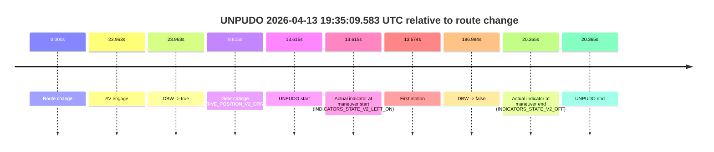
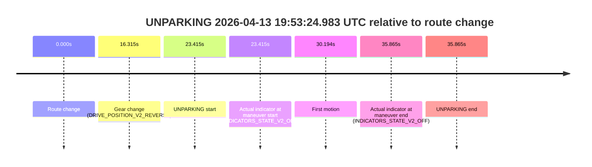

# Run Report: fme10010/2026-04-13--19-03-49--gen2-av-9fec48cc-19fa-47cb-9f3b-c12c39e3fedc

| Field | Value |
|---|---|
| Run ID | `fme10010/2026-04-13--19-03-49--gen2-av-9fec48cc-19fa-47cb-9f3b-c12c39e3fedc` |
| Date | `2026-04-13` |
| Model(s) | `lively-orange-horse` |
| Author | `guy.geva` |
| Event count | `5` |

## unpudo 2026-04-13 19:20:52.583 UTC

| Field | Value |
|---|---|
| Model | `lively-orange-horse` |
| Author | `guy.geva` |
| Run ID | `fme10010/2026-04-13--19-03-49--gen2-av-9fec48cc-19fa-47cb-9f3b-c12c39e3fedc` |
| Date | `2026-04-13` |
| Time (UTC) | `19:20:52.583` |
| Event type | `unpudo` |
| Disengagement type | `failed_to_unpudo` |
| Route change | `found` |
| Console | [run](https://console.sso.wayve.ai/run/fme10010/2026-04-13--19-03-49--gen2-av-9fec48cc-19fa-47cb-9f3b-c12c39e3fedc?id=&time-unixus=1776108052583318) |
| Foxglove | [segment](https://app.foxglove.dev/wayve-on-prem/p/prj_0dX18KZdVHg1fmmI/view?ds=foxglove-stream&ds.deviceName=fme10010&ds.start=2026-04-13T19%3A20%3A26.718309Z&ds.end=2026-04-13T19%3A22%3A41.771913Z&layoutId=lay_0e7VD4WIKDQGU73Y&time=2026-04-13T19%3A20%3A52.583318Z) |

### Event card: accidental

- Accidental: AV ownership is present for less than `2s`, so this is treated as an accidental brush with the maneuver rather than a meaningful model attempt.

| Event | Time (UTC) | Delta from route change |
|---|---:|---:|
| Route change | 2026-04-13 19:20:36.718 | `0.000s` |
| AV engage | 2026-04-13 19:21:04.672 | `27.955s` |
| DBW -> true | 2026-04-13 19:21:04.672 | `27.955s` |
| Gear change (DRIVE_POSITION_V2_DRIVE) | 2026-04-13 19:20:43.783 | `7.065s` |
| UNPUDO start | 2026-04-13 19:20:52.583 | `15.865s` |
| Actual indicator at maneuver start (INDICATORS_STATE_V2_OFF) | 2026-04-13 19:20:52.583 | `15.865s` |
| First motion | 2026-04-13 19:20:52.642 | `15.924s` |
| DBW -> false | 2026-04-13 19:22:31.771 | `115.054s` |
| Actual indicator at maneuver end (INDICATORS_STATE_V2_OFF) | 2026-04-13 19:20:56.583 | `19.865s` |
| UNPUDO end | 2026-04-13 19:20:56.583 | `19.865s` |

| Metric | Value |
|---|---|
| Outcome | `accidental` |
| Effective failure type | `none` |
| Route change status | `found` |
| DBW at event start | `false` |
| DBW at event end | `false` |
| Predicted gear at AV start | `DRIVE_POSITION_V2_DRIVE` |
| Actual gear at AV start | `DRIVE_POSITION_V2_DRIVE` |
| Predicted gear at event start | `DRIVE_POSITION_V2_DRIVE` |
| Actual gear at event start | `DRIVE_POSITION_V2_DRIVE` |
| Planned indicator direction | `INDICATORS_STATE_V2_LEFT_ON` |
| Controller indicator direction | `INDICATORS_STATE_V2_LEFT_ON` |
| Actual indicator direction | `INDICATORS_STATE_V2_OFF` |
| Actual indicator at maneuver end | `INDICATORS_STATE_V2_OFF` |
| Driver accel help in AV | `false` |
| Driver accel help timestamp | `n/a` |
| Max accel pedal pct in AV | `0.0%` |
| Max brake pedal pct in AV | `0.0%` |
| Max speed mps in AV | `0.000` |
| Route -> AV | `27.955s` |
| AV -> event start | `-12.090s` |
| AV -> first motion | `-12.030s` |
| AV duration before disengagement | `87.099s` |
| Trajectory waypoint count | `37` |
| Driving-plan step count | `11` |

The scored portion starts from the AV-owned window, not from the pre-AV setup. Route-change search in the stopped pre-event segment was `found`, with the baseline therefore set to route change. At the event anchor the model predicts `DRIVE_POSITION_V2_DRIVE` and the actual gear is `DRIVE_POSITION_V2_DRIVE`. The effective model outcome is `accidental` because `the AV-owned portion is shorter than 2s`.

### Resolution

| Field | Value |
|---|---|
| Final outcome | `accidental` |
| Do we agree with this label? | `yes` |
| Source disengagement type | `failed_to_unpudo` |
| Resolved effective failure type | `none` |
| Confidence | `high` |

## unpudo 2026-04-13 19:31:44.133 UTC

| Field | Value |
|---|---|
| Model | `lively-orange-horse` |
| Author | `guy.geva` |
| Run ID | `fme10010/2026-04-13--19-03-49--gen2-av-9fec48cc-19fa-47cb-9f3b-c12c39e3fedc` |
| Date | `2026-04-13` |
| Time (UTC) | `19:31:44.133` |
| Event type | `unpudo` |
| Disengagement type | `failed_to_unpudo` |
| Route change | `found` |
| Console | [run](https://console.sso.wayve.ai/run/fme10010/2026-04-13--19-03-49--gen2-av-9fec48cc-19fa-47cb-9f3b-c12c39e3fedc?id=&time-unixus=1776108704133316) |
| Foxglove | [segment](https://app.foxglove.dev/wayve-on-prem/p/prj_0dX18KZdVHg1fmmI/view?ds=foxglove-stream&ds.deviceName=fme10010&ds.start=2026-04-13T19%3A30%3A58.368254Z&ds.end=2026-04-13T19%3A33%3A15.653668Z&layoutId=lay_0e7VD4WIKDQGU73Y&time=2026-04-13T19%3A31%3A44.133316Z) |

### Event card: accidental

- Accidental: AV ownership is present for less than `2s`, so this is treated as an accidental brush with the maneuver rather than a meaningful model attempt.

| Event | Time (UTC) | Delta from route change |
|---|---:|---:|
| Route change | 2026-04-13 19:31:08.368 | `0.000s` |
| AV engage | 2026-04-13 19:32:03.531 | `55.164s` |
| DBW -> true | 2026-04-13 19:32:03.531 | `55.164s` |
| Gear change (DRIVE_POSITION_V2_DRIVE) | 2026-04-13 19:31:39.683 | `31.315s` |
| UNPUDO start | 2026-04-13 19:31:44.133 | `35.765s` |
| Actual indicator at maneuver start (INDICATORS_STATE_V2_OFF) | 2026-04-13 19:31:44.133 | `35.765s` |
| First motion | 2026-04-13 19:31:44.182 | `35.814s` |
| DBW -> false | 2026-04-13 19:33:05.653 | `117.285s` |
| Actual indicator at maneuver end (INDICATORS_STATE_V2_OFF) | 2026-04-13 19:31:49.033 | `40.665s` |
| UNPUDO end | 2026-04-13 19:31:49.033 | `40.665s` |

| Metric | Value |
|---|---|
| Outcome | `accidental` |
| Effective failure type | `none` |
| Route change status | `found` |
| DBW at event start | `false` |
| DBW at event end | `false` |
| Predicted gear at AV start | `DRIVE_POSITION_V2_DRIVE` |
| Actual gear at AV start | `DRIVE_POSITION_V2_DRIVE` |
| Predicted gear at event start | `DRIVE_POSITION_V2_DRIVE` |
| Actual gear at event start | `DRIVE_POSITION_V2_DRIVE` |
| Planned indicator direction | `INDICATORS_STATE_V2_OFF` |
| Controller indicator direction | `INDICATORS_STATE_V2_OFF` |
| Actual indicator direction | `INDICATORS_STATE_V2_OFF` |
| Actual indicator at maneuver end | `INDICATORS_STATE_V2_OFF` |
| Driver accel help in AV | `false` |
| Driver accel help timestamp | `n/a` |
| Max accel pedal pct in AV | `0.0%` |
| Max brake pedal pct in AV | `0.0%` |
| Max speed mps in AV | `0.000` |
| Route -> AV | `55.164s` |
| AV -> event start | `-19.399s` |
| AV -> first motion | `-19.349s` |
| AV duration before disengagement | `62.122s` |
| Trajectory waypoint count | `36` |
| Driving-plan step count | `11` |

The scored portion starts from the AV-owned window, not from the pre-AV setup. Route-change search in the stopped pre-event segment was `found`, with the baseline therefore set to route change. At the event anchor the model predicts `DRIVE_POSITION_V2_DRIVE` and the actual gear is `DRIVE_POSITION_V2_DRIVE`. The effective model outcome is `accidental` because `the AV-owned portion is shorter than 2s`.

### Resolution

| Field | Value |
|---|---|
| Final outcome | `accidental` |
| Do we agree with this label? | `yes` |
| Source disengagement type | `failed_to_unpudo` |
| Resolved effective failure type | `none` |
| Confidence | `high` |

## unpudo 2026-04-13 19:35:09.583 UTC

| Field | Value |
|---|---|
| Model | `lively-orange-horse` |
| Author | `guy.geva` |
| Run ID | `fme10010/2026-04-13--19-03-49--gen2-av-9fec48cc-19fa-47cb-9f3b-c12c39e3fedc` |
| Date | `2026-04-13` |
| Time (UTC) | `19:35:09.583` |
| Event type | `unpudo` |
| Disengagement type | `failed_to_unpudo` |
| Route change | `found` |
| Console | [run](https://console.sso.wayve.ai/run/fme10010/2026-04-13--19-03-49--gen2-av-9fec48cc-19fa-47cb-9f3b-c12c39e3fedc?id=&time-unixus=1776108909583313) |
| Foxglove | [segment](https://app.foxglove.dev/wayve-on-prem/p/prj_0dX18KZdVHg1fmmI/view?ds=foxglove-stream&ds.deviceName=fme10010&ds.start=2026-04-13T19%3A34%3A45.968543Z&ds.end=2026-04-13T19%3A38%3A12.952511Z&layoutId=lay_0e7VD4WIKDQGU73Y&time=2026-04-13T19%3A35%3A09.583313Z) |

### Event card: accidental

- Accidental: AV ownership is present for less than `2s`, so this is treated as an accidental brush with the maneuver rather than a meaningful model attempt.

| Event | Time (UTC) | Delta from route change |
|---|---:|---:|
| Route change | 2026-04-13 19:34:55.968 | `0.000s` |
| AV engage | 2026-04-13 19:35:19.931 | `23.963s` |
| DBW -> true | 2026-04-13 19:35:19.931 | `23.963s` |
| Gear change (DRIVE_POSITION_V2_DRIVE) | 2026-04-13 19:35:05.583 | `9.615s` |
| UNPUDO start | 2026-04-13 19:35:09.583 | `13.615s` |
| Actual indicator at maneuver start (INDICATORS_STATE_V2_LEFT_ON) | 2026-04-13 19:35:09.583 | `13.615s` |
| First motion | 2026-04-13 19:35:09.642 | `13.674s` |
| DBW -> false | 2026-04-13 19:38:02.952 | `186.984s` |
| Actual indicator at maneuver end (INDICATORS_STATE_V2_OFF) | 2026-04-13 19:35:16.333 | `20.365s` |
| UNPUDO end | 2026-04-13 19:35:16.333 | `20.365s` |

| Metric | Value |
|---|---|
| Outcome | `accidental` |
| Effective failure type | `none` |
| Route change status | `found` |
| DBW at event start | `false` |
| DBW at event end | `false` |
| Predicted gear at AV start | `DRIVE_POSITION_V2_DRIVE` |
| Actual gear at AV start | `DRIVE_POSITION_V2_DRIVE` |
| Predicted gear at event start | `DRIVE_POSITION_V2_DRIVE` |
| Actual gear at event start | `DRIVE_POSITION_V2_DRIVE` |
| Planned indicator direction | `INDICATORS_STATE_V2_LEFT_ON` |
| Controller indicator direction | `INDICATORS_STATE_V2_LEFT_ON` |
| Actual indicator direction | `INDICATORS_STATE_V2_LEFT_ON` |
| Actual indicator at maneuver end | `INDICATORS_STATE_V2_OFF` |
| Driver accel help in AV | `false` |
| Driver accel help timestamp | `n/a` |
| Max accel pedal pct in AV | `0.0%` |
| Max brake pedal pct in AV | `0.0%` |
| Max speed mps in AV | `0.000` |
| Route -> AV | `23.963s` |
| AV -> event start | `-10.349s` |
| AV -> first motion | `-10.289s` |
| AV duration before disengagement | `163.021s` |
| Trajectory waypoint count | `37` |
| Driving-plan step count | `11` |

The scored portion starts from the AV-owned window, not from the pre-AV setup. Route-change search in the stopped pre-event segment was `found`, with the baseline therefore set to route change. At the event anchor the model predicts `DRIVE_POSITION_V2_DRIVE` and the actual gear is `DRIVE_POSITION_V2_DRIVE`. The effective model outcome is `accidental` because `the AV-owned portion is shorter than 2s`.

### Resolution

| Field | Value |
|---|---|
| Final outcome | `accidental` |
| Do we agree with this label? | `yes` |
| Source disengagement type | `failed_to_unpudo` |
| Resolved effective failure type | `none` |
| Confidence | `high` |

## unpudo 2026-04-13 19:40:27.683 UTC

| Field | Value |
|---|---|
| Model | `lively-orange-horse` |
| Author | `guy.geva` |
| Run ID | `fme10010/2026-04-13--19-03-49--gen2-av-9fec48cc-19fa-47cb-9f3b-c12c39e3fedc` |
| Date | `2026-04-13` |
| Time (UTC) | `19:40:27.683` |
| Event type | `unpudo` |
| Disengagement type | `none observed` |
| Route change | `found` |
| Console | [run](https://console.sso.wayve.ai/run/fme10010/2026-04-13--19-03-49--gen2-av-9fec48cc-19fa-47cb-9f3b-c12c39e3fedc?id=&time-unixus=1776109227683307) |
| Foxglove | [segment](https://app.foxglove.dev/wayve-on-prem/p/prj_0dX18KZdVHg1fmmI/view?ds=foxglove-stream&ds.deviceName=fme10010&ds.start=2026-04-13T19%3A38%3A06.471806Z&ds.end=2026-04-13T19%3A43%3A12.752658Z&layoutId=lay_0e7VD4WIKDQGU73Y&time=2026-04-13T19%3A40%3A27.683307Z) |

### Event card: pass

- Pass: AV owns the credited unpudo through the official event window, the gear state is aligned at the anchor, and the vehicle moves without driver accelerator help in AV.

| Event | Time (UTC) | Delta from route change |
|---|---:|---:|
| Route change | 2026-04-13 19:40:12.118 | `0.000s` |
| AV engage | 2026-04-13 19:38:16.471 | `-115.646s` |
| DBW -> true | 2026-04-13 19:38:16.471 | `-115.646s` |
| Gear change (DRIVE_POSITION_V2_DRIVE) | 2026-04-13 19:40:18.733 | `6.615s` |
| UNPUDO start | 2026-04-13 19:40:27.683 | `15.565s` |
| Actual indicator at maneuver start (INDICATORS_STATE_V2_OFF) | 2026-04-13 19:40:27.683 | `15.565s` |
| First motion | 2026-04-13 19:40:27.702 | `15.584s` |
| DBW -> false | 2026-04-13 19:43:02.752 | `170.634s` |
| Actual indicator at maneuver end (INDICATORS_STATE_V2_OFF) | 2026-04-13 19:40:31.133 | `19.015s` |
| UNPUDO end | 2026-04-13 19:40:31.133 | `19.015s` |

| Metric | Value |
|---|---|
| Outcome | `pass` |
| Effective failure type | `none` |
| Route change status | `found` |
| DBW at event start | `true` |
| DBW at event end | `true` |
| Predicted gear at AV start | `DRIVE_POSITION_V2_DRIVE` |
| Actual gear at AV start | `DRIVE_POSITION_V2_DRIVE` |
| Predicted gear at event start | `DRIVE_POSITION_V2_DRIVE` |
| Actual gear at event start | `DRIVE_POSITION_V2_DRIVE` |
| Planned indicator direction | `INDICATORS_STATE_V2_LEFT_ON` |
| Controller indicator direction | `INDICATORS_STATE_V2_LEFT_ON` |
| Actual indicator direction | `INDICATORS_STATE_V2_OFF` |
| Actual indicator at maneuver end | `INDICATORS_STATE_V2_OFF` |
| Driver accel help in AV | `false` |
| Driver accel help timestamp | `n/a` |
| Max accel pedal pct in AV | `0.0%` |
| Max brake pedal pct in AV | `19.0%` |
| Max speed mps in AV | `10.642` |
| Route -> AV | `-115.646s` |
| AV -> event start | `131.212s` |
| AV -> first motion | `131.231s` |
| AV duration before disengagement | `286.281s` |
| Trajectory waypoint count | `37` |
| Driving-plan step count | `11` |

The scored portion starts from the AV-owned window, not from the pre-AV setup. Route-change search in the stopped pre-event segment was `found`, with the baseline therefore set to route change. At the event anchor the model predicts `DRIVE_POSITION_V2_DRIVE` and the actual gear is `DRIVE_POSITION_V2_DRIVE`. The effective model outcome is `pass` because `the credited maneuver stays AV-owned through the official event end`.

### Resolution

| Field | Value |
|---|---|
| Final outcome | `pass` |
| Do we agree with this label? | `yes` |
| Source disengagement type | `none observed` |
| Resolved effective failure type | `none` |
| Confidence | `high` |

## unparking 2026-04-13 19:53:24.983 UTC

| Field | Value |
|---|---|
| Model | `lively-orange-horse` |
| Author | `guy.geva` |
| Run ID | `fme10010/2026-04-13--19-03-49--gen2-av-9fec48cc-19fa-47cb-9f3b-c12c39e3fedc` |
| Date | `2026-04-13` |
| Time (UTC) | `19:53:24.983` |
| Event type | `unparking` |
| Disengagement type | `failed_to_unpudo` |
| Route change | `found` |
| Console | [run](https://console.sso.wayve.ai/run/fme10010/2026-04-13--19-03-49--gen2-av-9fec48cc-19fa-47cb-9f3b-c12c39e3fedc?id=&time-unixus=1776110004983311) |
| Foxglove | [segment](https://app.foxglove.dev/wayve-on-prem/p/prj_0dX18KZdVHg1fmmI/view?ds=foxglove-stream&ds.deviceName=fme10010&ds.start=2026-04-13T19%3A52%3A51.568330Z&ds.end=2026-04-13T19%3A53%3A47.433318Z&layoutId=lay_0e7VD4WIKDQGU73Y&time=2026-04-13T19%3A53%3A24.983311Z) |

### Event card: non-av

- Non-AV: the detected unparking starts outside AV ownership, so it is kept for coverage but excluded from model success / failure scoring.

| Event | Time (UTC) | Delta from route change |
|---|---:|---:|
| Route change | 2026-04-13 19:53:01.568 | `0.000s` |
| Gear change (DRIVE_POSITION_V2_REVERSE) | 2026-04-13 19:53:17.883 | `16.315s` |
| UNPARKING start | 2026-04-13 19:53:24.983 | `23.415s` |
| Actual indicator at maneuver start (INDICATORS_STATE_V2_OFF) | 2026-04-13 19:53:24.983 | `23.415s` |
| First motion | 2026-04-13 19:53:31.762 | `30.194s` |
| Actual indicator at maneuver end (INDICATORS_STATE_V2_OFF) | 2026-04-13 19:53:37.433 | `35.865s` |
| UNPARKING end | 2026-04-13 19:53:37.433 | `35.865s` |

| Metric | Value |
|---|---|
| Outcome | `non-av` |
| Effective failure type | `none` |
| Route change status | `found` |
| DBW at event start | `false` |
| DBW at event end | `false` |
| Predicted gear at AV start | `n/a` |
| Actual gear at AV start | `n/a` |
| Predicted gear at event start | `DRIVE_POSITION_V2_REVERSE` |
| Actual gear at event start | `DRIVE_POSITION_V2_REVERSE` |
| Planned indicator direction | `INDICATORS_STATE_V2_LEFT_ON` |
| Controller indicator direction | `INDICATORS_STATE_V2_LEFT_ON` |
| Actual indicator direction | `INDICATORS_STATE_V2_OFF` |
| Actual indicator at maneuver end | `INDICATORS_STATE_V2_OFF` |
| Driver accel help in AV | `false` |
| Driver accel help timestamp | `n/a` |
| Max accel pedal pct in AV | `0.0%` |
| Max brake pedal pct in AV | `0.0%` |
| Max speed mps in AV | `0.000` |
| Route -> AV | `n/a` |
| AV -> event start | `n/a` |
| AV -> first motion | `n/a` |
| AV duration before disengagement | `n/a` |
| Trajectory waypoint count | `37` |
| Driving-plan step count | `11` |

The scored portion starts from the AV-owned window, not from the pre-AV setup. Route-change search in the stopped pre-event segment was `found`, with the baseline therefore set to route change. At the event anchor the model predicts `DRIVE_POSITION_V2_REVERSE` and the actual gear is `DRIVE_POSITION_V2_REVERSE`. The effective model outcome is `non-av` because `the event does not begin in AV ownership`.

### Resolution

| Field | Value |
|---|---|
| Final outcome | `non-av` |
| Do we agree with this label? | `yes` |
| Source disengagement type | `failed_to_unpudo` |
| Resolved effective failure type | `none` |
| Confidence | `high` |
