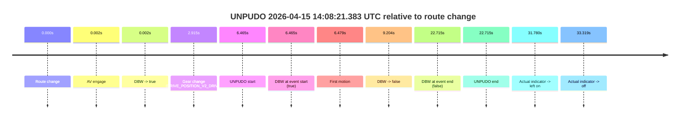
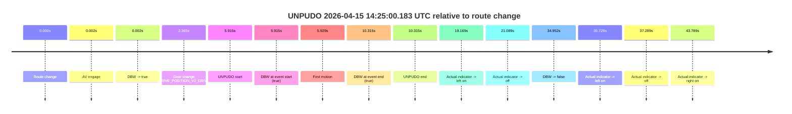
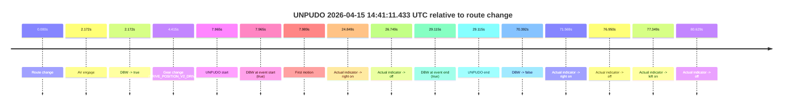
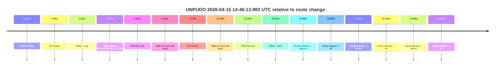
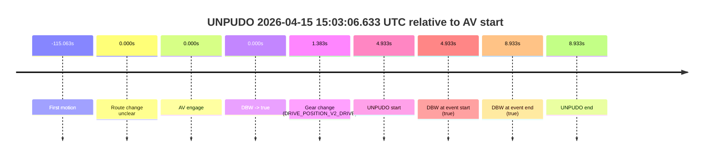

# Run Report: fme10010/2026-04-15--13-36-23--gen2-av-f1432a3a-2962-4aaf-9fca-bf38ea9b222d

| Field | Value |
|---|---|
| Run ID | `fme10010/2026-04-15--13-36-23--gen2-av-f1432a3a-2962-4aaf-9fca-bf38ea9b222d` |
| Date | `2026-04-15` |
| Model(s) | `eel-teal-outspoken` |
| Author | `zak` |
| Event count | `6` |

## unpudo 2026-04-15 14:08:21.383 UTC

| Field | Value |
|---|---|
| Model | `eel-teal-outspoken` |
| Author | `zak` |
| Run ID | `fme10010/2026-04-15--13-36-23--gen2-av-f1432a3a-2962-4aaf-9fca-bf38ea9b222d` |
| Date | `2026-04-15` |
| Time (UTC) | `14:08:21.383` |
| Event type | `unpudo` |
| Disengagement type | `failed_to_unpudo` |
| Route change | `found` |
| Console | [run](https://console.sso.wayve.ai/run/fme10010/2026-04-15--13-36-23--gen2-av-f1432a3a-2962-4aaf-9fca-bf38ea9b222d?id=&time-unixus=1776262101383316) |
| Foxglove | [segment](https://app.foxglove.dev/wayve-on-prem/p/prj_0dX18KZdVHg1fmmI/view?ds=foxglove-stream&ds.deviceName=fme10010&ds.start=2026-04-15T14%3A08%3A04.918245Z&ds.end=2026-04-15T14%3A08%3A47.633316Z&layoutId=lay_0e7VD4WIKDQGU73Y&time=2026-04-15T14%3A08%3A21.383316Z) |

### Event card: fail

- Fail: AV owns part of the segment, but the event still resolves as a model-performance failure under the AV-only scoring rule.

| Event | Time (UTC) | Delta from route change |
|---|---:|---:|
| Route change | 2026-04-15 14:08:14.918 | `0.000s` |
| AV engage | 2026-04-15 14:08:14.920 | `0.002s` |
| DBW -> true | 2026-04-15 14:08:14.920 | `0.002s` |
| Gear change (DRIVE_POSITION_V2_DRIVE) | 2026-04-15 14:08:17.833 | `2.915s` |
| UNPUDO start | 2026-04-15 14:08:21.383 | `6.465s` |
| DBW at event start (true) | 2026-04-15 14:08:21.383 | `6.465s` |
| First motion | 2026-04-15 14:08:21.397 | `6.479s` |
| DBW -> false | 2026-04-15 14:08:24.121 | `9.204s` |
| DBW at event end (false) | 2026-04-15 14:08:37.633 | `22.715s` |
| UNPUDO end | 2026-04-15 14:08:37.633 | `22.715s` |
| Actual indicator -> left on | 2026-04-15 14:08:46.697 | `31.780s` |
| Actual indicator -> off | 2026-04-15 14:08:48.237 | `33.319s` |

| Metric | Value |
|---|---|
| Outcome | `fail` |
| Effective failure type | `failed_to_unpudo` |
| Route change status | `found` |
| DBW at event start | `true` |
| DBW at event end | `false` |
| Predicted gear at AV start | `DRIVE_POSITION_V2_PARK` |
| Actual gear at AV start | `DRIVE_POSITION_V2_PARK` |
| Predicted gear at event start | `DRIVE_POSITION_V2_DRIVE` |
| Actual gear at event start | `DRIVE_POSITION_V2_DRIVE` |
| Planned indicator direction | `INDICATORS_STATE_V2_LEFT_ON` |
| Controller indicator direction | `INDICATORS_STATE_V2_LEFT_ON` |
| Actual indicator direction | `INDICATORS_STATE_V2_OFF` |
| Actual indicator at maneuver end | `INDICATORS_STATE_V2_OFF` |
| Driver accel help in AV | `false` |
| Driver accel help timestamp | `n/a` |
| Max accel pedal pct in AV | `0.0%` |
| Max brake pedal pct in AV | `8.0%` |
| Max speed mps in AV | `1.806` |
| Success timing baseline | `route change` |
| Route -> AV | `0.002s` |
| AV -> event start | `6.463s` |
| AV -> first motion | `6.477s` |
| Success baseline -> event start | `6.465s` |
| Success baseline -> first motion | `6.479s` |
| AV duration before disengagement | `9.202s` |
| Trajectory waypoint count | `37` |
| Driving-plan step count | `11` |

The scored portion starts from the AV-owned window, not from the pre-AV setup. Route-change search in the stopped pre-event segment was `found`, with the baseline therefore set to route change. At the event anchor the model predicts `DRIVE_POSITION_V2_DRIVE` and the actual gear is `DRIVE_POSITION_V2_DRIVE`. The effective model outcome is `fail` because `failed_to_unpudo.`

### Resolution

| Field | Value |
|---|---|
| Final outcome | `fail` |
| Do we agree with this label? | `yes` |
| Source disengagement type | `failed_to_unpudo` |
| Resolved effective failure type | `failed_to_unpudo` |
| Confidence | `high` |

## unpudo 2026-04-15 14:10:19.733 UTC

| Field | Value |
|---|---|
| Model | `eel-teal-outspoken` |
| Author | `zak` |
| Run ID | `fme10010/2026-04-15--13-36-23--gen2-av-f1432a3a-2962-4aaf-9fca-bf38ea9b222d` |
| Date | `2026-04-15` |
| Time (UTC) | `14:10:19.733` |
| Event type | `unpudo` |
| Disengagement type | `none observed` |
| Route change | `found` |
| Console | [run](https://console.sso.wayve.ai/run/fme10010/2026-04-15--13-36-23--gen2-av-f1432a3a-2962-4aaf-9fca-bf38ea9b222d?id=&time-unixus=1776262219733296) |
| Foxglove | [segment](https://app.foxglove.dev/wayve-on-prem/p/prj_0dX18KZdVHg1fmmI/view?ds=foxglove-stream&ds.deviceName=fme10010&ds.start=2026-04-15T14%3A10%3A02.968252Z&ds.end=2026-04-15T14%3A12%3A25.579927Z&layoutId=lay_0e7VD4WIKDQGU73Y&time=2026-04-15T14%3A10%3A19.733296Z) |

### Event card: pass

- Pass: AV owns the credited unpudo from route change through the official unpudo window, the gear state is aligned at the anchor, and the vehicle moves without driver accelerator help in AV.

| Event | Time (UTC) | Delta from route change |
|---|---:|---:|
| Route change | 2026-04-15 14:10:12.968 | `0.000s` |
| AV engage | 2026-04-15 14:10:12.970 | `0.002s` |
| DBW -> true | 2026-04-15 14:10:12.970 | `0.002s` |
| Gear change (DRIVE_POSITION_V2_DRIVE) | 2026-04-15 14:10:16.033 | `3.065s` |
| UNPUDO start | 2026-04-15 14:10:19.733 | `6.765s` |
| DBW at event start (true) | 2026-04-15 14:10:19.733 | `6.765s` |
| First motion | 2026-04-15 14:10:19.757 | `6.789s` |
| DBW at event end (true) | 2026-04-15 14:10:23.583 | `10.615s` |
| UNPUDO end | 2026-04-15 14:10:23.583 | `10.615s` |
| DBW -> false | 2026-04-15 14:12:15.579 | `122.612s` |

| Metric | Value |
|---|---|
| Outcome | `pass` |
| Effective failure type | `none` |
| Route change status | `found` |
| DBW at event start | `true` |
| DBW at event end | `true` |
| Predicted gear at AV start | `DRIVE_POSITION_V2_PARK` |
| Actual gear at AV start | `DRIVE_POSITION_V2_PARK` |
| Predicted gear at event start | `DRIVE_POSITION_V2_DRIVE` |
| Actual gear at event start | `DRIVE_POSITION_V2_DRIVE` |
| Planned indicator direction | `INDICATORS_STATE_V2_LEFT_ON` |
| Controller indicator direction | `INDICATORS_STATE_V2_LEFT_ON` |
| Actual indicator direction | `INDICATORS_STATE_V2_OFF` |
| Actual indicator at maneuver end | `INDICATORS_STATE_V2_OFF` |
| Driver accel help in AV | `false` |
| Driver accel help timestamp | `n/a` |
| Max accel pedal pct in AV | `0.0%` |
| Max brake pedal pct in AV | `8.0%` |
| Max speed mps in AV | `4.872` |
| Success timing baseline | `route change` |
| Route -> AV | `0.002s` |
| AV -> event start | `6.763s` |
| AV -> first motion | `6.787s` |
| Success baseline -> event start | `6.765s` |
| Success baseline -> first motion | `6.789s` |
| AV duration before disengagement | `122.610s` |
| Trajectory waypoint count | `38` |
| Driving-plan step count | `11` |

The scored portion starts from the AV-owned window, not from the pre-AV setup. Route-change search in the stopped pre-event segment was `found`, with the baseline therefore set to route change. At the event anchor the model predicts `DRIVE_POSITION_V2_DRIVE` and the actual gear is `DRIVE_POSITION_V2_DRIVE`. The effective model outcome is `pass` because `the credited unpudo stays AV-owned through the official unpudo window.`

### Resolution

| Field | Value |
|---|---|
| Final outcome | `pass` |
| Do we agree with this label? | `yes` |
| Source disengagement type | `none observed` |
| Resolved effective failure type | `none` |
| Confidence | `high` |

## unpudo 2026-04-15 14:25:00.183 UTC

| Field | Value |
|---|---|
| Model | `eel-teal-outspoken` |
| Author | `zak` |
| Run ID | `fme10010/2026-04-15--13-36-23--gen2-av-f1432a3a-2962-4aaf-9fca-bf38ea9b222d` |
| Date | `2026-04-15` |
| Time (UTC) | `14:25:00.183` |
| Event type | `unpudo` |
| Disengagement type | `none observed` |
| Route change | `found` |
| Console | [run](https://console.sso.wayve.ai/run/fme10010/2026-04-15--13-36-23--gen2-av-f1432a3a-2962-4aaf-9fca-bf38ea9b222d?id=&time-unixus=1776263100183298) |
| Foxglove | [segment](https://app.foxglove.dev/wayve-on-prem/p/prj_0dX18KZdVHg1fmmI/view?ds=foxglove-stream&ds.deviceName=fme10010&ds.start=2026-04-15T14%3A24%3A44.268262Z&ds.end=2026-04-15T14%3A25%3A39.219781Z&layoutId=lay_0e7VD4WIKDQGU73Y&time=2026-04-15T14%3A25%3A00.183298Z) |

### Event card: pass

- Pass: AV owns the credited unpudo from route change through the official unpudo window, the gear state is aligned at the anchor, and the vehicle moves without driver accelerator help in AV.

| Event | Time (UTC) | Delta from route change |
|---|---:|---:|
| Route change | 2026-04-15 14:24:54.268 | `0.000s` |
| AV engage | 2026-04-15 14:24:54.270 | `0.002s` |
| DBW -> true | 2026-04-15 14:24:54.270 | `0.002s` |
| Gear change (DRIVE_POSITION_V2_DRIVE) | 2026-04-15 14:24:56.633 | `2.365s` |
| UNPUDO start | 2026-04-15 14:25:00.183 | `5.915s` |
| DBW at event start (true) | 2026-04-15 14:25:00.183 | `5.915s` |
| First motion | 2026-04-15 14:25:00.197 | `5.929s` |
| DBW at event end (true) | 2026-04-15 14:25:04.583 | `10.315s` |
| UNPUDO end | 2026-04-15 14:25:04.583 | `10.315s` |
| Actual indicator -> left on | 2026-04-15 14:25:13.437 | `19.169s` |
| Actual indicator -> off | 2026-04-15 14:25:15.357 | `21.089s` |
| DBW -> false | 2026-04-15 14:25:29.219 | `34.952s` |
| Actual indicator -> left on | 2026-04-15 14:25:29.997 | `35.729s` |
| Actual indicator -> off | 2026-04-15 14:25:31.557 | `37.289s` |
| Actual indicator -> right on | 2026-04-15 14:25:38.057 | `43.789s` |

| Metric | Value |
|---|---|
| Outcome | `pass` |
| Effective failure type | `none` |
| Route change status | `found` |
| DBW at event start | `true` |
| DBW at event end | `true` |
| Predicted gear at AV start | `DRIVE_POSITION_V2_PARK` |
| Actual gear at AV start | `DRIVE_POSITION_V2_PARK` |
| Predicted gear at event start | `DRIVE_POSITION_V2_DRIVE` |
| Actual gear at event start | `DRIVE_POSITION_V2_DRIVE` |
| Planned indicator direction | `INDICATORS_STATE_V2_OFF` |
| Controller indicator direction | `INDICATORS_STATE_V2_OFF` |
| Actual indicator direction | `INDICATORS_STATE_V2_OFF` |
| Actual indicator at maneuver end | `INDICATORS_STATE_V2_OFF` |
| Driver accel help in AV | `false` |
| Driver accel help timestamp | `n/a` |
| Max accel pedal pct in AV | `0.0%` |
| Max brake pedal pct in AV | `8.0%` |
| Max speed mps in AV | `2.828` |
| Success timing baseline | `route change` |
| Route -> AV | `0.002s` |
| AV -> event start | `5.913s` |
| AV -> first motion | `5.927s` |
| Success baseline -> event start | `5.915s` |
| Success baseline -> first motion | `5.929s` |
| AV duration before disengagement | `34.950s` |
| Trajectory waypoint count | `37` |
| Driving-plan step count | `11` |

The scored portion starts from the AV-owned window, not from the pre-AV setup. Route-change search in the stopped pre-event segment was `found`, with the baseline therefore set to route change. At the event anchor the model predicts `DRIVE_POSITION_V2_DRIVE` and the actual gear is `DRIVE_POSITION_V2_DRIVE`. The effective model outcome is `pass` because `the credited unpudo stays AV-owned through the official unpudo window.`

### Resolution

| Field | Value |
|---|---|
| Final outcome | `pass` |
| Do we agree with this label? | `yes` |
| Source disengagement type | `none observed` |
| Resolved effective failure type | `none` |
| Confidence | `high` |

## unpudo 2026-04-15 14:41:11.433 UTC

| Field | Value |
|---|---|
| Model | `eel-teal-outspoken` |
| Author | `zak` |
| Run ID | `fme10010/2026-04-15--13-36-23--gen2-av-f1432a3a-2962-4aaf-9fca-bf38ea9b222d` |
| Date | `2026-04-15` |
| Time (UTC) | `14:41:11.433` |
| Event type | `unpudo` |
| Disengagement type | `none observed` |
| Route change | `found` |
| Console | [run](https://console.sso.wayve.ai/run/fme10010/2026-04-15--13-36-23--gen2-av-f1432a3a-2962-4aaf-9fca-bf38ea9b222d?id=&time-unixus=1776264071433298) |
| Foxglove | [segment](https://app.foxglove.dev/wayve-on-prem/p/prj_0dX18KZdVHg1fmmI/view?ds=foxglove-stream&ds.deviceName=fme10010&ds.start=2026-04-15T14%3A40%3A53.468263Z&ds.end=2026-04-15T14%3A42%3A23.860422Z&layoutId=lay_0e7VD4WIKDQGU73Y&time=2026-04-15T14%3A41%3A11.433298Z) |

### Event card: pass

- Pass: AV owns the credited unpudo from route change through the official unpudo window, the gear state is aligned at the anchor, and the vehicle moves without driver accelerator help in AV.

| Event | Time (UTC) | Delta from route change |
|---|---:|---:|
| Route change | 2026-04-15 14:41:03.468 | `0.000s` |
| AV engage | 2026-04-15 14:41:05.640 | `2.172s` |
| DBW -> true | 2026-04-15 14:41:05.640 | `2.172s` |
| Gear change (DRIVE_POSITION_V2_DRIVE) | 2026-04-15 14:41:07.883 | `4.415s` |
| UNPUDO start | 2026-04-15 14:41:11.433 | `7.965s` |
| DBW at event start (true) | 2026-04-15 14:41:11.433 | `7.965s` |
| First motion | 2026-04-15 14:41:11.457 | `7.989s` |
| Actual indicator -> right on | 2026-04-15 14:41:28.317 | `24.849s` |
| Actual indicator -> off | 2026-04-15 14:41:30.217 | `26.749s` |
| DBW at event end (true) | 2026-04-15 14:41:32.583 | `29.115s` |
| UNPUDO end | 2026-04-15 14:41:32.583 | `29.115s` |
| DBW -> false | 2026-04-15 14:42:13.860 | `70.392s` |
| Actual indicator -> right on | 2026-04-15 14:42:15.037 | `71.569s` |
| Actual indicator -> off | 2026-04-15 14:42:20.417 | `76.950s` |
| Actual indicator -> left on | 2026-04-15 14:42:20.817 | `77.349s` |
| Actual indicator -> off | 2026-04-15 14:42:24.097 | `80.629s` |

| Metric | Value |
|---|---|
| Outcome | `pass` |
| Effective failure type | `none` |
| Route change status | `found` |
| DBW at event start | `true` |
| DBW at event end | `true` |
| Predicted gear at AV start | `DRIVE_POSITION_V2_PARK` |
| Actual gear at AV start | `DRIVE_POSITION_V2_PARK` |
| Predicted gear at event start | `DRIVE_POSITION_V2_DRIVE` |
| Actual gear at event start | `DRIVE_POSITION_V2_DRIVE` |
| Planned indicator direction | `INDICATORS_STATE_V2_OFF` |
| Controller indicator direction | `INDICATORS_STATE_V2_OFF` |
| Actual indicator direction | `INDICATORS_STATE_V2_OFF` |
| Actual indicator at maneuver end | `INDICATORS_STATE_V2_OFF` |
| Driver accel help in AV | `false` |
| Driver accel help timestamp | `n/a` |
| Max accel pedal pct in AV | `0.0%` |
| Max brake pedal pct in AV | `8.8%` |
| Max speed mps in AV | `2.375` |
| Success timing baseline | `route change` |
| Route -> AV | `2.172s` |
| AV -> event start | `5.793s` |
| AV -> first motion | `5.818s` |
| Success baseline -> event start | `7.965s` |
| Success baseline -> first motion | `7.989s` |
| AV duration before disengagement | `68.220s` |
| Trajectory waypoint count | `38` |
| Driving-plan step count | `11` |

The scored portion starts from the AV-owned window, not from the pre-AV setup. Route-change search in the stopped pre-event segment was `found`, with the baseline therefore set to route change. At the event anchor the model predicts `DRIVE_POSITION_V2_DRIVE` and the actual gear is `DRIVE_POSITION_V2_DRIVE`. The effective model outcome is `pass` because `the credited unpudo stays AV-owned through the official unpudo window.`

### Resolution

| Field | Value |
|---|---|
| Final outcome | `pass` |
| Do we agree with this label? | `yes` |
| Source disengagement type | `none observed` |
| Resolved effective failure type | `none` |
| Confidence | `high` |

## unpudo 2026-04-15 14:46:13.983 UTC

| Field | Value |
|---|---|
| Model | `eel-teal-outspoken` |
| Author | `zak` |
| Run ID | `fme10010/2026-04-15--13-36-23--gen2-av-f1432a3a-2962-4aaf-9fca-bf38ea9b222d` |
| Date | `2026-04-15` |
| Time (UTC) | `14:46:13.983` |
| Event type | `unpudo` |
| Disengagement type | `none observed` |
| Route change | `found` |
| Console | [run](https://console.sso.wayve.ai/run/fme10010/2026-04-15--13-36-23--gen2-av-f1432a3a-2962-4aaf-9fca-bf38ea9b222d?id=&time-unixus=1776264373983312) |
| Foxglove | [segment](https://app.foxglove.dev/wayve-on-prem/p/prj_0dX18KZdVHg1fmmI/view?ds=foxglove-stream&ds.deviceName=fme10010&ds.start=2026-04-15T14%3A45%3A57.868274Z&ds.end=2026-04-15T14%3A46%3A43.320766Z&layoutId=lay_0e7VD4WIKDQGU73Y&time=2026-04-15T14%3A46%3A13.983312Z) |

### Event card: pass

- Pass: AV owns the credited unpudo from route change through the official unpudo window, the gear state is aligned at the anchor, and the vehicle moves without driver accelerator help in AV.

| Event | Time (UTC) | Delta from route change |
|---|---:|---:|
| Route change | 2026-04-15 14:46:07.868 | `0.000s` |
| AV engage | 2026-04-15 14:46:08.400 | `0.532s` |
| DBW -> true | 2026-04-15 14:46:08.400 | `0.532s` |
| Gear change (DRIVE_POSITION_V2_DRIVE) | 2026-04-15 14:46:10.483 | `2.615s` |
| UNPUDO start | 2026-04-15 14:46:13.983 | `6.115s` |
| DBW at event start (true) | 2026-04-15 14:46:13.983 | `6.115s` |
| First motion | 2026-04-15 14:46:14.037 | `6.170s` |
| DBW at event end (true) | 2026-04-15 14:46:22.633 | `14.765s` |
| UNPUDO end | 2026-04-15 14:46:22.633 | `14.765s` |
| DBW -> false | 2026-04-15 14:46:33.320 | `25.452s` |
| Actual indicator -> right on | 2026-04-15 14:46:36.157 | `28.289s` |
| Actual indicator -> off | 2026-04-15 14:46:44.817 | `36.950s` |
| Actual indicator -> left on | 2026-04-15 14:46:45.057 | `37.189s` |
| Actual indicator -> off | 2026-04-15 14:46:48.037 | `40.169s` |
| Actual indicator -> left on | 2026-04-15 14:46:48.757 | `40.889s` |
| Actual indicator -> off | 2026-04-15 14:46:51.837 | `43.969s` |

| Metric | Value |
|---|---|
| Outcome | `pass` |
| Effective failure type | `none` |
| Route change status | `found` |
| DBW at event start | `true` |
| DBW at event end | `true` |
| Predicted gear at AV start | `DRIVE_POSITION_V2_PARK` |
| Actual gear at AV start | `DRIVE_POSITION_V2_PARK` |
| Predicted gear at event start | `DRIVE_POSITION_V2_DRIVE` |
| Actual gear at event start | `DRIVE_POSITION_V2_DRIVE` |
| Planned indicator direction | `INDICATORS_STATE_V2_OFF` |
| Controller indicator direction | `INDICATORS_STATE_V2_OFF` |
| Actual indicator direction | `INDICATORS_STATE_V2_OFF` |
| Actual indicator at maneuver end | `INDICATORS_STATE_V2_OFF` |
| Driver accel help in AV | `false` |
| Driver accel help timestamp | `n/a` |
| Max accel pedal pct in AV | `0.0%` |
| Max brake pedal pct in AV | `8.6%` |
| Max speed mps in AV | `2.339` |
| Success timing baseline | `route change` |
| Route -> AV | `0.532s` |
| AV -> event start | `5.583s` |
| AV -> first motion | `5.638s` |
| Success baseline -> event start | `6.115s` |
| Success baseline -> first motion | `6.170s` |
| AV duration before disengagement | `24.921s` |
| Trajectory waypoint count | `37` |
| Driving-plan step count | `11` |

The scored portion starts from the AV-owned window, not from the pre-AV setup. Route-change search in the stopped pre-event segment was `found`, with the baseline therefore set to route change. At the event anchor the model predicts `DRIVE_POSITION_V2_DRIVE` and the actual gear is `DRIVE_POSITION_V2_DRIVE`. The effective model outcome is `pass` because `the credited unpudo stays AV-owned through the official unpudo window.`

### Resolution

| Field | Value |
|---|---|
| Final outcome | `pass` |
| Do we agree with this label? | `yes` |
| Source disengagement type | `none observed` |
| Resolved effective failure type | `none` |
| Confidence | `high` |

## unpudo 2026-04-15 15:03:06.633 UTC

| Field | Value |
|---|---|
| Model | `eel-teal-outspoken` |
| Author | `zak` |
| Run ID | `fme10010/2026-04-15--13-36-23--gen2-av-f1432a3a-2962-4aaf-9fca-bf38ea9b222d` |
| Date | `2026-04-15` |
| Time (UTC) | `15:03:06.633` |
| Event type | `unpudo` |
| Disengagement type | `none observed` |
| Route change | `unclear` |
| Console | [run](https://console.sso.wayve.ai/run/fme10010/2026-04-15--13-36-23--gen2-av-f1432a3a-2962-4aaf-9fca-bf38ea9b222d?id=&time-unixus=1776265386633319) |
| Foxglove | [segment](https://app.foxglove.dev/wayve-on-prem/p/prj_0dX18KZdVHg1fmmI/view?ds=foxglove-stream&ds.deviceName=fme10010&ds.start=2026-04-15T15%3A02%3A51.700025Z&ds.end=2026-04-15T15%3A03%3A20.633317Z&layoutId=lay_0e7VD4WIKDQGU73Y&time=2026-04-15T15%3A03%3A06.633319Z) |

### Event card: pass

- Pass: AV owns the credited unpudo from route change through the official unpudo window, the gear state is aligned at the anchor, and the vehicle moves without driver accelerator help in AV.

| Event | Time (UTC) | Delta from AV start |
|---|---:|---:|
| First motion | 2026-04-15 15:01:06.637 | `-115.063s` |
| Route change unclear | 2026-04-15 15:03:01.700 | `0.000s` |
| AV engage | 2026-04-15 15:03:01.700 | `0.000s` |
| DBW -> true | 2026-04-15 15:03:01.700 | `0.000s` |
| Gear change (DRIVE_POSITION_V2_DRIVE) | 2026-04-15 15:03:03.083 | `1.383s` |
| UNPUDO start | 2026-04-15 15:03:06.633 | `4.933s` |
| DBW at event start (true) | 2026-04-15 15:03:06.633 | `4.933s` |
| DBW at event end (true) | 2026-04-15 15:03:10.633 | `8.933s` |
| UNPUDO end | 2026-04-15 15:03:10.633 | `8.933s` |

| Metric | Value |
|---|---|
| Outcome | `pass` |
| Effective failure type | `none` |
| Route change status | `unclear` |
| DBW at event start | `true` |
| DBW at event end | `true` |
| Predicted gear at AV start | `DRIVE_POSITION_V2_PARK` |
| Actual gear at AV start | `DRIVE_POSITION_V2_PARK` |
| Predicted gear at event start | `DRIVE_POSITION_V2_DRIVE` |
| Actual gear at event start | `DRIVE_POSITION_V2_DRIVE` |
| Planned indicator direction | `INDICATORS_STATE_V2_OFF` |
| Controller indicator direction | `INDICATORS_STATE_V2_OFF` |
| Actual indicator direction | `INDICATORS_STATE_V2_OFF` |
| Actual indicator at maneuver end | `INDICATORS_STATE_V2_OFF` |
| Driver accel help in AV | `false` |
| Driver accel help timestamp | `n/a` |
| Max accel pedal pct in AV | `0.0%` |
| Max brake pedal pct in AV | `8.0%` |
| Max speed mps in AV | `3.258` |
| Success timing baseline | `AV start` |
| Route -> AV | `n/a` |
| AV -> event start | `4.933s` |
| AV -> first motion | `-115.063s` |
| Success baseline -> event start | `4.933s` |
| Success baseline -> first motion | `-115.063s` |
| AV duration before disengagement | `n/a` |
| Trajectory waypoint count | `38` |
| Driving-plan step count | `11` |

The scored portion starts from the AV-owned window, not from the pre-AV setup. Route-change search in the stopped pre-event segment was `unclear`, with the baseline therefore set to AV start. At the event anchor the model predicts `DRIVE_POSITION_V2_DRIVE` and the actual gear is `DRIVE_POSITION_V2_DRIVE`. The effective model outcome is `pass` because `the credited unpudo stays AV-owned through the official unpudo window.`

### Resolution

| Field | Value |
|---|---|
| Final outcome | `pass` |
| Do we agree with this label? | `yes` |
| Source disengagement type | `none observed` |
| Resolved effective failure type | `none` |
| Confidence | `medium` |
