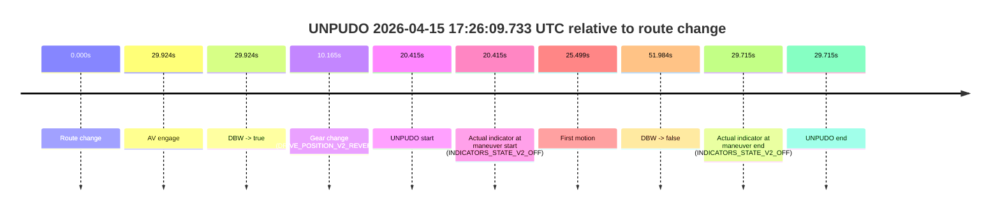
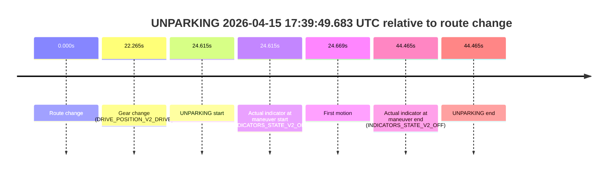

# Run Report: fme10010/2026-04-15--17-07-02--gen2-av-8dac1492-2e4d-4857-9eec-f8acb4e8ea30

| Field | Value |
|---|---|
| Run ID | `fme10010/2026-04-15--17-07-02--gen2-av-8dac1492-2e4d-4857-9eec-f8acb4e8ea30` |
| Date | `2026-04-15` |
| Model(s) | `satisfied-amber-moose` |
| Author | `guy.geva` |
| Event count | `2` |

## unpudo 2026-04-15 17:26:09.733 UTC

| Field | Value |
|---|---|
| Model | `satisfied-amber-moose` |
| Author | `guy.geva` |
| Run ID | `fme10010/2026-04-15--17-07-02--gen2-av-8dac1492-2e4d-4857-9eec-f8acb4e8ea30` |
| Date | `2026-04-15` |
| Time (UTC) | `17:26:09.733` |
| Event type | `unpudo` |
| Disengagement type | `failed_to_unpudo` |
| Route change | `found` |
| Console | [run](https://console.sso.wayve.ai/run/fme10010/2026-04-15--17-07-02--gen2-av-8dac1492-2e4d-4857-9eec-f8acb4e8ea30?id=&time-unixus=1776273969733319) |
| Foxglove | [segment](https://app.foxglove.dev/wayve-on-prem/p/prj_0dX18KZdVHg1fmmI/view?ds=foxglove-stream&ds.deviceName=fme10010&ds.start=2026-04-15T17%3A25%3A39.318301Z&ds.end=2026-04-15T17%3A26%3A51.302649Z&layoutId=lay_0e7VD4WIKDQGU73Y&time=2026-04-15T17%3A26%3A09.733319Z) |

### Event card: fail

- Fail: AV owns part of the segment, but the event still resolves as a model-performance failure under the AV-only scoring rule.

| Event | Time (UTC) | Delta from route change |
|---|---:|---:|
| Route change | 2026-04-15 17:25:49.318 | `0.000s` |
| AV engage | 2026-04-15 17:26:19.242 | `29.924s` |
| DBW -> true | 2026-04-15 17:26:19.242 | `29.924s` |
| Gear change (DRIVE_POSITION_V2_REVERSE) | 2026-04-15 17:25:59.483 | `10.165s` |
| UNPUDO start | 2026-04-15 17:26:09.733 | `20.415s` |
| Actual indicator at maneuver start (INDICATORS_STATE_V2_OFF) | 2026-04-15 17:26:09.733 | `20.415s` |
| First motion | 2026-04-15 17:26:14.817 | `25.499s` |
| DBW -> false | 2026-04-15 17:26:41.302 | `51.984s` |
| Actual indicator at maneuver end (INDICATORS_STATE_V2_OFF) | 2026-04-15 17:26:19.033 | `29.715s` |
| UNPUDO end | 2026-04-15 17:26:19.033 | `29.715s` |

| Metric | Value |
|---|---|
| Outcome | `fail` |
| Effective failure type | `failed_to_unpudo` |
| Route change status | `found` |
| DBW at event start | `false` |
| DBW at event end | `false` |
| Predicted gear at AV start | `DRIVE_POSITION_V2_DRIVE` |
| Actual gear at AV start | `DRIVE_POSITION_V2_DRIVE` |
| Predicted gear at event start | `DRIVE_POSITION_V2_REVERSE` |
| Actual gear at event start | `DRIVE_POSITION_V2_REVERSE` |
| Planned indicator direction | `INDICATORS_STATE_V2_OFF` |
| Controller indicator direction | `INDICATORS_STATE_V2_OFF` |
| Actual indicator direction | `INDICATORS_STATE_V2_OFF` |
| Actual indicator at maneuver end | `INDICATORS_STATE_V2_OFF` |
| Driver accel help in AV | `false` |
| Driver accel help timestamp | `n/a` |
| Max accel pedal pct in AV | `0.0%` |
| Max brake pedal pct in AV | `0.0%` |
| Max speed mps in AV | `0.000` |
| Route -> AV | `29.924s` |
| AV -> event start | `-9.509s` |
| AV -> first motion | `-4.425s` |
| AV duration before disengagement | `22.060s` |
| Trajectory waypoint count | `36` |
| Driving-plan step count | `11` |

The scored portion starts from the AV-owned window, not from the pre-AV setup. Route-change search in the stopped pre-event segment was `found`, with the baseline therefore set to route change. At the event anchor the model predicts `DRIVE_POSITION_V2_REVERSE` and the actual gear is `DRIVE_POSITION_V2_REVERSE`. The effective model outcome is `fail` because `failed_to_unpudo`.

### Resolution

| Field | Value |
|---|---|
| Final outcome | `fail` |
| Do we agree with this label? | `yes` |
| Source disengagement type | `failed_to_unpudo` |
| Resolved effective failure type | `failed_to_unpudo` |
| Confidence | `high` |

## unparking 2026-04-15 17:39:49.683 UTC

| Field | Value |
|---|---|
| Model | `satisfied-amber-moose` |
| Author | `guy.geva` |
| Run ID | `fme10010/2026-04-15--17-07-02--gen2-av-8dac1492-2e4d-4857-9eec-f8acb4e8ea30` |
| Date | `2026-04-15` |
| Time (UTC) | `17:39:49.683` |
| Event type | `unparking` |
| Disengagement type | `none observed` |
| Route change | `found` |
| Console | [run](https://console.sso.wayve.ai/run/fme10010/2026-04-15--17-07-02--gen2-av-8dac1492-2e4d-4857-9eec-f8acb4e8ea30?id=&time-unixus=1776274789683306) |
| Foxglove | [segment](https://app.foxglove.dev/wayve-on-prem/p/prj_0dX18KZdVHg1fmmI/view?ds=foxglove-stream&ds.deviceName=fme10010&ds.start=2026-04-15T17%3A39%3A15.068255Z&ds.end=2026-04-15T17%3A40%3A19.533318Z&layoutId=lay_0e7VD4WIKDQGU73Y&time=2026-04-15T17%3A39%3A49.683306Z) |

### Event card: fail

- Fail: the credited unparking does not stay AV-owned. The event window starts with DBW false, and the maneuver outcome lands outside a clean AV-owned segment.

| Event | Time (UTC) | Delta from route change |
|---|---:|---:|
| Route change | 2026-04-15 17:39:25.068 | `0.000s` |
| Gear change (DRIVE_POSITION_V2_DRIVE) | 2026-04-15 17:39:47.333 | `22.265s` |
| UNPARKING start | 2026-04-15 17:39:49.683 | `24.615s` |
| Actual indicator at maneuver start (INDICATORS_STATE_V2_OFF) | 2026-04-15 17:39:49.683 | `24.615s` |
| First motion | 2026-04-15 17:39:49.737 | `24.669s` |
| Actual indicator at maneuver end (INDICATORS_STATE_V2_OFF) | 2026-04-15 17:40:09.533 | `44.465s` |
| UNPARKING end | 2026-04-15 17:40:09.533 | `44.465s` |

| Metric | Value |
|---|---|
| Outcome | `fail` |
| Effective failure type | `not_av_owned` |
| Route change status | `found` |
| DBW at event start | `false` |
| DBW at event end | `false` |
| Predicted gear at AV start | `n/a` |
| Actual gear at AV start | `n/a` |
| Predicted gear at event start | `DRIVE_POSITION_V2_DRIVE` |
| Actual gear at event start | `DRIVE_POSITION_V2_DRIVE` |
| Planned indicator direction | `INDICATORS_STATE_V2_OFF` |
| Controller indicator direction | `INDICATORS_STATE_V2_OFF` |
| Actual indicator direction | `INDICATORS_STATE_V2_OFF` |
| Actual indicator at maneuver end | `INDICATORS_STATE_V2_OFF` |
| Driver accel help in AV | `false` |
| Driver accel help timestamp | `n/a` |
| Max accel pedal pct in AV | `0.0%` |
| Max brake pedal pct in AV | `0.0%` |
| Max speed mps in AV | `0.000` |
| Route -> AV | `n/a` |
| AV -> event start | `n/a` |
| AV -> first motion | `n/a` |
| AV duration before disengagement | `n/a` |
| Trajectory waypoint count | `37` |
| Driving-plan step count | `11` |

The scored portion starts from the AV-owned window, not from the pre-AV setup. Route-change search in the stopped pre-event segment was `found`, with the baseline therefore set to route change. At the event anchor the model predicts `DRIVE_POSITION_V2_DRIVE` and the actual gear is `DRIVE_POSITION_V2_DRIVE`. The effective model outcome is `fail` because `not_av_owned`.

### Resolution

| Field | Value |
|---|---|
| Final outcome | `fail` |
| Do we agree with this label? | `yes` |
| Source disengagement type | `none observed` |
| Resolved effective failure type | `not_av_owned` |
| Confidence | `high` |
