# Run Report: fme10010/2026-04-15--19-10-20--gen2-av-cd9496c5-ad6e-4dc5-a227-8d9a06b3e089

| Field | Value |
|---|---|
| Run ID | `fme10010/2026-04-15--19-10-20--gen2-av-cd9496c5-ad6e-4dc5-a227-8d9a06b3e089` |
| Date | `2026-04-15` |
| Model(s) | `armadillo-amethyst-squeaky` |
| Author | `guy.geva` |
| Event count | `12` |

## unpudo 2026-04-15 19:18:58.683 UTC

| Field | Value |
|---|---|
| Model | `armadillo-amethyst-squeaky` |
| Author | `guy.geva` |
| Run ID | `fme10010/2026-04-15--19-10-20--gen2-av-cd9496c5-ad6e-4dc5-a227-8d9a06b3e089` |
| Date | `2026-04-15` |
| Time (UTC) | `19:18:58.683` |
| Event type | `unpudo` |
| Disengagement type | `failed_to_unpudo` |
| Route change | `found` |
| Console | [run](https://console.sso.wayve.ai/run/fme10010/2026-04-15--19-10-20--gen2-av-cd9496c5-ad6e-4dc5-a227-8d9a06b3e089?id=&time-unixus=1776280738683305) |
| Foxglove | [segment](https://app.foxglove.dev/wayve-on-prem/p/prj_0dX18KZdVHg1fmmI/view?ds=foxglove-stream&ds.deviceName=fme10010&ds.start=2026-04-15T19%3A18%3A40.083304Z&ds.end=2026-04-15T19%3A19%3A13.783316Z&layoutId=lay_0e7VD4WIKDQGU73Y&time=2026-04-15T19%3A18%3A58.683305Z) |

### Event card: fail

- Fail: AV owns part of the segment, but the event still resolves as a model-performance failure under the AV-only scoring rule.

| Event | Time (UTC) | Delta from route change |
|---|---:|---:|
| Gear change (DRIVE_POSITION_V2_DRIVE) | 2026-04-15 19:18:50.083 | `-0.085s` |
| Route change | 2026-04-15 19:18:50.168 | `0.000s` |
| AV engage | 2026-04-15 19:18:50.170 | `0.002s` |
| DBW -> true | 2026-04-15 19:18:50.170 | `0.002s` |
| DBW -> false | 2026-04-15 19:18:58.100 | `7.932s` |
| UNPUDO start | 2026-04-15 19:18:58.683 | `8.515s` |
| DBW at event start (false) | 2026-04-15 19:18:58.683 | `8.515s` |
| Actual indicator -> left on | 2026-04-15 19:19:00.957 | `10.789s` |
| DBW at event end (true) | 2026-04-15 19:19:03.783 | `13.615s` |
| UNPUDO end | 2026-04-15 19:19:03.783 | `13.615s` |
| Actual indicator -> off | 2026-04-15 19:19:09.117 | `18.949s` |
| Actual indicator -> right on | 2026-04-15 19:19:21.037 | `30.869s` |
| Actual indicator -> off | 2026-04-15 19:19:22.937 | `32.769s` |

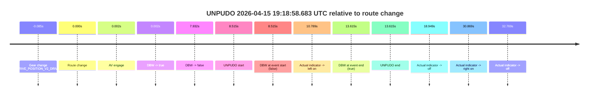

| Metric | Value |
|---|---|
| Outcome | `fail` |
| Effective failure type | `failed_to_unpudo` |
| Route change status | `found` |
| DBW at event start | `false` |
| DBW at event end | `true` |
| Predicted gear at AV start | `DRIVE_POSITION_V2_REVERSE` |
| Actual gear at AV start | `DRIVE_POSITION_V2_REVERSE` |
| Predicted gear at event start | `DRIVE_POSITION_V2_DRIVE` |
| Actual gear at event start | `DRIVE_POSITION_V2_DRIVE` |
| Planned indicator direction | `INDICATORS_STATE_V2_OFF` |
| Controller indicator direction | `INDICATORS_STATE_V2_OFF` |
| Actual indicator direction | `INDICATORS_STATE_V2_OFF` |
| Actual indicator at maneuver end | `INDICATORS_STATE_V2_LEFT_ON` |
| Driver accel help in AV | `false` |
| Driver accel help timestamp | `n/a` |
| Max accel pedal pct in AV | `0.0%` |
| Max brake pedal pct in AV | `8.0%` |
| Max speed mps in AV | `0.000` |
| Success timing baseline | `route change` |
| Route -> AV | `0.002s` |
| AV -> event start | `8.513s` |
| AV -> first motion | `n/a` |
| Success baseline -> event start | `8.515s` |
| Success baseline -> first motion | `n/a` |
| AV duration before disengagement | `7.930s` |
| Trajectory waypoint count | `37` |
| Driving-plan step count | `11` |

The scored portion starts from the AV-owned window, not from the pre-AV setup. Route-change search in the stopped pre-event segment was `found`, with the baseline therefore set to route change. At the event anchor the model predicts `DRIVE_POSITION_V2_DRIVE` and the actual gear is `DRIVE_POSITION_V2_DRIVE`. The effective model outcome is `fail` because `failed_to_unpudo.`

### Resolution

| Field | Value |
|---|---|
| Final outcome | `fail` |
| Do we agree with this label? | `yes` |
| Source disengagement type | `failed_to_unpudo` |
| Resolved effective failure type | `failed_to_unpudo` |
| Confidence | `high` |

## unpudo 2026-04-15 19:21:16.533 UTC

| Field | Value |
|---|---|
| Model | `armadillo-amethyst-squeaky` |
| Author | `guy.geva` |
| Run ID | `fme10010/2026-04-15--19-10-20--gen2-av-cd9496c5-ad6e-4dc5-a227-8d9a06b3e089` |
| Date | `2026-04-15` |
| Time (UTC) | `19:21:16.533` |
| Event type | `unpudo` |
| Disengagement type | `failed_to_unpudo` |
| Route change | `found` |
| Console | [run](https://console.sso.wayve.ai/run/fme10010/2026-04-15--19-10-20--gen2-av-cd9496c5-ad6e-4dc5-a227-8d9a06b3e089?id=&time-unixus=1776280876533293) |
| Foxglove | [segment](https://app.foxglove.dev/wayve-on-prem/p/prj_0dX18KZdVHg1fmmI/view?ds=foxglove-stream&ds.deviceName=fme10010&ds.start=2026-04-15T19%3A20%3A59.918269Z&ds.end=2026-04-15T19%3A21%3A30.833294Z&layoutId=lay_0e7VD4WIKDQGU73Y&time=2026-04-15T19%3A21%3A16.533293Z) |

### Event card: fail

- Fail: AV owns part of the segment, but the event still resolves as a model-performance failure under the AV-only scoring rule.

| Event | Time (UTC) | Delta from route change |
|---|---:|---:|
| Route change | 2026-04-15 19:21:09.918 | `0.000s` |
| AV engage | 2026-04-15 19:21:11.200 | `1.282s` |
| DBW -> true | 2026-04-15 19:21:11.200 | `1.282s` |
| Gear change (DRIVE_POSITION_V2_DRIVE) | 2026-04-15 19:21:11.683 | `1.765s` |
| Actual indicator -> left on | 2026-04-15 19:21:15.657 | `5.739s` |
| DBW -> false | 2026-04-15 19:21:15.740 | `5.823s` |
| UNPUDO start | 2026-04-15 19:21:16.533 | `6.615s` |
| DBW at event start (false) | 2026-04-15 19:21:16.533 | `6.615s` |
| Actual indicator -> off | 2026-04-15 19:21:18.257 | `8.339s` |
| DBW at event end (false) | 2026-04-15 19:21:20.833 | `10.915s` |
| UNPUDO end | 2026-04-15 19:21:20.833 | `10.915s` |
| Actual indicator -> right on | 2026-04-15 19:21:22.297 | `12.380s` |
| Actual indicator -> off | 2026-04-15 19:21:36.057 | `26.139s` |

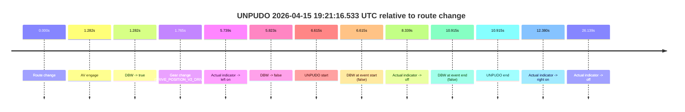

| Metric | Value |
|---|---|
| Outcome | `fail` |
| Effective failure type | `failed_to_unpudo` |
| Route change status | `found` |
| DBW at event start | `false` |
| DBW at event end | `false` |
| Predicted gear at AV start | `DRIVE_POSITION_V2_DRIVE` |
| Actual gear at AV start | `DRIVE_POSITION_V2_PARK` |
| Predicted gear at event start | `DRIVE_POSITION_V2_DRIVE` |
| Actual gear at event start | `DRIVE_POSITION_V2_DRIVE` |
| Planned indicator direction | `INDICATORS_STATE_V2_LEFT_ON` |
| Controller indicator direction | `INDICATORS_STATE_V2_LEFT_ON` |
| Actual indicator direction | `INDICATORS_STATE_V2_LEFT_ON` |
| Actual indicator at maneuver end | `INDICATORS_STATE_V2_OFF` |
| Driver accel help in AV | `false` |
| Driver accel help timestamp | `n/a` |
| Max accel pedal pct in AV | `0.0%` |
| Max brake pedal pct in AV | `8.0%` |
| Max speed mps in AV | `0.000` |
| Success timing baseline | `route change` |
| Route -> AV | `1.282s` |
| AV -> event start | `5.333s` |
| AV -> first motion | `n/a` |
| Success baseline -> event start | `6.615s` |
| Success baseline -> first motion | `n/a` |
| AV duration before disengagement | `4.540s` |
| Trajectory waypoint count | `36` |
| Driving-plan step count | `11` |

The scored portion starts from the AV-owned window, not from the pre-AV setup. Route-change search in the stopped pre-event segment was `found`, with the baseline therefore set to route change. At the event anchor the model predicts `DRIVE_POSITION_V2_DRIVE` and the actual gear is `DRIVE_POSITION_V2_DRIVE`. The effective model outcome is `fail` because `failed_to_unpudo.`

### Resolution

| Field | Value |
|---|---|
| Final outcome | `fail` |
| Do we agree with this label? | `yes` |
| Source disengagement type | `failed_to_unpudo` |
| Resolved effective failure type | `failed_to_unpudo` |
| Confidence | `high` |

## unpudo 2026-04-15 19:22:06.433 UTC

| Field | Value |
|---|---|
| Model | `armadillo-amethyst-squeaky` |
| Author | `guy.geva` |
| Run ID | `fme10010/2026-04-15--19-10-20--gen2-av-cd9496c5-ad6e-4dc5-a227-8d9a06b3e089` |
| Date | `2026-04-15` |
| Time (UTC) | `19:22:06.433` |
| Event type | `unpudo` |
| Disengagement type | `failed_to_unpudo` |
| Route change | `found` |
| Console | [run](https://console.sso.wayve.ai/run/fme10010/2026-04-15--19-10-20--gen2-av-cd9496c5-ad6e-4dc5-a227-8d9a06b3e089?id=&time-unixus=1776280926433308) |
| Foxglove | [segment](https://app.foxglove.dev/wayve-on-prem/p/prj_0dX18KZdVHg1fmmI/view?ds=foxglove-stream&ds.deviceName=fme10010&ds.start=2026-04-15T19%3A20%3A59.918269Z&ds.end=2026-04-15T19%3A22%3A19.683323Z&layoutId=lay_0e7VD4WIKDQGU73Y&time=2026-04-15T19%3A22%3A06.433308Z) |

### Event card: fail

- Fail: AV owns part of the segment, but the event still resolves as a model-performance failure under the AV-only scoring rule.

| Event | Time (UTC) | Delta from route change |
|---|---:|---:|
| Route change | 2026-04-15 19:21:09.918 | `0.000s` |
| Actual indicator -> left on | 2026-04-15 19:21:15.657 | `5.739s` |
| First motion | 2026-04-15 19:21:16.617 | `6.699s` |
| Actual indicator -> off | 2026-04-15 19:21:18.257 | `8.339s` |
| Actual indicator -> right on | 2026-04-15 19:21:22.297 | `12.380s` |
| Actual indicator -> off | 2026-04-15 19:21:36.057 | `26.139s` |
| AV engage | 2026-04-15 19:22:00.840 | `50.922s` |
| DBW -> true | 2026-04-15 19:22:00.840 | `50.922s` |
| Gear change (DRIVE_POSITION_V2_DRIVE) | 2026-04-15 19:22:01.283 | `51.365s` |
| DBW -> false | 2026-04-15 19:22:05.780 | `55.863s` |
| UNPUDO start | 2026-04-15 19:22:06.433 | `56.515s` |
| DBW at event start (false) | 2026-04-15 19:22:06.433 | `56.515s` |
| Actual indicator -> left on | 2026-04-15 19:22:06.697 | `56.780s` |
| Actual indicator -> off | 2026-04-15 19:22:08.997 | `59.080s` |
| DBW at event end (false) | 2026-04-15 19:22:09.683 | `59.765s` |
| UNPUDO end | 2026-04-15 19:22:09.683 | `59.765s` |
| Actual indicator -> right on | 2026-04-15 19:22:11.197 | `61.279s` |
| Actual indicator -> off | 2026-04-15 19:22:13.097 | `63.180s` |
| Actual indicator -> right on | 2026-04-15 19:22:16.357 | `66.440s` |
| Actual indicator -> off | 2026-04-15 19:22:17.317 | `67.399s` |
| Actual indicator -> right on | 2026-04-15 19:22:19.817 | `69.899s` |

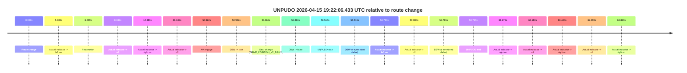

| Metric | Value |
|---|---|
| Outcome | `fail` |
| Effective failure type | `failed_to_unpudo` |
| Route change status | `found` |
| DBW at event start | `false` |
| DBW at event end | `false` |
| Predicted gear at AV start | `DRIVE_POSITION_V2_DRIVE` |
| Actual gear at AV start | `DRIVE_POSITION_V2_PARK` |
| Predicted gear at event start | `DRIVE_POSITION_V2_DRIVE` |
| Actual gear at event start | `DRIVE_POSITION_V2_DRIVE` |
| Planned indicator direction | `INDICATORS_STATE_V2_LEFT_ON` |
| Controller indicator direction | `INDICATORS_STATE_V2_LEFT_ON` |
| Actual indicator direction | `INDICATORS_STATE_V2_OFF` |
| Actual indicator at maneuver end | `INDICATORS_STATE_V2_OFF` |
| Driver accel help in AV | `false` |
| Driver accel help timestamp | `n/a` |
| Max accel pedal pct in AV | `0.0%` |
| Max brake pedal pct in AV | `8.0%` |
| Max speed mps in AV | `0.000` |
| Success timing baseline | `route change` |
| Route -> AV | `50.922s` |
| AV -> event start | `5.593s` |
| AV -> first motion | `-44.223s` |
| Success baseline -> event start | `56.515s` |
| Success baseline -> first motion | `6.699s` |
| AV duration before disengagement | `4.940s` |
| Trajectory waypoint count | `36` |
| Driving-plan step count | `11` |

The scored portion starts from the AV-owned window, not from the pre-AV setup. Route-change search in the stopped pre-event segment was `found`, with the baseline therefore set to route change. At the event anchor the model predicts `DRIVE_POSITION_V2_DRIVE` and the actual gear is `DRIVE_POSITION_V2_DRIVE`. The effective model outcome is `fail` because `failed_to_unpudo.`

### Resolution

| Field | Value |
|---|---|
| Final outcome | `fail` |
| Do we agree with this label? | `yes` |
| Source disengagement type | `failed_to_unpudo` |
| Resolved effective failure type | `failed_to_unpudo` |
| Confidence | `high` |

## unpudo 2026-04-15 19:42:39.433 UTC

| Field | Value |
|---|---|
| Model | `armadillo-amethyst-squeaky` |
| Author | `guy.geva` |
| Run ID | `fme10010/2026-04-15--19-10-20--gen2-av-cd9496c5-ad6e-4dc5-a227-8d9a06b3e089` |
| Date | `2026-04-15` |
| Time (UTC) | `19:42:39.433` |
| Event type | `unpudo` |
| Disengagement type | `failed_to_unpudo` |
| Route change | `found` |
| Console | [run](https://console.sso.wayve.ai/run/fme10010/2026-04-15--19-10-20--gen2-av-cd9496c5-ad6e-4dc5-a227-8d9a06b3e089?id=&time-unixus=1776282159433309) |
| Foxglove | [segment](https://app.foxglove.dev/wayve-on-prem/p/prj_0dX18KZdVHg1fmmI/view?ds=foxglove-stream&ds.deviceName=fme10010&ds.start=2026-04-15T19%3A40%3A33.168293Z&ds.end=2026-04-15T19%3A43%3A15.133293Z&layoutId=lay_0e7VD4WIKDQGU73Y&time=2026-04-15T19%3A42%3A39.433309Z) |

### Event card: fail

- Fail: AV owns part of the segment, but the event still resolves as a model-performance failure under the AV-only scoring rule.

| Event | Time (UTC) | Delta from route change |
|---|---:|---:|
| Route change | 2026-04-15 19:40:43.168 | `0.000s` |
| First motion | 2026-04-15 19:40:46.537 | `3.369s` |
| Actual indicator -> left on | 2026-04-15 19:40:46.777 | `3.609s` |
| Actual indicator -> off | 2026-04-15 19:40:55.197 | `12.029s` |
| Actual indicator -> right on | 2026-04-15 19:41:25.557 | `42.389s` |
| Actual indicator -> off | 2026-04-15 19:41:31.497 | `48.329s` |
| AV engage | 2026-04-15 19:41:34.160 | `50.992s` |
| DBW -> true | 2026-04-15 19:41:34.160 | `50.992s` |
| Gear change (DRIVE_POSITION_V2_DRIVE) | 2026-04-15 19:42:35.583 | `112.415s` |
| UNPUDO start | 2026-04-15 19:42:39.433 | `116.265s` |
| DBW at event start (true) | 2026-04-15 19:42:39.433 | `116.265s` |
| DBW -> false | 2026-04-15 19:42:43.040 | `119.872s` |
| DBW at event end (false) | 2026-04-15 19:43:05.133 | `141.965s` |
| UNPUDO end | 2026-04-15 19:43:05.133 | `141.965s` |
| Actual indicator -> right on | 2026-04-15 19:43:18.497 | `155.329s` |
| Actual indicator -> off | 2026-04-15 19:43:22.937 | `159.769s` |

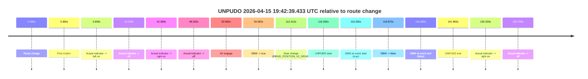

| Metric | Value |
|---|---|
| Outcome | `fail` |
| Effective failure type | `failed_to_unpudo` |
| Route change status | `found` |
| DBW at event start | `true` |
| DBW at event end | `false` |
| Predicted gear at AV start | `DRIVE_POSITION_V2_DRIVE` |
| Actual gear at AV start | `DRIVE_POSITION_V2_DRIVE` |
| Predicted gear at event start | `DRIVE_POSITION_V2_DRIVE` |
| Actual gear at event start | `DRIVE_POSITION_V2_DRIVE` |
| Planned indicator direction | `INDICATORS_STATE_V2_OFF` |
| Controller indicator direction | `INDICATORS_STATE_V2_OFF` |
| Actual indicator direction | `INDICATORS_STATE_V2_OFF` |
| Actual indicator at maneuver end | `INDICATORS_STATE_V2_OFF` |
| Driver accel help in AV | `false` |
| Driver accel help timestamp | `n/a` |
| Max accel pedal pct in AV | `0.0%` |
| Max brake pedal pct in AV | `20.8%` |
| Max speed mps in AV | `11.447` |
| Success timing baseline | `route change` |
| Route -> AV | `50.992s` |
| AV -> event start | `65.273s` |
| AV -> first motion | `-47.623s` |
| Success baseline -> event start | `116.265s` |
| Success baseline -> first motion | `3.369s` |
| AV duration before disengagement | `68.880s` |
| Trajectory waypoint count | `36` |
| Driving-plan step count | `11` |

The scored portion starts from the AV-owned window, not from the pre-AV setup. Route-change search in the stopped pre-event segment was `found`, with the baseline therefore set to route change. At the event anchor the model predicts `DRIVE_POSITION_V2_DRIVE` and the actual gear is `DRIVE_POSITION_V2_DRIVE`. The effective model outcome is `fail` because `failed_to_unpudo.`

### Resolution

| Field | Value |
|---|---|
| Final outcome | `fail` |
| Do we agree with this label? | `yes` |
| Source disengagement type | `failed_to_unpudo` |
| Resolved effective failure type | `failed_to_unpudo` |
| Confidence | `high` |

## unpudo 2026-04-15 19:43:55.983 UTC

| Field | Value |
|---|---|
| Model | `armadillo-amethyst-squeaky` |
| Author | `guy.geva` |
| Run ID | `fme10010/2026-04-15--19-10-20--gen2-av-cd9496c5-ad6e-4dc5-a227-8d9a06b3e089` |
| Date | `2026-04-15` |
| Time (UTC) | `19:43:55.983` |
| Event type | `unpudo` |
| Disengagement type | `none observed` |
| Route change | `found` |
| Console | [run](https://console.sso.wayve.ai/run/fme10010/2026-04-15--19-10-20--gen2-av-cd9496c5-ad6e-4dc5-a227-8d9a06b3e089?id=&time-unixus=1776282235983308) |
| Foxglove | [segment](https://app.foxglove.dev/wayve-on-prem/p/prj_0dX18KZdVHg1fmmI/view?ds=foxglove-stream&ds.deviceName=fme10010&ds.start=2026-04-15T19%3A42%3A28.268905Z&ds.end=2026-04-15T19%3A44%3A49.020505Z&layoutId=lay_0e7VD4WIKDQGU73Y&time=2026-04-15T19%3A43%3A55.983308Z) |

### Event card: pass

- Pass: AV owns the credited unpudo from route change through the official unpudo window, the gear state is aligned at the anchor, and the vehicle moves without driver accelerator help in AV.

| Event | Time (UTC) | Delta from route change |
|---|---:|---:|
| Route change | 2026-04-15 19:42:38.268 | `0.000s` |
| First motion | 2026-04-15 19:42:39.457 | `1.188s` |
| Actual indicator -> right on | 2026-04-15 19:43:18.497 | `40.228s` |
| Actual indicator -> off | 2026-04-15 19:43:22.937 | `44.668s` |
| Actual indicator -> right on | 2026-04-15 19:43:29.317 | `51.049s` |
| Actual indicator -> off | 2026-04-15 19:43:31.477 | `53.208s` |
| AV engage | 2026-04-15 19:43:51.820 | `73.552s` |
| DBW -> true | 2026-04-15 19:43:51.820 | `73.552s` |
| Gear change (DRIVE_POSITION_V2_DRIVE) | 2026-04-15 19:43:52.283 | `74.014s` |
| UNPUDO start | 2026-04-15 19:43:55.983 | `77.714s` |
| DBW at event start (true) | 2026-04-15 19:43:55.983 | `77.714s` |
| DBW at event end (true) | 2026-04-15 19:43:59.433 | `81.164s` |
| UNPUDO end | 2026-04-15 19:43:59.433 | `81.164s` |
| DBW -> false | 2026-04-15 19:44:39.020 | `120.752s` |

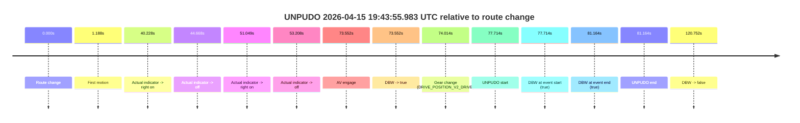

| Metric | Value |
|---|---|
| Outcome | `pass` |
| Effective failure type | `none` |
| Route change status | `found` |
| DBW at event start | `true` |
| DBW at event end | `true` |
| Predicted gear at AV start | `DRIVE_POSITION_V2_DRIVE` |
| Actual gear at AV start | `DRIVE_POSITION_V2_PARK` |
| Predicted gear at event start | `DRIVE_POSITION_V2_DRIVE` |
| Actual gear at event start | `DRIVE_POSITION_V2_DRIVE` |
| Planned indicator direction | `INDICATORS_STATE_V2_RIGHT_ON` |
| Controller indicator direction | `INDICATORS_STATE_V2_RIGHT_ON` |
| Actual indicator direction | `INDICATORS_STATE_V2_OFF` |
| Actual indicator at maneuver end | `INDICATORS_STATE_V2_OFF` |
| Driver accel help in AV | `false` |
| Driver accel help timestamp | `n/a` |
| Max accel pedal pct in AV | `0.0%` |
| Max brake pedal pct in AV | `8.0%` |
| Max speed mps in AV | `5.303` |
| Success timing baseline | `route change` |
| Route -> AV | `73.552s` |
| AV -> event start | `4.163s` |
| AV -> first motion | `-72.364s` |
| Success baseline -> event start | `77.714s` |
| Success baseline -> first motion | `1.188s` |
| AV duration before disengagement | `47.200s` |
| Trajectory waypoint count | `37` |
| Driving-plan step count | `11` |

The scored portion starts from the AV-owned window, not from the pre-AV setup. Route-change search in the stopped pre-event segment was `found`, with the baseline therefore set to route change. At the event anchor the model predicts `DRIVE_POSITION_V2_DRIVE` and the actual gear is `DRIVE_POSITION_V2_DRIVE`. The effective model outcome is `pass` because `the credited unpudo stays AV-owned through the official unpudo window.`

### Resolution

| Field | Value |
|---|---|
| Final outcome | `pass` |
| Do we agree with this label? | `yes` |
| Source disengagement type | `none observed` |
| Resolved effective failure type | `none` |
| Confidence | `high` |

## unpudo 2026-04-15 19:45:54.283 UTC

| Field | Value |
|---|---|
| Model | `armadillo-amethyst-squeaky` |
| Author | `guy.geva` |
| Run ID | `fme10010/2026-04-15--19-10-20--gen2-av-cd9496c5-ad6e-4dc5-a227-8d9a06b3e089` |
| Date | `2026-04-15` |
| Time (UTC) | `19:45:54.283` |
| Event type | `unpudo` |
| Disengagement type | `failed_to_unpudo` |
| Route change | `found` |
| Console | [run](https://console.sso.wayve.ai/run/fme10010/2026-04-15--19-10-20--gen2-av-cd9496c5-ad6e-4dc5-a227-8d9a06b3e089?id=&time-unixus=1776282354283314) |
| Foxglove | [segment](https://app.foxglove.dev/wayve-on-prem/p/prj_0dX18KZdVHg1fmmI/view?ds=foxglove-stream&ds.deviceName=fme10010&ds.start=2026-04-15T19%3A45%3A32.968326Z&ds.end=2026-04-15T19%3A46%3A15.983309Z&layoutId=lay_0e7VD4WIKDQGU73Y&time=2026-04-15T19%3A45%3A54.283314Z) |

### Event card: fail

- Fail: AV owns part of the segment, but the event still resolves as a model-performance failure under the AV-only scoring rule.

| Event | Time (UTC) | Delta from route change |
|---|---:|---:|
| Route change | 2026-04-15 19:45:42.968 | `0.000s` |
| AV engage | 2026-04-15 19:45:43.460 | `0.492s` |
| DBW -> true | 2026-04-15 19:45:43.460 | `0.492s` |
| Gear change (DRIVE_POSITION_V2_REVERSE) | 2026-04-15 19:45:43.933 | `0.965s` |
| DBW -> false | 2026-04-15 19:45:51.480 | `8.512s` |
| Actual indicator -> right on | 2026-04-15 19:45:53.137 | `10.169s` |
| UNPUDO start | 2026-04-15 19:45:54.283 | `11.315s` |
| DBW at event start (false) | 2026-04-15 19:45:54.283 | `11.315s` |
| Actual indicator -> off | 2026-04-15 19:46:05.757 | `22.789s` |
| DBW at event end (false) | 2026-04-15 19:46:05.983 | `23.015s` |
| UNPUDO end | 2026-04-15 19:46:05.983 | `23.015s` |

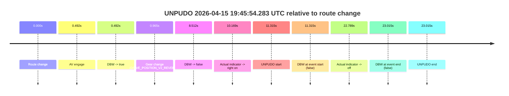

| Metric | Value |
|---|---|
| Outcome | `fail` |
| Effective failure type | `failed_to_unpudo` |
| Route change status | `found` |
| DBW at event start | `false` |
| DBW at event end | `false` |
| Predicted gear at AV start | `DRIVE_POSITION_V2_REVERSE` |
| Actual gear at AV start | `DRIVE_POSITION_V2_PARK` |
| Predicted gear at event start | `DRIVE_POSITION_V2_REVERSE` |
| Actual gear at event start | `DRIVE_POSITION_V2_REVERSE` |
| Planned indicator direction | `INDICATORS_STATE_V2_OFF` |
| Controller indicator direction | `INDICATORS_STATE_V2_OFF` |
| Actual indicator direction | `INDICATORS_STATE_V2_RIGHT_ON` |
| Actual indicator at maneuver end | `INDICATORS_STATE_V2_OFF` |
| Driver accel help in AV | `false` |
| Driver accel help timestamp | `n/a` |
| Max accel pedal pct in AV | `0.0%` |
| Max brake pedal pct in AV | `9.6%` |
| Max speed mps in AV | `0.000` |
| Success timing baseline | `route change` |
| Route -> AV | `0.492s` |
| AV -> event start | `10.823s` |
| AV -> first motion | `n/a` |
| Success baseline -> event start | `11.315s` |
| Success baseline -> first motion | `n/a` |
| AV duration before disengagement | `8.020s` |
| Trajectory waypoint count | `37` |
| Driving-plan step count | `11` |

The scored portion starts from the AV-owned window, not from the pre-AV setup. Route-change search in the stopped pre-event segment was `found`, with the baseline therefore set to route change. At the event anchor the model predicts `DRIVE_POSITION_V2_REVERSE` and the actual gear is `DRIVE_POSITION_V2_REVERSE`. The effective model outcome is `fail` because `failed_to_unpudo.`

### Resolution

| Field | Value |
|---|---|
| Final outcome | `fail` |
| Do we agree with this label? | `yes` |
| Source disengagement type | `failed_to_unpudo` |
| Resolved effective failure type | `failed_to_unpudo` |
| Confidence | `high` |

## unpudo 2026-04-15 20:04:26.283 UTC

| Field | Value |
|---|---|
| Model | `armadillo-amethyst-squeaky` |
| Author | `guy.geva` |
| Run ID | `fme10010/2026-04-15--19-10-20--gen2-av-cd9496c5-ad6e-4dc5-a227-8d9a06b3e089` |
| Date | `2026-04-15` |
| Time (UTC) | `20:04:26.283` |
| Event type | `unpudo` |
| Disengagement type | `failed_to_unpudo` |
| Route change | `found` |
| Console | [run](https://console.sso.wayve.ai/run/fme10010/2026-04-15--19-10-20--gen2-av-cd9496c5-ad6e-4dc5-a227-8d9a06b3e089?id=&time-unixus=1776283466283306) |
| Foxglove | [segment](https://app.foxglove.dev/wayve-on-prem/p/prj_0dX18KZdVHg1fmmI/view?ds=foxglove-stream&ds.deviceName=fme10010&ds.start=2026-04-15T20%3A02%3A53.418332Z&ds.end=2026-04-15T20%3A04%3A39.233291Z&layoutId=lay_0e7VD4WIKDQGU73Y&time=2026-04-15T20%3A04%3A26.283306Z) |

### Event card: fail

- Fail: AV owns part of the segment, but the event still resolves as a model-performance failure under the AV-only scoring rule.

| Event | Time (UTC) | Delta from route change |
|---|---:|---:|
| Route change | 2026-04-15 20:03:03.418 | `0.000s` |
| First motion | 2026-04-15 20:03:25.117 | `21.699s` |
| Actual indicator -> right on | 2026-04-15 20:03:29.397 | `25.979s` |
| Actual indicator -> off | 2026-04-15 20:03:35.037 | `31.619s` |
| Actual indicator -> right on | 2026-04-15 20:03:35.897 | `32.479s` |
| Actual indicator -> off | 2026-04-15 20:03:41.857 | `38.439s` |
| Actual indicator -> right on | 2026-04-15 20:04:00.857 | `57.439s` |
| Actual indicator -> off | 2026-04-15 20:04:03.117 | `59.699s` |
| Actual indicator -> right on | 2026-04-15 20:04:04.057 | `60.639s` |
| Actual indicator -> off | 2026-04-15 20:04:05.477 | `62.059s` |
| AV engage | 2026-04-15 20:04:21.080 | `77.662s` |
| DBW -> true | 2026-04-15 20:04:21.080 | `77.662s` |
| Gear change (DRIVE_POSITION_V2_DRIVE) | 2026-04-15 20:04:21.633 | `78.215s` |
| DBW -> false | 2026-04-15 20:04:25.740 | `82.323s` |
| Actual indicator -> left on | 2026-04-15 20:04:26.097 | `82.679s` |
| UNPUDO start | 2026-04-15 20:04:26.283 | `82.865s` |
| DBW at event start (false) | 2026-04-15 20:04:26.283 | `82.865s` |
| Actual indicator -> off | 2026-04-15 20:04:28.937 | `85.519s` |
| DBW at event end (false) | 2026-04-15 20:04:29.233 | `85.815s` |
| UNPUDO end | 2026-04-15 20:04:29.233 | `85.815s` |

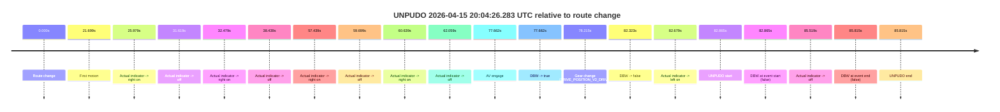

| Metric | Value |
|---|---|
| Outcome | `fail` |
| Effective failure type | `failed_to_unpudo` |
| Route change status | `found` |
| DBW at event start | `false` |
| DBW at event end | `false` |
| Predicted gear at AV start | `DRIVE_POSITION_V2_DRIVE` |
| Actual gear at AV start | `DRIVE_POSITION_V2_PARK` |
| Predicted gear at event start | `DRIVE_POSITION_V2_DRIVE` |
| Actual gear at event start | `DRIVE_POSITION_V2_DRIVE` |
| Planned indicator direction | `INDICATORS_STATE_V2_RIGHT_ON` |
| Controller indicator direction | `INDICATORS_STATE_V2_RIGHT_ON` |
| Actual indicator direction | `INDICATORS_STATE_V2_LEFT_ON` |
| Actual indicator at maneuver end | `INDICATORS_STATE_V2_OFF` |
| Driver accel help in AV | `false` |
| Driver accel help timestamp | `n/a` |
| Max accel pedal pct in AV | `0.0%` |
| Max brake pedal pct in AV | `8.0%` |
| Max speed mps in AV | `0.000` |
| Success timing baseline | `route change` |
| Route -> AV | `77.662s` |
| AV -> event start | `5.203s` |
| AV -> first motion | `-55.963s` |
| Success baseline -> event start | `82.865s` |
| Success baseline -> first motion | `21.699s` |
| AV duration before disengagement | `4.660s` |
| Trajectory waypoint count | `37` |
| Driving-plan step count | `11` |

The scored portion starts from the AV-owned window, not from the pre-AV setup. Route-change search in the stopped pre-event segment was `found`, with the baseline therefore set to route change. At the event anchor the model predicts `DRIVE_POSITION_V2_DRIVE` and the actual gear is `DRIVE_POSITION_V2_DRIVE`. The effective model outcome is `fail` because `failed_to_unpudo.`

### Resolution

| Field | Value |
|---|---|
| Final outcome | `fail` |
| Do we agree with this label? | `yes` |
| Source disengagement type | `failed_to_unpudo` |
| Resolved effective failure type | `failed_to_unpudo` |
| Confidence | `high` |

## unpudo 2026-04-15 20:05:25.583 UTC

| Field | Value |
|---|---|
| Model | `armadillo-amethyst-squeaky` |
| Author | `guy.geva` |
| Run ID | `fme10010/2026-04-15--19-10-20--gen2-av-cd9496c5-ad6e-4dc5-a227-8d9a06b3e089` |
| Date | `2026-04-15` |
| Time (UTC) | `20:05:25.583` |
| Event type | `unpudo` |
| Disengagement type | `none observed` |
| Route change | `found` |
| Console | [run](https://console.sso.wayve.ai/run/fme10010/2026-04-15--19-10-20--gen2-av-cd9496c5-ad6e-4dc5-a227-8d9a06b3e089?id=&time-unixus=1776283525583319) |
| Foxglove | [segment](https://app.foxglove.dev/wayve-on-prem/p/prj_0dX18KZdVHg1fmmI/view?ds=foxglove-stream&ds.deviceName=fme10010&ds.start=2026-04-15T20%3A04%3A07.918244Z&ds.end=2026-04-15T20%3A05%3A39.833317Z&layoutId=lay_0e7VD4WIKDQGU73Y&time=2026-04-15T20%3A05%3A25.583319Z) |

### Event card: fail

- Fail: the credited unpudo does not stay AV-owned. The event window starts with DBW false, and the maneuver outcome lands outside a clean AV-owned segment.

| Event | Time (UTC) | Delta from route change |
|---|---:|---:|
| Route change | 2026-04-15 20:04:17.918 | `0.000s` |
| Actual indicator -> left on | 2026-04-15 20:04:26.097 | `8.179s` |
| First motion | 2026-04-15 20:04:26.297 | `8.379s` |
| Actual indicator -> off | 2026-04-15 20:04:28.937 | `11.019s` |
| Actual indicator -> left on | 2026-04-15 20:04:52.257 | `34.339s` |
| Actual indicator -> off | 2026-04-15 20:04:54.157 | `36.239s` |
| AV engage | 2026-04-15 20:05:07.380 | `49.462s` |
| DBW -> true | 2026-04-15 20:05:07.380 | `49.462s` |
| DBW -> false | 2026-04-15 20:05:12.160 | `54.243s` |
| Gear change (DRIVE_POSITION_V2_DRIVE) | 2026-04-15 20:05:24.383 | `66.465s` |
| UNPUDO start | 2026-04-15 20:05:25.583 | `67.665s` |
| DBW at event start (false) | 2026-04-15 20:05:25.583 | `67.665s` |
| DBW at event end (false) | 2026-04-15 20:05:29.833 | `71.915s` |
| UNPUDO end | 2026-04-15 20:05:29.833 | `71.915s` |
| Actual indicator -> left on | 2026-04-15 20:05:30.337 | `72.419s` |

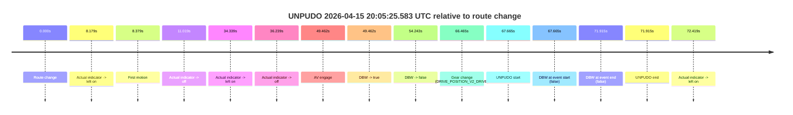

| Metric | Value |
|---|---|
| Outcome | `fail` |
| Effective failure type | `completed_outside_av` |
| Route change status | `found` |
| DBW at event start | `false` |
| DBW at event end | `false` |
| Predicted gear at AV start | `DRIVE_POSITION_V2_REVERSE` |
| Actual gear at AV start | `DRIVE_POSITION_V2_PARK` |
| Predicted gear at event start | `DRIVE_POSITION_V2_DRIVE` |
| Actual gear at event start | `DRIVE_POSITION_V2_DRIVE` |
| Planned indicator direction | `INDICATORS_STATE_V2_OFF` |
| Controller indicator direction | `INDICATORS_STATE_V2_OFF` |
| Actual indicator direction | `INDICATORS_STATE_V2_OFF` |
| Actual indicator at maneuver end | `INDICATORS_STATE_V2_OFF` |
| Driver accel help in AV | `false` |
| Driver accel help timestamp | `n/a` |
| Max accel pedal pct in AV | `0.0%` |
| Max brake pedal pct in AV | `8.0%` |
| Max speed mps in AV | `0.000` |
| Success timing baseline | `route change` |
| Route -> AV | `49.462s` |
| AV -> event start | `18.203s` |
| AV -> first motion | `-41.083s` |
| Success baseline -> event start | `67.665s` |
| Success baseline -> first motion | `8.379s` |
| AV duration before disengagement | `4.780s` |
| Trajectory waypoint count | `37` |
| Driving-plan step count | `11` |

The scored portion starts from the AV-owned window, not from the pre-AV setup. Route-change search in the stopped pre-event segment was `found`, with the baseline therefore set to route change. At the event anchor the model predicts `DRIVE_POSITION_V2_DRIVE` and the actual gear is `DRIVE_POSITION_V2_DRIVE`. The effective model outcome is `fail` because `completed_outside_av.`

### Resolution

| Field | Value |
|---|---|
| Final outcome | `fail` |
| Do we agree with this label? | `yes` |
| Source disengagement type | `none observed` |
| Resolved effective failure type | `completed_outside_av` |
| Confidence | `high` |

## unpudo 2026-04-15 20:06:38.983 UTC

| Field | Value |
|---|---|
| Model | `armadillo-amethyst-squeaky` |
| Author | `guy.geva` |
| Run ID | `fme10010/2026-04-15--19-10-20--gen2-av-cd9496c5-ad6e-4dc5-a227-8d9a06b3e089` |
| Date | `2026-04-15` |
| Time (UTC) | `20:06:38.983` |
| Event type | `unpudo` |
| Disengagement type | `none observed` |
| Route change | `found` |
| Console | [run](https://console.sso.wayve.ai/run/fme10010/2026-04-15--19-10-20--gen2-av-cd9496c5-ad6e-4dc5-a227-8d9a06b3e089?id=&time-unixus=1776283598983323) |
| Foxglove | [segment](https://app.foxglove.dev/wayve-on-prem/p/prj_0dX18KZdVHg1fmmI/view?ds=foxglove-stream&ds.deviceName=fme10010&ds.start=2026-04-15T20%3A04%3A58.718258Z&ds.end=2026-04-15T20%3A07%3A12.383312Z&layoutId=lay_0e7VD4WIKDQGU73Y&time=2026-04-15T20%3A06%3A38.983323Z) |

### Event card: accidental

- Accidental: AV ownership is present for less than `2s`, so this is treated as an accidental brush with the maneuver rather than a meaningful model attempt.

| Event | Time (UTC) | Delta from route change |
|---|---:|---:|
| Route change | 2026-04-15 20:05:08.718 | `0.000s` |
| First motion | 2026-04-15 20:05:25.617 | `16.899s` |
| Actual indicator -> left on | 2026-04-15 20:05:30.337 | `21.619s` |
| Actual indicator -> off | 2026-04-15 20:05:51.017 | `42.299s` |
| Actual indicator -> right on | 2026-04-15 20:05:54.597 | `45.880s` |
| Actual indicator -> off | 2026-04-15 20:05:55.557 | `46.839s` |
| Actual indicator -> right on | 2026-04-15 20:05:56.017 | `47.299s` |
| Actual indicator -> off | 2026-04-15 20:05:57.337 | `48.619s` |
| Actual indicator -> right on | 2026-04-15 20:06:06.237 | `57.519s` |
| Actual indicator -> off | 2026-04-15 20:06:12.897 | `64.179s` |
| AV engage | 2026-04-15 20:06:20.280 | `71.562s` |
| DBW -> true | 2026-04-15 20:06:20.280 | `71.562s` |
| DBW -> false | 2026-04-15 20:06:20.841 | `72.124s` |
| Gear change (DRIVE_POSITION_V2_DRIVE) | 2026-04-15 20:06:37.883 | `89.165s` |
| Actual indicator -> right on | 2026-04-15 20:06:38.897 | `90.179s` |
| UNPUDO start | 2026-04-15 20:06:38.983 | `90.265s` |
| DBW at event start (false) | 2026-04-15 20:06:38.983 | `90.265s` |
| Actual indicator -> off | 2026-04-15 20:06:48.817 | `100.099s` |
| DBW at event end (false) | 2026-04-15 20:07:02.383 | `113.665s` |
| UNPUDO end | 2026-04-15 20:07:02.383 | `113.665s` |
| Actual indicator -> right on | 2026-04-15 20:07:05.997 | `117.279s` |
| Actual indicator -> off | 2026-04-15 20:07:09.917 | `121.199s` |
| Actual indicator -> left on | 2026-04-15 20:07:11.237 | `122.519s` |
| Actual indicator -> off | 2026-04-15 20:07:13.797 | `125.079s` |

```mermaid
timeline
    title UNPUDO 2026-04-15 20:06:38.983 UTC relative to route change
    0.000s : Route change
    16.899s : First motion
    21.619s : Actual indicator -> left on
    42.299s : Actual indicator -> off
    45.880s : Actual indicator -> right on
    46.839s : Actual indicator -> off
    47.299s : Actual indicator -> right on
    48.619s : Actual indicator -> off
    57.519s : Actual indicator -> right on
    64.179s : Actual indicator -> off
    71.562s : AV engage
    71.562s : DBW -> true
    72.124s : DBW -> false
    89.165s : Gear change (DRIVE_POSITION_V2_DRIVE)
    90.179s : Actual indicator -> right on
    90.265s : UNPUDO start
    90.265s : DBW at event start (false)
    100.099s : Actual indicator -> off
    113.665s : DBW at event end (false)
    113.665s : UNPUDO end
    117.279s : Actual indicator -> right on
    121.199s : Actual indicator -> off
    122.519s : Actual indicator -> left on
    125.079s : Actual indicator -> off
```

| Metric | Value |
|---|---|
| Outcome | `accidental` |
| Effective failure type | `none` |
| Route change status | `found` |
| DBW at event start | `false` |
| DBW at event end | `false` |
| Predicted gear at AV start | `DRIVE_POSITION_V2_REVERSE` |
| Actual gear at AV start | `DRIVE_POSITION_V2_DRIVE` |
| Predicted gear at event start | `DRIVE_POSITION_V2_DRIVE` |
| Actual gear at event start | `DRIVE_POSITION_V2_DRIVE` |
| Planned indicator direction | `INDICATORS_STATE_V2_OFF` |
| Controller indicator direction | `INDICATORS_STATE_V2_OFF` |
| Actual indicator direction | `INDICATORS_STATE_V2_RIGHT_ON` |
| Actual indicator at maneuver end | `INDICATORS_STATE_V2_OFF` |
| Driver accel help in AV | `false` |
| Driver accel help timestamp | `n/a` |
| Max accel pedal pct in AV | `0.0%` |
| Max brake pedal pct in AV | `8.0%` |
| Max speed mps in AV | `0.067` |
| Success timing baseline | `route change` |
| Route -> AV | `71.562s` |
| AV -> event start | `18.703s` |
| AV -> first motion | `-54.663s` |
| Success baseline -> event start | `90.265s` |
| Success baseline -> first motion | `16.899s` |
| AV duration before disengagement | `0.561s` |
| Trajectory waypoint count | `37` |
| Driving-plan step count | `11` |

The scored portion starts from the AV-owned window, not from the pre-AV setup. Route-change search in the stopped pre-event segment was `found`, with the baseline therefore set to route change. At the event anchor the model predicts `DRIVE_POSITION_V2_DRIVE` and the actual gear is `DRIVE_POSITION_V2_DRIVE`. The effective model outcome is `accidental` because `the AV-owned portion is shorter than 2s.`

### Resolution

| Field | Value |
|---|---|
| Final outcome | `accidental` |
| Do we agree with this label? | `yes` |
| Source disengagement type | `none observed` |
| Resolved effective failure type | `none` |
| Confidence | `high` |

## unpudo 2026-04-15 20:14:25.383 UTC

| Field | Value |
|---|---|
| Model | `armadillo-amethyst-squeaky` |
| Author | `guy.geva` |
| Run ID | `fme10010/2026-04-15--19-10-20--gen2-av-cd9496c5-ad6e-4dc5-a227-8d9a06b3e089` |
| Date | `2026-04-15` |
| Time (UTC) | `20:14:25.383` |
| Event type | `unpudo` |
| Disengagement type | `failed_to_unpudo` |
| Route change | `found` |
| Console | [run](https://console.sso.wayve.ai/run/fme10010/2026-04-15--19-10-20--gen2-av-cd9496c5-ad6e-4dc5-a227-8d9a06b3e089?id=&time-unixus=1776284065383308) |
| Foxglove | [segment](https://app.foxglove.dev/wayve-on-prem/p/prj_0dX18KZdVHg1fmmI/view?ds=foxglove-stream&ds.deviceName=fme10010&ds.start=2026-04-15T20%3A12%3A56.318274Z&ds.end=2026-04-15T20%3A14%3A38.983304Z&layoutId=lay_0e7VD4WIKDQGU73Y&time=2026-04-15T20%3A14%3A25.383308Z) |

### Event card: fail

- Fail: AV owns part of the segment, but the event still resolves as a model-performance failure under the AV-only scoring rule.

| Event | Time (UTC) | Delta from route change |
|---|---:|---:|
| Route change | 2026-04-15 20:13:06.318 | `0.000s` |
| First motion | 2026-04-15 20:13:15.137 | `8.819s` |
| Actual indicator -> left on | 2026-04-15 20:13:31.797 | `25.479s` |
| Actual indicator -> off | 2026-04-15 20:13:49.097 | `42.779s` |
| Actual indicator -> right on | 2026-04-15 20:13:49.557 | `43.239s` |
| Actual indicator -> off | 2026-04-15 20:13:51.457 | `45.139s` |
| Actual indicator -> right on | 2026-04-15 20:14:00.957 | `54.639s` |
| Actual indicator -> off | 2026-04-15 20:14:05.837 | `59.519s` |
| AV engage | 2026-04-15 20:14:19.041 | `72.723s` |
| DBW -> true | 2026-04-15 20:14:19.041 | `72.723s` |
| Gear change (DRIVE_POSITION_V2_DRIVE) | 2026-04-15 20:14:19.533 | `73.215s` |
| DBW -> false | 2026-04-15 20:14:24.940 | `78.622s` |
| UNPUDO start | 2026-04-15 20:14:25.383 | `79.065s` |
| DBW at event start (false) | 2026-04-15 20:14:25.383 | `79.065s` |
| Actual indicator -> left on | 2026-04-15 20:14:25.837 | `79.519s` |
| DBW at event end (false) | 2026-04-15 20:14:28.983 | `82.665s` |
| UNPUDO end | 2026-04-15 20:14:28.983 | `82.665s` |
| Actual indicator -> off | 2026-04-15 20:14:33.477 | `87.159s` |

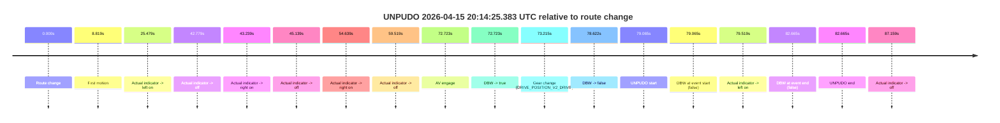

| Metric | Value |
|---|---|
| Outcome | `fail` |
| Effective failure type | `failed_to_unpudo` |
| Route change status | `found` |
| DBW at event start | `false` |
| DBW at event end | `false` |
| Predicted gear at AV start | `DRIVE_POSITION_V2_DRIVE` |
| Actual gear at AV start | `DRIVE_POSITION_V2_PARK` |
| Predicted gear at event start | `DRIVE_POSITION_V2_DRIVE` |
| Actual gear at event start | `DRIVE_POSITION_V2_DRIVE` |
| Planned indicator direction | `INDICATORS_STATE_V2_LEFT_ON` |
| Controller indicator direction | `INDICATORS_STATE_V2_LEFT_ON` |
| Actual indicator direction | `INDICATORS_STATE_V2_OFF` |
| Actual indicator at maneuver end | `INDICATORS_STATE_V2_LEFT_ON` |
| Driver accel help in AV | `false` |
| Driver accel help timestamp | `n/a` |
| Max accel pedal pct in AV | `0.0%` |
| Max brake pedal pct in AV | `8.0%` |
| Max speed mps in AV | `0.000` |
| Success timing baseline | `route change` |
| Route -> AV | `72.723s` |
| AV -> event start | `6.342s` |
| AV -> first motion | `-63.904s` |
| Success baseline -> event start | `79.065s` |
| Success baseline -> first motion | `8.819s` |
| AV duration before disengagement | `5.899s` |
| Trajectory waypoint count | `37` |
| Driving-plan step count | `11` |

The scored portion starts from the AV-owned window, not from the pre-AV setup. Route-change search in the stopped pre-event segment was `found`, with the baseline therefore set to route change. At the event anchor the model predicts `DRIVE_POSITION_V2_DRIVE` and the actual gear is `DRIVE_POSITION_V2_DRIVE`. The effective model outcome is `fail` because `failed_to_unpudo.`

### Resolution

| Field | Value |
|---|---|
| Final outcome | `fail` |
| Do we agree with this label? | `yes` |
| Source disengagement type | `failed_to_unpudo` |
| Resolved effective failure type | `failed_to_unpudo` |
| Confidence | `high` |

## unpudo 2026-04-15 20:17:15.983 UTC

| Field | Value |
|---|---|
| Model | `armadillo-amethyst-squeaky` |
| Author | `guy.geva` |
| Run ID | `fme10010/2026-04-15--19-10-20--gen2-av-cd9496c5-ad6e-4dc5-a227-8d9a06b3e089` |
| Date | `2026-04-15` |
| Time (UTC) | `20:17:15.983` |
| Event type | `unpudo` |
| Disengagement type | `failed_to_unpudo` |
| Route change | `found` |
| Console | [run](https://console.sso.wayve.ai/run/fme10010/2026-04-15--19-10-20--gen2-av-cd9496c5-ad6e-4dc5-a227-8d9a06b3e089?id=&time-unixus=1776284235983304) |
| Foxglove | [segment](https://app.foxglove.dev/wayve-on-prem/p/prj_0dX18KZdVHg1fmmI/view?ds=foxglove-stream&ds.deviceName=fme10010&ds.start=2026-04-15T20%3A16%3A56.518254Z&ds.end=2026-04-15T20%3A17%3A29.683302Z&layoutId=lay_0e7VD4WIKDQGU73Y&time=2026-04-15T20%3A17%3A15.983304Z) |

### Event card: fail

- Fail: AV owns part of the segment, but the event still resolves as a model-performance failure under the AV-only scoring rule.

| Event | Time (UTC) | Delta from route change |
|---|---:|---:|
| Route change | 2026-04-15 20:17:06.518 | `0.000s` |
| AV engage | 2026-04-15 20:17:09.740 | `3.222s` |
| DBW -> true | 2026-04-15 20:17:09.740 | `3.222s` |
| Gear change (DRIVE_POSITION_V2_DRIVE) | 2026-04-15 20:17:10.233 | `3.715s` |
| DBW -> false | 2026-04-15 20:17:15.481 | `8.963s` |
| Actual indicator -> left on | 2026-04-15 20:17:15.777 | `9.259s` |
| UNPUDO start | 2026-04-15 20:17:15.983 | `9.465s` |
| DBW at event start (false) | 2026-04-15 20:17:15.983 | `9.465s` |
| Actual indicator -> off | 2026-04-15 20:17:17.777 | `11.259s` |
| DBW at event end (false) | 2026-04-15 20:17:19.683 | `13.165s` |
| UNPUDO end | 2026-04-15 20:17:19.683 | `13.165s` |
| Actual indicator -> right on | 2026-04-15 20:17:36.877 | `30.359s` |

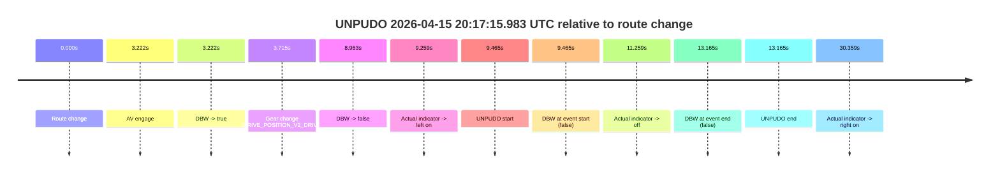

| Metric | Value |
|---|---|
| Outcome | `fail` |
| Effective failure type | `failed_to_unpudo` |
| Route change status | `found` |
| DBW at event start | `false` |
| DBW at event end | `false` |
| Predicted gear at AV start | `DRIVE_POSITION_V2_DRIVE` |
| Actual gear at AV start | `DRIVE_POSITION_V2_PARK` |
| Predicted gear at event start | `DRIVE_POSITION_V2_DRIVE` |
| Actual gear at event start | `DRIVE_POSITION_V2_DRIVE` |
| Planned indicator direction | `INDICATORS_STATE_V2_LEFT_ON` |
| Controller indicator direction | `INDICATORS_STATE_V2_LEFT_ON` |
| Actual indicator direction | `INDICATORS_STATE_V2_LEFT_ON` |
| Actual indicator at maneuver end | `INDICATORS_STATE_V2_OFF` |
| Driver accel help in AV | `false` |
| Driver accel help timestamp | `n/a` |
| Max accel pedal pct in AV | `0.0%` |
| Max brake pedal pct in AV | `8.0%` |
| Max speed mps in AV | `0.000` |
| Success timing baseline | `route change` |
| Route -> AV | `3.222s` |
| AV -> event start | `6.243s` |
| AV -> first motion | `n/a` |
| Success baseline -> event start | `9.465s` |
| Success baseline -> first motion | `n/a` |
| AV duration before disengagement | `5.741s` |
| Trajectory waypoint count | `37` |
| Driving-plan step count | `11` |

The scored portion starts from the AV-owned window, not from the pre-AV setup. Route-change search in the stopped pre-event segment was `found`, with the baseline therefore set to route change. At the event anchor the model predicts `DRIVE_POSITION_V2_DRIVE` and the actual gear is `DRIVE_POSITION_V2_DRIVE`. The effective model outcome is `fail` because `failed_to_unpudo.`

### Resolution

| Field | Value |
|---|---|
| Final outcome | `fail` |
| Do we agree with this label? | `yes` |
| Source disengagement type | `failed_to_unpudo` |
| Resolved effective failure type | `failed_to_unpudo` |
| Confidence | `high` |

## unpudo 2026-04-15 20:19:46.133 UTC

| Field | Value |
|---|---|
| Model | `armadillo-amethyst-squeaky` |
| Author | `guy.geva` |
| Run ID | `fme10010/2026-04-15--19-10-20--gen2-av-cd9496c5-ad6e-4dc5-a227-8d9a06b3e089` |
| Date | `2026-04-15` |
| Time (UTC) | `20:19:46.133` |
| Event type | `unpudo` |
| Disengagement type | `none observed` |
| Route change | `found` |
| Console | [run](https://console.sso.wayve.ai/run/fme10010/2026-04-15--19-10-20--gen2-av-cd9496c5-ad6e-4dc5-a227-8d9a06b3e089?id=&time-unixus=1776284386133314) |
| Foxglove | [segment](https://app.foxglove.dev/wayve-on-prem/p/prj_0dX18KZdVHg1fmmI/view?ds=foxglove-stream&ds.deviceName=fme10010&ds.start=2026-04-15T20%3A19%3A28.268258Z&ds.end=2026-04-15T20%3A20%3A18.101563Z&layoutId=lay_0e7VD4WIKDQGU73Y&time=2026-04-15T20%3A19%3A46.133314Z) |

### Event card: pass

- Pass: AV owns the credited unpudo from route change through the official unpudo window, the gear state is aligned at the anchor, and the vehicle moves without driver accelerator help in AV.

| Event | Time (UTC) | Delta from route change |
|---|---:|---:|
| Route change | 2026-04-15 20:19:38.268 | `0.000s` |
| AV engage | 2026-04-15 20:19:41.400 | `3.132s` |
| DBW -> true | 2026-04-15 20:19:41.400 | `3.132s` |
| Gear change (DRIVE_POSITION_V2_DRIVE) | 2026-04-15 20:19:41.933 | `3.665s` |
| UNPUDO start | 2026-04-15 20:19:46.133 | `7.865s` |
| DBW at event start (true) | 2026-04-15 20:19:46.133 | `7.865s` |
| First motion | 2026-04-15 20:19:46.177 | `7.910s` |
| DBW at event end (true) | 2026-04-15 20:19:49.483 | `11.215s` |
| UNPUDO end | 2026-04-15 20:19:49.483 | `11.215s` |
| DBW -> false | 2026-04-15 20:20:08.101 | `29.833s` |

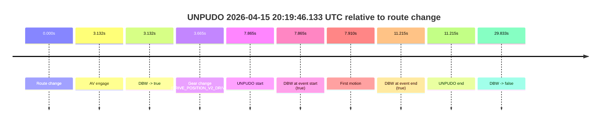

| Metric | Value |
|---|---|
| Outcome | `pass` |
| Effective failure type | `none` |
| Route change status | `found` |
| DBW at event start | `true` |
| DBW at event end | `true` |
| Predicted gear at AV start | `DRIVE_POSITION_V2_DRIVE` |
| Actual gear at AV start | `DRIVE_POSITION_V2_PARK` |
| Predicted gear at event start | `DRIVE_POSITION_V2_DRIVE` |
| Actual gear at event start | `DRIVE_POSITION_V2_DRIVE` |
| Planned indicator direction | `INDICATORS_STATE_V2_LEFT_ON` |
| Controller indicator direction | `INDICATORS_STATE_V2_LEFT_ON` |
| Actual indicator direction | `INDICATORS_STATE_V2_OFF` |
| Actual indicator at maneuver end | `INDICATORS_STATE_V2_OFF` |
| Driver accel help in AV | `false` |
| Driver accel help timestamp | `n/a` |
| Max accel pedal pct in AV | `0.0%` |
| Max brake pedal pct in AV | `8.0%` |
| Max speed mps in AV | `5.981` |
| Success timing baseline | `route change` |
| Route -> AV | `3.132s` |
| AV -> event start | `4.733s` |
| AV -> first motion | `4.777s` |
| Success baseline -> event start | `7.865s` |
| Success baseline -> first motion | `7.910s` |
| AV duration before disengagement | `26.701s` |
| Trajectory waypoint count | `38` |
| Driving-plan step count | `11` |

The scored portion starts from the AV-owned window, not from the pre-AV setup. Route-change search in the stopped pre-event segment was `found`, with the baseline therefore set to route change. At the event anchor the model predicts `DRIVE_POSITION_V2_DRIVE` and the actual gear is `DRIVE_POSITION_V2_DRIVE`. The effective model outcome is `pass` because `the credited unpudo stays AV-owned through the official unpudo window.`

### Resolution

| Field | Value |
|---|---|
| Final outcome | `pass` |
| Do we agree with this label? | `yes` |
| Source disengagement type | `none observed` |
| Resolved effective failure type | `none` |
| Confidence | `high` |
