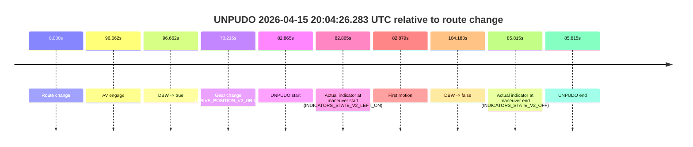
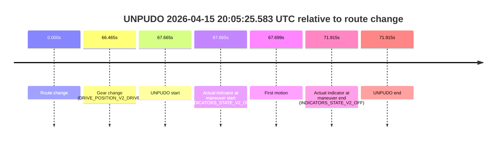
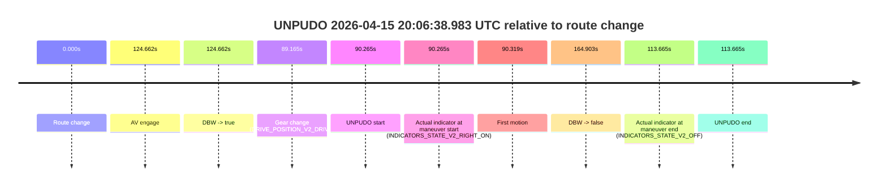
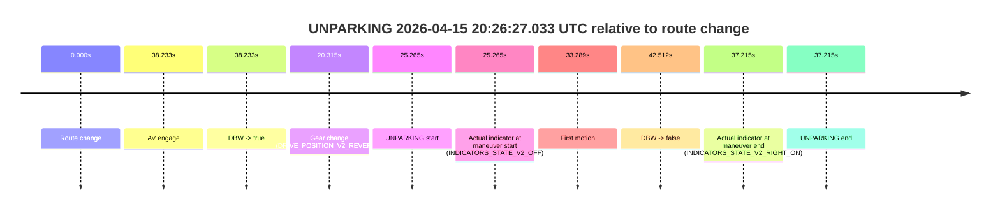
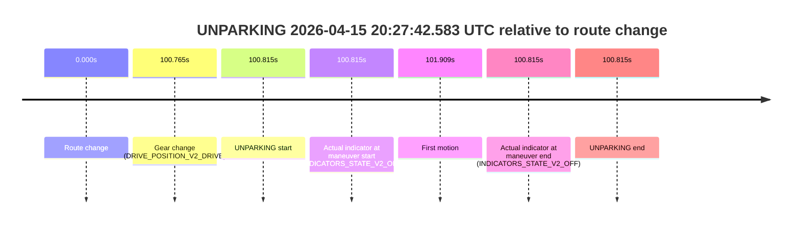

# Run Report: fme10010/2026-04-15--19-10-20--gen2-av-cd9496c5-ad6e-4dc5-a227-8d9a06b3e089

| Field | Value |
|---|---|
| Run ID | `fme10010/2026-04-15--19-10-20--gen2-av-cd9496c5-ad6e-4dc5-a227-8d9a06b3e089` |
| Date | `2026-04-15` |
| Model(s) | `armadillo-amethyst-squeaky` |
| Author | `guy.geva` |
| Event count | `14` |

## unpudo 2026-04-15 19:18:58.683 UTC

| Field | Value |
|---|---|
| Model | `armadillo-amethyst-squeaky` |
| Author | `guy.geva` |
| Run ID | `fme10010/2026-04-15--19-10-20--gen2-av-cd9496c5-ad6e-4dc5-a227-8d9a06b3e089` |
| Date | `2026-04-15` |
| Time (UTC) | `19:18:58.683` |
| Event type | `unpudo` |
| Disengagement type | `failed_to_unpudo` |
| Route change | `found` |
| Console | [run](https://console.sso.wayve.ai/run/fme10010/2026-04-15--19-10-20--gen2-av-cd9496c5-ad6e-4dc5-a227-8d9a06b3e089?id=&time-unixus=1776280738683305) |
| Foxglove | [segment](https://app.foxglove.dev/wayve-on-prem/p/prj_0dX18KZdVHg1fmmI/view?ds=foxglove-stream&ds.deviceName=fme10010&ds.start=2026-04-15T19%3A18%3A40.083304Z&ds.end=2026-04-15T19%3A19%3A39.640923Z&layoutId=lay_0e7VD4WIKDQGU73Y&time=2026-04-15T19%3A18%3A58.683305Z) |

### Event card: accidental

- Accidental: AV ownership is present for less than `2s`, so this is treated as an accidental brush with the maneuver rather than a meaningful model attempt.

| Event | Time (UTC) | Delta from route change |
|---|---:|---:|
| Route change | 2026-04-15 19:18:50.168 | `0.000s` |
| AV engage | 2026-04-15 19:19:03.100 | `12.932s` |
| DBW -> true | 2026-04-15 19:19:03.100 | `12.932s` |
| Gear change (DRIVE_POSITION_V2_DRIVE) | 2026-04-15 19:18:50.083 | `-0.085s` |
| UNPUDO start | 2026-04-15 19:18:58.683 | `8.515s` |
| Actual indicator at maneuver start (INDICATORS_STATE_V2_OFF) | 2026-04-15 19:18:58.683 | `8.515s` |
| First motion | 2026-04-15 19:18:58.757 | `8.589s` |
| DBW -> false | 2026-04-15 19:19:29.640 | `39.473s` |
| Actual indicator at maneuver end (INDICATORS_STATE_V2_LEFT_ON) | 2026-04-15 19:19:03.783 | `13.615s` |
| UNPUDO end | 2026-04-15 19:19:03.783 | `13.615s` |

| Metric | Value |
|---|---|
| Outcome | `accidental` |
| Effective failure type | `none` |
| Route change status | `found` |
| DBW at event start | `false` |
| DBW at event end | `true` |
| Predicted gear at AV start | `DRIVE_POSITION_V2_DRIVE` |
| Actual gear at AV start | `DRIVE_POSITION_V2_DRIVE` |
| Predicted gear at event start | `DRIVE_POSITION_V2_DRIVE` |
| Actual gear at event start | `DRIVE_POSITION_V2_DRIVE` |
| Planned indicator direction | `INDICATORS_STATE_V2_OFF` |
| Controller indicator direction | `INDICATORS_STATE_V2_OFF` |
| Actual indicator direction | `INDICATORS_STATE_V2_OFF` |
| Actual indicator at maneuver end | `INDICATORS_STATE_V2_LEFT_ON` |
| Driver accel help in AV | `false` |
| Driver accel help timestamp | `n/a` |
| Max accel pedal pct in AV | `0.0%` |
| Max brake pedal pct in AV | `0.0%` |
| Max speed mps in AV | `3.097` |
| Route -> AV | `12.932s` |
| AV -> event start | `-4.417s` |
| AV -> first motion | `-4.343s` |
| AV duration before disengagement | `26.541s` |
| Trajectory waypoint count | `37` |
| Driving-plan step count | `11` |

The scored portion starts from the AV-owned window, not from the pre-AV setup. Route-change search in the stopped pre-event segment was `found`, with the baseline therefore set to route change. At the event anchor the model predicts `DRIVE_POSITION_V2_DRIVE` and the actual gear is `DRIVE_POSITION_V2_DRIVE`. The effective model outcome is `accidental` because `the AV-owned portion is shorter than 2s`.

### Resolution

| Field | Value |
|---|---|
| Final outcome | `accidental` |
| Do we agree with this label? | `yes` |
| Source disengagement type | `failed_to_unpudo` |
| Resolved effective failure type | `none` |
| Confidence | `high` |

## unpudo 2026-04-15 19:21:16.533 UTC

| Field | Value |
|---|---|
| Model | `armadillo-amethyst-squeaky` |
| Author | `guy.geva` |
| Run ID | `fme10010/2026-04-15--19-10-20--gen2-av-cd9496c5-ad6e-4dc5-a227-8d9a06b3e089` |
| Date | `2026-04-15` |
| Time (UTC) | `19:21:16.533` |
| Event type | `unpudo` |
| Disengagement type | `failed_to_unpudo` |
| Route change | `found` |
| Console | [run](https://console.sso.wayve.ai/run/fme10010/2026-04-15--19-10-20--gen2-av-cd9496c5-ad6e-4dc5-a227-8d9a06b3e089?id=&time-unixus=1776280876533293) |
| Foxglove | [segment](https://app.foxglove.dev/wayve-on-prem/p/prj_0dX18KZdVHg1fmmI/view?ds=foxglove-stream&ds.deviceName=fme10010&ds.start=2026-04-15T19%3A20%3A59.918269Z&ds.end=2026-04-15T19%3A21%3A55.941146Z&layoutId=lay_0e7VD4WIKDQGU73Y&time=2026-04-15T19%3A21%3A16.533293Z) |

### Event card: accidental

- Accidental: AV ownership is present for less than `2s`, so this is treated as an accidental brush with the maneuver rather than a meaningful model attempt.

| Event | Time (UTC) | Delta from route change |
|---|---:|---:|
| Route change | 2026-04-15 19:21:09.918 | `0.000s` |
| AV engage | 2026-04-15 19:21:24.600 | `14.682s` |
| DBW -> true | 2026-04-15 19:21:24.600 | `14.682s` |
| Gear change (DRIVE_POSITION_V2_DRIVE) | 2026-04-15 19:21:11.683 | `1.765s` |
| UNPUDO start | 2026-04-15 19:21:16.533 | `6.615s` |
| Actual indicator at maneuver start (INDICATORS_STATE_V2_LEFT_ON) | 2026-04-15 19:21:16.533 | `6.615s` |
| First motion | 2026-04-15 19:21:16.617 | `6.699s` |
| DBW -> false | 2026-04-15 19:21:45.941 | `36.023s` |
| Actual indicator at maneuver end (INDICATORS_STATE_V2_OFF) | 2026-04-15 19:21:20.833 | `10.915s` |
| UNPUDO end | 2026-04-15 19:21:20.833 | `10.915s` |

| Metric | Value |
|---|---|
| Outcome | `accidental` |
| Effective failure type | `none` |
| Route change status | `found` |
| DBW at event start | `false` |
| DBW at event end | `false` |
| Predicted gear at AV start | `DRIVE_POSITION_V2_DRIVE` |
| Actual gear at AV start | `DRIVE_POSITION_V2_DRIVE` |
| Predicted gear at event start | `DRIVE_POSITION_V2_DRIVE` |
| Actual gear at event start | `DRIVE_POSITION_V2_DRIVE` |
| Planned indicator direction | `INDICATORS_STATE_V2_LEFT_ON` |
| Controller indicator direction | `INDICATORS_STATE_V2_LEFT_ON` |
| Actual indicator direction | `INDICATORS_STATE_V2_LEFT_ON` |
| Actual indicator at maneuver end | `INDICATORS_STATE_V2_OFF` |
| Driver accel help in AV | `false` |
| Driver accel help timestamp | `n/a` |
| Max accel pedal pct in AV | `0.0%` |
| Max brake pedal pct in AV | `0.0%` |
| Max speed mps in AV | `0.000` |
| Route -> AV | `14.682s` |
| AV -> event start | `-8.067s` |
| AV -> first motion | `-7.983s` |
| AV duration before disengagement | `21.341s` |
| Trajectory waypoint count | `36` |
| Driving-plan step count | `11` |

The scored portion starts from the AV-owned window, not from the pre-AV setup. Route-change search in the stopped pre-event segment was `found`, with the baseline therefore set to route change. At the event anchor the model predicts `DRIVE_POSITION_V2_DRIVE` and the actual gear is `DRIVE_POSITION_V2_DRIVE`. The effective model outcome is `accidental` because `the AV-owned portion is shorter than 2s`.

### Resolution

| Field | Value |
|---|---|
| Final outcome | `accidental` |
| Do we agree with this label? | `yes` |
| Source disengagement type | `failed_to_unpudo` |
| Resolved effective failure type | `none` |
| Confidence | `high` |

## unpudo 2026-04-15 19:22:06.433 UTC

| Field | Value |
|---|---|
| Model | `armadillo-amethyst-squeaky` |
| Author | `guy.geva` |
| Run ID | `fme10010/2026-04-15--19-10-20--gen2-av-cd9496c5-ad6e-4dc5-a227-8d9a06b3e089` |
| Date | `2026-04-15` |
| Time (UTC) | `19:22:06.433` |
| Event type | `unpudo` |
| Disengagement type | `failed_to_unpudo` |
| Route change | `found` |
| Console | [run](https://console.sso.wayve.ai/run/fme10010/2026-04-15--19-10-20--gen2-av-cd9496c5-ad6e-4dc5-a227-8d9a06b3e089?id=&time-unixus=1776280926433308) |
| Foxglove | [segment](https://app.foxglove.dev/wayve-on-prem/p/prj_0dX18KZdVHg1fmmI/view?ds=foxglove-stream&ds.deviceName=fme10010&ds.start=2026-04-15T19%3A20%3A59.918269Z&ds.end=2026-04-15T19%3A22%3A24.861772Z&layoutId=lay_0e7VD4WIKDQGU73Y&time=2026-04-15T19%3A22%3A06.433308Z) |

### Event card: accidental

- Accidental: AV ownership is present for less than `2s`, so this is treated as an accidental brush with the maneuver rather than a meaningful model attempt.

| Event | Time (UTC) | Delta from route change |
|---|---:|---:|
| Route change | 2026-04-15 19:21:09.918 | `0.000s` |
| AV engage | 2026-04-15 19:22:12.301 | `62.383s` |
| DBW -> true | 2026-04-15 19:22:12.301 | `62.383s` |
| Gear change (DRIVE_POSITION_V2_DRIVE) | 2026-04-15 19:22:01.283 | `51.365s` |
| UNPUDO start | 2026-04-15 19:22:06.433 | `56.515s` |
| Actual indicator at maneuver start (INDICATORS_STATE_V2_OFF) | 2026-04-15 19:22:06.433 | `56.515s` |
| First motion | 2026-04-15 19:22:06.557 | `56.640s` |
| DBW -> false | 2026-04-15 19:22:14.861 | `64.944s` |
| Actual indicator at maneuver end (INDICATORS_STATE_V2_OFF) | 2026-04-15 19:22:09.683 | `59.765s` |
| UNPUDO end | 2026-04-15 19:22:09.683 | `59.765s` |

| Metric | Value |
|---|---|
| Outcome | `accidental` |
| Effective failure type | `none` |
| Route change status | `found` |
| DBW at event start | `false` |
| DBW at event end | `false` |
| Predicted gear at AV start | `DRIVE_POSITION_V2_DRIVE` |
| Actual gear at AV start | `DRIVE_POSITION_V2_DRIVE` |
| Predicted gear at event start | `DRIVE_POSITION_V2_DRIVE` |
| Actual gear at event start | `DRIVE_POSITION_V2_DRIVE` |
| Planned indicator direction | `INDICATORS_STATE_V2_LEFT_ON` |
| Controller indicator direction | `INDICATORS_STATE_V2_LEFT_ON` |
| Actual indicator direction | `INDICATORS_STATE_V2_OFF` |
| Actual indicator at maneuver end | `INDICATORS_STATE_V2_OFF` |
| Driver accel help in AV | `false` |
| Driver accel help timestamp | `n/a` |
| Max accel pedal pct in AV | `0.0%` |
| Max brake pedal pct in AV | `0.0%` |
| Max speed mps in AV | `0.000` |
| Route -> AV | `62.383s` |
| AV -> event start | `-5.868s` |
| AV -> first motion | `-5.744s` |
| AV duration before disengagement | `2.560s` |
| Trajectory waypoint count | `36` |
| Driving-plan step count | `11` |

The scored portion starts from the AV-owned window, not from the pre-AV setup. Route-change search in the stopped pre-event segment was `found`, with the baseline therefore set to route change. At the event anchor the model predicts `DRIVE_POSITION_V2_DRIVE` and the actual gear is `DRIVE_POSITION_V2_DRIVE`. The effective model outcome is `accidental` because `the AV-owned portion is shorter than 2s`.

### Resolution

| Field | Value |
|---|---|
| Final outcome | `accidental` |
| Do we agree with this label? | `yes` |
| Source disengagement type | `failed_to_unpudo` |
| Resolved effective failure type | `none` |
| Confidence | `high` |

## unpudo 2026-04-15 19:42:39.433 UTC

| Field | Value |
|---|---|
| Model | `armadillo-amethyst-squeaky` |
| Author | `guy.geva` |
| Run ID | `fme10010/2026-04-15--19-10-20--gen2-av-cd9496c5-ad6e-4dc5-a227-8d9a06b3e089` |
| Date | `2026-04-15` |
| Time (UTC) | `19:42:39.433` |
| Event type | `unpudo` |
| Disengagement type | `failed_to_unpudo` |
| Route change | `found` |
| Console | [run](https://console.sso.wayve.ai/run/fme10010/2026-04-15--19-10-20--gen2-av-cd9496c5-ad6e-4dc5-a227-8d9a06b3e089?id=&time-unixus=1776282159433309) |
| Foxglove | [segment](https://app.foxglove.dev/wayve-on-prem/p/prj_0dX18KZdVHg1fmmI/view?ds=foxglove-stream&ds.deviceName=fme10010&ds.start=2026-04-15T19%3A40%3A33.168293Z&ds.end=2026-04-15T19%3A43%3A15.133293Z&layoutId=lay_0e7VD4WIKDQGU73Y&time=2026-04-15T19%3A42%3A39.433309Z) |

### Event card: fail

- Fail: AV owns part of the segment, but the event still resolves as a model-performance failure under the AV-only scoring rule.

| Event | Time (UTC) | Delta from route change |
|---|---:|---:|
| Route change | 2026-04-15 19:40:43.168 | `0.000s` |
| AV engage | 2026-04-15 19:41:34.160 | `50.992s` |
| DBW -> true | 2026-04-15 19:41:34.160 | `50.992s` |
| Gear change (DRIVE_POSITION_V2_DRIVE) | 2026-04-15 19:42:35.583 | `112.415s` |
| UNPUDO start | 2026-04-15 19:42:39.433 | `116.265s` |
| Actual indicator at maneuver start (INDICATORS_STATE_V2_OFF) | 2026-04-15 19:42:39.433 | `116.265s` |
| First motion | 2026-04-15 19:42:39.457 | `116.289s` |
| DBW -> false | 2026-04-15 19:42:43.040 | `119.872s` |
| Actual indicator at maneuver end (INDICATORS_STATE_V2_OFF) | 2026-04-15 19:43:05.133 | `141.965s` |
| UNPUDO end | 2026-04-15 19:43:05.133 | `141.965s` |

| Metric | Value |
|---|---|
| Outcome | `fail` |
| Effective failure type | `failed_to_unpudo` |
| Route change status | `found` |
| DBW at event start | `true` |
| DBW at event end | `false` |
| Predicted gear at AV start | `DRIVE_POSITION_V2_DRIVE` |
| Actual gear at AV start | `DRIVE_POSITION_V2_DRIVE` |
| Predicted gear at event start | `DRIVE_POSITION_V2_DRIVE` |
| Actual gear at event start | `DRIVE_POSITION_V2_DRIVE` |
| Planned indicator direction | `INDICATORS_STATE_V2_OFF` |
| Controller indicator direction | `INDICATORS_STATE_V2_OFF` |
| Actual indicator direction | `INDICATORS_STATE_V2_OFF` |
| Actual indicator at maneuver end | `INDICATORS_STATE_V2_OFF` |
| Driver accel help in AV | `false` |
| Driver accel help timestamp | `n/a` |
| Max accel pedal pct in AV | `0.0%` |
| Max brake pedal pct in AV | `20.8%` |
| Max speed mps in AV | `11.447` |
| Route -> AV | `50.992s` |
| AV -> event start | `65.273s` |
| AV -> first motion | `65.297s` |
| AV duration before disengagement | `68.880s` |
| Trajectory waypoint count | `36` |
| Driving-plan step count | `11` |

The scored portion starts from the AV-owned window, not from the pre-AV setup. Route-change search in the stopped pre-event segment was `found`, with the baseline therefore set to route change. At the event anchor the model predicts `DRIVE_POSITION_V2_DRIVE` and the actual gear is `DRIVE_POSITION_V2_DRIVE`. The effective model outcome is `fail` because `failed_to_unpudo`.

### Resolution

| Field | Value |
|---|---|
| Final outcome | `fail` |
| Do we agree with this label? | `yes` |
| Source disengagement type | `failed_to_unpudo` |
| Resolved effective failure type | `failed_to_unpudo` |
| Confidence | `high` |

## unpudo 2026-04-15 19:43:55.983 UTC

| Field | Value |
|---|---|
| Model | `armadillo-amethyst-squeaky` |
| Author | `guy.geva` |
| Run ID | `fme10010/2026-04-15--19-10-20--gen2-av-cd9496c5-ad6e-4dc5-a227-8d9a06b3e089` |
| Date | `2026-04-15` |
| Time (UTC) | `19:43:55.983` |
| Event type | `unpudo` |
| Disengagement type | `none observed` |
| Route change | `found` |
| Console | [run](https://console.sso.wayve.ai/run/fme10010/2026-04-15--19-10-20--gen2-av-cd9496c5-ad6e-4dc5-a227-8d9a06b3e089?id=&time-unixus=1776282235983308) |
| Foxglove | [segment](https://app.foxglove.dev/wayve-on-prem/p/prj_0dX18KZdVHg1fmmI/view?ds=foxglove-stream&ds.deviceName=fme10010&ds.start=2026-04-15T19%3A42%3A28.268905Z&ds.end=2026-04-15T19%3A44%3A49.020505Z&layoutId=lay_0e7VD4WIKDQGU73Y&time=2026-04-15T19%3A43%3A55.983308Z) |

### Event card: pass

- Pass: AV owns the credited unpudo through the official event window, the gear state is aligned at the anchor, and the vehicle moves without driver accelerator help in AV.

| Event | Time (UTC) | Delta from route change |
|---|---:|---:|
| Route change | 2026-04-15 19:42:38.268 | `0.000s` |
| AV engage | 2026-04-15 19:43:51.820 | `73.552s` |
| DBW -> true | 2026-04-15 19:43:51.820 | `73.552s` |
| Gear change (DRIVE_POSITION_V2_DRIVE) | 2026-04-15 19:43:52.283 | `74.014s` |
| UNPUDO start | 2026-04-15 19:43:55.983 | `77.714s` |
| Actual indicator at maneuver start (INDICATORS_STATE_V2_OFF) | 2026-04-15 19:43:55.983 | `77.714s` |
| First motion | 2026-04-15 19:43:56.037 | `77.769s` |
| DBW -> false | 2026-04-15 19:44:39.020 | `120.752s` |
| Actual indicator at maneuver end (INDICATORS_STATE_V2_OFF) | 2026-04-15 19:43:59.433 | `81.164s` |
| UNPUDO end | 2026-04-15 19:43:59.433 | `81.164s` |

| Metric | Value |
|---|---|
| Outcome | `pass` |
| Effective failure type | `none` |
| Route change status | `found` |
| DBW at event start | `true` |
| DBW at event end | `true` |
| Predicted gear at AV start | `DRIVE_POSITION_V2_DRIVE` |
| Actual gear at AV start | `DRIVE_POSITION_V2_PARK` |
| Predicted gear at event start | `DRIVE_POSITION_V2_DRIVE` |
| Actual gear at event start | `DRIVE_POSITION_V2_DRIVE` |
| Planned indicator direction | `INDICATORS_STATE_V2_RIGHT_ON` |
| Controller indicator direction | `INDICATORS_STATE_V2_RIGHT_ON` |
| Actual indicator direction | `INDICATORS_STATE_V2_OFF` |
| Actual indicator at maneuver end | `INDICATORS_STATE_V2_OFF` |
| Driver accel help in AV | `false` |
| Driver accel help timestamp | `n/a` |
| Max accel pedal pct in AV | `0.0%` |
| Max brake pedal pct in AV | `8.0%` |
| Max speed mps in AV | `5.303` |
| Route -> AV | `73.552s` |
| AV -> event start | `4.163s` |
| AV -> first motion | `4.217s` |
| AV duration before disengagement | `47.200s` |
| Trajectory waypoint count | `37` |
| Driving-plan step count | `11` |

The scored portion starts from the AV-owned window, not from the pre-AV setup. Route-change search in the stopped pre-event segment was `found`, with the baseline therefore set to route change. At the event anchor the model predicts `DRIVE_POSITION_V2_DRIVE` and the actual gear is `DRIVE_POSITION_V2_DRIVE`. The effective model outcome is `pass` because `the credited maneuver stays AV-owned through the official event end`.

### Resolution

| Field | Value |
|---|---|
| Final outcome | `pass` |
| Do we agree with this label? | `yes` |
| Source disengagement type | `none observed` |
| Resolved effective failure type | `none` |
| Confidence | `high` |

## unpudo 2026-04-15 19:45:54.283 UTC

| Field | Value |
|---|---|
| Model | `armadillo-amethyst-squeaky` |
| Author | `guy.geva` |
| Run ID | `fme10010/2026-04-15--19-10-20--gen2-av-cd9496c5-ad6e-4dc5-a227-8d9a06b3e089` |
| Date | `2026-04-15` |
| Time (UTC) | `19:45:54.283` |
| Event type | `unpudo` |
| Disengagement type | `failed_to_unpudo` |
| Route change | `found` |
| Console | [run](https://console.sso.wayve.ai/run/fme10010/2026-04-15--19-10-20--gen2-av-cd9496c5-ad6e-4dc5-a227-8d9a06b3e089?id=&time-unixus=1776282354283314) |
| Foxglove | [segment](https://app.foxglove.dev/wayve-on-prem/p/prj_0dX18KZdVHg1fmmI/view?ds=foxglove-stream&ds.deviceName=fme10010&ds.start=2026-04-15T19%3A45%3A32.968326Z&ds.end=2026-04-15T19%3A46%3A52.721691Z&layoutId=lay_0e7VD4WIKDQGU73Y&time=2026-04-15T19%3A45%3A54.283314Z) |

### Event card: accidental

- Accidental: AV ownership is present for less than `2s`, so this is treated as an accidental brush with the maneuver rather than a meaningful model attempt.

| Event | Time (UTC) | Delta from route change |
|---|---:|---:|
| Route change | 2026-04-15 19:45:42.968 | `0.000s` |
| AV engage | 2026-04-15 19:46:08.860 | `25.892s` |
| DBW -> true | 2026-04-15 19:46:08.860 | `25.892s` |
| Gear change (DRIVE_POSITION_V2_REVERSE) | 2026-04-15 19:45:43.933 | `0.965s` |
| UNPUDO start | 2026-04-15 19:45:54.283 | `11.315s` |
| Actual indicator at maneuver start (INDICATORS_STATE_V2_RIGHT_ON) | 2026-04-15 19:45:54.283 | `11.315s` |
| First motion | 2026-04-15 19:46:04.017 | `21.049s` |
| DBW -> false | 2026-04-15 19:46:42.721 | `59.753s` |
| Actual indicator at maneuver end (INDICATORS_STATE_V2_OFF) | 2026-04-15 19:46:05.983 | `23.015s` |
| UNPUDO end | 2026-04-15 19:46:05.983 | `23.015s` |

| Metric | Value |
|---|---|
| Outcome | `accidental` |
| Effective failure type | `none` |
| Route change status | `found` |
| DBW at event start | `false` |
| DBW at event end | `false` |
| Predicted gear at AV start | `DRIVE_POSITION_V2_DRIVE` |
| Actual gear at AV start | `DRIVE_POSITION_V2_DRIVE` |
| Predicted gear at event start | `DRIVE_POSITION_V2_REVERSE` |
| Actual gear at event start | `DRIVE_POSITION_V2_REVERSE` |
| Planned indicator direction | `INDICATORS_STATE_V2_OFF` |
| Controller indicator direction | `INDICATORS_STATE_V2_OFF` |
| Actual indicator direction | `INDICATORS_STATE_V2_RIGHT_ON` |
| Actual indicator at maneuver end | `INDICATORS_STATE_V2_OFF` |
| Driver accel help in AV | `false` |
| Driver accel help timestamp | `n/a` |
| Max accel pedal pct in AV | `0.0%` |
| Max brake pedal pct in AV | `0.0%` |
| Max speed mps in AV | `0.000` |
| Route -> AV | `25.892s` |
| AV -> event start | `-14.577s` |
| AV -> first motion | `-4.843s` |
| AV duration before disengagement | `33.861s` |
| Trajectory waypoint count | `37` |
| Driving-plan step count | `11` |

The scored portion starts from the AV-owned window, not from the pre-AV setup. Route-change search in the stopped pre-event segment was `found`, with the baseline therefore set to route change. At the event anchor the model predicts `DRIVE_POSITION_V2_REVERSE` and the actual gear is `DRIVE_POSITION_V2_REVERSE`. The effective model outcome is `accidental` because `the AV-owned portion is shorter than 2s`.

### Resolution

| Field | Value |
|---|---|
| Final outcome | `accidental` |
| Do we agree with this label? | `yes` |
| Source disengagement type | `failed_to_unpudo` |
| Resolved effective failure type | `none` |
| Confidence | `high` |

## unpudo 2026-04-15 20:04:26.283 UTC

| Field | Value |
|---|---|
| Model | `armadillo-amethyst-squeaky` |
| Author | `guy.geva` |
| Run ID | `fme10010/2026-04-15--19-10-20--gen2-av-cd9496c5-ad6e-4dc5-a227-8d9a06b3e089` |
| Date | `2026-04-15` |
| Time (UTC) | `20:04:26.283` |
| Event type | `unpudo` |
| Disengagement type | `failed_to_unpudo` |
| Route change | `found` |
| Console | [run](https://console.sso.wayve.ai/run/fme10010/2026-04-15--19-10-20--gen2-av-cd9496c5-ad6e-4dc5-a227-8d9a06b3e089?id=&time-unixus=1776283466283306) |
| Foxglove | [segment](https://app.foxglove.dev/wayve-on-prem/p/prj_0dX18KZdVHg1fmmI/view?ds=foxglove-stream&ds.deviceName=fme10010&ds.start=2026-04-15T20%3A02%3A53.418332Z&ds.end=2026-04-15T20%3A04%3A57.601800Z&layoutId=lay_0e7VD4WIKDQGU73Y&time=2026-04-15T20%3A04%3A26.283306Z) |

### Event card: accidental

- Accidental: AV ownership is present for less than `2s`, so this is treated as an accidental brush with the maneuver rather than a meaningful model attempt.

| Event | Time (UTC) | Delta from route change |
|---|---:|---:|
| Route change | 2026-04-15 20:03:03.418 | `0.000s` |
| AV engage | 2026-04-15 20:04:40.080 | `96.662s` |
| DBW -> true | 2026-04-15 20:04:40.080 | `96.662s` |
| Gear change (DRIVE_POSITION_V2_DRIVE) | 2026-04-15 20:04:21.633 | `78.215s` |
| UNPUDO start | 2026-04-15 20:04:26.283 | `82.865s` |
| Actual indicator at maneuver start (INDICATORS_STATE_V2_LEFT_ON) | 2026-04-15 20:04:26.283 | `82.865s` |
| First motion | 2026-04-15 20:04:26.297 | `82.879s` |
| DBW -> false | 2026-04-15 20:04:47.601 | `104.183s` |
| Actual indicator at maneuver end (INDICATORS_STATE_V2_OFF) | 2026-04-15 20:04:29.233 | `85.815s` |
| UNPUDO end | 2026-04-15 20:04:29.233 | `85.815s` |

| Metric | Value |
|---|---|
| Outcome | `accidental` |
| Effective failure type | `none` |
| Route change status | `found` |
| DBW at event start | `false` |
| DBW at event end | `false` |
| Predicted gear at AV start | `DRIVE_POSITION_V2_DRIVE` |
| Actual gear at AV start | `DRIVE_POSITION_V2_DRIVE` |
| Predicted gear at event start | `DRIVE_POSITION_V2_DRIVE` |
| Actual gear at event start | `DRIVE_POSITION_V2_DRIVE` |
| Planned indicator direction | `INDICATORS_STATE_V2_RIGHT_ON` |
| Controller indicator direction | `INDICATORS_STATE_V2_RIGHT_ON` |
| Actual indicator direction | `INDICATORS_STATE_V2_LEFT_ON` |
| Actual indicator at maneuver end | `INDICATORS_STATE_V2_OFF` |
| Driver accel help in AV | `false` |
| Driver accel help timestamp | `n/a` |
| Max accel pedal pct in AV | `0.0%` |
| Max brake pedal pct in AV | `0.0%` |
| Max speed mps in AV | `0.000` |
| Route -> AV | `96.662s` |
| AV -> event start | `-13.797s` |
| AV -> first motion | `-13.783s` |
| AV duration before disengagement | `7.521s` |
| Trajectory waypoint count | `37` |
| Driving-plan step count | `11` |

The scored portion starts from the AV-owned window, not from the pre-AV setup. Route-change search in the stopped pre-event segment was `found`, with the baseline therefore set to route change. At the event anchor the model predicts `DRIVE_POSITION_V2_DRIVE` and the actual gear is `DRIVE_POSITION_V2_DRIVE`. The effective model outcome is `accidental` because `the AV-owned portion is shorter than 2s`.

### Resolution

| Field | Value |
|---|---|
| Final outcome | `accidental` |
| Do we agree with this label? | `yes` |
| Source disengagement type | `failed_to_unpudo` |
| Resolved effective failure type | `none` |
| Confidence | `high` |

## unpudo 2026-04-15 20:05:25.583 UTC

| Field | Value |
|---|---|
| Model | `armadillo-amethyst-squeaky` |
| Author | `guy.geva` |
| Run ID | `fme10010/2026-04-15--19-10-20--gen2-av-cd9496c5-ad6e-4dc5-a227-8d9a06b3e089` |
| Date | `2026-04-15` |
| Time (UTC) | `20:05:25.583` |
| Event type | `unpudo` |
| Disengagement type | `none observed` |
| Route change | `found` |
| Console | [run](https://console.sso.wayve.ai/run/fme10010/2026-04-15--19-10-20--gen2-av-cd9496c5-ad6e-4dc5-a227-8d9a06b3e089?id=&time-unixus=1776283525583319) |
| Foxglove | [segment](https://app.foxglove.dev/wayve-on-prem/p/prj_0dX18KZdVHg1fmmI/view?ds=foxglove-stream&ds.deviceName=fme10010&ds.start=2026-04-15T20%3A04%3A07.918244Z&ds.end=2026-04-15T20%3A05%3A39.833317Z&layoutId=lay_0e7VD4WIKDQGU73Y&time=2026-04-15T20%3A05%3A25.583319Z) |

### Event card: non-av

- Non-AV: the detected unpudo starts outside AV ownership, so it is kept for coverage but excluded from model success / failure scoring.

| Event | Time (UTC) | Delta from route change |
|---|---:|---:|
| Route change | 2026-04-15 20:04:17.918 | `0.000s` |
| Gear change (DRIVE_POSITION_V2_DRIVE) | 2026-04-15 20:05:24.383 | `66.465s` |
| UNPUDO start | 2026-04-15 20:05:25.583 | `67.665s` |
| Actual indicator at maneuver start (INDICATORS_STATE_V2_OFF) | 2026-04-15 20:05:25.583 | `67.665s` |
| First motion | 2026-04-15 20:05:25.617 | `67.699s` |
| Actual indicator at maneuver end (INDICATORS_STATE_V2_OFF) | 2026-04-15 20:05:29.833 | `71.915s` |
| UNPUDO end | 2026-04-15 20:05:29.833 | `71.915s` |

| Metric | Value |
|---|---|
| Outcome | `non-av` |
| Effective failure type | `none` |
| Route change status | `found` |
| DBW at event start | `false` |
| DBW at event end | `false` |
| Predicted gear at AV start | `n/a` |
| Actual gear at AV start | `n/a` |
| Predicted gear at event start | `DRIVE_POSITION_V2_DRIVE` |
| Actual gear at event start | `DRIVE_POSITION_V2_DRIVE` |
| Planned indicator direction | `INDICATORS_STATE_V2_OFF` |
| Controller indicator direction | `INDICATORS_STATE_V2_OFF` |
| Actual indicator direction | `INDICATORS_STATE_V2_OFF` |
| Actual indicator at maneuver end | `INDICATORS_STATE_V2_OFF` |
| Driver accel help in AV | `false` |
| Driver accel help timestamp | `n/a` |
| Max accel pedal pct in AV | `0.0%` |
| Max brake pedal pct in AV | `0.0%` |
| Max speed mps in AV | `0.000` |
| Route -> AV | `n/a` |
| AV -> event start | `n/a` |
| AV -> first motion | `n/a` |
| AV duration before disengagement | `n/a` |
| Trajectory waypoint count | `37` |
| Driving-plan step count | `11` |

The scored portion starts from the AV-owned window, not from the pre-AV setup. Route-change search in the stopped pre-event segment was `found`, with the baseline therefore set to route change. At the event anchor the model predicts `DRIVE_POSITION_V2_DRIVE` and the actual gear is `DRIVE_POSITION_V2_DRIVE`. The effective model outcome is `non-av` because `the event does not begin in AV ownership`.

### Resolution

| Field | Value |
|---|---|
| Final outcome | `non-av` |
| Do we agree with this label? | `yes` |
| Source disengagement type | `none observed` |
| Resolved effective failure type | `none` |
| Confidence | `high` |

## unpudo 2026-04-15 20:06:38.983 UTC

| Field | Value |
|---|---|
| Model | `armadillo-amethyst-squeaky` |
| Author | `guy.geva` |
| Run ID | `fme10010/2026-04-15--19-10-20--gen2-av-cd9496c5-ad6e-4dc5-a227-8d9a06b3e089` |
| Date | `2026-04-15` |
| Time (UTC) | `20:06:38.983` |
| Event type | `unpudo` |
| Disengagement type | `none observed` |
| Route change | `found` |
| Console | [run](https://console.sso.wayve.ai/run/fme10010/2026-04-15--19-10-20--gen2-av-cd9496c5-ad6e-4dc5-a227-8d9a06b3e089?id=&time-unixus=1776283598983323) |
| Foxglove | [segment](https://app.foxglove.dev/wayve-on-prem/p/prj_0dX18KZdVHg1fmmI/view?ds=foxglove-stream&ds.deviceName=fme10010&ds.start=2026-04-15T20%3A04%3A58.718258Z&ds.end=2026-04-15T20%3A08%3A03.621711Z&layoutId=lay_0e7VD4WIKDQGU73Y&time=2026-04-15T20%3A06%3A38.983323Z) |

### Event card: accidental

- Accidental: AV ownership is present for less than `2s`, so this is treated as an accidental brush with the maneuver rather than a meaningful model attempt.

| Event | Time (UTC) | Delta from route change |
|---|---:|---:|
| Route change | 2026-04-15 20:05:08.718 | `0.000s` |
| AV engage | 2026-04-15 20:07:13.380 | `124.662s` |
| DBW -> true | 2026-04-15 20:07:13.380 | `124.662s` |
| Gear change (DRIVE_POSITION_V2_DRIVE) | 2026-04-15 20:06:37.883 | `89.165s` |
| UNPUDO start | 2026-04-15 20:06:38.983 | `90.265s` |
| Actual indicator at maneuver start (INDICATORS_STATE_V2_RIGHT_ON) | 2026-04-15 20:06:38.983 | `90.265s` |
| First motion | 2026-04-15 20:06:39.037 | `90.319s` |
| DBW -> false | 2026-04-15 20:07:53.621 | `164.903s` |
| Actual indicator at maneuver end (INDICATORS_STATE_V2_OFF) | 2026-04-15 20:07:02.383 | `113.665s` |
| UNPUDO end | 2026-04-15 20:07:02.383 | `113.665s` |

| Metric | Value |
|---|---|
| Outcome | `accidental` |
| Effective failure type | `none` |
| Route change status | `found` |
| DBW at event start | `false` |
| DBW at event end | `false` |
| Predicted gear at AV start | `DRIVE_POSITION_V2_DRIVE` |
| Actual gear at AV start | `DRIVE_POSITION_V2_DRIVE` |
| Predicted gear at event start | `DRIVE_POSITION_V2_DRIVE` |
| Actual gear at event start | `DRIVE_POSITION_V2_DRIVE` |
| Planned indicator direction | `INDICATORS_STATE_V2_OFF` |
| Controller indicator direction | `INDICATORS_STATE_V2_OFF` |
| Actual indicator direction | `INDICATORS_STATE_V2_RIGHT_ON` |
| Actual indicator at maneuver end | `INDICATORS_STATE_V2_OFF` |
| Driver accel help in AV | `false` |
| Driver accel help timestamp | `n/a` |
| Max accel pedal pct in AV | `0.0%` |
| Max brake pedal pct in AV | `0.0%` |
| Max speed mps in AV | `0.000` |
| Route -> AV | `124.662s` |
| AV -> event start | `-34.397s` |
| AV -> first motion | `-34.343s` |
| AV duration before disengagement | `40.241s` |
| Trajectory waypoint count | `37` |
| Driving-plan step count | `11` |

The scored portion starts from the AV-owned window, not from the pre-AV setup. Route-change search in the stopped pre-event segment was `found`, with the baseline therefore set to route change. At the event anchor the model predicts `DRIVE_POSITION_V2_DRIVE` and the actual gear is `DRIVE_POSITION_V2_DRIVE`. The effective model outcome is `accidental` because `the AV-owned portion is shorter than 2s`.

### Resolution

| Field | Value |
|---|---|
| Final outcome | `accidental` |
| Do we agree with this label? | `yes` |
| Source disengagement type | `none observed` |
| Resolved effective failure type | `none` |
| Confidence | `high` |

## unpudo 2026-04-15 20:14:25.383 UTC

| Field | Value |
|---|---|
| Model | `armadillo-amethyst-squeaky` |
| Author | `guy.geva` |
| Run ID | `fme10010/2026-04-15--19-10-20--gen2-av-cd9496c5-ad6e-4dc5-a227-8d9a06b3e089` |
| Date | `2026-04-15` |
| Time (UTC) | `20:14:25.383` |
| Event type | `unpudo` |
| Disengagement type | `failed_to_unpudo` |
| Route change | `found` |
| Console | [run](https://console.sso.wayve.ai/run/fme10010/2026-04-15--19-10-20--gen2-av-cd9496c5-ad6e-4dc5-a227-8d9a06b3e089?id=&time-unixus=1776284065383308) |
| Foxglove | [segment](https://app.foxglove.dev/wayve-on-prem/p/prj_0dX18KZdVHg1fmmI/view?ds=foxglove-stream&ds.deviceName=fme10010&ds.start=2026-04-15T20%3A12%3A56.318274Z&ds.end=2026-04-15T20%3A14%3A47.541742Z&layoutId=lay_0e7VD4WIKDQGU73Y&time=2026-04-15T20%3A14%3A25.383308Z) |

### Event card: accidental

- Accidental: AV ownership is present for less than `2s`, so this is treated as an accidental brush with the maneuver rather than a meaningful model attempt.

| Event | Time (UTC) | Delta from route change |
|---|---:|---:|
| Route change | 2026-04-15 20:13:06.318 | `0.000s` |
| AV engage | 2026-04-15 20:14:37.040 | `90.722s` |
| DBW -> true | 2026-04-15 20:14:37.040 | `90.722s` |
| Gear change (DRIVE_POSITION_V2_DRIVE) | 2026-04-15 20:14:19.533 | `73.215s` |
| UNPUDO start | 2026-04-15 20:14:25.383 | `79.065s` |
| Actual indicator at maneuver start (INDICATORS_STATE_V2_OFF) | 2026-04-15 20:14:25.383 | `79.065s` |
| First motion | 2026-04-15 20:14:25.417 | `79.100s` |
| DBW -> false | 2026-04-15 20:14:37.541 | `91.223s` |
| Actual indicator at maneuver end (INDICATORS_STATE_V2_LEFT_ON) | 2026-04-15 20:14:28.983 | `82.665s` |
| UNPUDO end | 2026-04-15 20:14:28.983 | `82.665s` |

| Metric | Value |
|---|---|
| Outcome | `accidental` |
| Effective failure type | `none` |
| Route change status | `found` |
| DBW at event start | `false` |
| DBW at event end | `false` |
| Predicted gear at AV start | `DRIVE_POSITION_V2_DRIVE` |
| Actual gear at AV start | `DRIVE_POSITION_V2_DRIVE` |
| Predicted gear at event start | `DRIVE_POSITION_V2_DRIVE` |
| Actual gear at event start | `DRIVE_POSITION_V2_DRIVE` |
| Planned indicator direction | `INDICATORS_STATE_V2_LEFT_ON` |
| Controller indicator direction | `INDICATORS_STATE_V2_LEFT_ON` |
| Actual indicator direction | `INDICATORS_STATE_V2_OFF` |
| Actual indicator at maneuver end | `INDICATORS_STATE_V2_LEFT_ON` |
| Driver accel help in AV | `false` |
| Driver accel help timestamp | `n/a` |
| Max accel pedal pct in AV | `0.0%` |
| Max brake pedal pct in AV | `0.0%` |
| Max speed mps in AV | `0.000` |
| Route -> AV | `90.722s` |
| AV -> event start | `-11.657s` |
| AV -> first motion | `-11.623s` |
| AV duration before disengagement | `0.501s` |
| Trajectory waypoint count | `37` |
| Driving-plan step count | `11` |

The scored portion starts from the AV-owned window, not from the pre-AV setup. Route-change search in the stopped pre-event segment was `found`, with the baseline therefore set to route change. At the event anchor the model predicts `DRIVE_POSITION_V2_DRIVE` and the actual gear is `DRIVE_POSITION_V2_DRIVE`. The effective model outcome is `accidental` because `the AV-owned portion is shorter than 2s`.

### Resolution

| Field | Value |
|---|---|
| Final outcome | `accidental` |
| Do we agree with this label? | `yes` |
| Source disengagement type | `failed_to_unpudo` |
| Resolved effective failure type | `none` |
| Confidence | `high` |

## unpudo 2026-04-15 20:17:15.983 UTC

| Field | Value |
|---|---|
| Model | `armadillo-amethyst-squeaky` |
| Author | `guy.geva` |
| Run ID | `fme10010/2026-04-15--19-10-20--gen2-av-cd9496c5-ad6e-4dc5-a227-8d9a06b3e089` |
| Date | `2026-04-15` |
| Time (UTC) | `20:17:15.983` |
| Event type | `unpudo` |
| Disengagement type | `failed_to_unpudo` |
| Route change | `found` |
| Console | [run](https://console.sso.wayve.ai/run/fme10010/2026-04-15--19-10-20--gen2-av-cd9496c5-ad6e-4dc5-a227-8d9a06b3e089?id=&time-unixus=1776284235983304) |
| Foxglove | [segment](https://app.foxglove.dev/wayve-on-prem/p/prj_0dX18KZdVHg1fmmI/view?ds=foxglove-stream&ds.deviceName=fme10010&ds.start=2026-04-15T20%3A16%3A56.518254Z&ds.end=2026-04-15T20%3A17%3A46.040813Z&layoutId=lay_0e7VD4WIKDQGU73Y&time=2026-04-15T20%3A17%3A15.983304Z) |

### Event card: accidental

- Accidental: AV ownership is present for less than `2s`, so this is treated as an accidental brush with the maneuver rather than a meaningful model attempt.

| Event | Time (UTC) | Delta from route change |
|---|---:|---:|
| Route change | 2026-04-15 20:17:06.518 | `0.000s` |
| AV engage | 2026-04-15 20:17:23.701 | `17.183s` |
| DBW -> true | 2026-04-15 20:17:23.701 | `17.183s` |
| Gear change (DRIVE_POSITION_V2_DRIVE) | 2026-04-15 20:17:10.233 | `3.715s` |
| UNPUDO start | 2026-04-15 20:17:15.983 | `9.465s` |
| Actual indicator at maneuver start (INDICATORS_STATE_V2_LEFT_ON) | 2026-04-15 20:17:15.983 | `9.465s` |
| First motion | 2026-04-15 20:17:16.017 | `9.499s` |
| DBW -> false | 2026-04-15 20:17:36.040 | `29.523s` |
| Actual indicator at maneuver end (INDICATORS_STATE_V2_OFF) | 2026-04-15 20:17:19.683 | `13.165s` |
| UNPUDO end | 2026-04-15 20:17:19.683 | `13.165s` |

| Metric | Value |
|---|---|
| Outcome | `accidental` |
| Effective failure type | `none` |
| Route change status | `found` |
| DBW at event start | `false` |
| DBW at event end | `false` |
| Predicted gear at AV start | `DRIVE_POSITION_V2_DRIVE` |
| Actual gear at AV start | `DRIVE_POSITION_V2_DRIVE` |
| Predicted gear at event start | `DRIVE_POSITION_V2_DRIVE` |
| Actual gear at event start | `DRIVE_POSITION_V2_DRIVE` |
| Planned indicator direction | `INDICATORS_STATE_V2_LEFT_ON` |
| Controller indicator direction | `INDICATORS_STATE_V2_LEFT_ON` |
| Actual indicator direction | `INDICATORS_STATE_V2_LEFT_ON` |
| Actual indicator at maneuver end | `INDICATORS_STATE_V2_OFF` |
| Driver accel help in AV | `false` |
| Driver accel help timestamp | `n/a` |
| Max accel pedal pct in AV | `0.0%` |
| Max brake pedal pct in AV | `0.0%` |
| Max speed mps in AV | `0.000` |
| Route -> AV | `17.183s` |
| AV -> event start | `-7.718s` |
| AV -> first motion | `-7.684s` |
| AV duration before disengagement | `12.339s` |
| Trajectory waypoint count | `37` |
| Driving-plan step count | `11` |

The scored portion starts from the AV-owned window, not from the pre-AV setup. Route-change search in the stopped pre-event segment was `found`, with the baseline therefore set to route change. At the event anchor the model predicts `DRIVE_POSITION_V2_DRIVE` and the actual gear is `DRIVE_POSITION_V2_DRIVE`. The effective model outcome is `accidental` because `the AV-owned portion is shorter than 2s`.

### Resolution

| Field | Value |
|---|---|
| Final outcome | `accidental` |
| Do we agree with this label? | `yes` |
| Source disengagement type | `failed_to_unpudo` |
| Resolved effective failure type | `none` |
| Confidence | `high` |

## unpudo 2026-04-15 20:19:46.133 UTC

| Field | Value |
|---|---|
| Model | `armadillo-amethyst-squeaky` |
| Author | `guy.geva` |
| Run ID | `fme10010/2026-04-15--19-10-20--gen2-av-cd9496c5-ad6e-4dc5-a227-8d9a06b3e089` |
| Date | `2026-04-15` |
| Time (UTC) | `20:19:46.133` |
| Event type | `unpudo` |
| Disengagement type | `none observed` |
| Route change | `found` |
| Console | [run](https://console.sso.wayve.ai/run/fme10010/2026-04-15--19-10-20--gen2-av-cd9496c5-ad6e-4dc5-a227-8d9a06b3e089?id=&time-unixus=1776284386133314) |
| Foxglove | [segment](https://app.foxglove.dev/wayve-on-prem/p/prj_0dX18KZdVHg1fmmI/view?ds=foxglove-stream&ds.deviceName=fme10010&ds.start=2026-04-15T20%3A19%3A28.268258Z&ds.end=2026-04-15T20%3A20%3A18.101563Z&layoutId=lay_0e7VD4WIKDQGU73Y&time=2026-04-15T20%3A19%3A46.133314Z) |

### Event card: pass

- Pass: AV owns the credited unpudo through the official event window, the gear state is aligned at the anchor, and the vehicle moves without driver accelerator help in AV.

| Event | Time (UTC) | Delta from route change |
|---|---:|---:|
| Route change | 2026-04-15 20:19:38.268 | `0.000s` |
| AV engage | 2026-04-15 20:19:41.400 | `3.132s` |
| DBW -> true | 2026-04-15 20:19:41.400 | `3.132s` |
| Gear change (DRIVE_POSITION_V2_DRIVE) | 2026-04-15 20:19:41.933 | `3.665s` |
| UNPUDO start | 2026-04-15 20:19:46.133 | `7.865s` |
| Actual indicator at maneuver start (INDICATORS_STATE_V2_OFF) | 2026-04-15 20:19:46.133 | `7.865s` |
| First motion | 2026-04-15 20:19:46.177 | `7.910s` |
| DBW -> false | 2026-04-15 20:20:08.101 | `29.833s` |
| Actual indicator at maneuver end (INDICATORS_STATE_V2_OFF) | 2026-04-15 20:19:49.483 | `11.215s` |
| UNPUDO end | 2026-04-15 20:19:49.483 | `11.215s` |

| Metric | Value |
|---|---|
| Outcome | `pass` |
| Effective failure type | `none` |
| Route change status | `found` |
| DBW at event start | `true` |
| DBW at event end | `true` |
| Predicted gear at AV start | `DRIVE_POSITION_V2_DRIVE` |
| Actual gear at AV start | `DRIVE_POSITION_V2_PARK` |
| Predicted gear at event start | `DRIVE_POSITION_V2_DRIVE` |
| Actual gear at event start | `DRIVE_POSITION_V2_DRIVE` |
| Planned indicator direction | `INDICATORS_STATE_V2_LEFT_ON` |
| Controller indicator direction | `INDICATORS_STATE_V2_LEFT_ON` |
| Actual indicator direction | `INDICATORS_STATE_V2_OFF` |
| Actual indicator at maneuver end | `INDICATORS_STATE_V2_OFF` |
| Driver accel help in AV | `false` |
| Driver accel help timestamp | `n/a` |
| Max accel pedal pct in AV | `0.0%` |
| Max brake pedal pct in AV | `8.0%` |
| Max speed mps in AV | `5.981` |
| Route -> AV | `3.132s` |
| AV -> event start | `4.733s` |
| AV -> first motion | `4.777s` |
| AV duration before disengagement | `26.701s` |
| Trajectory waypoint count | `38` |
| Driving-plan step count | `11` |

The scored portion starts from the AV-owned window, not from the pre-AV setup. Route-change search in the stopped pre-event segment was `found`, with the baseline therefore set to route change. At the event anchor the model predicts `DRIVE_POSITION_V2_DRIVE` and the actual gear is `DRIVE_POSITION_V2_DRIVE`. The effective model outcome is `pass` because `the credited maneuver stays AV-owned through the official event end`.

### Resolution

| Field | Value |
|---|---|
| Final outcome | `pass` |
| Do we agree with this label? | `yes` |
| Source disengagement type | `none observed` |
| Resolved effective failure type | `none` |
| Confidence | `high` |

## unparking 2026-04-15 20:26:27.033 UTC

| Field | Value |
|---|---|
| Model | `armadillo-amethyst-squeaky` |
| Author | `guy.geva` |
| Run ID | `fme10010/2026-04-15--19-10-20--gen2-av-cd9496c5-ad6e-4dc5-a227-8d9a06b3e089` |
| Date | `2026-04-15` |
| Time (UTC) | `20:26:27.033` |
| Event type | `unparking` |
| Disengagement type | `none observed` |
| Route change | `found` |
| Console | [run](https://console.sso.wayve.ai/run/fme10010/2026-04-15--19-10-20--gen2-av-cd9496c5-ad6e-4dc5-a227-8d9a06b3e089?id=&time-unixus=1776284787033302) |
| Foxglove | [segment](https://app.foxglove.dev/wayve-on-prem/p/prj_0dX18KZdVHg1fmmI/view?ds=foxglove-stream&ds.deviceName=fme10010&ds.start=2026-04-15T20%3A25%3A51.768336Z&ds.end=2026-04-15T20%3A26%3A54.280339Z&layoutId=lay_0e7VD4WIKDQGU73Y&time=2026-04-15T20%3A26%3A27.033302Z) |

### Event card: accidental

- Accidental: AV ownership is present for less than `2s`, so this is treated as an accidental brush with the maneuver rather than a meaningful model attempt.

| Event | Time (UTC) | Delta from route change |
|---|---:|---:|
| Route change | 2026-04-15 20:26:01.768 | `0.000s` |
| AV engage | 2026-04-15 20:26:40.001 | `38.233s` |
| DBW -> true | 2026-04-15 20:26:40.001 | `38.233s` |
| Gear change (DRIVE_POSITION_V2_REVERSE) | 2026-04-15 20:26:22.083 | `20.315s` |
| UNPARKING start | 2026-04-15 20:26:27.033 | `25.265s` |
| Actual indicator at maneuver start (INDICATORS_STATE_V2_OFF) | 2026-04-15 20:26:27.033 | `25.265s` |
| First motion | 2026-04-15 20:26:35.057 | `33.289s` |
| DBW -> false | 2026-04-15 20:26:44.280 | `42.512s` |
| Actual indicator at maneuver end (INDICATORS_STATE_V2_RIGHT_ON) | 2026-04-15 20:26:38.983 | `37.215s` |
| UNPARKING end | 2026-04-15 20:26:38.983 | `37.215s` |

| Metric | Value |
|---|---|
| Outcome | `accidental` |
| Effective failure type | `none` |
| Route change status | `found` |
| DBW at event start | `false` |
| DBW at event end | `false` |
| Predicted gear at AV start | `DRIVE_POSITION_V2_DRIVE` |
| Actual gear at AV start | `DRIVE_POSITION_V2_DRIVE` |
| Predicted gear at event start | `DRIVE_POSITION_V2_REVERSE` |
| Actual gear at event start | `DRIVE_POSITION_V2_REVERSE` |
| Planned indicator direction | `INDICATORS_STATE_V2_OFF` |
| Controller indicator direction | `INDICATORS_STATE_V2_OFF` |
| Actual indicator direction | `INDICATORS_STATE_V2_OFF` |
| Actual indicator at maneuver end | `INDICATORS_STATE_V2_RIGHT_ON` |
| Driver accel help in AV | `false` |
| Driver accel help timestamp | `n/a` |
| Max accel pedal pct in AV | `0.0%` |
| Max brake pedal pct in AV | `0.0%` |
| Max speed mps in AV | `0.000` |
| Route -> AV | `38.233s` |
| AV -> event start | `-12.968s` |
| AV -> first motion | `-4.945s` |
| AV duration before disengagement | `4.279s` |
| Trajectory waypoint count | `36` |
| Driving-plan step count | `11` |

The scored portion starts from the AV-owned window, not from the pre-AV setup. Route-change search in the stopped pre-event segment was `found`, with the baseline therefore set to route change. At the event anchor the model predicts `DRIVE_POSITION_V2_REVERSE` and the actual gear is `DRIVE_POSITION_V2_REVERSE`. The effective model outcome is `accidental` because `the AV-owned portion is shorter than 2s`.

### Resolution

| Field | Value |
|---|---|
| Final outcome | `accidental` |
| Do we agree with this label? | `yes` |
| Source disengagement type | `none observed` |
| Resolved effective failure type | `none` |
| Confidence | `high` |

## unparking 2026-04-15 20:27:42.583 UTC

| Field | Value |
|---|---|
| Model | `armadillo-amethyst-squeaky` |
| Author | `guy.geva` |
| Run ID | `fme10010/2026-04-15--19-10-20--gen2-av-cd9496c5-ad6e-4dc5-a227-8d9a06b3e089` |
| Date | `2026-04-15` |
| Time (UTC) | `20:27:42.583` |
| Event type | `unparking` |
| Disengagement type | `none observed` |
| Route change | `found` |
| Console | [run](https://console.sso.wayve.ai/run/fme10010/2026-04-15--19-10-20--gen2-av-cd9496c5-ad6e-4dc5-a227-8d9a06b3e089?id=&time-unixus=1776284862583317) |
| Foxglove | [segment](https://app.foxglove.dev/wayve-on-prem/p/prj_0dX18KZdVHg1fmmI/view?ds=foxglove-stream&ds.deviceName=fme10010&ds.start=2026-04-15T20%3A25%3A51.768336Z&ds.end=2026-04-15T20%3A27%3A52.583317Z&layoutId=lay_0e7VD4WIKDQGU73Y&time=2026-04-15T20%3A27%3A42.583317Z) |

### Event card: non-av

- Non-AV: the detected unparking starts outside AV ownership, so it is kept for coverage but excluded from model success / failure scoring.

| Event | Time (UTC) | Delta from route change |
|---|---:|---:|
| Route change | 2026-04-15 20:26:01.768 | `0.000s` |
| Gear change (DRIVE_POSITION_V2_DRIVE) | 2026-04-15 20:27:42.533 | `100.765s` |
| UNPARKING start | 2026-04-15 20:27:42.583 | `100.815s` |
| Actual indicator at maneuver start (INDICATORS_STATE_V2_OFF) | 2026-04-15 20:27:42.583 | `100.815s` |
| First motion | 2026-04-15 20:27:43.677 | `101.909s` |
| Actual indicator at maneuver end (INDICATORS_STATE_V2_OFF) | 2026-04-15 20:27:42.583 | `100.815s` |
| UNPARKING end | 2026-04-15 20:27:42.583 | `100.815s` |

| Metric | Value |
|---|---|
| Outcome | `non-av` |
| Effective failure type | `none` |
| Route change status | `found` |
| DBW at event start | `false` |
| DBW at event end | `false` |
| Predicted gear at AV start | `n/a` |
| Actual gear at AV start | `n/a` |
| Predicted gear at event start | `DRIVE_POSITION_V2_DRIVE` |
| Actual gear at event start | `DRIVE_POSITION_V2_DRIVE` |
| Planned indicator direction | `INDICATORS_STATE_V2_OFF` |
| Controller indicator direction | `INDICATORS_STATE_V2_OFF` |
| Actual indicator direction | `INDICATORS_STATE_V2_OFF` |
| Actual indicator at maneuver end | `INDICATORS_STATE_V2_OFF` |
| Driver accel help in AV | `false` |
| Driver accel help timestamp | `n/a` |
| Max accel pedal pct in AV | `0.0%` |
| Max brake pedal pct in AV | `0.0%` |
| Max speed mps in AV | `0.000` |
| Route -> AV | `n/a` |
| AV -> event start | `n/a` |
| AV -> first motion | `n/a` |
| AV duration before disengagement | `n/a` |
| Trajectory waypoint count | `37` |
| Driving-plan step count | `11` |

The scored portion starts from the AV-owned window, not from the pre-AV setup. Route-change search in the stopped pre-event segment was `found`, with the baseline therefore set to route change. At the event anchor the model predicts `DRIVE_POSITION_V2_DRIVE` and the actual gear is `DRIVE_POSITION_V2_DRIVE`. The effective model outcome is `non-av` because `the event does not begin in AV ownership`.

### Resolution

| Field | Value |
|---|---|
| Final outcome | `non-av` |
| Do we agree with this label? | `yes` |
| Source disengagement type | `none observed` |
| Resolved effective failure type | `none` |
| Confidence | `high` |
