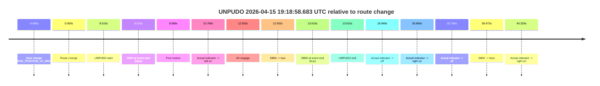
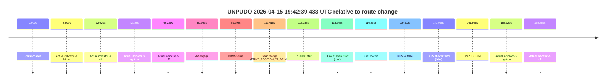
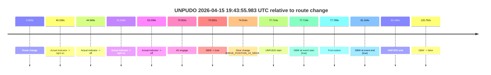
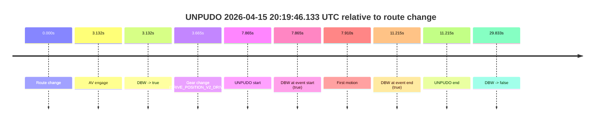

# Run Report: fme10010/2026-04-15--19-10-20--gen2-av-cd9496c5-ad6e-4dc5-a227-8d9a06b3e089

| Field | Value |
|---|---|
| Run ID | `fme10010/2026-04-15--19-10-20--gen2-av-cd9496c5-ad6e-4dc5-a227-8d9a06b3e089` |
| Date | `2026-04-15` |
| Model(s) | `armadillo-amethyst-squeaky` |
| Author | `guy.geva` |
| Event count | `4` |

## unpudo 2026-04-15 19:18:58.683 UTC

| Field | Value |
|---|---|
| Model | `armadillo-amethyst-squeaky` |
| Author | `guy.geva` |
| Run ID | `fme10010/2026-04-15--19-10-20--gen2-av-cd9496c5-ad6e-4dc5-a227-8d9a06b3e089` |
| Date | `2026-04-15` |
| Time (UTC) | `19:18:58.683` |
| Event type | `unpudo` |
| Disengagement type | `failed_to_unpudo` |
| Route change | `found` |
| Console | [run](https://console.sso.wayve.ai/run/fme10010/2026-04-15--19-10-20--gen2-av-cd9496c5-ad6e-4dc5-a227-8d9a06b3e089?id=&time-unixus=1776280738683305) |
| Foxglove | [segment](https://app.foxglove.dev/wayve-on-prem/p/prj_0dX18KZdVHg1fmmI/view?ds=foxglove-stream&ds.deviceName=fme10010&ds.start=2026-04-15T19%3A18%3A40.083304Z&ds.end=2026-04-15T19%3A19%3A39.640923Z&layoutId=lay_0e7VD4WIKDQGU73Y&time=2026-04-15T19%3A18%3A58.683305Z) |

### Event card: accidental

- Accidental: AV ownership is present for less than `2s`, so this is treated as an accidental brush with the maneuver rather than a meaningful model attempt.

| Event | Time (UTC) | Delta from route change |
|---|---:|---:|
| Gear change (DRIVE_POSITION_V2_DRIVE) | 2026-04-15 19:18:50.083 | `-0.085s` |
| Route change | 2026-04-15 19:18:50.168 | `0.000s` |
| UNPUDO start | 2026-04-15 19:18:58.683 | `8.515s` |
| DBW at event start (false) | 2026-04-15 19:18:58.683 | `8.515s` |
| First motion | 2026-04-15 19:18:58.757 | `8.589s` |
| Actual indicator -> left on | 2026-04-15 19:19:00.957 | `10.789s` |
| AV engage | 2026-04-15 19:19:03.100 | `12.932s` |
| DBW -> true | 2026-04-15 19:19:03.100 | `12.932s` |
| DBW at event end (true) | 2026-04-15 19:19:03.783 | `13.615s` |
| UNPUDO end | 2026-04-15 19:19:03.783 | `13.615s` |
| Actual indicator -> off | 2026-04-15 19:19:09.117 | `18.949s` |
| Actual indicator -> right on | 2026-04-15 19:19:21.037 | `30.869s` |
| Actual indicator -> off | 2026-04-15 19:19:22.937 | `32.769s` |
| DBW -> false | 2026-04-15 19:19:29.640 | `39.473s` |
| Actual indicator -> right on | 2026-04-15 19:19:30.497 | `40.329s` |

| Metric | Value |
|---|---|
| Outcome | `accidental` |
| Effective failure type | `none` |
| Route change status | `found` |
| DBW at event start | `false` |
| DBW at event end | `true` |
| Predicted gear at AV start | `DRIVE_POSITION_V2_DRIVE` |
| Actual gear at AV start | `DRIVE_POSITION_V2_DRIVE` |
| Predicted gear at event start | `DRIVE_POSITION_V2_DRIVE` |
| Actual gear at event start | `DRIVE_POSITION_V2_DRIVE` |
| Planned indicator direction | `INDICATORS_STATE_V2_OFF` |
| Controller indicator direction | `INDICATORS_STATE_V2_OFF` |
| Actual indicator direction | `INDICATORS_STATE_V2_OFF` |
| Actual indicator at maneuver end | `INDICATORS_STATE_V2_LEFT_ON` |
| Driver accel help in AV | `false` |
| Driver accel help timestamp | `n/a` |
| Max accel pedal pct in AV | `0.0%` |
| Max brake pedal pct in AV | `0.0%` |
| Max speed mps in AV | `3.097` |
| Success timing baseline | `route change` |
| Route -> AV | `12.932s` |
| AV -> event start | `-4.417s` |
| AV -> first motion | `-4.343s` |
| Success baseline -> event start | `8.515s` |
| Success baseline -> first motion | `8.589s` |
| AV duration before disengagement | `26.541s` |
| Trajectory waypoint count | `37` |
| Driving-plan step count | `11` |

The scored portion starts from the AV-owned window, not from the pre-AV setup. Route-change search in the stopped pre-event segment was `found`, with the baseline therefore set to route change. At the event anchor the model predicts `DRIVE_POSITION_V2_DRIVE` and the actual gear is `DRIVE_POSITION_V2_DRIVE`. The effective model outcome is `accidental` because `the AV-owned portion is shorter than 2s`.

### Resolution

| Field | Value |
|---|---|
| Final outcome | `accidental` |
| Do we agree with this label? | `yes` |
| Source disengagement type | `failed_to_unpudo` |
| Resolved effective failure type | `none` |
| Confidence | `high` |

## unpudo 2026-04-15 19:42:39.433 UTC

| Field | Value |
|---|---|
| Model | `armadillo-amethyst-squeaky` |
| Author | `guy.geva` |
| Run ID | `fme10010/2026-04-15--19-10-20--gen2-av-cd9496c5-ad6e-4dc5-a227-8d9a06b3e089` |
| Date | `2026-04-15` |
| Time (UTC) | `19:42:39.433` |
| Event type | `unpudo` |
| Disengagement type | `failed_to_unpudo` |
| Route change | `found` |
| Console | [run](https://console.sso.wayve.ai/run/fme10010/2026-04-15--19-10-20--gen2-av-cd9496c5-ad6e-4dc5-a227-8d9a06b3e089?id=&time-unixus=1776282159433309) |
| Foxglove | [segment](https://app.foxglove.dev/wayve-on-prem/p/prj_0dX18KZdVHg1fmmI/view?ds=foxglove-stream&ds.deviceName=fme10010&ds.start=2026-04-15T19%3A40%3A33.168293Z&ds.end=2026-04-15T19%3A43%3A15.133293Z&layoutId=lay_0e7VD4WIKDQGU73Y&time=2026-04-15T19%3A42%3A39.433309Z) |

### Event card: fail

- Fail: AV owns part of the segment, but the event still resolves as a model-performance failure under the AV-only scoring rule.

| Event | Time (UTC) | Delta from route change |
|---|---:|---:|
| Route change | 2026-04-15 19:40:43.168 | `0.000s` |
| Actual indicator -> left on | 2026-04-15 19:40:46.777 | `3.609s` |
| Actual indicator -> off | 2026-04-15 19:40:55.197 | `12.029s` |
| Actual indicator -> right on | 2026-04-15 19:41:25.557 | `42.389s` |
| Actual indicator -> off | 2026-04-15 19:41:31.497 | `48.329s` |
| AV engage | 2026-04-15 19:41:34.160 | `50.992s` |
| DBW -> true | 2026-04-15 19:41:34.160 | `50.992s` |
| Gear change (DRIVE_POSITION_V2_DRIVE) | 2026-04-15 19:42:35.583 | `112.415s` |
| UNPUDO start | 2026-04-15 19:42:39.433 | `116.265s` |
| DBW at event start (true) | 2026-04-15 19:42:39.433 | `116.265s` |
| First motion | 2026-04-15 19:42:39.457 | `116.289s` |
| DBW -> false | 2026-04-15 19:42:43.040 | `119.872s` |
| DBW at event end (false) | 2026-04-15 19:43:05.133 | `141.965s` |
| UNPUDO end | 2026-04-15 19:43:05.133 | `141.965s` |
| Actual indicator -> right on | 2026-04-15 19:43:18.497 | `155.329s` |
| Actual indicator -> off | 2026-04-15 19:43:22.937 | `159.769s` |

| Metric | Value |
|---|---|
| Outcome | `fail` |
| Effective failure type | `failed_to_unpudo` |
| Route change status | `found` |
| DBW at event start | `true` |
| DBW at event end | `false` |
| Predicted gear at AV start | `DRIVE_POSITION_V2_DRIVE` |
| Actual gear at AV start | `DRIVE_POSITION_V2_DRIVE` |
| Predicted gear at event start | `DRIVE_POSITION_V2_DRIVE` |
| Actual gear at event start | `DRIVE_POSITION_V2_DRIVE` |
| Planned indicator direction | `INDICATORS_STATE_V2_OFF` |
| Controller indicator direction | `INDICATORS_STATE_V2_OFF` |
| Actual indicator direction | `INDICATORS_STATE_V2_OFF` |
| Actual indicator at maneuver end | `INDICATORS_STATE_V2_OFF` |
| Driver accel help in AV | `false` |
| Driver accel help timestamp | `n/a` |
| Max accel pedal pct in AV | `0.0%` |
| Max brake pedal pct in AV | `0.0%` |
| Max speed mps in AV | `2.725` |
| Success timing baseline | `route change` |
| Route -> AV | `50.992s` |
| AV -> event start | `65.273s` |
| AV -> first motion | `65.297s` |
| Success baseline -> event start | `116.265s` |
| Success baseline -> first motion | `116.289s` |
| AV duration before disengagement | `68.880s` |
| Trajectory waypoint count | `36` |
| Driving-plan step count | `11` |

The scored portion starts from the AV-owned window, not from the pre-AV setup. Route-change search in the stopped pre-event segment was `found`, with the baseline therefore set to route change. At the event anchor the model predicts `DRIVE_POSITION_V2_DRIVE` and the actual gear is `DRIVE_POSITION_V2_DRIVE`. The effective model outcome is `fail` because `failed_to_unpudo`.

### Resolution

| Field | Value |
|---|---|
| Final outcome | `fail` |
| Do we agree with this label? | `yes` |
| Source disengagement type | `failed_to_unpudo` |
| Resolved effective failure type | `failed_to_unpudo` |
| Confidence | `high` |

## unpudo 2026-04-15 19:43:55.983 UTC

| Field | Value |
|---|---|
| Model | `armadillo-amethyst-squeaky` |
| Author | `guy.geva` |
| Run ID | `fme10010/2026-04-15--19-10-20--gen2-av-cd9496c5-ad6e-4dc5-a227-8d9a06b3e089` |
| Date | `2026-04-15` |
| Time (UTC) | `19:43:55.983` |
| Event type | `unpudo` |
| Disengagement type | `none observed` |
| Route change | `found` |
| Console | [run](https://console.sso.wayve.ai/run/fme10010/2026-04-15--19-10-20--gen2-av-cd9496c5-ad6e-4dc5-a227-8d9a06b3e089?id=&time-unixus=1776282235983308) |
| Foxglove | [segment](https://app.foxglove.dev/wayve-on-prem/p/prj_0dX18KZdVHg1fmmI/view?ds=foxglove-stream&ds.deviceName=fme10010&ds.start=2026-04-15T19%3A42%3A28.268905Z&ds.end=2026-04-15T19%3A44%3A49.020505Z&layoutId=lay_0e7VD4WIKDQGU73Y&time=2026-04-15T19%3A43%3A55.983308Z) |

### Event card: pass

- Pass: AV owns the credited unpudo through the official event window, the gear state is aligned at the anchor, and the vehicle moves without driver accelerator help in AV.

| Event | Time (UTC) | Delta from route change |
|---|---:|---:|
| Route change | 2026-04-15 19:42:38.268 | `0.000s` |
| Actual indicator -> right on | 2026-04-15 19:43:18.497 | `40.228s` |
| Actual indicator -> off | 2026-04-15 19:43:22.937 | `44.668s` |
| Actual indicator -> right on | 2026-04-15 19:43:29.317 | `51.049s` |
| Actual indicator -> off | 2026-04-15 19:43:31.477 | `53.208s` |
| AV engage | 2026-04-15 19:43:51.820 | `73.552s` |
| DBW -> true | 2026-04-15 19:43:51.820 | `73.552s` |
| Gear change (DRIVE_POSITION_V2_DRIVE) | 2026-04-15 19:43:52.283 | `74.014s` |
| UNPUDO start | 2026-04-15 19:43:55.983 | `77.714s` |
| DBW at event start (true) | 2026-04-15 19:43:55.983 | `77.714s` |
| First motion | 2026-04-15 19:43:56.037 | `77.769s` |
| DBW at event end (true) | 2026-04-15 19:43:59.433 | `81.164s` |
| UNPUDO end | 2026-04-15 19:43:59.433 | `81.164s` |
| DBW -> false | 2026-04-15 19:44:39.020 | `120.752s` |

| Metric | Value |
|---|---|
| Outcome | `pass` |
| Effective failure type | `none` |
| Route change status | `found` |
| DBW at event start | `true` |
| DBW at event end | `true` |
| Predicted gear at AV start | `DRIVE_POSITION_V2_DRIVE` |
| Actual gear at AV start | `DRIVE_POSITION_V2_PARK` |
| Predicted gear at event start | `DRIVE_POSITION_V2_DRIVE` |
| Actual gear at event start | `DRIVE_POSITION_V2_DRIVE` |
| Planned indicator direction | `INDICATORS_STATE_V2_RIGHT_ON` |
| Controller indicator direction | `INDICATORS_STATE_V2_RIGHT_ON` |
| Actual indicator direction | `INDICATORS_STATE_V2_OFF` |
| Actual indicator at maneuver end | `INDICATORS_STATE_V2_OFF` |
| Driver accel help in AV | `false` |
| Driver accel help timestamp | `n/a` |
| Max accel pedal pct in AV | `0.0%` |
| Max brake pedal pct in AV | `0.0%` |
| Max speed mps in AV | `5.303` |
| Success timing baseline | `route change` |
| Route -> AV | `73.552s` |
| AV -> event start | `4.163s` |
| AV -> first motion | `4.217s` |
| Success baseline -> event start | `77.714s` |
| Success baseline -> first motion | `77.769s` |
| AV duration before disengagement | `47.200s` |
| Trajectory waypoint count | `37` |
| Driving-plan step count | `11` |

The scored portion starts from the AV-owned window, not from the pre-AV setup. Route-change search in the stopped pre-event segment was `found`, with the baseline therefore set to route change. At the event anchor the model predicts `DRIVE_POSITION_V2_DRIVE` and the actual gear is `DRIVE_POSITION_V2_DRIVE`. The effective model outcome is `pass` because `the credited maneuver stays AV-owned through the official event end`.

### Resolution

| Field | Value |
|---|---|
| Final outcome | `pass` |
| Do we agree with this label? | `yes` |
| Source disengagement type | `none observed` |
| Resolved effective failure type | `none` |
| Confidence | `high` |

## unpudo 2026-04-15 20:19:46.133 UTC

| Field | Value |
|---|---|
| Model | `armadillo-amethyst-squeaky` |
| Author | `guy.geva` |
| Run ID | `fme10010/2026-04-15--19-10-20--gen2-av-cd9496c5-ad6e-4dc5-a227-8d9a06b3e089` |
| Date | `2026-04-15` |
| Time (UTC) | `20:19:46.133` |
| Event type | `unpudo` |
| Disengagement type | `none observed` |
| Route change | `found` |
| Console | [run](https://console.sso.wayve.ai/run/fme10010/2026-04-15--19-10-20--gen2-av-cd9496c5-ad6e-4dc5-a227-8d9a06b3e089?id=&time-unixus=1776284386133314) |
| Foxglove | [segment](https://app.foxglove.dev/wayve-on-prem/p/prj_0dX18KZdVHg1fmmI/view?ds=foxglove-stream&ds.deviceName=fme10010&ds.start=2026-04-15T20%3A19%3A28.268258Z&ds.end=2026-04-15T20%3A20%3A18.101563Z&layoutId=lay_0e7VD4WIKDQGU73Y&time=2026-04-15T20%3A19%3A46.133314Z) |

### Event card: pass

- Pass: AV owns the credited unpudo through the official event window, the gear state is aligned at the anchor, and the vehicle moves without driver accelerator help in AV.

| Event | Time (UTC) | Delta from route change |
|---|---:|---:|
| Route change | 2026-04-15 20:19:38.268 | `0.000s` |
| AV engage | 2026-04-15 20:19:41.400 | `3.132s` |
| DBW -> true | 2026-04-15 20:19:41.400 | `3.132s` |
| Gear change (DRIVE_POSITION_V2_DRIVE) | 2026-04-15 20:19:41.933 | `3.665s` |
| UNPUDO start | 2026-04-15 20:19:46.133 | `7.865s` |
| DBW at event start (true) | 2026-04-15 20:19:46.133 | `7.865s` |
| First motion | 2026-04-15 20:19:46.177 | `7.910s` |
| DBW at event end (true) | 2026-04-15 20:19:49.483 | `11.215s` |
| UNPUDO end | 2026-04-15 20:19:49.483 | `11.215s` |
| DBW -> false | 2026-04-15 20:20:08.101 | `29.833s` |

| Metric | Value |
|---|---|
| Outcome | `pass` |
| Effective failure type | `none` |
| Route change status | `found` |
| DBW at event start | `true` |
| DBW at event end | `true` |
| Predicted gear at AV start | `DRIVE_POSITION_V2_DRIVE` |
| Actual gear at AV start | `DRIVE_POSITION_V2_PARK` |
| Predicted gear at event start | `DRIVE_POSITION_V2_DRIVE` |
| Actual gear at event start | `DRIVE_POSITION_V2_DRIVE` |
| Planned indicator direction | `INDICATORS_STATE_V2_LEFT_ON` |
| Controller indicator direction | `INDICATORS_STATE_V2_LEFT_ON` |
| Actual indicator direction | `INDICATORS_STATE_V2_OFF` |
| Actual indicator at maneuver end | `INDICATORS_STATE_V2_OFF` |
| Driver accel help in AV | `false` |
| Driver accel help timestamp | `n/a` |
| Max accel pedal pct in AV | `0.0%` |
| Max brake pedal pct in AV | `0.0%` |
| Max speed mps in AV | `5.981` |
| Success timing baseline | `route change` |
| Route -> AV | `3.132s` |
| AV -> event start | `4.733s` |
| AV -> first motion | `4.777s` |
| Success baseline -> event start | `7.865s` |
| Success baseline -> first motion | `7.910s` |
| AV duration before disengagement | `26.701s` |
| Trajectory waypoint count | `38` |
| Driving-plan step count | `11` |

The scored portion starts from the AV-owned window, not from the pre-AV setup. Route-change search in the stopped pre-event segment was `found`, with the baseline therefore set to route change. At the event anchor the model predicts `DRIVE_POSITION_V2_DRIVE` and the actual gear is `DRIVE_POSITION_V2_DRIVE`. The effective model outcome is `pass` because `the credited maneuver stays AV-owned through the official event end`.

### Resolution

| Field | Value |
|---|---|
| Final outcome | `pass` |
| Do we agree with this label? | `yes` |
| Source disengagement type | `none observed` |
| Resolved effective failure type | `none` |
| Confidence | `high` |
