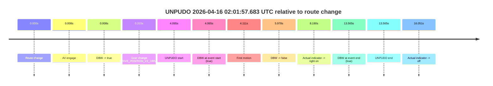
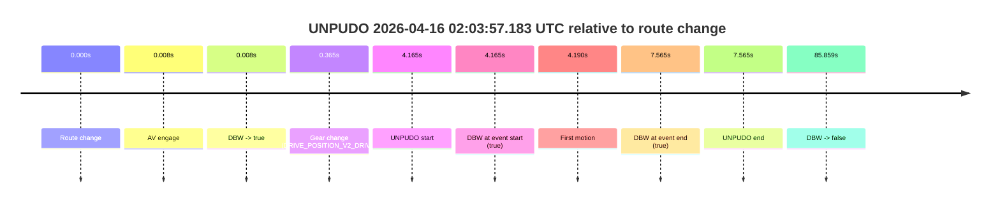
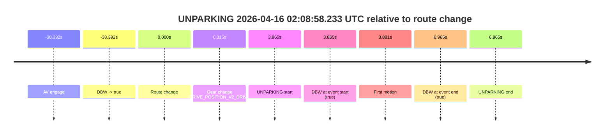

# Run Report: fme10010/2026-04-16--01-57-02--gen2-av-6e4c2864-0a40-47ce-bd88-e148d3f375e5

| Field | Value |
|---|---|
| Run ID | `fme10010/2026-04-16--01-57-02--gen2-av-6e4c2864-0a40-47ce-bd88-e148d3f375e5` |
| Date | `2026-04-16` |
| Model(s) | `eel-teal-outspoken` |
| Author | `zak` |
| Event count | `3` |

## unpudo 2026-04-16 02:01:57.683 UTC

| Field | Value |
|---|---|
| Model | `eel-teal-outspoken` |
| Author | `zak` |
| Run ID | `fme10010/2026-04-16--01-57-02--gen2-av-6e4c2864-0a40-47ce-bd88-e148d3f375e5` |
| Date | `2026-04-16` |
| Time (UTC) | `02:01:57.683` |
| Event type | `unpudo` |
| Disengagement type | `failed_to_accelerate` |
| Route change | `found` |
| Console | [run](https://console.sso.wayve.ai/run/fme10010/2026-04-16--01-57-02--gen2-av-6e4c2864-0a40-47ce-bd88-e148d3f375e5?id=&time-unixus=1776304917683320) |
| Foxglove | [segment](https://app.foxglove.dev/wayve-on-prem/p/prj_0dX18KZdVHg1fmmI/view?ds=foxglove-stream&ds.deviceName=fme10010&ds.start=2026-04-16T02%3A01%3A43.618284Z&ds.end=2026-04-16T02%3A02%3A17.183290Z&layoutId=lay_0e7VD4WIKDQGU73Y&time=2026-04-16T02%3A01%3A57.683320Z) |

### Event card: fail

- Fail: AV owns part of the segment, but the event still resolves as a model-performance failure under the AV-only scoring rule.

| Event | Time (UTC) | Delta from route change |
|---|---:|---:|
| Route change | 2026-04-16 02:01:53.618 | `0.000s` |
| AV engage | 2026-04-16 02:01:53.626 | `0.008s` |
| DBW -> true | 2026-04-16 02:01:53.626 | `0.008s` |
| Gear change (DRIVE_POSITION_V2_DRIVE) | 2026-04-16 02:01:53.933 | `0.315s` |
| UNPUDO start | 2026-04-16 02:01:57.683 | `4.065s` |
| DBW at event start (true) | 2026-04-16 02:01:57.683 | `4.065s` |
| First motion | 2026-04-16 02:01:57.729 | `4.111s` |
| DBW -> false | 2026-04-16 02:01:59.595 | `5.978s` |
| Actual indicator -> right on | 2026-04-16 02:02:01.808 | `8.190s` |
| DBW at event end (true) | 2026-04-16 02:02:07.183 | `13.565s` |
| UNPUDO end | 2026-04-16 02:02:07.183 | `13.565s` |
| Actual indicator -> off | 2026-04-16 02:02:09.669 | `16.051s` |

| Metric | Value |
|---|---|
| Outcome | `fail` |
| Effective failure type | `failed_to_accelerate` |
| Route change status | `found` |
| DBW at event start | `true` |
| DBW at event end | `true` |
| Predicted gear at AV start | `DRIVE_POSITION_V2_PARK` |
| Actual gear at AV start | `DRIVE_POSITION_V2_PARK` |
| Predicted gear at event start | `DRIVE_POSITION_V2_DRIVE` |
| Actual gear at event start | `DRIVE_POSITION_V2_DRIVE` |
| Planned indicator direction | `INDICATORS_STATE_V2_LEFT_ON` |
| Controller indicator direction | `INDICATORS_STATE_V2_LEFT_ON` |
| Actual indicator direction | `INDICATORS_STATE_V2_OFF` |
| Actual indicator at maneuver end | `INDICATORS_STATE_V2_RIGHT_ON` |
| Driver accel help in AV | `false` |
| Driver accel help timestamp | `n/a` |
| Max accel pedal pct in AV | `0.0%` |
| Max brake pedal pct in AV | `25.6%` |
| Max speed mps in AV | `2.525` |
| Success timing baseline | `route change` |
| Route -> AV | `0.008s` |
| AV -> event start | `4.057s` |
| AV -> first motion | `4.103s` |
| Success baseline -> event start | `4.065s` |
| Success baseline -> first motion | `4.111s` |
| AV duration before disengagement | `5.970s` |
| Trajectory waypoint count | `36` |
| Driving-plan step count | `11` |

The scored portion starts from the AV-owned window, not from the pre-AV setup. Route-change search in the stopped pre-event segment was `found`, with the baseline therefore set to route change. At the event anchor the model predicts `DRIVE_POSITION_V2_DRIVE` and the actual gear is `DRIVE_POSITION_V2_DRIVE`. The effective model outcome is `fail` because `failed_to_accelerate.`

### Resolution

| Field | Value |
|---|---|
| Final outcome | `fail` |
| Do we agree with this label? | `yes` |
| Source disengagement type | `failed_to_accelerate` |
| Resolved effective failure type | `failed_to_accelerate` |
| Confidence | `high` |

## unpudo 2026-04-16 02:03:57.183 UTC

| Field | Value |
|---|---|
| Model | `eel-teal-outspoken` |
| Author | `zak` |
| Run ID | `fme10010/2026-04-16--01-57-02--gen2-av-6e4c2864-0a40-47ce-bd88-e148d3f375e5` |
| Date | `2026-04-16` |
| Time (UTC) | `02:03:57.183` |
| Event type | `unpudo` |
| Disengagement type | `none observed` |
| Route change | `found` |
| Console | [run](https://console.sso.wayve.ai/run/fme10010/2026-04-16--01-57-02--gen2-av-6e4c2864-0a40-47ce-bd88-e148d3f375e5?id=&time-unixus=1776305037183295) |
| Foxglove | [segment](https://app.foxglove.dev/wayve-on-prem/p/prj_0dX18KZdVHg1fmmI/view?ds=foxglove-stream&ds.deviceName=fme10010&ds.start=2026-04-16T02%3A03%3A43.018552Z&ds.end=2026-04-16T02%3A05%3A28.878049Z&layoutId=lay_0e7VD4WIKDQGU73Y&time=2026-04-16T02%3A03%3A57.183295Z) |

### Event card: pass

- Pass: AV owns the credited unpudo from route change through the official unpudo window, the gear state is aligned at the anchor, and the vehicle moves without driver accelerator help in AV.

| Event | Time (UTC) | Delta from route change |
|---|---:|---:|
| Route change | 2026-04-16 02:03:53.018 | `0.000s` |
| AV engage | 2026-04-16 02:03:53.026 | `0.008s` |
| DBW -> true | 2026-04-16 02:03:53.026 | `0.008s` |
| Gear change (DRIVE_POSITION_V2_DRIVE) | 2026-04-16 02:03:53.383 | `0.365s` |
| UNPUDO start | 2026-04-16 02:03:57.183 | `4.165s` |
| DBW at event start (true) | 2026-04-16 02:03:57.183 | `4.165s` |
| First motion | 2026-04-16 02:03:57.208 | `4.190s` |
| DBW at event end (true) | 2026-04-16 02:04:00.583 | `7.565s` |
| UNPUDO end | 2026-04-16 02:04:00.583 | `7.565s` |
| DBW -> false | 2026-04-16 02:05:18.878 | `85.859s` |

| Metric | Value |
|---|---|
| Outcome | `pass` |
| Effective failure type | `none` |
| Route change status | `found` |
| DBW at event start | `true` |
| DBW at event end | `true` |
| Predicted gear at AV start | `DRIVE_POSITION_V2_PARK` |
| Actual gear at AV start | `DRIVE_POSITION_V2_PARK` |
| Predicted gear at event start | `DRIVE_POSITION_V2_DRIVE` |
| Actual gear at event start | `DRIVE_POSITION_V2_DRIVE` |
| Planned indicator direction | `INDICATORS_STATE_V2_LEFT_ON` |
| Controller indicator direction | `INDICATORS_STATE_V2_LEFT_ON` |
| Actual indicator direction | `INDICATORS_STATE_V2_OFF` |
| Actual indicator at maneuver end | `INDICATORS_STATE_V2_OFF` |
| Driver accel help in AV | `false` |
| Driver accel help timestamp | `n/a` |
| Max accel pedal pct in AV | `0.0%` |
| Max brake pedal pct in AV | `25.6%` |
| Max speed mps in AV | `5.192` |
| Success timing baseline | `route change` |
| Route -> AV | `0.008s` |
| AV -> event start | `4.157s` |
| AV -> first motion | `4.183s` |
| Success baseline -> event start | `4.165s` |
| Success baseline -> first motion | `4.190s` |
| AV duration before disengagement | `85.852s` |
| Trajectory waypoint count | `36` |
| Driving-plan step count | `11` |

The scored portion starts from the AV-owned window, not from the pre-AV setup. Route-change search in the stopped pre-event segment was `found`, with the baseline therefore set to route change. At the event anchor the model predicts `DRIVE_POSITION_V2_DRIVE` and the actual gear is `DRIVE_POSITION_V2_DRIVE`. The effective model outcome is `pass` because `the credited unpudo stays AV-owned through the official unpudo window.`

### Resolution

| Field | Value |
|---|---|
| Final outcome | `pass` |
| Do we agree with this label? | `yes` |
| Source disengagement type | `none observed` |
| Resolved effective failure type | `none` |
| Confidence | `high` |

## unparking 2026-04-16 02:08:58.233 UTC

| Field | Value |
|---|---|
| Model | `eel-teal-outspoken` |
| Author | `zak` |
| Run ID | `fme10010/2026-04-16--01-57-02--gen2-av-6e4c2864-0a40-47ce-bd88-e148d3f375e5` |
| Date | `2026-04-16` |
| Time (UTC) | `02:08:58.233` |
| Event type | `unparking` |
| Disengagement type | `none observed` |
| Route change | `found` |
| Console | [run](https://console.sso.wayve.ai/run/fme10010/2026-04-16--01-57-02--gen2-av-6e4c2864-0a40-47ce-bd88-e148d3f375e5?id=&time-unixus=1776305338233315) |
| Foxglove | [segment](https://app.foxglove.dev/wayve-on-prem/p/prj_0dX18KZdVHg1fmmI/view?ds=foxglove-stream&ds.deviceName=fme10010&ds.start=2026-04-16T02%3A08%3A05.975957Z&ds.end=2026-04-16T02%3A09%3A11.333293Z&layoutId=lay_0e7VD4WIKDQGU73Y&time=2026-04-16T02%3A08%3A58.233315Z) |

### Event card: pass

- Pass: AV owns the credited unparking through the official event window, the gear state is aligned at the anchor, and the vehicle moves without driver accelerator help in AV.

| Event | Time (UTC) | Delta from route change |
|---|---:|---:|
| AV engage | 2026-04-16 02:08:15.975 | `-38.392s` |
| DBW -> true | 2026-04-16 02:08:15.975 | `-38.392s` |
| Route change | 2026-04-16 02:08:54.368 | `0.000s` |
| Gear change (DRIVE_POSITION_V2_DRIVE) | 2026-04-16 02:08:54.683 | `0.315s` |
| UNPARKING start | 2026-04-16 02:08:58.233 | `3.865s` |
| DBW at event start (true) | 2026-04-16 02:08:58.233 | `3.865s` |
| First motion | 2026-04-16 02:08:58.249 | `3.881s` |
| DBW at event end (true) | 2026-04-16 02:09:01.333 | `6.965s` |
| UNPARKING end | 2026-04-16 02:09:01.333 | `6.965s` |

| Metric | Value |
|---|---|
| Outcome | `pass` |
| Effective failure type | `none` |
| Route change status | `found` |
| DBW at event start | `true` |
| DBW at event end | `true` |
| Predicted gear at AV start | `DRIVE_POSITION_V2_DRIVE` |
| Actual gear at AV start | `DRIVE_POSITION_V2_DRIVE` |
| Predicted gear at event start | `DRIVE_POSITION_V2_DRIVE` |
| Actual gear at event start | `DRIVE_POSITION_V2_DRIVE` |
| Planned indicator direction | `INDICATORS_STATE_V2_OFF` |
| Controller indicator direction | `INDICATORS_STATE_V2_OFF` |
| Actual indicator direction | `INDICATORS_STATE_V2_OFF` |
| Actual indicator at maneuver end | `INDICATORS_STATE_V2_OFF` |
| Driver accel help in AV | `false` |
| Driver accel help timestamp | `n/a` |
| Max accel pedal pct in AV | `0.0%` |
| Max brake pedal pct in AV | `0.0%` |
| Max speed mps in AV | `5.139` |
| Success timing baseline | `AV start` |
| Route -> AV | `-38.392s` |
| AV -> event start | `42.257s` |
| AV -> first motion | `42.273s` |
| Success baseline -> event start | `42.257s` |
| Success baseline -> first motion | `42.273s` |
| AV duration before disengagement | `n/a` |
| Trajectory waypoint count | `37` |
| Driving-plan step count | `11` |

The scored portion starts from the AV-owned window, not from the pre-AV setup. Route-change search in the stopped pre-event segment was `found`, with the baseline therefore set to route change. At the event anchor the model predicts `DRIVE_POSITION_V2_DRIVE` and the actual gear is `DRIVE_POSITION_V2_DRIVE`. The effective model outcome is `pass` because `the credited maneuver stays AV-owned through the official event end.`

### Resolution

| Field | Value |
|---|---|
| Final outcome | `pass` |
| Do we agree with this label? | `yes` |
| Source disengagement type | `none observed` |
| Resolved effective failure type | `none` |
| Confidence | `high` |
