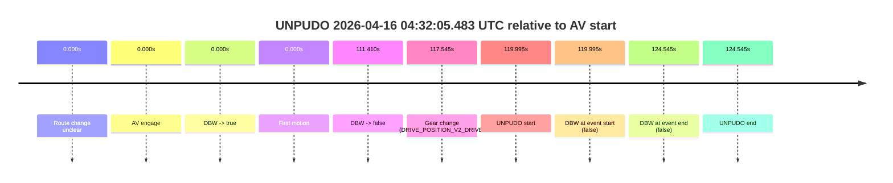
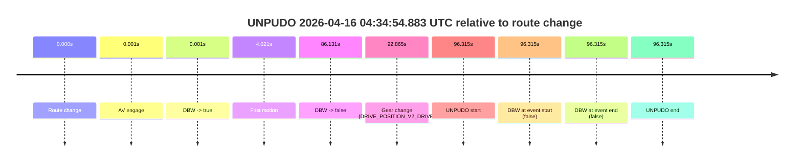

# Run Report: fme10010/2026-04-16--03-38-32--gen2-av-7db86d7e-265e-4355-8c1e-c0e5b36b18b5

| Field | Value |
|---|---|
| Run ID | `fme10010/2026-04-16--03-38-32--gen2-av-7db86d7e-265e-4355-8c1e-c0e5b36b18b5` |
| Date | `2026-04-16` |
| Model(s) | `eel-teal-outspoken` |
| Author | `zak` |
| Event count | `2` |

## unpudo 2026-04-16 04:32:05.483 UTC

| Field | Value |
|---|---|
| Model | `eel-teal-outspoken` |
| Author | `zak` |
| Run ID | `fme10010/2026-04-16--03-38-32--gen2-av-7db86d7e-265e-4355-8c1e-c0e5b36b18b5` |
| Date | `2026-04-16` |
| Time (UTC) | `04:32:05.483` |
| Event type | `unpudo` |
| Disengagement type | `uncategorised` |
| Route change | `unclear` |
| Console | [run](https://console.sso.wayve.ai/run/fme10010/2026-04-16--03-38-32--gen2-av-7db86d7e-265e-4355-8c1e-c0e5b36b18b5?id=&time-unixus=1776313925483323) |
| Foxglove | [segment](https://app.foxglove.dev/wayve-on-prem/p/prj_0dX18KZdVHg1fmmI/view?ds=foxglove-stream&ds.deviceName=fme10010&ds.start=2026-04-16T04%3A29%3A55.488806Z&ds.end=2026-04-16T04%3A32%3A20.033315Z&layoutId=lay_0e7VD4WIKDQGU73Y&time=2026-04-16T04%3A32%3A05.483323Z) |

### Event card: fail

- Fail: AV owns part of the segment, but the event still resolves as a model-performance failure under the AV-only scoring rule.

| Event | Time (UTC) | Delta from AV start |
|---|---:|---:|
| Route change unclear | 2026-04-16 04:30:05.488 | `0.000s` |
| AV engage | 2026-04-16 04:30:05.488 | `0.000s` |
| DBW -> true | 2026-04-16 04:30:05.488 | `0.000s` |
| First motion | 2026-04-16 04:30:05.489 | `0.000s` |
| DBW -> false | 2026-04-16 04:31:56.898 | `111.410s` |
| Gear change (DRIVE_POSITION_V2_DRIVE) | 2026-04-16 04:32:03.033 | `117.545s` |
| UNPUDO start | 2026-04-16 04:32:05.483 | `119.995s` |
| DBW at event start (false) | 2026-04-16 04:32:05.483 | `119.995s` |
| DBW at event end (false) | 2026-04-16 04:32:10.033 | `124.545s` |
| UNPUDO end | 2026-04-16 04:32:10.033 | `124.545s` |

| Metric | Value |
|---|---|
| Outcome | `fail` |
| Effective failure type | `uncategorised` |
| Route change status | `unclear` |
| DBW at event start | `false` |
| DBW at event end | `false` |
| Predicted gear at AV start | `DRIVE_POSITION_V2_DRIVE` |
| Actual gear at AV start | `DRIVE_POSITION_V2_DRIVE` |
| Predicted gear at event start | `DRIVE_POSITION_V2_DRIVE` |
| Actual gear at event start | `DRIVE_POSITION_V2_DRIVE` |
| Planned indicator direction | `INDICATORS_STATE_V2_OFF` |
| Controller indicator direction | `INDICATORS_STATE_V2_OFF` |
| Actual indicator direction | `INDICATORS_STATE_V2_OFF` |
| Actual indicator at maneuver end | `INDICATORS_STATE_V2_OFF` |
| Driver accel help in AV | `false` |
| Driver accel help timestamp | `n/a` |
| Max accel pedal pct in AV | `0.0%` |
| Max brake pedal pct in AV | `28.8%` |
| Max speed mps in AV | `8.281` |
| Success timing baseline | `AV start` |
| Route -> AV | `n/a` |
| AV -> event start | `119.995s` |
| AV -> first motion | `0.000s` |
| Success baseline -> event start | `119.995s` |
| Success baseline -> first motion | `0.000s` |
| AV duration before disengagement | `111.410s` |
| Trajectory waypoint count | `37` |
| Driving-plan step count | `11` |

The scored portion starts from the AV-owned window, not from the pre-AV setup. Route-change search in the stopped pre-event segment was `unclear`, with the baseline therefore set to AV start. At the event anchor the model predicts `DRIVE_POSITION_V2_DRIVE` and the actual gear is `DRIVE_POSITION_V2_DRIVE`. The effective model outcome is `fail` because `uncategorised.`

### Resolution

| Field | Value |
|---|---|
| Final outcome | `fail` |
| Do we agree with this label? | `yes` |
| Source disengagement type | `uncategorised` |
| Resolved effective failure type | `uncategorised` |
| Confidence | `medium` |

## unpudo 2026-04-16 04:34:54.883 UTC

| Field | Value |
|---|---|
| Model | `eel-teal-outspoken` |
| Author | `zak` |
| Run ID | `fme10010/2026-04-16--03-38-32--gen2-av-7db86d7e-265e-4355-8c1e-c0e5b36b18b5` |
| Date | `2026-04-16` |
| Time (UTC) | `04:34:54.883` |
| Event type | `unpudo` |
| Disengagement type | `failed_to_maintain_speed` |
| Route change | `found` |
| Console | [run](https://console.sso.wayve.ai/run/fme10010/2026-04-16--03-38-32--gen2-av-7db86d7e-265e-4355-8c1e-c0e5b36b18b5?id=&time-unixus=1776314094883319) |
| Foxglove | [segment](https://app.foxglove.dev/wayve-on-prem/p/prj_0dX18KZdVHg1fmmI/view?ds=foxglove-stream&ds.deviceName=fme10010&ds.start=2026-04-16T04%3A33%3A08.568233Z&ds.end=2026-04-16T04%3A35%3A04.883319Z&layoutId=lay_0e7VD4WIKDQGU73Y&time=2026-04-16T04%3A34%3A54.883319Z) |

### Event card: fail

- Fail: AV owns part of the segment, but the event still resolves as a model-performance failure under the AV-only scoring rule.

| Event | Time (UTC) | Delta from route change |
|---|---:|---:|
| Route change | 2026-04-16 04:33:18.568 | `0.000s` |
| AV engage | 2026-04-16 04:33:18.569 | `0.001s` |
| DBW -> true | 2026-04-16 04:33:18.569 | `0.001s` |
| First motion | 2026-04-16 04:33:22.588 | `4.021s` |
| DBW -> false | 2026-04-16 04:34:44.698 | `86.131s` |
| Gear change (DRIVE_POSITION_V2_DRIVE) | 2026-04-16 04:34:51.433 | `92.865s` |
| UNPUDO start | 2026-04-16 04:34:54.883 | `96.315s` |
| DBW at event start (false) | 2026-04-16 04:34:54.883 | `96.315s` |
| DBW at event end (false) | 2026-04-16 04:34:54.883 | `96.315s` |
| UNPUDO end | 2026-04-16 04:34:54.883 | `96.315s` |

| Metric | Value |
|---|---|
| Outcome | `fail` |
| Effective failure type | `failed_to_maintain_speed` |
| Route change status | `found` |
| DBW at event start | `false` |
| DBW at event end | `false` |
| Predicted gear at AV start | `DRIVE_POSITION_V2_PARK` |
| Actual gear at AV start | `DRIVE_POSITION_V2_PARK` |
| Predicted gear at event start | `DRIVE_POSITION_V2_DRIVE` |
| Actual gear at event start | `DRIVE_POSITION_V2_DRIVE` |
| Planned indicator direction | `INDICATORS_STATE_V2_OFF` |
| Controller indicator direction | `INDICATORS_STATE_V2_OFF` |
| Actual indicator direction | `INDICATORS_STATE_V2_OFF` |
| Actual indicator at maneuver end | `INDICATORS_STATE_V2_OFF` |
| Driver accel help in AV | `false` |
| Driver accel help timestamp | `n/a` |
| Max accel pedal pct in AV | `0.0%` |
| Max brake pedal pct in AV | `50.0%` |
| Max speed mps in AV | `9.242` |
| Success timing baseline | `route change` |
| Route -> AV | `0.001s` |
| AV -> event start | `96.314s` |
| AV -> first motion | `4.020s` |
| Success baseline -> event start | `96.315s` |
| Success baseline -> first motion | `4.021s` |
| AV duration before disengagement | `86.130s` |
| Trajectory waypoint count | `36` |
| Driving-plan step count | `11` |

The scored portion starts from the AV-owned window, not from the pre-AV setup. Route-change search in the stopped pre-event segment was `found`, with the baseline therefore set to route change. At the event anchor the model predicts `DRIVE_POSITION_V2_DRIVE` and the actual gear is `DRIVE_POSITION_V2_DRIVE`. The effective model outcome is `fail` because `failed_to_maintain_speed.`

### Resolution

| Field | Value |
|---|---|
| Final outcome | `fail` |
| Do we agree with this label? | `yes` |
| Source disengagement type | `failed_to_maintain_speed` |
| Resolved effective failure type | `failed_to_maintain_speed` |
| Confidence | `high` |
