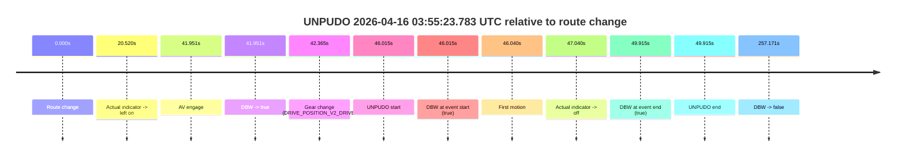
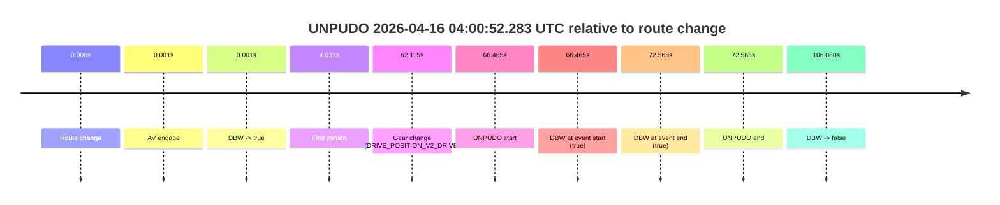
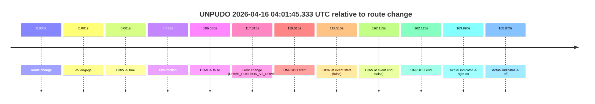
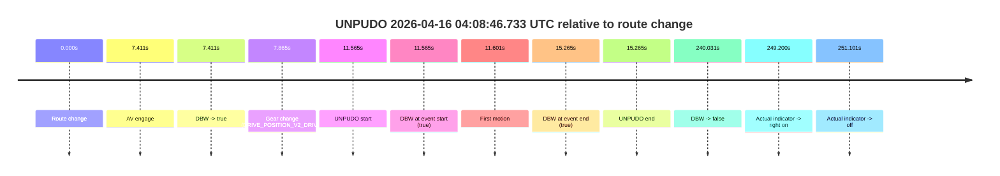
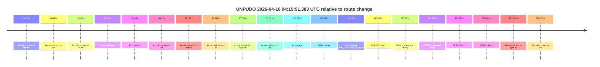
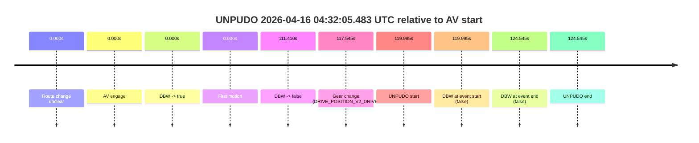
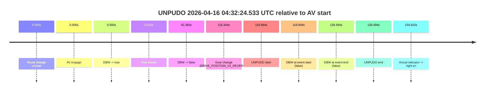
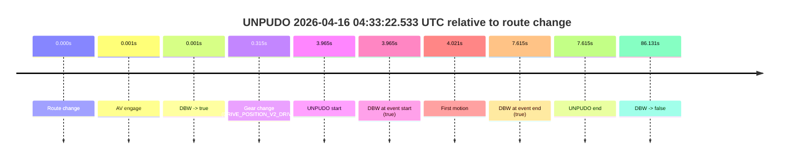
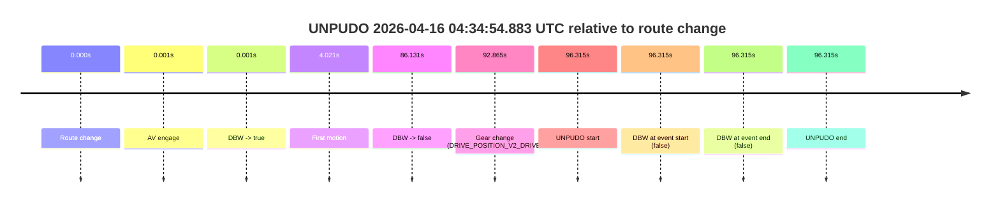
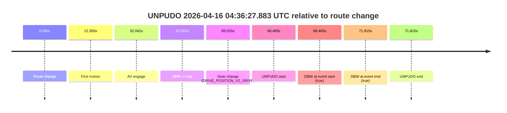

# Run Report: fme10010/2026-04-16--03-38-32--gen2-av-7db86d7e-265e-4355-8c1e-c0e5b36b18b5

| Field | Value |
|---|---|
| Run ID | `fme10010/2026-04-16--03-38-32--gen2-av-7db86d7e-265e-4355-8c1e-c0e5b36b18b5` |
| Date | `2026-04-16` |
| Model(s) | `eel-teal-outspoken` |
| Author | `zak` |
| Event count | `10` |

## unpudo 2026-04-16 03:55:23.783 UTC

| Field | Value |
|---|---|
| Model | `eel-teal-outspoken` |
| Author | `zak` |
| Run ID | `fme10010/2026-04-16--03-38-32--gen2-av-7db86d7e-265e-4355-8c1e-c0e5b36b18b5` |
| Date | `2026-04-16` |
| Time (UTC) | `03:55:23.783` |
| Event type | `unpudo` |
| Disengagement type | `none observed` |
| Route change | `found` |
| Console | [run](https://console.sso.wayve.ai/run/fme10010/2026-04-16--03-38-32--gen2-av-7db86d7e-265e-4355-8c1e-c0e5b36b18b5?id=&time-unixus=1776311723783301) |
| Foxglove | [segment](https://app.foxglove.dev/wayve-on-prem/p/prj_0dX18KZdVHg1fmmI/view?ds=foxglove-stream&ds.deviceName=fme10010&ds.start=2026-04-16T03%3A54%3A27.768264Z&ds.end=2026-04-16T03%3A59%3A04.938821Z&layoutId=lay_0e7VD4WIKDQGU73Y&time=2026-04-16T03%3A55%3A23.783301Z) |

### Event card: pass

- Pass: AV owns the credited unpudo from route change through the official unpudo window, the gear state is aligned at the anchor, and the vehicle moves without driver accelerator help in AV.

| Event | Time (UTC) | Delta from route change |
|---|---:|---:|
| Route change | 2026-04-16 03:54:37.768 | `0.000s` |
| Actual indicator -> left on | 2026-04-16 03:54:58.288 | `20.520s` |
| AV engage | 2026-04-16 03:55:19.719 | `41.951s` |
| DBW -> true | 2026-04-16 03:55:19.719 | `41.951s` |
| Gear change (DRIVE_POSITION_V2_DRIVE) | 2026-04-16 03:55:20.133 | `42.365s` |
| UNPUDO start | 2026-04-16 03:55:23.783 | `46.015s` |
| DBW at event start (true) | 2026-04-16 03:55:23.783 | `46.015s` |
| First motion | 2026-04-16 03:55:23.808 | `46.040s` |
| Actual indicator -> off | 2026-04-16 03:55:24.808 | `47.040s` |
| DBW at event end (true) | 2026-04-16 03:55:27.683 | `49.915s` |
| UNPUDO end | 2026-04-16 03:55:27.683 | `49.915s` |
| DBW -> false | 2026-04-16 03:58:54.938 | `257.171s` |

| Metric | Value |
|---|---|
| Outcome | `pass` |
| Effective failure type | `none` |
| Route change status | `found` |
| DBW at event start | `true` |
| DBW at event end | `true` |
| Predicted gear at AV start | `DRIVE_POSITION_V2_DRIVE` |
| Actual gear at AV start | `DRIVE_POSITION_V2_PARK` |
| Predicted gear at event start | `DRIVE_POSITION_V2_DRIVE` |
| Actual gear at event start | `DRIVE_POSITION_V2_DRIVE` |
| Planned indicator direction | `INDICATORS_STATE_V2_LEFT_ON` |
| Controller indicator direction | `INDICATORS_STATE_V2_LEFT_ON` |
| Actual indicator direction | `INDICATORS_STATE_V2_LEFT_ON` |
| Actual indicator at maneuver end | `INDICATORS_STATE_V2_OFF` |
| Driver accel help in AV | `false` |
| Driver accel help timestamp | `n/a` |
| Max accel pedal pct in AV | `0.0%` |
| Max brake pedal pct in AV | `11.3%` |
| Max speed mps in AV | `4.892` |
| Success timing baseline | `route change` |
| Route -> AV | `41.951s` |
| AV -> event start | `4.064s` |
| AV -> first motion | `4.090s` |
| Success baseline -> event start | `46.015s` |
| Success baseline -> first motion | `46.040s` |
| AV duration before disengagement | `215.220s` |
| Trajectory waypoint count | `37` |
| Driving-plan step count | `11` |

The scored portion starts from the AV-owned window, not from the pre-AV setup. Route-change search in the stopped pre-event segment was `found`, with the baseline therefore set to route change. At the event anchor the model predicts `DRIVE_POSITION_V2_DRIVE` and the actual gear is `DRIVE_POSITION_V2_DRIVE`. The effective model outcome is `pass` because `the credited unpudo stays AV-owned through the official unpudo window.`

### Resolution

| Field | Value |
|---|---|
| Final outcome | `pass` |
| Do we agree with this label? | `yes` |
| Source disengagement type | `none observed` |
| Resolved effective failure type | `none` |
| Confidence | `high` |

## unpudo 2026-04-16 04:00:52.283 UTC

| Field | Value |
|---|---|
| Model | `eel-teal-outspoken` |
| Author | `zak` |
| Run ID | `fme10010/2026-04-16--03-38-32--gen2-av-7db86d7e-265e-4355-8c1e-c0e5b36b18b5` |
| Date | `2026-04-16` |
| Time (UTC) | `04:00:52.283` |
| Event type | `unpudo` |
| Disengagement type | `none observed` |
| Route change | `found` |
| Console | [run](https://console.sso.wayve.ai/run/fme10010/2026-04-16--03-38-32--gen2-av-7db86d7e-265e-4355-8c1e-c0e5b36b18b5?id=&time-unixus=1776312052283304) |
| Foxglove | [segment](https://app.foxglove.dev/wayve-on-prem/p/prj_0dX18KZdVHg1fmmI/view?ds=foxglove-stream&ds.deviceName=fme10010&ds.start=2026-04-16T03%3A59%3A35.818232Z&ds.end=2026-04-16T04%3A01%3A41.898177Z&layoutId=lay_0e7VD4WIKDQGU73Y&time=2026-04-16T04%3A00%3A52.283304Z) |

### Event card: pass

- Pass: AV owns the credited unpudo from route change through the official unpudo window, the gear state is aligned at the anchor, and the vehicle moves without driver accelerator help in AV.

| Event | Time (UTC) | Delta from route change |
|---|---:|---:|
| Route change | 2026-04-16 03:59:45.818 | `0.000s` |
| AV engage | 2026-04-16 03:59:45.819 | `0.001s` |
| DBW -> true | 2026-04-16 03:59:45.819 | `0.001s` |
| First motion | 2026-04-16 03:59:49.849 | `4.031s` |
| Gear change (DRIVE_POSITION_V2_DRIVE) | 2026-04-16 04:00:47.933 | `62.115s` |
| UNPUDO start | 2026-04-16 04:00:52.283 | `66.465s` |
| DBW at event start (true) | 2026-04-16 04:00:52.283 | `66.465s` |
| DBW at event end (true) | 2026-04-16 04:00:58.383 | `72.565s` |
| UNPUDO end | 2026-04-16 04:00:58.383 | `72.565s` |
| DBW -> false | 2026-04-16 04:01:31.898 | `106.080s` |

| Metric | Value |
|---|---|
| Outcome | `pass` |
| Effective failure type | `none` |
| Route change status | `found` |
| DBW at event start | `true` |
| DBW at event end | `true` |
| Predicted gear at AV start | `DRIVE_POSITION_V2_PARK` |
| Actual gear at AV start | `DRIVE_POSITION_V2_PARK` |
| Predicted gear at event start | `DRIVE_POSITION_V2_DRIVE` |
| Actual gear at event start | `DRIVE_POSITION_V2_DRIVE` |
| Planned indicator direction | `INDICATORS_STATE_V2_LEFT_ON` |
| Controller indicator direction | `INDICATORS_STATE_V2_LEFT_ON` |
| Actual indicator direction | `INDICATORS_STATE_V2_OFF` |
| Actual indicator at maneuver end | `INDICATORS_STATE_V2_OFF` |
| Driver accel help in AV | `false` |
| Driver accel help timestamp | `n/a` |
| Max accel pedal pct in AV | `0.0%` |
| Max brake pedal pct in AV | `29.5%` |
| Max speed mps in AV | `7.350` |
| Success timing baseline | `route change` |
| Route -> AV | `0.001s` |
| AV -> event start | `66.464s` |
| AV -> first motion | `4.030s` |
| Success baseline -> event start | `66.465s` |
| Success baseline -> first motion | `4.031s` |
| AV duration before disengagement | `106.079s` |
| Trajectory waypoint count | `37` |
| Driving-plan step count | `11` |

The scored portion starts from the AV-owned window, not from the pre-AV setup. Route-change search in the stopped pre-event segment was `found`, with the baseline therefore set to route change. At the event anchor the model predicts `DRIVE_POSITION_V2_DRIVE` and the actual gear is `DRIVE_POSITION_V2_DRIVE`. The effective model outcome is `pass` because `the credited unpudo stays AV-owned through the official unpudo window.`

### Resolution

| Field | Value |
|---|---|
| Final outcome | `pass` |
| Do we agree with this label? | `yes` |
| Source disengagement type | `none observed` |
| Resolved effective failure type | `none` |
| Confidence | `high` |

## unpudo 2026-04-16 04:01:45.333 UTC

| Field | Value |
|---|---|
| Model | `eel-teal-outspoken` |
| Author | `zak` |
| Run ID | `fme10010/2026-04-16--03-38-32--gen2-av-7db86d7e-265e-4355-8c1e-c0e5b36b18b5` |
| Date | `2026-04-16` |
| Time (UTC) | `04:01:45.333` |
| Event type | `unpudo` |
| Disengagement type | `none observed` |
| Route change | `found` |
| Console | [run](https://console.sso.wayve.ai/run/fme10010/2026-04-16--03-38-32--gen2-av-7db86d7e-265e-4355-8c1e-c0e5b36b18b5?id=&time-unixus=1776312105333291) |
| Foxglove | [segment](https://app.foxglove.dev/wayve-on-prem/p/prj_0dX18KZdVHg1fmmI/view?ds=foxglove-stream&ds.deviceName=fme10010&ds.start=2026-04-16T03%3A59%3A35.818232Z&ds.end=2026-04-16T04%3A02%3A37.933299Z&layoutId=lay_0e7VD4WIKDQGU73Y&time=2026-04-16T04%3A01%3A45.333291Z) |

### Event card: fail

- Fail: the credited unpudo does not stay AV-owned. The event window starts with DBW false, and the maneuver outcome lands outside a clean AV-owned segment.

| Event | Time (UTC) | Delta from route change |
|---|---:|---:|
| Route change | 2026-04-16 03:59:45.818 | `0.000s` |
| AV engage | 2026-04-16 03:59:45.819 | `0.001s` |
| DBW -> true | 2026-04-16 03:59:45.819 | `0.001s` |
| First motion | 2026-04-16 03:59:49.849 | `4.031s` |
| DBW -> false | 2026-04-16 04:01:31.898 | `106.080s` |
| Gear change (DRIVE_POSITION_V2_DRIVE) | 2026-04-16 04:01:43.133 | `117.315s` |
| UNPUDO start | 2026-04-16 04:01:45.333 | `119.515s` |
| DBW at event start (false) | 2026-04-16 04:01:45.333 | `119.515s` |
| DBW at event end (false) | 2026-04-16 04:02:27.933 | `162.115s` |
| UNPUDO end | 2026-04-16 04:02:27.933 | `162.115s` |
| Actual indicator -> right on | 2026-04-16 04:02:29.808 | `163.990s` |
| Actual indicator -> off | 2026-04-16 04:02:31.788 | `165.970s` |

| Metric | Value |
|---|---|
| Outcome | `fail` |
| Effective failure type | `not_av_owned` |
| Route change status | `found` |
| DBW at event start | `false` |
| DBW at event end | `false` |
| Predicted gear at AV start | `DRIVE_POSITION_V2_PARK` |
| Actual gear at AV start | `DRIVE_POSITION_V2_PARK` |
| Predicted gear at event start | `DRIVE_POSITION_V2_DRIVE` |
| Actual gear at event start | `DRIVE_POSITION_V2_DRIVE` |
| Planned indicator direction | `INDICATORS_STATE_V2_OFF` |
| Controller indicator direction | `INDICATORS_STATE_V2_OFF` |
| Actual indicator direction | `INDICATORS_STATE_V2_OFF` |
| Actual indicator at maneuver end | `INDICATORS_STATE_V2_OFF` |
| Driver accel help in AV | `false` |
| Driver accel help timestamp | `n/a` |
| Max accel pedal pct in AV | `0.0%` |
| Max brake pedal pct in AV | `29.5%` |
| Max speed mps in AV | `7.350` |
| Success timing baseline | `route change` |
| Route -> AV | `0.001s` |
| AV -> event start | `119.514s` |
| AV -> first motion | `4.030s` |
| Success baseline -> event start | `119.515s` |
| Success baseline -> first motion | `4.031s` |
| AV duration before disengagement | `106.079s` |
| Trajectory waypoint count | `38` |
| Driving-plan step count | `11` |

The scored portion starts from the AV-owned window, not from the pre-AV setup. Route-change search in the stopped pre-event segment was `found`, with the baseline therefore set to route change. At the event anchor the model predicts `DRIVE_POSITION_V2_DRIVE` and the actual gear is `DRIVE_POSITION_V2_DRIVE`. The effective model outcome is `fail` because `not_av_owned.`

### Resolution

| Field | Value |
|---|---|
| Final outcome | `fail` |
| Do we agree with this label? | `yes` |
| Source disengagement type | `none observed` |
| Resolved effective failure type | `not_av_owned` |
| Confidence | `high` |

## unpudo 2026-04-16 04:08:46.733 UTC

| Field | Value |
|---|---|
| Model | `eel-teal-outspoken` |
| Author | `zak` |
| Run ID | `fme10010/2026-04-16--03-38-32--gen2-av-7db86d7e-265e-4355-8c1e-c0e5b36b18b5` |
| Date | `2026-04-16` |
| Time (UTC) | `04:08:46.733` |
| Event type | `unpudo` |
| Disengagement type | `none observed` |
| Route change | `found` |
| Console | [run](https://console.sso.wayve.ai/run/fme10010/2026-04-16--03-38-32--gen2-av-7db86d7e-265e-4355-8c1e-c0e5b36b18b5?id=&time-unixus=1776312526733312) |
| Foxglove | [segment](https://app.foxglove.dev/wayve-on-prem/p/prj_0dX18KZdVHg1fmmI/view?ds=foxglove-stream&ds.deviceName=fme10010&ds.start=2026-04-16T04%3A08%3A25.168253Z&ds.end=2026-04-16T04%3A12%3A45.198902Z&layoutId=lay_0e7VD4WIKDQGU73Y&time=2026-04-16T04%3A08%3A46.733312Z) |

### Event card: pass

- Pass: AV owns the credited unpudo from route change through the official unpudo window, the gear state is aligned at the anchor, and the vehicle moves without driver accelerator help in AV.

| Event | Time (UTC) | Delta from route change |
|---|---:|---:|
| Route change | 2026-04-16 04:08:35.168 | `0.000s` |
| AV engage | 2026-04-16 04:08:42.579 | `7.411s` |
| DBW -> true | 2026-04-16 04:08:42.579 | `7.411s` |
| Gear change (DRIVE_POSITION_V2_DRIVE) | 2026-04-16 04:08:43.033 | `7.865s` |
| UNPUDO start | 2026-04-16 04:08:46.733 | `11.565s` |
| DBW at event start (true) | 2026-04-16 04:08:46.733 | `11.565s` |
| First motion | 2026-04-16 04:08:46.769 | `11.601s` |
| DBW at event end (true) | 2026-04-16 04:08:50.433 | `15.265s` |
| UNPUDO end | 2026-04-16 04:08:50.433 | `15.265s` |
| DBW -> false | 2026-04-16 04:12:35.198 | `240.031s` |
| Actual indicator -> right on | 2026-04-16 04:12:44.368 | `249.200s` |
| Actual indicator -> off | 2026-04-16 04:12:46.268 | `251.101s` |

| Metric | Value |
|---|---|
| Outcome | `pass` |
| Effective failure type | `none` |
| Route change status | `found` |
| DBW at event start | `true` |
| DBW at event end | `true` |
| Predicted gear at AV start | `DRIVE_POSITION_V2_DRIVE` |
| Actual gear at AV start | `DRIVE_POSITION_V2_PARK` |
| Predicted gear at event start | `DRIVE_POSITION_V2_DRIVE` |
| Actual gear at event start | `DRIVE_POSITION_V2_DRIVE` |
| Planned indicator direction | `INDICATORS_STATE_V2_LEFT_ON` |
| Controller indicator direction | `INDICATORS_STATE_V2_LEFT_ON` |
| Actual indicator direction | `INDICATORS_STATE_V2_OFF` |
| Actual indicator at maneuver end | `INDICATORS_STATE_V2_OFF` |
| Driver accel help in AV | `false` |
| Driver accel help timestamp | `n/a` |
| Max accel pedal pct in AV | `0.0%` |
| Max brake pedal pct in AV | `30.0%` |
| Max speed mps in AV | `4.272` |
| Success timing baseline | `route change` |
| Route -> AV | `7.411s` |
| AV -> event start | `4.154s` |
| AV -> first motion | `4.190s` |
| Success baseline -> event start | `11.565s` |
| Success baseline -> first motion | `11.601s` |
| AV duration before disengagement | `232.620s` |
| Trajectory waypoint count | `38` |
| Driving-plan step count | `11` |

The scored portion starts from the AV-owned window, not from the pre-AV setup. Route-change search in the stopped pre-event segment was `found`, with the baseline therefore set to route change. At the event anchor the model predicts `DRIVE_POSITION_V2_DRIVE` and the actual gear is `DRIVE_POSITION_V2_DRIVE`. The effective model outcome is `pass` because `the credited unpudo stays AV-owned through the official unpudo window.`

### Resolution

| Field | Value |
|---|---|
| Final outcome | `pass` |
| Do we agree with this label? | `yes` |
| Source disengagement type | `none observed` |
| Resolved effective failure type | `none` |
| Confidence | `high` |

## unpudo 2026-04-16 04:15:51.383 UTC

| Field | Value |
|---|---|
| Model | `eel-teal-outspoken` |
| Author | `zak` |
| Run ID | `fme10010/2026-04-16--03-38-32--gen2-av-7db86d7e-265e-4355-8c1e-c0e5b36b18b5` |
| Date | `2026-04-16` |
| Time (UTC) | `04:15:51.383` |
| Event type | `unpudo` |
| Disengagement type | `none observed` |
| Route change | `found` |
| Console | [run](https://console.sso.wayve.ai/run/fme10010/2026-04-16--03-38-32--gen2-av-7db86d7e-265e-4355-8c1e-c0e5b36b18b5?id=&time-unixus=1776312951383303) |
| Foxglove | [segment](https://app.foxglove.dev/wayve-on-prem/p/prj_0dX18KZdVHg1fmmI/view?ds=foxglove-stream&ds.deviceName=fme10010&ds.start=2026-04-16T04%3A13%3A51.218254Z&ds.end=2026-04-16T04%3A17%3A48.078851Z&layoutId=lay_0e7VD4WIKDQGU73Y&time=2026-04-16T04%3A15%3A51.383303Z) |

### Event card: pass

- Pass: AV owns the credited unpudo from route change through the official unpudo window, the gear state is aligned at the anchor, and the vehicle moves without driver accelerator help in AV.

| Event | Time (UTC) | Delta from route change |
|---|---:|---:|
| Actual indicator -> left on | 2026-04-16 04:13:51.748 | `-9.470s` |
| Actual indicator -> off | 2026-04-16 04:13:52.788 | `-8.430s` |
| Actual indicator -> left on | 2026-04-16 04:13:59.568 | `-1.650s` |
| Route change | 2026-04-16 04:14:01.218 | `0.000s` |
| First motion | 2026-04-16 04:14:01.228 | `0.010s` |
| Actual indicator -> off | 2026-04-16 04:14:05.628 | `4.411s` |
| Actual indicator -> left on | 2026-04-16 04:14:12.248 | `11.030s` |
| Actual indicator -> off | 2026-04-16 04:14:25.408 | `24.190s` |
| Actual indicator -> right on | 2026-04-16 04:14:28.348 | `27.130s` |
| Actual indicator -> off | 2026-04-16 04:14:33.868 | `32.651s` |
| AV engage | 2026-04-16 04:15:47.298 | `106.081s` |
| DBW -> true | 2026-04-16 04:15:47.298 | `106.081s` |
| Gear change (DRIVE_POSITION_V2_DRIVE) | 2026-04-16 04:15:47.733 | `106.515s` |
| UNPUDO start | 2026-04-16 04:15:51.383 | `110.165s` |
| DBW at event start (true) | 2026-04-16 04:15:51.383 | `110.165s` |
| DBW at event end (true) | 2026-04-16 04:15:54.883 | `113.665s` |
| UNPUDO end | 2026-04-16 04:15:54.883 | `113.665s` |
| DBW -> false | 2026-04-16 04:17:38.078 | `216.861s` |
| Actual indicator -> right on | 2026-04-16 04:17:38.409 | `217.191s` |
| Actual indicator -> off | 2026-04-16 04:17:41.369 | `220.151s` |

| Metric | Value |
|---|---|
| Outcome | `pass` |
| Effective failure type | `none` |
| Route change status | `found` |
| DBW at event start | `true` |
| DBW at event end | `true` |
| Predicted gear at AV start | `DRIVE_POSITION_V2_DRIVE` |
| Actual gear at AV start | `DRIVE_POSITION_V2_PARK` |
| Predicted gear at event start | `DRIVE_POSITION_V2_DRIVE` |
| Actual gear at event start | `DRIVE_POSITION_V2_DRIVE` |
| Planned indicator direction | `INDICATORS_STATE_V2_LEFT_ON` |
| Controller indicator direction | `INDICATORS_STATE_V2_LEFT_ON` |
| Actual indicator direction | `INDICATORS_STATE_V2_OFF` |
| Actual indicator at maneuver end | `INDICATORS_STATE_V2_OFF` |
| Driver accel help in AV | `false` |
| Driver accel help timestamp | `n/a` |
| Max accel pedal pct in AV | `0.0%` |
| Max brake pedal pct in AV | `11.6%` |
| Max speed mps in AV | `4.964` |
| Success timing baseline | `route change` |
| Route -> AV | `106.081s` |
| AV -> event start | `4.084s` |
| AV -> first motion | `-106.070s` |
| Success baseline -> event start | `110.165s` |
| Success baseline -> first motion | `0.010s` |
| AV duration before disengagement | `110.780s` |
| Trajectory waypoint count | `37` |
| Driving-plan step count | `11` |

The scored portion starts from the AV-owned window, not from the pre-AV setup. Route-change search in the stopped pre-event segment was `found`, with the baseline therefore set to route change. At the event anchor the model predicts `DRIVE_POSITION_V2_DRIVE` and the actual gear is `DRIVE_POSITION_V2_DRIVE`. The effective model outcome is `pass` because `the credited unpudo stays AV-owned through the official unpudo window.`

### Resolution

| Field | Value |
|---|---|
| Final outcome | `pass` |
| Do we agree with this label? | `yes` |
| Source disengagement type | `none observed` |
| Resolved effective failure type | `none` |
| Confidence | `high` |

## unpudo 2026-04-16 04:32:05.483 UTC

| Field | Value |
|---|---|
| Model | `eel-teal-outspoken` |
| Author | `zak` |
| Run ID | `fme10010/2026-04-16--03-38-32--gen2-av-7db86d7e-265e-4355-8c1e-c0e5b36b18b5` |
| Date | `2026-04-16` |
| Time (UTC) | `04:32:05.483` |
| Event type | `unpudo` |
| Disengagement type | `uncategorised` |
| Route change | `unclear` |
| Console | [run](https://console.sso.wayve.ai/run/fme10010/2026-04-16--03-38-32--gen2-av-7db86d7e-265e-4355-8c1e-c0e5b36b18b5?id=&time-unixus=1776313925483323) |
| Foxglove | [segment](https://app.foxglove.dev/wayve-on-prem/p/prj_0dX18KZdVHg1fmmI/view?ds=foxglove-stream&ds.deviceName=fme10010&ds.start=2026-04-16T04%3A29%3A55.488806Z&ds.end=2026-04-16T04%3A32%3A20.033315Z&layoutId=lay_0e7VD4WIKDQGU73Y&time=2026-04-16T04%3A32%3A05.483323Z) |

### Event card: fail

- Fail: AV owns part of the segment, but the event still resolves as a model-performance failure under the AV-only scoring rule.

| Event | Time (UTC) | Delta from AV start |
|---|---:|---:|
| Route change unclear | 2026-04-16 04:30:05.488 | `0.000s` |
| AV engage | 2026-04-16 04:30:05.488 | `0.000s` |
| DBW -> true | 2026-04-16 04:30:05.488 | `0.000s` |
| First motion | 2026-04-16 04:30:05.489 | `0.000s` |
| DBW -> false | 2026-04-16 04:31:56.898 | `111.410s` |
| Gear change (DRIVE_POSITION_V2_DRIVE) | 2026-04-16 04:32:03.033 | `117.545s` |
| UNPUDO start | 2026-04-16 04:32:05.483 | `119.995s` |
| DBW at event start (false) | 2026-04-16 04:32:05.483 | `119.995s` |
| DBW at event end (false) | 2026-04-16 04:32:10.033 | `124.545s` |
| UNPUDO end | 2026-04-16 04:32:10.033 | `124.545s` |

| Metric | Value |
|---|---|
| Outcome | `fail` |
| Effective failure type | `uncategorised` |
| Route change status | `unclear` |
| DBW at event start | `false` |
| DBW at event end | `false` |
| Predicted gear at AV start | `DRIVE_POSITION_V2_DRIVE` |
| Actual gear at AV start | `DRIVE_POSITION_V2_DRIVE` |
| Predicted gear at event start | `DRIVE_POSITION_V2_DRIVE` |
| Actual gear at event start | `DRIVE_POSITION_V2_DRIVE` |
| Planned indicator direction | `INDICATORS_STATE_V2_OFF` |
| Controller indicator direction | `INDICATORS_STATE_V2_OFF` |
| Actual indicator direction | `INDICATORS_STATE_V2_OFF` |
| Actual indicator at maneuver end | `INDICATORS_STATE_V2_OFF` |
| Driver accel help in AV | `false` |
| Driver accel help timestamp | `n/a` |
| Max accel pedal pct in AV | `0.0%` |
| Max brake pedal pct in AV | `28.8%` |
| Max speed mps in AV | `8.281` |
| Success timing baseline | `AV start` |
| Route -> AV | `n/a` |
| AV -> event start | `119.995s` |
| AV -> first motion | `0.000s` |
| Success baseline -> event start | `119.995s` |
| Success baseline -> first motion | `0.000s` |
| AV duration before disengagement | `111.410s` |
| Trajectory waypoint count | `37` |
| Driving-plan step count | `11` |

The scored portion starts from the AV-owned window, not from the pre-AV setup. Route-change search in the stopped pre-event segment was `unclear`, with the baseline therefore set to AV start. At the event anchor the model predicts `DRIVE_POSITION_V2_DRIVE` and the actual gear is `DRIVE_POSITION_V2_DRIVE`. The effective model outcome is `fail` because `uncategorised.`

### Resolution

| Field | Value |
|---|---|
| Final outcome | `fail` |
| Do we agree with this label? | `yes` |
| Source disengagement type | `uncategorised` |
| Resolved effective failure type | `uncategorised` |
| Confidence | `medium` |

## unpudo 2026-04-16 04:32:24.533 UTC

| Field | Value |
|---|---|
| Model | `eel-teal-outspoken` |
| Author | `zak` |
| Run ID | `fme10010/2026-04-16--03-38-32--gen2-av-7db86d7e-265e-4355-8c1e-c0e5b36b18b5` |
| Date | `2026-04-16` |
| Time (UTC) | `04:32:24.533` |
| Event type | `unpudo` |
| Disengagement type | `none observed` |
| Route change | `unclear` |
| Console | [run](https://console.sso.wayve.ai/run/fme10010/2026-04-16--03-38-32--gen2-av-7db86d7e-265e-4355-8c1e-c0e5b36b18b5?id=&time-unixus=1776313944533313) |
| Foxglove | [segment](https://app.foxglove.dev/wayve-on-prem/p/prj_0dX18KZdVHg1fmmI/view?ds=foxglove-stream&ds.deviceName=fme10010&ds.start=2026-04-16T04%3A30%3A14.538930Z&ds.end=2026-04-16T04%3A32%3A54.033312Z&layoutId=lay_0e7VD4WIKDQGU73Y&time=2026-04-16T04%3A32%3A24.533313Z) |

### Event card: fail

- Fail: the credited unpudo does not stay AV-owned. The event window starts with DBW false, and the maneuver outcome lands outside a clean AV-owned segment.

| Event | Time (UTC) | Delta from AV start |
|---|---:|---:|
| Route change unclear | 2026-04-16 04:30:24.538 | `0.000s` |
| AV engage | 2026-04-16 04:30:24.538 | `0.000s` |
| DBW -> true | 2026-04-16 04:30:24.538 | `0.000s` |
| First motion | 2026-04-16 04:30:24.548 | `0.010s` |
| DBW -> false | 2026-04-16 04:31:56.898 | `92.360s` |
| Gear change (DRIVE_POSITION_V2_REVERSE) | 2026-04-16 04:32:20.883 | `116.344s` |
| UNPUDO start | 2026-04-16 04:32:24.533 | `119.994s` |
| DBW at event start (false) | 2026-04-16 04:32:24.533 | `119.994s` |
| DBW at event end (false) | 2026-04-16 04:32:44.033 | `139.494s` |
| UNPUDO end | 2026-04-16 04:32:44.033 | `139.494s` |
| Actual indicator -> right on | 2026-04-16 04:32:59.348 | `154.810s` |

| Metric | Value |
|---|---|
| Outcome | `fail` |
| Effective failure type | `not_av_owned` |
| Route change status | `unclear` |
| DBW at event start | `false` |
| DBW at event end | `false` |
| Predicted gear at AV start | `DRIVE_POSITION_V2_DRIVE` |
| Actual gear at AV start | `DRIVE_POSITION_V2_DRIVE` |
| Predicted gear at event start | `DRIVE_POSITION_V2_REVERSE` |
| Actual gear at event start | `DRIVE_POSITION_V2_REVERSE` |
| Planned indicator direction | `INDICATORS_STATE_V2_OFF` |
| Controller indicator direction | `INDICATORS_STATE_V2_OFF` |
| Actual indicator direction | `INDICATORS_STATE_V2_OFF` |
| Actual indicator at maneuver end | `INDICATORS_STATE_V2_OFF` |
| Driver accel help in AV | `false` |
| Driver accel help timestamp | `n/a` |
| Max accel pedal pct in AV | `0.0%` |
| Max brake pedal pct in AV | `28.8%` |
| Max speed mps in AV | `8.281` |
| Success timing baseline | `AV start` |
| Route -> AV | `n/a` |
| AV -> event start | `119.994s` |
| AV -> first motion | `0.010s` |
| Success baseline -> event start | `119.994s` |
| Success baseline -> first motion | `0.010s` |
| AV duration before disengagement | `92.360s` |
| Trajectory waypoint count | `38` |
| Driving-plan step count | `11` |

The scored portion starts from the AV-owned window, not from the pre-AV setup. Route-change search in the stopped pre-event segment was `unclear`, with the baseline therefore set to AV start. At the event anchor the model predicts `DRIVE_POSITION_V2_REVERSE` and the actual gear is `DRIVE_POSITION_V2_REVERSE`. The effective model outcome is `fail` because `not_av_owned.`

### Resolution

| Field | Value |
|---|---|
| Final outcome | `fail` |
| Do we agree with this label? | `yes` |
| Source disengagement type | `none observed` |
| Resolved effective failure type | `not_av_owned` |
| Confidence | `medium` |

## unpudo 2026-04-16 04:33:22.533 UTC

| Field | Value |
|---|---|
| Model | `eel-teal-outspoken` |
| Author | `zak` |
| Run ID | `fme10010/2026-04-16--03-38-32--gen2-av-7db86d7e-265e-4355-8c1e-c0e5b36b18b5` |
| Date | `2026-04-16` |
| Time (UTC) | `04:33:22.533` |
| Event type | `unpudo` |
| Disengagement type | `none observed` |
| Route change | `found` |
| Console | [run](https://console.sso.wayve.ai/run/fme10010/2026-04-16--03-38-32--gen2-av-7db86d7e-265e-4355-8c1e-c0e5b36b18b5?id=&time-unixus=1776314002533305) |
| Foxglove | [segment](https://app.foxglove.dev/wayve-on-prem/p/prj_0dX18KZdVHg1fmmI/view?ds=foxglove-stream&ds.deviceName=fme10010&ds.start=2026-04-16T04%3A33%3A08.568233Z&ds.end=2026-04-16T04%3A34%3A54.698897Z&layoutId=lay_0e7VD4WIKDQGU73Y&time=2026-04-16T04%3A33%3A22.533305Z) |

### Event card: pass

- Pass: AV owns the credited unpudo from route change through the official unpudo window, the gear state is aligned at the anchor, and the vehicle moves without driver accelerator help in AV.

| Event | Time (UTC) | Delta from route change |
|---|---:|---:|
| Route change | 2026-04-16 04:33:18.568 | `0.000s` |
| AV engage | 2026-04-16 04:33:18.569 | `0.001s` |
| DBW -> true | 2026-04-16 04:33:18.569 | `0.001s` |
| Gear change (DRIVE_POSITION_V2_DRIVE) | 2026-04-16 04:33:18.883 | `0.315s` |
| UNPUDO start | 2026-04-16 04:33:22.533 | `3.965s` |
| DBW at event start (true) | 2026-04-16 04:33:22.533 | `3.965s` |
| First motion | 2026-04-16 04:33:22.588 | `4.021s` |
| DBW at event end (true) | 2026-04-16 04:33:26.183 | `7.615s` |
| UNPUDO end | 2026-04-16 04:33:26.183 | `7.615s` |
| DBW -> false | 2026-04-16 04:34:44.698 | `86.131s` |

| Metric | Value |
|---|---|
| Outcome | `pass` |
| Effective failure type | `none` |
| Route change status | `found` |
| DBW at event start | `true` |
| DBW at event end | `true` |
| Predicted gear at AV start | `DRIVE_POSITION_V2_PARK` |
| Actual gear at AV start | `DRIVE_POSITION_V2_PARK` |
| Predicted gear at event start | `DRIVE_POSITION_V2_DRIVE` |
| Actual gear at event start | `DRIVE_POSITION_V2_DRIVE` |
| Planned indicator direction | `INDICATORS_STATE_V2_LEFT_ON` |
| Controller indicator direction | `INDICATORS_STATE_V2_LEFT_ON` |
| Actual indicator direction | `INDICATORS_STATE_V2_OFF` |
| Actual indicator at maneuver end | `INDICATORS_STATE_V2_OFF` |
| Driver accel help in AV | `false` |
| Driver accel help timestamp | `n/a` |
| Max accel pedal pct in AV | `0.0%` |
| Max brake pedal pct in AV | `29.0%` |
| Max speed mps in AV | `4.469` |
| Success timing baseline | `route change` |
| Route -> AV | `0.001s` |
| AV -> event start | `3.964s` |
| AV -> first motion | `4.020s` |
| Success baseline -> event start | `3.965s` |
| Success baseline -> first motion | `4.021s` |
| AV duration before disengagement | `86.130s` |
| Trajectory waypoint count | `38` |
| Driving-plan step count | `11` |

The scored portion starts from the AV-owned window, not from the pre-AV setup. Route-change search in the stopped pre-event segment was `found`, with the baseline therefore set to route change. At the event anchor the model predicts `DRIVE_POSITION_V2_DRIVE` and the actual gear is `DRIVE_POSITION_V2_DRIVE`. The effective model outcome is `pass` because `the credited unpudo stays AV-owned through the official unpudo window.`

### Resolution

| Field | Value |
|---|---|
| Final outcome | `pass` |
| Do we agree with this label? | `yes` |
| Source disengagement type | `none observed` |
| Resolved effective failure type | `none` |
| Confidence | `high` |

## unpudo 2026-04-16 04:34:54.883 UTC

| Field | Value |
|---|---|
| Model | `eel-teal-outspoken` |
| Author | `zak` |
| Run ID | `fme10010/2026-04-16--03-38-32--gen2-av-7db86d7e-265e-4355-8c1e-c0e5b36b18b5` |
| Date | `2026-04-16` |
| Time (UTC) | `04:34:54.883` |
| Event type | `unpudo` |
| Disengagement type | `failed_to_maintain_speed` |
| Route change | `found` |
| Console | [run](https://console.sso.wayve.ai/run/fme10010/2026-04-16--03-38-32--gen2-av-7db86d7e-265e-4355-8c1e-c0e5b36b18b5?id=&time-unixus=1776314094883319) |
| Foxglove | [segment](https://app.foxglove.dev/wayve-on-prem/p/prj_0dX18KZdVHg1fmmI/view?ds=foxglove-stream&ds.deviceName=fme10010&ds.start=2026-04-16T04%3A33%3A08.568233Z&ds.end=2026-04-16T04%3A35%3A04.883319Z&layoutId=lay_0e7VD4WIKDQGU73Y&time=2026-04-16T04%3A34%3A54.883319Z) |

### Event card: fail

- Fail: AV owns part of the segment, but the event still resolves as a model-performance failure under the AV-only scoring rule.

| Event | Time (UTC) | Delta from route change |
|---|---:|---:|
| Route change | 2026-04-16 04:33:18.568 | `0.000s` |
| AV engage | 2026-04-16 04:33:18.569 | `0.001s` |
| DBW -> true | 2026-04-16 04:33:18.569 | `0.001s` |
| First motion | 2026-04-16 04:33:22.588 | `4.021s` |
| DBW -> false | 2026-04-16 04:34:44.698 | `86.131s` |
| Gear change (DRIVE_POSITION_V2_DRIVE) | 2026-04-16 04:34:51.433 | `92.865s` |
| UNPUDO start | 2026-04-16 04:34:54.883 | `96.315s` |
| DBW at event start (false) | 2026-04-16 04:34:54.883 | `96.315s` |
| DBW at event end (false) | 2026-04-16 04:34:54.883 | `96.315s` |
| UNPUDO end | 2026-04-16 04:34:54.883 | `96.315s` |

| Metric | Value |
|---|---|
| Outcome | `fail` |
| Effective failure type | `failed_to_maintain_speed` |
| Route change status | `found` |
| DBW at event start | `false` |
| DBW at event end | `false` |
| Predicted gear at AV start | `DRIVE_POSITION_V2_PARK` |
| Actual gear at AV start | `DRIVE_POSITION_V2_PARK` |
| Predicted gear at event start | `DRIVE_POSITION_V2_DRIVE` |
| Actual gear at event start | `DRIVE_POSITION_V2_DRIVE` |
| Planned indicator direction | `INDICATORS_STATE_V2_OFF` |
| Controller indicator direction | `INDICATORS_STATE_V2_OFF` |
| Actual indicator direction | `INDICATORS_STATE_V2_OFF` |
| Actual indicator at maneuver end | `INDICATORS_STATE_V2_OFF` |
| Driver accel help in AV | `false` |
| Driver accel help timestamp | `n/a` |
| Max accel pedal pct in AV | `0.0%` |
| Max brake pedal pct in AV | `50.0%` |
| Max speed mps in AV | `9.242` |
| Success timing baseline | `route change` |
| Route -> AV | `0.001s` |
| AV -> event start | `96.314s` |
| AV -> first motion | `4.020s` |
| Success baseline -> event start | `96.315s` |
| Success baseline -> first motion | `4.021s` |
| AV duration before disengagement | `86.130s` |
| Trajectory waypoint count | `36` |
| Driving-plan step count | `11` |

The scored portion starts from the AV-owned window, not from the pre-AV setup. Route-change search in the stopped pre-event segment was `found`, with the baseline therefore set to route change. At the event anchor the model predicts `DRIVE_POSITION_V2_DRIVE` and the actual gear is `DRIVE_POSITION_V2_DRIVE`. The effective model outcome is `fail` because `failed_to_maintain_speed.`

### Resolution

| Field | Value |
|---|---|
| Final outcome | `fail` |
| Do we agree with this label? | `yes` |
| Source disengagement type | `failed_to_maintain_speed` |
| Resolved effective failure type | `failed_to_maintain_speed` |
| Confidence | `high` |

## unpudo 2026-04-16 04:36:27.883 UTC

| Field | Value |
|---|---|
| Model | `eel-teal-outspoken` |
| Author | `zak` |
| Run ID | `fme10010/2026-04-16--03-38-32--gen2-av-7db86d7e-265e-4355-8c1e-c0e5b36b18b5` |
| Date | `2026-04-16` |
| Time (UTC) | `04:36:27.883` |
| Event type | `unpudo` |
| Disengagement type | `none observed` |
| Route change | `found` |
| Console | [run](https://console.sso.wayve.ai/run/fme10010/2026-04-16--03-38-32--gen2-av-7db86d7e-265e-4355-8c1e-c0e5b36b18b5?id=&time-unixus=1776314187883322) |
| Foxglove | [segment](https://app.foxglove.dev/wayve-on-prem/p/prj_0dX18KZdVHg1fmmI/view?ds=foxglove-stream&ds.deviceName=fme10010&ds.start=2026-04-16T04%3A35%3A09.418237Z&ds.end=2026-04-16T04%3A36%3A41.233303Z&layoutId=lay_0e7VD4WIKDQGU73Y&time=2026-04-16T04%3A36%3A27.883322Z) |

### Event card: pass

- Pass: AV owns the credited unpudo from route change through the official unpudo window, the gear state is aligned at the anchor, and the vehicle moves without driver accelerator help in AV.

| Event | Time (UTC) | Delta from route change |
|---|---:|---:|
| Route change | 2026-04-16 04:35:19.418 | `0.000s` |
| First motion | 2026-04-16 04:35:31.768 | `12.350s` |
| AV engage | 2026-04-16 04:35:51.460 | `32.042s` |
| DBW -> true | 2026-04-16 04:35:51.460 | `32.042s` |
| Gear change (DRIVE_POSITION_V2_DRIVE) | 2026-04-16 04:36:24.433 | `65.015s` |
| UNPUDO start | 2026-04-16 04:36:27.883 | `68.465s` |
| DBW at event start (true) | 2026-04-16 04:36:27.883 | `68.465s` |
| DBW at event end (true) | 2026-04-16 04:36:31.233 | `71.815s` |
| UNPUDO end | 2026-04-16 04:36:31.233 | `71.815s` |

| Metric | Value |
|---|---|
| Outcome | `pass` |
| Effective failure type | `none` |
| Route change status | `found` |
| DBW at event start | `true` |
| DBW at event end | `true` |
| Predicted gear at AV start | `DRIVE_POSITION_V2_DRIVE` |
| Actual gear at AV start | `DRIVE_POSITION_V2_DRIVE` |
| Predicted gear at event start | `DRIVE_POSITION_V2_DRIVE` |
| Actual gear at event start | `DRIVE_POSITION_V2_DRIVE` |
| Planned indicator direction | `INDICATORS_STATE_V2_LEFT_ON` |
| Controller indicator direction | `INDICATORS_STATE_V2_LEFT_ON` |
| Actual indicator direction | `INDICATORS_STATE_V2_OFF` |
| Actual indicator at maneuver end | `INDICATORS_STATE_V2_OFF` |
| Driver accel help in AV | `false` |
| Driver accel help timestamp | `n/a` |
| Max accel pedal pct in AV | `0.0%` |
| Max brake pedal pct in AV | `21.2%` |
| Max speed mps in AV | `4.764` |
| Success timing baseline | `route change` |
| Route -> AV | `32.042s` |
| AV -> event start | `36.423s` |
| AV -> first motion | `-19.691s` |
| Success baseline -> event start | `68.465s` |
| Success baseline -> first motion | `12.350s` |
| AV duration before disengagement | `n/a` |
| Trajectory waypoint count | `37` |
| Driving-plan step count | `11` |

The scored portion starts from the AV-owned window, not from the pre-AV setup. Route-change search in the stopped pre-event segment was `found`, with the baseline therefore set to route change. At the event anchor the model predicts `DRIVE_POSITION_V2_DRIVE` and the actual gear is `DRIVE_POSITION_V2_DRIVE`. The effective model outcome is `pass` because `the credited unpudo stays AV-owned through the official unpudo window.`

### Resolution

| Field | Value |
|---|---|
| Final outcome | `pass` |
| Do we agree with this label? | `yes` |
| Source disengagement type | `none observed` |
| Resolved effective failure type | `none` |
| Confidence | `high` |
