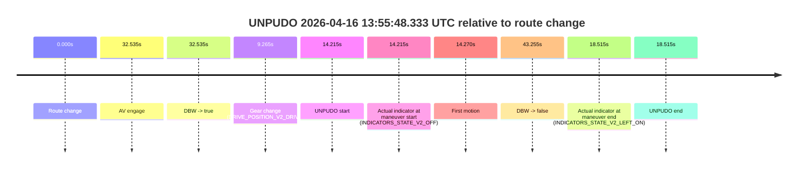
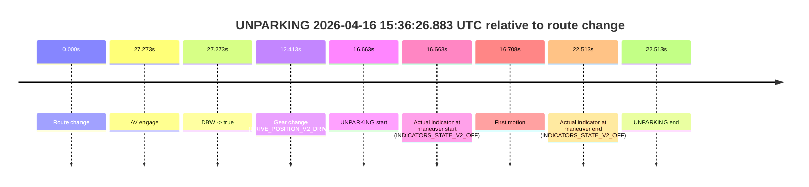

# Run Report: fme10010/2026-04-16--13-29-57--gen2-av-66cad64b-fd64-4d4c-86e0-354eb6b0c608

| Field | Value |
|---|---|
| Run ID | `fme10010/2026-04-16--13-29-57--gen2-av-66cad64b-fd64-4d4c-86e0-354eb6b0c608` |
| Date | `2026-04-16` |
| Model(s) | `plum-timeless-beaver` |
| Author | `peng.tang` |
| Event count | `11` |

## unpudo 2026-04-16 13:55:48.333 UTC

| Field | Value |
|---|---|
| Model | `plum-timeless-beaver` |
| Author | `peng.tang` |
| Run ID | `fme10010/2026-04-16--13-29-57--gen2-av-66cad64b-fd64-4d4c-86e0-354eb6b0c608` |
| Date | `2026-04-16` |
| Time (UTC) | `13:55:48.333` |
| Event type | `unpudo` |
| Disengagement type | `failed_to_unpudo` |
| Route change | `found` |
| Console | [run](https://console.sso.wayve.ai/run/fme10010/2026-04-16--13-29-57--gen2-av-66cad64b-fd64-4d4c-86e0-354eb6b0c608?id=&time-unixus=1776347748333314) |
| Foxglove | [segment](https://app.foxglove.dev/wayve-on-prem/p/prj_0dX18KZdVHg1fmmI/view?ds=foxglove-stream&ds.deviceName=fme10010&ds.start=2026-04-16T13%3A55%3A24.118445Z&ds.end=2026-04-16T13%3A56%3A27.372948Z&layoutId=lay_0e7VD4WIKDQGU73Y&time=2026-04-16T13%3A55%3A48.333314Z) |

### Event card: accidental

- Accidental: AV ownership is present for less than `2s`, so this is treated as an accidental brush with the maneuver rather than a meaningful model attempt.

| Event | Time (UTC) | Delta from route change |
|---|---:|---:|
| Route change | 2026-04-16 13:55:34.118 | `0.000s` |
| AV engage | 2026-04-16 13:56:06.653 | `32.535s` |
| DBW -> true | 2026-04-16 13:56:06.653 | `32.535s` |
| Gear change (DRIVE_POSITION_V2_DRIVE) | 2026-04-16 13:55:43.383 | `9.265s` |
| UNPUDO start | 2026-04-16 13:55:48.333 | `14.215s` |
| Actual indicator at maneuver start (INDICATORS_STATE_V2_OFF) | 2026-04-16 13:55:48.333 | `14.215s` |
| First motion | 2026-04-16 13:55:48.388 | `14.270s` |
| DBW -> false | 2026-04-16 13:56:17.372 | `43.255s` |
| Actual indicator at maneuver end (INDICATORS_STATE_V2_LEFT_ON) | 2026-04-16 13:55:52.633 | `18.515s` |
| UNPUDO end | 2026-04-16 13:55:52.633 | `18.515s` |

| Metric | Value |
|---|---|
| Outcome | `accidental` |
| Effective failure type | `none` |
| Route change status | `found` |
| DBW at event start | `false` |
| DBW at event end | `false` |
| Predicted gear at AV start | `DRIVE_POSITION_V2_DRIVE` |
| Actual gear at AV start | `DRIVE_POSITION_V2_DRIVE` |
| Predicted gear at event start | `DRIVE_POSITION_V2_DRIVE` |
| Actual gear at event start | `DRIVE_POSITION_V2_DRIVE` |
| Planned indicator direction | `INDICATORS_STATE_V2_OFF` |
| Controller indicator direction | `INDICATORS_STATE_V2_OFF` |
| Actual indicator direction | `INDICATORS_STATE_V2_OFF` |
| Actual indicator at maneuver end | `INDICATORS_STATE_V2_LEFT_ON` |
| Driver accel help in AV | `false` |
| Driver accel help timestamp | `n/a` |
| Max accel pedal pct in AV | `0.0%` |
| Max brake pedal pct in AV | `0.0%` |
| Max speed mps in AV | `0.000` |
| Route -> AV | `32.535s` |
| AV -> event start | `-18.320s` |
| AV -> first motion | `-18.264s` |
| AV duration before disengagement | `10.720s` |
| Trajectory waypoint count | `36` |
| Driving-plan step count | `11` |

The scored portion starts from the AV-owned window, not from the pre-AV setup. Route-change search in the stopped pre-event segment was `found`, with the baseline therefore set to route change. At the event anchor the model predicts `DRIVE_POSITION_V2_DRIVE` and the actual gear is `DRIVE_POSITION_V2_DRIVE`. The effective model outcome is `accidental` because `the AV-owned portion is shorter than 2s`.

### Resolution

| Field | Value |
|---|---|
| Final outcome | `accidental` |
| Do we agree with this label? | `yes` |
| Source disengagement type | `failed_to_unpudo` |
| Resolved effective failure type | `none` |
| Confidence | `high` |

## unpudo 2026-04-16 13:56:00.133 UTC

| Field | Value |
|---|---|
| Model | `plum-timeless-beaver` |
| Author | `peng.tang` |
| Run ID | `fme10010/2026-04-16--13-29-57--gen2-av-66cad64b-fd64-4d4c-86e0-354eb6b0c608` |
| Date | `2026-04-16` |
| Time (UTC) | `13:56:00.133` |
| Event type | `unpudo` |
| Disengagement type | `failed_to_unpudo` |
| Route change | `found` |
| Console | [run](https://console.sso.wayve.ai/run/fme10010/2026-04-16--13-29-57--gen2-av-66cad64b-fd64-4d4c-86e0-354eb6b0c608?id=&time-unixus=1776347760133297) |
| Foxglove | [segment](https://app.foxglove.dev/wayve-on-prem/p/prj_0dX18KZdVHg1fmmI/view?ds=foxglove-stream&ds.deviceName=fme10010&ds.start=2026-04-16T13%3A55%3A24.118445Z&ds.end=2026-04-16T13%3A56%3A27.372948Z&layoutId=lay_0e7VD4WIKDQGU73Y&time=2026-04-16T13%3A56%3A00.133297Z) |

### Event card: accidental

- Accidental: AV ownership is present for less than `2s`, so this is treated as an accidental brush with the maneuver rather than a meaningful model attempt.

| Event | Time (UTC) | Delta from route change |
|---|---:|---:|
| Route change | 2026-04-16 13:55:34.118 | `0.000s` |
| AV engage | 2026-04-16 13:56:06.653 | `32.535s` |
| DBW -> true | 2026-04-16 13:56:06.653 | `32.535s` |
| Gear change (DRIVE_POSITION_V2_REVERSE) | 2026-04-16 13:55:55.383 | `21.265s` |
| UNPUDO start | 2026-04-16 13:56:00.133 | `26.015s` |
| Actual indicator at maneuver start (INDICATORS_STATE_V2_OFF) | 2026-04-16 13:56:00.133 | `26.015s` |
| First motion | 2026-04-16 13:56:02.589 | `28.471s` |
| DBW -> false | 2026-04-16 13:56:17.372 | `43.255s` |
| Actual indicator at maneuver end (INDICATORS_STATE_V2_OFF) | 2026-04-16 13:56:06.483 | `32.365s` |
| UNPUDO end | 2026-04-16 13:56:06.483 | `32.365s` |

| Metric | Value |
|---|---|
| Outcome | `accidental` |
| Effective failure type | `none` |
| Route change status | `found` |
| DBW at event start | `false` |
| DBW at event end | `false` |
| Predicted gear at AV start | `DRIVE_POSITION_V2_DRIVE` |
| Actual gear at AV start | `DRIVE_POSITION_V2_DRIVE` |
| Predicted gear at event start | `DRIVE_POSITION_V2_REVERSE` |
| Actual gear at event start | `DRIVE_POSITION_V2_REVERSE` |
| Planned indicator direction | `INDICATORS_STATE_V2_OFF` |
| Controller indicator direction | `INDICATORS_STATE_V2_OFF` |
| Actual indicator direction | `INDICATORS_STATE_V2_OFF` |
| Actual indicator at maneuver end | `INDICATORS_STATE_V2_OFF` |
| Driver accel help in AV | `false` |
| Driver accel help timestamp | `n/a` |
| Max accel pedal pct in AV | `0.0%` |
| Max brake pedal pct in AV | `0.0%` |
| Max speed mps in AV | `0.000` |
| Route -> AV | `32.535s` |
| AV -> event start | `-6.520s` |
| AV -> first motion | `-4.064s` |
| AV duration before disengagement | `10.720s` |
| Trajectory waypoint count | `36` |
| Driving-plan step count | `11` |

The scored portion starts from the AV-owned window, not from the pre-AV setup. Route-change search in the stopped pre-event segment was `found`, with the baseline therefore set to route change. At the event anchor the model predicts `DRIVE_POSITION_V2_REVERSE` and the actual gear is `DRIVE_POSITION_V2_REVERSE`. The effective model outcome is `accidental` because `the AV-owned portion is shorter than 2s`.

### Resolution

| Field | Value |
|---|---|
| Final outcome | `accidental` |
| Do we agree with this label? | `yes` |
| Source disengagement type | `failed_to_unpudo` |
| Resolved effective failure type | `none` |
| Confidence | `high` |

## unpudo 2026-04-16 13:59:09.183 UTC

| Field | Value |
|---|---|
| Model | `plum-timeless-beaver` |
| Author | `peng.tang` |
| Run ID | `fme10010/2026-04-16--13-29-57--gen2-av-66cad64b-fd64-4d4c-86e0-354eb6b0c608` |
| Date | `2026-04-16` |
| Time (UTC) | `13:59:09.183` |
| Event type | `unpudo` |
| Disengagement type | `failed_to_unpudo` |
| Route change | `found` |
| Console | [run](https://console.sso.wayve.ai/run/fme10010/2026-04-16--13-29-57--gen2-av-66cad64b-fd64-4d4c-86e0-354eb6b0c608?id=&time-unixus=1776347949183312) |
| Foxglove | [segment](https://app.foxglove.dev/wayve-on-prem/p/prj_0dX18KZdVHg1fmmI/view?ds=foxglove-stream&ds.deviceName=fme10010&ds.start=2026-04-16T13%3A58%3A43.968587Z&ds.end=2026-04-16T14%3A00%3A10.593030Z&layoutId=lay_0e7VD4WIKDQGU73Y&time=2026-04-16T13%3A59%3A09.183312Z) |

### Event card: non-av

- Non-AV: the detected unpudo starts outside AV ownership, so it is kept for coverage but excluded from model success / failure scoring.

| Event | Time (UTC) | Delta from route change |
|---|---:|---:|
| Route change | 2026-04-16 13:58:53.968 | `0.000s` |
| AV engage | 2026-04-16 13:59:17.954 | `23.986s` |
| DBW -> true | 2026-04-16 13:59:17.954 | `23.986s` |
| Gear change (DRIVE_POSITION_V2_REVERSE) | 2026-04-16 13:58:59.383 | `5.415s` |
| UNPUDO start | 2026-04-16 13:59:09.183 | `15.215s` |
| Actual indicator at maneuver start (INDICATORS_STATE_V2_OFF) | 2026-04-16 13:59:09.183 | `15.215s` |
| First motion | 2026-04-16 13:59:13.908 | `19.940s` |
| DBW -> false | 2026-04-16 14:00:00.593 | `66.624s` |
| Actual indicator at maneuver end (INDICATORS_STATE_V2_OFF) | 2026-04-16 13:59:22.333 | `28.365s` |
| UNPUDO end | 2026-04-16 13:59:22.333 | `28.365s` |

| Metric | Value |
|---|---|
| Outcome | `non-av` |
| Effective failure type | `none` |
| Route change status | `found` |
| DBW at event start | `false` |
| DBW at event end | `true` |
| Predicted gear at AV start | `DRIVE_POSITION_V2_DRIVE` |
| Actual gear at AV start | `DRIVE_POSITION_V2_DRIVE` |
| Predicted gear at event start | `DRIVE_POSITION_V2_REVERSE` |
| Actual gear at event start | `DRIVE_POSITION_V2_REVERSE` |
| Planned indicator direction | `INDICATORS_STATE_V2_OFF` |
| Controller indicator direction | `INDICATORS_STATE_V2_OFF` |
| Actual indicator direction | `INDICATORS_STATE_V2_OFF` |
| Actual indicator at maneuver end | `INDICATORS_STATE_V2_OFF` |
| Driver accel help in AV | `false` |
| Driver accel help timestamp | `n/a` |
| Max accel pedal pct in AV | `0.0%` |
| Max brake pedal pct in AV | `0.0%` |
| Max speed mps in AV | `2.244` |
| Route -> AV | `23.986s` |
| AV -> event start | `-8.771s` |
| AV -> first motion | `-4.045s` |
| AV duration before disengagement | `42.639s` |
| Trajectory waypoint count | `37` |
| Driving-plan step count | `11` |

The scored portion starts from the AV-owned window, not from the pre-AV setup. Route-change search in the stopped pre-event segment was `found`, with the baseline therefore set to route change. At the event anchor the model predicts `DRIVE_POSITION_V2_REVERSE` and the actual gear is `DRIVE_POSITION_V2_REVERSE`. The effective model outcome is `non-av` because `the event does not begin in AV ownership`.

### Resolution

| Field | Value |
|---|---|
| Final outcome | `non-av` |
| Do we agree with this label? | `yes` |
| Source disengagement type | `failed_to_unpudo` |
| Resolved effective failure type | `none` |
| Confidence | `high` |

## unpudo 2026-04-16 14:18:37.783 UTC

| Field | Value |
|---|---|
| Model | `plum-timeless-beaver` |
| Author | `peng.tang` |
| Run ID | `fme10010/2026-04-16--13-29-57--gen2-av-66cad64b-fd64-4d4c-86e0-354eb6b0c608` |
| Date | `2026-04-16` |
| Time (UTC) | `14:18:37.783` |
| Event type | `unpudo` |
| Disengagement type | `failed_to_unpudo` |
| Route change | `found` |
| Console | [run](https://console.sso.wayve.ai/run/fme10010/2026-04-16--13-29-57--gen2-av-66cad64b-fd64-4d4c-86e0-354eb6b0c608?id=&time-unixus=1776349117783308) |
| Foxglove | [segment](https://app.foxglove.dev/wayve-on-prem/p/prj_0dX18KZdVHg1fmmI/view?ds=foxglove-stream&ds.deviceName=fme10010&ds.start=2026-04-16T14%3A17%3A56.968276Z&ds.end=2026-04-16T14%3A20%3A12.472977Z&layoutId=lay_0e7VD4WIKDQGU73Y&time=2026-04-16T14%3A18%3A37.783308Z) |

### Event card: accidental

- Accidental: AV ownership is present for less than `2s`, so this is treated as an accidental brush with the maneuver rather than a meaningful model attempt.

| Event | Time (UTC) | Delta from route change |
|---|---:|---:|
| Route change | 2026-04-16 14:18:06.968 | `0.000s` |
| AV engage | 2026-04-16 14:18:44.834 | `37.866s` |
| DBW -> true | 2026-04-16 14:18:44.834 | `37.866s` |
| Gear change (DRIVE_POSITION_V2_DRIVE) | 2026-04-16 14:18:30.733 | `23.765s` |
| UNPUDO start | 2026-04-16 14:18:37.783 | `30.815s` |
| Actual indicator at maneuver start (INDICATORS_STATE_V2_OFF) | 2026-04-16 14:18:37.783 | `30.815s` |
| First motion | 2026-04-16 14:18:38.209 | `31.241s` |
| DBW -> false | 2026-04-16 14:20:02.472 | `115.505s` |
| Actual indicator at maneuver end (INDICATORS_STATE_V2_OFF) | 2026-04-16 14:18:43.383 | `36.415s` |
| UNPUDO end | 2026-04-16 14:18:43.383 | `36.415s` |

| Metric | Value |
|---|---|
| Outcome | `accidental` |
| Effective failure type | `none` |
| Route change status | `found` |
| DBW at event start | `false` |
| DBW at event end | `false` |
| Predicted gear at AV start | `DRIVE_POSITION_V2_DRIVE` |
| Actual gear at AV start | `DRIVE_POSITION_V2_DRIVE` |
| Predicted gear at event start | `DRIVE_POSITION_V2_DRIVE` |
| Actual gear at event start | `DRIVE_POSITION_V2_DRIVE` |
| Planned indicator direction | `INDICATORS_STATE_V2_LEFT_ON` |
| Controller indicator direction | `INDICATORS_STATE_V2_LEFT_ON` |
| Actual indicator direction | `INDICATORS_STATE_V2_OFF` |
| Actual indicator at maneuver end | `INDICATORS_STATE_V2_OFF` |
| Driver accel help in AV | `false` |
| Driver accel help timestamp | `n/a` |
| Max accel pedal pct in AV | `0.0%` |
| Max brake pedal pct in AV | `0.0%` |
| Max speed mps in AV | `0.000` |
| Route -> AV | `37.866s` |
| AV -> event start | `-7.051s` |
| AV -> first motion | `-6.625s` |
| AV duration before disengagement | `77.639s` |
| Trajectory waypoint count | `37` |
| Driving-plan step count | `11` |

The scored portion starts from the AV-owned window, not from the pre-AV setup. Route-change search in the stopped pre-event segment was `found`, with the baseline therefore set to route change. At the event anchor the model predicts `DRIVE_POSITION_V2_DRIVE` and the actual gear is `DRIVE_POSITION_V2_DRIVE`. The effective model outcome is `accidental` because `the AV-owned portion is shorter than 2s`.

### Resolution

| Field | Value |
|---|---|
| Final outcome | `accidental` |
| Do we agree with this label? | `yes` |
| Source disengagement type | `failed_to_unpudo` |
| Resolved effective failure type | `none` |
| Confidence | `high` |

## unpudo 2026-04-16 14:22:41.633 UTC

| Field | Value |
|---|---|
| Model | `plum-timeless-beaver` |
| Author | `peng.tang` |
| Run ID | `fme10010/2026-04-16--13-29-57--gen2-av-66cad64b-fd64-4d4c-86e0-354eb6b0c608` |
| Date | `2026-04-16` |
| Time (UTC) | `14:22:41.633` |
| Event type | `unpudo` |
| Disengagement type | `failed_to_unpudo` |
| Route change | `found` |
| Console | [run](https://console.sso.wayve.ai/run/fme10010/2026-04-16--13-29-57--gen2-av-66cad64b-fd64-4d4c-86e0-354eb6b0c608?id=&time-unixus=1776349361633306) |
| Foxglove | [segment](https://app.foxglove.dev/wayve-on-prem/p/prj_0dX18KZdVHg1fmmI/view?ds=foxglove-stream&ds.deviceName=fme10010&ds.start=2026-04-16T14%3A22%3A16.118213Z&ds.end=2026-04-16T14%3A26%3A14.174119Z&layoutId=lay_0e7VD4WIKDQGU73Y&time=2026-04-16T14%3A22%3A41.633306Z) |

### Event card: accidental

- Accidental: AV ownership is present for less than `2s`, so this is treated as an accidental brush with the maneuver rather than a meaningful model attempt.

| Event | Time (UTC) | Delta from route change |
|---|---:|---:|
| Route change | 2026-04-16 14:22:26.118 | `0.000s` |
| AV engage | 2026-04-16 14:22:47.733 | `21.615s` |
| DBW -> true | 2026-04-16 14:22:47.733 | `21.615s` |
| Gear change (DRIVE_POSITION_V2_DRIVE) | 2026-04-16 14:22:34.283 | `8.165s` |
| UNPUDO start | 2026-04-16 14:22:41.633 | `15.515s` |
| Actual indicator at maneuver start (INDICATORS_STATE_V2_LEFT_ON) | 2026-04-16 14:22:41.633 | `15.515s` |
| First motion | 2026-04-16 14:22:41.748 | `15.631s` |
| DBW -> false | 2026-04-16 14:26:04.174 | `218.056s` |
| Actual indicator at maneuver end (INDICATORS_STATE_V2_OFF) | 2026-04-16 14:22:45.933 | `19.815s` |
| UNPUDO end | 2026-04-16 14:22:45.933 | `19.815s` |

| Metric | Value |
|---|---|
| Outcome | `accidental` |
| Effective failure type | `none` |
| Route change status | `found` |
| DBW at event start | `false` |
| DBW at event end | `false` |
| Predicted gear at AV start | `DRIVE_POSITION_V2_DRIVE` |
| Actual gear at AV start | `DRIVE_POSITION_V2_DRIVE` |
| Predicted gear at event start | `DRIVE_POSITION_V2_DRIVE` |
| Actual gear at event start | `DRIVE_POSITION_V2_DRIVE` |
| Planned indicator direction | `INDICATORS_STATE_V2_LEFT_ON` |
| Controller indicator direction | `INDICATORS_STATE_V2_LEFT_ON` |
| Actual indicator direction | `INDICATORS_STATE_V2_LEFT_ON` |
| Actual indicator at maneuver end | `INDICATORS_STATE_V2_OFF` |
| Driver accel help in AV | `false` |
| Driver accel help timestamp | `n/a` |
| Max accel pedal pct in AV | `0.0%` |
| Max brake pedal pct in AV | `0.0%` |
| Max speed mps in AV | `0.000` |
| Route -> AV | `21.615s` |
| AV -> event start | `-6.100s` |
| AV -> first motion | `-5.984s` |
| AV duration before disengagement | `196.441s` |
| Trajectory waypoint count | `36` |
| Driving-plan step count | `11` |

The scored portion starts from the AV-owned window, not from the pre-AV setup. Route-change search in the stopped pre-event segment was `found`, with the baseline therefore set to route change. At the event anchor the model predicts `DRIVE_POSITION_V2_DRIVE` and the actual gear is `DRIVE_POSITION_V2_DRIVE`. The effective model outcome is `accidental` because `the AV-owned portion is shorter than 2s`.

### Resolution

| Field | Value |
|---|---|
| Final outcome | `accidental` |
| Do we agree with this label? | `yes` |
| Source disengagement type | `failed_to_unpudo` |
| Resolved effective failure type | `none` |
| Confidence | `high` |

## unpudo 2026-04-16 14:28:41.133 UTC

| Field | Value |
|---|---|
| Model | `plum-timeless-beaver` |
| Author | `peng.tang` |
| Run ID | `fme10010/2026-04-16--13-29-57--gen2-av-66cad64b-fd64-4d4c-86e0-354eb6b0c608` |
| Date | `2026-04-16` |
| Time (UTC) | `14:28:41.133` |
| Event type | `unpudo` |
| Disengagement type | `failed_to_unpudo` |
| Route change | `found` |
| Console | [run](https://console.sso.wayve.ai/run/fme10010/2026-04-16--13-29-57--gen2-av-66cad64b-fd64-4d4c-86e0-354eb6b0c608?id=&time-unixus=1776349721133306) |
| Foxglove | [segment](https://app.foxglove.dev/wayve-on-prem/p/prj_0dX18KZdVHg1fmmI/view?ds=foxglove-stream&ds.deviceName=fme10010&ds.start=2026-04-16T14%3A28%3A13.568257Z&ds.end=2026-04-16T14%3A29%3A29.512992Z&layoutId=lay_0e7VD4WIKDQGU73Y&time=2026-04-16T14%3A28%3A41.133306Z) |

### Event card: accidental

- Accidental: AV ownership is present for less than `2s`, so this is treated as an accidental brush with the maneuver rather than a meaningful model attempt.

| Event | Time (UTC) | Delta from route change |
|---|---:|---:|
| Route change | 2026-04-16 14:28:23.568 | `0.000s` |
| AV engage | 2026-04-16 14:28:46.594 | `23.026s` |
| DBW -> true | 2026-04-16 14:28:46.594 | `23.026s` |
| Gear change (DRIVE_POSITION_V2_DRIVE) | 2026-04-16 14:28:36.433 | `12.865s` |
| UNPUDO start | 2026-04-16 14:28:41.133 | `17.565s` |
| Actual indicator at maneuver start (INDICATORS_STATE_V2_OFF) | 2026-04-16 14:28:41.133 | `17.565s` |
| First motion | 2026-04-16 14:28:41.148 | `17.580s` |
| DBW -> false | 2026-04-16 14:29:19.512 | `55.945s` |
| Actual indicator at maneuver end (INDICATORS_STATE_V2_OFF) | 2026-04-16 14:28:44.483 | `20.915s` |
| UNPUDO end | 2026-04-16 14:28:44.483 | `20.915s` |

| Metric | Value |
|---|---|
| Outcome | `accidental` |
| Effective failure type | `none` |
| Route change status | `found` |
| DBW at event start | `false` |
| DBW at event end | `false` |
| Predicted gear at AV start | `DRIVE_POSITION_V2_DRIVE` |
| Actual gear at AV start | `DRIVE_POSITION_V2_DRIVE` |
| Predicted gear at event start | `DRIVE_POSITION_V2_DRIVE` |
| Actual gear at event start | `DRIVE_POSITION_V2_DRIVE` |
| Planned indicator direction | `INDICATORS_STATE_V2_RIGHT_ON` |
| Controller indicator direction | `INDICATORS_STATE_V2_RIGHT_ON` |
| Actual indicator direction | `INDICATORS_STATE_V2_OFF` |
| Actual indicator at maneuver end | `INDICATORS_STATE_V2_OFF` |
| Driver accel help in AV | `false` |
| Driver accel help timestamp | `n/a` |
| Max accel pedal pct in AV | `0.0%` |
| Max brake pedal pct in AV | `0.0%` |
| Max speed mps in AV | `0.000` |
| Route -> AV | `23.026s` |
| AV -> event start | `-5.461s` |
| AV -> first motion | `-5.446s` |
| AV duration before disengagement | `32.919s` |
| Trajectory waypoint count | `36` |
| Driving-plan step count | `11` |

The scored portion starts from the AV-owned window, not from the pre-AV setup. Route-change search in the stopped pre-event segment was `found`, with the baseline therefore set to route change. At the event anchor the model predicts `DRIVE_POSITION_V2_DRIVE` and the actual gear is `DRIVE_POSITION_V2_DRIVE`. The effective model outcome is `accidental` because `the AV-owned portion is shorter than 2s`.

### Resolution

| Field | Value |
|---|---|
| Final outcome | `accidental` |
| Do we agree with this label? | `yes` |
| Source disengagement type | `failed_to_unpudo` |
| Resolved effective failure type | `none` |
| Confidence | `high` |

## unpudo 2026-04-16 14:54:44.833 UTC

| Field | Value |
|---|---|
| Model | `plum-timeless-beaver` |
| Author | `peng.tang` |
| Run ID | `fme10010/2026-04-16--13-29-57--gen2-av-66cad64b-fd64-4d4c-86e0-354eb6b0c608` |
| Date | `2026-04-16` |
| Time (UTC) | `14:54:44.833` |
| Event type | `unpudo` |
| Disengagement type | `failed_to_unpudo` |
| Route change | `found` |
| Console | [run](https://console.sso.wayve.ai/run/fme10010/2026-04-16--13-29-57--gen2-av-66cad64b-fd64-4d4c-86e0-354eb6b0c608?id=&time-unixus=1776351284833315) |
| Foxglove | [segment](https://app.foxglove.dev/wayve-on-prem/p/prj_0dX18KZdVHg1fmmI/view?ds=foxglove-stream&ds.deviceName=fme10010&ds.start=2026-04-16T14%3A54%3A15.418252Z&ds.end=2026-04-16T14%3A55%3A13.793489Z&layoutId=lay_0e7VD4WIKDQGU73Y&time=2026-04-16T14%3A54%3A44.833315Z) |

### Event card: accidental

- Accidental: AV ownership is present for less than `2s`, so this is treated as an accidental brush with the maneuver rather than a meaningful model attempt.

| Event | Time (UTC) | Delta from route change |
|---|---:|---:|
| Route change | 2026-04-16 14:54:25.418 | `0.000s` |
| AV engage | 2026-04-16 14:54:51.154 | `25.736s` |
| DBW -> true | 2026-04-16 14:54:51.154 | `25.736s` |
| Gear change (DRIVE_POSITION_V2_REVERSE) | 2026-04-16 14:54:34.133 | `8.715s` |
| UNPUDO start | 2026-04-16 14:54:44.833 | `19.415s` |
| Actual indicator at maneuver start (INDICATORS_STATE_V2_OFF) | 2026-04-16 14:54:44.833 | `19.415s` |
| First motion | 2026-04-16 14:54:47.308 | `21.891s` |
| DBW -> false | 2026-04-16 14:55:03.793 | `38.375s` |
| Actual indicator at maneuver end (INDICATORS_STATE_V2_OFF) | 2026-04-16 14:54:50.933 | `25.515s` |
| UNPUDO end | 2026-04-16 14:54:50.933 | `25.515s` |

| Metric | Value |
|---|---|
| Outcome | `accidental` |
| Effective failure type | `none` |
| Route change status | `found` |
| DBW at event start | `false` |
| DBW at event end | `false` |
| Predicted gear at AV start | `DRIVE_POSITION_V2_DRIVE` |
| Actual gear at AV start | `DRIVE_POSITION_V2_DRIVE` |
| Predicted gear at event start | `DRIVE_POSITION_V2_REVERSE` |
| Actual gear at event start | `DRIVE_POSITION_V2_REVERSE` |
| Planned indicator direction | `INDICATORS_STATE_V2_OFF` |
| Controller indicator direction | `INDICATORS_STATE_V2_OFF` |
| Actual indicator direction | `INDICATORS_STATE_V2_OFF` |
| Actual indicator at maneuver end | `INDICATORS_STATE_V2_OFF` |
| Driver accel help in AV | `false` |
| Driver accel help timestamp | `n/a` |
| Max accel pedal pct in AV | `0.0%` |
| Max brake pedal pct in AV | `0.0%` |
| Max speed mps in AV | `0.000` |
| Route -> AV | `25.736s` |
| AV -> event start | `-6.321s` |
| AV -> first motion | `-3.845s` |
| AV duration before disengagement | `12.639s` |
| Trajectory waypoint count | `36` |
| Driving-plan step count | `11` |

The scored portion starts from the AV-owned window, not from the pre-AV setup. Route-change search in the stopped pre-event segment was `found`, with the baseline therefore set to route change. At the event anchor the model predicts `DRIVE_POSITION_V2_REVERSE` and the actual gear is `DRIVE_POSITION_V2_REVERSE`. The effective model outcome is `accidental` because `the AV-owned portion is shorter than 2s`.

### Resolution

| Field | Value |
|---|---|
| Final outcome | `accidental` |
| Do we agree with this label? | `yes` |
| Source disengagement type | `failed_to_unpudo` |
| Resolved effective failure type | `none` |
| Confidence | `high` |

## unpudo 2026-04-16 15:12:02.783 UTC

| Field | Value |
|---|---|
| Model | `plum-timeless-beaver` |
| Author | `peng.tang` |
| Run ID | `fme10010/2026-04-16--13-29-57--gen2-av-66cad64b-fd64-4d4c-86e0-354eb6b0c608` |
| Date | `2026-04-16` |
| Time (UTC) | `15:12:02.783` |
| Event type | `unpudo` |
| Disengagement type | `failed_to_unpudo` |
| Route change | `found` |
| Console | [run](https://console.sso.wayve.ai/run/fme10010/2026-04-16--13-29-57--gen2-av-66cad64b-fd64-4d4c-86e0-354eb6b0c608?id=&time-unixus=1776352322783295) |
| Foxglove | [segment](https://app.foxglove.dev/wayve-on-prem/p/prj_0dX18KZdVHg1fmmI/view?ds=foxglove-stream&ds.deviceName=fme10010&ds.start=2026-04-16T15%3A11%3A01.818297Z&ds.end=2026-04-16T15%3A14%3A26.593162Z&layoutId=lay_0e7VD4WIKDQGU73Y&time=2026-04-16T15%3A12%3A02.783295Z) |

### Event card: accidental

- Accidental: AV ownership is present for less than `2s`, so this is treated as an accidental brush with the maneuver rather than a meaningful model attempt.

| Event | Time (UTC) | Delta from route change |
|---|---:|---:|
| Route change | 2026-04-16 15:11:11.818 | `0.000s` |
| AV engage | 2026-04-16 15:12:06.474 | `54.656s` |
| DBW -> true | 2026-04-16 15:12:06.474 | `54.656s` |
| Gear change (DRIVE_POSITION_V2_DRIVE) | 2026-04-16 15:11:57.833 | `46.015s` |
| UNPUDO start | 2026-04-16 15:12:02.783 | `50.965s` |
| Actual indicator at maneuver start (INDICATORS_STATE_V2_OFF) | 2026-04-16 15:12:02.783 | `50.965s` |
| First motion | 2026-04-16 15:12:02.808 | `50.991s` |
| DBW -> false | 2026-04-16 15:14:16.593 | `184.775s` |
| Actual indicator at maneuver end (INDICATORS_STATE_V2_OFF) | 2026-04-16 15:12:05.883 | `54.065s` |
| UNPUDO end | 2026-04-16 15:12:05.883 | `54.065s` |

| Metric | Value |
|---|---|
| Outcome | `accidental` |
| Effective failure type | `none` |
| Route change status | `found` |
| DBW at event start | `false` |
| DBW at event end | `false` |
| Predicted gear at AV start | `DRIVE_POSITION_V2_DRIVE` |
| Actual gear at AV start | `DRIVE_POSITION_V2_DRIVE` |
| Predicted gear at event start | `DRIVE_POSITION_V2_DRIVE` |
| Actual gear at event start | `DRIVE_POSITION_V2_DRIVE` |
| Planned indicator direction | `INDICATORS_STATE_V2_LEFT_ON` |
| Controller indicator direction | `INDICATORS_STATE_V2_LEFT_ON` |
| Actual indicator direction | `INDICATORS_STATE_V2_OFF` |
| Actual indicator at maneuver end | `INDICATORS_STATE_V2_OFF` |
| Driver accel help in AV | `false` |
| Driver accel help timestamp | `n/a` |
| Max accel pedal pct in AV | `0.0%` |
| Max brake pedal pct in AV | `0.0%` |
| Max speed mps in AV | `0.000` |
| Route -> AV | `54.656s` |
| AV -> event start | `-3.691s` |
| AV -> first motion | `-3.665s` |
| AV duration before disengagement | `130.119s` |
| Trajectory waypoint count | `37` |
| Driving-plan step count | `11` |

The scored portion starts from the AV-owned window, not from the pre-AV setup. Route-change search in the stopped pre-event segment was `found`, with the baseline therefore set to route change. At the event anchor the model predicts `DRIVE_POSITION_V2_DRIVE` and the actual gear is `DRIVE_POSITION_V2_DRIVE`. The effective model outcome is `accidental` because `the AV-owned portion is shorter than 2s`.

### Resolution

| Field | Value |
|---|---|
| Final outcome | `accidental` |
| Do we agree with this label? | `yes` |
| Source disengagement type | `failed_to_unpudo` |
| Resolved effective failure type | `none` |
| Confidence | `high` |

## unpudo 2026-04-16 15:24:12.933 UTC

| Field | Value |
|---|---|
| Model | `plum-timeless-beaver` |
| Author | `peng.tang` |
| Run ID | `fme10010/2026-04-16--13-29-57--gen2-av-66cad64b-fd64-4d4c-86e0-354eb6b0c608` |
| Date | `2026-04-16` |
| Time (UTC) | `15:24:12.933` |
| Event type | `unpudo` |
| Disengagement type | `none observed` |
| Route change | `found` |
| Console | [run](https://console.sso.wayve.ai/run/fme10010/2026-04-16--13-29-57--gen2-av-66cad64b-fd64-4d4c-86e0-354eb6b0c608?id=&time-unixus=1776353052933309) |
| Foxglove | [segment](https://app.foxglove.dev/wayve-on-prem/p/prj_0dX18KZdVHg1fmmI/view?ds=foxglove-stream&ds.deviceName=fme10010&ds.start=2026-04-16T15%3A22%3A11.374174Z&ds.end=2026-04-16T15%3A25%3A20.753418Z&layoutId=lay_0e7VD4WIKDQGU73Y&time=2026-04-16T15%3A24%3A12.933309Z) |

### Event card: pass

- Pass: AV owns the credited unpudo through the official event window, the gear state is aligned at the anchor, and the vehicle moves without driver accelerator help in AV.

| Event | Time (UTC) | Delta from route change |
|---|---:|---:|
| Route change | 2026-04-16 15:23:54.468 | `0.000s` |
| AV engage | 2026-04-16 15:22:21.374 | `-93.094s` |
| DBW -> true | 2026-04-16 15:22:21.374 | `-93.094s` |
| Gear change (DRIVE_POSITION_V2_DRIVE) | 2026-04-16 15:24:09.433 | `14.965s` |
| UNPUDO start | 2026-04-16 15:24:12.933 | `18.465s` |
| Actual indicator at maneuver start (INDICATORS_STATE_V2_OFF) | 2026-04-16 15:24:12.933 | `18.465s` |
| First motion | 2026-04-16 15:24:12.988 | `18.520s` |
| DBW -> false | 2026-04-16 15:25:10.753 | `76.285s` |
| Actual indicator at maneuver end (INDICATORS_STATE_V2_OFF) | 2026-04-16 15:24:16.733 | `22.265s` |
| UNPUDO end | 2026-04-16 15:24:16.733 | `22.265s` |

| Metric | Value |
|---|---|
| Outcome | `pass` |
| Effective failure type | `none` |
| Route change status | `found` |
| DBW at event start | `true` |
| DBW at event end | `true` |
| Predicted gear at AV start | `DRIVE_POSITION_V2_DRIVE` |
| Actual gear at AV start | `DRIVE_POSITION_V2_DRIVE` |
| Predicted gear at event start | `DRIVE_POSITION_V2_DRIVE` |
| Actual gear at event start | `DRIVE_POSITION_V2_DRIVE` |
| Planned indicator direction | `INDICATORS_STATE_V2_OFF` |
| Controller indicator direction | `INDICATORS_STATE_V2_OFF` |
| Actual indicator direction | `INDICATORS_STATE_V2_OFF` |
| Actual indicator at maneuver end | `INDICATORS_STATE_V2_OFF` |
| Driver accel help in AV | `false` |
| Driver accel help timestamp | `n/a` |
| Max accel pedal pct in AV | `0.0%` |
| Max brake pedal pct in AV | `8.0%` |
| Max speed mps in AV | `10.731` |
| Route -> AV | `-93.094s` |
| AV -> event start | `111.559s` |
| AV -> first motion | `111.614s` |
| AV duration before disengagement | `169.379s` |
| Trajectory waypoint count | `36` |
| Driving-plan step count | `11` |

The scored portion starts from the AV-owned window, not from the pre-AV setup. Route-change search in the stopped pre-event segment was `found`, with the baseline therefore set to route change. At the event anchor the model predicts `DRIVE_POSITION_V2_DRIVE` and the actual gear is `DRIVE_POSITION_V2_DRIVE`. The effective model outcome is `pass` because `the credited maneuver stays AV-owned through the official event end`.

### Resolution

| Field | Value |
|---|---|
| Final outcome | `pass` |
| Do we agree with this label? | `yes` |
| Source disengagement type | `none observed` |
| Resolved effective failure type | `none` |
| Confidence | `high` |

## unpudo 2026-04-16 15:30:19.583 UTC

| Field | Value |
|---|---|
| Model | `plum-timeless-beaver` |
| Author | `peng.tang` |
| Run ID | `fme10010/2026-04-16--13-29-57--gen2-av-66cad64b-fd64-4d4c-86e0-354eb6b0c608` |
| Date | `2026-04-16` |
| Time (UTC) | `15:30:19.583` |
| Event type | `unpudo` |
| Disengagement type | `failed_to_unpudo` |
| Route change | `found` |
| Console | [run](https://console.sso.wayve.ai/run/fme10010/2026-04-16--13-29-57--gen2-av-66cad64b-fd64-4d4c-86e0-354eb6b0c608?id=&time-unixus=1776353419583296) |
| Foxglove | [segment](https://app.foxglove.dev/wayve-on-prem/p/prj_0dX18KZdVHg1fmmI/view?ds=foxglove-stream&ds.deviceName=fme10010&ds.start=2026-04-16T15%3A29%3A53.168253Z&ds.end=2026-04-16T15%3A30%3A52.933351Z&layoutId=lay_0e7VD4WIKDQGU73Y&time=2026-04-16T15%3A30%3A19.583296Z) |

### Event card: accidental

- Accidental: AV ownership is present for less than `2s`, so this is treated as an accidental brush with the maneuver rather than a meaningful model attempt.

| Event | Time (UTC) | Delta from route change |
|---|---:|---:|
| Route change | 2026-04-16 15:30:03.168 | `0.000s` |
| AV engage | 2026-04-16 15:30:24.694 | `21.526s` |
| DBW -> true | 2026-04-16 15:30:24.694 | `21.526s` |
| Gear change (DRIVE_POSITION_V2_DRIVE) | 2026-04-16 15:30:13.033 | `9.865s` |
| UNPUDO start | 2026-04-16 15:30:19.583 | `16.415s` |
| Actual indicator at maneuver start (INDICATORS_STATE_V2_OFF) | 2026-04-16 15:30:19.583 | `16.415s` |
| First motion | 2026-04-16 15:30:19.609 | `16.441s` |
| DBW -> false | 2026-04-16 15:30:42.933 | `39.765s` |
| Actual indicator at maneuver end (INDICATORS_STATE_V2_OFF) | 2026-04-16 15:30:23.183 | `20.015s` |
| UNPUDO end | 2026-04-16 15:30:23.183 | `20.015s` |

| Metric | Value |
|---|---|
| Outcome | `accidental` |
| Effective failure type | `none` |
| Route change status | `found` |
| DBW at event start | `false` |
| DBW at event end | `false` |
| Predicted gear at AV start | `DRIVE_POSITION_V2_DRIVE` |
| Actual gear at AV start | `DRIVE_POSITION_V2_DRIVE` |
| Predicted gear at event start | `DRIVE_POSITION_V2_DRIVE` |
| Actual gear at event start | `DRIVE_POSITION_V2_DRIVE` |
| Planned indicator direction | `INDICATORS_STATE_V2_OFF` |
| Controller indicator direction | `INDICATORS_STATE_V2_OFF` |
| Actual indicator direction | `INDICATORS_STATE_V2_OFF` |
| Actual indicator at maneuver end | `INDICATORS_STATE_V2_OFF` |
| Driver accel help in AV | `false` |
| Driver accel help timestamp | `n/a` |
| Max accel pedal pct in AV | `0.0%` |
| Max brake pedal pct in AV | `0.0%` |
| Max speed mps in AV | `0.000` |
| Route -> AV | `21.526s` |
| AV -> event start | `-5.111s` |
| AV -> first motion | `-5.085s` |
| AV duration before disengagement | `18.239s` |
| Trajectory waypoint count | `37` |
| Driving-plan step count | `11` |

The scored portion starts from the AV-owned window, not from the pre-AV setup. Route-change search in the stopped pre-event segment was `found`, with the baseline therefore set to route change. At the event anchor the model predicts `DRIVE_POSITION_V2_DRIVE` and the actual gear is `DRIVE_POSITION_V2_DRIVE`. The effective model outcome is `accidental` because `the AV-owned portion is shorter than 2s`.

### Resolution

| Field | Value |
|---|---|
| Final outcome | `accidental` |
| Do we agree with this label? | `yes` |
| Source disengagement type | `failed_to_unpudo` |
| Resolved effective failure type | `none` |
| Confidence | `high` |

## unparking 2026-04-16 15:36:26.883 UTC

| Field | Value |
|---|---|
| Model | `plum-timeless-beaver` |
| Author | `peng.tang` |
| Run ID | `fme10010/2026-04-16--13-29-57--gen2-av-66cad64b-fd64-4d4c-86e0-354eb6b0c608` |
| Date | `2026-04-16` |
| Time (UTC) | `15:36:26.883` |
| Event type | `unparking` |
| Disengagement type | `failed_to_unpudo` |
| Route change | `found` |
| Console | [run](https://console.sso.wayve.ai/run/fme10010/2026-04-16--13-29-57--gen2-av-66cad64b-fd64-4d4c-86e0-354eb6b0c608?id=&time-unixus=1776353786883310) |
| Foxglove | [segment](https://app.foxglove.dev/wayve-on-prem/p/prj_0dX18KZdVHg1fmmI/view?ds=foxglove-stream&ds.deviceName=fme10010&ds.start=2026-04-16T15%3A36%3A00.220228Z&ds.end=2026-04-16T15%3A36%3A42.733303Z&layoutId=lay_0e7VD4WIKDQGU73Y&time=2026-04-16T15%3A36%3A26.883310Z) |

### Event card: accidental

- Accidental: AV ownership is present for less than `2s`, so this is treated as an accidental brush with the maneuver rather than a meaningful model attempt.

| Event | Time (UTC) | Delta from route change |
|---|---:|---:|
| Route change | 2026-04-16 15:36:10.220 | `0.000s` |
| AV engage | 2026-04-16 15:36:37.493 | `27.273s` |
| DBW -> true | 2026-04-16 15:36:37.493 | `27.273s` |
| Gear change (DRIVE_POSITION_V2_DRIVE) | 2026-04-16 15:36:22.633 | `12.413s` |
| UNPARKING start | 2026-04-16 15:36:26.883 | `16.663s` |
| Actual indicator at maneuver start (INDICATORS_STATE_V2_OFF) | 2026-04-16 15:36:26.883 | `16.663s` |
| First motion | 2026-04-16 15:36:26.928 | `16.708s` |
| Actual indicator at maneuver end (INDICATORS_STATE_V2_OFF) | 2026-04-16 15:36:32.733 | `22.513s` |
| UNPARKING end | 2026-04-16 15:36:32.733 | `22.513s` |

| Metric | Value |
|---|---|
| Outcome | `accidental` |
| Effective failure type | `none` |
| Route change status | `found` |
| DBW at event start | `false` |
| DBW at event end | `false` |
| Predicted gear at AV start | `DRIVE_POSITION_V2_DRIVE` |
| Actual gear at AV start | `DRIVE_POSITION_V2_DRIVE` |
| Predicted gear at event start | `DRIVE_POSITION_V2_DRIVE` |
| Actual gear at event start | `DRIVE_POSITION_V2_DRIVE` |
| Planned indicator direction | `INDICATORS_STATE_V2_LEFT_ON` |
| Controller indicator direction | `INDICATORS_STATE_V2_LEFT_ON` |
| Actual indicator direction | `INDICATORS_STATE_V2_OFF` |
| Actual indicator at maneuver end | `INDICATORS_STATE_V2_OFF` |
| Driver accel help in AV | `false` |
| Driver accel help timestamp | `n/a` |
| Max accel pedal pct in AV | `0.0%` |
| Max brake pedal pct in AV | `0.0%` |
| Max speed mps in AV | `0.000` |
| Route -> AV | `27.273s` |
| AV -> event start | `-10.610s` |
| AV -> first motion | `-10.565s` |
| AV duration before disengagement | `n/a` |
| Trajectory waypoint count | `37` |
| Driving-plan step count | `11` |

The scored portion starts from the AV-owned window, not from the pre-AV setup. Route-change search in the stopped pre-event segment was `found`, with the baseline therefore set to route change. At the event anchor the model predicts `DRIVE_POSITION_V2_DRIVE` and the actual gear is `DRIVE_POSITION_V2_DRIVE`. The effective model outcome is `accidental` because `the AV-owned portion is shorter than 2s`.

### Resolution

| Field | Value |
|---|---|
| Final outcome | `accidental` |
| Do we agree with this label? | `yes` |
| Source disengagement type | `failed_to_unpudo` |
| Resolved effective failure type | `none` |
| Confidence | `high` |
