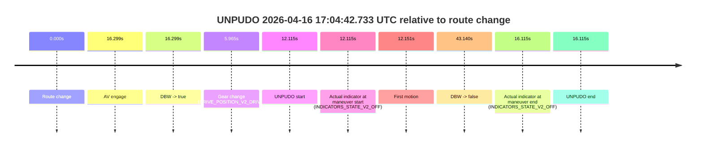
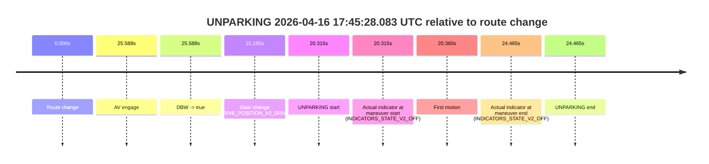

# Run Report: fme10010/2026-04-16--16-09-29--gen2-av-d6d0f3a6-4637-4fbc-8656-ef4301c1a8e0

| Field | Value |
|---|---|
| Run ID | `fme10010/2026-04-16--16-09-29--gen2-av-d6d0f3a6-4637-4fbc-8656-ef4301c1a8e0` |
| Date | `2026-04-16` |
| Model(s) | `apricot-crocodile-uproarious` |
| Author | `guy.geva` |
| Event count | `6` |

## unpudo 2026-04-16 16:28:01.833 UTC

| Field | Value |
|---|---|
| Model | `apricot-crocodile-uproarious` |
| Author | `guy.geva` |
| Run ID | `fme10010/2026-04-16--16-09-29--gen2-av-d6d0f3a6-4637-4fbc-8656-ef4301c1a8e0` |
| Date | `2026-04-16` |
| Time (UTC) | `16:28:01.833` |
| Event type | `unpudo` |
| Disengagement type | `failed_to_unpudo` |
| Route change | `found` |
| Console | [run](https://console.sso.wayve.ai/run/fme10010/2026-04-16--16-09-29--gen2-av-d6d0f3a6-4637-4fbc-8656-ef4301c1a8e0?id=&time-unixus=1776356881833307) |
| Foxglove | [segment](https://app.foxglove.dev/wayve-on-prem/p/prj_0dX18KZdVHg1fmmI/view?ds=foxglove-stream&ds.deviceName=fme10010&ds.start=2026-04-16T16%3A26%3A44.118371Z&ds.end=2026-04-16T16%3A34%3A53.736704Z&layoutId=lay_0e7VD4WIKDQGU73Y&time=2026-04-16T16%3A28%3A01.833307Z) |

### Event card: accidental

- Accidental: AV ownership is present for less than `2s`, so this is treated as an accidental brush with the maneuver rather than a meaningful model attempt.

| Event | Time (UTC) | Delta from route change |
|---|---:|---:|
| Route change | 2026-04-16 16:26:54.118 | `0.000s` |
| AV engage | 2026-04-16 16:28:12.036 | `77.918s` |
| DBW -> true | 2026-04-16 16:28:12.036 | `77.918s` |
| Gear change (DRIVE_POSITION_V2_REVERSE) | 2026-04-16 16:27:50.633 | `56.515s` |
| UNPUDO start | 2026-04-16 16:28:01.833 | `67.715s` |
| Actual indicator at maneuver start (INDICATORS_STATE_V2_OFF) | 2026-04-16 16:28:01.833 | `67.715s` |
| First motion | 2026-04-16 16:28:06.188 | `72.070s` |
| DBW -> false | 2026-04-16 16:34:43.736 | `469.618s` |
| Actual indicator at maneuver end (INDICATORS_STATE_V2_OFF) | 2026-04-16 16:28:09.383 | `75.265s` |
| UNPUDO end | 2026-04-16 16:28:09.383 | `75.265s` |

| Metric | Value |
|---|---|
| Outcome | `accidental` |
| Effective failure type | `none` |
| Route change status | `found` |
| DBW at event start | `false` |
| DBW at event end | `false` |
| Predicted gear at AV start | `DRIVE_POSITION_V2_DRIVE` |
| Actual gear at AV start | `DRIVE_POSITION_V2_DRIVE` |
| Predicted gear at event start | `DRIVE_POSITION_V2_REVERSE` |
| Actual gear at event start | `DRIVE_POSITION_V2_REVERSE` |
| Planned indicator direction | `INDICATORS_STATE_V2_OFF` |
| Controller indicator direction | `INDICATORS_STATE_V2_OFF` |
| Actual indicator direction | `INDICATORS_STATE_V2_OFF` |
| Actual indicator at maneuver end | `INDICATORS_STATE_V2_OFF` |
| Driver accel help in AV | `false` |
| Driver accel help timestamp | `n/a` |
| Max accel pedal pct in AV | `0.0%` |
| Max brake pedal pct in AV | `0.0%` |
| Max speed mps in AV | `0.000` |
| Route -> AV | `77.918s` |
| AV -> event start | `-10.203s` |
| AV -> first motion | `-5.848s` |
| AV duration before disengagement | `391.700s` |
| Trajectory waypoint count | `37` |
| Driving-plan step count | `11` |

The scored portion starts from the AV-owned window, not from the pre-AV setup. Route-change search in the stopped pre-event segment was `found`, with the baseline therefore set to route change. At the event anchor the model predicts `DRIVE_POSITION_V2_REVERSE` and the actual gear is `DRIVE_POSITION_V2_REVERSE`. The effective model outcome is `accidental` because `the AV-owned portion is shorter than 2s`.

### Resolution

| Field | Value |
|---|---|
| Final outcome | `accidental` |
| Do we agree with this label? | `yes` |
| Source disengagement type | `failed_to_unpudo` |
| Resolved effective failure type | `none` |
| Confidence | `high` |

## unpudo 2026-04-16 16:34:48.983 UTC

| Field | Value |
|---|---|
| Model | `apricot-crocodile-uproarious` |
| Author | `guy.geva` |
| Run ID | `fme10010/2026-04-16--16-09-29--gen2-av-d6d0f3a6-4637-4fbc-8656-ef4301c1a8e0` |
| Date | `2026-04-16` |
| Time (UTC) | `16:34:48.983` |
| Event type | `unpudo` |
| Disengagement type | `failed_to_unpudo` |
| Route change | `found` |
| Console | [run](https://console.sso.wayve.ai/run/fme10010/2026-04-16--16-09-29--gen2-av-d6d0f3a6-4637-4fbc-8656-ef4301c1a8e0?id=&time-unixus=1776357288983309) |
| Foxglove | [segment](https://app.foxglove.dev/wayve-on-prem/p/prj_0dX18KZdVHg1fmmI/view?ds=foxglove-stream&ds.deviceName=fme10010&ds.start=2026-04-16T16%3A34%3A27.218280Z&ds.end=2026-04-16T16%3A38%3A44.057723Z&layoutId=lay_0e7VD4WIKDQGU73Y&time=2026-04-16T16%3A34%3A48.983309Z) |

### Event card: accidental

- Accidental: AV ownership is present for less than `2s`, so this is treated as an accidental brush with the maneuver rather than a meaningful model attempt.

| Event | Time (UTC) | Delta from route change |
|---|---:|---:|
| Route change | 2026-04-16 16:34:37.218 | `0.000s` |
| AV engage | 2026-04-16 16:35:15.096 | `37.878s` |
| DBW -> true | 2026-04-16 16:35:15.096 | `37.878s` |
| Gear change (DRIVE_POSITION_V2_REVERSE) | 2026-04-16 16:34:39.433 | `2.215s` |
| UNPUDO start | 2026-04-16 16:34:48.983 | `11.765s` |
| Actual indicator at maneuver start (INDICATORS_STATE_V2_OFF) | 2026-04-16 16:34:48.983 | `11.765s` |
| First motion | 2026-04-16 16:35:11.368 | `34.150s` |
| DBW -> false | 2026-04-16 16:38:34.057 | `236.839s` |
| Actual indicator at maneuver end (INDICATORS_STATE_V2_OFF) | 2026-04-16 16:35:13.333 | `36.115s` |
| UNPUDO end | 2026-04-16 16:35:13.333 | `36.115s` |

| Metric | Value |
|---|---|
| Outcome | `accidental` |
| Effective failure type | `none` |
| Route change status | `found` |
| DBW at event start | `false` |
| DBW at event end | `false` |
| Predicted gear at AV start | `DRIVE_POSITION_V2_DRIVE` |
| Actual gear at AV start | `DRIVE_POSITION_V2_DRIVE` |
| Predicted gear at event start | `DRIVE_POSITION_V2_REVERSE` |
| Actual gear at event start | `DRIVE_POSITION_V2_REVERSE` |
| Planned indicator direction | `INDICATORS_STATE_V2_OFF` |
| Controller indicator direction | `INDICATORS_STATE_V2_OFF` |
| Actual indicator direction | `INDICATORS_STATE_V2_OFF` |
| Actual indicator at maneuver end | `INDICATORS_STATE_V2_OFF` |
| Driver accel help in AV | `false` |
| Driver accel help timestamp | `n/a` |
| Max accel pedal pct in AV | `0.0%` |
| Max brake pedal pct in AV | `0.0%` |
| Max speed mps in AV | `0.000` |
| Route -> AV | `37.878s` |
| AV -> event start | `-26.113s` |
| AV -> first motion | `-3.728s` |
| AV duration before disengagement | `198.961s` |
| Trajectory waypoint count | `36` |
| Driving-plan step count | `11` |

The scored portion starts from the AV-owned window, not from the pre-AV setup. Route-change search in the stopped pre-event segment was `found`, with the baseline therefore set to route change. At the event anchor the model predicts `DRIVE_POSITION_V2_REVERSE` and the actual gear is `DRIVE_POSITION_V2_REVERSE`. The effective model outcome is `accidental` because `the AV-owned portion is shorter than 2s`.

### Resolution

| Field | Value |
|---|---|
| Final outcome | `accidental` |
| Do we agree with this label? | `yes` |
| Source disengagement type | `failed_to_unpudo` |
| Resolved effective failure type | `none` |
| Confidence | `high` |

## unpudo 2026-04-16 16:50:08.433 UTC

| Field | Value |
|---|---|
| Model | `apricot-crocodile-uproarious` |
| Author | `guy.geva` |
| Run ID | `fme10010/2026-04-16--16-09-29--gen2-av-d6d0f3a6-4637-4fbc-8656-ef4301c1a8e0` |
| Date | `2026-04-16` |
| Time (UTC) | `16:50:08.433` |
| Event type | `unpudo` |
| Disengagement type | `failed_to_unpudo` |
| Route change | `found` |
| Console | [run](https://console.sso.wayve.ai/run/fme10010/2026-04-16--16-09-29--gen2-av-d6d0f3a6-4637-4fbc-8656-ef4301c1a8e0?id=&time-unixus=1776358208433303) |
| Foxglove | [segment](https://app.foxglove.dev/wayve-on-prem/p/prj_0dX18KZdVHg1fmmI/view?ds=foxglove-stream&ds.deviceName=fme10010&ds.start=2026-04-16T16%3A49%3A42.968252Z&ds.end=2026-04-16T16%3A51%3A19.197859Z&layoutId=lay_0e7VD4WIKDQGU73Y&time=2026-04-16T16%3A50%3A08.433303Z) |

### Event card: accidental

- Accidental: AV ownership is present for less than `2s`, so this is treated as an accidental brush with the maneuver rather than a meaningful model attempt.

| Event | Time (UTC) | Delta from route change |
|---|---:|---:|
| Route change | 2026-04-16 16:49:52.968 | `0.000s` |
| AV engage | 2026-04-16 16:50:31.756 | `38.788s` |
| DBW -> true | 2026-04-16 16:50:31.756 | `38.788s` |
| Gear change (DRIVE_POSITION_V2_DRIVE) | 2026-04-16 16:50:01.483 | `8.515s` |
| UNPUDO start | 2026-04-16 16:50:08.433 | `15.465s` |
| Actual indicator at maneuver start (INDICATORS_STATE_V2_OFF) | 2026-04-16 16:50:08.433 | `15.465s` |
| First motion | 2026-04-16 16:50:08.468 | `15.501s` |
| DBW -> false | 2026-04-16 16:51:09.197 | `76.230s` |
| Actual indicator at maneuver end (INDICATORS_STATE_V2_OFF) | 2026-04-16 16:50:26.083 | `33.115s` |
| UNPUDO end | 2026-04-16 16:50:26.083 | `33.115s` |

| Metric | Value |
|---|---|
| Outcome | `accidental` |
| Effective failure type | `none` |
| Route change status | `found` |
| DBW at event start | `false` |
| DBW at event end | `false` |
| Predicted gear at AV start | `DRIVE_POSITION_V2_DRIVE` |
| Actual gear at AV start | `DRIVE_POSITION_V2_DRIVE` |
| Predicted gear at event start | `DRIVE_POSITION_V2_DRIVE` |
| Actual gear at event start | `DRIVE_POSITION_V2_DRIVE` |
| Planned indicator direction | `INDICATORS_STATE_V2_OFF` |
| Controller indicator direction | `INDICATORS_STATE_V2_OFF` |
| Actual indicator direction | `INDICATORS_STATE_V2_OFF` |
| Actual indicator at maneuver end | `INDICATORS_STATE_V2_OFF` |
| Driver accel help in AV | `false` |
| Driver accel help timestamp | `n/a` |
| Max accel pedal pct in AV | `0.0%` |
| Max brake pedal pct in AV | `0.0%` |
| Max speed mps in AV | `0.000` |
| Route -> AV | `38.788s` |
| AV -> event start | `-23.323s` |
| AV -> first motion | `-23.288s` |
| AV duration before disengagement | `37.441s` |
| Trajectory waypoint count | `35` |
| Driving-plan step count | `11` |

The scored portion starts from the AV-owned window, not from the pre-AV setup. Route-change search in the stopped pre-event segment was `found`, with the baseline therefore set to route change. At the event anchor the model predicts `DRIVE_POSITION_V2_DRIVE` and the actual gear is `DRIVE_POSITION_V2_DRIVE`. The effective model outcome is `accidental` because `the AV-owned portion is shorter than 2s`.

### Resolution

| Field | Value |
|---|---|
| Final outcome | `accidental` |
| Do we agree with this label? | `yes` |
| Source disengagement type | `failed_to_unpudo` |
| Resolved effective failure type | `none` |
| Confidence | `high` |

## unpudo 2026-04-16 16:55:25.533 UTC

| Field | Value |
|---|---|
| Model | `apricot-crocodile-uproarious` |
| Author | `guy.geva` |
| Run ID | `fme10010/2026-04-16--16-09-29--gen2-av-d6d0f3a6-4637-4fbc-8656-ef4301c1a8e0` |
| Date | `2026-04-16` |
| Time (UTC) | `16:55:25.533` |
| Event type | `unpudo` |
| Disengagement type | `failed_to_unpudo` |
| Route change | `found` |
| Console | [run](https://console.sso.wayve.ai/run/fme10010/2026-04-16--16-09-29--gen2-av-d6d0f3a6-4637-4fbc-8656-ef4301c1a8e0?id=&time-unixus=1776358525533311) |
| Foxglove | [segment](https://app.foxglove.dev/wayve-on-prem/p/prj_0dX18KZdVHg1fmmI/view?ds=foxglove-stream&ds.deviceName=fme10010&ds.start=2026-04-16T16%3A54%3A46.368278Z&ds.end=2026-04-16T16%3A57%3A03.816395Z&layoutId=lay_0e7VD4WIKDQGU73Y&time=2026-04-16T16%3A55%3A25.533311Z) |

### Event card: accidental

- Accidental: AV ownership is present for less than `2s`, so this is treated as an accidental brush with the maneuver rather than a meaningful model attempt.

| Event | Time (UTC) | Delta from route change |
|---|---:|---:|
| Route change | 2026-04-16 16:54:56.368 | `0.000s` |
| AV engage | 2026-04-16 16:55:29.656 | `33.288s` |
| DBW -> true | 2026-04-16 16:55:29.656 | `33.288s` |
| Gear change (DRIVE_POSITION_V2_DRIVE) | 2026-04-16 16:55:20.433 | `24.065s` |
| UNPUDO start | 2026-04-16 16:55:25.533 | `29.165s` |
| Actual indicator at maneuver start (INDICATORS_STATE_V2_OFF) | 2026-04-16 16:55:25.533 | `29.165s` |
| First motion | 2026-04-16 16:55:25.548 | `29.180s` |
| DBW -> false | 2026-04-16 16:56:53.816 | `117.448s` |
| Actual indicator at maneuver end (INDICATORS_STATE_V2_LEFT_ON) | 2026-04-16 16:55:28.633 | `32.265s` |
| UNPUDO end | 2026-04-16 16:55:28.633 | `32.265s` |

| Metric | Value |
|---|---|
| Outcome | `accidental` |
| Effective failure type | `none` |
| Route change status | `found` |
| DBW at event start | `false` |
| DBW at event end | `false` |
| Predicted gear at AV start | `DRIVE_POSITION_V2_DRIVE` |
| Actual gear at AV start | `DRIVE_POSITION_V2_DRIVE` |
| Predicted gear at event start | `DRIVE_POSITION_V2_DRIVE` |
| Actual gear at event start | `DRIVE_POSITION_V2_DRIVE` |
| Planned indicator direction | `INDICATORS_STATE_V2_LEFT_ON` |
| Controller indicator direction | `INDICATORS_STATE_V2_LEFT_ON` |
| Actual indicator direction | `INDICATORS_STATE_V2_OFF` |
| Actual indicator at maneuver end | `INDICATORS_STATE_V2_LEFT_ON` |
| Driver accel help in AV | `false` |
| Driver accel help timestamp | `n/a` |
| Max accel pedal pct in AV | `0.0%` |
| Max brake pedal pct in AV | `0.0%` |
| Max speed mps in AV | `0.000` |
| Route -> AV | `33.288s` |
| AV -> event start | `-4.123s` |
| AV -> first motion | `-4.108s` |
| AV duration before disengagement | `84.160s` |
| Trajectory waypoint count | `35` |
| Driving-plan step count | `11` |

The scored portion starts from the AV-owned window, not from the pre-AV setup. Route-change search in the stopped pre-event segment was `found`, with the baseline therefore set to route change. At the event anchor the model predicts `DRIVE_POSITION_V2_DRIVE` and the actual gear is `DRIVE_POSITION_V2_DRIVE`. The effective model outcome is `accidental` because `the AV-owned portion is shorter than 2s`.

### Resolution

| Field | Value |
|---|---|
| Final outcome | `accidental` |
| Do we agree with this label? | `yes` |
| Source disengagement type | `failed_to_unpudo` |
| Resolved effective failure type | `none` |
| Confidence | `high` |

## unpudo 2026-04-16 17:04:42.733 UTC

| Field | Value |
|---|---|
| Model | `apricot-crocodile-uproarious` |
| Author | `guy.geva` |
| Run ID | `fme10010/2026-04-16--16-09-29--gen2-av-d6d0f3a6-4637-4fbc-8656-ef4301c1a8e0` |
| Date | `2026-04-16` |
| Time (UTC) | `17:04:42.733` |
| Event type | `unpudo` |
| Disengagement type | `failed_to_unpudo` |
| Route change | `found` |
| Console | [run](https://console.sso.wayve.ai/run/fme10010/2026-04-16--16-09-29--gen2-av-d6d0f3a6-4637-4fbc-8656-ef4301c1a8e0?id=&time-unixus=1776359082733300) |
| Foxglove | [segment](https://app.foxglove.dev/wayve-on-prem/p/prj_0dX18KZdVHg1fmmI/view?ds=foxglove-stream&ds.deviceName=fme10010&ds.start=2026-04-16T17%3A04%3A20.618318Z&ds.end=2026-04-16T17%3A05%3A23.758344Z&layoutId=lay_0e7VD4WIKDQGU73Y&time=2026-04-16T17%3A04%3A42.733300Z) |

### Event card: accidental

- Accidental: AV ownership is present for less than `2s`, so this is treated as an accidental brush with the maneuver rather than a meaningful model attempt.

| Event | Time (UTC) | Delta from route change |
|---|---:|---:|
| Route change | 2026-04-16 17:04:30.618 | `0.000s` |
| AV engage | 2026-04-16 17:04:46.917 | `16.299s` |
| DBW -> true | 2026-04-16 17:04:46.917 | `16.299s` |
| Gear change (DRIVE_POSITION_V2_DRIVE) | 2026-04-16 17:04:36.583 | `5.965s` |
| UNPUDO start | 2026-04-16 17:04:42.733 | `12.115s` |
| Actual indicator at maneuver start (INDICATORS_STATE_V2_OFF) | 2026-04-16 17:04:42.733 | `12.115s` |
| First motion | 2026-04-16 17:04:42.769 | `12.151s` |
| DBW -> false | 2026-04-16 17:05:13.758 | `43.140s` |
| Actual indicator at maneuver end (INDICATORS_STATE_V2_OFF) | 2026-04-16 17:04:46.733 | `16.115s` |
| UNPUDO end | 2026-04-16 17:04:46.733 | `16.115s` |

| Metric | Value |
|---|---|
| Outcome | `accidental` |
| Effective failure type | `none` |
| Route change status | `found` |
| DBW at event start | `false` |
| DBW at event end | `false` |
| Predicted gear at AV start | `DRIVE_POSITION_V2_DRIVE` |
| Actual gear at AV start | `DRIVE_POSITION_V2_DRIVE` |
| Predicted gear at event start | `DRIVE_POSITION_V2_DRIVE` |
| Actual gear at event start | `DRIVE_POSITION_V2_DRIVE` |
| Planned indicator direction | `INDICATORS_STATE_V2_OFF` |
| Controller indicator direction | `INDICATORS_STATE_V2_OFF` |
| Actual indicator direction | `INDICATORS_STATE_V2_OFF` |
| Actual indicator at maneuver end | `INDICATORS_STATE_V2_OFF` |
| Driver accel help in AV | `false` |
| Driver accel help timestamp | `n/a` |
| Max accel pedal pct in AV | `0.0%` |
| Max brake pedal pct in AV | `0.0%` |
| Max speed mps in AV | `0.000` |
| Route -> AV | `16.299s` |
| AV -> event start | `-4.184s` |
| AV -> first motion | `-4.149s` |
| AV duration before disengagement | `26.841s` |
| Trajectory waypoint count | `35` |
| Driving-plan step count | `11` |

The scored portion starts from the AV-owned window, not from the pre-AV setup. Route-change search in the stopped pre-event segment was `found`, with the baseline therefore set to route change. At the event anchor the model predicts `DRIVE_POSITION_V2_DRIVE` and the actual gear is `DRIVE_POSITION_V2_DRIVE`. The effective model outcome is `accidental` because `the AV-owned portion is shorter than 2s`.

### Resolution

| Field | Value |
|---|---|
| Final outcome | `accidental` |
| Do we agree with this label? | `yes` |
| Source disengagement type | `failed_to_unpudo` |
| Resolved effective failure type | `none` |
| Confidence | `high` |

## unparking 2026-04-16 17:45:28.083 UTC

| Field | Value |
|---|---|
| Model | `apricot-crocodile-uproarious` |
| Author | `guy.geva` |
| Run ID | `fme10010/2026-04-16--16-09-29--gen2-av-d6d0f3a6-4637-4fbc-8656-ef4301c1a8e0` |
| Date | `2026-04-16` |
| Time (UTC) | `17:45:28.083` |
| Event type | `unparking` |
| Disengagement type | `failed_to_unpudo` |
| Route change | `found` |
| Console | [run](https://console.sso.wayve.ai/run/fme10010/2026-04-16--16-09-29--gen2-av-d6d0f3a6-4637-4fbc-8656-ef4301c1a8e0?id=&time-unixus=1776361528083296) |
| Foxglove | [segment](https://app.foxglove.dev/wayve-on-prem/p/prj_0dX18KZdVHg1fmmI/view?ds=foxglove-stream&ds.deviceName=fme10010&ds.start=2026-04-16T17%3A44%3A57.768286Z&ds.end=2026-04-16T17%3A45%3A42.233296Z&layoutId=lay_0e7VD4WIKDQGU73Y&time=2026-04-16T17%3A45%3A28.083296Z) |

### Event card: accidental

- Accidental: AV ownership is present for less than `2s`, so this is treated as an accidental brush with the maneuver rather than a meaningful model attempt.

| Event | Time (UTC) | Delta from route change |
|---|---:|---:|
| Route change | 2026-04-16 17:45:07.768 | `0.000s` |
| AV engage | 2026-04-16 17:45:33.356 | `25.588s` |
| DBW -> true | 2026-04-16 17:45:33.356 | `25.588s` |
| Gear change (DRIVE_POSITION_V2_DRIVE) | 2026-04-16 17:45:22.933 | `15.165s` |
| UNPARKING start | 2026-04-16 17:45:28.083 | `20.315s` |
| Actual indicator at maneuver start (INDICATORS_STATE_V2_OFF) | 2026-04-16 17:45:28.083 | `20.315s` |
| First motion | 2026-04-16 17:45:28.128 | `20.360s` |
| Actual indicator at maneuver end (INDICATORS_STATE_V2_OFF) | 2026-04-16 17:45:32.233 | `24.465s` |
| UNPARKING end | 2026-04-16 17:45:32.233 | `24.465s` |

| Metric | Value |
|---|---|
| Outcome | `accidental` |
| Effective failure type | `none` |
| Route change status | `found` |
| DBW at event start | `false` |
| DBW at event end | `false` |
| Predicted gear at AV start | `DRIVE_POSITION_V2_DRIVE` |
| Actual gear at AV start | `DRIVE_POSITION_V2_DRIVE` |
| Predicted gear at event start | `DRIVE_POSITION_V2_DRIVE` |
| Actual gear at event start | `DRIVE_POSITION_V2_DRIVE` |
| Planned indicator direction | `INDICATORS_STATE_V2_OFF` |
| Controller indicator direction | `INDICATORS_STATE_V2_OFF` |
| Actual indicator direction | `INDICATORS_STATE_V2_OFF` |
| Actual indicator at maneuver end | `INDICATORS_STATE_V2_OFF` |
| Driver accel help in AV | `false` |
| Driver accel help timestamp | `n/a` |
| Max accel pedal pct in AV | `0.0%` |
| Max brake pedal pct in AV | `0.0%` |
| Max speed mps in AV | `0.000` |
| Route -> AV | `25.588s` |
| AV -> event start | `-5.273s` |
| AV -> first motion | `-5.228s` |
| AV duration before disengagement | `n/a` |
| Trajectory waypoint count | `36` |
| Driving-plan step count | `11` |

The scored portion starts from the AV-owned window, not from the pre-AV setup. Route-change search in the stopped pre-event segment was `found`, with the baseline therefore set to route change. At the event anchor the model predicts `DRIVE_POSITION_V2_DRIVE` and the actual gear is `DRIVE_POSITION_V2_DRIVE`. The effective model outcome is `accidental` because `the AV-owned portion is shorter than 2s`.

### Resolution

| Field | Value |
|---|---|
| Final outcome | `accidental` |
| Do we agree with this label? | `yes` |
| Source disengagement type | `failed_to_unpudo` |
| Resolved effective failure type | `none` |
| Confidence | `high` |
