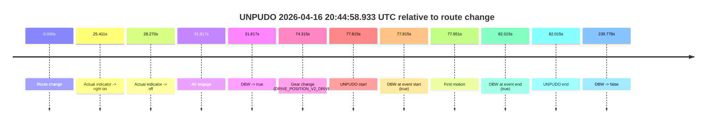

# Run Report: fme10010/2026-04-16--19-18-23--gen2-av-b47224bf-05fb-461a-a4a3-d419841e8c3d

| Field | Value |
|---|---|
| Run ID | `fme10010/2026-04-16--19-18-23--gen2-av-b47224bf-05fb-461a-a4a3-d419841e8c3d` |
| Date | `2026-04-16` |
| Model(s) | `armadillo-amethyst-squeaky` |
| Author | `guy.geva` |
| Event count | `1` |

## unpudo 2026-04-16 20:44:58.933 UTC

| Field | Value |
|---|---|
| Model | `armadillo-amethyst-squeaky` |
| Author | `guy.geva` |
| Run ID | `fme10010/2026-04-16--19-18-23--gen2-av-b47224bf-05fb-461a-a4a3-d419841e8c3d` |
| Date | `2026-04-16` |
| Time (UTC) | `20:44:58.933` |
| Event type | `unpudo` |
| Disengagement type | `none observed` |
| Route change | `found` |
| Console | [run](https://console.sso.wayve.ai/run/fme10010/2026-04-16--19-18-23--gen2-av-b47224bf-05fb-461a-a4a3-d419841e8c3d?id=&time-unixus=1776372298933297) |
| Foxglove | [segment](https://app.foxglove.dev/wayve-on-prem/p/prj_0dX18KZdVHg1fmmI/view?ds=foxglove-stream&ds.deviceName=fme10010&ds.start=2026-04-16T20%3A43%3A31.118313Z&ds.end=2026-04-16T20%3A47%3A50.896579Z&layoutId=lay_0e7VD4WIKDQGU73Y&time=2026-04-16T20%3A44%3A58.933297Z) |

### Event card: pass

- Pass: AV owns the credited unpudo through the official event window, the gear state is aligned at the anchor, and the vehicle moves without driver accelerator help in AV.

| Event | Time (UTC) | Delta from route change |
|---|---:|---:|
| Route change | 2026-04-16 20:43:41.118 | `0.000s` |
| Actual indicator -> right on | 2026-04-16 20:44:06.529 | `25.411s` |
| Actual indicator -> off | 2026-04-16 20:44:09.388 | `28.270s` |
| AV engage | 2026-04-16 20:44:12.935 | `31.817s` |
| DBW -> true | 2026-04-16 20:44:12.935 | `31.817s` |
| Gear change (DRIVE_POSITION_V2_DRIVE) | 2026-04-16 20:44:55.433 | `74.315s` |
| UNPUDO start | 2026-04-16 20:44:58.933 | `77.815s` |
| DBW at event start (true) | 2026-04-16 20:44:58.933 | `77.815s` |
| First motion | 2026-04-16 20:44:58.969 | `77.851s` |
| DBW at event end (true) | 2026-04-16 20:45:03.133 | `82.015s` |
| UNPUDO end | 2026-04-16 20:45:03.133 | `82.015s` |
| DBW -> false | 2026-04-16 20:47:40.896 | `239.778s` |

| Metric | Value |
|---|---|
| Outcome | `pass` |
| Effective failure type | `none` |
| Route change status | `found` |
| DBW at event start | `true` |
| DBW at event end | `true` |
| Predicted gear at AV start | `DRIVE_POSITION_V2_DRIVE` |
| Actual gear at AV start | `DRIVE_POSITION_V2_DRIVE` |
| Predicted gear at event start | `DRIVE_POSITION_V2_DRIVE` |
| Actual gear at event start | `DRIVE_POSITION_V2_DRIVE` |
| Planned indicator direction | `INDICATORS_STATE_V2_OFF` |
| Controller indicator direction | `INDICATORS_STATE_V2_OFF` |
| Actual indicator direction | `INDICATORS_STATE_V2_OFF` |
| Actual indicator at maneuver end | `INDICATORS_STATE_V2_OFF` |
| Driver accel help in AV | `false` |
| Driver accel help timestamp | `n/a` |
| Max accel pedal pct in AV | `0.0%` |
| Max brake pedal pct in AV | `0.0%` |
| Max speed mps in AV | `3.214` |
| Success timing baseline | `route change` |
| Route -> AV | `31.817s` |
| AV -> event start | `45.998s` |
| AV -> first motion | `46.035s` |
| Success baseline -> event start | `77.815s` |
| Success baseline -> first motion | `77.851s` |
| AV duration before disengagement | `207.961s` |
| Trajectory waypoint count | `35` |
| Driving-plan step count | `11` |

The scored portion starts from the AV-owned window, not from the pre-AV setup. Route-change search in the stopped pre-event segment was `found`, with the baseline therefore set to route change. At the event anchor the model predicts `DRIVE_POSITION_V2_DRIVE` and the actual gear is `DRIVE_POSITION_V2_DRIVE`. The effective model outcome is `pass` because `the credited maneuver stays AV-owned through the official event end`.

### Resolution

| Field | Value |
|---|---|
| Final outcome | `pass` |
| Do we agree with this label? | `yes` |
| Source disengagement type | `none observed` |
| Resolved effective failure type | `none` |
| Confidence | `high` |
