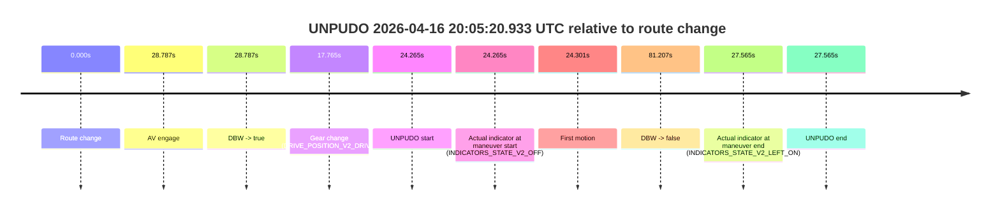
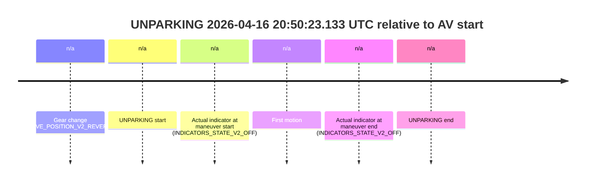

# Run Report: fme10010/2026-04-16--19-18-23--gen2-av-b47224bf-05fb-461a-a4a3-d419841e8c3d

| Field | Value |
|---|---|
| Run ID | `fme10010/2026-04-16--19-18-23--gen2-av-b47224bf-05fb-461a-a4a3-d419841e8c3d` |
| Date | `2026-04-16` |
| Model(s) | `armadillo-amethyst-squeaky` |
| Author | `guy.geva` |
| Event count | `12` |

## unpudo 2026-04-16 19:36:32.933 UTC

| Field | Value |
|---|---|
| Model | `armadillo-amethyst-squeaky` |
| Author | `guy.geva` |
| Run ID | `fme10010/2026-04-16--19-18-23--gen2-av-b47224bf-05fb-461a-a4a3-d419841e8c3d` |
| Date | `2026-04-16` |
| Time (UTC) | `19:36:32.933` |
| Event type | `unpudo` |
| Disengagement type | `failed_to_unpudo` |
| Route change | `found` |
| Console | [run](https://console.sso.wayve.ai/run/fme10010/2026-04-16--19-18-23--gen2-av-b47224bf-05fb-461a-a4a3-d419841e8c3d?id=&time-unixus=1776368192933299) |
| Foxglove | [segment](https://app.foxglove.dev/wayve-on-prem/p/prj_0dX18KZdVHg1fmmI/view?ds=foxglove-stream&ds.deviceName=fme10010&ds.start=2026-04-16T19%3A36%3A06.668533Z&ds.end=2026-04-16T19%3A43%3A26.516042Z&layoutId=lay_0e7VD4WIKDQGU73Y&time=2026-04-16T19%3A36%3A32.933299Z) |

### Event card: accidental

- Accidental: AV ownership is present for less than `2s`, so this is treated as an accidental brush with the maneuver rather than a meaningful model attempt.

| Event | Time (UTC) | Delta from route change |
|---|---:|---:|
| Route change | 2026-04-16 19:36:16.668 | `0.000s` |
| AV engage | 2026-04-16 19:36:38.796 | `22.128s` |
| DBW -> true | 2026-04-16 19:36:38.796 | `22.128s` |
| Gear change (DRIVE_POSITION_V2_DRIVE) | 2026-04-16 19:36:28.483 | `11.815s` |
| UNPUDO start | 2026-04-16 19:36:32.933 | `16.265s` |
| Actual indicator at maneuver start (INDICATORS_STATE_V2_OFF) | 2026-04-16 19:36:32.933 | `16.265s` |
| First motion | 2026-04-16 19:36:32.988 | `16.320s` |
| DBW -> false | 2026-04-16 19:43:16.516 | `419.848s` |
| Actual indicator at maneuver end (INDICATORS_STATE_V2_OFF) | 2026-04-16 19:36:36.233 | `19.565s` |
| UNPUDO end | 2026-04-16 19:36:36.233 | `19.565s` |

| Metric | Value |
|---|---|
| Outcome | `accidental` |
| Effective failure type | `none` |
| Route change status | `found` |
| DBW at event start | `false` |
| DBW at event end | `false` |
| Predicted gear at AV start | `DRIVE_POSITION_V2_DRIVE` |
| Actual gear at AV start | `DRIVE_POSITION_V2_DRIVE` |
| Predicted gear at event start | `DRIVE_POSITION_V2_DRIVE` |
| Actual gear at event start | `DRIVE_POSITION_V2_DRIVE` |
| Planned indicator direction | `INDICATORS_STATE_V2_RIGHT_ON` |
| Controller indicator direction | `INDICATORS_STATE_V2_RIGHT_ON` |
| Actual indicator direction | `INDICATORS_STATE_V2_OFF` |
| Actual indicator at maneuver end | `INDICATORS_STATE_V2_OFF` |
| Driver accel help in AV | `false` |
| Driver accel help timestamp | `n/a` |
| Max accel pedal pct in AV | `0.0%` |
| Max brake pedal pct in AV | `0.0%` |
| Max speed mps in AV | `0.000` |
| Route -> AV | `22.128s` |
| AV -> event start | `-5.863s` |
| AV -> first motion | `-5.808s` |
| AV duration before disengagement | `397.720s` |
| Trajectory waypoint count | `35` |
| Driving-plan step count | `11` |

The scored portion starts from the AV-owned window, not from the pre-AV setup. Route-change search in the stopped pre-event segment was `found`, with the baseline therefore set to route change. At the event anchor the model predicts `DRIVE_POSITION_V2_DRIVE` and the actual gear is `DRIVE_POSITION_V2_DRIVE`. The effective model outcome is `accidental` because `the AV-owned portion is shorter than 2s`.

### Resolution

| Field | Value |
|---|---|
| Final outcome | `accidental` |
| Do we agree with this label? | `yes` |
| Source disengagement type | `failed_to_unpudo` |
| Resolved effective failure type | `none` |
| Confidence | `high` |

## unpudo 2026-04-16 19:49:00.333 UTC

| Field | Value |
|---|---|
| Model | `armadillo-amethyst-squeaky` |
| Author | `guy.geva` |
| Run ID | `fme10010/2026-04-16--19-18-23--gen2-av-b47224bf-05fb-461a-a4a3-d419841e8c3d` |
| Date | `2026-04-16` |
| Time (UTC) | `19:49:00.333` |
| Event type | `unpudo` |
| Disengagement type | `failed_to_unpudo` |
| Route change | `found` |
| Console | [run](https://console.sso.wayve.ai/run/fme10010/2026-04-16--19-18-23--gen2-av-b47224bf-05fb-461a-a4a3-d419841e8c3d?id=&time-unixus=1776368940333305) |
| Foxglove | [segment](https://app.foxglove.dev/wayve-on-prem/p/prj_0dX18KZdVHg1fmmI/view?ds=foxglove-stream&ds.deviceName=fme10010&ds.start=2026-04-16T19%3A48%3A34.418259Z&ds.end=2026-04-16T19%3A50%3A06.076007Z&layoutId=lay_0e7VD4WIKDQGU73Y&time=2026-04-16T19%3A49%3A00.333305Z) |

### Event card: accidental

- Accidental: AV ownership is present for less than `2s`, so this is treated as an accidental brush with the maneuver rather than a meaningful model attempt.

| Event | Time (UTC) | Delta from route change |
|---|---:|---:|
| Route change | 2026-04-16 19:48:44.418 | `0.000s` |
| AV engage | 2026-04-16 19:49:04.756 | `20.338s` |
| DBW -> true | 2026-04-16 19:49:04.756 | `20.338s` |
| Gear change (DRIVE_POSITION_V2_DRIVE) | 2026-04-16 19:48:54.133 | `9.715s` |
| UNPUDO start | 2026-04-16 19:49:00.333 | `15.915s` |
| Actual indicator at maneuver start (INDICATORS_STATE_V2_LEFT_ON) | 2026-04-16 19:49:00.333 | `15.915s` |
| First motion | 2026-04-16 19:49:00.348 | `15.930s` |
| DBW -> false | 2026-04-16 19:49:56.076 | `71.658s` |
| Actual indicator at maneuver end (INDICATORS_STATE_V2_OFF) | 2026-04-16 19:49:04.033 | `19.615s` |
| UNPUDO end | 2026-04-16 19:49:04.033 | `19.615s` |

| Metric | Value |
|---|---|
| Outcome | `accidental` |
| Effective failure type | `none` |
| Route change status | `found` |
| DBW at event start | `false` |
| DBW at event end | `false` |
| Predicted gear at AV start | `DRIVE_POSITION_V2_DRIVE` |
| Actual gear at AV start | `DRIVE_POSITION_V2_DRIVE` |
| Predicted gear at event start | `DRIVE_POSITION_V2_DRIVE` |
| Actual gear at event start | `DRIVE_POSITION_V2_DRIVE` |
| Planned indicator direction | `INDICATORS_STATE_V2_LEFT_ON` |
| Controller indicator direction | `INDICATORS_STATE_V2_LEFT_ON` |
| Actual indicator direction | `INDICATORS_STATE_V2_LEFT_ON` |
| Actual indicator at maneuver end | `INDICATORS_STATE_V2_OFF` |
| Driver accel help in AV | `false` |
| Driver accel help timestamp | `n/a` |
| Max accel pedal pct in AV | `0.0%` |
| Max brake pedal pct in AV | `0.0%` |
| Max speed mps in AV | `0.000` |
| Route -> AV | `20.338s` |
| AV -> event start | `-4.423s` |
| AV -> first motion | `-4.408s` |
| AV duration before disengagement | `51.320s` |
| Trajectory waypoint count | `35` |
| Driving-plan step count | `11` |

The scored portion starts from the AV-owned window, not from the pre-AV setup. Route-change search in the stopped pre-event segment was `found`, with the baseline therefore set to route change. At the event anchor the model predicts `DRIVE_POSITION_V2_DRIVE` and the actual gear is `DRIVE_POSITION_V2_DRIVE`. The effective model outcome is `accidental` because `the AV-owned portion is shorter than 2s`.

### Resolution

| Field | Value |
|---|---|
| Final outcome | `accidental` |
| Do we agree with this label? | `yes` |
| Source disengagement type | `failed_to_unpudo` |
| Resolved effective failure type | `none` |
| Confidence | `high` |

## unpudo 2026-04-16 19:59:10.183 UTC

| Field | Value |
|---|---|
| Model | `armadillo-amethyst-squeaky` |
| Author | `guy.geva` |
| Run ID | `fme10010/2026-04-16--19-18-23--gen2-av-b47224bf-05fb-461a-a4a3-d419841e8c3d` |
| Date | `2026-04-16` |
| Time (UTC) | `19:59:10.183` |
| Event type | `unpudo` |
| Disengagement type | `failed_to_unpudo` |
| Route change | `found` |
| Console | [run](https://console.sso.wayve.ai/run/fme10010/2026-04-16--19-18-23--gen2-av-b47224bf-05fb-461a-a4a3-d419841e8c3d?id=&time-unixus=1776369550183303) |
| Foxglove | [segment](https://app.foxglove.dev/wayve-on-prem/p/prj_0dX18KZdVHg1fmmI/view?ds=foxglove-stream&ds.deviceName=fme10010&ds.start=2026-04-16T19%3A58%3A43.018278Z&ds.end=2026-04-16T20%3A00%3A55.395442Z&layoutId=lay_0e7VD4WIKDQGU73Y&time=2026-04-16T19%3A59%3A10.183303Z) |

### Event card: accidental

- Accidental: AV ownership is present for less than `2s`, so this is treated as an accidental brush with the maneuver rather than a meaningful model attempt.

| Event | Time (UTC) | Delta from route change |
|---|---:|---:|
| Route change | 2026-04-16 19:58:53.018 | `0.000s` |
| AV engage | 2026-04-16 19:59:15.515 | `22.497s` |
| DBW -> true | 2026-04-16 19:59:15.515 | `22.497s` |
| Gear change (DRIVE_POSITION_V2_DRIVE) | 2026-04-16 19:59:02.183 | `9.165s` |
| UNPUDO start | 2026-04-16 19:59:10.183 | `17.165s` |
| Actual indicator at maneuver start (INDICATORS_STATE_V2_OFF) | 2026-04-16 19:59:10.183 | `17.165s` |
| First motion | 2026-04-16 19:59:10.209 | `17.191s` |
| DBW -> false | 2026-04-16 20:00:45.395 | `112.377s` |
| Actual indicator at maneuver end (INDICATORS_STATE_V2_OFF) | 2026-04-16 19:59:13.933 | `20.915s` |
| UNPUDO end | 2026-04-16 19:59:13.933 | `20.915s` |

| Metric | Value |
|---|---|
| Outcome | `accidental` |
| Effective failure type | `none` |
| Route change status | `found` |
| DBW at event start | `false` |
| DBW at event end | `false` |
| Predicted gear at AV start | `DRIVE_POSITION_V2_DRIVE` |
| Actual gear at AV start | `DRIVE_POSITION_V2_DRIVE` |
| Predicted gear at event start | `DRIVE_POSITION_V2_DRIVE` |
| Actual gear at event start | `DRIVE_POSITION_V2_DRIVE` |
| Planned indicator direction | `INDICATORS_STATE_V2_LEFT_ON` |
| Controller indicator direction | `INDICATORS_STATE_V2_LEFT_ON` |
| Actual indicator direction | `INDICATORS_STATE_V2_OFF` |
| Actual indicator at maneuver end | `INDICATORS_STATE_V2_OFF` |
| Driver accel help in AV | `false` |
| Driver accel help timestamp | `n/a` |
| Max accel pedal pct in AV | `0.0%` |
| Max brake pedal pct in AV | `0.0%` |
| Max speed mps in AV | `0.000` |
| Route -> AV | `22.497s` |
| AV -> event start | `-5.332s` |
| AV -> first motion | `-5.306s` |
| AV duration before disengagement | `89.880s` |
| Trajectory waypoint count | `36` |
| Driving-plan step count | `11` |

The scored portion starts from the AV-owned window, not from the pre-AV setup. Route-change search in the stopped pre-event segment was `found`, with the baseline therefore set to route change. At the event anchor the model predicts `DRIVE_POSITION_V2_DRIVE` and the actual gear is `DRIVE_POSITION_V2_DRIVE`. The effective model outcome is `accidental` because `the AV-owned portion is shorter than 2s`.

### Resolution

| Field | Value |
|---|---|
| Final outcome | `accidental` |
| Do we agree with this label? | `yes` |
| Source disengagement type | `failed_to_unpudo` |
| Resolved effective failure type | `none` |
| Confidence | `high` |

## unpudo 2026-04-16 20:05:20.933 UTC

| Field | Value |
|---|---|
| Model | `armadillo-amethyst-squeaky` |
| Author | `guy.geva` |
| Run ID | `fme10010/2026-04-16--19-18-23--gen2-av-b47224bf-05fb-461a-a4a3-d419841e8c3d` |
| Date | `2026-04-16` |
| Time (UTC) | `20:05:20.933` |
| Event type | `unpudo` |
| Disengagement type | `failed_to_unpudo` |
| Route change | `found` |
| Console | [run](https://console.sso.wayve.ai/run/fme10010/2026-04-16--19-18-23--gen2-av-b47224bf-05fb-461a-a4a3-d419841e8c3d?id=&time-unixus=1776369920933310) |
| Foxglove | [segment](https://app.foxglove.dev/wayve-on-prem/p/prj_0dX18KZdVHg1fmmI/view?ds=foxglove-stream&ds.deviceName=fme10010&ds.start=2026-04-16T20%3A04%3A46.668263Z&ds.end=2026-04-16T20%3A06%3A27.875477Z&layoutId=lay_0e7VD4WIKDQGU73Y&time=2026-04-16T20%3A05%3A20.933310Z) |

### Event card: accidental

- Accidental: AV ownership is present for less than `2s`, so this is treated as an accidental brush with the maneuver rather than a meaningful model attempt.

| Event | Time (UTC) | Delta from route change |
|---|---:|---:|
| Route change | 2026-04-16 20:04:56.668 | `0.000s` |
| AV engage | 2026-04-16 20:05:25.455 | `28.787s` |
| DBW -> true | 2026-04-16 20:05:25.455 | `28.787s` |
| Gear change (DRIVE_POSITION_V2_DRIVE) | 2026-04-16 20:05:14.433 | `17.765s` |
| UNPUDO start | 2026-04-16 20:05:20.933 | `24.265s` |
| Actual indicator at maneuver start (INDICATORS_STATE_V2_OFF) | 2026-04-16 20:05:20.933 | `24.265s` |
| First motion | 2026-04-16 20:05:20.969 | `24.301s` |
| DBW -> false | 2026-04-16 20:06:17.875 | `81.207s` |
| Actual indicator at maneuver end (INDICATORS_STATE_V2_LEFT_ON) | 2026-04-16 20:05:24.233 | `27.565s` |
| UNPUDO end | 2026-04-16 20:05:24.233 | `27.565s` |

| Metric | Value |
|---|---|
| Outcome | `accidental` |
| Effective failure type | `none` |
| Route change status | `found` |
| DBW at event start | `false` |
| DBW at event end | `false` |
| Predicted gear at AV start | `DRIVE_POSITION_V2_DRIVE` |
| Actual gear at AV start | `DRIVE_POSITION_V2_DRIVE` |
| Predicted gear at event start | `DRIVE_POSITION_V2_DRIVE` |
| Actual gear at event start | `DRIVE_POSITION_V2_DRIVE` |
| Planned indicator direction | `INDICATORS_STATE_V2_LEFT_ON` |
| Controller indicator direction | `INDICATORS_STATE_V2_LEFT_ON` |
| Actual indicator direction | `INDICATORS_STATE_V2_OFF` |
| Actual indicator at maneuver end | `INDICATORS_STATE_V2_LEFT_ON` |
| Driver accel help in AV | `false` |
| Driver accel help timestamp | `n/a` |
| Max accel pedal pct in AV | `0.0%` |
| Max brake pedal pct in AV | `0.0%` |
| Max speed mps in AV | `0.000` |
| Route -> AV | `28.787s` |
| AV -> event start | `-4.522s` |
| AV -> first motion | `-4.486s` |
| AV duration before disengagement | `52.420s` |
| Trajectory waypoint count | `35` |
| Driving-plan step count | `11` |

The scored portion starts from the AV-owned window, not from the pre-AV setup. Route-change search in the stopped pre-event segment was `found`, with the baseline therefore set to route change. At the event anchor the model predicts `DRIVE_POSITION_V2_DRIVE` and the actual gear is `DRIVE_POSITION_V2_DRIVE`. The effective model outcome is `accidental` because `the AV-owned portion is shorter than 2s`.

### Resolution

| Field | Value |
|---|---|
| Final outcome | `accidental` |
| Do we agree with this label? | `yes` |
| Source disengagement type | `failed_to_unpudo` |
| Resolved effective failure type | `none` |
| Confidence | `high` |

## unpudo 2026-04-16 20:13:08.083 UTC

| Field | Value |
|---|---|
| Model | `armadillo-amethyst-squeaky` |
| Author | `guy.geva` |
| Run ID | `fme10010/2026-04-16--19-18-23--gen2-av-b47224bf-05fb-461a-a4a3-d419841e8c3d` |
| Date | `2026-04-16` |
| Time (UTC) | `20:13:08.083` |
| Event type | `unpudo` |
| Disengagement type | `failed_to_unpudo` |
| Route change | `found` |
| Console | [run](https://console.sso.wayve.ai/run/fme10010/2026-04-16--19-18-23--gen2-av-b47224bf-05fb-461a-a4a3-d419841e8c3d?id=&time-unixus=1776370388083299) |
| Foxglove | [segment](https://app.foxglove.dev/wayve-on-prem/p/prj_0dX18KZdVHg1fmmI/view?ds=foxglove-stream&ds.deviceName=fme10010&ds.start=2026-04-16T20%3A11%3A41.269265Z&ds.end=2026-04-16T20%3A14%3A52.055777Z&layoutId=lay_0e7VD4WIKDQGU73Y&time=2026-04-16T20%3A13%3A08.083299Z) |

### Event card: accidental

- Accidental: AV ownership is present for less than `2s`, so this is treated as an accidental brush with the maneuver rather than a meaningful model attempt.

| Event | Time (UTC) | Delta from route change |
|---|---:|---:|
| Route change | 2026-04-16 20:11:51.269 | `0.000s` |
| AV engage | 2026-04-16 20:13:14.416 | `83.147s` |
| DBW -> true | 2026-04-16 20:13:14.416 | `83.147s` |
| Gear change (DRIVE_POSITION_V2_DRIVE) | 2026-04-16 20:13:02.583 | `71.314s` |
| UNPUDO start | 2026-04-16 20:13:08.083 | `76.814s` |
| Actual indicator at maneuver start (INDICATORS_STATE_V2_OFF) | 2026-04-16 20:13:08.083 | `76.814s` |
| First motion | 2026-04-16 20:13:08.128 | `76.859s` |
| DBW -> false | 2026-04-16 20:14:42.055 | `170.787s` |
| Actual indicator at maneuver end (INDICATORS_STATE_V2_OFF) | 2026-04-16 20:13:12.533 | `81.264s` |
| UNPUDO end | 2026-04-16 20:13:12.533 | `81.264s` |

| Metric | Value |
|---|---|
| Outcome | `accidental` |
| Effective failure type | `none` |
| Route change status | `found` |
| DBW at event start | `false` |
| DBW at event end | `false` |
| Predicted gear at AV start | `DRIVE_POSITION_V2_DRIVE` |
| Actual gear at AV start | `DRIVE_POSITION_V2_DRIVE` |
| Predicted gear at event start | `DRIVE_POSITION_V2_DRIVE` |
| Actual gear at event start | `DRIVE_POSITION_V2_DRIVE` |
| Planned indicator direction | `INDICATORS_STATE_V2_LEFT_ON` |
| Controller indicator direction | `INDICATORS_STATE_V2_LEFT_ON` |
| Actual indicator direction | `INDICATORS_STATE_V2_OFF` |
| Actual indicator at maneuver end | `INDICATORS_STATE_V2_OFF` |
| Driver accel help in AV | `false` |
| Driver accel help timestamp | `n/a` |
| Max accel pedal pct in AV | `0.0%` |
| Max brake pedal pct in AV | `0.0%` |
| Max speed mps in AV | `0.000` |
| Route -> AV | `83.147s` |
| AV -> event start | `-6.333s` |
| AV -> first motion | `-6.288s` |
| AV duration before disengagement | `87.639s` |
| Trajectory waypoint count | `36` |
| Driving-plan step count | `11` |

The scored portion starts from the AV-owned window, not from the pre-AV setup. Route-change search in the stopped pre-event segment was `found`, with the baseline therefore set to route change. At the event anchor the model predicts `DRIVE_POSITION_V2_DRIVE` and the actual gear is `DRIVE_POSITION_V2_DRIVE`. The effective model outcome is `accidental` because `the AV-owned portion is shorter than 2s`.

### Resolution

| Field | Value |
|---|---|
| Final outcome | `accidental` |
| Do we agree with this label? | `yes` |
| Source disengagement type | `failed_to_unpudo` |
| Resolved effective failure type | `none` |
| Confidence | `high` |

## unpudo 2026-04-16 20:20:25.983 UTC

| Field | Value |
|---|---|
| Model | `armadillo-amethyst-squeaky` |
| Author | `guy.geva` |
| Run ID | `fme10010/2026-04-16--19-18-23--gen2-av-b47224bf-05fb-461a-a4a3-d419841e8c3d` |
| Date | `2026-04-16` |
| Time (UTC) | `20:20:25.983` |
| Event type | `unpudo` |
| Disengagement type | `failed_to_unpudo` |
| Route change | `found` |
| Console | [run](https://console.sso.wayve.ai/run/fme10010/2026-04-16--19-18-23--gen2-av-b47224bf-05fb-461a-a4a3-d419841e8c3d?id=&time-unixus=1776370825983310) |
| Foxglove | [segment](https://app.foxglove.dev/wayve-on-prem/p/prj_0dX18KZdVHg1fmmI/view?ds=foxglove-stream&ds.deviceName=fme10010&ds.start=2026-04-16T20%3A18%3A55.268268Z&ds.end=2026-04-16T20%3A26%3A53.296245Z&layoutId=lay_0e7VD4WIKDQGU73Y&time=2026-04-16T20%3A20%3A25.983310Z) |

### Event card: accidental

- Accidental: AV ownership is present for less than `2s`, so this is treated as an accidental brush with the maneuver rather than a meaningful model attempt.

| Event | Time (UTC) | Delta from route change |
|---|---:|---:|
| Route change | 2026-04-16 20:19:05.268 | `0.000s` |
| AV engage | 2026-04-16 20:20:31.515 | `86.247s` |
| DBW -> true | 2026-04-16 20:20:31.515 | `86.247s` |
| Gear change (DRIVE_POSITION_V2_DRIVE) | 2026-04-16 20:20:18.483 | `73.215s` |
| UNPUDO start | 2026-04-16 20:20:25.983 | `80.715s` |
| Actual indicator at maneuver start (INDICATORS_STATE_V2_OFF) | 2026-04-16 20:20:25.983 | `80.715s` |
| First motion | 2026-04-16 20:20:26.009 | `80.741s` |
| DBW -> false | 2026-04-16 20:26:43.296 | `458.028s` |
| Actual indicator at maneuver end (INDICATORS_STATE_V2_OFF) | 2026-04-16 20:20:29.633 | `84.365s` |
| UNPUDO end | 2026-04-16 20:20:29.633 | `84.365s` |

| Metric | Value |
|---|---|
| Outcome | `accidental` |
| Effective failure type | `none` |
| Route change status | `found` |
| DBW at event start | `false` |
| DBW at event end | `false` |
| Predicted gear at AV start | `DRIVE_POSITION_V2_DRIVE` |
| Actual gear at AV start | `DRIVE_POSITION_V2_DRIVE` |
| Predicted gear at event start | `DRIVE_POSITION_V2_DRIVE` |
| Actual gear at event start | `DRIVE_POSITION_V2_DRIVE` |
| Planned indicator direction | `INDICATORS_STATE_V2_LEFT_ON` |
| Controller indicator direction | `INDICATORS_STATE_V2_LEFT_ON` |
| Actual indicator direction | `INDICATORS_STATE_V2_OFF` |
| Actual indicator at maneuver end | `INDICATORS_STATE_V2_OFF` |
| Driver accel help in AV | `false` |
| Driver accel help timestamp | `n/a` |
| Max accel pedal pct in AV | `0.0%` |
| Max brake pedal pct in AV | `0.0%` |
| Max speed mps in AV | `0.000` |
| Route -> AV | `86.247s` |
| AV -> event start | `-5.532s` |
| AV -> first motion | `-5.506s` |
| AV duration before disengagement | `371.781s` |
| Trajectory waypoint count | `36` |
| Driving-plan step count | `11` |

The scored portion starts from the AV-owned window, not from the pre-AV setup. Route-change search in the stopped pre-event segment was `found`, with the baseline therefore set to route change. At the event anchor the model predicts `DRIVE_POSITION_V2_DRIVE` and the actual gear is `DRIVE_POSITION_V2_DRIVE`. The effective model outcome is `accidental` because `the AV-owned portion is shorter than 2s`.

### Resolution

| Field | Value |
|---|---|
| Final outcome | `accidental` |
| Do we agree with this label? | `yes` |
| Source disengagement type | `failed_to_unpudo` |
| Resolved effective failure type | `none` |
| Confidence | `high` |

## unpudo 2026-04-16 20:33:58.933 UTC

| Field | Value |
|---|---|
| Model | `armadillo-amethyst-squeaky` |
| Author | `guy.geva` |
| Run ID | `fme10010/2026-04-16--19-18-23--gen2-av-b47224bf-05fb-461a-a4a3-d419841e8c3d` |
| Date | `2026-04-16` |
| Time (UTC) | `20:33:58.933` |
| Event type | `unpudo` |
| Disengagement type | `failed_to_unpudo` |
| Route change | `found` |
| Console | [run](https://console.sso.wayve.ai/run/fme10010/2026-04-16--19-18-23--gen2-av-b47224bf-05fb-461a-a4a3-d419841e8c3d?id=&time-unixus=1776371638933323) |
| Foxglove | [segment](https://app.foxglove.dev/wayve-on-prem/p/prj_0dX18KZdVHg1fmmI/view?ds=foxglove-stream&ds.deviceName=fme10010&ds.start=2026-04-16T20%3A33%3A33.418269Z&ds.end=2026-04-16T20%3A34%3A34.135413Z&layoutId=lay_0e7VD4WIKDQGU73Y&time=2026-04-16T20%3A33%3A58.933323Z) |

### Event card: accidental

- Accidental: AV ownership is present for less than `2s`, so this is treated as an accidental brush with the maneuver rather than a meaningful model attempt.

| Event | Time (UTC) | Delta from route change |
|---|---:|---:|
| Route change | 2026-04-16 20:33:43.418 | `0.000s` |
| AV engage | 2026-04-16 20:34:04.175 | `20.757s` |
| DBW -> true | 2026-04-16 20:34:04.175 | `20.757s` |
| Gear change (DRIVE_POSITION_V2_DRIVE) | 2026-04-16 20:33:49.983 | `6.565s` |
| UNPUDO start | 2026-04-16 20:33:58.933 | `15.515s` |
| Actual indicator at maneuver start (INDICATORS_STATE_V2_OFF) | 2026-04-16 20:33:58.933 | `15.515s` |
| First motion | 2026-04-16 20:34:00.188 | `16.770s` |
| DBW -> false | 2026-04-16 20:34:24.135 | `40.717s` |
| Actual indicator at maneuver end (INDICATORS_STATE_V2_OFF) | 2026-04-16 20:34:03.583 | `20.165s` |
| UNPUDO end | 2026-04-16 20:34:03.583 | `20.165s` |

| Metric | Value |
|---|---|
| Outcome | `accidental` |
| Effective failure type | `none` |
| Route change status | `found` |
| DBW at event start | `false` |
| DBW at event end | `false` |
| Predicted gear at AV start | `DRIVE_POSITION_V2_DRIVE` |
| Actual gear at AV start | `DRIVE_POSITION_V2_DRIVE` |
| Predicted gear at event start | `DRIVE_POSITION_V2_REVERSE` |
| Actual gear at event start | `DRIVE_POSITION_V2_DRIVE` |
| Planned indicator direction | `INDICATORS_STATE_V2_OFF` |
| Controller indicator direction | `INDICATORS_STATE_V2_OFF` |
| Actual indicator direction | `INDICATORS_STATE_V2_OFF` |
| Actual indicator at maneuver end | `INDICATORS_STATE_V2_OFF` |
| Driver accel help in AV | `false` |
| Driver accel help timestamp | `n/a` |
| Max accel pedal pct in AV | `0.0%` |
| Max brake pedal pct in AV | `0.0%` |
| Max speed mps in AV | `0.000` |
| Route -> AV | `20.757s` |
| AV -> event start | `-5.242s` |
| AV -> first motion | `-3.987s` |
| AV duration before disengagement | `19.960s` |
| Trajectory waypoint count | `35` |
| Driving-plan step count | `11` |

The scored portion starts from the AV-owned window, not from the pre-AV setup. Route-change search in the stopped pre-event segment was `found`, with the baseline therefore set to route change. At the event anchor the model predicts `DRIVE_POSITION_V2_REVERSE` and the actual gear is `DRIVE_POSITION_V2_DRIVE`. The effective model outcome is `accidental` because `the AV-owned portion is shorter than 2s`.

### Resolution

| Field | Value |
|---|---|
| Final outcome | `accidental` |
| Do we agree with this label? | `yes` |
| Source disengagement type | `failed_to_unpudo` |
| Resolved effective failure type | `none` |
| Confidence | `high` |

## unpudo 2026-04-16 20:36:05.233 UTC

| Field | Value |
|---|---|
| Model | `armadillo-amethyst-squeaky` |
| Author | `guy.geva` |
| Run ID | `fme10010/2026-04-16--19-18-23--gen2-av-b47224bf-05fb-461a-a4a3-d419841e8c3d` |
| Date | `2026-04-16` |
| Time (UTC) | `20:36:05.233` |
| Event type | `unpudo` |
| Disengagement type | `failed_to_unpudo` |
| Route change | `found` |
| Console | [run](https://console.sso.wayve.ai/run/fme10010/2026-04-16--19-18-23--gen2-av-b47224bf-05fb-461a-a4a3-d419841e8c3d?id=&time-unixus=1776371765233315) |
| Foxglove | [segment](https://app.foxglove.dev/wayve-on-prem/p/prj_0dX18KZdVHg1fmmI/view?ds=foxglove-stream&ds.deviceName=fme10010&ds.start=2026-04-16T20%3A35%3A25.818269Z&ds.end=2026-04-16T20%3A39%3A18.735770Z&layoutId=lay_0e7VD4WIKDQGU73Y&time=2026-04-16T20%3A36%3A05.233315Z) |

### Event card: accidental

- Accidental: AV ownership is present for less than `2s`, so this is treated as an accidental brush with the maneuver rather than a meaningful model attempt.

| Event | Time (UTC) | Delta from route change |
|---|---:|---:|
| Route change | 2026-04-16 20:35:35.818 | `0.000s` |
| AV engage | 2026-04-16 20:36:10.175 | `34.357s` |
| DBW -> true | 2026-04-16 20:36:10.175 | `34.357s` |
| Gear change (DRIVE_POSITION_V2_DRIVE) | 2026-04-16 20:36:00.433 | `24.615s` |
| UNPUDO start | 2026-04-16 20:36:05.233 | `29.415s` |
| Actual indicator at maneuver start (INDICATORS_STATE_V2_OFF) | 2026-04-16 20:36:05.233 | `29.415s` |
| First motion | 2026-04-16 20:36:05.288 | `29.470s` |
| DBW -> false | 2026-04-16 20:39:08.735 | `212.918s` |
| Actual indicator at maneuver end (INDICATORS_STATE_V2_OFF) | 2026-04-16 20:36:08.233 | `32.415s` |
| UNPUDO end | 2026-04-16 20:36:08.233 | `32.415s` |

| Metric | Value |
|---|---|
| Outcome | `accidental` |
| Effective failure type | `none` |
| Route change status | `found` |
| DBW at event start | `false` |
| DBW at event end | `false` |
| Predicted gear at AV start | `DRIVE_POSITION_V2_DRIVE` |
| Actual gear at AV start | `DRIVE_POSITION_V2_DRIVE` |
| Predicted gear at event start | `DRIVE_POSITION_V2_DRIVE` |
| Actual gear at event start | `DRIVE_POSITION_V2_DRIVE` |
| Planned indicator direction | `INDICATORS_STATE_V2_LEFT_ON` |
| Controller indicator direction | `INDICATORS_STATE_V2_LEFT_ON` |
| Actual indicator direction | `INDICATORS_STATE_V2_OFF` |
| Actual indicator at maneuver end | `INDICATORS_STATE_V2_OFF` |
| Driver accel help in AV | `false` |
| Driver accel help timestamp | `n/a` |
| Max accel pedal pct in AV | `0.0%` |
| Max brake pedal pct in AV | `0.0%` |
| Max speed mps in AV | `0.000` |
| Route -> AV | `34.357s` |
| AV -> event start | `-4.942s` |
| AV -> first motion | `-4.886s` |
| AV duration before disengagement | `178.561s` |
| Trajectory waypoint count | `35` |
| Driving-plan step count | `11` |

The scored portion starts from the AV-owned window, not from the pre-AV setup. Route-change search in the stopped pre-event segment was `found`, with the baseline therefore set to route change. At the event anchor the model predicts `DRIVE_POSITION_V2_DRIVE` and the actual gear is `DRIVE_POSITION_V2_DRIVE`. The effective model outcome is `accidental` because `the AV-owned portion is shorter than 2s`.

### Resolution

| Field | Value |
|---|---|
| Final outcome | `accidental` |
| Do we agree with this label? | `yes` |
| Source disengagement type | `failed_to_unpudo` |
| Resolved effective failure type | `none` |
| Confidence | `high` |

## unpudo 2026-04-16 20:39:14.333 UTC

| Field | Value |
|---|---|
| Model | `armadillo-amethyst-squeaky` |
| Author | `guy.geva` |
| Run ID | `fme10010/2026-04-16--19-18-23--gen2-av-b47224bf-05fb-461a-a4a3-d419841e8c3d` |
| Date | `2026-04-16` |
| Time (UTC) | `20:39:14.333` |
| Event type | `unpudo` |
| Disengagement type | `failed_to_unpudo` |
| Route change | `found` |
| Console | [run](https://console.sso.wayve.ai/run/fme10010/2026-04-16--19-18-23--gen2-av-b47224bf-05fb-461a-a4a3-d419841e8c3d?id=&time-unixus=1776371954333312) |
| Foxglove | [segment](https://app.foxglove.dev/wayve-on-prem/p/prj_0dX18KZdVHg1fmmI/view?ds=foxglove-stream&ds.deviceName=fme10010&ds.start=2026-04-16T20%3A38%3A47.568251Z&ds.end=2026-04-16T20%3A41%3A08.855461Z&layoutId=lay_0e7VD4WIKDQGU73Y&time=2026-04-16T20%3A39%3A14.333312Z) |

### Event card: accidental

- Accidental: AV ownership is present for less than `2s`, so this is treated as an accidental brush with the maneuver rather than a meaningful model attempt.

| Event | Time (UTC) | Delta from route change |
|---|---:|---:|
| Route change | 2026-04-16 20:38:57.568 | `0.000s` |
| AV engage | 2026-04-16 20:39:25.935 | `28.367s` |
| DBW -> true | 2026-04-16 20:39:25.935 | `28.367s` |
| Gear change (DRIVE_POSITION_V2_REVERSE) | 2026-04-16 20:39:03.583 | `6.015s` |
| UNPUDO start | 2026-04-16 20:39:14.333 | `16.765s` |
| Actual indicator at maneuver start (INDICATORS_STATE_V2_OFF) | 2026-04-16 20:39:14.333 | `16.765s` |
| First motion | 2026-04-16 20:39:16.829 | `19.261s` |
| DBW -> false | 2026-04-16 20:40:58.855 | `121.287s` |
| Actual indicator at maneuver end (INDICATORS_STATE_V2_OFF) | 2026-04-16 20:39:20.683 | `23.115s` |
| UNPUDO end | 2026-04-16 20:39:20.683 | `23.115s` |

| Metric | Value |
|---|---|
| Outcome | `accidental` |
| Effective failure type | `none` |
| Route change status | `found` |
| DBW at event start | `false` |
| DBW at event end | `false` |
| Predicted gear at AV start | `DRIVE_POSITION_V2_DRIVE` |
| Actual gear at AV start | `DRIVE_POSITION_V2_DRIVE` |
| Predicted gear at event start | `DRIVE_POSITION_V2_REVERSE` |
| Actual gear at event start | `DRIVE_POSITION_V2_REVERSE` |
| Planned indicator direction | `INDICATORS_STATE_V2_OFF` |
| Controller indicator direction | `INDICATORS_STATE_V2_OFF` |
| Actual indicator direction | `INDICATORS_STATE_V2_OFF` |
| Actual indicator at maneuver end | `INDICATORS_STATE_V2_OFF` |
| Driver accel help in AV | `false` |
| Driver accel help timestamp | `n/a` |
| Max accel pedal pct in AV | `0.0%` |
| Max brake pedal pct in AV | `0.0%` |
| Max speed mps in AV | `0.000` |
| Route -> AV | `28.367s` |
| AV -> event start | `-11.602s` |
| AV -> first motion | `-9.106s` |
| AV duration before disengagement | `92.920s` |
| Trajectory waypoint count | `35` |
| Driving-plan step count | `11` |

The scored portion starts from the AV-owned window, not from the pre-AV setup. Route-change search in the stopped pre-event segment was `found`, with the baseline therefore set to route change. At the event anchor the model predicts `DRIVE_POSITION_V2_REVERSE` and the actual gear is `DRIVE_POSITION_V2_REVERSE`. The effective model outcome is `accidental` because `the AV-owned portion is shorter than 2s`.

### Resolution

| Field | Value |
|---|---|
| Final outcome | `accidental` |
| Do we agree with this label? | `yes` |
| Source disengagement type | `failed_to_unpudo` |
| Resolved effective failure type | `none` |
| Confidence | `high` |

## unpudo 2026-04-16 20:40:59.433 UTC

| Field | Value |
|---|---|
| Model | `armadillo-amethyst-squeaky` |
| Author | `guy.geva` |
| Run ID | `fme10010/2026-04-16--19-18-23--gen2-av-b47224bf-05fb-461a-a4a3-d419841e8c3d` |
| Date | `2026-04-16` |
| Time (UTC) | `20:40:59.433` |
| Event type | `unpudo` |
| Disengagement type | `failed_to_unpudo` |
| Route change | `found` |
| Console | [run](https://console.sso.wayve.ai/run/fme10010/2026-04-16--19-18-23--gen2-av-b47224bf-05fb-461a-a4a3-d419841e8c3d?id=&time-unixus=1776372059433320) |
| Foxglove | [segment](https://app.foxglove.dev/wayve-on-prem/p/prj_0dX18KZdVHg1fmmI/view?ds=foxglove-stream&ds.deviceName=fme10010&ds.start=2026-04-16T20%3A40%3A17.568253Z&ds.end=2026-04-16T20%3A44%3A03.955283Z&layoutId=lay_0e7VD4WIKDQGU73Y&time=2026-04-16T20%3A40%3A59.433320Z) |

### Event card: accidental

- Accidental: AV ownership is present for less than `2s`, so this is treated as an accidental brush with the maneuver rather than a meaningful model attempt.

| Event | Time (UTC) | Delta from route change |
|---|---:|---:|
| Route change | 2026-04-16 20:40:27.568 | `0.000s` |
| AV engage | 2026-04-16 20:41:05.335 | `37.767s` |
| DBW -> true | 2026-04-16 20:41:05.335 | `37.767s` |
| Gear change (DRIVE_POSITION_V2_DRIVE) | 2026-04-16 20:40:53.483 | `25.915s` |
| UNPUDO start | 2026-04-16 20:40:59.433 | `31.865s` |
| Actual indicator at maneuver start (INDICATORS_STATE_V2_OFF) | 2026-04-16 20:40:59.433 | `31.865s` |
| First motion | 2026-04-16 20:40:59.449 | `31.881s` |
| DBW -> false | 2026-04-16 20:43:53.955 | `206.387s` |
| Actual indicator at maneuver end (INDICATORS_STATE_V2_OFF) | 2026-04-16 20:41:03.633 | `36.065s` |
| UNPUDO end | 2026-04-16 20:41:03.633 | `36.065s` |

| Metric | Value |
|---|---|
| Outcome | `accidental` |
| Effective failure type | `none` |
| Route change status | `found` |
| DBW at event start | `false` |
| DBW at event end | `false` |
| Predicted gear at AV start | `DRIVE_POSITION_V2_DRIVE` |
| Actual gear at AV start | `DRIVE_POSITION_V2_DRIVE` |
| Predicted gear at event start | `DRIVE_POSITION_V2_DRIVE` |
| Actual gear at event start | `DRIVE_POSITION_V2_DRIVE` |
| Planned indicator direction | `INDICATORS_STATE_V2_LEFT_ON` |
| Controller indicator direction | `INDICATORS_STATE_V2_LEFT_ON` |
| Actual indicator direction | `INDICATORS_STATE_V2_OFF` |
| Actual indicator at maneuver end | `INDICATORS_STATE_V2_OFF` |
| Driver accel help in AV | `false` |
| Driver accel help timestamp | `n/a` |
| Max accel pedal pct in AV | `0.0%` |
| Max brake pedal pct in AV | `0.0%` |
| Max speed mps in AV | `0.000` |
| Route -> AV | `37.767s` |
| AV -> event start | `-5.902s` |
| AV -> first motion | `-5.886s` |
| AV duration before disengagement | `168.620s` |
| Trajectory waypoint count | `35` |
| Driving-plan step count | `11` |

The scored portion starts from the AV-owned window, not from the pre-AV setup. Route-change search in the stopped pre-event segment was `found`, with the baseline therefore set to route change. At the event anchor the model predicts `DRIVE_POSITION_V2_DRIVE` and the actual gear is `DRIVE_POSITION_V2_DRIVE`. The effective model outcome is `accidental` because `the AV-owned portion is shorter than 2s`.

### Resolution

| Field | Value |
|---|---|
| Final outcome | `accidental` |
| Do we agree with this label? | `yes` |
| Source disengagement type | `failed_to_unpudo` |
| Resolved effective failure type | `none` |
| Confidence | `high` |

## unpudo 2026-04-16 20:44:58.933 UTC

| Field | Value |
|---|---|
| Model | `armadillo-amethyst-squeaky` |
| Author | `guy.geva` |
| Run ID | `fme10010/2026-04-16--19-18-23--gen2-av-b47224bf-05fb-461a-a4a3-d419841e8c3d` |
| Date | `2026-04-16` |
| Time (UTC) | `20:44:58.933` |
| Event type | `unpudo` |
| Disengagement type | `none observed` |
| Route change | `found` |
| Console | [run](https://console.sso.wayve.ai/run/fme10010/2026-04-16--19-18-23--gen2-av-b47224bf-05fb-461a-a4a3-d419841e8c3d?id=&time-unixus=1776372298933297) |
| Foxglove | [segment](https://app.foxglove.dev/wayve-on-prem/p/prj_0dX18KZdVHg1fmmI/view?ds=foxglove-stream&ds.deviceName=fme10010&ds.start=2026-04-16T20%3A43%3A31.118313Z&ds.end=2026-04-16T20%3A47%3A50.896579Z&layoutId=lay_0e7VD4WIKDQGU73Y&time=2026-04-16T20%3A44%3A58.933297Z) |

### Event card: pass

- Pass: AV owns the credited unpudo through the official event window, the gear state is aligned at the anchor, and the vehicle moves without driver accelerator help in AV.

| Event | Time (UTC) | Delta from route change |
|---|---:|---:|
| Route change | 2026-04-16 20:43:41.118 | `0.000s` |
| AV engage | 2026-04-16 20:44:12.935 | `31.817s` |
| DBW -> true | 2026-04-16 20:44:12.935 | `31.817s` |
| Gear change (DRIVE_POSITION_V2_DRIVE) | 2026-04-16 20:44:55.433 | `74.315s` |
| UNPUDO start | 2026-04-16 20:44:58.933 | `77.815s` |
| Actual indicator at maneuver start (INDICATORS_STATE_V2_OFF) | 2026-04-16 20:44:58.933 | `77.815s` |
| First motion | 2026-04-16 20:44:58.969 | `77.851s` |
| DBW -> false | 2026-04-16 20:47:40.896 | `239.778s` |
| Actual indicator at maneuver end (INDICATORS_STATE_V2_OFF) | 2026-04-16 20:45:03.133 | `82.015s` |
| UNPUDO end | 2026-04-16 20:45:03.133 | `82.015s` |

| Metric | Value |
|---|---|
| Outcome | `pass` |
| Effective failure type | `none` |
| Route change status | `found` |
| DBW at event start | `true` |
| DBW at event end | `true` |
| Predicted gear at AV start | `DRIVE_POSITION_V2_DRIVE` |
| Actual gear at AV start | `DRIVE_POSITION_V2_DRIVE` |
| Predicted gear at event start | `DRIVE_POSITION_V2_DRIVE` |
| Actual gear at event start | `DRIVE_POSITION_V2_DRIVE` |
| Planned indicator direction | `INDICATORS_STATE_V2_OFF` |
| Controller indicator direction | `INDICATORS_STATE_V2_OFF` |
| Actual indicator direction | `INDICATORS_STATE_V2_OFF` |
| Actual indicator at maneuver end | `INDICATORS_STATE_V2_OFF` |
| Driver accel help in AV | `false` |
| Driver accel help timestamp | `n/a` |
| Max accel pedal pct in AV | `0.0%` |
| Max brake pedal pct in AV | `14.4%` |
| Max speed mps in AV | `13.861` |
| Route -> AV | `31.817s` |
| AV -> event start | `45.998s` |
| AV -> first motion | `46.035s` |
| AV duration before disengagement | `207.961s` |
| Trajectory waypoint count | `35` |
| Driving-plan step count | `11` |

The scored portion starts from the AV-owned window, not from the pre-AV setup. Route-change search in the stopped pre-event segment was `found`, with the baseline therefore set to route change. At the event anchor the model predicts `DRIVE_POSITION_V2_DRIVE` and the actual gear is `DRIVE_POSITION_V2_DRIVE`. The effective model outcome is `pass` because `the credited maneuver stays AV-owned through the official event end`.

### Resolution

| Field | Value |
|---|---|
| Final outcome | `pass` |
| Do we agree with this label? | `yes` |
| Source disengagement type | `none observed` |
| Resolved effective failure type | `none` |
| Confidence | `high` |

## unparking 2026-04-16 20:50:23.133 UTC

| Field | Value |
|---|---|
| Model | `armadillo-amethyst-squeaky` |
| Author | `guy.geva` |
| Run ID | `fme10010/2026-04-16--19-18-23--gen2-av-b47224bf-05fb-461a-a4a3-d419841e8c3d` |
| Date | `2026-04-16` |
| Time (UTC) | `20:50:23.133` |
| Event type | `unparking` |
| Disengagement type | `none observed` |
| Route change | `unclear` |
| Console | [run](https://console.sso.wayve.ai/run/fme10010/2026-04-16--19-18-23--gen2-av-b47224bf-05fb-461a-a4a3-d419841e8c3d?id=&time-unixus=1776372623133306) |
| Foxglove | [segment](https://app.foxglove.dev/wayve-on-prem/p/prj_0dX18KZdVHg1fmmI/view?ds=foxglove-stream&ds.deviceName=fme10010&ds.start=2026-04-16T20%3A50%3A08.883316Z&ds.end=2026-04-16T20%3A50%3A52.883318Z&layoutId=lay_0e7VD4WIKDQGU73Y&time=2026-04-16T20%3A50%3A23.133306Z) |

### Event card: non-av

- Non-AV: the detected unparking starts outside AV ownership, so it is kept for coverage but excluded from model success / failure scoring.

| Event | Time (UTC) | Delta from AV start |
|---|---:|---:|
| Gear change (DRIVE_POSITION_V2_REVERSE) | 2026-04-16 20:50:18.883 | `n/a` |
| UNPARKING start | 2026-04-16 20:50:23.133 | `n/a` |
| Actual indicator at maneuver start (INDICATORS_STATE_V2_OFF) | 2026-04-16 20:50:23.133 | `n/a` |
| First motion | 2026-04-16 20:50:40.308 | `n/a` |
| Actual indicator at maneuver end (INDICATORS_STATE_V2_OFF) | 2026-04-16 20:50:42.883 | `n/a` |
| UNPARKING end | 2026-04-16 20:50:42.883 | `n/a` |

| Metric | Value |
|---|---|
| Outcome | `non-av` |
| Effective failure type | `none` |
| Route change status | `unclear` |
| DBW at event start | `false` |
| DBW at event end | `false` |
| Predicted gear at AV start | `n/a` |
| Actual gear at AV start | `n/a` |
| Predicted gear at event start | `DRIVE_POSITION_V2_REVERSE` |
| Actual gear at event start | `DRIVE_POSITION_V2_REVERSE` |
| Planned indicator direction | `INDICATORS_STATE_V2_OFF` |
| Controller indicator direction | `INDICATORS_STATE_V2_OFF` |
| Actual indicator direction | `INDICATORS_STATE_V2_OFF` |
| Actual indicator at maneuver end | `INDICATORS_STATE_V2_OFF` |
| Driver accel help in AV | `false` |
| Driver accel help timestamp | `n/a` |
| Max accel pedal pct in AV | `0.0%` |
| Max brake pedal pct in AV | `0.0%` |
| Max speed mps in AV | `0.000` |
| Route -> AV | `n/a` |
| AV -> event start | `n/a` |
| AV -> first motion | `n/a` |
| AV duration before disengagement | `n/a` |
| Trajectory waypoint count | `35` |
| Driving-plan step count | `11` |

The scored portion starts from the AV-owned window, not from the pre-AV setup. Route-change search in the stopped pre-event segment was `unclear`, with the baseline therefore set to AV start. At the event anchor the model predicts `DRIVE_POSITION_V2_REVERSE` and the actual gear is `DRIVE_POSITION_V2_REVERSE`. The effective model outcome is `non-av` because `the event does not begin in AV ownership`.

### Resolution

| Field | Value |
|---|---|
| Final outcome | `non-av` |
| Do we agree with this label? | `yes` |
| Source disengagement type | `none observed` |
| Resolved effective failure type | `none` |
| Confidence | `medium` |
