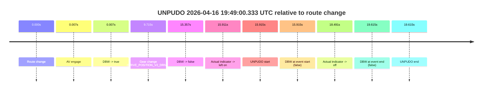
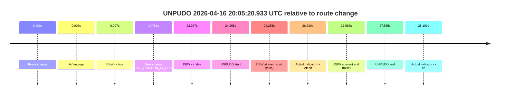
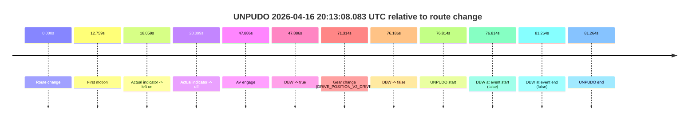
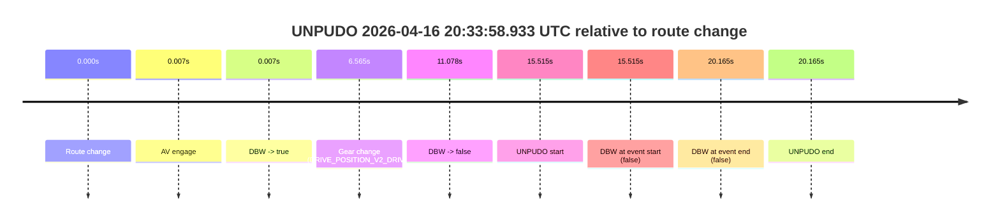
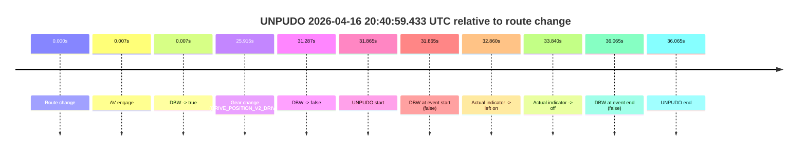
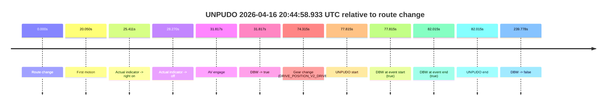

# Run Report: fme10010/2026-04-16--19-18-23--gen2-av-b47224bf-05fb-461a-a4a3-d419841e8c3d

| Field | Value |
|---|---|
| Run ID | `fme10010/2026-04-16--19-18-23--gen2-av-b47224bf-05fb-461a-a4a3-d419841e8c3d` |
| Date | `2026-04-16` |
| Model(s) | `armadillo-amethyst-squeaky` |
| Author | `guy.geva` |
| Event count | `11` |

## unpudo 2026-04-16 19:36:32.933 UTC

| Field | Value |
|---|---|
| Model | `armadillo-amethyst-squeaky` |
| Author | `guy.geva` |
| Run ID | `fme10010/2026-04-16--19-18-23--gen2-av-b47224bf-05fb-461a-a4a3-d419841e8c3d` |
| Date | `2026-04-16` |
| Time (UTC) | `19:36:32.933` |
| Event type | `unpudo` |
| Disengagement type | `failed_to_unpudo` |
| Route change | `found` |
| Console | [run](https://console.sso.wayve.ai/run/fme10010/2026-04-16--19-18-23--gen2-av-b47224bf-05fb-461a-a4a3-d419841e8c3d?id=&time-unixus=1776368192933299) |
| Foxglove | [segment](https://app.foxglove.dev/wayve-on-prem/p/prj_0dX18KZdVHg1fmmI/view?ds=foxglove-stream&ds.deviceName=fme10010&ds.start=2026-04-16T19%3A36%3A06.668533Z&ds.end=2026-04-16T19%3A36%3A46.233294Z&layoutId=lay_0e7VD4WIKDQGU73Y&time=2026-04-16T19%3A36%3A32.933299Z) |

### Event card: fail

- Fail: AV owns part of the segment, but the event still resolves as a model-performance failure under the AV-only scoring rule.

| Event | Time (UTC) | Delta from route change |
|---|---:|---:|
| Route change | 2026-04-16 19:36:16.668 | `0.000s` |
| AV engage | 2026-04-16 19:36:16.675 | `0.007s` |
| DBW -> true | 2026-04-16 19:36:16.675 | `0.007s` |
| Gear change (DRIVE_POSITION_V2_DRIVE) | 2026-04-16 19:36:28.483 | `11.815s` |
| DBW -> false | 2026-04-16 19:36:32.376 | `15.708s` |
| UNPUDO start | 2026-04-16 19:36:32.933 | `16.265s` |
| DBW at event start (false) | 2026-04-16 19:36:32.933 | `16.265s` |
| DBW at event end (false) | 2026-04-16 19:36:36.233 | `19.565s` |
| UNPUDO end | 2026-04-16 19:36:36.233 | `19.565s` |

| Metric | Value |
|---|---|
| Outcome | `fail` |
| Effective failure type | `failed_to_unpudo` |
| Route change status | `found` |
| DBW at event start | `false` |
| DBW at event end | `false` |
| Predicted gear at AV start | `DRIVE_POSITION_V2_PARK` |
| Actual gear at AV start | `DRIVE_POSITION_V2_PARK` |
| Predicted gear at event start | `DRIVE_POSITION_V2_DRIVE` |
| Actual gear at event start | `DRIVE_POSITION_V2_DRIVE` |
| Planned indicator direction | `INDICATORS_STATE_V2_RIGHT_ON` |
| Controller indicator direction | `INDICATORS_STATE_V2_RIGHT_ON` |
| Actual indicator direction | `INDICATORS_STATE_V2_OFF` |
| Actual indicator at maneuver end | `INDICATORS_STATE_V2_OFF` |
| Driver accel help in AV | `false` |
| Driver accel help timestamp | `n/a` |
| Max accel pedal pct in AV | `0.0%` |
| Max brake pedal pct in AV | `8.0%` |
| Max speed mps in AV | `0.000` |
| Success timing baseline | `route change` |
| Route -> AV | `0.007s` |
| AV -> event start | `16.258s` |
| AV -> first motion | `n/a` |
| Success baseline -> event start | `16.265s` |
| Success baseline -> first motion | `n/a` |
| AV duration before disengagement | `15.701s` |
| Trajectory waypoint count | `35` |
| Driving-plan step count | `11` |

The scored portion starts from the AV-owned window, not from the pre-AV setup. Route-change search in the stopped pre-event segment was `found`, with the baseline therefore set to route change. At the event anchor the model predicts `DRIVE_POSITION_V2_DRIVE` and the actual gear is `DRIVE_POSITION_V2_DRIVE`. The effective model outcome is `fail` because `failed_to_unpudo.`

### Resolution

| Field | Value |
|---|---|
| Final outcome | `fail` |
| Do we agree with this label? | `yes` |
| Source disengagement type | `failed_to_unpudo` |
| Resolved effective failure type | `failed_to_unpudo` |
| Confidence | `high` |

## unpudo 2026-04-16 19:49:00.333 UTC

| Field | Value |
|---|---|
| Model | `armadillo-amethyst-squeaky` |
| Author | `guy.geva` |
| Run ID | `fme10010/2026-04-16--19-18-23--gen2-av-b47224bf-05fb-461a-a4a3-d419841e8c3d` |
| Date | `2026-04-16` |
| Time (UTC) | `19:49:00.333` |
| Event type | `unpudo` |
| Disengagement type | `failed_to_unpudo` |
| Route change | `found` |
| Console | [run](https://console.sso.wayve.ai/run/fme10010/2026-04-16--19-18-23--gen2-av-b47224bf-05fb-461a-a4a3-d419841e8c3d?id=&time-unixus=1776368940333305) |
| Foxglove | [segment](https://app.foxglove.dev/wayve-on-prem/p/prj_0dX18KZdVHg1fmmI/view?ds=foxglove-stream&ds.deviceName=fme10010&ds.start=2026-04-16T19%3A48%3A34.418259Z&ds.end=2026-04-16T19%3A49%3A14.033308Z&layoutId=lay_0e7VD4WIKDQGU73Y&time=2026-04-16T19%3A49%3A00.333305Z) |

### Event card: fail

- Fail: AV owns part of the segment, but the event still resolves as a model-performance failure under the AV-only scoring rule.

| Event | Time (UTC) | Delta from route change |
|---|---:|---:|
| Route change | 2026-04-16 19:48:44.418 | `0.000s` |
| AV engage | 2026-04-16 19:48:44.425 | `0.007s` |
| DBW -> true | 2026-04-16 19:48:44.425 | `0.007s` |
| Gear change (DRIVE_POSITION_V2_DRIVE) | 2026-04-16 19:48:54.133 | `9.715s` |
| DBW -> false | 2026-04-16 19:48:59.775 | `15.357s` |
| Actual indicator -> left on | 2026-04-16 19:49:00.328 | `15.911s` |
| UNPUDO start | 2026-04-16 19:49:00.333 | `15.915s` |
| DBW at event start (false) | 2026-04-16 19:49:00.333 | `15.915s` |
| Actual indicator -> off | 2026-04-16 19:49:02.908 | `18.491s` |
| DBW at event end (false) | 2026-04-16 19:49:04.033 | `19.615s` |
| UNPUDO end | 2026-04-16 19:49:04.033 | `19.615s` |

| Metric | Value |
|---|---|
| Outcome | `fail` |
| Effective failure type | `failed_to_unpudo` |
| Route change status | `found` |
| DBW at event start | `false` |
| DBW at event end | `false` |
| Predicted gear at AV start | `DRIVE_POSITION_V2_PARK` |
| Actual gear at AV start | `DRIVE_POSITION_V2_PARK` |
| Predicted gear at event start | `DRIVE_POSITION_V2_DRIVE` |
| Actual gear at event start | `DRIVE_POSITION_V2_DRIVE` |
| Planned indicator direction | `INDICATORS_STATE_V2_LEFT_ON` |
| Controller indicator direction | `INDICATORS_STATE_V2_LEFT_ON` |
| Actual indicator direction | `INDICATORS_STATE_V2_LEFT_ON` |
| Actual indicator at maneuver end | `INDICATORS_STATE_V2_OFF` |
| Driver accel help in AV | `false` |
| Driver accel help timestamp | `n/a` |
| Max accel pedal pct in AV | `0.0%` |
| Max brake pedal pct in AV | `8.0%` |
| Max speed mps in AV | `0.000` |
| Success timing baseline | `route change` |
| Route -> AV | `0.007s` |
| AV -> event start | `15.908s` |
| AV -> first motion | `n/a` |
| Success baseline -> event start | `15.915s` |
| Success baseline -> first motion | `n/a` |
| AV duration before disengagement | `15.350s` |
| Trajectory waypoint count | `35` |
| Driving-plan step count | `11` |

The scored portion starts from the AV-owned window, not from the pre-AV setup. Route-change search in the stopped pre-event segment was `found`, with the baseline therefore set to route change. At the event anchor the model predicts `DRIVE_POSITION_V2_DRIVE` and the actual gear is `DRIVE_POSITION_V2_DRIVE`. The effective model outcome is `fail` because `failed_to_unpudo.`

### Resolution

| Field | Value |
|---|---|
| Final outcome | `fail` |
| Do we agree with this label? | `yes` |
| Source disengagement type | `failed_to_unpudo` |
| Resolved effective failure type | `failed_to_unpudo` |
| Confidence | `high` |

## unpudo 2026-04-16 19:59:10.183 UTC

| Field | Value |
|---|---|
| Model | `armadillo-amethyst-squeaky` |
| Author | `guy.geva` |
| Run ID | `fme10010/2026-04-16--19-18-23--gen2-av-b47224bf-05fb-461a-a4a3-d419841e8c3d` |
| Date | `2026-04-16` |
| Time (UTC) | `19:59:10.183` |
| Event type | `unpudo` |
| Disengagement type | `failed_to_unpudo` |
| Route change | `found` |
| Console | [run](https://console.sso.wayve.ai/run/fme10010/2026-04-16--19-18-23--gen2-av-b47224bf-05fb-461a-a4a3-d419841e8c3d?id=&time-unixus=1776369550183303) |
| Foxglove | [segment](https://app.foxglove.dev/wayve-on-prem/p/prj_0dX18KZdVHg1fmmI/view?ds=foxglove-stream&ds.deviceName=fme10010&ds.start=2026-04-16T19%3A58%3A43.018278Z&ds.end=2026-04-16T19%3A59%3A23.933308Z&layoutId=lay_0e7VD4WIKDQGU73Y&time=2026-04-16T19%3A59%3A10.183303Z) |

### Event card: fail

- Fail: AV owns part of the segment, but the event still resolves as a model-performance failure under the AV-only scoring rule.

| Event | Time (UTC) | Delta from route change |
|---|---:|---:|
| Route change | 2026-04-16 19:58:53.018 | `0.000s` |
| AV engage | 2026-04-16 19:58:53.025 | `0.007s` |
| DBW -> true | 2026-04-16 19:58:53.025 | `0.007s` |
| Gear change (DRIVE_POSITION_V2_DRIVE) | 2026-04-16 19:59:02.183 | `9.165s` |
| DBW -> false | 2026-04-16 19:59:09.475 | `16.457s` |
| UNPUDO start | 2026-04-16 19:59:10.183 | `17.165s` |
| DBW at event start (false) | 2026-04-16 19:59:10.183 | `17.165s` |
| Actual indicator -> left on | 2026-04-16 19:59:10.409 | `17.391s` |
| Actual indicator -> off | 2026-04-16 19:59:12.208 | `19.191s` |
| DBW at event end (false) | 2026-04-16 19:59:13.933 | `20.915s` |
| UNPUDO end | 2026-04-16 19:59:13.933 | `20.915s` |

| Metric | Value |
|---|---|
| Outcome | `fail` |
| Effective failure type | `failed_to_unpudo` |
| Route change status | `found` |
| DBW at event start | `false` |
| DBW at event end | `false` |
| Predicted gear at AV start | `DRIVE_POSITION_V2_PARK` |
| Actual gear at AV start | `DRIVE_POSITION_V2_PARK` |
| Predicted gear at event start | `DRIVE_POSITION_V2_DRIVE` |
| Actual gear at event start | `DRIVE_POSITION_V2_DRIVE` |
| Planned indicator direction | `INDICATORS_STATE_V2_LEFT_ON` |
| Controller indicator direction | `INDICATORS_STATE_V2_LEFT_ON` |
| Actual indicator direction | `INDICATORS_STATE_V2_OFF` |
| Actual indicator at maneuver end | `INDICATORS_STATE_V2_OFF` |
| Driver accel help in AV | `false` |
| Driver accel help timestamp | `n/a` |
| Max accel pedal pct in AV | `0.0%` |
| Max brake pedal pct in AV | `8.0%` |
| Max speed mps in AV | `0.000` |
| Success timing baseline | `route change` |
| Route -> AV | `0.007s` |
| AV -> event start | `17.158s` |
| AV -> first motion | `n/a` |
| Success baseline -> event start | `17.165s` |
| Success baseline -> first motion | `n/a` |
| AV duration before disengagement | `16.450s` |
| Trajectory waypoint count | `36` |
| Driving-plan step count | `11` |

The scored portion starts from the AV-owned window, not from the pre-AV setup. Route-change search in the stopped pre-event segment was `found`, with the baseline therefore set to route change. At the event anchor the model predicts `DRIVE_POSITION_V2_DRIVE` and the actual gear is `DRIVE_POSITION_V2_DRIVE`. The effective model outcome is `fail` because `failed_to_unpudo.`

### Resolution

| Field | Value |
|---|---|
| Final outcome | `fail` |
| Do we agree with this label? | `yes` |
| Source disengagement type | `failed_to_unpudo` |
| Resolved effective failure type | `failed_to_unpudo` |
| Confidence | `high` |

## unpudo 2026-04-16 20:05:20.933 UTC

| Field | Value |
|---|---|
| Model | `armadillo-amethyst-squeaky` |
| Author | `guy.geva` |
| Run ID | `fme10010/2026-04-16--19-18-23--gen2-av-b47224bf-05fb-461a-a4a3-d419841e8c3d` |
| Date | `2026-04-16` |
| Time (UTC) | `20:05:20.933` |
| Event type | `unpudo` |
| Disengagement type | `failed_to_unpudo` |
| Route change | `found` |
| Console | [run](https://console.sso.wayve.ai/run/fme10010/2026-04-16--19-18-23--gen2-av-b47224bf-05fb-461a-a4a3-d419841e8c3d?id=&time-unixus=1776369920933310) |
| Foxglove | [segment](https://app.foxglove.dev/wayve-on-prem/p/prj_0dX18KZdVHg1fmmI/view?ds=foxglove-stream&ds.deviceName=fme10010&ds.start=2026-04-16T20%3A04%3A46.668263Z&ds.end=2026-04-16T20%3A05%3A34.233309Z&layoutId=lay_0e7VD4WIKDQGU73Y&time=2026-04-16T20%3A05%3A20.933310Z) |

### Event card: fail

- Fail: AV owns part of the segment, but the event still resolves as a model-performance failure under the AV-only scoring rule.

| Event | Time (UTC) | Delta from route change |
|---|---:|---:|
| Route change | 2026-04-16 20:04:56.668 | `0.000s` |
| AV engage | 2026-04-16 20:04:56.675 | `0.007s` |
| DBW -> true | 2026-04-16 20:04:56.675 | `0.007s` |
| Gear change (DRIVE_POSITION_V2_DRIVE) | 2026-04-16 20:05:14.433 | `17.765s` |
| DBW -> false | 2026-04-16 20:05:20.595 | `23.927s` |
| UNPUDO start | 2026-04-16 20:05:20.933 | `24.265s` |
| DBW at event start (false) | 2026-04-16 20:05:20.933 | `24.265s` |
| Actual indicator -> left on | 2026-04-16 20:05:22.868 | `26.200s` |
| DBW at event end (false) | 2026-04-16 20:05:24.233 | `27.565s` |
| UNPUDO end | 2026-04-16 20:05:24.233 | `27.565s` |
| Actual indicator -> off | 2026-04-16 20:05:24.768 | `28.100s` |

| Metric | Value |
|---|---|
| Outcome | `fail` |
| Effective failure type | `failed_to_unpudo` |
| Route change status | `found` |
| DBW at event start | `false` |
| DBW at event end | `false` |
| Predicted gear at AV start | `DRIVE_POSITION_V2_PARK` |
| Actual gear at AV start | `DRIVE_POSITION_V2_PARK` |
| Predicted gear at event start | `DRIVE_POSITION_V2_DRIVE` |
| Actual gear at event start | `DRIVE_POSITION_V2_DRIVE` |
| Planned indicator direction | `INDICATORS_STATE_V2_LEFT_ON` |
| Controller indicator direction | `INDICATORS_STATE_V2_LEFT_ON` |
| Actual indicator direction | `INDICATORS_STATE_V2_OFF` |
| Actual indicator at maneuver end | `INDICATORS_STATE_V2_LEFT_ON` |
| Driver accel help in AV | `false` |
| Driver accel help timestamp | `n/a` |
| Max accel pedal pct in AV | `0.0%` |
| Max brake pedal pct in AV | `8.0%` |
| Max speed mps in AV | `0.000` |
| Success timing baseline | `route change` |
| Route -> AV | `0.007s` |
| AV -> event start | `24.258s` |
| AV -> first motion | `n/a` |
| Success baseline -> event start | `24.265s` |
| Success baseline -> first motion | `n/a` |
| AV duration before disengagement | `23.920s` |
| Trajectory waypoint count | `35` |
| Driving-plan step count | `11` |

The scored portion starts from the AV-owned window, not from the pre-AV setup. Route-change search in the stopped pre-event segment was `found`, with the baseline therefore set to route change. At the event anchor the model predicts `DRIVE_POSITION_V2_DRIVE` and the actual gear is `DRIVE_POSITION_V2_DRIVE`. The effective model outcome is `fail` because `failed_to_unpudo.`

### Resolution

| Field | Value |
|---|---|
| Final outcome | `fail` |
| Do we agree with this label? | `yes` |
| Source disengagement type | `failed_to_unpudo` |
| Resolved effective failure type | `failed_to_unpudo` |
| Confidence | `high` |

## unpudo 2026-04-16 20:13:08.083 UTC

| Field | Value |
|---|---|
| Model | `armadillo-amethyst-squeaky` |
| Author | `guy.geva` |
| Run ID | `fme10010/2026-04-16--19-18-23--gen2-av-b47224bf-05fb-461a-a4a3-d419841e8c3d` |
| Date | `2026-04-16` |
| Time (UTC) | `20:13:08.083` |
| Event type | `unpudo` |
| Disengagement type | `failed_to_unpudo` |
| Route change | `found` |
| Console | [run](https://console.sso.wayve.ai/run/fme10010/2026-04-16--19-18-23--gen2-av-b47224bf-05fb-461a-a4a3-d419841e8c3d?id=&time-unixus=1776370388083299) |
| Foxglove | [segment](https://app.foxglove.dev/wayve-on-prem/p/prj_0dX18KZdVHg1fmmI/view?ds=foxglove-stream&ds.deviceName=fme10010&ds.start=2026-04-16T20%3A11%3A41.269265Z&ds.end=2026-04-16T20%3A13%3A22.533292Z&layoutId=lay_0e7VD4WIKDQGU73Y&time=2026-04-16T20%3A13%3A08.083299Z) |

### Event card: fail

- Fail: AV owns part of the segment, but the event still resolves as a model-performance failure under the AV-only scoring rule.

| Event | Time (UTC) | Delta from route change |
|---|---:|---:|
| Route change | 2026-04-16 20:11:51.269 | `0.000s` |
| First motion | 2026-04-16 20:12:04.028 | `12.759s` |
| Actual indicator -> left on | 2026-04-16 20:12:09.328 | `18.059s` |
| Actual indicator -> off | 2026-04-16 20:12:11.368 | `20.099s` |
| AV engage | 2026-04-16 20:12:39.155 | `47.886s` |
| DBW -> true | 2026-04-16 20:12:39.155 | `47.886s` |
| Gear change (DRIVE_POSITION_V2_DRIVE) | 2026-04-16 20:13:02.583 | `71.314s` |
| DBW -> false | 2026-04-16 20:13:07.455 | `76.186s` |
| UNPUDO start | 2026-04-16 20:13:08.083 | `76.814s` |
| DBW at event start (false) | 2026-04-16 20:13:08.083 | `76.814s` |
| DBW at event end (false) | 2026-04-16 20:13:12.533 | `81.264s` |
| UNPUDO end | 2026-04-16 20:13:12.533 | `81.264s` |

| Metric | Value |
|---|---|
| Outcome | `fail` |
| Effective failure type | `failed_to_unpudo` |
| Route change status | `found` |
| DBW at event start | `false` |
| DBW at event end | `false` |
| Predicted gear at AV start | `DRIVE_POSITION_V2_DRIVE` |
| Actual gear at AV start | `DRIVE_POSITION_V2_DRIVE` |
| Predicted gear at event start | `DRIVE_POSITION_V2_DRIVE` |
| Actual gear at event start | `DRIVE_POSITION_V2_DRIVE` |
| Planned indicator direction | `INDICATORS_STATE_V2_LEFT_ON` |
| Controller indicator direction | `INDICATORS_STATE_V2_LEFT_ON` |
| Actual indicator direction | `INDICATORS_STATE_V2_OFF` |
| Actual indicator at maneuver end | `INDICATORS_STATE_V2_OFF` |
| Driver accel help in AV | `false` |
| Driver accel help timestamp | `n/a` |
| Max accel pedal pct in AV | `0.0%` |
| Max brake pedal pct in AV | `15.6%` |
| Max speed mps in AV | `2.217` |
| Success timing baseline | `route change` |
| Route -> AV | `47.886s` |
| AV -> event start | `28.928s` |
| AV -> first motion | `-35.127s` |
| Success baseline -> event start | `76.814s` |
| Success baseline -> first motion | `12.759s` |
| AV duration before disengagement | `28.300s` |
| Trajectory waypoint count | `36` |
| Driving-plan step count | `11` |

The scored portion starts from the AV-owned window, not from the pre-AV setup. Route-change search in the stopped pre-event segment was `found`, with the baseline therefore set to route change. At the event anchor the model predicts `DRIVE_POSITION_V2_DRIVE` and the actual gear is `DRIVE_POSITION_V2_DRIVE`. The effective model outcome is `fail` because `failed_to_unpudo.`

### Resolution

| Field | Value |
|---|---|
| Final outcome | `fail` |
| Do we agree with this label? | `yes` |
| Source disengagement type | `failed_to_unpudo` |
| Resolved effective failure type | `failed_to_unpudo` |
| Confidence | `high` |

## unpudo 2026-04-16 20:20:25.983 UTC

| Field | Value |
|---|---|
| Model | `armadillo-amethyst-squeaky` |
| Author | `guy.geva` |
| Run ID | `fme10010/2026-04-16--19-18-23--gen2-av-b47224bf-05fb-461a-a4a3-d419841e8c3d` |
| Date | `2026-04-16` |
| Time (UTC) | `20:20:25.983` |
| Event type | `unpudo` |
| Disengagement type | `failed_to_unpudo` |
| Route change | `found` |
| Console | [run](https://console.sso.wayve.ai/run/fme10010/2026-04-16--19-18-23--gen2-av-b47224bf-05fb-461a-a4a3-d419841e8c3d?id=&time-unixus=1776370825983310) |
| Foxglove | [segment](https://app.foxglove.dev/wayve-on-prem/p/prj_0dX18KZdVHg1fmmI/view?ds=foxglove-stream&ds.deviceName=fme10010&ds.start=2026-04-16T20%3A18%3A55.268268Z&ds.end=2026-04-16T20%3A20%3A39.633317Z&layoutId=lay_0e7VD4WIKDQGU73Y&time=2026-04-16T20%3A20%3A25.983310Z) |

### Event card: fail

- Fail: AV owns part of the segment, but the event still resolves as a model-performance failure under the AV-only scoring rule.

| Event | Time (UTC) | Delta from route change |
|---|---:|---:|
| Route change | 2026-04-16 20:19:05.268 | `0.000s` |
| AV engage | 2026-04-16 20:20:16.015 | `70.747s` |
| DBW -> true | 2026-04-16 20:20:16.015 | `70.747s` |
| Gear change (DRIVE_POSITION_V2_DRIVE) | 2026-04-16 20:20:18.483 | `73.215s` |
| DBW -> false | 2026-04-16 20:20:25.435 | `80.167s` |
| UNPUDO start | 2026-04-16 20:20:25.983 | `80.715s` |
| DBW at event start (false) | 2026-04-16 20:20:25.983 | `80.715s` |
| Actual indicator -> left on | 2026-04-16 20:20:27.788 | `82.521s` |
| Actual indicator -> off | 2026-04-16 20:20:29.249 | `83.981s` |
| DBW at event end (false) | 2026-04-16 20:20:29.633 | `84.365s` |
| UNPUDO end | 2026-04-16 20:20:29.633 | `84.365s` |

| Metric | Value |
|---|---|
| Outcome | `fail` |
| Effective failure type | `failed_to_unpudo` |
| Route change status | `found` |
| DBW at event start | `false` |
| DBW at event end | `false` |
| Predicted gear at AV start | `DRIVE_POSITION_V2_PARK` |
| Actual gear at AV start | `DRIVE_POSITION_V2_PARK` |
| Predicted gear at event start | `DRIVE_POSITION_V2_DRIVE` |
| Actual gear at event start | `DRIVE_POSITION_V2_DRIVE` |
| Planned indicator direction | `INDICATORS_STATE_V2_LEFT_ON` |
| Controller indicator direction | `INDICATORS_STATE_V2_LEFT_ON` |
| Actual indicator direction | `INDICATORS_STATE_V2_OFF` |
| Actual indicator at maneuver end | `INDICATORS_STATE_V2_OFF` |
| Driver accel help in AV | `false` |
| Driver accel help timestamp | `n/a` |
| Max accel pedal pct in AV | `0.0%` |
| Max brake pedal pct in AV | `8.0%` |
| Max speed mps in AV | `0.000` |
| Success timing baseline | `route change` |
| Route -> AV | `70.747s` |
| AV -> event start | `9.968s` |
| AV -> first motion | `n/a` |
| Success baseline -> event start | `80.715s` |
| Success baseline -> first motion | `n/a` |
| AV duration before disengagement | `9.420s` |
| Trajectory waypoint count | `36` |
| Driving-plan step count | `11` |

The scored portion starts from the AV-owned window, not from the pre-AV setup. Route-change search in the stopped pre-event segment was `found`, with the baseline therefore set to route change. At the event anchor the model predicts `DRIVE_POSITION_V2_DRIVE` and the actual gear is `DRIVE_POSITION_V2_DRIVE`. The effective model outcome is `fail` because `failed_to_unpudo.`

### Resolution

| Field | Value |
|---|---|
| Final outcome | `fail` |
| Do we agree with this label? | `yes` |
| Source disengagement type | `failed_to_unpudo` |
| Resolved effective failure type | `failed_to_unpudo` |
| Confidence | `high` |

## unpudo 2026-04-16 20:33:58.933 UTC

| Field | Value |
|---|---|
| Model | `armadillo-amethyst-squeaky` |
| Author | `guy.geva` |
| Run ID | `fme10010/2026-04-16--19-18-23--gen2-av-b47224bf-05fb-461a-a4a3-d419841e8c3d` |
| Date | `2026-04-16` |
| Time (UTC) | `20:33:58.933` |
| Event type | `unpudo` |
| Disengagement type | `failed_to_unpudo` |
| Route change | `found` |
| Console | [run](https://console.sso.wayve.ai/run/fme10010/2026-04-16--19-18-23--gen2-av-b47224bf-05fb-461a-a4a3-d419841e8c3d?id=&time-unixus=1776371638933323) |
| Foxglove | [segment](https://app.foxglove.dev/wayve-on-prem/p/prj_0dX18KZdVHg1fmmI/view?ds=foxglove-stream&ds.deviceName=fme10010&ds.start=2026-04-16T20%3A33%3A33.418269Z&ds.end=2026-04-16T20%3A34%3A13.583323Z&layoutId=lay_0e7VD4WIKDQGU73Y&time=2026-04-16T20%3A33%3A58.933323Z) |

### Event card: fail

- Fail: AV owns part of the segment, but the event still resolves as a model-performance failure under the AV-only scoring rule.

| Event | Time (UTC) | Delta from route change |
|---|---:|---:|
| Route change | 2026-04-16 20:33:43.418 | `0.000s` |
| AV engage | 2026-04-16 20:33:43.425 | `0.007s` |
| DBW -> true | 2026-04-16 20:33:43.425 | `0.007s` |
| Gear change (DRIVE_POSITION_V2_DRIVE) | 2026-04-16 20:33:49.983 | `6.565s` |
| DBW -> false | 2026-04-16 20:33:54.496 | `11.078s` |
| UNPUDO start | 2026-04-16 20:33:58.933 | `15.515s` |
| DBW at event start (false) | 2026-04-16 20:33:58.933 | `15.515s` |
| DBW at event end (false) | 2026-04-16 20:34:03.583 | `20.165s` |
| UNPUDO end | 2026-04-16 20:34:03.583 | `20.165s` |

| Metric | Value |
|---|---|
| Outcome | `fail` |
| Effective failure type | `failed_to_unpudo` |
| Route change status | `found` |
| DBW at event start | `false` |
| DBW at event end | `false` |
| Predicted gear at AV start | `DRIVE_POSITION_V2_PARK` |
| Actual gear at AV start | `DRIVE_POSITION_V2_PARK` |
| Predicted gear at event start | `DRIVE_POSITION_V2_REVERSE` |
| Actual gear at event start | `DRIVE_POSITION_V2_DRIVE` |
| Planned indicator direction | `INDICATORS_STATE_V2_OFF` |
| Controller indicator direction | `INDICATORS_STATE_V2_OFF` |
| Actual indicator direction | `INDICATORS_STATE_V2_OFF` |
| Actual indicator at maneuver end | `INDICATORS_STATE_V2_OFF` |
| Driver accel help in AV | `false` |
| Driver accel help timestamp | `n/a` |
| Max accel pedal pct in AV | `0.0%` |
| Max brake pedal pct in AV | `8.0%` |
| Max speed mps in AV | `0.000` |
| Success timing baseline | `route change` |
| Route -> AV | `0.007s` |
| AV -> event start | `15.508s` |
| AV -> first motion | `n/a` |
| Success baseline -> event start | `15.515s` |
| Success baseline -> first motion | `n/a` |
| AV duration before disengagement | `11.071s` |
| Trajectory waypoint count | `35` |
| Driving-plan step count | `11` |

The scored portion starts from the AV-owned window, not from the pre-AV setup. Route-change search in the stopped pre-event segment was `found`, with the baseline therefore set to route change. At the event anchor the model predicts `DRIVE_POSITION_V2_REVERSE` and the actual gear is `DRIVE_POSITION_V2_DRIVE`. The effective model outcome is `fail` because `failed_to_unpudo.`

### Resolution

| Field | Value |
|---|---|
| Final outcome | `fail` |
| Do we agree with this label? | `yes` |
| Source disengagement type | `failed_to_unpudo` |
| Resolved effective failure type | `failed_to_unpudo` |
| Confidence | `high` |

## unpudo 2026-04-16 20:36:05.233 UTC

| Field | Value |
|---|---|
| Model | `armadillo-amethyst-squeaky` |
| Author | `guy.geva` |
| Run ID | `fme10010/2026-04-16--19-18-23--gen2-av-b47224bf-05fb-461a-a4a3-d419841e8c3d` |
| Date | `2026-04-16` |
| Time (UTC) | `20:36:05.233` |
| Event type | `unpudo` |
| Disengagement type | `failed_to_unpudo` |
| Route change | `found` |
| Console | [run](https://console.sso.wayve.ai/run/fme10010/2026-04-16--19-18-23--gen2-av-b47224bf-05fb-461a-a4a3-d419841e8c3d?id=&time-unixus=1776371765233315) |
| Foxglove | [segment](https://app.foxglove.dev/wayve-on-prem/p/prj_0dX18KZdVHg1fmmI/view?ds=foxglove-stream&ds.deviceName=fme10010&ds.start=2026-04-16T20%3A35%3A25.818269Z&ds.end=2026-04-16T20%3A36%3A18.233311Z&layoutId=lay_0e7VD4WIKDQGU73Y&time=2026-04-16T20%3A36%3A05.233315Z) |

### Event card: fail

- Fail: AV owns part of the segment, but the event still resolves as a model-performance failure under the AV-only scoring rule.

| Event | Time (UTC) | Delta from route change |
|---|---:|---:|
| Route change | 2026-04-16 20:35:35.818 | `0.000s` |
| AV engage | 2026-04-16 20:35:35.825 | `0.007s` |
| DBW -> true | 2026-04-16 20:35:35.825 | `0.007s` |
| Gear change (DRIVE_POSITION_V2_DRIVE) | 2026-04-16 20:36:00.433 | `24.615s` |
| DBW -> false | 2026-04-16 20:36:04.715 | `28.897s` |
| UNPUDO start | 2026-04-16 20:36:05.233 | `29.415s` |
| DBW at event start (false) | 2026-04-16 20:36:05.233 | `29.415s` |
| Actual indicator -> left on | 2026-04-16 20:36:05.868 | `30.050s` |
| Actual indicator -> off | 2026-04-16 20:36:07.608 | `31.790s` |
| DBW at event end (false) | 2026-04-16 20:36:08.233 | `32.415s` |
| UNPUDO end | 2026-04-16 20:36:08.233 | `32.415s` |

| Metric | Value |
|---|---|
| Outcome | `fail` |
| Effective failure type | `failed_to_unpudo` |
| Route change status | `found` |
| DBW at event start | `false` |
| DBW at event end | `false` |
| Predicted gear at AV start | `DRIVE_POSITION_V2_PARK` |
| Actual gear at AV start | `DRIVE_POSITION_V2_PARK` |
| Predicted gear at event start | `DRIVE_POSITION_V2_DRIVE` |
| Actual gear at event start | `DRIVE_POSITION_V2_DRIVE` |
| Planned indicator direction | `INDICATORS_STATE_V2_LEFT_ON` |
| Controller indicator direction | `INDICATORS_STATE_V2_LEFT_ON` |
| Actual indicator direction | `INDICATORS_STATE_V2_OFF` |
| Actual indicator at maneuver end | `INDICATORS_STATE_V2_OFF` |
| Driver accel help in AV | `false` |
| Driver accel help timestamp | `n/a` |
| Max accel pedal pct in AV | `0.0%` |
| Max brake pedal pct in AV | `8.0%` |
| Max speed mps in AV | `0.000` |
| Success timing baseline | `route change` |
| Route -> AV | `0.007s` |
| AV -> event start | `29.408s` |
| AV -> first motion | `n/a` |
| Success baseline -> event start | `29.415s` |
| Success baseline -> first motion | `n/a` |
| AV duration before disengagement | `28.890s` |
| Trajectory waypoint count | `35` |
| Driving-plan step count | `11` |

The scored portion starts from the AV-owned window, not from the pre-AV setup. Route-change search in the stopped pre-event segment was `found`, with the baseline therefore set to route change. At the event anchor the model predicts `DRIVE_POSITION_V2_DRIVE` and the actual gear is `DRIVE_POSITION_V2_DRIVE`. The effective model outcome is `fail` because `failed_to_unpudo.`

### Resolution

| Field | Value |
|---|---|
| Final outcome | `fail` |
| Do we agree with this label? | `yes` |
| Source disengagement type | `failed_to_unpudo` |
| Resolved effective failure type | `failed_to_unpudo` |
| Confidence | `high` |

## unpudo 2026-04-16 20:39:14.333 UTC

| Field | Value |
|---|---|
| Model | `armadillo-amethyst-squeaky` |
| Author | `guy.geva` |
| Run ID | `fme10010/2026-04-16--19-18-23--gen2-av-b47224bf-05fb-461a-a4a3-d419841e8c3d` |
| Date | `2026-04-16` |
| Time (UTC) | `20:39:14.333` |
| Event type | `unpudo` |
| Disengagement type | `failed_to_unpudo` |
| Route change | `found` |
| Console | [run](https://console.sso.wayve.ai/run/fme10010/2026-04-16--19-18-23--gen2-av-b47224bf-05fb-461a-a4a3-d419841e8c3d?id=&time-unixus=1776371954333312) |
| Foxglove | [segment](https://app.foxglove.dev/wayve-on-prem/p/prj_0dX18KZdVHg1fmmI/view?ds=foxglove-stream&ds.deviceName=fme10010&ds.start=2026-04-16T20%3A38%3A47.568251Z&ds.end=2026-04-16T20%3A39%3A30.683309Z&layoutId=lay_0e7VD4WIKDQGU73Y&time=2026-04-16T20%3A39%3A14.333312Z) |

### Event card: fail

- Fail: AV owns part of the segment, but the event still resolves as a model-performance failure under the AV-only scoring rule.

| Event | Time (UTC) | Delta from route change |
|---|---:|---:|
| Route change | 2026-04-16 20:38:57.568 | `0.000s` |
| AV engage | 2026-04-16 20:38:57.575 | `0.007s` |
| DBW -> true | 2026-04-16 20:38:57.575 | `0.007s` |
| Gear change (DRIVE_POSITION_V2_REVERSE) | 2026-04-16 20:39:03.583 | `6.015s` |
| DBW -> false | 2026-04-16 20:39:08.735 | `11.168s` |
| UNPUDO start | 2026-04-16 20:39:14.333 | `16.765s` |
| DBW at event start (false) | 2026-04-16 20:39:14.333 | `16.765s` |
| DBW at event end (false) | 2026-04-16 20:39:20.683 | `23.115s` |
| UNPUDO end | 2026-04-16 20:39:20.683 | `23.115s` |

| Metric | Value |
|---|---|
| Outcome | `fail` |
| Effective failure type | `failed_to_unpudo` |
| Route change status | `found` |
| DBW at event start | `false` |
| DBW at event end | `false` |
| Predicted gear at AV start | `DRIVE_POSITION_V2_PARK` |
| Actual gear at AV start | `DRIVE_POSITION_V2_PARK` |
| Predicted gear at event start | `DRIVE_POSITION_V2_REVERSE` |
| Actual gear at event start | `DRIVE_POSITION_V2_REVERSE` |
| Planned indicator direction | `INDICATORS_STATE_V2_OFF` |
| Controller indicator direction | `INDICATORS_STATE_V2_OFF` |
| Actual indicator direction | `INDICATORS_STATE_V2_OFF` |
| Actual indicator at maneuver end | `INDICATORS_STATE_V2_OFF` |
| Driver accel help in AV | `false` |
| Driver accel help timestamp | `n/a` |
| Max accel pedal pct in AV | `0.0%` |
| Max brake pedal pct in AV | `8.0%` |
| Max speed mps in AV | `0.000` |
| Success timing baseline | `route change` |
| Route -> AV | `0.007s` |
| AV -> event start | `16.758s` |
| AV -> first motion | `n/a` |
| Success baseline -> event start | `16.765s` |
| Success baseline -> first motion | `n/a` |
| AV duration before disengagement | `11.160s` |
| Trajectory waypoint count | `35` |
| Driving-plan step count | `11` |

The scored portion starts from the AV-owned window, not from the pre-AV setup. Route-change search in the stopped pre-event segment was `found`, with the baseline therefore set to route change. At the event anchor the model predicts `DRIVE_POSITION_V2_REVERSE` and the actual gear is `DRIVE_POSITION_V2_REVERSE`. The effective model outcome is `fail` because `failed_to_unpudo.`

### Resolution

| Field | Value |
|---|---|
| Final outcome | `fail` |
| Do we agree with this label? | `yes` |
| Source disengagement type | `failed_to_unpudo` |
| Resolved effective failure type | `failed_to_unpudo` |
| Confidence | `high` |

## unpudo 2026-04-16 20:40:59.433 UTC

| Field | Value |
|---|---|
| Model | `armadillo-amethyst-squeaky` |
| Author | `guy.geva` |
| Run ID | `fme10010/2026-04-16--19-18-23--gen2-av-b47224bf-05fb-461a-a4a3-d419841e8c3d` |
| Date | `2026-04-16` |
| Time (UTC) | `20:40:59.433` |
| Event type | `unpudo` |
| Disengagement type | `failed_to_unpudo` |
| Route change | `found` |
| Console | [run](https://console.sso.wayve.ai/run/fme10010/2026-04-16--19-18-23--gen2-av-b47224bf-05fb-461a-a4a3-d419841e8c3d?id=&time-unixus=1776372059433320) |
| Foxglove | [segment](https://app.foxglove.dev/wayve-on-prem/p/prj_0dX18KZdVHg1fmmI/view?ds=foxglove-stream&ds.deviceName=fme10010&ds.start=2026-04-16T20%3A40%3A17.568253Z&ds.end=2026-04-16T20%3A41%3A13.633309Z&layoutId=lay_0e7VD4WIKDQGU73Y&time=2026-04-16T20%3A40%3A59.433320Z) |

### Event card: fail

- Fail: AV owns part of the segment, but the event still resolves as a model-performance failure under the AV-only scoring rule.

| Event | Time (UTC) | Delta from route change |
|---|---:|---:|
| Route change | 2026-04-16 20:40:27.568 | `0.000s` |
| AV engage | 2026-04-16 20:40:27.575 | `0.007s` |
| DBW -> true | 2026-04-16 20:40:27.575 | `0.007s` |
| Gear change (DRIVE_POSITION_V2_DRIVE) | 2026-04-16 20:40:53.483 | `25.915s` |
| DBW -> false | 2026-04-16 20:40:58.855 | `31.287s` |
| UNPUDO start | 2026-04-16 20:40:59.433 | `31.865s` |
| DBW at event start (false) | 2026-04-16 20:40:59.433 | `31.865s` |
| Actual indicator -> left on | 2026-04-16 20:41:00.428 | `32.860s` |
| Actual indicator -> off | 2026-04-16 20:41:01.408 | `33.840s` |
| DBW at event end (false) | 2026-04-16 20:41:03.633 | `36.065s` |
| UNPUDO end | 2026-04-16 20:41:03.633 | `36.065s` |

| Metric | Value |
|---|---|
| Outcome | `fail` |
| Effective failure type | `failed_to_unpudo` |
| Route change status | `found` |
| DBW at event start | `false` |
| DBW at event end | `false` |
| Predicted gear at AV start | `DRIVE_POSITION_V2_PARK` |
| Actual gear at AV start | `DRIVE_POSITION_V2_PARK` |
| Predicted gear at event start | `DRIVE_POSITION_V2_DRIVE` |
| Actual gear at event start | `DRIVE_POSITION_V2_DRIVE` |
| Planned indicator direction | `INDICATORS_STATE_V2_LEFT_ON` |
| Controller indicator direction | `INDICATORS_STATE_V2_LEFT_ON` |
| Actual indicator direction | `INDICATORS_STATE_V2_OFF` |
| Actual indicator at maneuver end | `INDICATORS_STATE_V2_OFF` |
| Driver accel help in AV | `false` |
| Driver accel help timestamp | `n/a` |
| Max accel pedal pct in AV | `0.0%` |
| Max brake pedal pct in AV | `8.0%` |
| Max speed mps in AV | `0.000` |
| Success timing baseline | `route change` |
| Route -> AV | `0.007s` |
| AV -> event start | `31.858s` |
| AV -> first motion | `n/a` |
| Success baseline -> event start | `31.865s` |
| Success baseline -> first motion | `n/a` |
| AV duration before disengagement | `31.280s` |
| Trajectory waypoint count | `35` |
| Driving-plan step count | `11` |

The scored portion starts from the AV-owned window, not from the pre-AV setup. Route-change search in the stopped pre-event segment was `found`, with the baseline therefore set to route change. At the event anchor the model predicts `DRIVE_POSITION_V2_DRIVE` and the actual gear is `DRIVE_POSITION_V2_DRIVE`. The effective model outcome is `fail` because `failed_to_unpudo.`

### Resolution

| Field | Value |
|---|---|
| Final outcome | `fail` |
| Do we agree with this label? | `yes` |
| Source disengagement type | `failed_to_unpudo` |
| Resolved effective failure type | `failed_to_unpudo` |
| Confidence | `high` |

## unpudo 2026-04-16 20:44:58.933 UTC

| Field | Value |
|---|---|
| Model | `armadillo-amethyst-squeaky` |
| Author | `guy.geva` |
| Run ID | `fme10010/2026-04-16--19-18-23--gen2-av-b47224bf-05fb-461a-a4a3-d419841e8c3d` |
| Date | `2026-04-16` |
| Time (UTC) | `20:44:58.933` |
| Event type | `unpudo` |
| Disengagement type | `none observed` |
| Route change | `found` |
| Console | [run](https://console.sso.wayve.ai/run/fme10010/2026-04-16--19-18-23--gen2-av-b47224bf-05fb-461a-a4a3-d419841e8c3d?id=&time-unixus=1776372298933297) |
| Foxglove | [segment](https://app.foxglove.dev/wayve-on-prem/p/prj_0dX18KZdVHg1fmmI/view?ds=foxglove-stream&ds.deviceName=fme10010&ds.start=2026-04-16T20%3A43%3A31.118313Z&ds.end=2026-04-16T20%3A47%3A50.896579Z&layoutId=lay_0e7VD4WIKDQGU73Y&time=2026-04-16T20%3A44%3A58.933297Z) |

### Event card: pass

- Pass: AV owns the credited unpudo from route change through the official unpudo window, the gear state is aligned at the anchor, and the vehicle moves without driver accelerator help in AV.

| Event | Time (UTC) | Delta from route change |
|---|---:|---:|
| Route change | 2026-04-16 20:43:41.118 | `0.000s` |
| First motion | 2026-04-16 20:44:01.168 | `20.050s` |
| Actual indicator -> right on | 2026-04-16 20:44:06.529 | `25.411s` |
| Actual indicator -> off | 2026-04-16 20:44:09.388 | `28.270s` |
| AV engage | 2026-04-16 20:44:12.935 | `31.817s` |
| DBW -> true | 2026-04-16 20:44:12.935 | `31.817s` |
| Gear change (DRIVE_POSITION_V2_DRIVE) | 2026-04-16 20:44:55.433 | `74.315s` |
| UNPUDO start | 2026-04-16 20:44:58.933 | `77.815s` |
| DBW at event start (true) | 2026-04-16 20:44:58.933 | `77.815s` |
| DBW at event end (true) | 2026-04-16 20:45:03.133 | `82.015s` |
| UNPUDO end | 2026-04-16 20:45:03.133 | `82.015s` |
| DBW -> false | 2026-04-16 20:47:40.896 | `239.778s` |

| Metric | Value |
|---|---|
| Outcome | `pass` |
| Effective failure type | `none` |
| Route change status | `found` |
| DBW at event start | `true` |
| DBW at event end | `true` |
| Predicted gear at AV start | `DRIVE_POSITION_V2_DRIVE` |
| Actual gear at AV start | `DRIVE_POSITION_V2_DRIVE` |
| Predicted gear at event start | `DRIVE_POSITION_V2_DRIVE` |
| Actual gear at event start | `DRIVE_POSITION_V2_DRIVE` |
| Planned indicator direction | `INDICATORS_STATE_V2_OFF` |
| Controller indicator direction | `INDICATORS_STATE_V2_OFF` |
| Actual indicator direction | `INDICATORS_STATE_V2_OFF` |
| Actual indicator at maneuver end | `INDICATORS_STATE_V2_OFF` |
| Driver accel help in AV | `false` |
| Driver accel help timestamp | `n/a` |
| Max accel pedal pct in AV | `0.0%` |
| Max brake pedal pct in AV | `14.4%` |
| Max speed mps in AV | `13.861` |
| Success timing baseline | `route change` |
| Route -> AV | `31.817s` |
| AV -> event start | `45.998s` |
| AV -> first motion | `-11.766s` |
| Success baseline -> event start | `77.815s` |
| Success baseline -> first motion | `20.050s` |
| AV duration before disengagement | `207.961s` |
| Trajectory waypoint count | `35` |
| Driving-plan step count | `11` |

The scored portion starts from the AV-owned window, not from the pre-AV setup. Route-change search in the stopped pre-event segment was `found`, with the baseline therefore set to route change. At the event anchor the model predicts `DRIVE_POSITION_V2_DRIVE` and the actual gear is `DRIVE_POSITION_V2_DRIVE`. The effective model outcome is `pass` because `the credited unpudo stays AV-owned through the official unpudo window.`

### Resolution

| Field | Value |
|---|---|
| Final outcome | `pass` |
| Do we agree with this label? | `yes` |
| Source disengagement type | `none observed` |
| Resolved effective failure type | `none` |
| Confidence | `high` |
