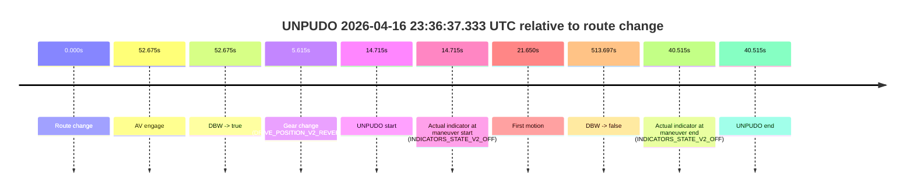
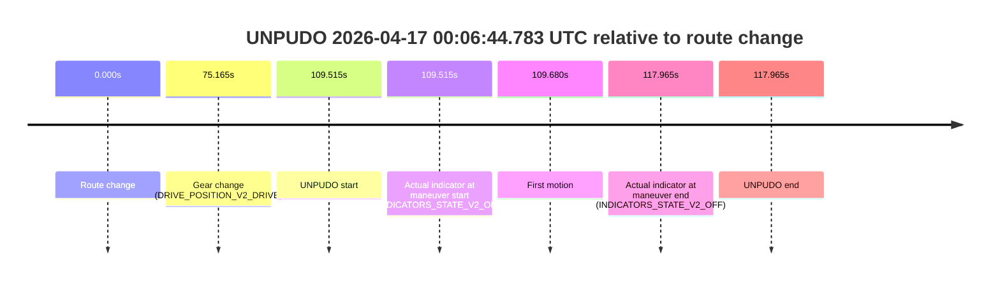
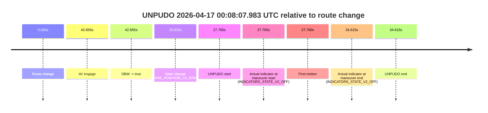

# Run Report: fme10010/2026-04-16--22-11-44--gen2-av-89e32054-caf3-4c25-874b-3e2a926a2ff3

| Field | Value |
|---|---|
| Run ID | `fme10010/2026-04-16--22-11-44--gen2-av-89e32054-caf3-4c25-874b-3e2a926a2ff3` |
| Date | `2026-04-16` |
| Model(s) | `satisfied-amber-moose` |
| Author | `guy.geva` |
| Event count | `13` |

## unpudo 2026-04-16 23:25:56.183 UTC

| Field | Value |
|---|---|
| Model | `satisfied-amber-moose` |
| Author | `guy.geva` |
| Run ID | `fme10010/2026-04-16--22-11-44--gen2-av-89e32054-caf3-4c25-874b-3e2a926a2ff3` |
| Date | `2026-04-16` |
| Time (UTC) | `23:25:56.183` |
| Event type | `unpudo` |
| Disengagement type | `failed_to_unpudo` |
| Route change | `found` |
| Console | [run](https://console.sso.wayve.ai/run/fme10010/2026-04-16--22-11-44--gen2-av-89e32054-caf3-4c25-874b-3e2a926a2ff3?id=&time-unixus=1776381956183291) |
| Foxglove | [segment](https://app.foxglove.dev/wayve-on-prem/p/prj_0dX18KZdVHg1fmmI/view?ds=foxglove-stream&ds.deviceName=fme10010&ds.start=2026-04-16T23%3A25%3A39.318243Z&ds.end=2026-04-16T23%3A27%3A12.615160Z&layoutId=lay_0e7VD4WIKDQGU73Y&time=2026-04-16T23%3A25%3A56.183291Z) |

### Event card: accidental

- Accidental: AV ownership is present for less than `2s`, so this is treated as an accidental brush with the maneuver rather than a meaningful model attempt.

| Event | Time (UTC) | Delta from route change |
|---|---:|---:|
| Route change | 2026-04-16 23:25:49.318 | `0.000s` |
| AV engage | 2026-04-16 23:26:03.534 | `14.216s` |
| DBW -> true | 2026-04-16 23:26:03.534 | `14.216s` |
| Gear change (DRIVE_POSITION_V2_DRIVE) | 2026-04-16 23:25:49.633 | `0.315s` |
| UNPUDO start | 2026-04-16 23:25:56.183 | `6.865s` |
| Actual indicator at maneuver start (INDICATORS_STATE_V2_OFF) | 2026-04-16 23:25:56.183 | `6.865s` |
| First motion | 2026-04-16 23:25:56.208 | `6.891s` |
| DBW -> false | 2026-04-16 23:27:02.615 | `73.297s` |
| Actual indicator at maneuver end (INDICATORS_STATE_V2_OFF) | 2026-04-16 23:25:59.533 | `10.215s` |
| UNPUDO end | 2026-04-16 23:25:59.533 | `10.215s` |

| Metric | Value |
|---|---|
| Outcome | `accidental` |
| Effective failure type | `none` |
| Route change status | `found` |
| DBW at event start | `false` |
| DBW at event end | `false` |
| Predicted gear at AV start | `DRIVE_POSITION_V2_DRIVE` |
| Actual gear at AV start | `DRIVE_POSITION_V2_DRIVE` |
| Predicted gear at event start | `DRIVE_POSITION_V2_DRIVE` |
| Actual gear at event start | `DRIVE_POSITION_V2_DRIVE` |
| Planned indicator direction | `INDICATORS_STATE_V2_LEFT_ON` |
| Controller indicator direction | `INDICATORS_STATE_V2_LEFT_ON` |
| Actual indicator direction | `INDICATORS_STATE_V2_OFF` |
| Actual indicator at maneuver end | `INDICATORS_STATE_V2_OFF` |
| Driver accel help in AV | `false` |
| Driver accel help timestamp | `n/a` |
| Max accel pedal pct in AV | `0.0%` |
| Max brake pedal pct in AV | `0.0%` |
| Max speed mps in AV | `0.000` |
| Route -> AV | `14.216s` |
| AV -> event start | `-7.351s` |
| AV -> first motion | `-7.326s` |
| AV duration before disengagement | `59.080s` |
| Trajectory waypoint count | `37` |
| Driving-plan step count | `11` |

The scored portion starts from the AV-owned window, not from the pre-AV setup. Route-change search in the stopped pre-event segment was `found`, with the baseline therefore set to route change. At the event anchor the model predicts `DRIVE_POSITION_V2_DRIVE` and the actual gear is `DRIVE_POSITION_V2_DRIVE`. The effective model outcome is `accidental` because `the AV-owned portion is shorter than 2s`.

### Resolution

| Field | Value |
|---|---|
| Final outcome | `accidental` |
| Do we agree with this label? | `yes` |
| Source disengagement type | `failed_to_unpudo` |
| Resolved effective failure type | `none` |
| Confidence | `high` |

## unpudo 2026-04-16 23:31:37.433 UTC

| Field | Value |
|---|---|
| Model | `satisfied-amber-moose` |
| Author | `guy.geva` |
| Run ID | `fme10010/2026-04-16--22-11-44--gen2-av-89e32054-caf3-4c25-874b-3e2a926a2ff3` |
| Date | `2026-04-16` |
| Time (UTC) | `23:31:37.433` |
| Event type | `unpudo` |
| Disengagement type | `failed_to_unpudo` |
| Route change | `found` |
| Console | [run](https://console.sso.wayve.ai/run/fme10010/2026-04-16--22-11-44--gen2-av-89e32054-caf3-4c25-874b-3e2a926a2ff3?id=&time-unixus=1776382297433303) |
| Foxglove | [segment](https://app.foxglove.dev/wayve-on-prem/p/prj_0dX18KZdVHg1fmmI/view?ds=foxglove-stream&ds.deviceName=fme10010&ds.start=2026-04-16T23%3A31%3A13.668240Z&ds.end=2026-04-16T23%3A33%3A09.493855Z&layoutId=lay_0e7VD4WIKDQGU73Y&time=2026-04-16T23%3A31%3A37.433303Z) |

### Event card: non-av

- Non-AV: the detected unpudo starts outside AV ownership, so it is kept for coverage but excluded from model success / failure scoring.

| Event | Time (UTC) | Delta from route change |
|---|---:|---:|
| Route change | 2026-04-16 23:31:23.668 | `0.000s` |
| AV engage | 2026-04-16 23:31:47.873 | `24.206s` |
| DBW -> true | 2026-04-16 23:31:47.873 | `24.206s` |
| Gear change (DRIVE_POSITION_V2_DRIVE) | 2026-04-16 23:31:23.933 | `0.265s` |
| UNPUDO start | 2026-04-16 23:31:37.433 | `13.765s` |
| Actual indicator at maneuver start (INDICATORS_STATE_V2_OFF) | 2026-04-16 23:31:37.433 | `13.765s` |
| First motion | 2026-04-16 23:31:37.508 | `13.841s` |
| DBW -> false | 2026-04-16 23:32:59.493 | `95.826s` |
| Actual indicator at maneuver end (INDICATORS_STATE_V2_OFF) | 2026-04-16 23:31:56.033 | `32.365s` |
| UNPUDO end | 2026-04-16 23:31:56.033 | `32.365s` |

| Metric | Value |
|---|---|
| Outcome | `non-av` |
| Effective failure type | `none` |
| Route change status | `found` |
| DBW at event start | `false` |
| DBW at event end | `true` |
| Predicted gear at AV start | `DRIVE_POSITION_V2_DRIVE` |
| Actual gear at AV start | `DRIVE_POSITION_V2_DRIVE` |
| Predicted gear at event start | `DRIVE_POSITION_V2_DRIVE` |
| Actual gear at event start | `DRIVE_POSITION_V2_DRIVE` |
| Planned indicator direction | `INDICATORS_STATE_V2_RIGHT_ON` |
| Controller indicator direction | `INDICATORS_STATE_V2_RIGHT_ON` |
| Actual indicator direction | `INDICATORS_STATE_V2_OFF` |
| Actual indicator at maneuver end | `INDICATORS_STATE_V2_OFF` |
| Driver accel help in AV | `false` |
| Driver accel help timestamp | `n/a` |
| Max accel pedal pct in AV | `0.0%` |
| Max brake pedal pct in AV | `8.0%` |
| Max speed mps in AV | `2.256` |
| Route -> AV | `24.206s` |
| AV -> event start | `-10.440s` |
| AV -> first motion | `-10.365s` |
| AV duration before disengagement | `71.620s` |
| Trajectory waypoint count | `36` |
| Driving-plan step count | `11` |

The scored portion starts from the AV-owned window, not from the pre-AV setup. Route-change search in the stopped pre-event segment was `found`, with the baseline therefore set to route change. At the event anchor the model predicts `DRIVE_POSITION_V2_DRIVE` and the actual gear is `DRIVE_POSITION_V2_DRIVE`. The effective model outcome is `non-av` because `the event does not begin in AV ownership`.

### Resolution

| Field | Value |
|---|---|
| Final outcome | `non-av` |
| Do we agree with this label? | `yes` |
| Source disengagement type | `failed_to_unpudo` |
| Resolved effective failure type | `none` |
| Confidence | `high` |

## unpudo 2026-04-16 23:33:00.233 UTC

| Field | Value |
|---|---|
| Model | `satisfied-amber-moose` |
| Author | `guy.geva` |
| Run ID | `fme10010/2026-04-16--22-11-44--gen2-av-89e32054-caf3-4c25-874b-3e2a926a2ff3` |
| Date | `2026-04-16` |
| Time (UTC) | `23:33:00.233` |
| Event type | `unpudo` |
| Disengagement type | `failed_to_unpudo` |
| Route change | `found` |
| Console | [run](https://console.sso.wayve.ai/run/fme10010/2026-04-16--22-11-44--gen2-av-89e32054-caf3-4c25-874b-3e2a926a2ff3?id=&time-unixus=1776382380233310) |
| Foxglove | [segment](https://app.foxglove.dev/wayve-on-prem/p/prj_0dX18KZdVHg1fmmI/view?ds=foxglove-stream&ds.deviceName=fme10010&ds.start=2026-04-16T23%3A31%3A13.668240Z&ds.end=2026-04-16T23%3A34%3A14.313817Z&layoutId=lay_0e7VD4WIKDQGU73Y&time=2026-04-16T23%3A33%3A00.233310Z) |

### Event card: accidental

- Accidental: AV ownership is present for less than `2s`, so this is treated as an accidental brush with the maneuver rather than a meaningful model attempt.

| Event | Time (UTC) | Delta from route change |
|---|---:|---:|
| Route change | 2026-04-16 23:31:23.668 | `0.000s` |
| AV engage | 2026-04-16 23:33:08.633 | `104.965s` |
| DBW -> true | 2026-04-16 23:33:08.633 | `104.965s` |
| Gear change (DRIVE_POSITION_V2_DRIVE) | 2026-04-16 23:32:50.633 | `86.965s` |
| UNPUDO start | 2026-04-16 23:33:00.233 | `96.565s` |
| Actual indicator at maneuver start (INDICATORS_STATE_V2_OFF) | 2026-04-16 23:33:00.233 | `96.565s` |
| First motion | 2026-04-16 23:33:00.288 | `96.620s` |
| DBW -> false | 2026-04-16 23:34:04.313 | `160.646s` |
| Actual indicator at maneuver end (INDICATORS_STATE_V2_OFF) | 2026-04-16 23:33:05.733 | `102.065s` |
| UNPUDO end | 2026-04-16 23:33:05.733 | `102.065s` |

| Metric | Value |
|---|---|
| Outcome | `accidental` |
| Effective failure type | `none` |
| Route change status | `found` |
| DBW at event start | `false` |
| DBW at event end | `false` |
| Predicted gear at AV start | `DRIVE_POSITION_V2_DRIVE` |
| Actual gear at AV start | `DRIVE_POSITION_V2_DRIVE` |
| Predicted gear at event start | `DRIVE_POSITION_V2_DRIVE` |
| Actual gear at event start | `DRIVE_POSITION_V2_DRIVE` |
| Planned indicator direction | `INDICATORS_STATE_V2_RIGHT_ON` |
| Controller indicator direction | `INDICATORS_STATE_V2_RIGHT_ON` |
| Actual indicator direction | `INDICATORS_STATE_V2_OFF` |
| Actual indicator at maneuver end | `INDICATORS_STATE_V2_OFF` |
| Driver accel help in AV | `false` |
| Driver accel help timestamp | `n/a` |
| Max accel pedal pct in AV | `0.0%` |
| Max brake pedal pct in AV | `0.0%` |
| Max speed mps in AV | `0.000` |
| Route -> AV | `104.965s` |
| AV -> event start | `-8.400s` |
| AV -> first motion | `-8.345s` |
| AV duration before disengagement | `55.680s` |
| Trajectory waypoint count | `36` |
| Driving-plan step count | `11` |

The scored portion starts from the AV-owned window, not from the pre-AV setup. Route-change search in the stopped pre-event segment was `found`, with the baseline therefore set to route change. At the event anchor the model predicts `DRIVE_POSITION_V2_DRIVE` and the actual gear is `DRIVE_POSITION_V2_DRIVE`. The effective model outcome is `accidental` because `the AV-owned portion is shorter than 2s`.

### Resolution

| Field | Value |
|---|---|
| Final outcome | `accidental` |
| Do we agree with this label? | `yes` |
| Source disengagement type | `failed_to_unpudo` |
| Resolved effective failure type | `none` |
| Confidence | `high` |

## unpudo 2026-04-16 23:34:05.883 UTC

| Field | Value |
|---|---|
| Model | `satisfied-amber-moose` |
| Author | `guy.geva` |
| Run ID | `fme10010/2026-04-16--22-11-44--gen2-av-89e32054-caf3-4c25-874b-3e2a926a2ff3` |
| Date | `2026-04-16` |
| Time (UTC) | `23:34:05.883` |
| Event type | `unpudo` |
| Disengagement type | `failed_to_unpudo` |
| Route change | `found` |
| Console | [run](https://console.sso.wayve.ai/run/fme10010/2026-04-16--22-11-44--gen2-av-89e32054-caf3-4c25-874b-3e2a926a2ff3?id=&time-unixus=1776382445883305) |
| Foxglove | [segment](https://app.foxglove.dev/wayve-on-prem/p/prj_0dX18KZdVHg1fmmI/view?ds=foxglove-stream&ds.deviceName=fme10010&ds.start=2026-04-16T23%3A32%3A40.218235Z&ds.end=2026-04-16T23%3A36%3A24.154950Z&layoutId=lay_0e7VD4WIKDQGU73Y&time=2026-04-16T23%3A34%3A05.883305Z) |

### Event card: accidental

- Accidental: AV ownership is present for less than `2s`, so this is treated as an accidental brush with the maneuver rather than a meaningful model attempt.

| Event | Time (UTC) | Delta from route change |
|---|---:|---:|
| Route change | 2026-04-16 23:32:50.218 | `0.000s` |
| AV engage | 2026-04-16 23:34:56.034 | `125.816s` |
| DBW -> true | 2026-04-16 23:34:56.034 | `125.816s` |
| Gear change (DRIVE_POSITION_V2_REVERSE) | 2026-04-16 23:34:00.333 | `70.115s` |
| UNPUDO start | 2026-04-16 23:34:05.883 | `75.665s` |
| Actual indicator at maneuver start (INDICATORS_STATE_V2_OFF) | 2026-04-16 23:34:05.883 | `75.665s` |
| First motion | 2026-04-16 23:34:16.248 | `86.031s` |
| DBW -> false | 2026-04-16 23:36:14.154 | `203.937s` |
| Actual indicator at maneuver end (INDICATORS_STATE_V2_OFF) | 2026-04-16 23:34:43.883 | `113.665s` |
| UNPUDO end | 2026-04-16 23:34:43.883 | `113.665s` |

| Metric | Value |
|---|---|
| Outcome | `accidental` |
| Effective failure type | `none` |
| Route change status | `found` |
| DBW at event start | `false` |
| DBW at event end | `false` |
| Predicted gear at AV start | `DRIVE_POSITION_V2_DRIVE` |
| Actual gear at AV start | `DRIVE_POSITION_V2_DRIVE` |
| Predicted gear at event start | `DRIVE_POSITION_V2_REVERSE` |
| Actual gear at event start | `DRIVE_POSITION_V2_REVERSE` |
| Planned indicator direction | `INDICATORS_STATE_V2_OFF` |
| Controller indicator direction | `INDICATORS_STATE_V2_OFF` |
| Actual indicator direction | `INDICATORS_STATE_V2_OFF` |
| Actual indicator at maneuver end | `INDICATORS_STATE_V2_OFF` |
| Driver accel help in AV | `false` |
| Driver accel help timestamp | `n/a` |
| Max accel pedal pct in AV | `0.0%` |
| Max brake pedal pct in AV | `0.0%` |
| Max speed mps in AV | `0.000` |
| Route -> AV | `125.816s` |
| AV -> event start | `-50.151s` |
| AV -> first motion | `-39.785s` |
| AV duration before disengagement | `78.121s` |
| Trajectory waypoint count | `37` |
| Driving-plan step count | `11` |

The scored portion starts from the AV-owned window, not from the pre-AV setup. Route-change search in the stopped pre-event segment was `found`, with the baseline therefore set to route change. At the event anchor the model predicts `DRIVE_POSITION_V2_REVERSE` and the actual gear is `DRIVE_POSITION_V2_REVERSE`. The effective model outcome is `accidental` because `the AV-owned portion is shorter than 2s`.

### Resolution

| Field | Value |
|---|---|
| Final outcome | `accidental` |
| Do we agree with this label? | `yes` |
| Source disengagement type | `failed_to_unpudo` |
| Resolved effective failure type | `none` |
| Confidence | `high` |

## unpudo 2026-04-16 23:36:37.333 UTC

| Field | Value |
|---|---|
| Model | `satisfied-amber-moose` |
| Author | `guy.geva` |
| Run ID | `fme10010/2026-04-16--22-11-44--gen2-av-89e32054-caf3-4c25-874b-3e2a926a2ff3` |
| Date | `2026-04-16` |
| Time (UTC) | `23:36:37.333` |
| Event type | `unpudo` |
| Disengagement type | `failed_to_unpudo` |
| Route change | `found` |
| Console | [run](https://console.sso.wayve.ai/run/fme10010/2026-04-16--22-11-44--gen2-av-89e32054-caf3-4c25-874b-3e2a926a2ff3?id=&time-unixus=1776382597333300) |
| Foxglove | [segment](https://app.foxglove.dev/wayve-on-prem/p/prj_0dX18KZdVHg1fmmI/view?ds=foxglove-stream&ds.deviceName=fme10010&ds.start=2026-04-16T23%3A36%3A12.618287Z&ds.end=2026-04-16T23%3A45%3A06.314831Z&layoutId=lay_0e7VD4WIKDQGU73Y&time=2026-04-16T23%3A36%3A37.333300Z) |

### Event card: accidental

- Accidental: AV ownership is present for less than `2s`, so this is treated as an accidental brush with the maneuver rather than a meaningful model attempt.

| Event | Time (UTC) | Delta from route change |
|---|---:|---:|
| Route change | 2026-04-16 23:36:22.618 | `0.000s` |
| AV engage | 2026-04-16 23:37:15.293 | `52.675s` |
| DBW -> true | 2026-04-16 23:37:15.293 | `52.675s` |
| Gear change (DRIVE_POSITION_V2_REVERSE) | 2026-04-16 23:36:28.233 | `5.615s` |
| UNPUDO start | 2026-04-16 23:36:37.333 | `14.715s` |
| Actual indicator at maneuver start (INDICATORS_STATE_V2_OFF) | 2026-04-16 23:36:37.333 | `14.715s` |
| First motion | 2026-04-16 23:36:44.268 | `21.650s` |
| DBW -> false | 2026-04-16 23:44:56.314 | `513.697s` |
| Actual indicator at maneuver end (INDICATORS_STATE_V2_OFF) | 2026-04-16 23:37:03.133 | `40.515s` |
| UNPUDO end | 2026-04-16 23:37:03.133 | `40.515s` |

| Metric | Value |
|---|---|
| Outcome | `accidental` |
| Effective failure type | `none` |
| Route change status | `found` |
| DBW at event start | `false` |
| DBW at event end | `false` |
| Predicted gear at AV start | `DRIVE_POSITION_V2_DRIVE` |
| Actual gear at AV start | `DRIVE_POSITION_V2_DRIVE` |
| Predicted gear at event start | `DRIVE_POSITION_V2_REVERSE` |
| Actual gear at event start | `DRIVE_POSITION_V2_REVERSE` |
| Planned indicator direction | `INDICATORS_STATE_V2_OFF` |
| Controller indicator direction | `INDICATORS_STATE_V2_OFF` |
| Actual indicator direction | `INDICATORS_STATE_V2_OFF` |
| Actual indicator at maneuver end | `INDICATORS_STATE_V2_OFF` |
| Driver accel help in AV | `false` |
| Driver accel help timestamp | `n/a` |
| Max accel pedal pct in AV | `0.0%` |
| Max brake pedal pct in AV | `0.0%` |
| Max speed mps in AV | `0.000` |
| Route -> AV | `52.675s` |
| AV -> event start | `-37.960s` |
| AV -> first motion | `-31.025s` |
| AV duration before disengagement | `461.021s` |
| Trajectory waypoint count | `36` |
| Driving-plan step count | `11` |

The scored portion starts from the AV-owned window, not from the pre-AV setup. Route-change search in the stopped pre-event segment was `found`, with the baseline therefore set to route change. At the event anchor the model predicts `DRIVE_POSITION_V2_REVERSE` and the actual gear is `DRIVE_POSITION_V2_REVERSE`. The effective model outcome is `accidental` because `the AV-owned portion is shorter than 2s`.

### Resolution

| Field | Value |
|---|---|
| Final outcome | `accidental` |
| Do we agree with this label? | `yes` |
| Source disengagement type | `failed_to_unpudo` |
| Resolved effective failure type | `none` |
| Confidence | `high` |

## unpudo 2026-04-16 23:45:23.833 UTC

| Field | Value |
|---|---|
| Model | `satisfied-amber-moose` |
| Author | `guy.geva` |
| Run ID | `fme10010/2026-04-16--22-11-44--gen2-av-89e32054-caf3-4c25-874b-3e2a926a2ff3` |
| Date | `2026-04-16` |
| Time (UTC) | `23:45:23.833` |
| Event type | `unpudo` |
| Disengagement type | `failed_to_unpudo` |
| Route change | `found` |
| Console | [run](https://console.sso.wayve.ai/run/fme10010/2026-04-16--22-11-44--gen2-av-89e32054-caf3-4c25-874b-3e2a926a2ff3?id=&time-unixus=1776383123833309) |
| Foxglove | [segment](https://app.foxglove.dev/wayve-on-prem/p/prj_0dX18KZdVHg1fmmI/view?ds=foxglove-stream&ds.deviceName=fme10010&ds.start=2026-04-16T23%3A44%3A54.418249Z&ds.end=2026-04-16T23%3A46%3A50.733922Z&layoutId=lay_0e7VD4WIKDQGU73Y&time=2026-04-16T23%3A45%3A23.833309Z) |

### Event card: accidental

- Accidental: AV ownership is present for less than `2s`, so this is treated as an accidental brush with the maneuver rather than a meaningful model attempt.

| Event | Time (UTC) | Delta from route change |
|---|---:|---:|
| Route change | 2026-04-16 23:45:04.418 | `0.000s` |
| AV engage | 2026-04-16 23:45:45.434 | `41.017s` |
| DBW -> true | 2026-04-16 23:45:45.434 | `41.017s` |
| Gear change (DRIVE_POSITION_V2_DRIVE) | 2026-04-16 23:45:15.283 | `10.865s` |
| UNPUDO start | 2026-04-16 23:45:23.833 | `19.415s` |
| Actual indicator at maneuver start (INDICATORS_STATE_V2_OFF) | 2026-04-16 23:45:23.833 | `19.415s` |
| First motion | 2026-04-16 23:45:23.888 | `19.470s` |
| DBW -> false | 2026-04-16 23:46:40.733 | `96.316s` |
| Actual indicator at maneuver end (INDICATORS_STATE_V2_OFF) | 2026-04-16 23:45:39.983 | `35.565s` |
| UNPUDO end | 2026-04-16 23:45:39.983 | `35.565s` |

| Metric | Value |
|---|---|
| Outcome | `accidental` |
| Effective failure type | `none` |
| Route change status | `found` |
| DBW at event start | `false` |
| DBW at event end | `false` |
| Predicted gear at AV start | `DRIVE_POSITION_V2_DRIVE` |
| Actual gear at AV start | `DRIVE_POSITION_V2_DRIVE` |
| Predicted gear at event start | `DRIVE_POSITION_V2_DRIVE` |
| Actual gear at event start | `DRIVE_POSITION_V2_DRIVE` |
| Planned indicator direction | `INDICATORS_STATE_V2_LEFT_ON` |
| Controller indicator direction | `INDICATORS_STATE_V2_LEFT_ON` |
| Actual indicator direction | `INDICATORS_STATE_V2_OFF` |
| Actual indicator at maneuver end | `INDICATORS_STATE_V2_OFF` |
| Driver accel help in AV | `false` |
| Driver accel help timestamp | `n/a` |
| Max accel pedal pct in AV | `0.0%` |
| Max brake pedal pct in AV | `0.0%` |
| Max speed mps in AV | `0.000` |
| Route -> AV | `41.017s` |
| AV -> event start | `-21.602s` |
| AV -> first motion | `-21.546s` |
| AV duration before disengagement | `55.299s` |
| Trajectory waypoint count | `38` |
| Driving-plan step count | `11` |

The scored portion starts from the AV-owned window, not from the pre-AV setup. Route-change search in the stopped pre-event segment was `found`, with the baseline therefore set to route change. At the event anchor the model predicts `DRIVE_POSITION_V2_DRIVE` and the actual gear is `DRIVE_POSITION_V2_DRIVE`. The effective model outcome is `accidental` because `the AV-owned portion is shorter than 2s`.

### Resolution

| Field | Value |
|---|---|
| Final outcome | `accidental` |
| Do we agree with this label? | `yes` |
| Source disengagement type | `failed_to_unpudo` |
| Resolved effective failure type | `none` |
| Confidence | `high` |

## unpudo 2026-04-16 23:46:41.383 UTC

| Field | Value |
|---|---|
| Model | `satisfied-amber-moose` |
| Author | `guy.geva` |
| Run ID | `fme10010/2026-04-16--22-11-44--gen2-av-89e32054-caf3-4c25-874b-3e2a926a2ff3` |
| Date | `2026-04-16` |
| Time (UTC) | `23:46:41.383` |
| Event type | `unpudo` |
| Disengagement type | `failed_to_unpudo` |
| Route change | `found` |
| Console | [run](https://console.sso.wayve.ai/run/fme10010/2026-04-16--22-11-44--gen2-av-89e32054-caf3-4c25-874b-3e2a926a2ff3?id=&time-unixus=1776383201383301) |
| Foxglove | [segment](https://app.foxglove.dev/wayve-on-prem/p/prj_0dX18KZdVHg1fmmI/view?ds=foxglove-stream&ds.deviceName=fme10010&ds.start=2026-04-16T23%3A44%3A54.418249Z&ds.end=2026-04-16T23%3A48%3A25.554331Z&layoutId=lay_0e7VD4WIKDQGU73Y&time=2026-04-16T23%3A46%3A41.383301Z) |

### Event card: accidental

- Accidental: AV ownership is present for less than `2s`, so this is treated as an accidental brush with the maneuver rather than a meaningful model attempt.

| Event | Time (UTC) | Delta from route change |
|---|---:|---:|
| Route change | 2026-04-16 23:45:04.418 | `0.000s` |
| AV engage | 2026-04-16 23:46:56.193 | `111.775s` |
| DBW -> true | 2026-04-16 23:46:56.193 | `111.775s` |
| Gear change (DRIVE_POSITION_V2_DRIVE) | 2026-04-16 23:46:33.983 | `89.565s` |
| UNPUDO start | 2026-04-16 23:46:41.383 | `96.965s` |
| Actual indicator at maneuver start (INDICATORS_STATE_V2_OFF) | 2026-04-16 23:46:41.383 | `96.965s` |
| First motion | 2026-04-16 23:46:41.428 | `97.011s` |
| DBW -> false | 2026-04-16 23:48:15.554 | `191.136s` |
| Actual indicator at maneuver end (INDICATORS_STATE_V2_OFF) | 2026-04-16 23:46:45.183 | `100.765s` |
| UNPUDO end | 2026-04-16 23:46:45.183 | `100.765s` |

| Metric | Value |
|---|---|
| Outcome | `accidental` |
| Effective failure type | `none` |
| Route change status | `found` |
| DBW at event start | `false` |
| DBW at event end | `false` |
| Predicted gear at AV start | `DRIVE_POSITION_V2_DRIVE` |
| Actual gear at AV start | `DRIVE_POSITION_V2_DRIVE` |
| Predicted gear at event start | `DRIVE_POSITION_V2_DRIVE` |
| Actual gear at event start | `DRIVE_POSITION_V2_DRIVE` |
| Planned indicator direction | `INDICATORS_STATE_V2_OFF` |
| Controller indicator direction | `INDICATORS_STATE_V2_OFF` |
| Actual indicator direction | `INDICATORS_STATE_V2_OFF` |
| Actual indicator at maneuver end | `INDICATORS_STATE_V2_OFF` |
| Driver accel help in AV | `false` |
| Driver accel help timestamp | `n/a` |
| Max accel pedal pct in AV | `0.0%` |
| Max brake pedal pct in AV | `0.0%` |
| Max speed mps in AV | `0.000` |
| Route -> AV | `111.775s` |
| AV -> event start | `-14.810s` |
| AV -> first motion | `-14.765s` |
| AV duration before disengagement | `79.361s` |
| Trajectory waypoint count | `37` |
| Driving-plan step count | `11` |

The scored portion starts from the AV-owned window, not from the pre-AV setup. Route-change search in the stopped pre-event segment was `found`, with the baseline therefore set to route change. At the event anchor the model predicts `DRIVE_POSITION_V2_DRIVE` and the actual gear is `DRIVE_POSITION_V2_DRIVE`. The effective model outcome is `accidental` because `the AV-owned portion is shorter than 2s`.

### Resolution

| Field | Value |
|---|---|
| Final outcome | `accidental` |
| Do we agree with this label? | `yes` |
| Source disengagement type | `failed_to_unpudo` |
| Resolved effective failure type | `none` |
| Confidence | `high` |

## unpudo 2026-04-16 23:49:23.033 UTC

| Field | Value |
|---|---|
| Model | `satisfied-amber-moose` |
| Author | `guy.geva` |
| Run ID | `fme10010/2026-04-16--22-11-44--gen2-av-89e32054-caf3-4c25-874b-3e2a926a2ff3` |
| Date | `2026-04-16` |
| Time (UTC) | `23:49:23.033` |
| Event type | `unpudo` |
| Disengagement type | `failed_to_unpudo` |
| Route change | `found` |
| Console | [run](https://console.sso.wayve.ai/run/fme10010/2026-04-16--22-11-44--gen2-av-89e32054-caf3-4c25-874b-3e2a926a2ff3?id=&time-unixus=1776383363033313) |
| Foxglove | [segment](https://app.foxglove.dev/wayve-on-prem/p/prj_0dX18KZdVHg1fmmI/view?ds=foxglove-stream&ds.deviceName=fme10010&ds.start=2026-04-16T23%3A49%3A00.118234Z&ds.end=2026-04-16T23%3A50%3A03.834026Z&layoutId=lay_0e7VD4WIKDQGU73Y&time=2026-04-16T23%3A49%3A23.033313Z) |

### Event card: accidental

- Accidental: AV ownership is present for less than `2s`, so this is treated as an accidental brush with the maneuver rather than a meaningful model attempt.

| Event | Time (UTC) | Delta from route change |
|---|---:|---:|
| Route change | 2026-04-16 23:49:10.118 | `0.000s` |
| AV engage | 2026-04-16 23:49:28.593 | `18.475s` |
| DBW -> true | 2026-04-16 23:49:28.593 | `18.475s` |
| Gear change (DRIVE_POSITION_V2_DRIVE) | 2026-04-16 23:49:10.483 | `0.365s` |
| UNPUDO start | 2026-04-16 23:49:23.033 | `12.915s` |
| Actual indicator at maneuver start (INDICATORS_STATE_V2_OFF) | 2026-04-16 23:49:23.033 | `12.915s` |
| First motion | 2026-04-16 23:49:23.068 | `12.950s` |
| DBW -> false | 2026-04-16 23:49:53.834 | `43.716s` |
| Actual indicator at maneuver end (INDICATORS_STATE_V2_OFF) | 2026-04-16 23:49:26.433 | `16.315s` |
| UNPUDO end | 2026-04-16 23:49:26.433 | `16.315s` |

| Metric | Value |
|---|---|
| Outcome | `accidental` |
| Effective failure type | `none` |
| Route change status | `found` |
| DBW at event start | `false` |
| DBW at event end | `false` |
| Predicted gear at AV start | `DRIVE_POSITION_V2_DRIVE` |
| Actual gear at AV start | `DRIVE_POSITION_V2_DRIVE` |
| Predicted gear at event start | `DRIVE_POSITION_V2_DRIVE` |
| Actual gear at event start | `DRIVE_POSITION_V2_DRIVE` |
| Planned indicator direction | `INDICATORS_STATE_V2_RIGHT_ON` |
| Controller indicator direction | `INDICATORS_STATE_V2_RIGHT_ON` |
| Actual indicator direction | `INDICATORS_STATE_V2_OFF` |
| Actual indicator at maneuver end | `INDICATORS_STATE_V2_OFF` |
| Driver accel help in AV | `false` |
| Driver accel help timestamp | `n/a` |
| Max accel pedal pct in AV | `0.0%` |
| Max brake pedal pct in AV | `0.0%` |
| Max speed mps in AV | `0.000` |
| Route -> AV | `18.475s` |
| AV -> event start | `-5.560s` |
| AV -> first motion | `-5.525s` |
| AV duration before disengagement | `25.240s` |
| Trajectory waypoint count | `36` |
| Driving-plan step count | `11` |

The scored portion starts from the AV-owned window, not from the pre-AV setup. Route-change search in the stopped pre-event segment was `found`, with the baseline therefore set to route change. At the event anchor the model predicts `DRIVE_POSITION_V2_DRIVE` and the actual gear is `DRIVE_POSITION_V2_DRIVE`. The effective model outcome is `accidental` because `the AV-owned portion is shorter than 2s`.

### Resolution

| Field | Value |
|---|---|
| Final outcome | `accidental` |
| Do we agree with this label? | `yes` |
| Source disengagement type | `failed_to_unpudo` |
| Resolved effective failure type | `none` |
| Confidence | `high` |

## unpudo 2026-04-16 23:50:01.233 UTC

| Field | Value |
|---|---|
| Model | `satisfied-amber-moose` |
| Author | `guy.geva` |
| Run ID | `fme10010/2026-04-16--22-11-44--gen2-av-89e32054-caf3-4c25-874b-3e2a926a2ff3` |
| Date | `2026-04-16` |
| Time (UTC) | `23:50:01.233` |
| Event type | `unpudo` |
| Disengagement type | `failed_to_unpudo` |
| Route change | `found` |
| Console | [run](https://console.sso.wayve.ai/run/fme10010/2026-04-16--22-11-44--gen2-av-89e32054-caf3-4c25-874b-3e2a926a2ff3?id=&time-unixus=1776383401233292) |
| Foxglove | [segment](https://app.foxglove.dev/wayve-on-prem/p/prj_0dX18KZdVHg1fmmI/view?ds=foxglove-stream&ds.deviceName=fme10010&ds.start=2026-04-16T23%3A49%3A00.118234Z&ds.end=2026-04-16T23%3A51%3A22.353719Z&layoutId=lay_0e7VD4WIKDQGU73Y&time=2026-04-16T23%3A50%3A01.233292Z) |

### Event card: accidental

- Accidental: AV ownership is present for less than `2s`, so this is treated as an accidental brush with the maneuver rather than a meaningful model attempt.

| Event | Time (UTC) | Delta from route change |
|---|---:|---:|
| Route change | 2026-04-16 23:49:10.118 | `0.000s` |
| AV engage | 2026-04-16 23:50:07.594 | `57.477s` |
| DBW -> true | 2026-04-16 23:50:07.594 | `57.477s` |
| Gear change (DRIVE_POSITION_V2_DRIVE) | 2026-04-16 23:49:59.733 | `49.615s` |
| UNPUDO start | 2026-04-16 23:50:01.233 | `51.115s` |
| Actual indicator at maneuver start (INDICATORS_STATE_V2_LEFT_ON) | 2026-04-16 23:50:01.233 | `51.115s` |
| First motion | 2026-04-16 23:50:01.288 | `51.171s` |
| DBW -> false | 2026-04-16 23:51:12.353 | `122.235s` |
| Actual indicator at maneuver end (INDICATORS_STATE_V2_OFF) | 2026-04-16 23:50:04.383 | `54.265s` |
| UNPUDO end | 2026-04-16 23:50:04.383 | `54.265s` |

| Metric | Value |
|---|---|
| Outcome | `accidental` |
| Effective failure type | `none` |
| Route change status | `found` |
| DBW at event start | `false` |
| DBW at event end | `false` |
| Predicted gear at AV start | `DRIVE_POSITION_V2_DRIVE` |
| Actual gear at AV start | `DRIVE_POSITION_V2_DRIVE` |
| Predicted gear at event start | `DRIVE_POSITION_V2_DRIVE` |
| Actual gear at event start | `DRIVE_POSITION_V2_DRIVE` |
| Planned indicator direction | `INDICATORS_STATE_V2_LEFT_ON` |
| Controller indicator direction | `INDICATORS_STATE_V2_LEFT_ON` |
| Actual indicator direction | `INDICATORS_STATE_V2_LEFT_ON` |
| Actual indicator at maneuver end | `INDICATORS_STATE_V2_OFF` |
| Driver accel help in AV | `false` |
| Driver accel help timestamp | `n/a` |
| Max accel pedal pct in AV | `0.0%` |
| Max brake pedal pct in AV | `0.0%` |
| Max speed mps in AV | `0.000` |
| Route -> AV | `57.477s` |
| AV -> event start | `-6.362s` |
| AV -> first motion | `-6.306s` |
| AV duration before disengagement | `64.759s` |
| Trajectory waypoint count | `36` |
| Driving-plan step count | `11` |

The scored portion starts from the AV-owned window, not from the pre-AV setup. Route-change search in the stopped pre-event segment was `found`, with the baseline therefore set to route change. At the event anchor the model predicts `DRIVE_POSITION_V2_DRIVE` and the actual gear is `DRIVE_POSITION_V2_DRIVE`. The effective model outcome is `accidental` because `the AV-owned portion is shorter than 2s`.

### Resolution

| Field | Value |
|---|---|
| Final outcome | `accidental` |
| Do we agree with this label? | `yes` |
| Source disengagement type | `failed_to_unpudo` |
| Resolved effective failure type | `none` |
| Confidence | `high` |

## unpudo 2026-04-16 23:58:21.533 UTC

| Field | Value |
|---|---|
| Model | `satisfied-amber-moose` |
| Author | `guy.geva` |
| Run ID | `fme10010/2026-04-16--22-11-44--gen2-av-89e32054-caf3-4c25-874b-3e2a926a2ff3` |
| Date | `2026-04-16` |
| Time (UTC) | `23:58:21.533` |
| Event type | `unpudo` |
| Disengagement type | `failed_to_unpudo` |
| Route change | `found` |
| Console | [run](https://console.sso.wayve.ai/run/fme10010/2026-04-16--22-11-44--gen2-av-89e32054-caf3-4c25-874b-3e2a926a2ff3?id=&time-unixus=1776383901533297) |
| Foxglove | [segment](https://app.foxglove.dev/wayve-on-prem/p/prj_0dX18KZdVHg1fmmI/view?ds=foxglove-stream&ds.deviceName=fme10010&ds.start=2026-04-16T23%3A58%3A04.618231Z&ds.end=2026-04-16T23%3A59%3A22.994476Z&layoutId=lay_0e7VD4WIKDQGU73Y&time=2026-04-16T23%3A58%3A21.533297Z) |

### Event card: accidental

- Accidental: AV ownership is present for less than `2s`, so this is treated as an accidental brush with the maneuver rather than a meaningful model attempt.

| Event | Time (UTC) | Delta from route change |
|---|---:|---:|
| Route change | 2026-04-16 23:58:14.618 | `0.000s` |
| AV engage | 2026-04-16 23:58:30.913 | `16.295s` |
| DBW -> true | 2026-04-16 23:58:30.913 | `16.295s` |
| Gear change (DRIVE_POSITION_V2_REVERSE) | 2026-04-16 23:58:14.933 | `0.315s` |
| UNPUDO start | 2026-04-16 23:58:21.533 | `6.915s` |
| Actual indicator at maneuver start (INDICATORS_STATE_V2_OFF) | 2026-04-16 23:58:21.533 | `6.915s` |
| First motion | 2026-04-16 23:58:22.608 | `7.991s` |
| DBW -> false | 2026-04-16 23:59:12.994 | `58.376s` |
| Actual indicator at maneuver end (INDICATORS_STATE_V2_OFF) | 2026-04-16 23:58:28.283 | `13.665s` |
| UNPUDO end | 2026-04-16 23:58:28.283 | `13.665s` |

| Metric | Value |
|---|---|
| Outcome | `accidental` |
| Effective failure type | `none` |
| Route change status | `found` |
| DBW at event start | `false` |
| DBW at event end | `false` |
| Predicted gear at AV start | `DRIVE_POSITION_V2_DRIVE` |
| Actual gear at AV start | `DRIVE_POSITION_V2_DRIVE` |
| Predicted gear at event start | `DRIVE_POSITION_V2_REVERSE` |
| Actual gear at event start | `DRIVE_POSITION_V2_REVERSE` |
| Planned indicator direction | `INDICATORS_STATE_V2_OFF` |
| Controller indicator direction | `INDICATORS_STATE_V2_OFF` |
| Actual indicator direction | `INDICATORS_STATE_V2_OFF` |
| Actual indicator at maneuver end | `INDICATORS_STATE_V2_OFF` |
| Driver accel help in AV | `false` |
| Driver accel help timestamp | `n/a` |
| Max accel pedal pct in AV | `0.0%` |
| Max brake pedal pct in AV | `0.0%` |
| Max speed mps in AV | `0.000` |
| Route -> AV | `16.295s` |
| AV -> event start | `-9.380s` |
| AV -> first motion | `-8.305s` |
| AV duration before disengagement | `42.081s` |
| Trajectory waypoint count | `38` |
| Driving-plan step count | `11` |

The scored portion starts from the AV-owned window, not from the pre-AV setup. Route-change search in the stopped pre-event segment was `found`, with the baseline therefore set to route change. At the event anchor the model predicts `DRIVE_POSITION_V2_REVERSE` and the actual gear is `DRIVE_POSITION_V2_REVERSE`. The effective model outcome is `accidental` because `the AV-owned portion is shorter than 2s`.

### Resolution

| Field | Value |
|---|---|
| Final outcome | `accidental` |
| Do we agree with this label? | `yes` |
| Source disengagement type | `failed_to_unpudo` |
| Resolved effective failure type | `none` |
| Confidence | `high` |

## unpudo 2026-04-16 23:59:13.633 UTC

| Field | Value |
|---|---|
| Model | `satisfied-amber-moose` |
| Author | `guy.geva` |
| Run ID | `fme10010/2026-04-16--22-11-44--gen2-av-89e32054-caf3-4c25-874b-3e2a926a2ff3` |
| Date | `2026-04-16` |
| Time (UTC) | `23:59:13.633` |
| Event type | `unpudo` |
| Disengagement type | `failed_to_unpudo` |
| Route change | `found` |
| Console | [run](https://console.sso.wayve.ai/run/fme10010/2026-04-16--22-11-44--gen2-av-89e32054-caf3-4c25-874b-3e2a926a2ff3?id=&time-unixus=1776383953633303) |
| Foxglove | [segment](https://app.foxglove.dev/wayve-on-prem/p/prj_0dX18KZdVHg1fmmI/view?ds=foxglove-stream&ds.deviceName=fme10010&ds.start=2026-04-16T23%3A58%3A04.618231Z&ds.end=2026-04-17T00%3A05%3A16.833851Z&layoutId=lay_0e7VD4WIKDQGU73Y&time=2026-04-16T23%3A59%3A13.633303Z) |

### Event card: accidental

- Accidental: AV ownership is present for less than `2s`, so this is treated as an accidental brush with the maneuver rather than a meaningful model attempt.

| Event | Time (UTC) | Delta from route change |
|---|---:|---:|
| Route change | 2026-04-16 23:58:14.618 | `0.000s` |
| AV engage | 2026-04-16 23:59:23.153 | `68.535s` |
| DBW -> true | 2026-04-16 23:59:23.153 | `68.535s` |
| Gear change (DRIVE_POSITION_V2_DRIVE) | 2026-04-16 23:58:54.133 | `39.515s` |
| UNPUDO start | 2026-04-16 23:59:13.633 | `59.015s` |
| Actual indicator at maneuver start (INDICATORS_STATE_V2_OFF) | 2026-04-16 23:59:13.633 | `59.015s` |
| First motion | 2026-04-16 23:59:13.688 | `59.070s` |
| DBW -> false | 2026-04-17 00:05:06.833 | `412.216s` |
| Actual indicator at maneuver end (INDICATORS_STATE_V2_OFF) | 2026-04-16 23:59:18.933 | `64.315s` |
| UNPUDO end | 2026-04-16 23:59:18.933 | `64.315s` |

| Metric | Value |
|---|---|
| Outcome | `accidental` |
| Effective failure type | `none` |
| Route change status | `found` |
| DBW at event start | `false` |
| DBW at event end | `false` |
| Predicted gear at AV start | `DRIVE_POSITION_V2_DRIVE` |
| Actual gear at AV start | `DRIVE_POSITION_V2_DRIVE` |
| Predicted gear at event start | `DRIVE_POSITION_V2_DRIVE` |
| Actual gear at event start | `DRIVE_POSITION_V2_DRIVE` |
| Planned indicator direction | `INDICATORS_STATE_V2_LEFT_ON` |
| Controller indicator direction | `INDICATORS_STATE_V2_LEFT_ON` |
| Actual indicator direction | `INDICATORS_STATE_V2_OFF` |
| Actual indicator at maneuver end | `INDICATORS_STATE_V2_OFF` |
| Driver accel help in AV | `false` |
| Driver accel help timestamp | `n/a` |
| Max accel pedal pct in AV | `0.0%` |
| Max brake pedal pct in AV | `0.0%` |
| Max speed mps in AV | `0.000` |
| Route -> AV | `68.535s` |
| AV -> event start | `-9.520s` |
| AV -> first motion | `-9.465s` |
| AV duration before disengagement | `343.680s` |
| Trajectory waypoint count | `38` |
| Driving-plan step count | `11` |

The scored portion starts from the AV-owned window, not from the pre-AV setup. Route-change search in the stopped pre-event segment was `found`, with the baseline therefore set to route change. At the event anchor the model predicts `DRIVE_POSITION_V2_DRIVE` and the actual gear is `DRIVE_POSITION_V2_DRIVE`. The effective model outcome is `accidental` because `the AV-owned portion is shorter than 2s`.

### Resolution

| Field | Value |
|---|---|
| Final outcome | `accidental` |
| Do we agree with this label? | `yes` |
| Source disengagement type | `failed_to_unpudo` |
| Resolved effective failure type | `none` |
| Confidence | `high` |

## unpudo 2026-04-17 00:06:44.783 UTC

| Field | Value |
|---|---|
| Model | `satisfied-amber-moose` |
| Author | `guy.geva` |
| Run ID | `fme10010/2026-04-16--22-11-44--gen2-av-89e32054-caf3-4c25-874b-3e2a926a2ff3` |
| Date | `2026-04-16` |
| Time (UTC) | `00:06:44.783` |
| Event type | `unpudo` |
| Disengagement type | `failed_to_unpudo` |
| Route change | `found` |
| Console | [run](https://console.sso.wayve.ai/run/fme10010/2026-04-16--22-11-44--gen2-av-89e32054-caf3-4c25-874b-3e2a926a2ff3?id=&time-unixus=1776384404783313) |
| Foxglove | [segment](https://app.foxglove.dev/wayve-on-prem/p/prj_0dX18KZdVHg1fmmI/view?ds=foxglove-stream&ds.deviceName=fme10010&ds.start=2026-04-17T00%3A04%3A45.268239Z&ds.end=2026-04-17T00%3A07%3A03.233300Z&layoutId=lay_0e7VD4WIKDQGU73Y&time=2026-04-17T00%3A06%3A44.783313Z) |

### Event card: non-av

- Non-AV: the detected unpudo starts outside AV ownership, so it is kept for coverage but excluded from model success / failure scoring.

| Event | Time (UTC) | Delta from route change |
|---|---:|---:|
| Route change | 2026-04-17 00:04:55.268 | `0.000s` |
| Gear change (DRIVE_POSITION_V2_DRIVE) | 2026-04-17 00:06:10.433 | `75.165s` |
| UNPUDO start | 2026-04-17 00:06:44.783 | `109.515s` |
| Actual indicator at maneuver start (INDICATORS_STATE_V2_OFF) | 2026-04-17 00:06:44.783 | `109.515s` |
| First motion | 2026-04-17 00:06:44.948 | `109.680s` |
| Actual indicator at maneuver end (INDICATORS_STATE_V2_OFF) | 2026-04-17 00:06:53.233 | `117.965s` |
| UNPUDO end | 2026-04-17 00:06:53.233 | `117.965s` |

| Metric | Value |
|---|---|
| Outcome | `non-av` |
| Effective failure type | `none` |
| Route change status | `found` |
| DBW at event start | `false` |
| DBW at event end | `false` |
| Predicted gear at AV start | `n/a` |
| Actual gear at AV start | `n/a` |
| Predicted gear at event start | `DRIVE_POSITION_V2_DRIVE` |
| Actual gear at event start | `DRIVE_POSITION_V2_DRIVE` |
| Planned indicator direction | `INDICATORS_STATE_V2_LEFT_ON` |
| Controller indicator direction | `INDICATORS_STATE_V2_LEFT_ON` |
| Actual indicator direction | `INDICATORS_STATE_V2_OFF` |
| Actual indicator at maneuver end | `INDICATORS_STATE_V2_OFF` |
| Driver accel help in AV | `false` |
| Driver accel help timestamp | `n/a` |
| Max accel pedal pct in AV | `0.0%` |
| Max brake pedal pct in AV | `0.0%` |
| Max speed mps in AV | `0.000` |
| Route -> AV | `n/a` |
| AV -> event start | `n/a` |
| AV -> first motion | `n/a` |
| AV duration before disengagement | `n/a` |
| Trajectory waypoint count | `37` |
| Driving-plan step count | `11` |

The scored portion starts from the AV-owned window, not from the pre-AV setup. Route-change search in the stopped pre-event segment was `found`, with the baseline therefore set to route change. At the event anchor the model predicts `DRIVE_POSITION_V2_DRIVE` and the actual gear is `DRIVE_POSITION_V2_DRIVE`. The effective model outcome is `non-av` because `the event does not begin in AV ownership`.

### Resolution

| Field | Value |
|---|---|
| Final outcome | `non-av` |
| Do we agree with this label? | `yes` |
| Source disengagement type | `failed_to_unpudo` |
| Resolved effective failure type | `none` |
| Confidence | `high` |

## unpudo 2026-04-17 00:08:07.983 UTC

| Field | Value |
|---|---|
| Model | `satisfied-amber-moose` |
| Author | `guy.geva` |
| Run ID | `fme10010/2026-04-16--22-11-44--gen2-av-89e32054-caf3-4c25-874b-3e2a926a2ff3` |
| Date | `2026-04-16` |
| Time (UTC) | `00:08:07.983` |
| Event type | `unpudo` |
| Disengagement type | `none observed` |
| Route change | `found` |
| Console | [run](https://console.sso.wayve.ai/run/fme10010/2026-04-16--22-11-44--gen2-av-89e32054-caf3-4c25-874b-3e2a926a2ff3?id=&time-unixus=1776384487983314) |
| Foxglove | [segment](https://app.foxglove.dev/wayve-on-prem/p/prj_0dX18KZdVHg1fmmI/view?ds=foxglove-stream&ds.deviceName=fme10010&ds.start=2026-04-17T00%3A07%3A30.218267Z&ds.end=2026-04-17T00%3A08%3A24.833307Z&layoutId=lay_0e7VD4WIKDQGU73Y&time=2026-04-17T00%3A08%3A07.983314Z) |

### Event card: accidental

- Accidental: AV ownership is present for less than `2s`, so this is treated as an accidental brush with the maneuver rather than a meaningful model attempt.

| Event | Time (UTC) | Delta from route change |
|---|---:|---:|
| Route change | 2026-04-17 00:07:40.218 | `0.000s` |
| AV engage | 2026-04-17 00:08:22.873 | `42.655s` |
| DBW -> true | 2026-04-17 00:08:22.873 | `42.655s` |
| Gear change (DRIVE_POSITION_V2_DRIVE) | 2026-04-17 00:08:05.833 | `25.615s` |
| UNPUDO start | 2026-04-17 00:08:07.983 | `27.765s` |
| Actual indicator at maneuver start (INDICATORS_STATE_V2_OFF) | 2026-04-17 00:08:07.983 | `27.765s` |
| First motion | 2026-04-17 00:08:08.008 | `27.790s` |
| Actual indicator at maneuver end (INDICATORS_STATE_V2_OFF) | 2026-04-17 00:08:14.833 | `34.615s` |
| UNPUDO end | 2026-04-17 00:08:14.833 | `34.615s` |

| Metric | Value |
|---|---|
| Outcome | `accidental` |
| Effective failure type | `none` |
| Route change status | `found` |
| DBW at event start | `false` |
| DBW at event end | `false` |
| Predicted gear at AV start | `DRIVE_POSITION_V2_DRIVE` |
| Actual gear at AV start | `DRIVE_POSITION_V2_DRIVE` |
| Predicted gear at event start | `DRIVE_POSITION_V2_DRIVE` |
| Actual gear at event start | `DRIVE_POSITION_V2_DRIVE` |
| Planned indicator direction | `INDICATORS_STATE_V2_LEFT_ON` |
| Controller indicator direction | `INDICATORS_STATE_V2_LEFT_ON` |
| Actual indicator direction | `INDICATORS_STATE_V2_OFF` |
| Actual indicator at maneuver end | `INDICATORS_STATE_V2_OFF` |
| Driver accel help in AV | `false` |
| Driver accel help timestamp | `n/a` |
| Max accel pedal pct in AV | `0.0%` |
| Max brake pedal pct in AV | `0.0%` |
| Max speed mps in AV | `0.000` |
| Route -> AV | `42.655s` |
| AV -> event start | `-14.890s` |
| AV -> first motion | `-14.864s` |
| AV duration before disengagement | `n/a` |
| Trajectory waypoint count | `37` |
| Driving-plan step count | `11` |

The scored portion starts from the AV-owned window, not from the pre-AV setup. Route-change search in the stopped pre-event segment was `found`, with the baseline therefore set to route change. At the event anchor the model predicts `DRIVE_POSITION_V2_DRIVE` and the actual gear is `DRIVE_POSITION_V2_DRIVE`. The effective model outcome is `accidental` because `the AV-owned portion is shorter than 2s`.

### Resolution

| Field | Value |
|---|---|
| Final outcome | `accidental` |
| Do we agree with this label? | `yes` |
| Source disengagement type | `none observed` |
| Resolved effective failure type | `none` |
| Confidence | `high` |
