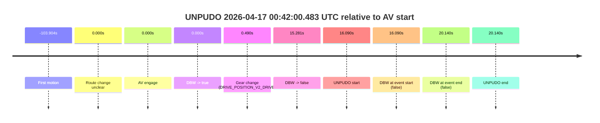
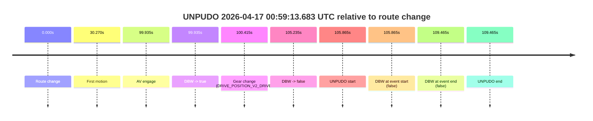
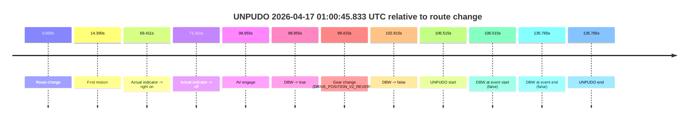
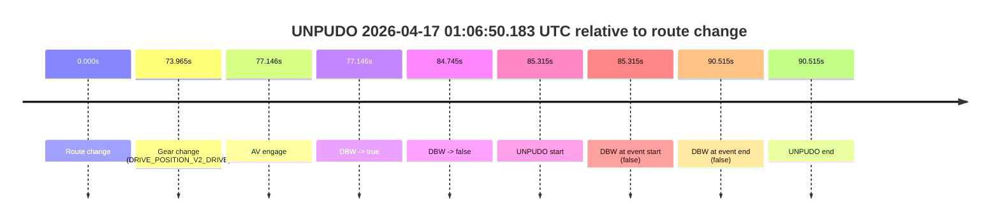

# Run Report: fme10010/2026-04-17--00-39-32--gen2-av-4e831312-0084-4405-a91b-0e7f81df6d74

| Field | Value |
|---|---|
| Run ID | `fme10010/2026-04-17--00-39-32--gen2-av-4e831312-0084-4405-a91b-0e7f81df6d74` |
| Date | `2026-04-17` |
| Model(s) | `armadillo-amethyst-squeaky` |
| Author | `guy.geva` |
| Event count | `5` |

## unpudo 2026-04-17 00:42:00.483 UTC

| Field | Value |
|---|---|
| Model | `armadillo-amethyst-squeaky` |
| Author | `guy.geva` |
| Run ID | `fme10010/2026-04-17--00-39-32--gen2-av-4e831312-0084-4405-a91b-0e7f81df6d74` |
| Date | `2026-04-17` |
| Time (UTC) | `00:42:00.483` |
| Event type | `unpudo` |
| Disengagement type | `failed_to_unpudo` |
| Route change | `unclear` |
| Console | [run](https://console.sso.wayve.ai/run/fme10010/2026-04-17--00-39-32--gen2-av-4e831312-0084-4405-a91b-0e7f81df6d74?id=&time-unixus=1776386520483302) |
| Foxglove | [segment](https://app.foxglove.dev/wayve-on-prem/p/prj_0dX18KZdVHg1fmmI/view?ds=foxglove-stream&ds.deviceName=fme10010&ds.start=2026-04-17T00%3A41%3A34.393135Z&ds.end=2026-04-17T00%3A42%3A14.533305Z&layoutId=lay_0e7VD4WIKDQGU73Y&time=2026-04-17T00%3A42%3A00.483302Z) |

### Event card: fail

- Fail: AV owns part of the segment, but the event still resolves as a model-performance failure under the AV-only scoring rule.

| Event | Time (UTC) | Delta from AV start |
|---|---:|---:|
| First motion | 2026-04-17 00:40:00.488 | `-103.904s` |
| Route change unclear | 2026-04-17 00:41:44.393 | `0.000s` |
| AV engage | 2026-04-17 00:41:44.393 | `0.000s` |
| DBW -> true | 2026-04-17 00:41:44.393 | `0.000s` |
| Gear change (DRIVE_POSITION_V2_DRIVE) | 2026-04-17 00:41:44.883 | `0.490s` |
| DBW -> false | 2026-04-17 00:41:59.673 | `15.281s` |
| UNPUDO start | 2026-04-17 00:42:00.483 | `16.090s` |
| DBW at event start (false) | 2026-04-17 00:42:00.483 | `16.090s` |
| DBW at event end (false) | 2026-04-17 00:42:04.533 | `20.140s` |
| UNPUDO end | 2026-04-17 00:42:04.533 | `20.140s` |

| Metric | Value |
|---|---|
| Outcome | `fail` |
| Effective failure type | `failed_to_unpudo` |
| Route change status | `unclear` |
| DBW at event start | `false` |
| DBW at event end | `false` |
| Predicted gear at AV start | `DRIVE_POSITION_V2_DRIVE` |
| Actual gear at AV start | `DRIVE_POSITION_V2_PARK` |
| Predicted gear at event start | `DRIVE_POSITION_V2_DRIVE` |
| Actual gear at event start | `DRIVE_POSITION_V2_DRIVE` |
| Planned indicator direction | `INDICATORS_STATE_V2_LEFT_ON` |
| Controller indicator direction | `INDICATORS_STATE_V2_LEFT_ON` |
| Actual indicator direction | `INDICATORS_STATE_V2_OFF` |
| Actual indicator at maneuver end | `INDICATORS_STATE_V2_OFF` |
| Driver accel help in AV | `false` |
| Driver accel help timestamp | `n/a` |
| Max accel pedal pct in AV | `0.0%` |
| Max brake pedal pct in AV | `30.0%` |
| Max speed mps in AV | `0.000` |
| Success timing baseline | `AV start` |
| Route -> AV | `n/a` |
| AV -> event start | `16.090s` |
| AV -> first motion | `-103.904s` |
| Success baseline -> event start | `16.090s` |
| Success baseline -> first motion | `-103.904s` |
| AV duration before disengagement | `15.281s` |
| Trajectory waypoint count | `37` |
| Driving-plan step count | `11` |

The scored portion starts from the AV-owned window, not from the pre-AV setup. Route-change search in the stopped pre-event segment was `unclear`, with the baseline therefore set to AV start. At the event anchor the model predicts `DRIVE_POSITION_V2_DRIVE` and the actual gear is `DRIVE_POSITION_V2_DRIVE`. The effective model outcome is `fail` because `failed_to_unpudo.`

### Resolution

| Field | Value |
|---|---|
| Final outcome | `fail` |
| Do we agree with this label? | `yes` |
| Source disengagement type | `failed_to_unpudo` |
| Resolved effective failure type | `failed_to_unpudo` |
| Confidence | `medium` |

## unpudo 2026-04-17 00:57:58.033 UTC

| Field | Value |
|---|---|
| Model | `armadillo-amethyst-squeaky` |
| Author | `guy.geva` |
| Run ID | `fme10010/2026-04-17--00-39-32--gen2-av-4e831312-0084-4405-a91b-0e7f81df6d74` |
| Date | `2026-04-17` |
| Time (UTC) | `00:57:58.033` |
| Event type | `unpudo` |
| Disengagement type | `none observed` |
| Route change | `found` |
| Console | [run](https://console.sso.wayve.ai/run/fme10010/2026-04-17--00-39-32--gen2-av-4e831312-0084-4405-a91b-0e7f81df6d74?id=&time-unixus=1776387478033320) |
| Foxglove | [segment](https://app.foxglove.dev/wayve-on-prem/p/prj_0dX18KZdVHg1fmmI/view?ds=foxglove-stream&ds.deviceName=fme10010&ds.start=2026-04-17T00%3A57%3A17.818242Z&ds.end=2026-04-17T00%3A59%3A01.353160Z&layoutId=lay_0e7VD4WIKDQGU73Y&time=2026-04-17T00%3A57%3A58.033320Z) |

### Event card: pass

- Pass: AV owns the credited unpudo from route change through the official unpudo window, the gear state is aligned at the anchor, and the vehicle moves without driver accelerator help in AV.

| Event | Time (UTC) | Delta from route change |
|---|---:|---:|
| Route change | 2026-04-17 00:57:27.818 | `0.000s` |
| AV engage | 2026-04-17 00:57:27.823 | `0.005s` |
| DBW -> true | 2026-04-17 00:57:27.823 | `0.005s` |
| Gear change (DRIVE_POSITION_V2_DRIVE) | 2026-04-17 00:57:28.433 | `0.615s` |
| UNPUDO start | 2026-04-17 00:57:58.033 | `30.215s` |
| DBW at event start (true) | 2026-04-17 00:57:58.033 | `30.215s` |
| First motion | 2026-04-17 00:57:58.088 | `30.270s` |
| DBW at event end (true) | 2026-04-17 00:58:02.333 | `34.515s` |
| UNPUDO end | 2026-04-17 00:58:02.333 | `34.515s` |
| DBW -> false | 2026-04-17 00:58:51.353 | `83.535s` |

| Metric | Value |
|---|---|
| Outcome | `pass` |
| Effective failure type | `none` |
| Route change status | `found` |
| DBW at event start | `true` |
| DBW at event end | `true` |
| Predicted gear at AV start | `DRIVE_POSITION_V2_PARK` |
| Actual gear at AV start | `DRIVE_POSITION_V2_NEUTRAL` |
| Predicted gear at event start | `DRIVE_POSITION_V2_DRIVE` |
| Actual gear at event start | `DRIVE_POSITION_V2_DRIVE` |
| Planned indicator direction | `INDICATORS_STATE_V2_LEFT_ON` |
| Controller indicator direction | `INDICATORS_STATE_V2_LEFT_ON` |
| Actual indicator direction | `INDICATORS_STATE_V2_OFF` |
| Actual indicator at maneuver end | `INDICATORS_STATE_V2_OFF` |
| Driver accel help in AV | `false` |
| Driver accel help timestamp | `n/a` |
| Max accel pedal pct in AV | `0.0%` |
| Max brake pedal pct in AV | `14.0%` |
| Max speed mps in AV | `4.536` |
| Success timing baseline | `route change` |
| Route -> AV | `0.005s` |
| AV -> event start | `30.210s` |
| AV -> first motion | `30.266s` |
| Success baseline -> event start | `30.215s` |
| Success baseline -> first motion | `30.270s` |
| AV duration before disengagement | `83.530s` |
| Trajectory waypoint count | `38` |
| Driving-plan step count | `11` |

The scored portion starts from the AV-owned window, not from the pre-AV setup. Route-change search in the stopped pre-event segment was `found`, with the baseline therefore set to route change. At the event anchor the model predicts `DRIVE_POSITION_V2_DRIVE` and the actual gear is `DRIVE_POSITION_V2_DRIVE`. The effective model outcome is `pass` because `the credited unpudo stays AV-owned through the official unpudo window.`

### Resolution

| Field | Value |
|---|---|
| Final outcome | `pass` |
| Do we agree with this label? | `yes` |
| Source disengagement type | `none observed` |
| Resolved effective failure type | `none` |
| Confidence | `high` |

## unpudo 2026-04-17 00:59:13.683 UTC

| Field | Value |
|---|---|
| Model | `armadillo-amethyst-squeaky` |
| Author | `guy.geva` |
| Run ID | `fme10010/2026-04-17--00-39-32--gen2-av-4e831312-0084-4405-a91b-0e7f81df6d74` |
| Date | `2026-04-17` |
| Time (UTC) | `00:59:13.683` |
| Event type | `unpudo` |
| Disengagement type | `failed_to_unpudo` |
| Route change | `found` |
| Console | [run](https://console.sso.wayve.ai/run/fme10010/2026-04-17--00-39-32--gen2-av-4e831312-0084-4405-a91b-0e7f81df6d74?id=&time-unixus=1776387553683318) |
| Foxglove | [segment](https://app.foxglove.dev/wayve-on-prem/p/prj_0dX18KZdVHg1fmmI/view?ds=foxglove-stream&ds.deviceName=fme10010&ds.start=2026-04-17T00%3A57%3A17.818242Z&ds.end=2026-04-17T00%3A59%3A27.283305Z&layoutId=lay_0e7VD4WIKDQGU73Y&time=2026-04-17T00%3A59%3A13.683318Z) |

### Event card: fail

- Fail: AV owns part of the segment, but the event still resolves as a model-performance failure under the AV-only scoring rule.

| Event | Time (UTC) | Delta from route change |
|---|---:|---:|
| Route change | 2026-04-17 00:57:27.818 | `0.000s` |
| First motion | 2026-04-17 00:57:58.088 | `30.270s` |
| AV engage | 2026-04-17 00:59:07.753 | `99.935s` |
| DBW -> true | 2026-04-17 00:59:07.753 | `99.935s` |
| Gear change (DRIVE_POSITION_V2_DRIVE) | 2026-04-17 00:59:08.233 | `100.415s` |
| DBW -> false | 2026-04-17 00:59:13.053 | `105.235s` |
| UNPUDO start | 2026-04-17 00:59:13.683 | `105.865s` |
| DBW at event start (false) | 2026-04-17 00:59:13.683 | `105.865s` |
| DBW at event end (false) | 2026-04-17 00:59:17.283 | `109.465s` |
| UNPUDO end | 2026-04-17 00:59:17.283 | `109.465s` |

| Metric | Value |
|---|---|
| Outcome | `fail` |
| Effective failure type | `failed_to_unpudo` |
| Route change status | `found` |
| DBW at event start | `false` |
| DBW at event end | `false` |
| Predicted gear at AV start | `DRIVE_POSITION_V2_DRIVE` |
| Actual gear at AV start | `DRIVE_POSITION_V2_PARK` |
| Predicted gear at event start | `DRIVE_POSITION_V2_DRIVE` |
| Actual gear at event start | `DRIVE_POSITION_V2_DRIVE` |
| Planned indicator direction | `INDICATORS_STATE_V2_LEFT_ON` |
| Controller indicator direction | `INDICATORS_STATE_V2_LEFT_ON` |
| Actual indicator direction | `INDICATORS_STATE_V2_OFF` |
| Actual indicator at maneuver end | `INDICATORS_STATE_V2_OFF` |
| Driver accel help in AV | `false` |
| Driver accel help timestamp | `n/a` |
| Max accel pedal pct in AV | `0.0%` |
| Max brake pedal pct in AV | `11.4%` |
| Max speed mps in AV | `0.000` |
| Success timing baseline | `route change` |
| Route -> AV | `99.935s` |
| AV -> event start | `5.930s` |
| AV -> first motion | `-69.664s` |
| Success baseline -> event start | `105.865s` |
| Success baseline -> first motion | `30.270s` |
| AV duration before disengagement | `5.300s` |
| Trajectory waypoint count | `37` |
| Driving-plan step count | `11` |

The scored portion starts from the AV-owned window, not from the pre-AV setup. Route-change search in the stopped pre-event segment was `found`, with the baseline therefore set to route change. At the event anchor the model predicts `DRIVE_POSITION_V2_DRIVE` and the actual gear is `DRIVE_POSITION_V2_DRIVE`. The effective model outcome is `fail` because `failed_to_unpudo.`

### Resolution

| Field | Value |
|---|---|
| Final outcome | `fail` |
| Do we agree with this label? | `yes` |
| Source disengagement type | `failed_to_unpudo` |
| Resolved effective failure type | `failed_to_unpudo` |
| Confidence | `high` |

## unpudo 2026-04-17 01:00:45.833 UTC

| Field | Value |
|---|---|
| Model | `armadillo-amethyst-squeaky` |
| Author | `guy.geva` |
| Run ID | `fme10010/2026-04-17--00-39-32--gen2-av-4e831312-0084-4405-a91b-0e7f81df6d74` |
| Date | `2026-04-17` |
| Time (UTC) | `01:00:45.833` |
| Event type | `unpudo` |
| Disengagement type | `failed_to_unpudo` |
| Route change | `found` |
| Console | [run](https://console.sso.wayve.ai/run/fme10010/2026-04-17--00-39-32--gen2-av-4e831312-0084-4405-a91b-0e7f81df6d74?id=&time-unixus=1776387645833316) |
| Foxglove | [segment](https://app.foxglove.dev/wayve-on-prem/p/prj_0dX18KZdVHg1fmmI/view?ds=foxglove-stream&ds.deviceName=fme10010&ds.start=2026-04-17T00%3A58%3A49.318237Z&ds.end=2026-04-17T01%3A01%3A25.083300Z&layoutId=lay_0e7VD4WIKDQGU73Y&time=2026-04-17T01%3A00%3A45.833316Z) |

### Event card: fail

- Fail: AV owns part of the segment, but the event still resolves as a model-performance failure under the AV-only scoring rule.

| Event | Time (UTC) | Delta from route change |
|---|---:|---:|
| Route change | 2026-04-17 00:58:59.318 | `0.000s` |
| First motion | 2026-04-17 00:59:13.708 | `14.390s` |
| Actual indicator -> right on | 2026-04-17 01:00:08.729 | `69.411s` |
| Actual indicator -> off | 2026-04-17 01:00:10.729 | `71.411s` |
| AV engage | 2026-04-17 01:00:38.273 | `98.955s` |
| DBW -> true | 2026-04-17 01:00:38.273 | `98.955s` |
| Gear change (DRIVE_POSITION_V2_REVERSE) | 2026-04-17 01:00:38.733 | `99.415s` |
| DBW -> false | 2026-04-17 01:00:42.133 | `102.815s` |
| UNPUDO start | 2026-04-17 01:00:45.833 | `106.515s` |
| DBW at event start (false) | 2026-04-17 01:00:45.833 | `106.515s` |
| DBW at event end (false) | 2026-04-17 01:01:15.083 | `135.765s` |
| UNPUDO end | 2026-04-17 01:01:15.083 | `135.765s` |

| Metric | Value |
|---|---|
| Outcome | `fail` |
| Effective failure type | `failed_to_unpudo` |
| Route change status | `found` |
| DBW at event start | `false` |
| DBW at event end | `false` |
| Predicted gear at AV start | `DRIVE_POSITION_V2_REVERSE` |
| Actual gear at AV start | `DRIVE_POSITION_V2_PARK` |
| Predicted gear at event start | `DRIVE_POSITION_V2_REVERSE` |
| Actual gear at event start | `DRIVE_POSITION_V2_REVERSE` |
| Planned indicator direction | `INDICATORS_STATE_V2_OFF` |
| Controller indicator direction | `INDICATORS_STATE_V2_OFF` |
| Actual indicator direction | `INDICATORS_STATE_V2_OFF` |
| Actual indicator at maneuver end | `INDICATORS_STATE_V2_OFF` |
| Driver accel help in AV | `false` |
| Driver accel help timestamp | `n/a` |
| Max accel pedal pct in AV | `0.0%` |
| Max brake pedal pct in AV | `8.8%` |
| Max speed mps in AV | `0.000` |
| Success timing baseline | `route change` |
| Route -> AV | `98.955s` |
| AV -> event start | `7.560s` |
| AV -> first motion | `-84.565s` |
| Success baseline -> event start | `106.515s` |
| Success baseline -> first motion | `14.390s` |
| AV duration before disengagement | `3.860s` |
| Trajectory waypoint count | `36` |
| Driving-plan step count | `11` |

The scored portion starts from the AV-owned window, not from the pre-AV setup. Route-change search in the stopped pre-event segment was `found`, with the baseline therefore set to route change. At the event anchor the model predicts `DRIVE_POSITION_V2_REVERSE` and the actual gear is `DRIVE_POSITION_V2_REVERSE`. The effective model outcome is `fail` because `failed_to_unpudo.`

### Resolution

| Field | Value |
|---|---|
| Final outcome | `fail` |
| Do we agree with this label? | `yes` |
| Source disengagement type | `failed_to_unpudo` |
| Resolved effective failure type | `failed_to_unpudo` |
| Confidence | `high` |

## unpudo 2026-04-17 01:06:50.183 UTC

| Field | Value |
|---|---|
| Model | `armadillo-amethyst-squeaky` |
| Author | `guy.geva` |
| Run ID | `fme10010/2026-04-17--00-39-32--gen2-av-4e831312-0084-4405-a91b-0e7f81df6d74` |
| Date | `2026-04-17` |
| Time (UTC) | `01:06:50.183` |
| Event type | `unpudo` |
| Disengagement type | `failed_to_unpudo` |
| Route change | `found` |
| Console | [run](https://console.sso.wayve.ai/run/fme10010/2026-04-17--00-39-32--gen2-av-4e831312-0084-4405-a91b-0e7f81df6d74?id=&time-unixus=1776388010183317) |
| Foxglove | [segment](https://app.foxglove.dev/wayve-on-prem/p/prj_0dX18KZdVHg1fmmI/view?ds=foxglove-stream&ds.deviceName=fme10010&ds.start=2026-04-17T01%3A05%3A14.868294Z&ds.end=2026-04-17T01%3A07%3A05.383296Z&layoutId=lay_0e7VD4WIKDQGU73Y&time=2026-04-17T01%3A06%3A50.183317Z) |

### Event card: fail

- Fail: AV owns part of the segment, but the event still resolves as a model-performance failure under the AV-only scoring rule.

| Event | Time (UTC) | Delta from route change |
|---|---:|---:|
| Route change | 2026-04-17 01:05:24.868 | `0.000s` |
| Gear change (DRIVE_POSITION_V2_DRIVE) | 2026-04-17 01:06:38.833 | `73.965s` |
| AV engage | 2026-04-17 01:06:42.013 | `77.146s` |
| DBW -> true | 2026-04-17 01:06:42.013 | `77.146s` |
| DBW -> false | 2026-04-17 01:06:49.613 | `84.745s` |
| UNPUDO start | 2026-04-17 01:06:50.183 | `85.315s` |
| DBW at event start (false) | 2026-04-17 01:06:50.183 | `85.315s` |
| DBW at event end (false) | 2026-04-17 01:06:55.383 | `90.515s` |
| UNPUDO end | 2026-04-17 01:06:55.383 | `90.515s` |

| Metric | Value |
|---|---|
| Outcome | `fail` |
| Effective failure type | `failed_to_unpudo` |
| Route change status | `found` |
| DBW at event start | `false` |
| DBW at event end | `false` |
| Predicted gear at AV start | `DRIVE_POSITION_V2_DRIVE` |
| Actual gear at AV start | `DRIVE_POSITION_V2_DRIVE` |
| Predicted gear at event start | `DRIVE_POSITION_V2_DRIVE` |
| Actual gear at event start | `DRIVE_POSITION_V2_DRIVE` |
| Planned indicator direction | `INDICATORS_STATE_V2_LEFT_ON` |
| Controller indicator direction | `INDICATORS_STATE_V2_LEFT_ON` |
| Actual indicator direction | `INDICATORS_STATE_V2_OFF` |
| Actual indicator at maneuver end | `INDICATORS_STATE_V2_OFF` |
| Driver accel help in AV | `false` |
| Driver accel help timestamp | `n/a` |
| Max accel pedal pct in AV | `0.0%` |
| Max brake pedal pct in AV | `10.0%` |
| Max speed mps in AV | `0.000` |
| Success timing baseline | `route change` |
| Route -> AV | `77.146s` |
| AV -> event start | `8.169s` |
| AV -> first motion | `n/a` |
| Success baseline -> event start | `85.315s` |
| Success baseline -> first motion | `n/a` |
| AV duration before disengagement | `7.600s` |
| Trajectory waypoint count | `37` |
| Driving-plan step count | `11` |

The scored portion starts from the AV-owned window, not from the pre-AV setup. Route-change search in the stopped pre-event segment was `found`, with the baseline therefore set to route change. At the event anchor the model predicts `DRIVE_POSITION_V2_DRIVE` and the actual gear is `DRIVE_POSITION_V2_DRIVE`. The effective model outcome is `fail` because `failed_to_unpudo.`

### Resolution

| Field | Value |
|---|---|
| Final outcome | `fail` |
| Do we agree with this label? | `yes` |
| Source disengagement type | `failed_to_unpudo` |
| Resolved effective failure type | `failed_to_unpudo` |
| Confidence | `high` |
