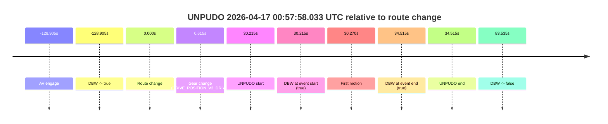
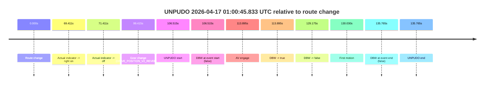

# Run Report: fme10010/2026-04-17--00-39-32--gen2-av-4e831312-0084-4405-a91b-0e7f81df6d74

| Field | Value |
|---|---|
| Run ID | `fme10010/2026-04-17--00-39-32--gen2-av-4e831312-0084-4405-a91b-0e7f81df6d74` |
| Date | `2026-04-17` |
| Model(s) | `armadillo-amethyst-squeaky` |
| Author | `guy.geva` |
| Event count | `2` |

## unpudo 2026-04-17 00:57:58.033 UTC

| Field | Value |
|---|---|
| Model | `armadillo-amethyst-squeaky` |
| Author | `guy.geva` |
| Run ID | `fme10010/2026-04-17--00-39-32--gen2-av-4e831312-0084-4405-a91b-0e7f81df6d74` |
| Date | `2026-04-17` |
| Time (UTC) | `00:57:58.033` |
| Event type | `unpudo` |
| Disengagement type | `none observed` |
| Route change | `found` |
| Console | [run](https://console.sso.wayve.ai/run/fme10010/2026-04-17--00-39-32--gen2-av-4e831312-0084-4405-a91b-0e7f81df6d74?id=&time-unixus=1776387478033320) |
| Foxglove | [segment](https://app.foxglove.dev/wayve-on-prem/p/prj_0dX18KZdVHg1fmmI/view?ds=foxglove-stream&ds.deviceName=fme10010&ds.start=2026-04-17T00%3A55%3A08.913212Z&ds.end=2026-04-17T00%3A59%3A01.353160Z&layoutId=lay_0e7VD4WIKDQGU73Y&time=2026-04-17T00%3A57%3A58.033320Z) |

### Event card: pass

- Pass: AV owns the credited unpudo through the official event window, the gear state is aligned at the anchor, and the vehicle moves without driver accelerator help in AV.

| Event | Time (UTC) | Delta from route change |
|---|---:|---:|
| AV engage | 2026-04-17 00:55:18.913 | `-128.905s` |
| DBW -> true | 2026-04-17 00:55:18.913 | `-128.905s` |
| Route change | 2026-04-17 00:57:27.818 | `0.000s` |
| Gear change (DRIVE_POSITION_V2_DRIVE) | 2026-04-17 00:57:28.433 | `0.615s` |
| UNPUDO start | 2026-04-17 00:57:58.033 | `30.215s` |
| DBW at event start (true) | 2026-04-17 00:57:58.033 | `30.215s` |
| First motion | 2026-04-17 00:57:58.088 | `30.270s` |
| DBW at event end (true) | 2026-04-17 00:58:02.333 | `34.515s` |
| UNPUDO end | 2026-04-17 00:58:02.333 | `34.515s` |
| DBW -> false | 2026-04-17 00:58:51.353 | `83.535s` |

| Metric | Value |
|---|---|
| Outcome | `pass` |
| Effective failure type | `none` |
| Route change status | `found` |
| DBW at event start | `true` |
| DBW at event end | `true` |
| Predicted gear at AV start | `DRIVE_POSITION_V2_DRIVE` |
| Actual gear at AV start | `DRIVE_POSITION_V2_DRIVE` |
| Predicted gear at event start | `DRIVE_POSITION_V2_DRIVE` |
| Actual gear at event start | `DRIVE_POSITION_V2_DRIVE` |
| Planned indicator direction | `INDICATORS_STATE_V2_LEFT_ON` |
| Controller indicator direction | `INDICATORS_STATE_V2_LEFT_ON` |
| Actual indicator direction | `INDICATORS_STATE_V2_OFF` |
| Actual indicator at maneuver end | `INDICATORS_STATE_V2_OFF` |
| Driver accel help in AV | `false` |
| Driver accel help timestamp | `n/a` |
| Max accel pedal pct in AV | `0.0%` |
| Max brake pedal pct in AV | `0.0%` |
| Max speed mps in AV | `4.536` |
| Success timing baseline | `AV start` |
| Route -> AV | `-128.905s` |
| AV -> event start | `159.120s` |
| AV -> first motion | `159.175s` |
| Success baseline -> event start | `159.120s` |
| Success baseline -> first motion | `159.175s` |
| AV duration before disengagement | `212.440s` |
| Trajectory waypoint count | `38` |
| Driving-plan step count | `11` |

The scored portion starts from the AV-owned window, not from the pre-AV setup. Route-change search in the stopped pre-event segment was `found`, with the baseline therefore set to route change. At the event anchor the model predicts `DRIVE_POSITION_V2_DRIVE` and the actual gear is `DRIVE_POSITION_V2_DRIVE`. The effective model outcome is `pass` because `the credited maneuver stays AV-owned through the official event end`.

### Resolution

| Field | Value |
|---|---|
| Final outcome | `pass` |
| Do we agree with this label? | `yes` |
| Source disengagement type | `none observed` |
| Resolved effective failure type | `none` |
| Confidence | `high` |

## unpudo 2026-04-17 01:00:45.833 UTC

| Field | Value |
|---|---|
| Model | `armadillo-amethyst-squeaky` |
| Author | `guy.geva` |
| Run ID | `fme10010/2026-04-17--00-39-32--gen2-av-4e831312-0084-4405-a91b-0e7f81df6d74` |
| Date | `2026-04-17` |
| Time (UTC) | `01:00:45.833` |
| Event type | `unpudo` |
| Disengagement type | `failed_to_unpudo` |
| Route change | `found` |
| Console | [run](https://console.sso.wayve.ai/run/fme10010/2026-04-17--00-39-32--gen2-av-4e831312-0084-4405-a91b-0e7f81df6d74?id=&time-unixus=1776387645833316) |
| Foxglove | [segment](https://app.foxglove.dev/wayve-on-prem/p/prj_0dX18KZdVHg1fmmI/view?ds=foxglove-stream&ds.deviceName=fme10010&ds.start=2026-04-17T00%3A58%3A49.318237Z&ds.end=2026-04-17T01%3A01%3A25.083300Z&layoutId=lay_0e7VD4WIKDQGU73Y&time=2026-04-17T01%3A00%3A45.833316Z) |

### Event card: fail

- Fail: AV owns part of the segment, but the event still resolves as a model-performance failure under the AV-only scoring rule.

| Event | Time (UTC) | Delta from route change |
|---|---:|---:|
| Route change | 2026-04-17 00:58:59.318 | `0.000s` |
| Actual indicator -> right on | 2026-04-17 01:00:08.729 | `69.411s` |
| Actual indicator -> off | 2026-04-17 01:00:10.729 | `71.411s` |
| Gear change (DRIVE_POSITION_V2_REVERSE) | 2026-04-17 01:00:38.733 | `99.415s` |
| UNPUDO start | 2026-04-17 01:00:45.833 | `106.515s` |
| DBW at event start (false) | 2026-04-17 01:00:45.833 | `106.515s` |
| AV engage | 2026-04-17 01:00:53.213 | `113.895s` |
| DBW -> true | 2026-04-17 01:00:53.213 | `113.895s` |
| DBW -> false | 2026-04-17 01:01:08.493 | `129.175s` |
| First motion | 2026-04-17 01:01:09.348 | `130.030s` |
| DBW at event end (false) | 2026-04-17 01:01:15.083 | `135.765s` |
| UNPUDO end | 2026-04-17 01:01:15.083 | `135.765s` |

| Metric | Value |
|---|---|
| Outcome | `fail` |
| Effective failure type | `failed_to_unpudo` |
| Route change status | `found` |
| DBW at event start | `false` |
| DBW at event end | `false` |
| Predicted gear at AV start | `DRIVE_POSITION_V2_DRIVE` |
| Actual gear at AV start | `DRIVE_POSITION_V2_DRIVE` |
| Predicted gear at event start | `DRIVE_POSITION_V2_REVERSE` |
| Actual gear at event start | `DRIVE_POSITION_V2_REVERSE` |
| Planned indicator direction | `INDICATORS_STATE_V2_OFF` |
| Controller indicator direction | `INDICATORS_STATE_V2_OFF` |
| Actual indicator direction | `INDICATORS_STATE_V2_OFF` |
| Actual indicator at maneuver end | `INDICATORS_STATE_V2_OFF` |
| Driver accel help in AV | `false` |
| Driver accel help timestamp | `n/a` |
| Max accel pedal pct in AV | `0.0%` |
| Max brake pedal pct in AV | `8.7%` |
| Max speed mps in AV | `0.000` |
| Success timing baseline | `route change` |
| Route -> AV | `113.895s` |
| AV -> event start | `-7.380s` |
| AV -> first motion | `16.135s` |
| Success baseline -> event start | `106.515s` |
| Success baseline -> first motion | `130.030s` |
| AV duration before disengagement | `15.280s` |
| Trajectory waypoint count | `36` |
| Driving-plan step count | `11` |

The scored portion starts from the AV-owned window, not from the pre-AV setup. Route-change search in the stopped pre-event segment was `found`, with the baseline therefore set to route change. At the event anchor the model predicts `DRIVE_POSITION_V2_REVERSE` and the actual gear is `DRIVE_POSITION_V2_REVERSE`. The effective model outcome is `fail` because `failed_to_unpudo`.

### Resolution

| Field | Value |
|---|---|
| Final outcome | `fail` |
| Do we agree with this label? | `yes` |
| Source disengagement type | `failed_to_unpudo` |
| Resolved effective failure type | `failed_to_unpudo` |
| Confidence | `high` |
