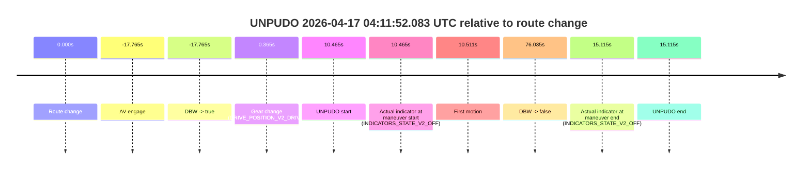
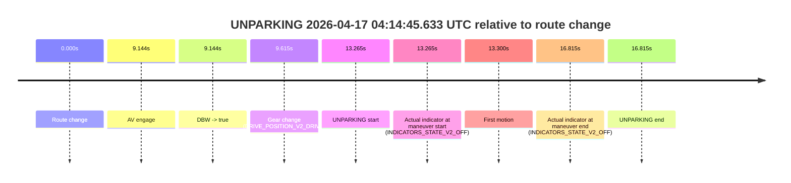

# Run Report: fme10010/2026-04-17--03-51-35--gen2-av-7c60b507-5758-47bf-b9f0-4e94d23fe48e

| Field | Value |
|---|---|
| Run ID | `fme10010/2026-04-17--03-51-35--gen2-av-7c60b507-5758-47bf-b9f0-4e94d23fe48e` |
| Date | `2026-04-17` |
| Model(s) | `pink-manta-ray-smooth` |
| Author | `guy.geva` |
| Event count | `3` |

## unpudo 2026-04-17 04:03:15.933 UTC

| Field | Value |
|---|---|
| Model | `pink-manta-ray-smooth` |
| Author | `guy.geva` |
| Run ID | `fme10010/2026-04-17--03-51-35--gen2-av-7c60b507-5758-47bf-b9f0-4e94d23fe48e` |
| Date | `2026-04-17` |
| Time (UTC) | `04:03:15.933` |
| Event type | `unpudo` |
| Disengagement type | `failed_to_unpudo` |
| Route change | `found` |
| Console | [run](https://console.sso.wayve.ai/run/fme10010/2026-04-17--03-51-35--gen2-av-7c60b507-5758-47bf-b9f0-4e94d23fe48e?id=&time-unixus=1776398595933312) |
| Foxglove | [segment](https://app.foxglove.dev/wayve-on-prem/p/prj_0dX18KZdVHg1fmmI/view?ds=foxglove-stream&ds.deviceName=fme10010&ds.start=2026-04-17T04%3A01%3A24.118234Z&ds.end=2026-04-17T04%3A04%3A16.693359Z&layoutId=lay_0e7VD4WIKDQGU73Y&time=2026-04-17T04%3A03%3A15.933312Z) |

### Event card: fail

- Fail: AV owns part of the segment, but the event still resolves as a model-performance failure under the AV-only scoring rule.

| Event | Time (UTC) | Delta from route change |
|---|---:|---:|
| Route change | 2026-04-17 04:01:34.118 | `0.000s` |
| AV engage | 2026-04-17 04:03:28.392 | `114.274s` |
| DBW -> true | 2026-04-17 04:03:28.392 | `114.274s` |
| Gear change (DRIVE_POSITION_V2_DRIVE) | 2026-04-17 04:03:07.583 | `93.465s` |
| UNPUDO start | 2026-04-17 04:03:15.933 | `101.815s` |
| Actual indicator at maneuver start (INDICATORS_STATE_V2_OFF) | 2026-04-17 04:03:15.933 | `101.815s` |
| First motion | 2026-04-17 04:03:15.948 | `101.830s` |
| DBW -> false | 2026-04-17 04:04:06.693 | `152.575s` |
| Actual indicator at maneuver end (INDICATORS_STATE_V2_OFF) | 2026-04-17 04:03:46.033 | `131.915s` |
| UNPUDO end | 2026-04-17 04:03:46.033 | `131.915s` |

| Metric | Value |
|---|---|
| Outcome | `fail` |
| Effective failure type | `failed_to_unpudo` |
| Route change status | `found` |
| DBW at event start | `false` |
| DBW at event end | `true` |
| Predicted gear at AV start | `DRIVE_POSITION_V2_DRIVE` |
| Actual gear at AV start | `DRIVE_POSITION_V2_DRIVE` |
| Predicted gear at event start | `DRIVE_POSITION_V2_DRIVE` |
| Actual gear at event start | `DRIVE_POSITION_V2_DRIVE` |
| Planned indicator direction | `INDICATORS_STATE_V2_LEFT_ON` |
| Controller indicator direction | `INDICATORS_STATE_V2_LEFT_ON` |
| Actual indicator direction | `INDICATORS_STATE_V2_OFF` |
| Actual indicator at maneuver end | `INDICATORS_STATE_V2_OFF` |
| Driver accel help in AV | `false` |
| Driver accel help timestamp | `n/a` |
| Max accel pedal pct in AV | `0.0%` |
| Max brake pedal pct in AV | `8.0%` |
| Max speed mps in AV | `2.250` |
| Route -> AV | `114.274s` |
| AV -> event start | `-12.459s` |
| AV -> first motion | `-12.444s` |
| AV duration before disengagement | `38.301s` |
| Trajectory waypoint count | `36` |
| Driving-plan step count | `11` |

The scored portion starts from the AV-owned window, not from the pre-AV setup. Route-change search in the stopped pre-event segment was `found`, with the baseline therefore set to route change. At the event anchor the model predicts `DRIVE_POSITION_V2_DRIVE` and the actual gear is `DRIVE_POSITION_V2_DRIVE`. The effective model outcome is `fail` because `failed_to_unpudo`.

### Resolution

| Field | Value |
|---|---|
| Final outcome | `fail` |
| Do we agree with this label? | `yes` |
| Source disengagement type | `failed_to_unpudo` |
| Resolved effective failure type | `failed_to_unpudo` |
| Confidence | `high` |

## unpudo 2026-04-17 04:11:52.083 UTC

| Field | Value |
|---|---|
| Model | `pink-manta-ray-smooth` |
| Author | `guy.geva` |
| Run ID | `fme10010/2026-04-17--03-51-35--gen2-av-7c60b507-5758-47bf-b9f0-4e94d23fe48e` |
| Date | `2026-04-17` |
| Time (UTC) | `04:11:52.083` |
| Event type | `unpudo` |
| Disengagement type | `none observed` |
| Route change | `found` |
| Console | [run](https://console.sso.wayve.ai/run/fme10010/2026-04-17--03-51-35--gen2-av-7c60b507-5758-47bf-b9f0-4e94d23fe48e?id=&time-unixus=1776399112083299) |
| Foxglove | [segment](https://app.foxglove.dev/wayve-on-prem/p/prj_0dX18KZdVHg1fmmI/view?ds=foxglove-stream&ds.deviceName=fme10010&ds.start=2026-04-17T04%3A11%3A13.853726Z&ds.end=2026-04-17T04%3A13%3A07.653203Z&layoutId=lay_0e7VD4WIKDQGU73Y&time=2026-04-17T04%3A11%3A52.083299Z) |

### Event card: pass

- Pass: AV owns the credited unpudo through the official event window, the gear state is aligned at the anchor, and the vehicle moves without driver accelerator help in AV.

| Event | Time (UTC) | Delta from route change |
|---|---:|---:|
| Route change | 2026-04-17 04:11:41.618 | `0.000s` |
| AV engage | 2026-04-17 04:11:23.853 | `-17.765s` |
| DBW -> true | 2026-04-17 04:11:23.853 | `-17.765s` |
| Gear change (DRIVE_POSITION_V2_DRIVE) | 2026-04-17 04:11:41.983 | `0.365s` |
| UNPUDO start | 2026-04-17 04:11:52.083 | `10.465s` |
| Actual indicator at maneuver start (INDICATORS_STATE_V2_OFF) | 2026-04-17 04:11:52.083 | `10.465s` |
| First motion | 2026-04-17 04:11:52.129 | `10.511s` |
| DBW -> false | 2026-04-17 04:12:57.653 | `76.035s` |
| Actual indicator at maneuver end (INDICATORS_STATE_V2_OFF) | 2026-04-17 04:11:56.733 | `15.115s` |
| UNPUDO end | 2026-04-17 04:11:56.733 | `15.115s` |

| Metric | Value |
|---|---|
| Outcome | `pass` |
| Effective failure type | `none` |
| Route change status | `found` |
| DBW at event start | `true` |
| DBW at event end | `true` |
| Predicted gear at AV start | `DRIVE_POSITION_V2_DRIVE` |
| Actual gear at AV start | `DRIVE_POSITION_V2_DRIVE` |
| Predicted gear at event start | `DRIVE_POSITION_V2_DRIVE` |
| Actual gear at event start | `DRIVE_POSITION_V2_DRIVE` |
| Planned indicator direction | `INDICATORS_STATE_V2_LEFT_ON` |
| Controller indicator direction | `INDICATORS_STATE_V2_LEFT_ON` |
| Actual indicator direction | `INDICATORS_STATE_V2_OFF` |
| Actual indicator at maneuver end | `INDICATORS_STATE_V2_OFF` |
| Driver accel help in AV | `false` |
| Driver accel help timestamp | `n/a` |
| Max accel pedal pct in AV | `0.0%` |
| Max brake pedal pct in AV | `0.0%` |
| Max speed mps in AV | `2.817` |
| Route -> AV | `-17.765s` |
| AV -> event start | `28.230s` |
| AV -> first motion | `28.276s` |
| AV duration before disengagement | `93.799s` |
| Trajectory waypoint count | `37` |
| Driving-plan step count | `11` |

The scored portion starts from the AV-owned window, not from the pre-AV setup. Route-change search in the stopped pre-event segment was `found`, with the baseline therefore set to route change. At the event anchor the model predicts `DRIVE_POSITION_V2_DRIVE` and the actual gear is `DRIVE_POSITION_V2_DRIVE`. The effective model outcome is `pass` because `the credited maneuver stays AV-owned through the official event end`.

### Resolution

| Field | Value |
|---|---|
| Final outcome | `pass` |
| Do we agree with this label? | `yes` |
| Source disengagement type | `none observed` |
| Resolved effective failure type | `none` |
| Confidence | `high` |

## unparking 2026-04-17 04:14:45.633 UTC

| Field | Value |
|---|---|
| Model | `pink-manta-ray-smooth` |
| Author | `guy.geva` |
| Run ID | `fme10010/2026-04-17--03-51-35--gen2-av-7c60b507-5758-47bf-b9f0-4e94d23fe48e` |
| Date | `2026-04-17` |
| Time (UTC) | `04:14:45.633` |
| Event type | `unparking` |
| Disengagement type | `none observed` |
| Route change | `found` |
| Console | [run](https://console.sso.wayve.ai/run/fme10010/2026-04-17--03-51-35--gen2-av-7c60b507-5758-47bf-b9f0-4e94d23fe48e?id=&time-unixus=1776399285633306) |
| Foxglove | [segment](https://app.foxglove.dev/wayve-on-prem/p/prj_0dX18KZdVHg1fmmI/view?ds=foxglove-stream&ds.deviceName=fme10010&ds.start=2026-04-17T04%3A14%3A22.368263Z&ds.end=2026-04-17T04%3A14%3A59.183299Z&layoutId=lay_0e7VD4WIKDQGU73Y&time=2026-04-17T04%3A14%3A45.633306Z) |

### Event card: pass

- Pass: AV owns the credited unparking through the official event window, the gear state is aligned at the anchor, and the vehicle moves without driver accelerator help in AV.

| Event | Time (UTC) | Delta from route change |
|---|---:|---:|
| Route change | 2026-04-17 04:14:32.368 | `0.000s` |
| AV engage | 2026-04-17 04:14:41.512 | `9.144s` |
| DBW -> true | 2026-04-17 04:14:41.512 | `9.144s` |
| Gear change (DRIVE_POSITION_V2_DRIVE) | 2026-04-17 04:14:41.983 | `9.615s` |
| UNPARKING start | 2026-04-17 04:14:45.633 | `13.265s` |
| Actual indicator at maneuver start (INDICATORS_STATE_V2_OFF) | 2026-04-17 04:14:45.633 | `13.265s` |
| First motion | 2026-04-17 04:14:45.668 | `13.300s` |
| Actual indicator at maneuver end (INDICATORS_STATE_V2_OFF) | 2026-04-17 04:14:49.183 | `16.815s` |
| UNPARKING end | 2026-04-17 04:14:49.183 | `16.815s` |

| Metric | Value |
|---|---|
| Outcome | `pass` |
| Effective failure type | `none` |
| Route change status | `found` |
| DBW at event start | `true` |
| DBW at event end | `true` |
| Predicted gear at AV start | `DRIVE_POSITION_V2_DRIVE` |
| Actual gear at AV start | `DRIVE_POSITION_V2_PARK` |
| Predicted gear at event start | `DRIVE_POSITION_V2_DRIVE` |
| Actual gear at event start | `DRIVE_POSITION_V2_DRIVE` |
| Planned indicator direction | `INDICATORS_STATE_V2_LEFT_ON` |
| Controller indicator direction | `INDICATORS_STATE_V2_LEFT_ON` |
| Actual indicator direction | `INDICATORS_STATE_V2_OFF` |
| Actual indicator at maneuver end | `INDICATORS_STATE_V2_OFF` |
| Driver accel help in AV | `false` |
| Driver accel help timestamp | `n/a` |
| Max accel pedal pct in AV | `0.0%` |
| Max brake pedal pct in AV | `0.0%` |
| Max speed mps in AV | `4.661` |
| Route -> AV | `9.144s` |
| AV -> event start | `4.121s` |
| AV -> first motion | `4.156s` |
| AV duration before disengagement | `n/a` |
| Trajectory waypoint count | `36` |
| Driving-plan step count | `11` |

The scored portion starts from the AV-owned window, not from the pre-AV setup. Route-change search in the stopped pre-event segment was `found`, with the baseline therefore set to route change. At the event anchor the model predicts `DRIVE_POSITION_V2_DRIVE` and the actual gear is `DRIVE_POSITION_V2_DRIVE`. The effective model outcome is `pass` because `the credited maneuver stays AV-owned through the official event end`.

### Resolution

| Field | Value |
|---|---|
| Final outcome | `pass` |
| Do we agree with this label? | `yes` |
| Source disengagement type | `none observed` |
| Resolved effective failure type | `none` |
| Confidence | `high` |
