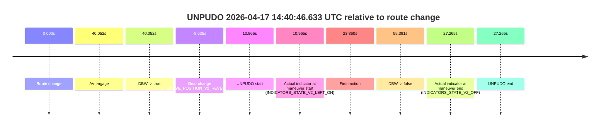
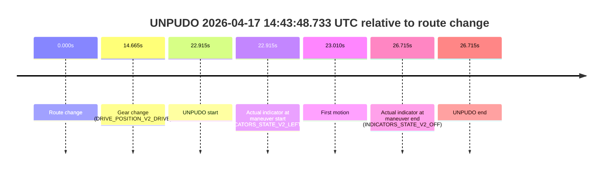

# Run Report: fme10010/2026-04-17--13-42-33--gen2-av-a397f34a-2835-41f5-a785-731e09909b36

| Field | Value |
|---|---|
| Run ID | `fme10010/2026-04-17--13-42-33--gen2-av-a397f34a-2835-41f5-a785-731e09909b36` |
| Date | `2026-04-17` |
| Model(s) | `apricot-crocodile-uproarious` |
| Author | `guy.geva` |
| Event count | `2` |

## unpudo 2026-04-17 14:40:46.633 UTC

| Field | Value |
|---|---|
| Model | `apricot-crocodile-uproarious` |
| Author | `guy.geva` |
| Run ID | `fme10010/2026-04-17--13-42-33--gen2-av-a397f34a-2835-41f5-a785-731e09909b36` |
| Date | `2026-04-17` |
| Time (UTC) | `14:40:46.633` |
| Event type | `unpudo` |
| Disengagement type | `uncategorised` |
| Route change | `found` |
| Console | [run](https://console.sso.wayve.ai/run/fme10010/2026-04-17--13-42-33--gen2-av-a397f34a-2835-41f5-a785-731e09909b36?id=&time-unixus=1776436846633299) |
| Foxglove | [segment](https://app.foxglove.dev/wayve-on-prem/p/prj_0dX18KZdVHg1fmmI/view?ds=foxglove-stream&ds.deviceName=fme10010&ds.start=2026-04-17T14%3A40%3A17.033319Z&ds.end=2026-04-17T14%3A41%3A41.059644Z&layoutId=lay_0e7VD4WIKDQGU73Y&time=2026-04-17T14%3A40%3A46.633299Z) |

### Event card: accidental

- Accidental: AV ownership is present for less than `2s`, so this is treated as an accidental brush with the maneuver rather than a meaningful model attempt.

| Event | Time (UTC) | Delta from route change |
|---|---:|---:|
| Route change | 2026-04-17 14:40:35.668 | `0.000s` |
| AV engage | 2026-04-17 14:41:15.720 | `40.052s` |
| DBW -> true | 2026-04-17 14:41:15.720 | `40.052s` |
| Gear change (DRIVE_POSITION_V2_REVERSE) | 2026-04-17 14:40:27.033 | `-8.635s` |
| UNPUDO start | 2026-04-17 14:40:46.633 | `10.965s` |
| Actual indicator at maneuver start (INDICATORS_STATE_V2_LEFT_ON) | 2026-04-17 14:40:46.633 | `10.965s` |
| First motion | 2026-04-17 14:40:59.528 | `23.860s` |
| DBW -> false | 2026-04-17 14:41:31.059 | `55.391s` |
| Actual indicator at maneuver end (INDICATORS_STATE_V2_OFF) | 2026-04-17 14:41:02.933 | `27.265s` |
| UNPUDO end | 2026-04-17 14:41:02.933 | `27.265s` |

| Metric | Value |
|---|---|
| Outcome | `accidental` |
| Effective failure type | `none` |
| Route change status | `found` |
| DBW at event start | `false` |
| DBW at event end | `false` |
| Predicted gear at AV start | `DRIVE_POSITION_V2_DRIVE` |
| Actual gear at AV start | `DRIVE_POSITION_V2_DRIVE` |
| Predicted gear at event start | `DRIVE_POSITION_V2_REVERSE` |
| Actual gear at event start | `DRIVE_POSITION_V2_REVERSE` |
| Planned indicator direction | `INDICATORS_STATE_V2_LEFT_ON` |
| Controller indicator direction | `INDICATORS_STATE_V2_LEFT_ON` |
| Actual indicator direction | `INDICATORS_STATE_V2_LEFT_ON` |
| Actual indicator at maneuver end | `INDICATORS_STATE_V2_OFF` |
| Driver accel help in AV | `false` |
| Driver accel help timestamp | `n/a` |
| Max accel pedal pct in AV | `0.0%` |
| Max brake pedal pct in AV | `0.0%` |
| Max speed mps in AV | `0.000` |
| Route -> AV | `40.052s` |
| AV -> event start | `-29.087s` |
| AV -> first motion | `-16.192s` |
| AV duration before disengagement | `15.339s` |
| Trajectory waypoint count | `36` |
| Driving-plan step count | `11` |

The scored portion starts from the AV-owned window, not from the pre-AV setup. Route-change search in the stopped pre-event segment was `found`, with the baseline therefore set to route change. At the event anchor the model predicts `DRIVE_POSITION_V2_REVERSE` and the actual gear is `DRIVE_POSITION_V2_REVERSE`. The effective model outcome is `accidental` because `the AV-owned portion is shorter than 2s`.

### Resolution

| Field | Value |
|---|---|
| Final outcome | `accidental` |
| Do we agree with this label? | `yes` |
| Source disengagement type | `uncategorised` |
| Resolved effective failure type | `none` |
| Confidence | `high` |

## unpudo 2026-04-17 14:43:48.733 UTC

| Field | Value |
|---|---|
| Model | `apricot-crocodile-uproarious` |
| Author | `guy.geva` |
| Run ID | `fme10010/2026-04-17--13-42-33--gen2-av-a397f34a-2835-41f5-a785-731e09909b36` |
| Date | `2026-04-17` |
| Time (UTC) | `14:43:48.733` |
| Event type | `unpudo` |
| Disengagement type | `failed_to_unpudo` |
| Route change | `found` |
| Console | [run](https://console.sso.wayve.ai/run/fme10010/2026-04-17--13-42-33--gen2-av-a397f34a-2835-41f5-a785-731e09909b36?id=&time-unixus=1776437028733301) |
| Foxglove | [segment](https://app.foxglove.dev/wayve-on-prem/p/prj_0dX18KZdVHg1fmmI/view?ds=foxglove-stream&ds.deviceName=fme10010&ds.start=2026-04-17T14%3A43%3A15.818243Z&ds.end=2026-04-17T14%3A44%3A02.533317Z&layoutId=lay_0e7VD4WIKDQGU73Y&time=2026-04-17T14%3A43%3A48.733301Z) |

### Event card: non-av

- Non-AV: the detected unpudo starts outside AV ownership, so it is kept for coverage but excluded from model success / failure scoring.

| Event | Time (UTC) | Delta from route change |
|---|---:|---:|
| Route change | 2026-04-17 14:43:25.818 | `0.000s` |
| Gear change (DRIVE_POSITION_V2_DRIVE) | 2026-04-17 14:43:40.483 | `14.665s` |
| UNPUDO start | 2026-04-17 14:43:48.733 | `22.915s` |
| Actual indicator at maneuver start (INDICATORS_STATE_V2_LEFT_ON) | 2026-04-17 14:43:48.733 | `22.915s` |
| First motion | 2026-04-17 14:43:48.828 | `23.010s` |
| Actual indicator at maneuver end (INDICATORS_STATE_V2_OFF) | 2026-04-17 14:43:52.533 | `26.715s` |
| UNPUDO end | 2026-04-17 14:43:52.533 | `26.715s` |

| Metric | Value |
|---|---|
| Outcome | `non-av` |
| Effective failure type | `none` |
| Route change status | `found` |
| DBW at event start | `false` |
| DBW at event end | `false` |
| Predicted gear at AV start | `n/a` |
| Actual gear at AV start | `n/a` |
| Predicted gear at event start | `DRIVE_POSITION_V2_DRIVE` |
| Actual gear at event start | `DRIVE_POSITION_V2_DRIVE` |
| Planned indicator direction | `INDICATORS_STATE_V2_LEFT_ON` |
| Controller indicator direction | `INDICATORS_STATE_V2_LEFT_ON` |
| Actual indicator direction | `INDICATORS_STATE_V2_LEFT_ON` |
| Actual indicator at maneuver end | `INDICATORS_STATE_V2_OFF` |
| Driver accel help in AV | `false` |
| Driver accel help timestamp | `n/a` |
| Max accel pedal pct in AV | `0.0%` |
| Max brake pedal pct in AV | `0.0%` |
| Max speed mps in AV | `0.000` |
| Route -> AV | `n/a` |
| AV -> event start | `n/a` |
| AV -> first motion | `n/a` |
| AV duration before disengagement | `n/a` |
| Trajectory waypoint count | `36` |
| Driving-plan step count | `11` |

The scored portion starts from the AV-owned window, not from the pre-AV setup. Route-change search in the stopped pre-event segment was `found`, with the baseline therefore set to route change. At the event anchor the model predicts `DRIVE_POSITION_V2_DRIVE` and the actual gear is `DRIVE_POSITION_V2_DRIVE`. The effective model outcome is `non-av` because `the event does not begin in AV ownership`.

### Resolution

| Field | Value |
|---|---|
| Final outcome | `non-av` |
| Do we agree with this label? | `yes` |
| Source disengagement type | `failed_to_unpudo` |
| Resolved effective failure type | `none` |
| Confidence | `high` |
