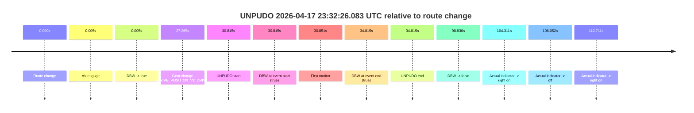
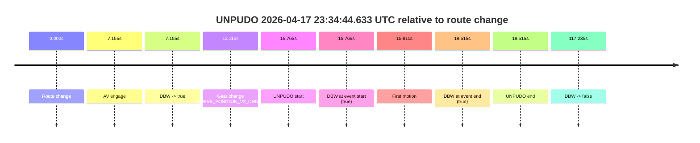

# Run Report: fme10010/2026-04-17--23-20-18--gen2-av-5fa629e8-b72b-472e-b016-2f3b0339df14

| Field | Value |
|---|---|
| Run ID | `fme10010/2026-04-17--23-20-18--gen2-av-5fa629e8-b72b-472e-b016-2f3b0339df14` |
| Date | `2026-04-17` |
| Model(s) | `eel-teal-outspoken` |
| Author | `zak` |
| Event count | `2` |

## unpudo 2026-04-17 23:32:26.083 UTC

| Field | Value |
|---|---|
| Model | `eel-teal-outspoken` |
| Author | `zak` |
| Run ID | `fme10010/2026-04-17--23-20-18--gen2-av-5fa629e8-b72b-472e-b016-2f3b0339df14` |
| Date | `2026-04-17` |
| Time (UTC) | `23:32:26.083` |
| Event type | `unpudo` |
| Disengagement type | `none observed` |
| Route change | `found` |
| Console | [run](https://console.sso.wayve.ai/run/fme10010/2026-04-17--23-20-18--gen2-av-5fa629e8-b72b-472e-b016-2f3b0339df14?id=&time-unixus=1776468746083298) |
| Foxglove | [segment](https://app.foxglove.dev/wayve-on-prem/p/prj_0dX18KZdVHg1fmmI/view?ds=foxglove-stream&ds.deviceName=fme10010&ds.start=2026-04-17T23%3A31%3A45.268257Z&ds.end=2026-04-17T23%3A33%3A44.104704Z&layoutId=lay_0e7VD4WIKDQGU73Y&time=2026-04-17T23%3A32%3A26.083298Z) |

### Event card: pass

- Pass: AV owns the credited unpudo from route change through the official unpudo window, the gear state is aligned at the anchor, and the vehicle moves without driver accelerator help in AV.

| Event | Time (UTC) | Delta from route change |
|---|---:|---:|
| Route change | 2026-04-17 23:31:55.268 | `0.000s` |
| AV engage | 2026-04-17 23:31:55.273 | `0.005s` |
| DBW -> true | 2026-04-17 23:31:55.273 | `0.005s` |
| Gear change (DRIVE_POSITION_V2_DRIVE) | 2026-04-17 23:32:22.533 | `27.265s` |
| UNPUDO start | 2026-04-17 23:32:26.083 | `30.815s` |
| DBW at event start (true) | 2026-04-17 23:32:26.083 | `30.815s` |
| First motion | 2026-04-17 23:32:26.119 | `30.851s` |
| DBW at event end (true) | 2026-04-17 23:32:30.083 | `34.815s` |
| UNPUDO end | 2026-04-17 23:32:30.083 | `34.815s` |
| DBW -> false | 2026-04-17 23:33:34.104 | `98.836s` |
| Actual indicator -> right on | 2026-04-17 23:33:39.579 | `104.311s` |
| Actual indicator -> off | 2026-04-17 23:33:41.320 | `106.052s` |
| Actual indicator -> right on | 2026-04-17 23:33:47.979 | `112.711s` |

| Metric | Value |
|---|---|
| Outcome | `pass` |
| Effective failure type | `none` |
| Route change status | `found` |
| DBW at event start | `true` |
| DBW at event end | `true` |
| Predicted gear at AV start | `DRIVE_POSITION_V2_PARK` |
| Actual gear at AV start | `DRIVE_POSITION_V2_PARK` |
| Predicted gear at event start | `DRIVE_POSITION_V2_DRIVE` |
| Actual gear at event start | `DRIVE_POSITION_V2_DRIVE` |
| Planned indicator direction | `INDICATORS_STATE_V2_LEFT_ON` |
| Controller indicator direction | `INDICATORS_STATE_V2_LEFT_ON` |
| Actual indicator direction | `INDICATORS_STATE_V2_OFF` |
| Actual indicator at maneuver end | `INDICATORS_STATE_V2_OFF` |
| Driver accel help in AV | `false` |
| Driver accel help timestamp | `n/a` |
| Max accel pedal pct in AV | `0.0%` |
| Max brake pedal pct in AV | `8.0%` |
| Max speed mps in AV | `3.597` |
| Success timing baseline | `route change` |
| Route -> AV | `0.005s` |
| AV -> event start | `30.810s` |
| AV -> first motion | `30.846s` |
| Success baseline -> event start | `30.815s` |
| Success baseline -> first motion | `30.851s` |
| AV duration before disengagement | `98.831s` |
| Trajectory waypoint count | `37` |
| Driving-plan step count | `11` |

The scored portion starts from the AV-owned window, not from the pre-AV setup. Route-change search in the stopped pre-event segment was `found`, with the baseline therefore set to route change. At the event anchor the model predicts `DRIVE_POSITION_V2_DRIVE` and the actual gear is `DRIVE_POSITION_V2_DRIVE`. The effective model outcome is `pass` because `the credited unpudo stays AV-owned through the official unpudo window.`

### Resolution

| Field | Value |
|---|---|
| Final outcome | `pass` |
| Do we agree with this label? | `yes` |
| Source disengagement type | `none observed` |
| Resolved effective failure type | `none` |
| Confidence | `high` |

## unpudo 2026-04-17 23:34:44.633 UTC

| Field | Value |
|---|---|
| Model | `eel-teal-outspoken` |
| Author | `zak` |
| Run ID | `fme10010/2026-04-17--23-20-18--gen2-av-5fa629e8-b72b-472e-b016-2f3b0339df14` |
| Date | `2026-04-17` |
| Time (UTC) | `23:34:44.633` |
| Event type | `unpudo` |
| Disengagement type | `none observed` |
| Route change | `found` |
| Console | [run](https://console.sso.wayve.ai/run/fme10010/2026-04-17--23-20-18--gen2-av-5fa629e8-b72b-472e-b016-2f3b0339df14?id=&time-unixus=1776468884633321) |
| Foxglove | [segment](https://app.foxglove.dev/wayve-on-prem/p/prj_0dX18KZdVHg1fmmI/view?ds=foxglove-stream&ds.deviceName=fme10010&ds.start=2026-04-17T23%3A34%3A18.868557Z&ds.end=2026-04-17T23%3A36%3A36.103540Z&layoutId=lay_0e7VD4WIKDQGU73Y&time=2026-04-17T23%3A34%3A44.633321Z) |

### Event card: pass

- Pass: AV owns the credited unpudo from route change through the official unpudo window, the gear state is aligned at the anchor, and the vehicle moves without driver accelerator help in AV.

| Event | Time (UTC) | Delta from route change |
|---|---:|---:|
| Route change | 2026-04-17 23:34:28.868 | `0.000s` |
| AV engage | 2026-04-17 23:34:36.023 | `7.155s` |
| DBW -> true | 2026-04-17 23:34:36.023 | `7.155s` |
| Gear change (DRIVE_POSITION_V2_DRIVE) | 2026-04-17 23:34:40.983 | `12.115s` |
| UNPUDO start | 2026-04-17 23:34:44.633 | `15.765s` |
| DBW at event start (true) | 2026-04-17 23:34:44.633 | `15.765s` |
| First motion | 2026-04-17 23:34:44.679 | `15.811s` |
| DBW at event end (true) | 2026-04-17 23:34:48.383 | `19.515s` |
| UNPUDO end | 2026-04-17 23:34:48.383 | `19.515s` |
| DBW -> false | 2026-04-17 23:36:26.103 | `117.235s` |

| Metric | Value |
|---|---|
| Outcome | `pass` |
| Effective failure type | `none` |
| Route change status | `found` |
| DBW at event start | `true` |
| DBW at event end | `true` |
| Predicted gear at AV start | `DRIVE_POSITION_V2_PARK` |
| Actual gear at AV start | `DRIVE_POSITION_V2_PARK` |
| Predicted gear at event start | `DRIVE_POSITION_V2_DRIVE` |
| Actual gear at event start | `DRIVE_POSITION_V2_DRIVE` |
| Planned indicator direction | `INDICATORS_STATE_V2_LEFT_ON` |
| Controller indicator direction | `INDICATORS_STATE_V2_LEFT_ON` |
| Actual indicator direction | `INDICATORS_STATE_V2_OFF` |
| Actual indicator at maneuver end | `INDICATORS_STATE_V2_OFF` |
| Driver accel help in AV | `false` |
| Driver accel help timestamp | `n/a` |
| Max accel pedal pct in AV | `0.0%` |
| Max brake pedal pct in AV | `8.0%` |
| Max speed mps in AV | `5.139` |
| Success timing baseline | `route change` |
| Route -> AV | `7.155s` |
| AV -> event start | `8.610s` |
| AV -> first motion | `8.656s` |
| Success baseline -> event start | `15.765s` |
| Success baseline -> first motion | `15.811s` |
| AV duration before disengagement | `110.080s` |
| Trajectory waypoint count | `38` |
| Driving-plan step count | `11` |

The scored portion starts from the AV-owned window, not from the pre-AV setup. Route-change search in the stopped pre-event segment was `found`, with the baseline therefore set to route change. At the event anchor the model predicts `DRIVE_POSITION_V2_DRIVE` and the actual gear is `DRIVE_POSITION_V2_DRIVE`. The effective model outcome is `pass` because `the credited unpudo stays AV-owned through the official unpudo window.`

### Resolution

| Field | Value |
|---|---|
| Final outcome | `pass` |
| Do we agree with this label? | `yes` |
| Source disengagement type | `none observed` |
| Resolved effective failure type | `none` |
| Confidence | `high` |
