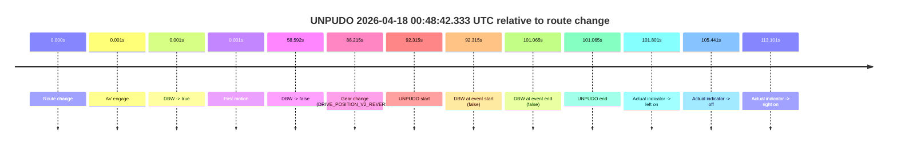
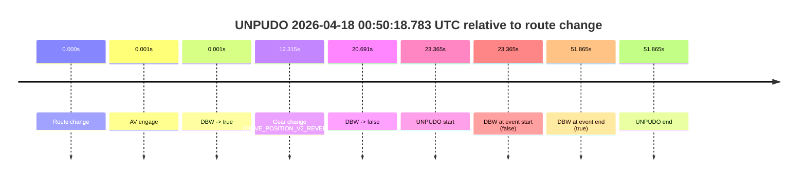
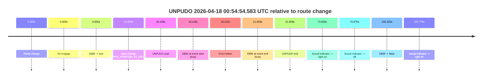
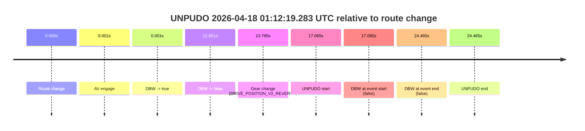

# Run Report: fme10010/2026-04-18--00-38-03--gen2-av-1d46e088-452a-4fae-91d8-a6d9885e5160

| Field | Value |
|---|---|
| Run ID | `fme10010/2026-04-18--00-38-03--gen2-av-1d46e088-452a-4fae-91d8-a6d9885e5160` |
| Date | `2026-04-18` |
| Model(s) | `eel-teal-outspoken` |
| Author | `zak` |
| Event count | `4` |

## unpudo 2026-04-18 00:48:42.333 UTC

| Field | Value |
|---|---|
| Model | `eel-teal-outspoken` |
| Author | `zak` |
| Run ID | `fme10010/2026-04-18--00-38-03--gen2-av-1d46e088-452a-4fae-91d8-a6d9885e5160` |
| Date | `2026-04-18` |
| Time (UTC) | `00:48:42.333` |
| Event type | `unpudo` |
| Disengagement type | `none observed` |
| Route change | `found` |
| Console | [run](https://console.sso.wayve.ai/run/fme10010/2026-04-18--00-38-03--gen2-av-1d46e088-452a-4fae-91d8-a6d9885e5160?id=&time-unixus=1776473322333301) |
| Foxglove | [segment](https://app.foxglove.dev/wayve-on-prem/p/prj_0dX18KZdVHg1fmmI/view?ds=foxglove-stream&ds.deviceName=fme10010&ds.start=2026-04-18T00%3A47%3A00.018278Z&ds.end=2026-04-18T00%3A49%3A01.083297Z&layoutId=lay_0e7VD4WIKDQGU73Y&time=2026-04-18T00%3A48%3A42.333301Z) |

### Event card: fail

- Fail: the credited unpudo does not stay AV-owned. The event window starts with DBW false, and the maneuver outcome lands outside a clean AV-owned segment.

| Event | Time (UTC) | Delta from route change |
|---|---:|---:|
| Route change | 2026-04-18 00:47:10.018 | `0.000s` |
| AV engage | 2026-04-18 00:47:10.018 | `0.001s` |
| DBW -> true | 2026-04-18 00:47:10.018 | `0.001s` |
| First motion | 2026-04-18 00:47:10.019 | `0.001s` |
| DBW -> false | 2026-04-18 00:48:08.609 | `58.592s` |
| Gear change (DRIVE_POSITION_V2_REVERSE) | 2026-04-18 00:48:38.233 | `88.215s` |
| UNPUDO start | 2026-04-18 00:48:42.333 | `92.315s` |
| DBW at event start (false) | 2026-04-18 00:48:42.333 | `92.315s` |
| DBW at event end (false) | 2026-04-18 00:48:51.083 | `101.065s` |
| UNPUDO end | 2026-04-18 00:48:51.083 | `101.065s` |
| Actual indicator -> left on | 2026-04-18 00:48:51.819 | `101.801s` |
| Actual indicator -> off | 2026-04-18 00:48:55.459 | `105.441s` |
| Actual indicator -> right on | 2026-04-18 00:49:03.119 | `113.101s` |

| Metric | Value |
|---|---|
| Outcome | `fail` |
| Effective failure type | `not_av_owned` |
| Route change status | `found` |
| DBW at event start | `false` |
| DBW at event end | `false` |
| Predicted gear at AV start | `DRIVE_POSITION_V2_DRIVE` |
| Actual gear at AV start | `DRIVE_POSITION_V2_DRIVE` |
| Predicted gear at event start | `DRIVE_POSITION_V2_REVERSE` |
| Actual gear at event start | `DRIVE_POSITION_V2_REVERSE` |
| Planned indicator direction | `INDICATORS_STATE_V2_OFF` |
| Controller indicator direction | `INDICATORS_STATE_V2_OFF` |
| Actual indicator direction | `INDICATORS_STATE_V2_OFF` |
| Actual indicator at maneuver end | `INDICATORS_STATE_V2_OFF` |
| Driver accel help in AV | `false` |
| Driver accel help timestamp | `n/a` |
| Max accel pedal pct in AV | `0.0%` |
| Max brake pedal pct in AV | `0.0%` |
| Max speed mps in AV | `3.817` |
| Success timing baseline | `route change` |
| Route -> AV | `0.001s` |
| AV -> event start | `92.315s` |
| AV -> first motion | `0.001s` |
| Success baseline -> event start | `92.315s` |
| Success baseline -> first motion | `0.001s` |
| AV duration before disengagement | `58.591s` |
| Trajectory waypoint count | `38` |
| Driving-plan step count | `11` |

The scored portion starts from the AV-owned window, not from the pre-AV setup. Route-change search in the stopped pre-event segment was `found`, with the baseline therefore set to route change. At the event anchor the model predicts `DRIVE_POSITION_V2_REVERSE` and the actual gear is `DRIVE_POSITION_V2_REVERSE`. The effective model outcome is `fail` because `not_av_owned.`

### Resolution

| Field | Value |
|---|---|
| Final outcome | `fail` |
| Do we agree with this label? | `yes` |
| Source disengagement type | `none observed` |
| Resolved effective failure type | `not_av_owned` |
| Confidence | `high` |

## unpudo 2026-04-18 00:50:18.783 UTC

| Field | Value |
|---|---|
| Model | `eel-teal-outspoken` |
| Author | `zak` |
| Run ID | `fme10010/2026-04-18--00-38-03--gen2-av-1d46e088-452a-4fae-91d8-a6d9885e5160` |
| Date | `2026-04-18` |
| Time (UTC) | `00:50:18.783` |
| Event type | `unpudo` |
| Disengagement type | `failed_to_unpudo` |
| Route change | `found` |
| Console | [run](https://console.sso.wayve.ai/run/fme10010/2026-04-18--00-38-03--gen2-av-1d46e088-452a-4fae-91d8-a6d9885e5160?id=&time-unixus=1776473418783319) |
| Foxglove | [segment](https://app.foxglove.dev/wayve-on-prem/p/prj_0dX18KZdVHg1fmmI/view?ds=foxglove-stream&ds.deviceName=fme10010&ds.start=2026-04-18T00%3A49%3A45.418243Z&ds.end=2026-04-18T00%3A50%3A57.283322Z&layoutId=lay_0e7VD4WIKDQGU73Y&time=2026-04-18T00%3A50%3A18.783319Z) |

### Event card: fail

- Fail: AV owns part of the segment, but the event still resolves as a model-performance failure under the AV-only scoring rule.

| Event | Time (UTC) | Delta from route change |
|---|---:|---:|
| Route change | 2026-04-18 00:49:55.418 | `0.000s` |
| AV engage | 2026-04-18 00:49:55.418 | `0.001s` |
| DBW -> true | 2026-04-18 00:49:55.418 | `0.001s` |
| Gear change (DRIVE_POSITION_V2_REVERSE) | 2026-04-18 00:50:07.733 | `12.315s` |
| DBW -> false | 2026-04-18 00:50:16.108 | `20.691s` |
| UNPUDO start | 2026-04-18 00:50:18.783 | `23.365s` |
| DBW at event start (false) | 2026-04-18 00:50:18.783 | `23.365s` |
| DBW at event end (true) | 2026-04-18 00:50:47.283 | `51.865s` |
| UNPUDO end | 2026-04-18 00:50:47.283 | `51.865s` |

| Metric | Value |
|---|---|
| Outcome | `fail` |
| Effective failure type | `failed_to_unpudo` |
| Route change status | `found` |
| DBW at event start | `false` |
| DBW at event end | `true` |
| Predicted gear at AV start | `DRIVE_POSITION_V2_PARK` |
| Actual gear at AV start | `DRIVE_POSITION_V2_PARK` |
| Predicted gear at event start | `DRIVE_POSITION_V2_REVERSE` |
| Actual gear at event start | `DRIVE_POSITION_V2_REVERSE` |
| Planned indicator direction | `INDICATORS_STATE_V2_OFF` |
| Controller indicator direction | `INDICATORS_STATE_V2_OFF` |
| Actual indicator direction | `INDICATORS_STATE_V2_OFF` |
| Actual indicator at maneuver end | `INDICATORS_STATE_V2_OFF` |
| Driver accel help in AV | `false` |
| Driver accel help timestamp | `n/a` |
| Max accel pedal pct in AV | `0.0%` |
| Max brake pedal pct in AV | `8.0%` |
| Max speed mps in AV | `0.000` |
| Success timing baseline | `route change` |
| Route -> AV | `0.001s` |
| AV -> event start | `23.364s` |
| AV -> first motion | `n/a` |
| Success baseline -> event start | `23.365s` |
| Success baseline -> first motion | `n/a` |
| AV duration before disengagement | `20.690s` |
| Trajectory waypoint count | `37` |
| Driving-plan step count | `11` |

The scored portion starts from the AV-owned window, not from the pre-AV setup. Route-change search in the stopped pre-event segment was `found`, with the baseline therefore set to route change. At the event anchor the model predicts `DRIVE_POSITION_V2_REVERSE` and the actual gear is `DRIVE_POSITION_V2_REVERSE`. The effective model outcome is `fail` because `failed_to_unpudo.`

### Resolution

| Field | Value |
|---|---|
| Final outcome | `fail` |
| Do we agree with this label? | `yes` |
| Source disengagement type | `failed_to_unpudo` |
| Resolved effective failure type | `failed_to_unpudo` |
| Confidence | `high` |

## unpudo 2026-04-18 00:54:54.583 UTC

| Field | Value |
|---|---|
| Model | `eel-teal-outspoken` |
| Author | `zak` |
| Run ID | `fme10010/2026-04-18--00-38-03--gen2-av-1d46e088-452a-4fae-91d8-a6d9885e5160` |
| Date | `2026-04-18` |
| Time (UTC) | `00:54:54.583` |
| Event type | `unpudo` |
| Disengagement type | `none observed` |
| Route change | `found` |
| Console | [run](https://console.sso.wayve.ai/run/fme10010/2026-04-18--00-38-03--gen2-av-1d46e088-452a-4fae-91d8-a6d9885e5160?id=&time-unixus=1776473694583312) |
| Foxglove | [segment](https://app.foxglove.dev/wayve-on-prem/p/prj_0dX18KZdVHg1fmmI/view?ds=foxglove-stream&ds.deviceName=fme10010&ds.start=2026-04-18T00%3A54%3A26.424161Z&ds.end=2026-04-18T00%3A57%3A11.748824Z&layoutId=lay_0e7VD4WIKDQGU73Y&time=2026-04-18T00%3A54%3A54.583312Z) |

### Event card: pass

- Pass: AV owns the credited unpudo from route change through the official unpudo window, the gear state is aligned at the anchor, and the vehicle moves without driver accelerator help in AV.

| Event | Time (UTC) | Delta from route change |
|---|---:|---:|
| Route change | 2026-04-18 00:54:36.424 | `0.000s` |
| AV engage | 2026-04-18 00:54:36.429 | `0.005s` |
| DBW -> true | 2026-04-18 00:54:36.429 | `0.005s` |
| Gear change (DRIVE_POSITION_V2_DRIVE) | 2026-04-18 00:54:51.033 | `14.609s` |
| UNPUDO start | 2026-04-18 00:54:54.583 | `18.159s` |
| DBW at event start (true) | 2026-04-18 00:54:54.583 | `18.159s` |
| First motion | 2026-04-18 00:54:54.639 | `18.215s` |
| DBW at event end (true) | 2026-04-18 00:54:58.033 | `21.609s` |
| UNPUDO end | 2026-04-18 00:54:58.033 | `21.609s` |
| Actual indicator -> right on | 2026-04-18 00:55:49.259 | `72.835s` |
| Actual indicator -> off | 2026-04-18 00:55:52.399 | `75.975s` |
| DBW -> false | 2026-04-18 00:57:01.748 | `145.325s` |
| Actual indicator -> right on | 2026-04-18 00:57:12.199 | `155.775s` |

| Metric | Value |
|---|---|
| Outcome | `pass` |
| Effective failure type | `none` |
| Route change status | `found` |
| DBW at event start | `true` |
| DBW at event end | `true` |
| Predicted gear at AV start | `DRIVE_POSITION_V2_PARK` |
| Actual gear at AV start | `DRIVE_POSITION_V2_PARK` |
| Predicted gear at event start | `DRIVE_POSITION_V2_DRIVE` |
| Actual gear at event start | `DRIVE_POSITION_V2_DRIVE` |
| Planned indicator direction | `INDICATORS_STATE_V2_LEFT_ON` |
| Controller indicator direction | `INDICATORS_STATE_V2_LEFT_ON` |
| Actual indicator direction | `INDICATORS_STATE_V2_OFF` |
| Actual indicator at maneuver end | `INDICATORS_STATE_V2_OFF` |
| Driver accel help in AV | `false` |
| Driver accel help timestamp | `n/a` |
| Max accel pedal pct in AV | `0.0%` |
| Max brake pedal pct in AV | `8.0%` |
| Max speed mps in AV | `5.317` |
| Success timing baseline | `route change` |
| Route -> AV | `0.005s` |
| AV -> event start | `18.154s` |
| AV -> first motion | `18.210s` |
| Success baseline -> event start | `18.159s` |
| Success baseline -> first motion | `18.215s` |
| AV duration before disengagement | `145.320s` |
| Trajectory waypoint count | `37` |
| Driving-plan step count | `11` |

The scored portion starts from the AV-owned window, not from the pre-AV setup. Route-change search in the stopped pre-event segment was `found`, with the baseline therefore set to route change. At the event anchor the model predicts `DRIVE_POSITION_V2_DRIVE` and the actual gear is `DRIVE_POSITION_V2_DRIVE`. The effective model outcome is `pass` because `the credited unpudo stays AV-owned through the official unpudo window.`

### Resolution

| Field | Value |
|---|---|
| Final outcome | `pass` |
| Do we agree with this label? | `yes` |
| Source disengagement type | `none observed` |
| Resolved effective failure type | `none` |
| Confidence | `high` |

## unpudo 2026-04-18 01:12:19.283 UTC

| Field | Value |
|---|---|
| Model | `eel-teal-outspoken` |
| Author | `zak` |
| Run ID | `fme10010/2026-04-18--00-38-03--gen2-av-1d46e088-452a-4fae-91d8-a6d9885e5160` |
| Date | `2026-04-18` |
| Time (UTC) | `01:12:19.283` |
| Event type | `unpudo` |
| Disengagement type | `failed_to_unpudo` |
| Route change | `found` |
| Console | [run](https://console.sso.wayve.ai/run/fme10010/2026-04-18--00-38-03--gen2-av-1d46e088-452a-4fae-91d8-a6d9885e5160?id=&time-unixus=1776474739283313) |
| Foxglove | [segment](https://app.foxglove.dev/wayve-on-prem/p/prj_0dX18KZdVHg1fmmI/view?ds=foxglove-stream&ds.deviceName=fme10010&ds.start=2026-04-18T01%3A11%3A52.218256Z&ds.end=2026-04-18T01%3A12%3A36.683316Z&layoutId=lay_0e7VD4WIKDQGU73Y&time=2026-04-18T01%3A12%3A19.283313Z) |

### Event card: fail

- Fail: AV owns part of the segment, but the event still resolves as a model-performance failure under the AV-only scoring rule.

| Event | Time (UTC) | Delta from route change |
|---|---:|---:|
| Route change | 2026-04-18 01:12:02.218 | `0.000s` |
| AV engage | 2026-04-18 01:12:02.218 | `0.001s` |
| DBW -> true | 2026-04-18 01:12:02.218 | `0.001s` |
| DBW -> false | 2026-04-18 01:12:15.068 | `12.851s` |
| Gear change (DRIVE_POSITION_V2_REVERSE) | 2026-04-18 01:12:15.983 | `13.765s` |
| UNPUDO start | 2026-04-18 01:12:19.283 | `17.065s` |
| DBW at event start (false) | 2026-04-18 01:12:19.283 | `17.065s` |
| DBW at event end (false) | 2026-04-18 01:12:26.683 | `24.465s` |
| UNPUDO end | 2026-04-18 01:12:26.683 | `24.465s` |

| Metric | Value |
|---|---|
| Outcome | `fail` |
| Effective failure type | `failed_to_unpudo` |
| Route change status | `found` |
| DBW at event start | `false` |
| DBW at event end | `false` |
| Predicted gear at AV start | `DRIVE_POSITION_V2_PARK` |
| Actual gear at AV start | `DRIVE_POSITION_V2_PARK` |
| Predicted gear at event start | `DRIVE_POSITION_V2_REVERSE` |
| Actual gear at event start | `DRIVE_POSITION_V2_REVERSE` |
| Planned indicator direction | `INDICATORS_STATE_V2_OFF` |
| Controller indicator direction | `INDICATORS_STATE_V2_OFF` |
| Actual indicator direction | `INDICATORS_STATE_V2_OFF` |
| Actual indicator at maneuver end | `INDICATORS_STATE_V2_OFF` |
| Driver accel help in AV | `false` |
| Driver accel help timestamp | `n/a` |
| Max accel pedal pct in AV | `0.0%` |
| Max brake pedal pct in AV | `8.0%` |
| Max speed mps in AV | `0.000` |
| Success timing baseline | `route change` |
| Route -> AV | `0.001s` |
| AV -> event start | `17.064s` |
| AV -> first motion | `n/a` |
| Success baseline -> event start | `17.065s` |
| Success baseline -> first motion | `n/a` |
| AV duration before disengagement | `12.850s` |
| Trajectory waypoint count | `37` |
| Driving-plan step count | `11` |

The scored portion starts from the AV-owned window, not from the pre-AV setup. Route-change search in the stopped pre-event segment was `found`, with the baseline therefore set to route change. At the event anchor the model predicts `DRIVE_POSITION_V2_REVERSE` and the actual gear is `DRIVE_POSITION_V2_REVERSE`. The effective model outcome is `fail` because `failed_to_unpudo.`

### Resolution

| Field | Value |
|---|---|
| Final outcome | `fail` |
| Do we agree with this label? | `yes` |
| Source disengagement type | `failed_to_unpudo` |
| Resolved effective failure type | `failed_to_unpudo` |
| Confidence | `high` |
