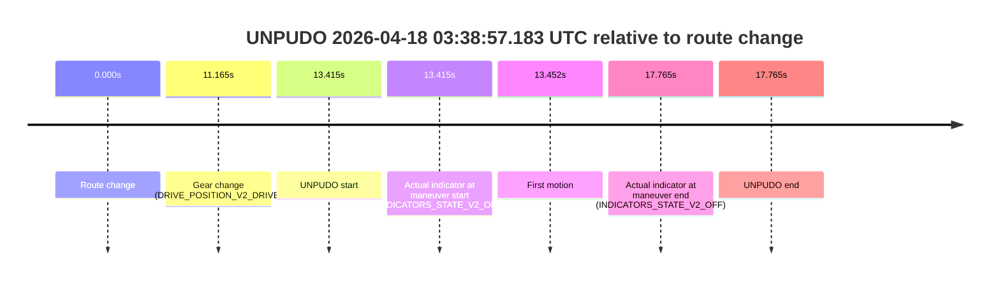
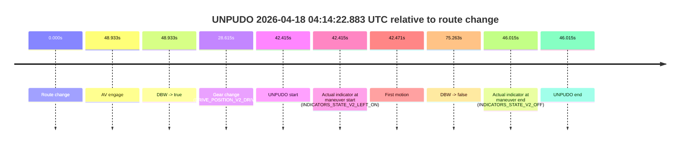
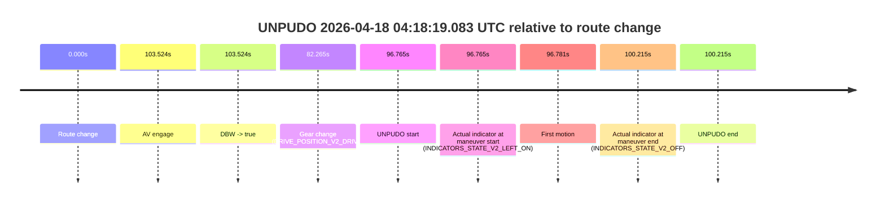

# Run Report: fme10010/2026-04-18--02-48-00--gen2-av-b8e92109-64f7-4b3f-b456-4d78dd0f5147

| Field | Value |
|---|---|
| Run ID | `fme10010/2026-04-18--02-48-00--gen2-av-b8e92109-64f7-4b3f-b456-4d78dd0f5147` |
| Date | `2026-04-18` |
| Model(s) | `satisfied-amber-moose` |
| Author | `guy.geva` |
| Event count | `5` |

## unpudo 2026-04-18 03:07:20.333 UTC

| Field | Value |
|---|---|
| Model | `satisfied-amber-moose` |
| Author | `guy.geva` |
| Run ID | `fme10010/2026-04-18--02-48-00--gen2-av-b8e92109-64f7-4b3f-b456-4d78dd0f5147` |
| Date | `2026-04-18` |
| Time (UTC) | `03:07:20.333` |
| Event type | `unpudo` |
| Disengagement type | `failed_to_unpudo` |
| Route change | `found` |
| Console | [run](https://console.sso.wayve.ai/run/fme10010/2026-04-18--02-48-00--gen2-av-b8e92109-64f7-4b3f-b456-4d78dd0f5147?id=&time-unixus=1776481640333313) |
| Foxglove | [segment](https://app.foxglove.dev/wayve-on-prem/p/prj_0dX18KZdVHg1fmmI/view?ds=foxglove-stream&ds.deviceName=fme10010&ds.start=2026-04-18T03%3A06%3A32.868296Z&ds.end=2026-04-18T03%3A10%3A15.832937Z&layoutId=lay_0e7VD4WIKDQGU73Y&time=2026-04-18T03%3A07%3A20.333313Z) |

### Event card: fail

- Fail: AV owns part of the segment, but the event still resolves as a model-performance failure under the AV-only scoring rule.

| Event | Time (UTC) | Delta from route change |
|---|---:|---:|
| Route change | 2026-04-18 03:06:42.868 | `0.000s` |
| AV engage | 2026-04-18 03:07:42.103 | `59.235s` |
| DBW -> true | 2026-04-18 03:07:42.103 | `59.235s` |
| Gear change (DRIVE_POSITION_V2_REVERSE) | 2026-04-18 03:07:05.783 | `22.915s` |
| UNPUDO start | 2026-04-18 03:07:20.333 | `37.465s` |
| Actual indicator at maneuver start (INDICATORS_STATE_V2_OFF) | 2026-04-18 03:07:20.333 | `37.465s` |
| First motion | 2026-04-18 03:07:25.279 | `42.411s` |
| DBW -> false | 2026-04-18 03:10:05.832 | `202.965s` |
| Actual indicator at maneuver end (INDICATORS_STATE_V2_OFF) | 2026-04-18 03:07:28.883 | `46.015s` |
| UNPUDO end | 2026-04-18 03:07:28.883 | `46.015s` |

| Metric | Value |
|---|---|
| Outcome | `fail` |
| Effective failure type | `failed_to_unpudo` |
| Route change status | `found` |
| DBW at event start | `false` |
| DBW at event end | `false` |
| Predicted gear at AV start | `DRIVE_POSITION_V2_DRIVE` |
| Actual gear at AV start | `DRIVE_POSITION_V2_DRIVE` |
| Predicted gear at event start | `DRIVE_POSITION_V2_REVERSE` |
| Actual gear at event start | `DRIVE_POSITION_V2_REVERSE` |
| Planned indicator direction | `INDICATORS_STATE_V2_OFF` |
| Controller indicator direction | `INDICATORS_STATE_V2_OFF` |
| Actual indicator direction | `INDICATORS_STATE_V2_OFF` |
| Actual indicator at maneuver end | `INDICATORS_STATE_V2_OFF` |
| Driver accel help in AV | `false` |
| Driver accel help timestamp | `n/a` |
| Max accel pedal pct in AV | `0.0%` |
| Max brake pedal pct in AV | `0.0%` |
| Max speed mps in AV | `0.000` |
| Route -> AV | `59.235s` |
| AV -> event start | `-21.770s` |
| AV -> first motion | `-16.824s` |
| AV duration before disengagement | `143.730s` |
| Trajectory waypoint count | `36` |
| Driving-plan step count | `11` |

The scored portion starts from the AV-owned window, not from the pre-AV setup. Route-change search in the stopped pre-event segment was `found`, with the baseline therefore set to route change. At the event anchor the model predicts `DRIVE_POSITION_V2_REVERSE` and the actual gear is `DRIVE_POSITION_V2_REVERSE`. The effective model outcome is `fail` because `failed_to_unpudo`.

### Resolution

| Field | Value |
|---|---|
| Final outcome | `fail` |
| Do we agree with this label? | `yes` |
| Source disengagement type | `failed_to_unpudo` |
| Resolved effective failure type | `failed_to_unpudo` |
| Confidence | `high` |

## unpudo 2026-04-18 03:37:04.683 UTC

| Field | Value |
|---|---|
| Model | `satisfied-amber-moose` |
| Author | `guy.geva` |
| Run ID | `fme10010/2026-04-18--02-48-00--gen2-av-b8e92109-64f7-4b3f-b456-4d78dd0f5147` |
| Date | `2026-04-18` |
| Time (UTC) | `03:37:04.683` |
| Event type | `unpudo` |
| Disengagement type | `none observed` |
| Route change | `found` |
| Console | [run](https://console.sso.wayve.ai/run/fme10010/2026-04-18--02-48-00--gen2-av-b8e92109-64f7-4b3f-b456-4d78dd0f5147?id=&time-unixus=1776483424683329) |
| Foxglove | [segment](https://app.foxglove.dev/wayve-on-prem/p/prj_0dX18KZdVHg1fmmI/view?ds=foxglove-stream&ds.deviceName=fme10010&ds.start=2026-04-18T03%3A36%3A46.218264Z&ds.end=2026-04-18T03%3A38%3A20.663055Z&layoutId=lay_0e7VD4WIKDQGU73Y&time=2026-04-18T03%3A37%3A04.683329Z) |

### Event card: fail

- Fail: the credited unpudo does not stay AV-owned. The event window starts with DBW false, and the maneuver outcome lands outside a clean AV-owned segment.

| Event | Time (UTC) | Delta from route change |
|---|---:|---:|
| Route change | 2026-04-18 03:36:56.218 | `0.000s` |
| AV engage | 2026-04-18 03:37:18.161 | `21.943s` |
| DBW -> true | 2026-04-18 03:37:18.161 | `21.943s` |
| Gear change (DRIVE_POSITION_V2_REVERSE) | 2026-04-18 03:37:01.283 | `5.065s` |
| UNPUDO start | 2026-04-18 03:37:04.683 | `8.465s` |
| Actual indicator at maneuver start (INDICATORS_STATE_V2_OFF) | 2026-04-18 03:37:04.683 | `8.465s` |
| First motion | 2026-04-18 03:37:10.599 | `14.381s` |
| DBW -> false | 2026-04-18 03:38:10.663 | `74.445s` |
| Actual indicator at maneuver end (INDICATORS_STATE_V2_OFF) | 2026-04-18 03:37:14.783 | `18.565s` |
| UNPUDO end | 2026-04-18 03:37:14.783 | `18.565s` |

| Metric | Value |
|---|---|
| Outcome | `fail` |
| Effective failure type | `completed_outside_av` |
| Route change status | `found` |
| DBW at event start | `false` |
| DBW at event end | `false` |
| Predicted gear at AV start | `DRIVE_POSITION_V2_DRIVE` |
| Actual gear at AV start | `DRIVE_POSITION_V2_DRIVE` |
| Predicted gear at event start | `DRIVE_POSITION_V2_REVERSE` |
| Actual gear at event start | `DRIVE_POSITION_V2_REVERSE` |
| Planned indicator direction | `INDICATORS_STATE_V2_OFF` |
| Controller indicator direction | `INDICATORS_STATE_V2_OFF` |
| Actual indicator direction | `INDICATORS_STATE_V2_OFF` |
| Actual indicator at maneuver end | `INDICATORS_STATE_V2_OFF` |
| Driver accel help in AV | `false` |
| Driver accel help timestamp | `n/a` |
| Max accel pedal pct in AV | `0.0%` |
| Max brake pedal pct in AV | `0.0%` |
| Max speed mps in AV | `0.000` |
| Route -> AV | `21.943s` |
| AV -> event start | `-13.478s` |
| AV -> first motion | `-7.562s` |
| AV duration before disengagement | `52.501s` |
| Trajectory waypoint count | `37` |
| Driving-plan step count | `11` |

The scored portion starts from the AV-owned window, not from the pre-AV setup. Route-change search in the stopped pre-event segment was `found`, with the baseline therefore set to route change. At the event anchor the model predicts `DRIVE_POSITION_V2_REVERSE` and the actual gear is `DRIVE_POSITION_V2_REVERSE`. The effective model outcome is `fail` because `completed_outside_av`.

### Resolution

| Field | Value |
|---|---|
| Final outcome | `fail` |
| Do we agree with this label? | `yes` |
| Source disengagement type | `none observed` |
| Resolved effective failure type | `completed_outside_av` |
| Confidence | `high` |

## unpudo 2026-04-18 03:38:57.183 UTC

| Field | Value |
|---|---|
| Model | `satisfied-amber-moose` |
| Author | `guy.geva` |
| Run ID | `fme10010/2026-04-18--02-48-00--gen2-av-b8e92109-64f7-4b3f-b456-4d78dd0f5147` |
| Date | `2026-04-18` |
| Time (UTC) | `03:38:57.183` |
| Event type | `unpudo` |
| Disengagement type | `none observed` |
| Route change | `found` |
| Console | [run](https://console.sso.wayve.ai/run/fme10010/2026-04-18--02-48-00--gen2-av-b8e92109-64f7-4b3f-b456-4d78dd0f5147?id=&time-unixus=1776483537183311) |
| Foxglove | [segment](https://app.foxglove.dev/wayve-on-prem/p/prj_0dX18KZdVHg1fmmI/view?ds=foxglove-stream&ds.deviceName=fme10010&ds.start=2026-04-18T03%3A38%3A33.768306Z&ds.end=2026-04-18T03%3A39%3A11.533311Z&layoutId=lay_0e7VD4WIKDQGU73Y&time=2026-04-18T03%3A38%3A57.183311Z) |

### Event card: fail

- Fail: the credited unpudo does not stay AV-owned. The event window starts with DBW false, and the maneuver outcome lands outside a clean AV-owned segment.

| Event | Time (UTC) | Delta from route change |
|---|---:|---:|
| Route change | 2026-04-18 03:38:43.768 | `0.000s` |
| Gear change (DRIVE_POSITION_V2_DRIVE) | 2026-04-18 03:38:54.933 | `11.165s` |
| UNPUDO start | 2026-04-18 03:38:57.183 | `13.415s` |
| Actual indicator at maneuver start (INDICATORS_STATE_V2_OFF) | 2026-04-18 03:38:57.183 | `13.415s` |
| First motion | 2026-04-18 03:38:57.219 | `13.452s` |
| Actual indicator at maneuver end (INDICATORS_STATE_V2_OFF) | 2026-04-18 03:39:01.533 | `17.765s` |
| UNPUDO end | 2026-04-18 03:39:01.533 | `17.765s` |

| Metric | Value |
|---|---|
| Outcome | `fail` |
| Effective failure type | `not_av_owned` |
| Route change status | `found` |
| DBW at event start | `false` |
| DBW at event end | `false` |
| Predicted gear at AV start | `n/a` |
| Actual gear at AV start | `n/a` |
| Predicted gear at event start | `DRIVE_POSITION_V2_DRIVE` |
| Actual gear at event start | `DRIVE_POSITION_V2_DRIVE` |
| Planned indicator direction | `INDICATORS_STATE_V2_OFF` |
| Controller indicator direction | `INDICATORS_STATE_V2_OFF` |
| Actual indicator direction | `INDICATORS_STATE_V2_OFF` |
| Actual indicator at maneuver end | `INDICATORS_STATE_V2_OFF` |
| Driver accel help in AV | `false` |
| Driver accel help timestamp | `n/a` |
| Max accel pedal pct in AV | `0.0%` |
| Max brake pedal pct in AV | `0.0%` |
| Max speed mps in AV | `0.000` |
| Route -> AV | `n/a` |
| AV -> event start | `n/a` |
| AV -> first motion | `n/a` |
| AV duration before disengagement | `n/a` |
| Trajectory waypoint count | `37` |
| Driving-plan step count | `11` |

The scored portion starts from the AV-owned window, not from the pre-AV setup. Route-change search in the stopped pre-event segment was `found`, with the baseline therefore set to route change. At the event anchor the model predicts `DRIVE_POSITION_V2_DRIVE` and the actual gear is `DRIVE_POSITION_V2_DRIVE`. The effective model outcome is `fail` because `not_av_owned`.

### Resolution

| Field | Value |
|---|---|
| Final outcome | `fail` |
| Do we agree with this label? | `yes` |
| Source disengagement type | `none observed` |
| Resolved effective failure type | `not_av_owned` |
| Confidence | `high` |

## unpudo 2026-04-18 04:14:22.883 UTC

| Field | Value |
|---|---|
| Model | `satisfied-amber-moose` |
| Author | `guy.geva` |
| Run ID | `fme10010/2026-04-18--02-48-00--gen2-av-b8e92109-64f7-4b3f-b456-4d78dd0f5147` |
| Date | `2026-04-18` |
| Time (UTC) | `04:14:22.883` |
| Event type | `unpudo` |
| Disengagement type | `failed_to_unpudo` |
| Route change | `found` |
| Console | [run](https://console.sso.wayve.ai/run/fme10010/2026-04-18--02-48-00--gen2-av-b8e92109-64f7-4b3f-b456-4d78dd0f5147?id=&time-unixus=1776485662883328) |
| Foxglove | [segment](https://app.foxglove.dev/wayve-on-prem/p/prj_0dX18KZdVHg1fmmI/view?ds=foxglove-stream&ds.deviceName=fme10010&ds.start=2026-04-18T04%3A13%3A30.468271Z&ds.end=2026-04-18T04%3A15%3A05.731685Z&layoutId=lay_0e7VD4WIKDQGU73Y&time=2026-04-18T04%3A14%3A22.883328Z) |

### Event card: fail

- Fail: AV owns part of the segment, but the event still resolves as a model-performance failure under the AV-only scoring rule.

| Event | Time (UTC) | Delta from route change |
|---|---:|---:|
| Route change | 2026-04-18 04:13:40.468 | `0.000s` |
| AV engage | 2026-04-18 04:14:29.401 | `48.933s` |
| DBW -> true | 2026-04-18 04:14:29.401 | `48.933s` |
| Gear change (DRIVE_POSITION_V2_DRIVE) | 2026-04-18 04:14:09.083 | `28.615s` |
| UNPUDO start | 2026-04-18 04:14:22.883 | `42.415s` |
| Actual indicator at maneuver start (INDICATORS_STATE_V2_LEFT_ON) | 2026-04-18 04:14:22.883 | `42.415s` |
| First motion | 2026-04-18 04:14:22.939 | `42.471s` |
| DBW -> false | 2026-04-18 04:14:55.731 | `75.263s` |
| Actual indicator at maneuver end (INDICATORS_STATE_V2_OFF) | 2026-04-18 04:14:26.483 | `46.015s` |
| UNPUDO end | 2026-04-18 04:14:26.483 | `46.015s` |

| Metric | Value |
|---|---|
| Outcome | `fail` |
| Effective failure type | `failed_to_unpudo` |
| Route change status | `found` |
| DBW at event start | `false` |
| DBW at event end | `false` |
| Predicted gear at AV start | `DRIVE_POSITION_V2_DRIVE` |
| Actual gear at AV start | `DRIVE_POSITION_V2_DRIVE` |
| Predicted gear at event start | `DRIVE_POSITION_V2_DRIVE` |
| Actual gear at event start | `DRIVE_POSITION_V2_DRIVE` |
| Planned indicator direction | `INDICATORS_STATE_V2_LEFT_ON` |
| Controller indicator direction | `INDICATORS_STATE_V2_LEFT_ON` |
| Actual indicator direction | `INDICATORS_STATE_V2_LEFT_ON` |
| Actual indicator at maneuver end | `INDICATORS_STATE_V2_OFF` |
| Driver accel help in AV | `false` |
| Driver accel help timestamp | `n/a` |
| Max accel pedal pct in AV | `0.0%` |
| Max brake pedal pct in AV | `0.0%` |
| Max speed mps in AV | `0.000` |
| Route -> AV | `48.933s` |
| AV -> event start | `-6.518s` |
| AV -> first motion | `-6.462s` |
| AV duration before disengagement | `26.330s` |
| Trajectory waypoint count | `37` |
| Driving-plan step count | `11` |

The scored portion starts from the AV-owned window, not from the pre-AV setup. Route-change search in the stopped pre-event segment was `found`, with the baseline therefore set to route change. At the event anchor the model predicts `DRIVE_POSITION_V2_DRIVE` and the actual gear is `DRIVE_POSITION_V2_DRIVE`. The effective model outcome is `fail` because `failed_to_unpudo`.

### Resolution

| Field | Value |
|---|---|
| Final outcome | `fail` |
| Do we agree with this label? | `yes` |
| Source disengagement type | `failed_to_unpudo` |
| Resolved effective failure type | `failed_to_unpudo` |
| Confidence | `high` |

## unpudo 2026-04-18 04:18:19.083 UTC

| Field | Value |
|---|---|
| Model | `satisfied-amber-moose` |
| Author | `guy.geva` |
| Run ID | `fme10010/2026-04-18--02-48-00--gen2-av-b8e92109-64f7-4b3f-b456-4d78dd0f5147` |
| Date | `2026-04-18` |
| Time (UTC) | `04:18:19.083` |
| Event type | `unpudo` |
| Disengagement type | `failed_to_unpudo` |
| Route change | `found` |
| Console | [run](https://console.sso.wayve.ai/run/fme10010/2026-04-18--02-48-00--gen2-av-b8e92109-64f7-4b3f-b456-4d78dd0f5147?id=&time-unixus=1776485899083308) |
| Foxglove | [segment](https://app.foxglove.dev/wayve-on-prem/p/prj_0dX18KZdVHg1fmmI/view?ds=foxglove-stream&ds.deviceName=fme10010&ds.start=2026-04-18T04%3A16%3A32.318270Z&ds.end=2026-04-18T04%3A18%3A32.533296Z&layoutId=lay_0e7VD4WIKDQGU73Y&time=2026-04-18T04%3A18%3A19.083308Z) |

### Event card: fail

- Fail: AV owns part of the segment, but the event still resolves as a model-performance failure under the AV-only scoring rule.

| Event | Time (UTC) | Delta from route change |
|---|---:|---:|
| Route change | 2026-04-18 04:16:42.318 | `0.000s` |
| AV engage | 2026-04-18 04:18:25.841 | `103.524s` |
| DBW -> true | 2026-04-18 04:18:25.841 | `103.524s` |
| Gear change (DRIVE_POSITION_V2_DRIVE) | 2026-04-18 04:18:04.583 | `82.265s` |
| UNPUDO start | 2026-04-18 04:18:19.083 | `96.765s` |
| Actual indicator at maneuver start (INDICATORS_STATE_V2_LEFT_ON) | 2026-04-18 04:18:19.083 | `96.765s` |
| First motion | 2026-04-18 04:18:19.099 | `96.781s` |
| Actual indicator at maneuver end (INDICATORS_STATE_V2_OFF) | 2026-04-18 04:18:22.533 | `100.215s` |
| UNPUDO end | 2026-04-18 04:18:22.533 | `100.215s` |

| Metric | Value |
|---|---|
| Outcome | `fail` |
| Effective failure type | `failed_to_unpudo` |
| Route change status | `found` |
| DBW at event start | `false` |
| DBW at event end | `false` |
| Predicted gear at AV start | `DRIVE_POSITION_V2_DRIVE` |
| Actual gear at AV start | `DRIVE_POSITION_V2_DRIVE` |
| Predicted gear at event start | `DRIVE_POSITION_V2_DRIVE` |
| Actual gear at event start | `DRIVE_POSITION_V2_DRIVE` |
| Planned indicator direction | `INDICATORS_STATE_V2_LEFT_ON` |
| Controller indicator direction | `INDICATORS_STATE_V2_LEFT_ON` |
| Actual indicator direction | `INDICATORS_STATE_V2_LEFT_ON` |
| Actual indicator at maneuver end | `INDICATORS_STATE_V2_OFF` |
| Driver accel help in AV | `false` |
| Driver accel help timestamp | `n/a` |
| Max accel pedal pct in AV | `0.0%` |
| Max brake pedal pct in AV | `0.0%` |
| Max speed mps in AV | `0.000` |
| Route -> AV | `103.524s` |
| AV -> event start | `-6.759s` |
| AV -> first motion | `-6.742s` |
| AV duration before disengagement | `n/a` |
| Trajectory waypoint count | `37` |
| Driving-plan step count | `11` |

The scored portion starts from the AV-owned window, not from the pre-AV setup. Route-change search in the stopped pre-event segment was `found`, with the baseline therefore set to route change. At the event anchor the model predicts `DRIVE_POSITION_V2_DRIVE` and the actual gear is `DRIVE_POSITION_V2_DRIVE`. The effective model outcome is `fail` because `failed_to_unpudo`.

### Resolution

| Field | Value |
|---|---|
| Final outcome | `fail` |
| Do we agree with this label? | `yes` |
| Source disengagement type | `failed_to_unpudo` |
| Resolved effective failure type | `failed_to_unpudo` |
| Confidence | `high` |
