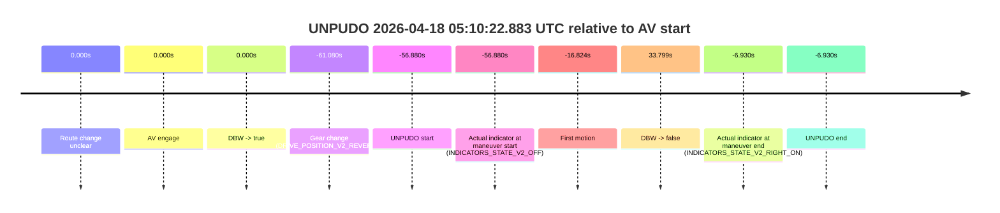
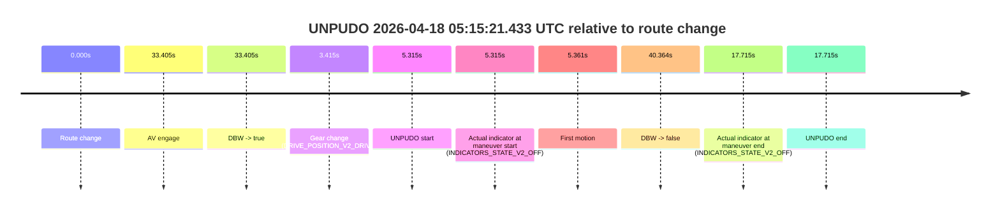
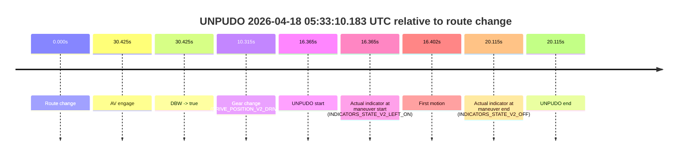

# Run Report: fme10010/2026-04-18--04-57-45--gen2-av-0a18c88b-19e8-46d1-a50b-acf2d03badb6

| Field | Value |
|---|---|
| Run ID | `fme10010/2026-04-18--04-57-45--gen2-av-0a18c88b-19e8-46d1-a50b-acf2d03badb6` |
| Date | `2026-04-18` |
| Model(s) | `plum-timeless-beaver` |
| Author | `peng.tang` |
| Event count | `6` |

## unpudo 2026-04-18 05:10:22.883 UTC

| Field | Value |
|---|---|
| Model | `plum-timeless-beaver` |
| Author | `peng.tang` |
| Run ID | `fme10010/2026-04-18--04-57-45--gen2-av-0a18c88b-19e8-46d1-a50b-acf2d03badb6` |
| Date | `2026-04-18` |
| Time (UTC) | `05:10:22.883` |
| Event type | `unpudo` |
| Disengagement type | `failed_to_pudo` |
| Route change | `unclear` |
| Console | [run](https://console.sso.wayve.ai/run/fme10010/2026-04-18--04-57-45--gen2-av-0a18c88b-19e8-46d1-a50b-acf2d03badb6?id=&time-unixus=1776489022883324) |
| Foxglove | [segment](https://app.foxglove.dev/wayve-on-prem/p/prj_0dX18KZdVHg1fmmI/view?ds=foxglove-stream&ds.deviceName=fme10010&ds.start=2026-04-18T05%3A10%3A08.683296Z&ds.end=2026-04-18T05%3A12%3A03.562185Z&layoutId=lay_0e7VD4WIKDQGU73Y&time=2026-04-18T05%3A10%3A22.883324Z) |

### Event card: accidental

- Accidental: AV ownership is present for less than `2s`, so this is treated as an accidental brush with the maneuver rather than a meaningful model attempt.

| Event | Time (UTC) | Delta from AV start |
|---|---:|---:|
| Route change unclear | 2026-04-18 05:11:19.763 | `0.000s` |
| AV engage | 2026-04-18 05:11:19.763 | `0.000s` |
| DBW -> true | 2026-04-18 05:11:19.763 | `0.000s` |
| Gear change (DRIVE_POSITION_V2_REVERSE) | 2026-04-18 05:10:18.683 | `-61.080s` |
| UNPUDO start | 2026-04-18 05:10:22.883 | `-56.880s` |
| Actual indicator at maneuver start (INDICATORS_STATE_V2_OFF) | 2026-04-18 05:10:22.883 | `-56.880s` |
| First motion | 2026-04-18 05:11:02.939 | `-16.824s` |
| DBW -> false | 2026-04-18 05:11:53.562 | `33.799s` |
| Actual indicator at maneuver end (INDICATORS_STATE_V2_RIGHT_ON) | 2026-04-18 05:11:12.833 | `-6.930s` |
| UNPUDO end | 2026-04-18 05:11:12.833 | `-6.930s` |

| Metric | Value |
|---|---|
| Outcome | `accidental` |
| Effective failure type | `none` |
| Route change status | `unclear` |
| DBW at event start | `false` |
| DBW at event end | `false` |
| Predicted gear at AV start | `DRIVE_POSITION_V2_DRIVE` |
| Actual gear at AV start | `DRIVE_POSITION_V2_DRIVE` |
| Predicted gear at event start | `DRIVE_POSITION_V2_REVERSE` |
| Actual gear at event start | `DRIVE_POSITION_V2_REVERSE` |
| Planned indicator direction | `INDICATORS_STATE_V2_OFF` |
| Controller indicator direction | `INDICATORS_STATE_V2_OFF` |
| Actual indicator direction | `INDICATORS_STATE_V2_OFF` |
| Actual indicator at maneuver end | `INDICATORS_STATE_V2_RIGHT_ON` |
| Driver accel help in AV | `false` |
| Driver accel help timestamp | `n/a` |
| Max accel pedal pct in AV | `0.0%` |
| Max brake pedal pct in AV | `0.0%` |
| Max speed mps in AV | `0.000` |
| Route -> AV | `n/a` |
| AV -> event start | `-56.880s` |
| AV -> first motion | `-16.824s` |
| AV duration before disengagement | `33.799s` |
| Trajectory waypoint count | `37` |
| Driving-plan step count | `11` |

The scored portion starts from the AV-owned window, not from the pre-AV setup. Route-change search in the stopped pre-event segment was `unclear`, with the baseline therefore set to AV start. At the event anchor the model predicts `DRIVE_POSITION_V2_REVERSE` and the actual gear is `DRIVE_POSITION_V2_REVERSE`. The effective model outcome is `accidental` because `the AV-owned portion is shorter than 2s`.

### Resolution

| Field | Value |
|---|---|
| Final outcome | `accidental` |
| Do we agree with this label? | `yes` |
| Source disengagement type | `failed_to_pudo` |
| Resolved effective failure type | `none` |
| Confidence | `medium` |

## unpudo 2026-04-18 05:15:21.433 UTC

| Field | Value |
|---|---|
| Model | `plum-timeless-beaver` |
| Author | `peng.tang` |
| Run ID | `fme10010/2026-04-18--04-57-45--gen2-av-0a18c88b-19e8-46d1-a50b-acf2d03badb6` |
| Date | `2026-04-18` |
| Time (UTC) | `05:15:21.433` |
| Event type | `unpudo` |
| Disengagement type | `none observed` |
| Route change | `found` |
| Console | [run](https://console.sso.wayve.ai/run/fme10010/2026-04-18--04-57-45--gen2-av-0a18c88b-19e8-46d1-a50b-acf2d03badb6?id=&time-unixus=1776489321433307) |
| Foxglove | [segment](https://app.foxglove.dev/wayve-on-prem/p/prj_0dX18KZdVHg1fmmI/view?ds=foxglove-stream&ds.deviceName=fme10010&ds.start=2026-04-18T05%3A15%3A06.118261Z&ds.end=2026-04-18T05%3A16%3A06.482126Z&layoutId=lay_0e7VD4WIKDQGU73Y&time=2026-04-18T05%3A15%3A21.433307Z) |

### Event card: accidental

- Accidental: AV ownership is present for less than `2s`, so this is treated as an accidental brush with the maneuver rather than a meaningful model attempt.

| Event | Time (UTC) | Delta from route change |
|---|---:|---:|
| Route change | 2026-04-18 05:15:16.118 | `0.000s` |
| AV engage | 2026-04-18 05:15:49.523 | `33.405s` |
| DBW -> true | 2026-04-18 05:15:49.523 | `33.405s` |
| Gear change (DRIVE_POSITION_V2_DRIVE) | 2026-04-18 05:15:19.533 | `3.415s` |
| UNPUDO start | 2026-04-18 05:15:21.433 | `5.315s` |
| Actual indicator at maneuver start (INDICATORS_STATE_V2_OFF) | 2026-04-18 05:15:21.433 | `5.315s` |
| First motion | 2026-04-18 05:15:21.479 | `5.361s` |
| DBW -> false | 2026-04-18 05:15:56.482 | `40.364s` |
| Actual indicator at maneuver end (INDICATORS_STATE_V2_OFF) | 2026-04-18 05:15:33.833 | `17.715s` |
| UNPUDO end | 2026-04-18 05:15:33.833 | `17.715s` |

| Metric | Value |
|---|---|
| Outcome | `accidental` |
| Effective failure type | `none` |
| Route change status | `found` |
| DBW at event start | `false` |
| DBW at event end | `false` |
| Predicted gear at AV start | `DRIVE_POSITION_V2_DRIVE` |
| Actual gear at AV start | `DRIVE_POSITION_V2_DRIVE` |
| Predicted gear at event start | `DRIVE_POSITION_V2_DRIVE` |
| Actual gear at event start | `DRIVE_POSITION_V2_DRIVE` |
| Planned indicator direction | `INDICATORS_STATE_V2_OFF` |
| Controller indicator direction | `INDICATORS_STATE_V2_OFF` |
| Actual indicator direction | `INDICATORS_STATE_V2_OFF` |
| Actual indicator at maneuver end | `INDICATORS_STATE_V2_OFF` |
| Driver accel help in AV | `false` |
| Driver accel help timestamp | `n/a` |
| Max accel pedal pct in AV | `0.0%` |
| Max brake pedal pct in AV | `0.0%` |
| Max speed mps in AV | `0.000` |
| Route -> AV | `33.405s` |
| AV -> event start | `-28.090s` |
| AV -> first motion | `-28.044s` |
| AV duration before disengagement | `6.959s` |
| Trajectory waypoint count | `36` |
| Driving-plan step count | `11` |

The scored portion starts from the AV-owned window, not from the pre-AV setup. Route-change search in the stopped pre-event segment was `found`, with the baseline therefore set to route change. At the event anchor the model predicts `DRIVE_POSITION_V2_DRIVE` and the actual gear is `DRIVE_POSITION_V2_DRIVE`. The effective model outcome is `accidental` because `the AV-owned portion is shorter than 2s`.

### Resolution

| Field | Value |
|---|---|
| Final outcome | `accidental` |
| Do we agree with this label? | `yes` |
| Source disengagement type | `none observed` |
| Resolved effective failure type | `none` |
| Confidence | `high` |

## unpudo 2026-04-18 05:16:22.833 UTC

| Field | Value |
|---|---|
| Model | `plum-timeless-beaver` |
| Author | `peng.tang` |
| Run ID | `fme10010/2026-04-18--04-57-45--gen2-av-0a18c88b-19e8-46d1-a50b-acf2d03badb6` |
| Date | `2026-04-18` |
| Time (UTC) | `05:16:22.833` |
| Event type | `unpudo` |
| Disengagement type | `none observed` |
| Route change | `found` |
| Console | [run](https://console.sso.wayve.ai/run/fme10010/2026-04-18--04-57-45--gen2-av-0a18c88b-19e8-46d1-a50b-acf2d03badb6?id=&time-unixus=1776489382833295) |
| Foxglove | [segment](https://app.foxglove.dev/wayve-on-prem/p/prj_0dX18KZdVHg1fmmI/view?ds=foxglove-stream&ds.deviceName=fme10010&ds.start=2026-04-18T05%3A15%3A06.118261Z&ds.end=2026-04-18T05%3A19%3A08.172187Z&layoutId=lay_0e7VD4WIKDQGU73Y&time=2026-04-18T05%3A16%3A22.833295Z) |

### Event card: accidental

- Accidental: AV ownership is present for less than `2s`, so this is treated as an accidental brush with the maneuver rather than a meaningful model attempt.

| Event | Time (UTC) | Delta from route change |
|---|---:|---:|
| Route change | 2026-04-18 05:15:16.118 | `0.000s` |
| AV engage | 2026-04-18 05:16:27.402 | `71.284s` |
| DBW -> true | 2026-04-18 05:16:27.402 | `71.284s` |
| Gear change (DRIVE_POSITION_V2_DRIVE) | 2026-04-18 05:16:21.433 | `65.315s` |
| UNPUDO start | 2026-04-18 05:16:22.833 | `66.715s` |
| Actual indicator at maneuver start (INDICATORS_STATE_V2_LEFT_ON) | 2026-04-18 05:16:22.833 | `66.715s` |
| First motion | 2026-04-18 05:16:22.879 | `66.761s` |
| DBW -> false | 2026-04-18 05:18:58.172 | `222.054s` |
| Actual indicator at maneuver end (INDICATORS_STATE_V2_OFF) | 2026-04-18 05:16:25.683 | `69.565s` |
| UNPUDO end | 2026-04-18 05:16:25.683 | `69.565s` |

| Metric | Value |
|---|---|
| Outcome | `accidental` |
| Effective failure type | `none` |
| Route change status | `found` |
| DBW at event start | `false` |
| DBW at event end | `false` |
| Predicted gear at AV start | `DRIVE_POSITION_V2_DRIVE` |
| Actual gear at AV start | `DRIVE_POSITION_V2_DRIVE` |
| Predicted gear at event start | `DRIVE_POSITION_V2_DRIVE` |
| Actual gear at event start | `DRIVE_POSITION_V2_DRIVE` |
| Planned indicator direction | `INDICATORS_STATE_V2_LEFT_ON` |
| Controller indicator direction | `INDICATORS_STATE_V2_LEFT_ON` |
| Actual indicator direction | `INDICATORS_STATE_V2_LEFT_ON` |
| Actual indicator at maneuver end | `INDICATORS_STATE_V2_OFF` |
| Driver accel help in AV | `false` |
| Driver accel help timestamp | `n/a` |
| Max accel pedal pct in AV | `0.0%` |
| Max brake pedal pct in AV | `0.0%` |
| Max speed mps in AV | `0.000` |
| Route -> AV | `71.284s` |
| AV -> event start | `-4.569s` |
| AV -> first motion | `-4.523s` |
| AV duration before disengagement | `150.770s` |
| Trajectory waypoint count | `36` |
| Driving-plan step count | `11` |

The scored portion starts from the AV-owned window, not from the pre-AV setup. Route-change search in the stopped pre-event segment was `found`, with the baseline therefore set to route change. At the event anchor the model predicts `DRIVE_POSITION_V2_DRIVE` and the actual gear is `DRIVE_POSITION_V2_DRIVE`. The effective model outcome is `accidental` because `the AV-owned portion is shorter than 2s`.

### Resolution

| Field | Value |
|---|---|
| Final outcome | `accidental` |
| Do we agree with this label? | `yes` |
| Source disengagement type | `none observed` |
| Resolved effective failure type | `none` |
| Confidence | `high` |

## unpudo 2026-04-18 05:24:32.283 UTC

| Field | Value |
|---|---|
| Model | `plum-timeless-beaver` |
| Author | `peng.tang` |
| Run ID | `fme10010/2026-04-18--04-57-45--gen2-av-0a18c88b-19e8-46d1-a50b-acf2d03badb6` |
| Date | `2026-04-18` |
| Time (UTC) | `05:24:32.283` |
| Event type | `unpudo` |
| Disengagement type | `failed_to_unpudo` |
| Route change | `found` |
| Console | [run](https://console.sso.wayve.ai/run/fme10010/2026-04-18--04-57-45--gen2-av-0a18c88b-19e8-46d1-a50b-acf2d03badb6?id=&time-unixus=1776489872283315) |
| Foxglove | [segment](https://app.foxglove.dev/wayve-on-prem/p/prj_0dX18KZdVHg1fmmI/view?ds=foxglove-stream&ds.deviceName=fme10010&ds.start=2026-04-18T05%3A24%3A08.218508Z&ds.end=2026-04-18T05%3A25%3A06.733323Z&layoutId=lay_0e7VD4WIKDQGU73Y&time=2026-04-18T05%3A24%3A32.283315Z) |

### Event card: non-av

- Non-AV: the detected unpudo starts outside AV ownership, so it is kept for coverage but excluded from model success / failure scoring.

| Event | Time (UTC) | Delta from route change |
|---|---:|---:|
| Route change | 2026-04-18 05:24:18.218 | `0.000s` |
| AV engage | 2026-04-18 05:24:43.282 | `25.064s` |
| DBW -> true | 2026-04-18 05:24:43.282 | `25.064s` |
| Gear change (DRIVE_POSITION_V2_DRIVE) | 2026-04-18 05:24:24.333 | `6.115s` |
| UNPUDO start | 2026-04-18 05:24:32.283 | `14.065s` |
| Actual indicator at maneuver start (INDICATORS_STATE_V2_OFF) | 2026-04-18 05:24:32.283 | `14.065s` |
| First motion | 2026-04-18 05:24:32.319 | `14.101s` |
| DBW -> false | 2026-04-18 05:24:48.783 | `30.565s` |
| Actual indicator at maneuver end (INDICATORS_STATE_V2_RIGHT_ON) | 2026-04-18 05:24:56.733 | `38.515s` |
| UNPUDO end | 2026-04-18 05:24:56.733 | `38.515s` |

| Metric | Value |
|---|---|
| Outcome | `non-av` |
| Effective failure type | `none` |
| Route change status | `found` |
| DBW at event start | `false` |
| DBW at event end | `false` |
| Predicted gear at AV start | `DRIVE_POSITION_V2_DRIVE` |
| Actual gear at AV start | `DRIVE_POSITION_V2_DRIVE` |
| Predicted gear at event start | `DRIVE_POSITION_V2_DRIVE` |
| Actual gear at event start | `DRIVE_POSITION_V2_DRIVE` |
| Planned indicator direction | `INDICATORS_STATE_V2_OFF` |
| Controller indicator direction | `INDICATORS_STATE_V2_OFF` |
| Actual indicator direction | `INDICATORS_STATE_V2_OFF` |
| Actual indicator at maneuver end | `INDICATORS_STATE_V2_RIGHT_ON` |
| Driver accel help in AV | `false` |
| Driver accel help timestamp | `n/a` |
| Max accel pedal pct in AV | `0.0%` |
| Max brake pedal pct in AV | `9.1%` |
| Max speed mps in AV | `0.792` |
| Route -> AV | `25.064s` |
| AV -> event start | `-10.999s` |
| AV -> first motion | `-10.962s` |
| AV duration before disengagement | `5.501s` |
| Trajectory waypoint count | `37` |
| Driving-plan step count | `11` |

The scored portion starts from the AV-owned window, not from the pre-AV setup. Route-change search in the stopped pre-event segment was `found`, with the baseline therefore set to route change. At the event anchor the model predicts `DRIVE_POSITION_V2_DRIVE` and the actual gear is `DRIVE_POSITION_V2_DRIVE`. The effective model outcome is `non-av` because `the event does not begin in AV ownership`.

### Resolution

| Field | Value |
|---|---|
| Final outcome | `non-av` |
| Do we agree with this label? | `yes` |
| Source disengagement type | `failed_to_unpudo` |
| Resolved effective failure type | `none` |
| Confidence | `high` |

## unpudo 2026-04-18 05:30:29.883 UTC

| Field | Value |
|---|---|
| Model | `plum-timeless-beaver` |
| Author | `peng.tang` |
| Run ID | `fme10010/2026-04-18--04-57-45--gen2-av-0a18c88b-19e8-46d1-a50b-acf2d03badb6` |
| Date | `2026-04-18` |
| Time (UTC) | `05:30:29.883` |
| Event type | `unpudo` |
| Disengagement type | `none observed` |
| Route change | `found` |
| Console | [run](https://console.sso.wayve.ai/run/fme10010/2026-04-18--04-57-45--gen2-av-0a18c88b-19e8-46d1-a50b-acf2d03badb6?id=&time-unixus=1776490229883322) |
| Foxglove | [segment](https://app.foxglove.dev/wayve-on-prem/p/prj_0dX18KZdVHg1fmmI/view?ds=foxglove-stream&ds.deviceName=fme10010&ds.start=2026-04-18T05%3A29%3A11.918293Z&ds.end=2026-04-18T05%3A32%3A39.042358Z&layoutId=lay_0e7VD4WIKDQGU73Y&time=2026-04-18T05%3A30%3A29.883322Z) |

### Event card: accidental

- Accidental: AV ownership is present for less than `2s`, so this is treated as an accidental brush with the maneuver rather than a meaningful model attempt.

| Event | Time (UTC) | Delta from route change |
|---|---:|---:|
| Route change | 2026-04-18 05:29:21.918 | `0.000s` |
| AV engage | 2026-04-18 05:30:39.302 | `77.384s` |
| DBW -> true | 2026-04-18 05:30:39.302 | `77.384s` |
| Gear change (DRIVE_POSITION_V2_DRIVE) | 2026-04-18 05:30:28.333 | `66.415s` |
| UNPUDO start | 2026-04-18 05:30:29.883 | `67.965s` |
| Actual indicator at maneuver start (INDICATORS_STATE_V2_RIGHT_ON) | 2026-04-18 05:30:29.883 | `67.965s` |
| First motion | 2026-04-18 05:30:29.920 | `68.002s` |
| DBW -> false | 2026-04-18 05:32:29.042 | `187.124s` |
| Actual indicator at maneuver end (INDICATORS_STATE_V2_OFF) | 2026-04-18 05:30:35.083 | `73.165s` |
| UNPUDO end | 2026-04-18 05:30:35.083 | `73.165s` |

| Metric | Value |
|---|---|
| Outcome | `accidental` |
| Effective failure type | `none` |
| Route change status | `found` |
| DBW at event start | `false` |
| DBW at event end | `false` |
| Predicted gear at AV start | `DRIVE_POSITION_V2_DRIVE` |
| Actual gear at AV start | `DRIVE_POSITION_V2_DRIVE` |
| Predicted gear at event start | `DRIVE_POSITION_V2_DRIVE` |
| Actual gear at event start | `DRIVE_POSITION_V2_DRIVE` |
| Planned indicator direction | `INDICATORS_STATE_V2_OFF` |
| Controller indicator direction | `INDICATORS_STATE_V2_OFF` |
| Actual indicator direction | `INDICATORS_STATE_V2_RIGHT_ON` |
| Actual indicator at maneuver end | `INDICATORS_STATE_V2_OFF` |
| Driver accel help in AV | `false` |
| Driver accel help timestamp | `n/a` |
| Max accel pedal pct in AV | `0.0%` |
| Max brake pedal pct in AV | `0.0%` |
| Max speed mps in AV | `0.000` |
| Route -> AV | `77.384s` |
| AV -> event start | `-9.419s` |
| AV -> first motion | `-9.382s` |
| AV duration before disengagement | `109.740s` |
| Trajectory waypoint count | `37` |
| Driving-plan step count | `11` |

The scored portion starts from the AV-owned window, not from the pre-AV setup. Route-change search in the stopped pre-event segment was `found`, with the baseline therefore set to route change. At the event anchor the model predicts `DRIVE_POSITION_V2_DRIVE` and the actual gear is `DRIVE_POSITION_V2_DRIVE`. The effective model outcome is `accidental` because `the AV-owned portion is shorter than 2s`.

### Resolution

| Field | Value |
|---|---|
| Final outcome | `accidental` |
| Do we agree with this label? | `yes` |
| Source disengagement type | `none observed` |
| Resolved effective failure type | `none` |
| Confidence | `high` |

## unpudo 2026-04-18 05:33:10.183 UTC

| Field | Value |
|---|---|
| Model | `plum-timeless-beaver` |
| Author | `peng.tang` |
| Run ID | `fme10010/2026-04-18--04-57-45--gen2-av-0a18c88b-19e8-46d1-a50b-acf2d03badb6` |
| Date | `2026-04-18` |
| Time (UTC) | `05:33:10.183` |
| Event type | `unpudo` |
| Disengagement type | `failed_to_unpudo` |
| Route change | `found` |
| Console | [run](https://console.sso.wayve.ai/run/fme10010/2026-04-18--04-57-45--gen2-av-0a18c88b-19e8-46d1-a50b-acf2d03badb6?id=&time-unixus=1776490390183292) |
| Foxglove | [segment](https://app.foxglove.dev/wayve-on-prem/p/prj_0dX18KZdVHg1fmmI/view?ds=foxglove-stream&ds.deviceName=fme10010&ds.start=2026-04-18T05%3A32%3A43.818334Z&ds.end=2026-04-18T05%3A33%3A23.933318Z&layoutId=lay_0e7VD4WIKDQGU73Y&time=2026-04-18T05%3A33%3A10.183292Z) |

### Event card: accidental

- Accidental: AV ownership is present for less than `2s`, so this is treated as an accidental brush with the maneuver rather than a meaningful model attempt.

| Event | Time (UTC) | Delta from route change |
|---|---:|---:|
| Route change | 2026-04-18 05:32:53.818 | `0.000s` |
| AV engage | 2026-04-18 05:33:24.242 | `30.425s` |
| DBW -> true | 2026-04-18 05:33:24.242 | `30.425s` |
| Gear change (DRIVE_POSITION_V2_DRIVE) | 2026-04-18 05:33:04.133 | `10.315s` |
| UNPUDO start | 2026-04-18 05:33:10.183 | `16.365s` |
| Actual indicator at maneuver start (INDICATORS_STATE_V2_LEFT_ON) | 2026-04-18 05:33:10.183 | `16.365s` |
| First motion | 2026-04-18 05:33:10.220 | `16.402s` |
| Actual indicator at maneuver end (INDICATORS_STATE_V2_OFF) | 2026-04-18 05:33:13.933 | `20.115s` |
| UNPUDO end | 2026-04-18 05:33:13.933 | `20.115s` |

| Metric | Value |
|---|---|
| Outcome | `accidental` |
| Effective failure type | `none` |
| Route change status | `found` |
| DBW at event start | `false` |
| DBW at event end | `false` |
| Predicted gear at AV start | `DRIVE_POSITION_V2_DRIVE` |
| Actual gear at AV start | `DRIVE_POSITION_V2_DRIVE` |
| Predicted gear at event start | `DRIVE_POSITION_V2_DRIVE` |
| Actual gear at event start | `DRIVE_POSITION_V2_DRIVE` |
| Planned indicator direction | `INDICATORS_STATE_V2_LEFT_ON` |
| Controller indicator direction | `INDICATORS_STATE_V2_LEFT_ON` |
| Actual indicator direction | `INDICATORS_STATE_V2_LEFT_ON` |
| Actual indicator at maneuver end | `INDICATORS_STATE_V2_OFF` |
| Driver accel help in AV | `false` |
| Driver accel help timestamp | `n/a` |
| Max accel pedal pct in AV | `0.0%` |
| Max brake pedal pct in AV | `0.0%` |
| Max speed mps in AV | `0.000` |
| Route -> AV | `30.425s` |
| AV -> event start | `-14.060s` |
| AV -> first motion | `-14.023s` |
| AV duration before disengagement | `n/a` |
| Trajectory waypoint count | `37` |
| Driving-plan step count | `11` |

The scored portion starts from the AV-owned window, not from the pre-AV setup. Route-change search in the stopped pre-event segment was `found`, with the baseline therefore set to route change. At the event anchor the model predicts `DRIVE_POSITION_V2_DRIVE` and the actual gear is `DRIVE_POSITION_V2_DRIVE`. The effective model outcome is `accidental` because `the AV-owned portion is shorter than 2s`.

### Resolution

| Field | Value |
|---|---|
| Final outcome | `accidental` |
| Do we agree with this label? | `yes` |
| Source disengagement type | `failed_to_unpudo` |
| Resolved effective failure type | `none` |
| Confidence | `high` |
