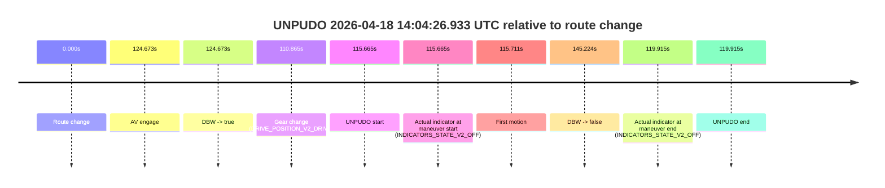
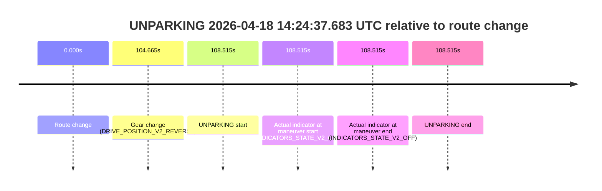

# Run Report: fme10010/2026-04-18--13-37-03--gen2-av-415f2485-1902-412b-a812-8f5d99655ecf

| Field | Value |
|---|---|
| Run ID | `fme10010/2026-04-18--13-37-03--gen2-av-415f2485-1902-412b-a812-8f5d99655ecf` |
| Date | `2026-04-18` |
| Model(s) | `plum-timeless-beaver` |
| Author | `peng.tang` |
| Event count | `6` |

## unpudo 2026-04-18 13:49:21.433 UTC

| Field | Value |
|---|---|
| Model | `plum-timeless-beaver` |
| Author | `peng.tang` |
| Run ID | `fme10010/2026-04-18--13-37-03--gen2-av-415f2485-1902-412b-a812-8f5d99655ecf` |
| Date | `2026-04-18` |
| Time (UTC) | `13:49:21.433` |
| Event type | `unpudo` |
| Disengagement type | `none observed` |
| Route change | `found` |
| Console | [run](https://console.sso.wayve.ai/run/fme10010/2026-04-18--13-37-03--gen2-av-415f2485-1902-412b-a812-8f5d99655ecf?id=&time-unixus=1776520161433299) |
| Foxglove | [segment](https://app.foxglove.dev/wayve-on-prem/p/prj_0dX18KZdVHg1fmmI/view?ds=foxglove-stream&ds.deviceName=fme10010&ds.start=2026-04-18T13%3A47%3A18.468252Z&ds.end=2026-04-18T13%3A52%3A31.001365Z&layoutId=lay_0e7VD4WIKDQGU73Y&time=2026-04-18T13%3A49%3A21.433299Z) |

### Event card: pass

- Pass: AV owns the credited unpudo through the official event window, the gear state is aligned at the anchor, and the vehicle moves without driver accelerator help in AV.

| Event | Time (UTC) | Delta from route change |
|---|---:|---:|
| Route change | 2026-04-18 13:47:28.468 | `0.000s` |
| AV engage | 2026-04-18 13:49:11.421 | `102.953s` |
| DBW -> true | 2026-04-18 13:49:11.421 | `102.953s` |
| Gear change (DRIVE_POSITION_V2_DRIVE) | 2026-04-18 13:49:11.933 | `103.465s` |
| UNPUDO start | 2026-04-18 13:49:21.433 | `112.965s` |
| Actual indicator at maneuver start (INDICATORS_STATE_V2_OFF) | 2026-04-18 13:49:21.433 | `112.965s` |
| First motion | 2026-04-18 13:49:21.459 | `112.991s` |
| DBW -> false | 2026-04-18 13:52:21.001 | `292.533s` |
| Actual indicator at maneuver end (INDICATORS_STATE_V2_OFF) | 2026-04-18 13:49:24.833 | `116.365s` |
| UNPUDO end | 2026-04-18 13:49:24.833 | `116.365s` |

| Metric | Value |
|---|---|
| Outcome | `pass` |
| Effective failure type | `none` |
| Route change status | `found` |
| DBW at event start | `true` |
| DBW at event end | `true` |
| Predicted gear at AV start | `DRIVE_POSITION_V2_DRIVE` |
| Actual gear at AV start | `DRIVE_POSITION_V2_PARK` |
| Predicted gear at event start | `DRIVE_POSITION_V2_DRIVE` |
| Actual gear at event start | `DRIVE_POSITION_V2_DRIVE` |
| Planned indicator direction | `INDICATORS_STATE_V2_LEFT_ON` |
| Controller indicator direction | `INDICATORS_STATE_V2_LEFT_ON` |
| Actual indicator direction | `INDICATORS_STATE_V2_OFF` |
| Actual indicator at maneuver end | `INDICATORS_STATE_V2_OFF` |
| Driver accel help in AV | `false` |
| Driver accel help timestamp | `n/a` |
| Max accel pedal pct in AV | `0.0%` |
| Max brake pedal pct in AV | `8.0%` |
| Max speed mps in AV | `5.633` |
| Route -> AV | `102.953s` |
| AV -> event start | `10.012s` |
| AV -> first motion | `10.038s` |
| AV duration before disengagement | `189.580s` |
| Trajectory waypoint count | `36` |
| Driving-plan step count | `11` |

The scored portion starts from the AV-owned window, not from the pre-AV setup. Route-change search in the stopped pre-event segment was `found`, with the baseline therefore set to route change. At the event anchor the model predicts `DRIVE_POSITION_V2_DRIVE` and the actual gear is `DRIVE_POSITION_V2_DRIVE`. The effective model outcome is `pass` because `the credited maneuver stays AV-owned through the official event end`.

### Resolution

| Field | Value |
|---|---|
| Final outcome | `pass` |
| Do we agree with this label? | `yes` |
| Source disengagement type | `none observed` |
| Resolved effective failure type | `none` |
| Confidence | `high` |

## unpudo 2026-04-18 13:54:07.583 UTC

| Field | Value |
|---|---|
| Model | `plum-timeless-beaver` |
| Author | `peng.tang` |
| Run ID | `fme10010/2026-04-18--13-37-03--gen2-av-415f2485-1902-412b-a812-8f5d99655ecf` |
| Date | `2026-04-18` |
| Time (UTC) | `13:54:07.583` |
| Event type | `unpudo` |
| Disengagement type | `failed_to_accelerate` |
| Route change | `found` |
| Console | [run](https://console.sso.wayve.ai/run/fme10010/2026-04-18--13-37-03--gen2-av-415f2485-1902-412b-a812-8f5d99655ecf?id=&time-unixus=1776520447583293) |
| Foxglove | [segment](https://app.foxglove.dev/wayve-on-prem/p/prj_0dX18KZdVHg1fmmI/view?ds=foxglove-stream&ds.deviceName=fme10010&ds.start=2026-04-18T13%3A52%3A15.818266Z&ds.end=2026-04-18T13%3A56%3A08.061445Z&layoutId=lay_0e7VD4WIKDQGU73Y&time=2026-04-18T13%3A54%3A07.583293Z) |

### Event card: accidental

- Accidental: AV ownership is present for less than `2s`, so this is treated as an accidental brush with the maneuver rather than a meaningful model attempt.

| Event | Time (UTC) | Delta from route change |
|---|---:|---:|
| Route change | 2026-04-18 13:52:25.818 | `0.000s` |
| AV engage | 2026-04-18 13:54:14.490 | `108.673s` |
| DBW -> true | 2026-04-18 13:54:14.490 | `108.673s` |
| Gear change (DRIVE_POSITION_V2_DRIVE) | 2026-04-18 13:54:03.333 | `97.515s` |
| UNPUDO start | 2026-04-18 13:54:07.583 | `101.765s` |
| Actual indicator at maneuver start (INDICATORS_STATE_V2_OFF) | 2026-04-18 13:54:07.583 | `101.765s` |
| First motion | 2026-04-18 13:54:07.619 | `101.802s` |
| DBW -> false | 2026-04-18 13:55:58.061 | `212.243s` |
| Actual indicator at maneuver end (INDICATORS_STATE_V2_OFF) | 2026-04-18 13:54:11.233 | `105.415s` |
| UNPUDO end | 2026-04-18 13:54:11.233 | `105.415s` |

| Metric | Value |
|---|---|
| Outcome | `accidental` |
| Effective failure type | `none` |
| Route change status | `found` |
| DBW at event start | `false` |
| DBW at event end | `false` |
| Predicted gear at AV start | `DRIVE_POSITION_V2_DRIVE` |
| Actual gear at AV start | `DRIVE_POSITION_V2_DRIVE` |
| Predicted gear at event start | `DRIVE_POSITION_V2_DRIVE` |
| Actual gear at event start | `DRIVE_POSITION_V2_DRIVE` |
| Planned indicator direction | `INDICATORS_STATE_V2_LEFT_ON` |
| Controller indicator direction | `INDICATORS_STATE_V2_LEFT_ON` |
| Actual indicator direction | `INDICATORS_STATE_V2_OFF` |
| Actual indicator at maneuver end | `INDICATORS_STATE_V2_OFF` |
| Driver accel help in AV | `false` |
| Driver accel help timestamp | `n/a` |
| Max accel pedal pct in AV | `0.0%` |
| Max brake pedal pct in AV | `0.0%` |
| Max speed mps in AV | `0.000` |
| Route -> AV | `108.673s` |
| AV -> event start | `-6.908s` |
| AV -> first motion | `-6.871s` |
| AV duration before disengagement | `103.571s` |
| Trajectory waypoint count | `37` |
| Driving-plan step count | `11` |

The scored portion starts from the AV-owned window, not from the pre-AV setup. Route-change search in the stopped pre-event segment was `found`, with the baseline therefore set to route change. At the event anchor the model predicts `DRIVE_POSITION_V2_DRIVE` and the actual gear is `DRIVE_POSITION_V2_DRIVE`. The effective model outcome is `accidental` because `the AV-owned portion is shorter than 2s`.

### Resolution

| Field | Value |
|---|---|
| Final outcome | `accidental` |
| Do we agree with this label? | `yes` |
| Source disengagement type | `failed_to_accelerate` |
| Resolved effective failure type | `none` |
| Confidence | `high` |

## unpudo 2026-04-18 14:02:35.433 UTC

| Field | Value |
|---|---|
| Model | `plum-timeless-beaver` |
| Author | `peng.tang` |
| Run ID | `fme10010/2026-04-18--13-37-03--gen2-av-415f2485-1902-412b-a812-8f5d99655ecf` |
| Date | `2026-04-18` |
| Time (UTC) | `14:02:35.433` |
| Event type | `unpudo` |
| Disengagement type | `uncategorised` |
| Route change | `found` |
| Console | [run](https://console.sso.wayve.ai/run/fme10010/2026-04-18--13-37-03--gen2-av-415f2485-1902-412b-a812-8f5d99655ecf?id=&time-unixus=1776520955433306) |
| Foxglove | [segment](https://app.foxglove.dev/wayve-on-prem/p/prj_0dX18KZdVHg1fmmI/view?ds=foxglove-stream&ds.deviceName=fme10010&ds.start=2026-04-18T14%3A00%3A30.718248Z&ds.end=2026-04-18T14%3A04%3A28.222328Z&layoutId=lay_0e7VD4WIKDQGU73Y&time=2026-04-18T14%3A02%3A35.433306Z) |

### Event card: accidental

- Accidental: AV ownership is present for less than `2s`, so this is treated as an accidental brush with the maneuver rather than a meaningful model attempt.

| Event | Time (UTC) | Delta from route change |
|---|---:|---:|
| Route change | 2026-04-18 14:00:40.718 | `0.000s` |
| AV engage | 2026-04-18 14:02:44.542 | `123.824s` |
| DBW -> true | 2026-04-18 14:02:44.542 | `123.824s` |
| Gear change (DRIVE_POSITION_V2_DRIVE) | 2026-04-18 14:02:33.233 | `112.515s` |
| UNPUDO start | 2026-04-18 14:02:35.433 | `114.715s` |
| Actual indicator at maneuver start (INDICATORS_STATE_V2_LEFT_ON) | 2026-04-18 14:02:35.433 | `114.715s` |
| First motion | 2026-04-18 14:02:35.459 | `114.741s` |
| DBW -> false | 2026-04-18 14:04:18.222 | `217.504s` |
| Actual indicator at maneuver end (INDICATORS_STATE_V2_OFF) | 2026-04-18 14:02:38.883 | `118.165s` |
| UNPUDO end | 2026-04-18 14:02:38.883 | `118.165s` |

| Metric | Value |
|---|---|
| Outcome | `accidental` |
| Effective failure type | `none` |
| Route change status | `found` |
| DBW at event start | `false` |
| DBW at event end | `false` |
| Predicted gear at AV start | `DRIVE_POSITION_V2_DRIVE` |
| Actual gear at AV start | `DRIVE_POSITION_V2_DRIVE` |
| Predicted gear at event start | `DRIVE_POSITION_V2_DRIVE` |
| Actual gear at event start | `DRIVE_POSITION_V2_DRIVE` |
| Planned indicator direction | `INDICATORS_STATE_V2_LEFT_ON` |
| Controller indicator direction | `INDICATORS_STATE_V2_LEFT_ON` |
| Actual indicator direction | `INDICATORS_STATE_V2_LEFT_ON` |
| Actual indicator at maneuver end | `INDICATORS_STATE_V2_OFF` |
| Driver accel help in AV | `false` |
| Driver accel help timestamp | `n/a` |
| Max accel pedal pct in AV | `0.0%` |
| Max brake pedal pct in AV | `0.0%` |
| Max speed mps in AV | `0.000` |
| Route -> AV | `123.824s` |
| AV -> event start | `-9.109s` |
| AV -> first motion | `-9.083s` |
| AV duration before disengagement | `93.680s` |
| Trajectory waypoint count | `36` |
| Driving-plan step count | `11` |

The scored portion starts from the AV-owned window, not from the pre-AV setup. Route-change search in the stopped pre-event segment was `found`, with the baseline therefore set to route change. At the event anchor the model predicts `DRIVE_POSITION_V2_DRIVE` and the actual gear is `DRIVE_POSITION_V2_DRIVE`. The effective model outcome is `accidental` because `the AV-owned portion is shorter than 2s`.

### Resolution

| Field | Value |
|---|---|
| Final outcome | `accidental` |
| Do we agree with this label? | `yes` |
| Source disengagement type | `uncategorised` |
| Resolved effective failure type | `none` |
| Confidence | `high` |

## unpudo 2026-04-18 14:04:26.933 UTC

| Field | Value |
|---|---|
| Model | `plum-timeless-beaver` |
| Author | `peng.tang` |
| Run ID | `fme10010/2026-04-18--13-37-03--gen2-av-415f2485-1902-412b-a812-8f5d99655ecf` |
| Date | `2026-04-18` |
| Time (UTC) | `14:04:26.933` |
| Event type | `unpudo` |
| Disengagement type | `failed_to_unpudo` |
| Route change | `found` |
| Console | [run](https://console.sso.wayve.ai/run/fme10010/2026-04-18--13-37-03--gen2-av-415f2485-1902-412b-a812-8f5d99655ecf?id=&time-unixus=1776521066933297) |
| Foxglove | [segment](https://app.foxglove.dev/wayve-on-prem/p/prj_0dX18KZdVHg1fmmI/view?ds=foxglove-stream&ds.deviceName=fme10010&ds.start=2026-04-18T14%3A02%3A21.268256Z&ds.end=2026-04-18T14%3A05%3A06.492611Z&layoutId=lay_0e7VD4WIKDQGU73Y&time=2026-04-18T14%3A04%3A26.933297Z) |

### Event card: accidental

- Accidental: AV ownership is present for less than `2s`, so this is treated as an accidental brush with the maneuver rather than a meaningful model attempt.

| Event | Time (UTC) | Delta from route change |
|---|---:|---:|
| Route change | 2026-04-18 14:02:31.268 | `0.000s` |
| AV engage | 2026-04-18 14:04:35.941 | `124.673s` |
| DBW -> true | 2026-04-18 14:04:35.941 | `124.673s` |
| Gear change (DRIVE_POSITION_V2_DRIVE) | 2026-04-18 14:04:22.133 | `110.865s` |
| UNPUDO start | 2026-04-18 14:04:26.933 | `115.665s` |
| Actual indicator at maneuver start (INDICATORS_STATE_V2_OFF) | 2026-04-18 14:04:26.933 | `115.665s` |
| First motion | 2026-04-18 14:04:26.979 | `115.711s` |
| DBW -> false | 2026-04-18 14:04:56.492 | `145.224s` |
| Actual indicator at maneuver end (INDICATORS_STATE_V2_OFF) | 2026-04-18 14:04:31.183 | `119.915s` |
| UNPUDO end | 2026-04-18 14:04:31.183 | `119.915s` |

| Metric | Value |
|---|---|
| Outcome | `accidental` |
| Effective failure type | `none` |
| Route change status | `found` |
| DBW at event start | `false` |
| DBW at event end | `false` |
| Predicted gear at AV start | `DRIVE_POSITION_V2_DRIVE` |
| Actual gear at AV start | `DRIVE_POSITION_V2_DRIVE` |
| Predicted gear at event start | `DRIVE_POSITION_V2_DRIVE` |
| Actual gear at event start | `DRIVE_POSITION_V2_DRIVE` |
| Planned indicator direction | `INDICATORS_STATE_V2_RIGHT_ON` |
| Controller indicator direction | `INDICATORS_STATE_V2_RIGHT_ON` |
| Actual indicator direction | `INDICATORS_STATE_V2_OFF` |
| Actual indicator at maneuver end | `INDICATORS_STATE_V2_OFF` |
| Driver accel help in AV | `false` |
| Driver accel help timestamp | `n/a` |
| Max accel pedal pct in AV | `0.0%` |
| Max brake pedal pct in AV | `0.0%` |
| Max speed mps in AV | `0.000` |
| Route -> AV | `124.673s` |
| AV -> event start | `-9.008s` |
| AV -> first motion | `-8.962s` |
| AV duration before disengagement | `20.551s` |
| Trajectory waypoint count | `36` |
| Driving-plan step count | `11` |

The scored portion starts from the AV-owned window, not from the pre-AV setup. Route-change search in the stopped pre-event segment was `found`, with the baseline therefore set to route change. At the event anchor the model predicts `DRIVE_POSITION_V2_DRIVE` and the actual gear is `DRIVE_POSITION_V2_DRIVE`. The effective model outcome is `accidental` because `the AV-owned portion is shorter than 2s`.

### Resolution

| Field | Value |
|---|---|
| Final outcome | `accidental` |
| Do we agree with this label? | `yes` |
| Source disengagement type | `failed_to_unpudo` |
| Resolved effective failure type | `none` |
| Confidence | `high` |

## unpudo 2026-04-18 14:10:57.483 UTC

| Field | Value |
|---|---|
| Model | `plum-timeless-beaver` |
| Author | `peng.tang` |
| Run ID | `fme10010/2026-04-18--13-37-03--gen2-av-415f2485-1902-412b-a812-8f5d99655ecf` |
| Date | `2026-04-18` |
| Time (UTC) | `14:10:57.483` |
| Event type | `unpudo` |
| Disengagement type | `failed_to_unpudo` |
| Route change | `found` |
| Console | [run](https://console.sso.wayve.ai/run/fme10010/2026-04-18--13-37-03--gen2-av-415f2485-1902-412b-a812-8f5d99655ecf?id=&time-unixus=1776521457483300) |
| Foxglove | [segment](https://app.foxglove.dev/wayve-on-prem/p/prj_0dX18KZdVHg1fmmI/view?ds=foxglove-stream&ds.deviceName=fme10010&ds.start=2026-04-18T14%3A10%3A25.468324Z&ds.end=2026-04-18T14%3A12%3A55.152111Z&layoutId=lay_0e7VD4WIKDQGU73Y&time=2026-04-18T14%3A10%3A57.483300Z) |

### Event card: accidental

- Accidental: AV ownership is present for less than `2s`, so this is treated as an accidental brush with the maneuver rather than a meaningful model attempt.

| Event | Time (UTC) | Delta from route change |
|---|---:|---:|
| Route change | 2026-04-18 14:10:35.468 | `0.000s` |
| AV engage | 2026-04-18 14:11:06.381 | `30.913s` |
| DBW -> true | 2026-04-18 14:11:06.381 | `30.913s` |
| Gear change (DRIVE_POSITION_V2_DRIVE) | 2026-04-18 14:10:51.683 | `16.215s` |
| UNPUDO start | 2026-04-18 14:10:57.483 | `22.015s` |
| Actual indicator at maneuver start (INDICATORS_STATE_V2_OFF) | 2026-04-18 14:10:57.483 | `22.015s` |
| First motion | 2026-04-18 14:10:57.680 | `22.212s` |
| DBW -> false | 2026-04-18 14:12:45.152 | `129.684s` |
| Actual indicator at maneuver end (INDICATORS_STATE_V2_OFF) | 2026-04-18 14:11:02.183 | `26.715s` |
| UNPUDO end | 2026-04-18 14:11:02.183 | `26.715s` |

| Metric | Value |
|---|---|
| Outcome | `accidental` |
| Effective failure type | `none` |
| Route change status | `found` |
| DBW at event start | `false` |
| DBW at event end | `false` |
| Predicted gear at AV start | `DRIVE_POSITION_V2_DRIVE` |
| Actual gear at AV start | `DRIVE_POSITION_V2_DRIVE` |
| Predicted gear at event start | `DRIVE_POSITION_V2_DRIVE` |
| Actual gear at event start | `DRIVE_POSITION_V2_DRIVE` |
| Planned indicator direction | `INDICATORS_STATE_V2_LEFT_ON` |
| Controller indicator direction | `INDICATORS_STATE_V2_LEFT_ON` |
| Actual indicator direction | `INDICATORS_STATE_V2_OFF` |
| Actual indicator at maneuver end | `INDICATORS_STATE_V2_OFF` |
| Driver accel help in AV | `false` |
| Driver accel help timestamp | `n/a` |
| Max accel pedal pct in AV | `0.0%` |
| Max brake pedal pct in AV | `0.0%` |
| Max speed mps in AV | `0.000` |
| Route -> AV | `30.913s` |
| AV -> event start | `-8.898s` |
| AV -> first motion | `-8.701s` |
| AV duration before disengagement | `98.771s` |
| Trajectory waypoint count | `37` |
| Driving-plan step count | `11` |

The scored portion starts from the AV-owned window, not from the pre-AV setup. Route-change search in the stopped pre-event segment was `found`, with the baseline therefore set to route change. At the event anchor the model predicts `DRIVE_POSITION_V2_DRIVE` and the actual gear is `DRIVE_POSITION_V2_DRIVE`. The effective model outcome is `accidental` because `the AV-owned portion is shorter than 2s`.

### Resolution

| Field | Value |
|---|---|
| Final outcome | `accidental` |
| Do we agree with this label? | `yes` |
| Source disengagement type | `failed_to_unpudo` |
| Resolved effective failure type | `none` |
| Confidence | `high` |

## unparking 2026-04-18 14:24:37.683 UTC

| Field | Value |
|---|---|
| Model | `plum-timeless-beaver` |
| Author | `peng.tang` |
| Run ID | `fme10010/2026-04-18--13-37-03--gen2-av-415f2485-1902-412b-a812-8f5d99655ecf` |
| Date | `2026-04-18` |
| Time (UTC) | `14:24:37.683` |
| Event type | `unparking` |
| Disengagement type | `none observed` |
| Route change | `found` |
| Console | [run](https://console.sso.wayve.ai/run/fme10010/2026-04-18--13-37-03--gen2-av-415f2485-1902-412b-a812-8f5d99655ecf?id=&time-unixus=1776522277683307) |
| Foxglove | [segment](https://app.foxglove.dev/wayve-on-prem/p/prj_0dX18KZdVHg1fmmI/view?ds=foxglove-stream&ds.deviceName=fme10010&ds.start=2026-04-18T14%3A22%3A39.168197Z&ds.end=2026-04-18T14%3A24%3A47.683307Z&layoutId=lay_0e7VD4WIKDQGU73Y&time=2026-04-18T14%3A24%3A37.683307Z) |

### Event card: non-av

- Non-AV: the detected unparking starts outside AV ownership, so it is kept for coverage but excluded from model success / failure scoring.

| Event | Time (UTC) | Delta from route change |
|---|---:|---:|
| Route change | 2026-04-18 14:22:49.168 | `0.000s` |
| Gear change (DRIVE_POSITION_V2_REVERSE) | 2026-04-18 14:24:33.833 | `104.665s` |
| UNPARKING start | 2026-04-18 14:24:37.683 | `108.515s` |
| Actual indicator at maneuver start (INDICATORS_STATE_V2_OFF) | 2026-04-18 14:24:37.683 | `108.515s` |
| Actual indicator at maneuver end (INDICATORS_STATE_V2_OFF) | 2026-04-18 14:24:37.683 | `108.515s` |
| UNPARKING end | 2026-04-18 14:24:37.683 | `108.515s` |

| Metric | Value |
|---|---|
| Outcome | `non-av` |
| Effective failure type | `none` |
| Route change status | `found` |
| DBW at event start | `false` |
| DBW at event end | `false` |
| Predicted gear at AV start | `n/a` |
| Actual gear at AV start | `n/a` |
| Predicted gear at event start | `DRIVE_POSITION_V2_REVERSE` |
| Actual gear at event start | `DRIVE_POSITION_V2_REVERSE` |
| Planned indicator direction | `INDICATORS_STATE_V2_OFF` |
| Controller indicator direction | `INDICATORS_STATE_V2_OFF` |
| Actual indicator direction | `INDICATORS_STATE_V2_OFF` |
| Actual indicator at maneuver end | `INDICATORS_STATE_V2_OFF` |
| Driver accel help in AV | `false` |
| Driver accel help timestamp | `n/a` |
| Max accel pedal pct in AV | `0.0%` |
| Max brake pedal pct in AV | `0.0%` |
| Max speed mps in AV | `0.000` |
| Route -> AV | `n/a` |
| AV -> event start | `n/a` |
| AV -> first motion | `n/a` |
| AV duration before disengagement | `n/a` |
| Trajectory waypoint count | `37` |
| Driving-plan step count | `11` |

The scored portion starts from the AV-owned window, not from the pre-AV setup. Route-change search in the stopped pre-event segment was `found`, with the baseline therefore set to route change. At the event anchor the model predicts `DRIVE_POSITION_V2_REVERSE` and the actual gear is `DRIVE_POSITION_V2_REVERSE`. The effective model outcome is `non-av` because `the event does not begin in AV ownership`.

### Resolution

| Field | Value |
|---|---|
| Final outcome | `non-av` |
| Do we agree with this label? | `yes` |
| Source disengagement type | `none observed` |
| Resolved effective failure type | `none` |
| Confidence | `high` |
