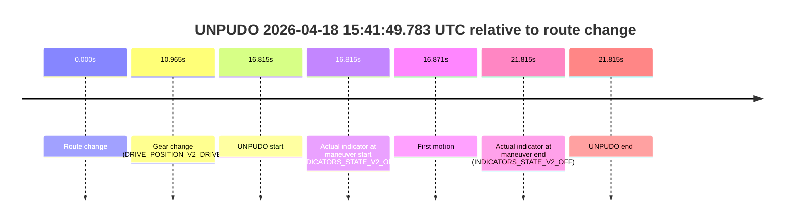
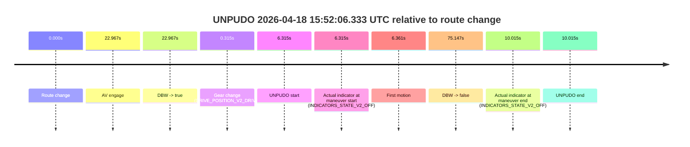
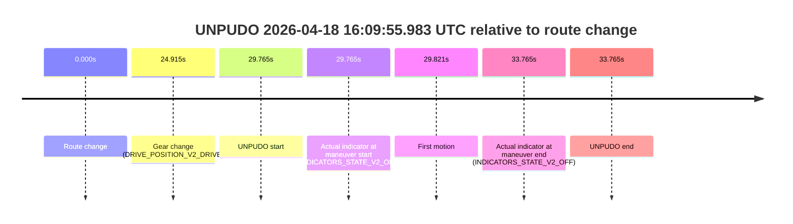
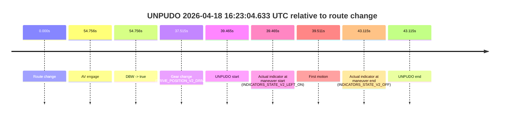

# Run Report: fme10010/2026-04-18--14-45-28--gen2-av-a2978a8b-3cd6-4998-aab6-65845849cd27

| Field | Value |
|---|---|
| Run ID | `fme10010/2026-04-18--14-45-28--gen2-av-a2978a8b-3cd6-4998-aab6-65845849cd27` |
| Date | `2026-04-18` |
| Model(s) | `apricot-crocodile-uproarious` |
| Author | `guy.geva` |
| Event count | `12` |

## unpudo 2026-04-18 14:58:47.933 UTC

| Field | Value |
|---|---|
| Model | `apricot-crocodile-uproarious` |
| Author | `guy.geva` |
| Run ID | `fme10010/2026-04-18--14-45-28--gen2-av-a2978a8b-3cd6-4998-aab6-65845849cd27` |
| Date | `2026-04-18` |
| Time (UTC) | `14:58:47.933` |
| Event type | `unpudo` |
| Disengagement type | `failed_to_unpudo` |
| Route change | `found` |
| Console | [run](https://console.sso.wayve.ai/run/fme10010/2026-04-18--14-45-28--gen2-av-a2978a8b-3cd6-4998-aab6-65845849cd27?id=&time-unixus=1776524327933298) |
| Foxglove | [segment](https://app.foxglove.dev/wayve-on-prem/p/prj_0dX18KZdVHg1fmmI/view?ds=foxglove-stream&ds.deviceName=fme10010&ds.start=2026-04-18T14%3A58%3A09.618274Z&ds.end=2026-04-18T15%3A00%3A19.365806Z&layoutId=lay_0e7VD4WIKDQGU73Y&time=2026-04-18T14%3A58%3A47.933298Z) |

### Event card: fail

- Fail: AV owns part of the segment, but the event still resolves as a model-performance failure under the AV-only scoring rule.

| Event | Time (UTC) | Delta from route change |
|---|---:|---:|
| Route change | 2026-04-18 14:58:19.618 | `0.000s` |
| AV engage | 2026-04-18 14:58:57.285 | `37.667s` |
| DBW -> true | 2026-04-18 14:58:57.285 | `37.667s` |
| Gear change (DRIVE_POSITION_V2_DRIVE) | 2026-04-18 14:58:42.283 | `22.665s` |
| UNPUDO start | 2026-04-18 14:58:47.933 | `28.315s` |
| Actual indicator at maneuver start (INDICATORS_STATE_V2_OFF) | 2026-04-18 14:58:47.933 | `28.315s` |
| First motion | 2026-04-18 14:58:48.139 | `28.521s` |
| DBW -> false | 2026-04-18 15:00:09.365 | `109.748s` |
| Actual indicator at maneuver end (INDICATORS_STATE_V2_OFF) | 2026-04-18 14:58:52.283 | `32.665s` |
| UNPUDO end | 2026-04-18 14:58:52.283 | `32.665s` |

| Metric | Value |
|---|---|
| Outcome | `fail` |
| Effective failure type | `failed_to_unpudo` |
| Route change status | `found` |
| DBW at event start | `false` |
| DBW at event end | `false` |
| Predicted gear at AV start | `DRIVE_POSITION_V2_DRIVE` |
| Actual gear at AV start | `DRIVE_POSITION_V2_DRIVE` |
| Predicted gear at event start | `DRIVE_POSITION_V2_DRIVE` |
| Actual gear at event start | `DRIVE_POSITION_V2_DRIVE` |
| Planned indicator direction | `INDICATORS_STATE_V2_LEFT_ON` |
| Controller indicator direction | `INDICATORS_STATE_V2_LEFT_ON` |
| Actual indicator direction | `INDICATORS_STATE_V2_OFF` |
| Actual indicator at maneuver end | `INDICATORS_STATE_V2_OFF` |
| Driver accel help in AV | `false` |
| Driver accel help timestamp | `n/a` |
| Max accel pedal pct in AV | `0.0%` |
| Max brake pedal pct in AV | `0.0%` |
| Max speed mps in AV | `0.000` |
| Route -> AV | `37.667s` |
| AV -> event start | `-9.352s` |
| AV -> first motion | `-9.146s` |
| AV duration before disengagement | `72.080s` |
| Trajectory waypoint count | `36` |
| Driving-plan step count | `11` |

The scored portion starts from the AV-owned window, not from the pre-AV setup. Route-change search in the stopped pre-event segment was `found`, with the baseline therefore set to route change. At the event anchor the model predicts `DRIVE_POSITION_V2_DRIVE` and the actual gear is `DRIVE_POSITION_V2_DRIVE`. The effective model outcome is `fail` because `failed_to_unpudo`.

### Resolution

| Field | Value |
|---|---|
| Final outcome | `fail` |
| Do we agree with this label? | `yes` |
| Source disengagement type | `failed_to_unpudo` |
| Resolved effective failure type | `failed_to_unpudo` |
| Confidence | `high` |

## unpudo 2026-04-18 15:18:41.883 UTC

| Field | Value |
|---|---|
| Model | `apricot-crocodile-uproarious` |
| Author | `guy.geva` |
| Run ID | `fme10010/2026-04-18--14-45-28--gen2-av-a2978a8b-3cd6-4998-aab6-65845849cd27` |
| Date | `2026-04-18` |
| Time (UTC) | `15:18:41.883` |
| Event type | `unpudo` |
| Disengagement type | `none observed` |
| Route change | `found` |
| Console | [run](https://console.sso.wayve.ai/run/fme10010/2026-04-18--14-45-28--gen2-av-a2978a8b-3cd6-4998-aab6-65845849cd27?id=&time-unixus=1776525521883301) |
| Foxglove | [segment](https://app.foxglove.dev/wayve-on-prem/p/prj_0dX18KZdVHg1fmmI/view?ds=foxglove-stream&ds.deviceName=fme10010&ds.start=2026-04-18T15%3A18%3A09.968273Z&ds.end=2026-04-18T15%3A19%3A13.065693Z&layoutId=lay_0e7VD4WIKDQGU73Y&time=2026-04-18T15%3A18%3A41.883301Z) |

### Event card: pass

- Pass: AV owns the credited unpudo through the official event window, the gear state is aligned at the anchor, and the vehicle moves without driver accelerator help in AV.

| Event | Time (UTC) | Delta from route change |
|---|---:|---:|
| Route change | 2026-04-18 15:18:19.968 | `0.000s` |
| AV engage | 2026-04-18 15:18:35.904 | `15.936s` |
| DBW -> true | 2026-04-18 15:18:35.904 | `15.936s` |
| Gear change (DRIVE_POSITION_V2_DRIVE) | 2026-04-18 15:18:36.383 | `16.415s` |
| UNPUDO start | 2026-04-18 15:18:41.883 | `21.915s` |
| Actual indicator at maneuver start (INDICATORS_STATE_V2_OFF) | 2026-04-18 15:18:41.883 | `21.915s` |
| First motion | 2026-04-18 15:18:42.339 | `22.371s` |
| DBW -> false | 2026-04-18 15:19:03.065 | `43.097s` |
| Actual indicator at maneuver end (INDICATORS_STATE_V2_OFF) | 2026-04-18 15:18:48.533 | `28.565s` |
| UNPUDO end | 2026-04-18 15:18:48.533 | `28.565s` |

| Metric | Value |
|---|---|
| Outcome | `pass` |
| Effective failure type | `none` |
| Route change status | `found` |
| DBW at event start | `true` |
| DBW at event end | `true` |
| Predicted gear at AV start | `DRIVE_POSITION_V2_DRIVE` |
| Actual gear at AV start | `DRIVE_POSITION_V2_PARK` |
| Predicted gear at event start | `DRIVE_POSITION_V2_DRIVE` |
| Actual gear at event start | `DRIVE_POSITION_V2_DRIVE` |
| Planned indicator direction | `INDICATORS_STATE_V2_LEFT_ON` |
| Controller indicator direction | `INDICATORS_STATE_V2_LEFT_ON` |
| Actual indicator direction | `INDICATORS_STATE_V2_OFF` |
| Actual indicator at maneuver end | `INDICATORS_STATE_V2_OFF` |
| Driver accel help in AV | `false` |
| Driver accel help timestamp | `n/a` |
| Max accel pedal pct in AV | `0.0%` |
| Max brake pedal pct in AV | `8.0%` |
| Max speed mps in AV | `5.042` |
| Route -> AV | `15.936s` |
| AV -> event start | `5.979s` |
| AV -> first motion | `6.435s` |
| AV duration before disengagement | `27.161s` |
| Trajectory waypoint count | `37` |
| Driving-plan step count | `11` |

The scored portion starts from the AV-owned window, not from the pre-AV setup. Route-change search in the stopped pre-event segment was `found`, with the baseline therefore set to route change. At the event anchor the model predicts `DRIVE_POSITION_V2_DRIVE` and the actual gear is `DRIVE_POSITION_V2_DRIVE`. The effective model outcome is `pass` because `the credited maneuver stays AV-owned through the official event end`.

### Resolution

| Field | Value |
|---|---|
| Final outcome | `pass` |
| Do we agree with this label? | `yes` |
| Source disengagement type | `none observed` |
| Resolved effective failure type | `none` |
| Confidence | `high` |

## unpudo 2026-04-18 15:24:29.183 UTC

| Field | Value |
|---|---|
| Model | `apricot-crocodile-uproarious` |
| Author | `guy.geva` |
| Run ID | `fme10010/2026-04-18--14-45-28--gen2-av-a2978a8b-3cd6-4998-aab6-65845849cd27` |
| Date | `2026-04-18` |
| Time (UTC) | `15:24:29.183` |
| Event type | `unpudo` |
| Disengagement type | `none observed` |
| Route change | `found` |
| Console | [run](https://console.sso.wayve.ai/run/fme10010/2026-04-18--14-45-28--gen2-av-a2978a8b-3cd6-4998-aab6-65845849cd27?id=&time-unixus=1776525869183298) |
| Foxglove | [segment](https://app.foxglove.dev/wayve-on-prem/p/prj_0dX18KZdVHg1fmmI/view?ds=foxglove-stream&ds.deviceName=fme10010&ds.start=2026-04-18T15%3A24%3A12.968268Z&ds.end=2026-04-18T15%3A25%3A26.264862Z&layoutId=lay_0e7VD4WIKDQGU73Y&time=2026-04-18T15%3A24%3A29.183298Z) |

### Event card: fail

- Fail: the credited unpudo does not stay AV-owned. The event window starts with DBW false, and the maneuver outcome lands outside a clean AV-owned segment.

| Event | Time (UTC) | Delta from route change |
|---|---:|---:|
| Route change | 2026-04-18 15:24:22.968 | `0.000s` |
| AV engage | 2026-04-18 15:24:52.965 | `29.997s` |
| DBW -> true | 2026-04-18 15:24:52.965 | `29.997s` |
| Gear change (DRIVE_POSITION_V2_DRIVE) | 2026-04-18 15:24:23.183 | `0.215s` |
| UNPUDO start | 2026-04-18 15:24:29.183 | `6.215s` |
| Actual indicator at maneuver start (INDICATORS_STATE_V2_OFF) | 2026-04-18 15:24:29.183 | `6.215s` |
| First motion | 2026-04-18 15:24:29.199 | `6.232s` |
| DBW -> false | 2026-04-18 15:25:16.264 | `53.297s` |
| Actual indicator at maneuver end (INDICATORS_STATE_V2_OFF) | 2026-04-18 15:24:33.033 | `10.065s` |
| UNPUDO end | 2026-04-18 15:24:33.033 | `10.065s` |

| Metric | Value |
|---|---|
| Outcome | `fail` |
| Effective failure type | `completed_outside_av` |
| Route change status | `found` |
| DBW at event start | `false` |
| DBW at event end | `false` |
| Predicted gear at AV start | `DRIVE_POSITION_V2_DRIVE` |
| Actual gear at AV start | `DRIVE_POSITION_V2_DRIVE` |
| Predicted gear at event start | `DRIVE_POSITION_V2_DRIVE` |
| Actual gear at event start | `DRIVE_POSITION_V2_DRIVE` |
| Planned indicator direction | `INDICATORS_STATE_V2_LEFT_ON` |
| Controller indicator direction | `INDICATORS_STATE_V2_LEFT_ON` |
| Actual indicator direction | `INDICATORS_STATE_V2_OFF` |
| Actual indicator at maneuver end | `INDICATORS_STATE_V2_OFF` |
| Driver accel help in AV | `false` |
| Driver accel help timestamp | `n/a` |
| Max accel pedal pct in AV | `0.0%` |
| Max brake pedal pct in AV | `0.0%` |
| Max speed mps in AV | `0.000` |
| Route -> AV | `29.997s` |
| AV -> event start | `-23.782s` |
| AV -> first motion | `-23.766s` |
| AV duration before disengagement | `23.299s` |
| Trajectory waypoint count | `37` |
| Driving-plan step count | `11` |

The scored portion starts from the AV-owned window, not from the pre-AV setup. Route-change search in the stopped pre-event segment was `found`, with the baseline therefore set to route change. At the event anchor the model predicts `DRIVE_POSITION_V2_DRIVE` and the actual gear is `DRIVE_POSITION_V2_DRIVE`. The effective model outcome is `fail` because `completed_outside_av`.

### Resolution

| Field | Value |
|---|---|
| Final outcome | `fail` |
| Do we agree with this label? | `yes` |
| Source disengagement type | `none observed` |
| Resolved effective failure type | `completed_outside_av` |
| Confidence | `high` |

## unpudo 2026-04-18 15:41:49.783 UTC

| Field | Value |
|---|---|
| Model | `apricot-crocodile-uproarious` |
| Author | `guy.geva` |
| Run ID | `fme10010/2026-04-18--14-45-28--gen2-av-a2978a8b-3cd6-4998-aab6-65845849cd27` |
| Date | `2026-04-18` |
| Time (UTC) | `15:41:49.783` |
| Event type | `unpudo` |
| Disengagement type | `none observed` |
| Route change | `found` |
| Console | [run](https://console.sso.wayve.ai/run/fme10010/2026-04-18--14-45-28--gen2-av-a2978a8b-3cd6-4998-aab6-65845849cd27?id=&time-unixus=1776526909783307) |
| Foxglove | [segment](https://app.foxglove.dev/wayve-on-prem/p/prj_0dX18KZdVHg1fmmI/view?ds=foxglove-stream&ds.deviceName=fme10010&ds.start=2026-04-18T15%3A41%3A22.968266Z&ds.end=2026-04-18T15%3A42%3A04.783317Z&layoutId=lay_0e7VD4WIKDQGU73Y&time=2026-04-18T15%3A41%3A49.783307Z) |

### Event card: fail

- Fail: the credited unpudo does not stay AV-owned. The event window starts with DBW false, and the maneuver outcome lands outside a clean AV-owned segment.

| Event | Time (UTC) | Delta from route change |
|---|---:|---:|
| Route change | 2026-04-18 15:41:32.968 | `0.000s` |
| Gear change (DRIVE_POSITION_V2_DRIVE) | 2026-04-18 15:41:43.933 | `10.965s` |
| UNPUDO start | 2026-04-18 15:41:49.783 | `16.815s` |
| Actual indicator at maneuver start (INDICATORS_STATE_V2_OFF) | 2026-04-18 15:41:49.783 | `16.815s` |
| First motion | 2026-04-18 15:41:49.839 | `16.871s` |
| Actual indicator at maneuver end (INDICATORS_STATE_V2_OFF) | 2026-04-18 15:41:54.783 | `21.815s` |
| UNPUDO end | 2026-04-18 15:41:54.783 | `21.815s` |

| Metric | Value |
|---|---|
| Outcome | `fail` |
| Effective failure type | `not_av_owned` |
| Route change status | `found` |
| DBW at event start | `false` |
| DBW at event end | `false` |
| Predicted gear at AV start | `n/a` |
| Actual gear at AV start | `n/a` |
| Predicted gear at event start | `DRIVE_POSITION_V2_DRIVE` |
| Actual gear at event start | `DRIVE_POSITION_V2_DRIVE` |
| Planned indicator direction | `INDICATORS_STATE_V2_OFF` |
| Controller indicator direction | `INDICATORS_STATE_V2_OFF` |
| Actual indicator direction | `INDICATORS_STATE_V2_OFF` |
| Actual indicator at maneuver end | `INDICATORS_STATE_V2_OFF` |
| Driver accel help in AV | `false` |
| Driver accel help timestamp | `n/a` |
| Max accel pedal pct in AV | `0.0%` |
| Max brake pedal pct in AV | `0.0%` |
| Max speed mps in AV | `0.000` |
| Route -> AV | `n/a` |
| AV -> event start | `n/a` |
| AV -> first motion | `n/a` |
| AV duration before disengagement | `n/a` |
| Trajectory waypoint count | `37` |
| Driving-plan step count | `11` |

The scored portion starts from the AV-owned window, not from the pre-AV setup. Route-change search in the stopped pre-event segment was `found`, with the baseline therefore set to route change. At the event anchor the model predicts `DRIVE_POSITION_V2_DRIVE` and the actual gear is `DRIVE_POSITION_V2_DRIVE`. The effective model outcome is `fail` because `not_av_owned`.

### Resolution

| Field | Value |
|---|---|
| Final outcome | `fail` |
| Do we agree with this label? | `yes` |
| Source disengagement type | `none observed` |
| Resolved effective failure type | `not_av_owned` |
| Confidence | `high` |

## unpudo 2026-04-18 15:52:06.333 UTC

| Field | Value |
|---|---|
| Model | `apricot-crocodile-uproarious` |
| Author | `guy.geva` |
| Run ID | `fme10010/2026-04-18--14-45-28--gen2-av-a2978a8b-3cd6-4998-aab6-65845849cd27` |
| Date | `2026-04-18` |
| Time (UTC) | `15:52:06.333` |
| Event type | `unpudo` |
| Disengagement type | `none observed` |
| Route change | `found` |
| Console | [run](https://console.sso.wayve.ai/run/fme10010/2026-04-18--14-45-28--gen2-av-a2978a8b-3cd6-4998-aab6-65845849cd27?id=&time-unixus=1776527526333309) |
| Foxglove | [segment](https://app.foxglove.dev/wayve-on-prem/p/prj_0dX18KZdVHg1fmmI/view?ds=foxglove-stream&ds.deviceName=fme10010&ds.start=2026-04-18T15%3A51%3A50.018267Z&ds.end=2026-04-18T15%3A53%3A25.165730Z&layoutId=lay_0e7VD4WIKDQGU73Y&time=2026-04-18T15%3A52%3A06.333309Z) |

### Event card: fail

- Fail: the credited unpudo does not stay AV-owned. The event window starts with DBW false, and the maneuver outcome lands outside a clean AV-owned segment.

| Event | Time (UTC) | Delta from route change |
|---|---:|---:|
| Route change | 2026-04-18 15:52:00.018 | `0.000s` |
| AV engage | 2026-04-18 15:52:22.985 | `22.967s` |
| DBW -> true | 2026-04-18 15:52:22.985 | `22.967s` |
| Gear change (DRIVE_POSITION_V2_DRIVE) | 2026-04-18 15:52:00.333 | `0.315s` |
| UNPUDO start | 2026-04-18 15:52:06.333 | `6.315s` |
| Actual indicator at maneuver start (INDICATORS_STATE_V2_OFF) | 2026-04-18 15:52:06.333 | `6.315s` |
| First motion | 2026-04-18 15:52:06.379 | `6.361s` |
| DBW -> false | 2026-04-18 15:53:15.165 | `75.147s` |
| Actual indicator at maneuver end (INDICATORS_STATE_V2_OFF) | 2026-04-18 15:52:10.033 | `10.015s` |
| UNPUDO end | 2026-04-18 15:52:10.033 | `10.015s` |

| Metric | Value |
|---|---|
| Outcome | `fail` |
| Effective failure type | `completed_outside_av` |
| Route change status | `found` |
| DBW at event start | `false` |
| DBW at event end | `false` |
| Predicted gear at AV start | `DRIVE_POSITION_V2_DRIVE` |
| Actual gear at AV start | `DRIVE_POSITION_V2_DRIVE` |
| Predicted gear at event start | `DRIVE_POSITION_V2_DRIVE` |
| Actual gear at event start | `DRIVE_POSITION_V2_DRIVE` |
| Planned indicator direction | `INDICATORS_STATE_V2_OFF` |
| Controller indicator direction | `INDICATORS_STATE_V2_OFF` |
| Actual indicator direction | `INDICATORS_STATE_V2_OFF` |
| Actual indicator at maneuver end | `INDICATORS_STATE_V2_OFF` |
| Driver accel help in AV | `false` |
| Driver accel help timestamp | `n/a` |
| Max accel pedal pct in AV | `0.0%` |
| Max brake pedal pct in AV | `0.0%` |
| Max speed mps in AV | `0.000` |
| Route -> AV | `22.967s` |
| AV -> event start | `-16.652s` |
| AV -> first motion | `-16.606s` |
| AV duration before disengagement | `52.180s` |
| Trajectory waypoint count | `36` |
| Driving-plan step count | `11` |

The scored portion starts from the AV-owned window, not from the pre-AV setup. Route-change search in the stopped pre-event segment was `found`, with the baseline therefore set to route change. At the event anchor the model predicts `DRIVE_POSITION_V2_DRIVE` and the actual gear is `DRIVE_POSITION_V2_DRIVE`. The effective model outcome is `fail` because `completed_outside_av`.

### Resolution

| Field | Value |
|---|---|
| Final outcome | `fail` |
| Do we agree with this label? | `yes` |
| Source disengagement type | `none observed` |
| Resolved effective failure type | `completed_outside_av` |
| Confidence | `high` |

## unpudo 2026-04-18 16:03:46.183 UTC

| Field | Value |
|---|---|
| Model | `apricot-crocodile-uproarious` |
| Author | `guy.geva` |
| Run ID | `fme10010/2026-04-18--14-45-28--gen2-av-a2978a8b-3cd6-4998-aab6-65845849cd27` |
| Date | `2026-04-18` |
| Time (UTC) | `16:03:46.183` |
| Event type | `unpudo` |
| Disengagement type | `none observed` |
| Route change | `found` |
| Console | [run](https://console.sso.wayve.ai/run/fme10010/2026-04-18--14-45-28--gen2-av-a2978a8b-3cd6-4998-aab6-65845849cd27?id=&time-unixus=1776528226183290) |
| Foxglove | [segment](https://app.foxglove.dev/wayve-on-prem/p/prj_0dX18KZdVHg1fmmI/view?ds=foxglove-stream&ds.deviceName=fme10010&ds.start=2026-04-18T16%3A01%3A53.218242Z&ds.end=2026-04-18T16%3A04%3A29.243888Z&layoutId=lay_0e7VD4WIKDQGU73Y&time=2026-04-18T16%3A03%3A46.183290Z) |

### Event card: fail

- Fail: the credited unpudo does not stay AV-owned. The event window starts with DBW false, and the maneuver outcome lands outside a clean AV-owned segment.

| Event | Time (UTC) | Delta from route change |
|---|---:|---:|
| Route change | 2026-04-18 16:02:03.218 | `0.000s` |
| AV engage | 2026-04-18 16:03:53.544 | `110.326s` |
| DBW -> true | 2026-04-18 16:03:53.544 | `110.326s` |
| Gear change (DRIVE_POSITION_V2_DRIVE) | 2026-04-18 16:03:42.533 | `99.315s` |
| UNPUDO start | 2026-04-18 16:03:46.183 | `102.965s` |
| Actual indicator at maneuver start (INDICATORS_STATE_V2_OFF) | 2026-04-18 16:03:46.183 | `102.965s` |
| First motion | 2026-04-18 16:03:46.320 | `103.102s` |
| DBW -> false | 2026-04-18 16:04:19.243 | `136.026s` |
| Actual indicator at maneuver end (INDICATORS_STATE_V2_OFF) | 2026-04-18 16:03:51.133 | `107.915s` |
| UNPUDO end | 2026-04-18 16:03:51.133 | `107.915s` |

| Metric | Value |
|---|---|
| Outcome | `fail` |
| Effective failure type | `completed_outside_av` |
| Route change status | `found` |
| DBW at event start | `false` |
| DBW at event end | `false` |
| Predicted gear at AV start | `DRIVE_POSITION_V2_DRIVE` |
| Actual gear at AV start | `DRIVE_POSITION_V2_DRIVE` |
| Predicted gear at event start | `DRIVE_POSITION_V2_REVERSE` |
| Actual gear at event start | `DRIVE_POSITION_V2_DRIVE` |
| Planned indicator direction | `INDICATORS_STATE_V2_RIGHT_ON` |
| Controller indicator direction | `INDICATORS_STATE_V2_RIGHT_ON` |
| Actual indicator direction | `INDICATORS_STATE_V2_OFF` |
| Actual indicator at maneuver end | `INDICATORS_STATE_V2_OFF` |
| Driver accel help in AV | `false` |
| Driver accel help timestamp | `n/a` |
| Max accel pedal pct in AV | `0.0%` |
| Max brake pedal pct in AV | `0.0%` |
| Max speed mps in AV | `0.000` |
| Route -> AV | `110.326s` |
| AV -> event start | `-7.361s` |
| AV -> first motion | `-7.224s` |
| AV duration before disengagement | `25.699s` |
| Trajectory waypoint count | `37` |
| Driving-plan step count | `11` |

The scored portion starts from the AV-owned window, not from the pre-AV setup. Route-change search in the stopped pre-event segment was `found`, with the baseline therefore set to route change. At the event anchor the model predicts `DRIVE_POSITION_V2_REVERSE` and the actual gear is `DRIVE_POSITION_V2_DRIVE`. The effective model outcome is `fail` because `completed_outside_av`.

### Resolution

| Field | Value |
|---|---|
| Final outcome | `fail` |
| Do we agree with this label? | `yes` |
| Source disengagement type | `none observed` |
| Resolved effective failure type | `completed_outside_av` |
| Confidence | `high` |

## unpudo 2026-04-18 16:04:43.033 UTC

| Field | Value |
|---|---|
| Model | `apricot-crocodile-uproarious` |
| Author | `guy.geva` |
| Run ID | `fme10010/2026-04-18--14-45-28--gen2-av-a2978a8b-3cd6-4998-aab6-65845849cd27` |
| Date | `2026-04-18` |
| Time (UTC) | `16:04:43.033` |
| Event type | `unpudo` |
| Disengagement type | `none observed` |
| Route change | `found` |
| Console | [run](https://console.sso.wayve.ai/run/fme10010/2026-04-18--14-45-28--gen2-av-a2978a8b-3cd6-4998-aab6-65845849cd27?id=&time-unixus=1776528283033310) |
| Foxglove | [segment](https://app.foxglove.dev/wayve-on-prem/p/prj_0dX18KZdVHg1fmmI/view?ds=foxglove-stream&ds.deviceName=fme10010&ds.start=2026-04-18T16%3A03%3A28.068234Z&ds.end=2026-04-18T16%3A07%3A45.745641Z&layoutId=lay_0e7VD4WIKDQGU73Y&time=2026-04-18T16%3A04%3A43.033310Z) |

### Event card: fail

- Fail: the credited unpudo does not stay AV-owned. The event window starts with DBW false, and the maneuver outcome lands outside a clean AV-owned segment.

| Event | Time (UTC) | Delta from route change |
|---|---:|---:|
| Route change | 2026-04-18 16:03:38.068 | `0.000s` |
| AV engage | 2026-04-18 16:04:54.644 | `76.576s` |
| DBW -> true | 2026-04-18 16:04:54.644 | `76.576s` |
| Gear change (DRIVE_POSITION_V2_DRIVE) | 2026-04-18 16:04:27.333 | `49.265s` |
| UNPUDO start | 2026-04-18 16:04:43.033 | `64.965s` |
| Actual indicator at maneuver start (INDICATORS_STATE_V2_OFF) | 2026-04-18 16:04:43.033 | `64.965s` |
| First motion | 2026-04-18 16:04:43.179 | `65.111s` |
| DBW -> false | 2026-04-18 16:07:35.745 | `237.677s` |
| Actual indicator at maneuver end (INDICATORS_STATE_V2_OFF) | 2026-04-18 16:04:47.033 | `68.965s` |
| UNPUDO end | 2026-04-18 16:04:47.033 | `68.965s` |

| Metric | Value |
|---|---|
| Outcome | `fail` |
| Effective failure type | `completed_outside_av` |
| Route change status | `found` |
| DBW at event start | `false` |
| DBW at event end | `false` |
| Predicted gear at AV start | `DRIVE_POSITION_V2_DRIVE` |
| Actual gear at AV start | `DRIVE_POSITION_V2_DRIVE` |
| Predicted gear at event start | `DRIVE_POSITION_V2_DRIVE` |
| Actual gear at event start | `DRIVE_POSITION_V2_DRIVE` |
| Planned indicator direction | `INDICATORS_STATE_V2_RIGHT_ON` |
| Controller indicator direction | `INDICATORS_STATE_V2_RIGHT_ON` |
| Actual indicator direction | `INDICATORS_STATE_V2_OFF` |
| Actual indicator at maneuver end | `INDICATORS_STATE_V2_OFF` |
| Driver accel help in AV | `false` |
| Driver accel help timestamp | `n/a` |
| Max accel pedal pct in AV | `0.0%` |
| Max brake pedal pct in AV | `0.0%` |
| Max speed mps in AV | `0.000` |
| Route -> AV | `76.576s` |
| AV -> event start | `-11.611s` |
| AV -> first motion | `-11.465s` |
| AV duration before disengagement | `161.101s` |
| Trajectory waypoint count | `36` |
| Driving-plan step count | `11` |

The scored portion starts from the AV-owned window, not from the pre-AV setup. Route-change search in the stopped pre-event segment was `found`, with the baseline therefore set to route change. At the event anchor the model predicts `DRIVE_POSITION_V2_DRIVE` and the actual gear is `DRIVE_POSITION_V2_DRIVE`. The effective model outcome is `fail` because `completed_outside_av`.

### Resolution

| Field | Value |
|---|---|
| Final outcome | `fail` |
| Do we agree with this label? | `yes` |
| Source disengagement type | `none observed` |
| Resolved effective failure type | `completed_outside_av` |
| Confidence | `high` |

## unpudo 2026-04-18 16:09:55.983 UTC

| Field | Value |
|---|---|
| Model | `apricot-crocodile-uproarious` |
| Author | `guy.geva` |
| Run ID | `fme10010/2026-04-18--14-45-28--gen2-av-a2978a8b-3cd6-4998-aab6-65845849cd27` |
| Date | `2026-04-18` |
| Time (UTC) | `16:09:55.983` |
| Event type | `unpudo` |
| Disengagement type | `none observed` |
| Route change | `found` |
| Console | [run](https://console.sso.wayve.ai/run/fme10010/2026-04-18--14-45-28--gen2-av-a2978a8b-3cd6-4998-aab6-65845849cd27?id=&time-unixus=1776528595983317) |
| Foxglove | [segment](https://app.foxglove.dev/wayve-on-prem/p/prj_0dX18KZdVHg1fmmI/view?ds=foxglove-stream&ds.deviceName=fme10010&ds.start=2026-04-18T16%3A09%3A16.218375Z&ds.end=2026-04-18T16%3A10%3A09.983321Z&layoutId=lay_0e7VD4WIKDQGU73Y&time=2026-04-18T16%3A09%3A55.983317Z) |

### Event card: fail

- Fail: the credited unpudo does not stay AV-owned. The event window starts with DBW false, and the maneuver outcome lands outside a clean AV-owned segment.

| Event | Time (UTC) | Delta from route change |
|---|---:|---:|
| Route change | 2026-04-18 16:09:26.218 | `0.000s` |
| Gear change (DRIVE_POSITION_V2_DRIVE) | 2026-04-18 16:09:51.133 | `24.915s` |
| UNPUDO start | 2026-04-18 16:09:55.983 | `29.765s` |
| Actual indicator at maneuver start (INDICATORS_STATE_V2_OFF) | 2026-04-18 16:09:55.983 | `29.765s` |
| First motion | 2026-04-18 16:09:56.039 | `29.821s` |
| Actual indicator at maneuver end (INDICATORS_STATE_V2_OFF) | 2026-04-18 16:09:59.983 | `33.765s` |
| UNPUDO end | 2026-04-18 16:09:59.983 | `33.765s` |

| Metric | Value |
|---|---|
| Outcome | `fail` |
| Effective failure type | `not_av_owned` |
| Route change status | `found` |
| DBW at event start | `false` |
| DBW at event end | `false` |
| Predicted gear at AV start | `n/a` |
| Actual gear at AV start | `n/a` |
| Predicted gear at event start | `DRIVE_POSITION_V2_DRIVE` |
| Actual gear at event start | `DRIVE_POSITION_V2_DRIVE` |
| Planned indicator direction | `INDICATORS_STATE_V2_OFF` |
| Controller indicator direction | `INDICATORS_STATE_V2_OFF` |
| Actual indicator direction | `INDICATORS_STATE_V2_OFF` |
| Actual indicator at maneuver end | `INDICATORS_STATE_V2_OFF` |
| Driver accel help in AV | `false` |
| Driver accel help timestamp | `n/a` |
| Max accel pedal pct in AV | `0.0%` |
| Max brake pedal pct in AV | `0.0%` |
| Max speed mps in AV | `0.000` |
| Route -> AV | `n/a` |
| AV -> event start | `n/a` |
| AV -> first motion | `n/a` |
| AV duration before disengagement | `n/a` |
| Trajectory waypoint count | `37` |
| Driving-plan step count | `11` |

The scored portion starts from the AV-owned window, not from the pre-AV setup. Route-change search in the stopped pre-event segment was `found`, with the baseline therefore set to route change. At the event anchor the model predicts `DRIVE_POSITION_V2_DRIVE` and the actual gear is `DRIVE_POSITION_V2_DRIVE`. The effective model outcome is `fail` because `not_av_owned`.

### Resolution

| Field | Value |
|---|---|
| Final outcome | `fail` |
| Do we agree with this label? | `yes` |
| Source disengagement type | `none observed` |
| Resolved effective failure type | `not_av_owned` |
| Confidence | `high` |

## unpudo 2026-04-18 16:13:40.183 UTC

| Field | Value |
|---|---|
| Model | `apricot-crocodile-uproarious` |
| Author | `guy.geva` |
| Run ID | `fme10010/2026-04-18--14-45-28--gen2-av-a2978a8b-3cd6-4998-aab6-65845849cd27` |
| Date | `2026-04-18` |
| Time (UTC) | `16:13:40.183` |
| Event type | `unpudo` |
| Disengagement type | `none observed` |
| Route change | `found` |
| Console | [run](https://console.sso.wayve.ai/run/fme10010/2026-04-18--14-45-28--gen2-av-a2978a8b-3cd6-4998-aab6-65845849cd27?id=&time-unixus=1776528820183316) |
| Foxglove | [segment](https://app.foxglove.dev/wayve-on-prem/p/prj_0dX18KZdVHg1fmmI/view?ds=foxglove-stream&ds.deviceName=fme10010&ds.start=2026-04-18T16%3A13%3A21.768245Z&ds.end=2026-04-18T16%3A19%3A33.224594Z&layoutId=lay_0e7VD4WIKDQGU73Y&time=2026-04-18T16%3A13%3A40.183316Z) |

### Event card: fail

- Fail: the credited unpudo does not stay AV-owned. The event window starts with DBW false, and the maneuver outcome lands outside a clean AV-owned segment.

| Event | Time (UTC) | Delta from route change |
|---|---:|---:|
| Route change | 2026-04-18 16:13:31.768 | `0.000s` |
| AV engage | 2026-04-18 16:13:49.104 | `17.336s` |
| DBW -> true | 2026-04-18 16:13:49.104 | `17.336s` |
| Gear change (DRIVE_POSITION_V2_DRIVE) | 2026-04-18 16:13:32.033 | `0.265s` |
| UNPUDO start | 2026-04-18 16:13:40.183 | `8.415s` |
| Actual indicator at maneuver start (INDICATORS_STATE_V2_OFF) | 2026-04-18 16:13:40.183 | `8.415s` |
| First motion | 2026-04-18 16:13:40.259 | `8.491s` |
| DBW -> false | 2026-04-18 16:19:23.224 | `351.456s` |
| Actual indicator at maneuver end (INDICATORS_STATE_V2_OFF) | 2026-04-18 16:13:44.833 | `13.065s` |
| UNPUDO end | 2026-04-18 16:13:44.833 | `13.065s` |

| Metric | Value |
|---|---|
| Outcome | `fail` |
| Effective failure type | `completed_outside_av` |
| Route change status | `found` |
| DBW at event start | `false` |
| DBW at event end | `false` |
| Predicted gear at AV start | `DRIVE_POSITION_V2_DRIVE` |
| Actual gear at AV start | `DRIVE_POSITION_V2_DRIVE` |
| Predicted gear at event start | `DRIVE_POSITION_V2_DRIVE` |
| Actual gear at event start | `DRIVE_POSITION_V2_DRIVE` |
| Planned indicator direction | `INDICATORS_STATE_V2_LEFT_ON` |
| Controller indicator direction | `INDICATORS_STATE_V2_LEFT_ON` |
| Actual indicator direction | `INDICATORS_STATE_V2_OFF` |
| Actual indicator at maneuver end | `INDICATORS_STATE_V2_OFF` |
| Driver accel help in AV | `false` |
| Driver accel help timestamp | `n/a` |
| Max accel pedal pct in AV | `0.0%` |
| Max brake pedal pct in AV | `0.0%` |
| Max speed mps in AV | `0.000` |
| Route -> AV | `17.336s` |
| AV -> event start | `-8.921s` |
| AV -> first motion | `-8.845s` |
| AV duration before disengagement | `334.120s` |
| Trajectory waypoint count | `37` |
| Driving-plan step count | `11` |

The scored portion starts from the AV-owned window, not from the pre-AV setup. Route-change search in the stopped pre-event segment was `found`, with the baseline therefore set to route change. At the event anchor the model predicts `DRIVE_POSITION_V2_DRIVE` and the actual gear is `DRIVE_POSITION_V2_DRIVE`. The effective model outcome is `fail` because `completed_outside_av`.

### Resolution

| Field | Value |
|---|---|
| Final outcome | `fail` |
| Do we agree with this label? | `yes` |
| Source disengagement type | `none observed` |
| Resolved effective failure type | `completed_outside_av` |
| Confidence | `high` |

## unpudo 2026-04-18 16:19:24.833 UTC

| Field | Value |
|---|---|
| Model | `apricot-crocodile-uproarious` |
| Author | `guy.geva` |
| Run ID | `fme10010/2026-04-18--14-45-28--gen2-av-a2978a8b-3cd6-4998-aab6-65845849cd27` |
| Date | `2026-04-18` |
| Time (UTC) | `16:19:24.833` |
| Event type | `unpudo` |
| Disengagement type | `none observed` |
| Route change | `found` |
| Console | [run](https://console.sso.wayve.ai/run/fme10010/2026-04-18--14-45-28--gen2-av-a2978a8b-3cd6-4998-aab6-65845849cd27?id=&time-unixus=1776529164833302) |
| Foxglove | [segment](https://app.foxglove.dev/wayve-on-prem/p/prj_0dX18KZdVHg1fmmI/view?ds=foxglove-stream&ds.deviceName=fme10010&ds.start=2026-04-18T16%3A19%3A07.268246Z&ds.end=2026-04-18T16%3A19%3A41.133315Z&layoutId=lay_0e7VD4WIKDQGU73Y&time=2026-04-18T16%3A19%3A24.833302Z) |

### Event card: fail

- Fail: the credited unpudo does not stay AV-owned. The event window starts with DBW false, and the maneuver outcome lands outside a clean AV-owned segment.

| Event | Time (UTC) | Delta from route change |
|---|---:|---:|
| Route change | 2026-04-18 16:19:17.268 | `0.000s` |
| Gear change (DRIVE_POSITION_V2_REVERSE) | 2026-04-18 16:19:17.533 | `0.265s` |
| UNPUDO start | 2026-04-18 16:19:24.833 | `7.565s` |
| Actual indicator at maneuver start (INDICATORS_STATE_V2_OFF) | 2026-04-18 16:19:24.833 | `7.565s` |
| First motion | 2026-04-18 16:19:26.439 | `9.171s` |
| Actual indicator at maneuver end (INDICATORS_STATE_V2_OFF) | 2026-04-18 16:19:31.133 | `13.865s` |
| UNPUDO end | 2026-04-18 16:19:31.133 | `13.865s` |

| Metric | Value |
|---|---|
| Outcome | `fail` |
| Effective failure type | `not_av_owned` |
| Route change status | `found` |
| DBW at event start | `false` |
| DBW at event end | `false` |
| Predicted gear at AV start | `n/a` |
| Actual gear at AV start | `n/a` |
| Predicted gear at event start | `DRIVE_POSITION_V2_REVERSE` |
| Actual gear at event start | `DRIVE_POSITION_V2_REVERSE` |
| Planned indicator direction | `INDICATORS_STATE_V2_OFF` |
| Controller indicator direction | `INDICATORS_STATE_V2_OFF` |
| Actual indicator direction | `INDICATORS_STATE_V2_OFF` |
| Actual indicator at maneuver end | `INDICATORS_STATE_V2_OFF` |
| Driver accel help in AV | `false` |
| Driver accel help timestamp | `n/a` |
| Max accel pedal pct in AV | `0.0%` |
| Max brake pedal pct in AV | `0.0%` |
| Max speed mps in AV | `0.000` |
| Route -> AV | `n/a` |
| AV -> event start | `n/a` |
| AV -> first motion | `n/a` |
| AV duration before disengagement | `n/a` |
| Trajectory waypoint count | `36` |
| Driving-plan step count | `11` |

The scored portion starts from the AV-owned window, not from the pre-AV setup. Route-change search in the stopped pre-event segment was `found`, with the baseline therefore set to route change. At the event anchor the model predicts `DRIVE_POSITION_V2_REVERSE` and the actual gear is `DRIVE_POSITION_V2_REVERSE`. The effective model outcome is `fail` because `not_av_owned`.

### Resolution

| Field | Value |
|---|---|
| Final outcome | `fail` |
| Do we agree with this label? | `yes` |
| Source disengagement type | `none observed` |
| Resolved effective failure type | `not_av_owned` |
| Confidence | `high` |

## unpudo 2026-04-18 16:21:13.883 UTC

| Field | Value |
|---|---|
| Model | `apricot-crocodile-uproarious` |
| Author | `guy.geva` |
| Run ID | `fme10010/2026-04-18--14-45-28--gen2-av-a2978a8b-3cd6-4998-aab6-65845849cd27` |
| Date | `2026-04-18` |
| Time (UTC) | `16:21:13.883` |
| Event type | `unpudo` |
| Disengagement type | `none observed` |
| Route change | `found` |
| Console | [run](https://console.sso.wayve.ai/run/fme10010/2026-04-18--14-45-28--gen2-av-a2978a8b-3cd6-4998-aab6-65845849cd27?id=&time-unixus=1776529273883321) |
| Foxglove | [segment](https://app.foxglove.dev/wayve-on-prem/p/prj_0dX18KZdVHg1fmmI/view?ds=foxglove-stream&ds.deviceName=fme10010&ds.start=2026-04-18T16%3A19%3A07.268246Z&ds.end=2026-04-18T16%3A21%3A54.884481Z&layoutId=lay_0e7VD4WIKDQGU73Y&time=2026-04-18T16%3A21%3A13.883321Z) |

### Event card: fail

- Fail: the credited unpudo does not stay AV-owned. The event window starts with DBW false, and the maneuver outcome lands outside a clean AV-owned segment.

| Event | Time (UTC) | Delta from route change |
|---|---:|---:|
| Route change | 2026-04-18 16:19:17.268 | `0.000s` |
| AV engage | 2026-04-18 16:21:26.064 | `128.796s` |
| DBW -> true | 2026-04-18 16:21:26.064 | `128.796s` |
| Gear change (DRIVE_POSITION_V2_DRIVE) | 2026-04-18 16:21:12.183 | `114.915s` |
| UNPUDO start | 2026-04-18 16:21:13.883 | `116.615s` |
| Actual indicator at maneuver start (INDICATORS_STATE_V2_OFF) | 2026-04-18 16:21:13.883 | `116.615s` |
| First motion | 2026-04-18 16:21:13.939 | `116.671s` |
| DBW -> false | 2026-04-18 16:21:44.884 | `147.616s` |
| Actual indicator at maneuver end (INDICATORS_STATE_V2_RIGHT_ON) | 2026-04-18 16:21:20.833 | `123.565s` |
| UNPUDO end | 2026-04-18 16:21:20.833 | `123.565s` |

| Metric | Value |
|---|---|
| Outcome | `fail` |
| Effective failure type | `completed_outside_av` |
| Route change status | `found` |
| DBW at event start | `false` |
| DBW at event end | `false` |
| Predicted gear at AV start | `DRIVE_POSITION_V2_DRIVE` |
| Actual gear at AV start | `DRIVE_POSITION_V2_DRIVE` |
| Predicted gear at event start | `DRIVE_POSITION_V2_DRIVE` |
| Actual gear at event start | `DRIVE_POSITION_V2_DRIVE` |
| Planned indicator direction | `INDICATORS_STATE_V2_OFF` |
| Controller indicator direction | `INDICATORS_STATE_V2_OFF` |
| Actual indicator direction | `INDICATORS_STATE_V2_OFF` |
| Actual indicator at maneuver end | `INDICATORS_STATE_V2_RIGHT_ON` |
| Driver accel help in AV | `false` |
| Driver accel help timestamp | `n/a` |
| Max accel pedal pct in AV | `0.0%` |
| Max brake pedal pct in AV | `0.0%` |
| Max speed mps in AV | `0.000` |
| Route -> AV | `128.796s` |
| AV -> event start | `-12.181s` |
| AV -> first motion | `-12.125s` |
| AV duration before disengagement | `18.820s` |
| Trajectory waypoint count | `37` |
| Driving-plan step count | `11` |

The scored portion starts from the AV-owned window, not from the pre-AV setup. Route-change search in the stopped pre-event segment was `found`, with the baseline therefore set to route change. At the event anchor the model predicts `DRIVE_POSITION_V2_DRIVE` and the actual gear is `DRIVE_POSITION_V2_DRIVE`. The effective model outcome is `fail` because `completed_outside_av`.

### Resolution

| Field | Value |
|---|---|
| Final outcome | `fail` |
| Do we agree with this label? | `yes` |
| Source disengagement type | `none observed` |
| Resolved effective failure type | `completed_outside_av` |
| Confidence | `high` |

## unpudo 2026-04-18 16:23:04.633 UTC

| Field | Value |
|---|---|
| Model | `apricot-crocodile-uproarious` |
| Author | `guy.geva` |
| Run ID | `fme10010/2026-04-18--14-45-28--gen2-av-a2978a8b-3cd6-4998-aab6-65845849cd27` |
| Date | `2026-04-18` |
| Time (UTC) | `16:23:04.633` |
| Event type | `unpudo` |
| Disengagement type | `none observed` |
| Route change | `found` |
| Console | [run](https://console.sso.wayve.ai/run/fme10010/2026-04-18--14-45-28--gen2-av-a2978a8b-3cd6-4998-aab6-65845849cd27?id=&time-unixus=1776529384633305) |
| Foxglove | [segment](https://app.foxglove.dev/wayve-on-prem/p/prj_0dX18KZdVHg1fmmI/view?ds=foxglove-stream&ds.deviceName=fme10010&ds.start=2026-04-18T16%3A22%3A15.168271Z&ds.end=2026-04-18T16%3A23%3A18.283302Z&layoutId=lay_0e7VD4WIKDQGU73Y&time=2026-04-18T16%3A23%3A04.633305Z) |

### Event card: fail

- Fail: the credited unpudo does not stay AV-owned. The event window starts with DBW false, and the maneuver outcome lands outside a clean AV-owned segment.

| Event | Time (UTC) | Delta from route change |
|---|---:|---:|
| Route change | 2026-04-18 16:22:25.168 | `0.000s` |
| AV engage | 2026-04-18 16:23:19.924 | `54.756s` |
| DBW -> true | 2026-04-18 16:23:19.924 | `54.756s` |
| Gear change (DRIVE_POSITION_V2_DRIVE) | 2026-04-18 16:23:02.683 | `37.515s` |
| UNPUDO start | 2026-04-18 16:23:04.633 | `39.465s` |
| Actual indicator at maneuver start (INDICATORS_STATE_V2_LEFT_ON) | 2026-04-18 16:23:04.633 | `39.465s` |
| First motion | 2026-04-18 16:23:04.679 | `39.511s` |
| Actual indicator at maneuver end (INDICATORS_STATE_V2_OFF) | 2026-04-18 16:23:08.283 | `43.115s` |
| UNPUDO end | 2026-04-18 16:23:08.283 | `43.115s` |

| Metric | Value |
|---|---|
| Outcome | `fail` |
| Effective failure type | `completed_outside_av` |
| Route change status | `found` |
| DBW at event start | `false` |
| DBW at event end | `false` |
| Predicted gear at AV start | `DRIVE_POSITION_V2_DRIVE` |
| Actual gear at AV start | `DRIVE_POSITION_V2_PARK` |
| Predicted gear at event start | `DRIVE_POSITION_V2_DRIVE` |
| Actual gear at event start | `DRIVE_POSITION_V2_DRIVE` |
| Planned indicator direction | `INDICATORS_STATE_V2_LEFT_ON` |
| Controller indicator direction | `INDICATORS_STATE_V2_LEFT_ON` |
| Actual indicator direction | `INDICATORS_STATE_V2_LEFT_ON` |
| Actual indicator at maneuver end | `INDICATORS_STATE_V2_OFF` |
| Driver accel help in AV | `false` |
| Driver accel help timestamp | `n/a` |
| Max accel pedal pct in AV | `0.0%` |
| Max brake pedal pct in AV | `0.0%` |
| Max speed mps in AV | `0.000` |
| Route -> AV | `54.756s` |
| AV -> event start | `-15.291s` |
| AV -> first motion | `-15.245s` |
| AV duration before disengagement | `n/a` |
| Trajectory waypoint count | `36` |
| Driving-plan step count | `11` |

The scored portion starts from the AV-owned window, not from the pre-AV setup. Route-change search in the stopped pre-event segment was `found`, with the baseline therefore set to route change. At the event anchor the model predicts `DRIVE_POSITION_V2_DRIVE` and the actual gear is `DRIVE_POSITION_V2_DRIVE`. The effective model outcome is `fail` because `completed_outside_av`.

### Resolution

| Field | Value |
|---|---|
| Final outcome | `fail` |
| Do we agree with this label? | `yes` |
| Source disengagement type | `none observed` |
| Resolved effective failure type | `completed_outside_av` |
| Confidence | `high` |
