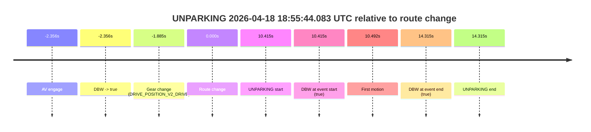

# Run Report: fme10010/2026-04-18--18-35-26--gen2-av-b103585b-2423-430e-9b0e-022bc60baf50

| Field | Value |
|---|---|
| Run ID | `fme10010/2026-04-18--18-35-26--gen2-av-b103585b-2423-430e-9b0e-022bc60baf50` |
| Date | `2026-04-18` |
| Model(s) | `armadillo-amethyst-squeaky` |
| Author | `guy.geva` |
| Event count | `1` |

## unparking 2026-04-18 18:55:44.083 UTC

| Field | Value |
|---|---|
| Model | `armadillo-amethyst-squeaky` |
| Author | `guy.geva` |
| Run ID | `fme10010/2026-04-18--18-35-26--gen2-av-b103585b-2423-430e-9b0e-022bc60baf50` |
| Date | `2026-04-18` |
| Time (UTC) | `18:55:44.083` |
| Event type | `unparking` |
| Disengagement type | `none observed` |
| Route change | `found` |
| Console | [run](https://console.sso.wayve.ai/run/fme10010/2026-04-18--18-35-26--gen2-av-b103585b-2423-430e-9b0e-022bc60baf50?id=&time-unixus=1776538544083295) |
| Foxglove | [segment](https://app.foxglove.dev/wayve-on-prem/p/prj_0dX18KZdVHg1fmmI/view?ds=foxglove-stream&ds.deviceName=fme10010&ds.start=2026-04-18T18%3A55%3A21.312025Z&ds.end=2026-04-18T18%3A55%3A57.983299Z&layoutId=lay_0e7VD4WIKDQGU73Y&time=2026-04-18T18%3A55%3A44.083295Z) |

### Event card: pass

- Pass: AV owns the credited unparking through the official event window, the gear state is aligned at the anchor, and the vehicle moves without driver accelerator help in AV.

| Event | Time (UTC) | Delta from route change |
|---|---:|---:|
| AV engage | 2026-04-18 18:55:31.312 | `-2.356s` |
| DBW -> true | 2026-04-18 18:55:31.312 | `-2.356s` |
| Gear change (DRIVE_POSITION_V2_DRIVE) | 2026-04-18 18:55:31.783 | `-1.885s` |
| Route change | 2026-04-18 18:55:33.668 | `0.000s` |
| UNPARKING start | 2026-04-18 18:55:44.083 | `10.415s` |
| DBW at event start (true) | 2026-04-18 18:55:44.083 | `10.415s` |
| First motion | 2026-04-18 18:55:44.159 | `10.492s` |
| DBW at event end (true) | 2026-04-18 18:55:47.983 | `14.315s` |
| UNPARKING end | 2026-04-18 18:55:47.983 | `14.315s` |

| Metric | Value |
|---|---|
| Outcome | `pass` |
| Effective failure type | `none` |
| Route change status | `found` |
| DBW at event start | `true` |
| DBW at event end | `true` |
| Predicted gear at AV start | `DRIVE_POSITION_V2_DRIVE` |
| Actual gear at AV start | `DRIVE_POSITION_V2_PARK` |
| Predicted gear at event start | `DRIVE_POSITION_V2_DRIVE` |
| Actual gear at event start | `DRIVE_POSITION_V2_DRIVE` |
| Planned indicator direction | `INDICATORS_STATE_V2_LEFT_ON` |
| Controller indicator direction | `INDICATORS_STATE_V2_LEFT_ON` |
| Actual indicator direction | `INDICATORS_STATE_V2_OFF` |
| Actual indicator at maneuver end | `INDICATORS_STATE_V2_OFF` |
| Driver accel help in AV | `false` |
| Driver accel help timestamp | `n/a` |
| Max accel pedal pct in AV | `0.0%` |
| Max brake pedal pct in AV | `0.0%` |
| Max speed mps in AV | `5.131` |
| Success timing baseline | `AV start` |
| Route -> AV | `-2.356s` |
| AV -> event start | `12.771s` |
| AV -> first motion | `12.848s` |
| Success baseline -> event start | `12.771s` |
| Success baseline -> first motion | `12.848s` |
| AV duration before disengagement | `n/a` |
| Trajectory waypoint count | `37` |
| Driving-plan step count | `11` |

The scored portion starts from the AV-owned window, not from the pre-AV setup. Route-change search in the stopped pre-event segment was `found`, with the baseline therefore set to route change. At the event anchor the model predicts `DRIVE_POSITION_V2_DRIVE` and the actual gear is `DRIVE_POSITION_V2_DRIVE`. The effective model outcome is `pass` because `the credited maneuver stays AV-owned through the official event end`.

### Resolution

| Field | Value |
|---|---|
| Final outcome | `pass` |
| Do we agree with this label? | `yes` |
| Source disengagement type | `none observed` |
| Resolved effective failure type | `none` |
| Confidence | `high` |
