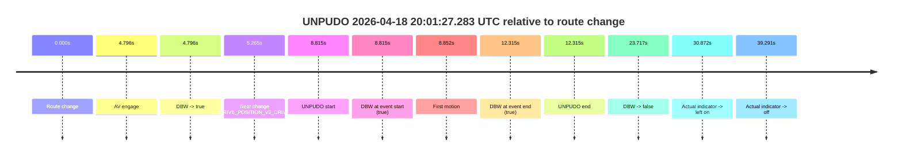
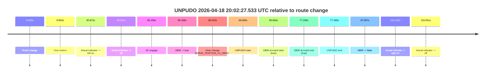
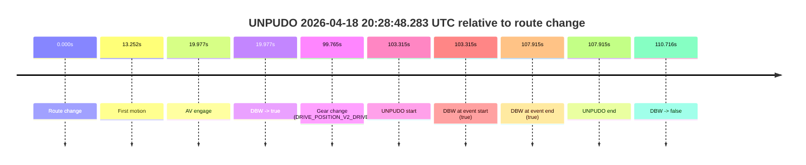
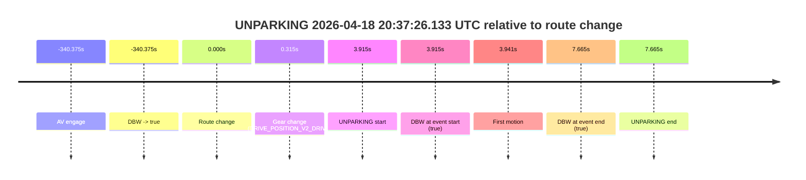

# Run Report: fme10010/2026-04-18--19-54-58--gen2-av-12d23973-c660-4ea9-808c-92c09c9e371f

| Field | Value |
|---|---|
| Run ID | `fme10010/2026-04-18--19-54-58--gen2-av-12d23973-c660-4ea9-808c-92c09c9e371f` |
| Date | `2026-04-18` |
| Model(s) | `eel-teal-outspoken` |
| Author | `zak` |
| Event count | `4` |

## unpudo 2026-04-18 20:01:27.283 UTC

| Field | Value |
|---|---|
| Model | `eel-teal-outspoken` |
| Author | `zak` |
| Run ID | `fme10010/2026-04-18--19-54-58--gen2-av-12d23973-c660-4ea9-808c-92c09c9e371f` |
| Date | `2026-04-18` |
| Time (UTC) | `20:01:27.283` |
| Event type | `unpudo` |
| Disengagement type | `none observed` |
| Route change | `found` |
| Console | [run](https://console.sso.wayve.ai/run/fme10010/2026-04-18--19-54-58--gen2-av-12d23973-c660-4ea9-808c-92c09c9e371f?id=&time-unixus=1776542487283318) |
| Foxglove | [segment](https://app.foxglove.dev/wayve-on-prem/p/prj_0dX18KZdVHg1fmmI/view?ds=foxglove-stream&ds.deviceName=fme10010&ds.start=2026-04-18T20%3A01%3A08.468275Z&ds.end=2026-04-18T20%3A01%3A52.185144Z&layoutId=lay_0e7VD4WIKDQGU73Y&time=2026-04-18T20%3A01%3A27.283318Z) |

### Event card: pass

- Pass: AV owns the credited unpudo from route change through the official unpudo window, the gear state is aligned at the anchor, and the vehicle moves without driver accelerator help in AV.

| Event | Time (UTC) | Delta from route change |
|---|---:|---:|
| Route change | 2026-04-18 20:01:18.468 | `0.000s` |
| AV engage | 2026-04-18 20:01:23.263 | `4.796s` |
| DBW -> true | 2026-04-18 20:01:23.263 | `4.796s` |
| Gear change (DRIVE_POSITION_V2_DRIVE) | 2026-04-18 20:01:23.733 | `5.265s` |
| UNPUDO start | 2026-04-18 20:01:27.283 | `8.815s` |
| DBW at event start (true) | 2026-04-18 20:01:27.283 | `8.815s` |
| First motion | 2026-04-18 20:01:27.319 | `8.852s` |
| DBW at event end (true) | 2026-04-18 20:01:30.783 | `12.315s` |
| UNPUDO end | 2026-04-18 20:01:30.783 | `12.315s` |
| DBW -> false | 2026-04-18 20:01:42.185 | `23.717s` |
| Actual indicator -> left on | 2026-04-18 20:01:49.339 | `30.872s` |
| Actual indicator -> off | 2026-04-18 20:01:57.759 | `39.291s` |

| Metric | Value |
|---|---|
| Outcome | `pass` |
| Effective failure type | `none` |
| Route change status | `found` |
| DBW at event start | `true` |
| DBW at event end | `true` |
| Predicted gear at AV start | `DRIVE_POSITION_V2_DRIVE` |
| Actual gear at AV start | `DRIVE_POSITION_V2_PARK` |
| Predicted gear at event start | `DRIVE_POSITION_V2_DRIVE` |
| Actual gear at event start | `DRIVE_POSITION_V2_DRIVE` |
| Planned indicator direction | `INDICATORS_STATE_V2_LEFT_ON` |
| Controller indicator direction | `INDICATORS_STATE_V2_LEFT_ON` |
| Actual indicator direction | `INDICATORS_STATE_V2_OFF` |
| Actual indicator at maneuver end | `INDICATORS_STATE_V2_OFF` |
| Driver accel help in AV | `false` |
| Driver accel help timestamp | `n/a` |
| Max accel pedal pct in AV | `0.0%` |
| Max brake pedal pct in AV | `8.0%` |
| Max speed mps in AV | `5.256` |
| Success timing baseline | `route change` |
| Route -> AV | `4.796s` |
| AV -> event start | `4.019s` |
| AV -> first motion | `4.056s` |
| Success baseline -> event start | `8.815s` |
| Success baseline -> first motion | `8.852s` |
| AV duration before disengagement | `18.921s` |
| Trajectory waypoint count | `37` |
| Driving-plan step count | `11` |

The scored portion starts from the AV-owned window, not from the pre-AV setup. Route-change search in the stopped pre-event segment was `found`, with the baseline therefore set to route change. At the event anchor the model predicts `DRIVE_POSITION_V2_DRIVE` and the actual gear is `DRIVE_POSITION_V2_DRIVE`. The effective model outcome is `pass` because `the credited unpudo stays AV-owned through the official unpudo window.`

### Resolution

| Field | Value |
|---|---|
| Final outcome | `pass` |
| Do we agree with this label? | `yes` |
| Source disengagement type | `none observed` |
| Resolved effective failure type | `none` |
| Confidence | `high` |

## unpudo 2026-04-18 20:02:27.533 UTC

| Field | Value |
|---|---|
| Model | `eel-teal-outspoken` |
| Author | `zak` |
| Run ID | `fme10010/2026-04-18--19-54-58--gen2-av-12d23973-c660-4ea9-808c-92c09c9e371f` |
| Date | `2026-04-18` |
| Time (UTC) | `20:02:27.533` |
| Event type | `unpudo` |
| Disengagement type | `none observed` |
| Route change | `found` |
| Console | [run](https://console.sso.wayve.ai/run/fme10010/2026-04-18--19-54-58--gen2-av-12d23973-c660-4ea9-808c-92c09c9e371f?id=&time-unixus=1776542547533315) |
| Foxglove | [segment](https://app.foxglove.dev/wayve-on-prem/p/prj_0dX18KZdVHg1fmmI/view?ds=foxglove-stream&ds.deviceName=fme10010&ds.start=2026-04-18T20%3A01%3A08.468275Z&ds.end=2026-04-18T20%3A03%3A05.525073Z&layoutId=lay_0e7VD4WIKDQGU73Y&time=2026-04-18T20%3A02%3A27.533315Z) |

### Event card: pass

- Pass: AV owns the credited unpudo from route change through the official unpudo window, the gear state is aligned at the anchor, and the vehicle moves without driver accelerator help in AV.

| Event | Time (UTC) | Delta from route change |
|---|---:|---:|
| Route change | 2026-04-18 20:01:18.468 | `0.000s` |
| First motion | 2026-04-18 20:01:27.319 | `8.852s` |
| Actual indicator -> left on | 2026-04-18 20:01:49.339 | `30.872s` |
| Actual indicator -> off | 2026-04-18 20:01:57.759 | `39.291s` |
| AV engage | 2026-04-18 20:02:23.623 | `65.156s` |
| DBW -> true | 2026-04-18 20:02:23.623 | `65.156s` |
| Gear change (DRIVE_POSITION_V2_DRIVE) | 2026-04-18 20:02:23.983 | `65.515s` |
| UNPUDO start | 2026-04-18 20:02:27.533 | `69.065s` |
| DBW at event start (true) | 2026-04-18 20:02:27.533 | `69.065s` |
| DBW at event end (true) | 2026-04-18 20:02:35.633 | `77.165s` |
| UNPUDO end | 2026-04-18 20:02:35.633 | `77.165s` |
| DBW -> false | 2026-04-18 20:02:55.525 | `97.057s` |
| Actual indicator -> right on | 2026-04-18 20:03:01.600 | `103.132s` |
| Actual indicator -> off | 2026-04-18 20:03:13.519 | `115.051s` |

| Metric | Value |
|---|---|
| Outcome | `pass` |
| Effective failure type | `none` |
| Route change status | `found` |
| DBW at event start | `true` |
| DBW at event end | `true` |
| Predicted gear at AV start | `DRIVE_POSITION_V2_DRIVE` |
| Actual gear at AV start | `DRIVE_POSITION_V2_PARK` |
| Predicted gear at event start | `DRIVE_POSITION_V2_DRIVE` |
| Actual gear at event start | `DRIVE_POSITION_V2_DRIVE` |
| Planned indicator direction | `INDICATORS_STATE_V2_OFF` |
| Controller indicator direction | `INDICATORS_STATE_V2_OFF` |
| Actual indicator direction | `INDICATORS_STATE_V2_OFF` |
| Actual indicator at maneuver end | `INDICATORS_STATE_V2_OFF` |
| Driver accel help in AV | `false` |
| Driver accel help timestamp | `n/a` |
| Max accel pedal pct in AV | `0.0%` |
| Max brake pedal pct in AV | `8.8%` |
| Max speed mps in AV | `2.719` |
| Success timing baseline | `route change` |
| Route -> AV | `65.156s` |
| AV -> event start | `3.909s` |
| AV -> first motion | `-56.304s` |
| Success baseline -> event start | `69.065s` |
| Success baseline -> first motion | `8.852s` |
| AV duration before disengagement | `31.901s` |
| Trajectory waypoint count | `38` |
| Driving-plan step count | `11` |

The scored portion starts from the AV-owned window, not from the pre-AV setup. Route-change search in the stopped pre-event segment was `found`, with the baseline therefore set to route change. At the event anchor the model predicts `DRIVE_POSITION_V2_DRIVE` and the actual gear is `DRIVE_POSITION_V2_DRIVE`. The effective model outcome is `pass` because `the credited unpudo stays AV-owned through the official unpudo window.`

### Resolution

| Field | Value |
|---|---|
| Final outcome | `pass` |
| Do we agree with this label? | `yes` |
| Source disengagement type | `none observed` |
| Resolved effective failure type | `none` |
| Confidence | `high` |

## unpudo 2026-04-18 20:28:48.283 UTC

| Field | Value |
|---|---|
| Model | `eel-teal-outspoken` |
| Author | `zak` |
| Run ID | `fme10010/2026-04-18--19-54-58--gen2-av-12d23973-c660-4ea9-808c-92c09c9e371f` |
| Date | `2026-04-18` |
| Time (UTC) | `20:28:48.283` |
| Event type | `unpudo` |
| Disengagement type | `none observed` |
| Route change | `found` |
| Console | [run](https://console.sso.wayve.ai/run/fme10010/2026-04-18--19-54-58--gen2-av-12d23973-c660-4ea9-808c-92c09c9e371f?id=&time-unixus=1776544128283311) |
| Foxglove | [segment](https://app.foxglove.dev/wayve-on-prem/p/prj_0dX18KZdVHg1fmmI/view?ds=foxglove-stream&ds.deviceName=fme10010&ds.start=2026-04-18T20%3A26%3A54.968274Z&ds.end=2026-04-18T20%3A29%3A05.683819Z&layoutId=lay_0e7VD4WIKDQGU73Y&time=2026-04-18T20%3A28%3A48.283311Z) |

### Event card: pass

- Pass: AV owns the credited unpudo from route change through the official unpudo window, the gear state is aligned at the anchor, and the vehicle moves without driver accelerator help in AV.

| Event | Time (UTC) | Delta from route change |
|---|---:|---:|
| Route change | 2026-04-18 20:27:04.968 | `0.000s` |
| First motion | 2026-04-18 20:27:18.219 | `13.252s` |
| AV engage | 2026-04-18 20:27:24.945 | `19.977s` |
| DBW -> true | 2026-04-18 20:27:24.945 | `19.977s` |
| Gear change (DRIVE_POSITION_V2_DRIVE) | 2026-04-18 20:28:44.733 | `99.765s` |
| UNPUDO start | 2026-04-18 20:28:48.283 | `103.315s` |
| DBW at event start (true) | 2026-04-18 20:28:48.283 | `103.315s` |
| DBW at event end (true) | 2026-04-18 20:28:52.883 | `107.915s` |
| UNPUDO end | 2026-04-18 20:28:52.883 | `107.915s` |
| DBW -> false | 2026-04-18 20:28:55.683 | `110.716s` |

| Metric | Value |
|---|---|
| Outcome | `pass` |
| Effective failure type | `none` |
| Route change status | `found` |
| DBW at event start | `true` |
| DBW at event end | `true` |
| Predicted gear at AV start | `DRIVE_POSITION_V2_DRIVE` |
| Actual gear at AV start | `DRIVE_POSITION_V2_DRIVE` |
| Predicted gear at event start | `DRIVE_POSITION_V2_DRIVE` |
| Actual gear at event start | `DRIVE_POSITION_V2_DRIVE` |
| Planned indicator direction | `INDICATORS_STATE_V2_OFF` |
| Controller indicator direction | `INDICATORS_STATE_V2_OFF` |
| Actual indicator direction | `INDICATORS_STATE_V2_OFF` |
| Actual indicator at maneuver end | `INDICATORS_STATE_V2_OFF` |
| Driver accel help in AV | `false` |
| Driver accel help timestamp | `n/a` |
| Max accel pedal pct in AV | `0.0%` |
| Max brake pedal pct in AV | `8.0%` |
| Max speed mps in AV | `12.419` |
| Success timing baseline | `route change` |
| Route -> AV | `19.977s` |
| AV -> event start | `83.338s` |
| AV -> first motion | `-6.725s` |
| Success baseline -> event start | `103.315s` |
| Success baseline -> first motion | `13.252s` |
| AV duration before disengagement | `90.739s` |
| Trajectory waypoint count | `37` |
| Driving-plan step count | `11` |

The scored portion starts from the AV-owned window, not from the pre-AV setup. Route-change search in the stopped pre-event segment was `found`, with the baseline therefore set to route change. At the event anchor the model predicts `DRIVE_POSITION_V2_DRIVE` and the actual gear is `DRIVE_POSITION_V2_DRIVE`. The effective model outcome is `pass` because `the credited unpudo stays AV-owned through the official unpudo window.`

### Resolution

| Field | Value |
|---|---|
| Final outcome | `pass` |
| Do we agree with this label? | `yes` |
| Source disengagement type | `none observed` |
| Resolved effective failure type | `none` |
| Confidence | `high` |

## unparking 2026-04-18 20:37:26.133 UTC

| Field | Value |
|---|---|
| Model | `eel-teal-outspoken` |
| Author | `zak` |
| Run ID | `fme10010/2026-04-18--19-54-58--gen2-av-12d23973-c660-4ea9-808c-92c09c9e371f` |
| Date | `2026-04-18` |
| Time (UTC) | `20:37:26.133` |
| Event type | `unparking` |
| Disengagement type | `none observed` |
| Route change | `found` |
| Console | [run](https://console.sso.wayve.ai/run/fme10010/2026-04-18--19-54-58--gen2-av-12d23973-c660-4ea9-808c-92c09c9e371f?id=&time-unixus=1776544646133303) |
| Foxglove | [segment](https://app.foxglove.dev/wayve-on-prem/p/prj_0dX18KZdVHg1fmmI/view?ds=foxglove-stream&ds.deviceName=fme10010&ds.start=2026-04-18T20%3A31%3A31.843695Z&ds.end=2026-04-18T20%3A37%3A39.883318Z&layoutId=lay_0e7VD4WIKDQGU73Y&time=2026-04-18T20%3A37%3A26.133303Z) |

### Event card: pass

- Pass: AV owns the credited unparking through the official event window, the gear state is aligned at the anchor, and the vehicle moves without driver accelerator help in AV.

| Event | Time (UTC) | Delta from route change |
|---|---:|---:|
| AV engage | 2026-04-18 20:31:41.843 | `-340.375s` |
| DBW -> true | 2026-04-18 20:31:41.843 | `-340.375s` |
| Route change | 2026-04-18 20:37:22.218 | `0.000s` |
| Gear change (DRIVE_POSITION_V2_DRIVE) | 2026-04-18 20:37:22.533 | `0.315s` |
| UNPARKING start | 2026-04-18 20:37:26.133 | `3.915s` |
| DBW at event start (true) | 2026-04-18 20:37:26.133 | `3.915s` |
| First motion | 2026-04-18 20:37:26.159 | `3.941s` |
| DBW at event end (true) | 2026-04-18 20:37:29.883 | `7.665s` |
| UNPARKING end | 2026-04-18 20:37:29.883 | `7.665s` |

| Metric | Value |
|---|---|
| Outcome | `pass` |
| Effective failure type | `none` |
| Route change status | `found` |
| DBW at event start | `true` |
| DBW at event end | `true` |
| Predicted gear at AV start | `DRIVE_POSITION_V2_DRIVE` |
| Actual gear at AV start | `DRIVE_POSITION_V2_DRIVE` |
| Predicted gear at event start | `DRIVE_POSITION_V2_DRIVE` |
| Actual gear at event start | `DRIVE_POSITION_V2_DRIVE` |
| Planned indicator direction | `INDICATORS_STATE_V2_LEFT_ON` |
| Controller indicator direction | `INDICATORS_STATE_V2_LEFT_ON` |
| Actual indicator direction | `INDICATORS_STATE_V2_OFF` |
| Actual indicator at maneuver end | `INDICATORS_STATE_V2_OFF` |
| Driver accel help in AV | `false` |
| Driver accel help timestamp | `n/a` |
| Max accel pedal pct in AV | `0.0%` |
| Max brake pedal pct in AV | `0.0%` |
| Max speed mps in AV | `3.933` |
| Success timing baseline | `AV start` |
| Route -> AV | `-340.375s` |
| AV -> event start | `344.290s` |
| AV -> first motion | `344.316s` |
| Success baseline -> event start | `344.290s` |
| Success baseline -> first motion | `344.316s` |
| AV duration before disengagement | `n/a` |
| Trajectory waypoint count | `38` |
| Driving-plan step count | `11` |

The scored portion starts from the AV-owned window, not from the pre-AV setup. Route-change search in the stopped pre-event segment was `found`, with the baseline therefore set to route change. At the event anchor the model predicts `DRIVE_POSITION_V2_DRIVE` and the actual gear is `DRIVE_POSITION_V2_DRIVE`. The effective model outcome is `pass` because `the credited maneuver stays AV-owned through the official event end.`

### Resolution

| Field | Value |
|---|---|
| Final outcome | `pass` |
| Do we agree with this label? | `yes` |
| Source disengagement type | `none observed` |
| Resolved effective failure type | `none` |
| Confidence | `high` |
