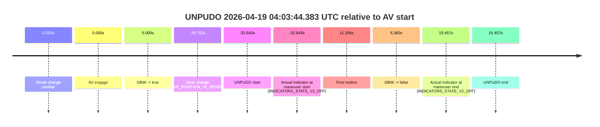
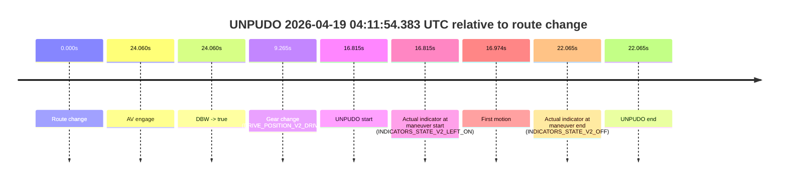

# Run Report: fme10010/2026-04-19--03-50-32--gen2-av-89510ba0-c0a4-4695-af1b-beca359e0ebb

| Field | Value |
|---|---|
| Run ID | `fme10010/2026-04-19--03-50-32--gen2-av-89510ba0-c0a4-4695-af1b-beca359e0ebb` |
| Date | `2026-04-19` |
| Model(s) | `apricot-crocodile-uproarious` |
| Author | `guy.geva` |
| Event count | `2` |

## unpudo 2026-04-19 04:03:44.383 UTC

| Field | Value |
|---|---|
| Model | `apricot-crocodile-uproarious` |
| Author | `guy.geva` |
| Run ID | `fme10010/2026-04-19--03-50-32--gen2-av-89510ba0-c0a4-4695-af1b-beca359e0ebb` |
| Date | `2026-04-19` |
| Time (UTC) | `04:03:44.383` |
| Event type | `unpudo` |
| Disengagement type | `failed_to_unpudo` |
| Route change | `unclear` |
| Console | [run](https://console.sso.wayve.ai/run/fme10010/2026-04-19--03-50-32--gen2-av-89510ba0-c0a4-4695-af1b-beca359e0ebb?id=&time-unixus=1776571424383308) |
| Foxglove | [segment](https://app.foxglove.dev/wayve-on-prem/p/prj_0dX18KZdVHg1fmmI/view?ds=foxglove-stream&ds.deviceName=fme10010&ds.start=2026-04-19T04%3A03%3A28.233306Z&ds.end=2026-04-19T04%3A04%3A42.483300Z&layoutId=lay_0e7VD4WIKDQGU73Y&time=2026-04-19T04%3A03%3A44.383308Z) |

### Event card: fail

- Fail: AV owns part of the segment, but the event still resolves as a model-performance failure under the AV-only scoring rule.

| Event | Time (UTC) | Delta from AV start |
|---|---:|---:|
| Route change unclear | 2026-04-19 04:04:17.026 | `0.000s` |
| AV engage | 2026-04-19 04:04:17.026 | `0.000s` |
| DBW -> true | 2026-04-19 04:04:17.026 | `0.000s` |
| Gear change (DRIVE_POSITION_V2_REVERSE) | 2026-04-19 04:03:38.233 | `-38.793s` |
| UNPUDO start | 2026-04-19 04:03:44.383 | `-32.643s` |
| Actual indicator at maneuver start (INDICATORS_STATE_V2_OFF) | 2026-04-19 04:03:44.383 | `-32.643s` |
| First motion | 2026-04-19 04:04:28.282 | `11.256s` |
| DBW -> false | 2026-04-19 04:04:23.386 | `6.360s` |
| Actual indicator at maneuver end (INDICATORS_STATE_V2_OFF) | 2026-04-19 04:04:32.483 | `15.457s` |
| UNPUDO end | 2026-04-19 04:04:32.483 | `15.457s` |

| Metric | Value |
|---|---|
| Outcome | `fail` |
| Effective failure type | `failed_to_unpudo` |
| Route change status | `unclear` |
| DBW at event start | `false` |
| DBW at event end | `false` |
| Predicted gear at AV start | `DRIVE_POSITION_V2_DRIVE` |
| Actual gear at AV start | `DRIVE_POSITION_V2_PARK` |
| Predicted gear at event start | `DRIVE_POSITION_V2_REVERSE` |
| Actual gear at event start | `DRIVE_POSITION_V2_REVERSE` |
| Planned indicator direction | `INDICATORS_STATE_V2_OFF` |
| Controller indicator direction | `INDICATORS_STATE_V2_OFF` |
| Actual indicator direction | `INDICATORS_STATE_V2_OFF` |
| Actual indicator at maneuver end | `INDICATORS_STATE_V2_OFF` |
| Driver accel help in AV | `false` |
| Driver accel help timestamp | `n/a` |
| Max accel pedal pct in AV | `0.0%` |
| Max brake pedal pct in AV | `9.2%` |
| Max speed mps in AV | `0.000` |
| Route -> AV | `n/a` |
| AV -> event start | `-32.643s` |
| AV -> first motion | `11.256s` |
| AV duration before disengagement | `6.360s` |
| Trajectory waypoint count | `36` |
| Driving-plan step count | `11` |

The scored portion starts from the AV-owned window, not from the pre-AV setup. Route-change search in the stopped pre-event segment was `unclear`, with the baseline therefore set to AV start. At the event anchor the model predicts `DRIVE_POSITION_V2_REVERSE` and the actual gear is `DRIVE_POSITION_V2_REVERSE`. The effective model outcome is `fail` because `failed_to_unpudo`.

### Resolution

| Field | Value |
|---|---|
| Final outcome | `fail` |
| Do we agree with this label? | `yes` |
| Source disengagement type | `failed_to_unpudo` |
| Resolved effective failure type | `failed_to_unpudo` |
| Confidence | `medium` |

## unpudo 2026-04-19 04:11:54.383 UTC

| Field | Value |
|---|---|
| Model | `apricot-crocodile-uproarious` |
| Author | `guy.geva` |
| Run ID | `fme10010/2026-04-19--03-50-32--gen2-av-89510ba0-c0a4-4695-af1b-beca359e0ebb` |
| Date | `2026-04-19` |
| Time (UTC) | `04:11:54.383` |
| Event type | `unpudo` |
| Disengagement type | `failed_to_unpudo` |
| Route change | `found` |
| Console | [run](https://console.sso.wayve.ai/run/fme10010/2026-04-19--03-50-32--gen2-av-89510ba0-c0a4-4695-af1b-beca359e0ebb?id=&time-unixus=1776571914383301) |
| Foxglove | [segment](https://app.foxglove.dev/wayve-on-prem/p/prj_0dX18KZdVHg1fmmI/view?ds=foxglove-stream&ds.deviceName=fme10010&ds.start=2026-04-19T04%3A11%3A27.568216Z&ds.end=2026-04-19T04%3A12%3A09.633299Z&layoutId=lay_0e7VD4WIKDQGU73Y&time=2026-04-19T04%3A11%3A54.383301Z) |

### Event card: non-av

- Non-AV: there is no AV-owned portion anywhere inside the detected unpudo timeline, so it is kept for coverage but excluded from model success / failure scoring.

| Event | Time (UTC) | Delta from route change |
|---|---:|---:|
| Route change | 2026-04-19 04:11:37.568 | `0.000s` |
| AV engage | 2026-04-19 04:12:01.627 | `24.060s` |
| DBW -> true | 2026-04-19 04:12:01.627 | `24.060s` |
| Gear change (DRIVE_POSITION_V2_DRIVE) | 2026-04-19 04:11:46.833 | `9.265s` |
| UNPUDO start | 2026-04-19 04:11:54.383 | `16.815s` |
| Actual indicator at maneuver start (INDICATORS_STATE_V2_LEFT_ON) | 2026-04-19 04:11:54.383 | `16.815s` |
| First motion | 2026-04-19 04:11:54.542 | `16.974s` |
| Actual indicator at maneuver end (INDICATORS_STATE_V2_OFF) | 2026-04-19 04:11:59.633 | `22.065s` |
| UNPUDO end | 2026-04-19 04:11:59.633 | `22.065s` |

| Metric | Value |
|---|---|
| Outcome | `non-av` |
| Effective failure type | `none` |
| Route change status | `found` |
| DBW at event start | `false` |
| DBW at event end | `false` |
| Predicted gear at AV start | `DRIVE_POSITION_V2_DRIVE` |
| Actual gear at AV start | `DRIVE_POSITION_V2_DRIVE` |
| Predicted gear at event start | `DRIVE_POSITION_V2_DRIVE` |
| Actual gear at event start | `DRIVE_POSITION_V2_DRIVE` |
| Planned indicator direction | `INDICATORS_STATE_V2_LEFT_ON` |
| Controller indicator direction | `INDICATORS_STATE_V2_LEFT_ON` |
| Actual indicator direction | `INDICATORS_STATE_V2_LEFT_ON` |
| Actual indicator at maneuver end | `INDICATORS_STATE_V2_OFF` |
| Driver accel help in AV | `false` |
| Driver accel help timestamp | `n/a` |
| Max accel pedal pct in AV | `0.0%` |
| Max brake pedal pct in AV | `0.0%` |
| Max speed mps in AV | `0.000` |
| Route -> AV | `24.060s` |
| AV -> event start | `-7.245s` |
| AV -> first motion | `-7.086s` |
| AV duration before disengagement | `n/a` |
| Trajectory waypoint count | `36` |
| Driving-plan step count | `11` |

The scored portion starts from the AV-owned window, not from the pre-AV setup. Route-change search in the stopped pre-event segment was `found`, with the baseline therefore set to route change. At the event anchor the model predicts `DRIVE_POSITION_V2_DRIVE` and the actual gear is `DRIVE_POSITION_V2_DRIVE`. The effective model outcome is `non-av` because `there is no AV-owned overlap inside the event timeline`.

### Resolution

| Field | Value |
|---|---|
| Final outcome | `non-av` |
| Do we agree with this label? | `yes` |
| Source disengagement type | `failed_to_unpudo` |
| Resolved effective failure type | `none` |
| Confidence | `high` |
