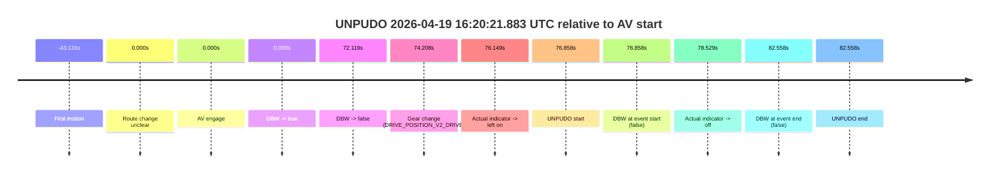
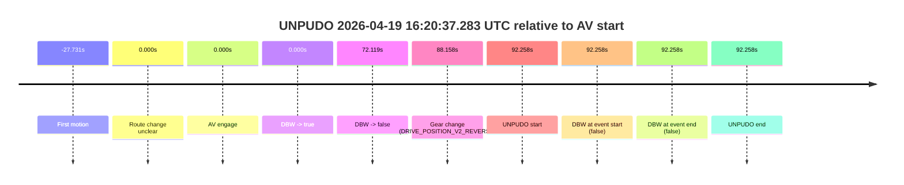
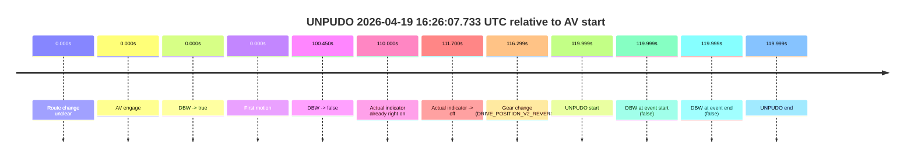
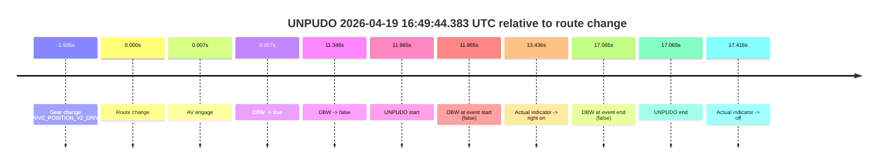
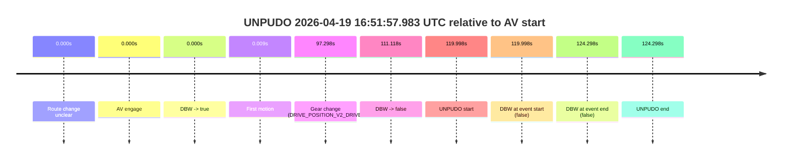
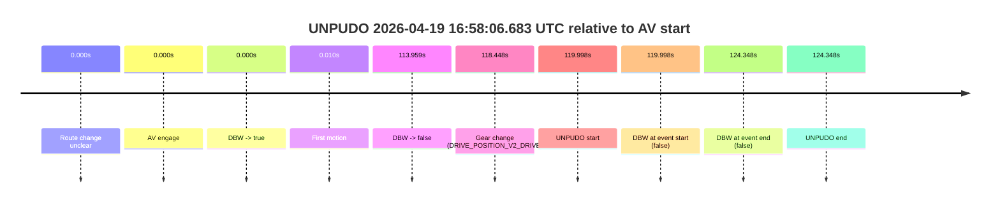

# Run Report: fme10010/2026-04-19--15-59-19--gen2-av-2bf37b53-8628-4edc-b973-f2233dbd6506

| Field | Value |
|---|---|
| Run ID | `fme10010/2026-04-19--15-59-19--gen2-av-2bf37b53-8628-4edc-b973-f2233dbd6506` |
| Date | `2026-04-19` |
| Model(s) | `armadillo-amethyst-squeaky` |
| Author | `guy.geva` |
| Event count | `7` |

## unpudo 2026-04-19 16:20:21.883 UTC

| Field | Value |
|---|---|
| Model | `armadillo-amethyst-squeaky` |
| Author | `guy.geva` |
| Run ID | `fme10010/2026-04-19--15-59-19--gen2-av-2bf37b53-8628-4edc-b973-f2233dbd6506` |
| Date | `2026-04-19` |
| Time (UTC) | `16:20:21.883` |
| Event type | `unpudo` |
| Disengagement type | `failed_to_pudo` |
| Route change | `unclear` |
| Console | [run](https://console.sso.wayve.ai/run/fme10010/2026-04-19--15-59-19--gen2-av-2bf37b53-8628-4edc-b973-f2233dbd6506?id=&time-unixus=1776615621883319) |
| Foxglove | [segment](https://app.foxglove.dev/wayve-on-prem/p/prj_0dX18KZdVHg1fmmI/view?ds=foxglove-stream&ds.deviceName=fme10010&ds.start=2026-04-19T16%3A18%3A55.025294Z&ds.end=2026-04-19T16%3A20%3A37.583314Z&layoutId=lay_0e7VD4WIKDQGU73Y&time=2026-04-19T16%3A20%3A21.883319Z) |

### Event card: fail

- Fail: AV owns part of the segment, but the event still resolves as a model-performance failure under the AV-only scoring rule.

| Event | Time (UTC) | Delta from AV start |
|---|---:|---:|
| First motion | 2026-04-19 16:18:21.894 | `-43.131s` |
| Route change unclear | 2026-04-19 16:19:05.025 | `0.000s` |
| AV engage | 2026-04-19 16:19:05.025 | `0.000s` |
| DBW -> true | 2026-04-19 16:19:05.025 | `0.000s` |
| DBW -> false | 2026-04-19 16:20:17.144 | `72.119s` |
| Gear change (DRIVE_POSITION_V2_DRIVE) | 2026-04-19 16:20:19.233 | `74.208s` |
| Actual indicator -> left on | 2026-04-19 16:20:21.174 | `76.149s` |
| UNPUDO start | 2026-04-19 16:20:21.883 | `76.858s` |
| DBW at event start (false) | 2026-04-19 16:20:21.883 | `76.858s` |
| Actual indicator -> off | 2026-04-19 16:20:23.554 | `78.529s` |
| DBW at event end (false) | 2026-04-19 16:20:27.583 | `82.558s` |
| UNPUDO end | 2026-04-19 16:20:27.583 | `82.558s` |

| Metric | Value |
|---|---|
| Outcome | `fail` |
| Effective failure type | `failed_to_pudo` |
| Route change status | `unclear` |
| DBW at event start | `false` |
| DBW at event end | `false` |
| Predicted gear at AV start | `DRIVE_POSITION_V2_DRIVE` |
| Actual gear at AV start | `DRIVE_POSITION_V2_DRIVE` |
| Predicted gear at event start | `DRIVE_POSITION_V2_DRIVE` |
| Actual gear at event start | `DRIVE_POSITION_V2_DRIVE` |
| Planned indicator direction | `INDICATORS_STATE_V2_OFF` |
| Controller indicator direction | `INDICATORS_STATE_V2_OFF` |
| Actual indicator direction | `INDICATORS_STATE_V2_LEFT_ON` |
| Actual indicator at maneuver end | `INDICATORS_STATE_V2_OFF` |
| Driver accel help in AV | `false` |
| Driver accel help timestamp | `n/a` |
| Max accel pedal pct in AV | `0.0%` |
| Max brake pedal pct in AV | `14.3%` |
| Max speed mps in AV | `10.481` |
| Success timing baseline | `AV start` |
| Route -> AV | `n/a` |
| AV -> event start | `76.858s` |
| AV -> first motion | `-43.131s` |
| Success baseline -> event start | `76.858s` |
| Success baseline -> first motion | `-43.131s` |
| AV duration before disengagement | `72.119s` |
| Trajectory waypoint count | `37` |
| Driving-plan step count | `11` |

The scored portion starts from the AV-owned window, not from the pre-AV setup. Route-change search in the stopped pre-event segment was `unclear`, with the baseline therefore set to AV start. At the event anchor the model predicts `DRIVE_POSITION_V2_DRIVE` and the actual gear is `DRIVE_POSITION_V2_DRIVE`. The effective model outcome is `fail` because `failed_to_pudo.`

### Resolution

| Field | Value |
|---|---|
| Final outcome | `fail` |
| Do we agree with this label? | `yes` |
| Source disengagement type | `failed_to_pudo` |
| Resolved effective failure type | `failed_to_pudo` |
| Confidence | `medium` |

## unpudo 2026-04-19 16:20:37.283 UTC

| Field | Value |
|---|---|
| Model | `armadillo-amethyst-squeaky` |
| Author | `guy.geva` |
| Run ID | `fme10010/2026-04-19--15-59-19--gen2-av-2bf37b53-8628-4edc-b973-f2233dbd6506` |
| Date | `2026-04-19` |
| Time (UTC) | `16:20:37.283` |
| Event type | `unpudo` |
| Disengagement type | `none observed` |
| Route change | `unclear` |
| Console | [run](https://console.sso.wayve.ai/run/fme10010/2026-04-19--15-59-19--gen2-av-2bf37b53-8628-4edc-b973-f2233dbd6506?id=&time-unixus=1776615637283293) |
| Foxglove | [segment](https://app.foxglove.dev/wayve-on-prem/p/prj_0dX18KZdVHg1fmmI/view?ds=foxglove-stream&ds.deviceName=fme10010&ds.start=2026-04-19T16%3A18%3A55.025294Z&ds.end=2026-04-19T16%3A20%3A47.283293Z&layoutId=lay_0e7VD4WIKDQGU73Y&time=2026-04-19T16%3A20%3A37.283293Z) |

### Event card: fail

- Fail: the credited unpudo does not stay AV-owned. The event window starts with DBW false, and the maneuver outcome lands outside a clean AV-owned segment.

| Event | Time (UTC) | Delta from AV start |
|---|---:|---:|
| First motion | 2026-04-19 16:18:37.294 | `-27.731s` |
| Route change unclear | 2026-04-19 16:19:05.025 | `0.000s` |
| AV engage | 2026-04-19 16:19:05.025 | `0.000s` |
| DBW -> true | 2026-04-19 16:19:05.025 | `0.000s` |
| DBW -> false | 2026-04-19 16:20:17.144 | `72.119s` |
| Gear change (DRIVE_POSITION_V2_REVERSE) | 2026-04-19 16:20:33.183 | `88.158s` |
| UNPUDO start | 2026-04-19 16:20:37.283 | `92.258s` |
| DBW at event start (false) | 2026-04-19 16:20:37.283 | `92.258s` |
| DBW at event end (false) | 2026-04-19 16:20:37.283 | `92.258s` |
| UNPUDO end | 2026-04-19 16:20:37.283 | `92.258s` |

| Metric | Value |
|---|---|
| Outcome | `fail` |
| Effective failure type | `completed_outside_av` |
| Route change status | `unclear` |
| DBW at event start | `false` |
| DBW at event end | `false` |
| Predicted gear at AV start | `DRIVE_POSITION_V2_DRIVE` |
| Actual gear at AV start | `DRIVE_POSITION_V2_DRIVE` |
| Predicted gear at event start | `DRIVE_POSITION_V2_REVERSE` |
| Actual gear at event start | `DRIVE_POSITION_V2_REVERSE` |
| Planned indicator direction | `INDICATORS_STATE_V2_OFF` |
| Controller indicator direction | `INDICATORS_STATE_V2_OFF` |
| Actual indicator direction | `INDICATORS_STATE_V2_OFF` |
| Actual indicator at maneuver end | `INDICATORS_STATE_V2_OFF` |
| Driver accel help in AV | `false` |
| Driver accel help timestamp | `n/a` |
| Max accel pedal pct in AV | `0.0%` |
| Max brake pedal pct in AV | `14.3%` |
| Max speed mps in AV | `10.481` |
| Success timing baseline | `AV start` |
| Route -> AV | `n/a` |
| AV -> event start | `92.258s` |
| AV -> first motion | `-27.731s` |
| Success baseline -> event start | `92.258s` |
| Success baseline -> first motion | `-27.731s` |
| AV duration before disengagement | `72.119s` |
| Trajectory waypoint count | `37` |
| Driving-plan step count | `11` |

The scored portion starts from the AV-owned window, not from the pre-AV setup. Route-change search in the stopped pre-event segment was `unclear`, with the baseline therefore set to AV start. At the event anchor the model predicts `DRIVE_POSITION_V2_REVERSE` and the actual gear is `DRIVE_POSITION_V2_REVERSE`. The effective model outcome is `fail` because `completed_outside_av.`

### Resolution

| Field | Value |
|---|---|
| Final outcome | `fail` |
| Do we agree with this label? | `yes` |
| Source disengagement type | `none observed` |
| Resolved effective failure type | `completed_outside_av` |
| Confidence | `medium` |

## unpudo 2026-04-19 16:26:07.733 UTC

| Field | Value |
|---|---|
| Model | `armadillo-amethyst-squeaky` |
| Author | `guy.geva` |
| Run ID | `fme10010/2026-04-19--15-59-19--gen2-av-2bf37b53-8628-4edc-b973-f2233dbd6506` |
| Date | `2026-04-19` |
| Time (UTC) | `16:26:07.733` |
| Event type | `unpudo` |
| Disengagement type | `none observed` |
| Route change | `unclear` |
| Console | [run](https://console.sso.wayve.ai/run/fme10010/2026-04-19--15-59-19--gen2-av-2bf37b53-8628-4edc-b973-f2233dbd6506?id=&time-unixus=1776615967733321) |
| Foxglove | [segment](https://app.foxglove.dev/wayve-on-prem/p/prj_0dX18KZdVHg1fmmI/view?ds=foxglove-stream&ds.deviceName=fme10010&ds.start=2026-04-19T16%3A23%3A57.733967Z&ds.end=2026-04-19T16%3A26%3A17.733321Z&layoutId=lay_0e7VD4WIKDQGU73Y&time=2026-04-19T16%3A26%3A07.733321Z) |

### Event card: fail

- Fail: the credited unpudo does not stay AV-owned. The event window starts with DBW false, and the maneuver outcome lands outside a clean AV-owned segment.

| Event | Time (UTC) | Delta from AV start |
|---|---:|---:|
| Route change unclear | 2026-04-19 16:24:07.733 | `0.000s` |
| AV engage | 2026-04-19 16:24:07.733 | `0.000s` |
| DBW -> true | 2026-04-19 16:24:07.733 | `0.000s` |
| First motion | 2026-04-19 16:24:07.734 | `0.000s` |
| DBW -> false | 2026-04-19 16:25:48.184 | `100.450s` |
| Actual indicator already right on | 2026-04-19 16:25:57.734 | `110.000s` |
| Actual indicator -> off | 2026-04-19 16:25:59.434 | `111.700s` |
| Gear change (DRIVE_POSITION_V2_REVERSE) | 2026-04-19 16:26:04.033 | `116.299s` |
| UNPUDO start | 2026-04-19 16:26:07.733 | `119.999s` |
| DBW at event start (false) | 2026-04-19 16:26:07.733 | `119.999s` |
| DBW at event end (false) | 2026-04-19 16:26:07.733 | `119.999s` |
| UNPUDO end | 2026-04-19 16:26:07.733 | `119.999s` |

| Metric | Value |
|---|---|
| Outcome | `fail` |
| Effective failure type | `not_av_owned` |
| Route change status | `unclear` |
| DBW at event start | `false` |
| DBW at event end | `false` |
| Predicted gear at AV start | `DRIVE_POSITION_V2_DRIVE` |
| Actual gear at AV start | `DRIVE_POSITION_V2_DRIVE` |
| Predicted gear at event start | `DRIVE_POSITION_V2_REVERSE` |
| Actual gear at event start | `DRIVE_POSITION_V2_REVERSE` |
| Planned indicator direction | `INDICATORS_STATE_V2_OFF` |
| Controller indicator direction | `INDICATORS_STATE_V2_OFF` |
| Actual indicator direction | `INDICATORS_STATE_V2_OFF` |
| Actual indicator at maneuver end | `INDICATORS_STATE_V2_OFF` |
| Driver accel help in AV | `false` |
| Driver accel help timestamp | `n/a` |
| Max accel pedal pct in AV | `0.0%` |
| Max brake pedal pct in AV | `8.0%` |
| Max speed mps in AV | `10.736` |
| Success timing baseline | `AV start` |
| Route -> AV | `n/a` |
| AV -> event start | `119.999s` |
| AV -> first motion | `0.000s` |
| Success baseline -> event start | `119.999s` |
| Success baseline -> first motion | `0.000s` |
| AV duration before disengagement | `100.450s` |
| Trajectory waypoint count | `36` |
| Driving-plan step count | `11` |

The scored portion starts from the AV-owned window, not from the pre-AV setup. Route-change search in the stopped pre-event segment was `unclear`, with the baseline therefore set to AV start. At the event anchor the model predicts `DRIVE_POSITION_V2_REVERSE` and the actual gear is `DRIVE_POSITION_V2_REVERSE`. The effective model outcome is `fail` because `not_av_owned.`

### Resolution

| Field | Value |
|---|---|
| Final outcome | `fail` |
| Do we agree with this label? | `yes` |
| Source disengagement type | `none observed` |
| Resolved effective failure type | `not_av_owned` |
| Confidence | `medium` |

## unpudo 2026-04-19 16:38:24.883 UTC

| Field | Value |
|---|---|
| Model | `armadillo-amethyst-squeaky` |
| Author | `guy.geva` |
| Run ID | `fme10010/2026-04-19--15-59-19--gen2-av-2bf37b53-8628-4edc-b973-f2233dbd6506` |
| Date | `2026-04-19` |
| Time (UTC) | `16:38:24.883` |
| Event type | `unpudo` |
| Disengagement type | `failed_to_slow` |
| Route change | `unclear` |
| Console | [run](https://console.sso.wayve.ai/run/fme10010/2026-04-19--15-59-19--gen2-av-2bf37b53-8628-4edc-b973-f2233dbd6506?id=&time-unixus=1776616704883300) |
| Foxglove | [segment](https://app.foxglove.dev/wayve-on-prem/p/prj_0dX18KZdVHg1fmmI/view?ds=foxglove-stream&ds.deviceName=fme10010&ds.start=2026-04-19T16%3A37%3A29.785471Z&ds.end=2026-04-19T16%3A38%3A49.783310Z&layoutId=lay_0e7VD4WIKDQGU73Y&time=2026-04-19T16%3A38%3A24.883300Z) |

### Event card: fail

- Fail: AV owns part of the segment, but the event still resolves as a model-performance failure under the AV-only scoring rule.

| Event | Time (UTC) | Delta from AV start |
|---|---:|---:|
| First motion | 2026-04-19 16:36:24.894 | `-74.891s` |
| Route change unclear | 2026-04-19 16:37:39.785 | `0.000s` |
| AV engage | 2026-04-19 16:37:39.785 | `0.000s` |
| DBW -> true | 2026-04-19 16:37:39.785 | `0.000s` |
| DBW -> false | 2026-04-19 16:38:18.525 | `38.740s` |
| Gear change (DRIVE_POSITION_V2_REVERSE) | 2026-04-19 16:38:22.233 | `42.448s` |
| UNPUDO start | 2026-04-19 16:38:24.883 | `45.098s` |
| DBW at event start (false) | 2026-04-19 16:38:24.883 | `45.098s` |
| DBW at event end (false) | 2026-04-19 16:38:39.783 | `59.998s` |
| UNPUDO end | 2026-04-19 16:38:39.783 | `59.998s` |
| Actual indicator -> left on | 2026-04-19 16:38:40.274 | `60.489s` |
| Actual indicator -> off | 2026-04-19 16:38:41.994 | `62.209s` |

| Metric | Value |
|---|---|
| Outcome | `fail` |
| Effective failure type | `failed_to_slow` |
| Route change status | `unclear` |
| DBW at event start | `false` |
| DBW at event end | `false` |
| Predicted gear at AV start | `DRIVE_POSITION_V2_DRIVE` |
| Actual gear at AV start | `DRIVE_POSITION_V2_DRIVE` |
| Predicted gear at event start | `DRIVE_POSITION_V2_REVERSE` |
| Actual gear at event start | `DRIVE_POSITION_V2_REVERSE` |
| Planned indicator direction | `INDICATORS_STATE_V2_RIGHT_ON` |
| Controller indicator direction | `INDICATORS_STATE_V2_RIGHT_ON` |
| Actual indicator direction | `INDICATORS_STATE_V2_OFF` |
| Actual indicator at maneuver end | `INDICATORS_STATE_V2_OFF` |
| Driver accel help in AV | `false` |
| Driver accel help timestamp | `n/a` |
| Max accel pedal pct in AV | `0.0%` |
| Max brake pedal pct in AV | `27.2%` |
| Max speed mps in AV | `8.553` |
| Success timing baseline | `AV start` |
| Route -> AV | `n/a` |
| AV -> event start | `45.098s` |
| AV -> first motion | `-74.891s` |
| Success baseline -> event start | `45.098s` |
| Success baseline -> first motion | `-74.891s` |
| AV duration before disengagement | `38.740s` |
| Trajectory waypoint count | `37` |
| Driving-plan step count | `11` |

The scored portion starts from the AV-owned window, not from the pre-AV setup. Route-change search in the stopped pre-event segment was `unclear`, with the baseline therefore set to AV start. At the event anchor the model predicts `DRIVE_POSITION_V2_REVERSE` and the actual gear is `DRIVE_POSITION_V2_REVERSE`. The effective model outcome is `fail` because `failed_to_slow.`

### Resolution

| Field | Value |
|---|---|
| Final outcome | `fail` |
| Do we agree with this label? | `yes` |
| Source disengagement type | `failed_to_slow` |
| Resolved effective failure type | `failed_to_slow` |
| Confidence | `medium` |

## unpudo 2026-04-19 16:49:44.383 UTC

| Field | Value |
|---|---|
| Model | `armadillo-amethyst-squeaky` |
| Author | `guy.geva` |
| Run ID | `fme10010/2026-04-19--15-59-19--gen2-av-2bf37b53-8628-4edc-b973-f2233dbd6506` |
| Date | `2026-04-19` |
| Time (UTC) | `16:49:44.383` |
| Event type | `unpudo` |
| Disengagement type | `failed_to_accelerate` |
| Route change | `found` |
| Console | [run](https://console.sso.wayve.ai/run/fme10010/2026-04-19--15-59-19--gen2-av-2bf37b53-8628-4edc-b973-f2233dbd6506?id=&time-unixus=1776617384383315) |
| Foxglove | [segment](https://app.foxglove.dev/wayve-on-prem/p/prj_0dX18KZdVHg1fmmI/view?ds=foxglove-stream&ds.deviceName=fme10010&ds.start=2026-04-19T16%3A49%3A20.483294Z&ds.end=2026-04-19T16%3A49%3A59.483301Z&layoutId=lay_0e7VD4WIKDQGU73Y&time=2026-04-19T16%3A49%3A44.383315Z) |

### Event card: fail

- Fail: AV owns part of the segment, but the event still resolves as a model-performance failure under the AV-only scoring rule.

| Event | Time (UTC) | Delta from route change |
|---|---:|---:|
| Gear change (DRIVE_POSITION_V2_DRIVE) | 2026-04-19 16:49:30.483 | `-1.935s` |
| Route change | 2026-04-19 16:49:32.418 | `0.000s` |
| AV engage | 2026-04-19 16:49:32.425 | `0.007s` |
| DBW -> true | 2026-04-19 16:49:32.425 | `0.007s` |
| DBW -> false | 2026-04-19 16:49:43.764 | `11.346s` |
| UNPUDO start | 2026-04-19 16:49:44.383 | `11.965s` |
| DBW at event start (false) | 2026-04-19 16:49:44.383 | `11.965s` |
| Actual indicator -> right on | 2026-04-19 16:49:45.854 | `13.436s` |
| DBW at event end (false) | 2026-04-19 16:49:49.483 | `17.065s` |
| UNPUDO end | 2026-04-19 16:49:49.483 | `17.065s` |
| Actual indicator -> off | 2026-04-19 16:49:49.834 | `17.416s` |

| Metric | Value |
|---|---|
| Outcome | `fail` |
| Effective failure type | `failed_to_accelerate` |
| Route change status | `found` |
| DBW at event start | `false` |
| DBW at event end | `false` |
| Predicted gear at AV start | `DRIVE_POSITION_V2_DRIVE` |
| Actual gear at AV start | `DRIVE_POSITION_V2_DRIVE` |
| Predicted gear at event start | `DRIVE_POSITION_V2_DRIVE` |
| Actual gear at event start | `DRIVE_POSITION_V2_DRIVE` |
| Planned indicator direction | `INDICATORS_STATE_V2_RIGHT_ON` |
| Controller indicator direction | `INDICATORS_STATE_V2_RIGHT_ON` |
| Actual indicator direction | `INDICATORS_STATE_V2_OFF` |
| Actual indicator at maneuver end | `INDICATORS_STATE_V2_RIGHT_ON` |
| Driver accel help in AV | `false` |
| Driver accel help timestamp | `n/a` |
| Max accel pedal pct in AV | `0.0%` |
| Max brake pedal pct in AV | `25.1%` |
| Max speed mps in AV | `0.000` |
| Success timing baseline | `route change` |
| Route -> AV | `0.007s` |
| AV -> event start | `11.958s` |
| AV -> first motion | `n/a` |
| Success baseline -> event start | `11.965s` |
| Success baseline -> first motion | `n/a` |
| AV duration before disengagement | `11.339s` |
| Trajectory waypoint count | `37` |
| Driving-plan step count | `11` |

The scored portion starts from the AV-owned window, not from the pre-AV setup. Route-change search in the stopped pre-event segment was `found`, with the baseline therefore set to route change. At the event anchor the model predicts `DRIVE_POSITION_V2_DRIVE` and the actual gear is `DRIVE_POSITION_V2_DRIVE`. The effective model outcome is `fail` because `failed_to_accelerate.`

### Resolution

| Field | Value |
|---|---|
| Final outcome | `fail` |
| Do we agree with this label? | `yes` |
| Source disengagement type | `failed_to_accelerate` |
| Resolved effective failure type | `failed_to_accelerate` |
| Confidence | `high` |

## unpudo 2026-04-19 16:51:57.983 UTC

| Field | Value |
|---|---|
| Model | `armadillo-amethyst-squeaky` |
| Author | `guy.geva` |
| Run ID | `fme10010/2026-04-19--15-59-19--gen2-av-2bf37b53-8628-4edc-b973-f2233dbd6506` |
| Date | `2026-04-19` |
| Time (UTC) | `16:51:57.983` |
| Event type | `unpudo` |
| Disengagement type | `failed_to_pudo` |
| Route change | `unclear` |
| Console | [run](https://console.sso.wayve.ai/run/fme10010/2026-04-19--15-59-19--gen2-av-2bf37b53-8628-4edc-b973-f2233dbd6506?id=&time-unixus=1776617517983298) |
| Foxglove | [segment](https://app.foxglove.dev/wayve-on-prem/p/prj_0dX18KZdVHg1fmmI/view?ds=foxglove-stream&ds.deviceName=fme10010&ds.start=2026-04-19T16%3A49%3A47.985245Z&ds.end=2026-04-19T16%3A52%3A12.283301Z&layoutId=lay_0e7VD4WIKDQGU73Y&time=2026-04-19T16%3A51%3A57.983298Z) |

### Event card: fail

- Fail: AV owns part of the segment, but the event still resolves as a model-performance failure under the AV-only scoring rule.

| Event | Time (UTC) | Delta from AV start |
|---|---:|---:|
| Route change unclear | 2026-04-19 16:49:57.985 | `0.000s` |
| AV engage | 2026-04-19 16:49:57.985 | `0.000s` |
| DBW -> true | 2026-04-19 16:49:57.985 | `0.000s` |
| First motion | 2026-04-19 16:49:57.994 | `0.009s` |
| Gear change (DRIVE_POSITION_V2_DRIVE) | 2026-04-19 16:51:35.283 | `97.298s` |
| DBW -> false | 2026-04-19 16:51:49.103 | `111.118s` |
| UNPUDO start | 2026-04-19 16:51:57.983 | `119.998s` |
| DBW at event start (false) | 2026-04-19 16:51:57.983 | `119.998s` |
| DBW at event end (false) | 2026-04-19 16:52:02.283 | `124.298s` |
| UNPUDO end | 2026-04-19 16:52:02.283 | `124.298s` |

| Metric | Value |
|---|---|
| Outcome | `fail` |
| Effective failure type | `failed_to_pudo` |
| Route change status | `unclear` |
| DBW at event start | `false` |
| DBW at event end | `false` |
| Predicted gear at AV start | `DRIVE_POSITION_V2_DRIVE` |
| Actual gear at AV start | `DRIVE_POSITION_V2_DRIVE` |
| Predicted gear at event start | `DRIVE_POSITION_V2_DRIVE` |
| Actual gear at event start | `DRIVE_POSITION_V2_DRIVE` |
| Planned indicator direction | `INDICATORS_STATE_V2_OFF` |
| Controller indicator direction | `INDICATORS_STATE_V2_OFF` |
| Actual indicator direction | `INDICATORS_STATE_V2_OFF` |
| Actual indicator at maneuver end | `INDICATORS_STATE_V2_OFF` |
| Driver accel help in AV | `false` |
| Driver accel help timestamp | `n/a` |
| Max accel pedal pct in AV | `0.0%` |
| Max brake pedal pct in AV | `29.8%` |
| Max speed mps in AV | `7.617` |
| Success timing baseline | `AV start` |
| Route -> AV | `n/a` |
| AV -> event start | `119.998s` |
| AV -> first motion | `0.009s` |
| Success baseline -> event start | `119.998s` |
| Success baseline -> first motion | `0.009s` |
| AV duration before disengagement | `111.118s` |
| Trajectory waypoint count | `37` |
| Driving-plan step count | `11` |

The scored portion starts from the AV-owned window, not from the pre-AV setup. Route-change search in the stopped pre-event segment was `unclear`, with the baseline therefore set to AV start. At the event anchor the model predicts `DRIVE_POSITION_V2_DRIVE` and the actual gear is `DRIVE_POSITION_V2_DRIVE`. The effective model outcome is `fail` because `failed_to_pudo.`

### Resolution

| Field | Value |
|---|---|
| Final outcome | `fail` |
| Do we agree with this label? | `yes` |
| Source disengagement type | `failed_to_pudo` |
| Resolved effective failure type | `failed_to_pudo` |
| Confidence | `medium` |

## unpudo 2026-04-19 16:58:06.683 UTC

| Field | Value |
|---|---|
| Model | `armadillo-amethyst-squeaky` |
| Author | `guy.geva` |
| Run ID | `fme10010/2026-04-19--15-59-19--gen2-av-2bf37b53-8628-4edc-b973-f2233dbd6506` |
| Date | `2026-04-19` |
| Time (UTC) | `16:58:06.683` |
| Event type | `unpudo` |
| Disengagement type | `failed_to_pudo` |
| Route change | `unclear` |
| Console | [run](https://console.sso.wayve.ai/run/fme10010/2026-04-19--15-59-19--gen2-av-2bf37b53-8628-4edc-b973-f2233dbd6506?id=&time-unixus=1776617886683309) |
| Foxglove | [segment](https://app.foxglove.dev/wayve-on-prem/p/prj_0dX18KZdVHg1fmmI/view?ds=foxglove-stream&ds.deviceName=fme10010&ds.start=2026-04-19T16%3A55%3A56.685338Z&ds.end=2026-04-19T16%3A58%3A21.033318Z&layoutId=lay_0e7VD4WIKDQGU73Y&time=2026-04-19T16%3A58%3A06.683309Z) |

### Event card: fail

- Fail: AV owns part of the segment, but the event still resolves as a model-performance failure under the AV-only scoring rule.

| Event | Time (UTC) | Delta from AV start |
|---|---:|---:|
| Route change unclear | 2026-04-19 16:56:06.685 | `0.000s` |
| AV engage | 2026-04-19 16:56:06.685 | `0.000s` |
| DBW -> true | 2026-04-19 16:56:06.685 | `0.000s` |
| First motion | 2026-04-19 16:56:06.694 | `0.010s` |
| DBW -> false | 2026-04-19 16:58:00.644 | `113.959s` |
| Gear change (DRIVE_POSITION_V2_DRIVE) | 2026-04-19 16:58:05.133 | `118.448s` |
| UNPUDO start | 2026-04-19 16:58:06.683 | `119.998s` |
| DBW at event start (false) | 2026-04-19 16:58:06.683 | `119.998s` |
| DBW at event end (false) | 2026-04-19 16:58:11.033 | `124.348s` |
| UNPUDO end | 2026-04-19 16:58:11.033 | `124.348s` |

| Metric | Value |
|---|---|
| Outcome | `fail` |
| Effective failure type | `failed_to_pudo` |
| Route change status | `unclear` |
| DBW at event start | `false` |
| DBW at event end | `false` |
| Predicted gear at AV start | `DRIVE_POSITION_V2_DRIVE` |
| Actual gear at AV start | `DRIVE_POSITION_V2_DRIVE` |
| Predicted gear at event start | `DRIVE_POSITION_V2_DRIVE` |
| Actual gear at event start | `DRIVE_POSITION_V2_DRIVE` |
| Planned indicator direction | `INDICATORS_STATE_V2_OFF` |
| Controller indicator direction | `INDICATORS_STATE_V2_OFF` |
| Actual indicator direction | `INDICATORS_STATE_V2_OFF` |
| Actual indicator at maneuver end | `INDICATORS_STATE_V2_OFF` |
| Driver accel help in AV | `false` |
| Driver accel help timestamp | `n/a` |
| Max accel pedal pct in AV | `0.0%` |
| Max brake pedal pct in AV | `28.9%` |
| Max speed mps in AV | `10.275` |
| Success timing baseline | `AV start` |
| Route -> AV | `n/a` |
| AV -> event start | `119.998s` |
| AV -> first motion | `0.010s` |
| Success baseline -> event start | `119.998s` |
| Success baseline -> first motion | `0.010s` |
| AV duration before disengagement | `113.959s` |
| Trajectory waypoint count | `37` |
| Driving-plan step count | `11` |

The scored portion starts from the AV-owned window, not from the pre-AV setup. Route-change search in the stopped pre-event segment was `unclear`, with the baseline therefore set to AV start. At the event anchor the model predicts `DRIVE_POSITION_V2_DRIVE` and the actual gear is `DRIVE_POSITION_V2_DRIVE`. The effective model outcome is `fail` because `failed_to_pudo.`

### Resolution

| Field | Value |
|---|---|
| Final outcome | `fail` |
| Do we agree with this label? | `yes` |
| Source disengagement type | `failed_to_pudo` |
| Resolved effective failure type | `failed_to_pudo` |
| Confidence | `medium` |
