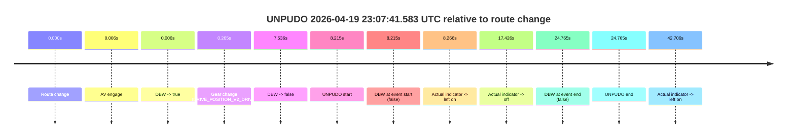
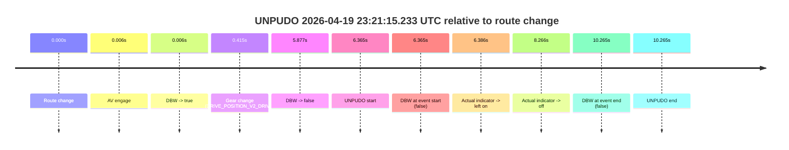
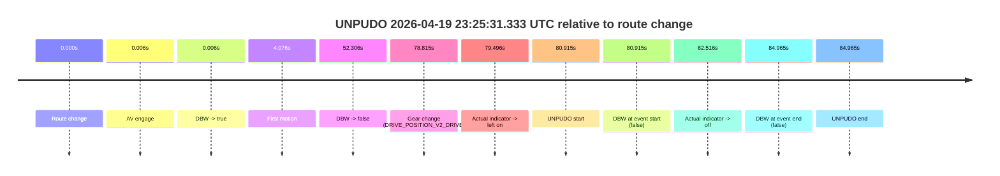
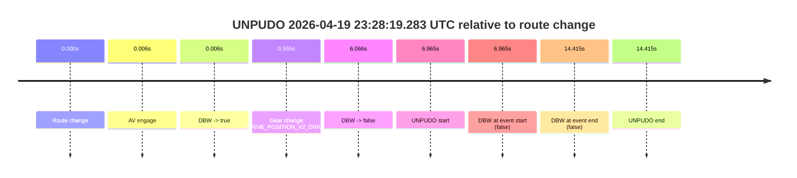

# Run Report: fme10010/2026-04-19--22-15-30--gen2-av-52474f6b-1c35-416a-9e0b-92a2895e364b

| Field | Value |
|---|---|
| Run ID | `fme10010/2026-04-19--22-15-30--gen2-av-52474f6b-1c35-416a-9e0b-92a2895e364b` |
| Date | `2026-04-19` |
| Model(s) | `pink-manta-ray-smooth` |
| Author | `guy.geva` |
| Event count | `4` |

## unpudo 2026-04-19 23:07:41.583 UTC

| Field | Value |
|---|---|
| Model | `pink-manta-ray-smooth` |
| Author | `guy.geva` |
| Run ID | `fme10010/2026-04-19--22-15-30--gen2-av-52474f6b-1c35-416a-9e0b-92a2895e364b` |
| Date | `2026-04-19` |
| Time (UTC) | `23:07:41.583` |
| Event type | `unpudo` |
| Disengagement type | `failed_to_unpudo` |
| Route change | `found` |
| Console | [run](https://console.sso.wayve.ai/run/fme10010/2026-04-19--22-15-30--gen2-av-52474f6b-1c35-416a-9e0b-92a2895e364b?id=&time-unixus=1776640061583318) |
| Foxglove | [segment](https://app.foxglove.dev/wayve-on-prem/p/prj_0dX18KZdVHg1fmmI/view?ds=foxglove-stream&ds.deviceName=fme10010&ds.start=2026-04-19T23%3A07%3A23.368262Z&ds.end=2026-04-19T23%3A08%3A08.133309Z&layoutId=lay_0e7VD4WIKDQGU73Y&time=2026-04-19T23%3A07%3A41.583318Z) |

### Event card: fail

- Fail: AV owns part of the segment, but the event still resolves as a model-performance failure under the AV-only scoring rule.

| Event | Time (UTC) | Delta from route change |
|---|---:|---:|
| Route change | 2026-04-19 23:07:33.368 | `0.000s` |
| AV engage | 2026-04-19 23:07:33.374 | `0.006s` |
| DBW -> true | 2026-04-19 23:07:33.374 | `0.006s` |
| Gear change (DRIVE_POSITION_V2_DRIVE) | 2026-04-19 23:07:33.633 | `0.265s` |
| DBW -> false | 2026-04-19 23:07:40.904 | `7.536s` |
| UNPUDO start | 2026-04-19 23:07:41.583 | `8.215s` |
| DBW at event start (false) | 2026-04-19 23:07:41.583 | `8.215s` |
| Actual indicator -> left on | 2026-04-19 23:07:41.634 | `8.266s` |
| Actual indicator -> off | 2026-04-19 23:07:50.794 | `17.426s` |
| DBW at event end (false) | 2026-04-19 23:07:58.133 | `24.765s` |
| UNPUDO end | 2026-04-19 23:07:58.133 | `24.765s` |
| Actual indicator -> left on | 2026-04-19 23:08:16.074 | `42.706s` |

| Metric | Value |
|---|---|
| Outcome | `fail` |
| Effective failure type | `failed_to_unpudo` |
| Route change status | `found` |
| DBW at event start | `false` |
| DBW at event end | `false` |
| Predicted gear at AV start | `DRIVE_POSITION_V2_PARK` |
| Actual gear at AV start | `DRIVE_POSITION_V2_PARK` |
| Predicted gear at event start | `DRIVE_POSITION_V2_DRIVE` |
| Actual gear at event start | `DRIVE_POSITION_V2_DRIVE` |
| Planned indicator direction | `INDICATORS_STATE_V2_OFF` |
| Controller indicator direction | `INDICATORS_STATE_V2_OFF` |
| Actual indicator direction | `INDICATORS_STATE_V2_OFF` |
| Actual indicator at maneuver end | `INDICATORS_STATE_V2_OFF` |
| Driver accel help in AV | `false` |
| Driver accel help timestamp | `n/a` |
| Max accel pedal pct in AV | `0.0%` |
| Max brake pedal pct in AV | `8.0%` |
| Max speed mps in AV | `0.000` |
| Success timing baseline | `route change` |
| Route -> AV | `0.006s` |
| AV -> event start | `8.209s` |
| AV -> first motion | `n/a` |
| Success baseline -> event start | `8.215s` |
| Success baseline -> first motion | `n/a` |
| AV duration before disengagement | `7.530s` |
| Trajectory waypoint count | `37` |
| Driving-plan step count | `11` |

The scored portion starts from the AV-owned window, not from the pre-AV setup. Route-change search in the stopped pre-event segment was `found`, with the baseline therefore set to route change. At the event anchor the model predicts `DRIVE_POSITION_V2_DRIVE` and the actual gear is `DRIVE_POSITION_V2_DRIVE`. The effective model outcome is `fail` because `failed_to_unpudo.`

### Resolution

| Field | Value |
|---|---|
| Final outcome | `fail` |
| Do we agree with this label? | `yes` |
| Source disengagement type | `failed_to_unpudo` |
| Resolved effective failure type | `failed_to_unpudo` |
| Confidence | `high` |

## unpudo 2026-04-19 23:21:15.233 UTC

| Field | Value |
|---|---|
| Model | `pink-manta-ray-smooth` |
| Author | `guy.geva` |
| Run ID | `fme10010/2026-04-19--22-15-30--gen2-av-52474f6b-1c35-416a-9e0b-92a2895e364b` |
| Date | `2026-04-19` |
| Time (UTC) | `23:21:15.233` |
| Event type | `unpudo` |
| Disengagement type | `failed_to_unpudo` |
| Route change | `found` |
| Console | [run](https://console.sso.wayve.ai/run/fme10010/2026-04-19--22-15-30--gen2-av-52474f6b-1c35-416a-9e0b-92a2895e364b?id=&time-unixus=1776640875233316) |
| Foxglove | [segment](https://app.foxglove.dev/wayve-on-prem/p/prj_0dX18KZdVHg1fmmI/view?ds=foxglove-stream&ds.deviceName=fme10010&ds.start=2026-04-19T23%3A20%3A58.868243Z&ds.end=2026-04-19T23%3A21%3A29.133295Z&layoutId=lay_0e7VD4WIKDQGU73Y&time=2026-04-19T23%3A21%3A15.233316Z) |

### Event card: fail

- Fail: AV owns part of the segment, but the event still resolves as a model-performance failure under the AV-only scoring rule.

| Event | Time (UTC) | Delta from route change |
|---|---:|---:|
| Route change | 2026-04-19 23:21:08.868 | `0.000s` |
| AV engage | 2026-04-19 23:21:08.874 | `0.006s` |
| DBW -> true | 2026-04-19 23:21:08.874 | `0.006s` |
| Gear change (DRIVE_POSITION_V2_DRIVE) | 2026-04-19 23:21:09.283 | `0.415s` |
| DBW -> false | 2026-04-19 23:21:14.745 | `5.877s` |
| UNPUDO start | 2026-04-19 23:21:15.233 | `6.365s` |
| DBW at event start (false) | 2026-04-19 23:21:15.233 | `6.365s` |
| Actual indicator -> left on | 2026-04-19 23:21:15.254 | `6.386s` |
| Actual indicator -> off | 2026-04-19 23:21:17.134 | `8.266s` |
| DBW at event end (false) | 2026-04-19 23:21:19.133 | `10.265s` |
| UNPUDO end | 2026-04-19 23:21:19.133 | `10.265s` |

| Metric | Value |
|---|---|
| Outcome | `fail` |
| Effective failure type | `failed_to_unpudo` |
| Route change status | `found` |
| DBW at event start | `false` |
| DBW at event end | `false` |
| Predicted gear at AV start | `DRIVE_POSITION_V2_PARK` |
| Actual gear at AV start | `DRIVE_POSITION_V2_PARK` |
| Predicted gear at event start | `DRIVE_POSITION_V2_DRIVE` |
| Actual gear at event start | `DRIVE_POSITION_V2_DRIVE` |
| Planned indicator direction | `INDICATORS_STATE_V2_LEFT_ON` |
| Controller indicator direction | `INDICATORS_STATE_V2_LEFT_ON` |
| Actual indicator direction | `INDICATORS_STATE_V2_OFF` |
| Actual indicator at maneuver end | `INDICATORS_STATE_V2_OFF` |
| Driver accel help in AV | `false` |
| Driver accel help timestamp | `n/a` |
| Max accel pedal pct in AV | `0.0%` |
| Max brake pedal pct in AV | `15.9%` |
| Max speed mps in AV | `0.000` |
| Success timing baseline | `route change` |
| Route -> AV | `0.006s` |
| AV -> event start | `6.359s` |
| AV -> first motion | `n/a` |
| Success baseline -> event start | `6.365s` |
| Success baseline -> first motion | `n/a` |
| AV duration before disengagement | `5.871s` |
| Trajectory waypoint count | `36` |
| Driving-plan step count | `11` |

The scored portion starts from the AV-owned window, not from the pre-AV setup. Route-change search in the stopped pre-event segment was `found`, with the baseline therefore set to route change. At the event anchor the model predicts `DRIVE_POSITION_V2_DRIVE` and the actual gear is `DRIVE_POSITION_V2_DRIVE`. The effective model outcome is `fail` because `failed_to_unpudo.`

### Resolution

| Field | Value |
|---|---|
| Final outcome | `fail` |
| Do we agree with this label? | `yes` |
| Source disengagement type | `failed_to_unpudo` |
| Resolved effective failure type | `failed_to_unpudo` |
| Confidence | `high` |

## unpudo 2026-04-19 23:25:31.333 UTC

| Field | Value |
|---|---|
| Model | `pink-manta-ray-smooth` |
| Author | `guy.geva` |
| Run ID | `fme10010/2026-04-19--22-15-30--gen2-av-52474f6b-1c35-416a-9e0b-92a2895e364b` |
| Date | `2026-04-19` |
| Time (UTC) | `23:25:31.333` |
| Event type | `unpudo` |
| Disengagement type | `none observed` |
| Route change | `found` |
| Console | [run](https://console.sso.wayve.ai/run/fme10010/2026-04-19--22-15-30--gen2-av-52474f6b-1c35-416a-9e0b-92a2895e364b?id=&time-unixus=1776641131333309) |
| Foxglove | [segment](https://app.foxglove.dev/wayve-on-prem/p/prj_0dX18KZdVHg1fmmI/view?ds=foxglove-stream&ds.deviceName=fme10010&ds.start=2026-04-19T23%3A24%3A00.418200Z&ds.end=2026-04-19T23%3A25%3A45.383319Z&layoutId=lay_0e7VD4WIKDQGU73Y&time=2026-04-19T23%3A25%3A31.333309Z) |

### Event card: fail

- Fail: the credited unpudo does not stay AV-owned. The event window starts with DBW false, and the maneuver outcome lands outside a clean AV-owned segment.

| Event | Time (UTC) | Delta from route change |
|---|---:|---:|
| Route change | 2026-04-19 23:24:10.418 | `0.000s` |
| AV engage | 2026-04-19 23:24:10.424 | `0.006s` |
| DBW -> true | 2026-04-19 23:24:10.424 | `0.006s` |
| First motion | 2026-04-19 23:24:14.494 | `4.076s` |
| DBW -> false | 2026-04-19 23:25:02.724 | `52.306s` |
| Gear change (DRIVE_POSITION_V2_DRIVE) | 2026-04-19 23:25:29.233 | `78.815s` |
| Actual indicator -> left on | 2026-04-19 23:25:29.914 | `79.496s` |
| UNPUDO start | 2026-04-19 23:25:31.333 | `80.915s` |
| DBW at event start (false) | 2026-04-19 23:25:31.333 | `80.915s` |
| Actual indicator -> off | 2026-04-19 23:25:32.934 | `82.516s` |
| DBW at event end (false) | 2026-04-19 23:25:35.383 | `84.965s` |
| UNPUDO end | 2026-04-19 23:25:35.383 | `84.965s` |

| Metric | Value |
|---|---|
| Outcome | `fail` |
| Effective failure type | `not_av_owned` |
| Route change status | `found` |
| DBW at event start | `false` |
| DBW at event end | `false` |
| Predicted gear at AV start | `DRIVE_POSITION_V2_PARK` |
| Actual gear at AV start | `DRIVE_POSITION_V2_PARK` |
| Predicted gear at event start | `DRIVE_POSITION_V2_DRIVE` |
| Actual gear at event start | `DRIVE_POSITION_V2_DRIVE` |
| Planned indicator direction | `INDICATORS_STATE_V2_LEFT_ON` |
| Controller indicator direction | `INDICATORS_STATE_V2_LEFT_ON` |
| Actual indicator direction | `INDICATORS_STATE_V2_LEFT_ON` |
| Actual indicator at maneuver end | `INDICATORS_STATE_V2_OFF` |
| Driver accel help in AV | `false` |
| Driver accel help timestamp | `n/a` |
| Max accel pedal pct in AV | `0.0%` |
| Max brake pedal pct in AV | `30.0%` |
| Max speed mps in AV | `10.247` |
| Success timing baseline | `route change` |
| Route -> AV | `0.006s` |
| AV -> event start | `80.909s` |
| AV -> first motion | `4.070s` |
| Success baseline -> event start | `80.915s` |
| Success baseline -> first motion | `4.076s` |
| AV duration before disengagement | `52.300s` |
| Trajectory waypoint count | `36` |
| Driving-plan step count | `11` |

The scored portion starts from the AV-owned window, not from the pre-AV setup. Route-change search in the stopped pre-event segment was `found`, with the baseline therefore set to route change. At the event anchor the model predicts `DRIVE_POSITION_V2_DRIVE` and the actual gear is `DRIVE_POSITION_V2_DRIVE`. The effective model outcome is `fail` because `not_av_owned.`

### Resolution

| Field | Value |
|---|---|
| Final outcome | `fail` |
| Do we agree with this label? | `yes` |
| Source disengagement type | `none observed` |
| Resolved effective failure type | `not_av_owned` |
| Confidence | `high` |

## unpudo 2026-04-19 23:28:19.283 UTC

| Field | Value |
|---|---|
| Model | `pink-manta-ray-smooth` |
| Author | `guy.geva` |
| Run ID | `fme10010/2026-04-19--22-15-30--gen2-av-52474f6b-1c35-416a-9e0b-92a2895e364b` |
| Date | `2026-04-19` |
| Time (UTC) | `23:28:19.283` |
| Event type | `unpudo` |
| Disengagement type | `failed_to_unpudo` |
| Route change | `found` |
| Console | [run](https://console.sso.wayve.ai/run/fme10010/2026-04-19--22-15-30--gen2-av-52474f6b-1c35-416a-9e0b-92a2895e364b?id=&time-unixus=1776641299283306) |
| Foxglove | [segment](https://app.foxglove.dev/wayve-on-prem/p/prj_0dX18KZdVHg1fmmI/view?ds=foxglove-stream&ds.deviceName=fme10010&ds.start=2026-04-19T23%3A28%3A02.318281Z&ds.end=2026-04-19T23%3A28%3A36.733314Z&layoutId=lay_0e7VD4WIKDQGU73Y&time=2026-04-19T23%3A28%3A19.283306Z) |

### Event card: fail

- Fail: AV owns part of the segment, but the event still resolves as a model-performance failure under the AV-only scoring rule.

| Event | Time (UTC) | Delta from route change |
|---|---:|---:|
| Route change | 2026-04-19 23:28:12.318 | `0.000s` |
| AV engage | 2026-04-19 23:28:12.324 | `0.006s` |
| DBW -> true | 2026-04-19 23:28:12.324 | `0.006s` |
| Gear change (DRIVE_POSITION_V2_DRIVE) | 2026-04-19 23:28:12.683 | `0.365s` |
| DBW -> false | 2026-04-19 23:28:18.384 | `6.066s` |
| UNPUDO start | 2026-04-19 23:28:19.283 | `6.965s` |
| DBW at event start (false) | 2026-04-19 23:28:19.283 | `6.965s` |
| DBW at event end (false) | 2026-04-19 23:28:26.733 | `14.415s` |
| UNPUDO end | 2026-04-19 23:28:26.733 | `14.415s` |

| Metric | Value |
|---|---|
| Outcome | `fail` |
| Effective failure type | `failed_to_unpudo` |
| Route change status | `found` |
| DBW at event start | `false` |
| DBW at event end | `false` |
| Predicted gear at AV start | `DRIVE_POSITION_V2_PARK` |
| Actual gear at AV start | `DRIVE_POSITION_V2_PARK` |
| Predicted gear at event start | `DRIVE_POSITION_V2_DRIVE` |
| Actual gear at event start | `DRIVE_POSITION_V2_DRIVE` |
| Planned indicator direction | `INDICATORS_STATE_V2_LEFT_ON` |
| Controller indicator direction | `INDICATORS_STATE_V2_LEFT_ON` |
| Actual indicator direction | `INDICATORS_STATE_V2_OFF` |
| Actual indicator at maneuver end | `INDICATORS_STATE_V2_OFF` |
| Driver accel help in AV | `false` |
| Driver accel help timestamp | `n/a` |
| Max accel pedal pct in AV | `0.0%` |
| Max brake pedal pct in AV | `10.2%` |
| Max speed mps in AV | `0.000` |
| Success timing baseline | `route change` |
| Route -> AV | `0.006s` |
| AV -> event start | `6.959s` |
| AV -> first motion | `n/a` |
| Success baseline -> event start | `6.965s` |
| Success baseline -> first motion | `n/a` |
| AV duration before disengagement | `6.061s` |
| Trajectory waypoint count | `37` |
| Driving-plan step count | `11` |

The scored portion starts from the AV-owned window, not from the pre-AV setup. Route-change search in the stopped pre-event segment was `found`, with the baseline therefore set to route change. At the event anchor the model predicts `DRIVE_POSITION_V2_DRIVE` and the actual gear is `DRIVE_POSITION_V2_DRIVE`. The effective model outcome is `fail` because `failed_to_unpudo.`

### Resolution

| Field | Value |
|---|---|
| Final outcome | `fail` |
| Do we agree with this label? | `yes` |
| Source disengagement type | `failed_to_unpudo` |
| Resolved effective failure type | `failed_to_unpudo` |
| Confidence | `high` |
