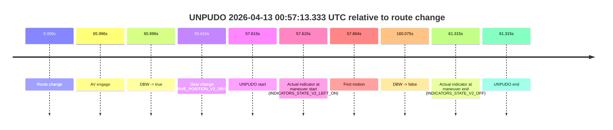

# Run Report: fme10011/2026-04-13--00-42-06--gen2-av-1079783b-1728-4998-a611-f8decf034f11

| Field | Value |
|---|---|
| Run ID | `fme10011/2026-04-13--00-42-06--gen2-av-1079783b-1728-4998-a611-f8decf034f11` |
| Date | `2026-04-13` |
| Model(s) | `lively-orange-horse` |
| Author | `guy.geva` |
| Event count | `2` |

## unpudo 2026-04-13 00:57:13.333 UTC

| Field | Value |
|---|---|
| Model | `lively-orange-horse` |
| Author | `guy.geva` |
| Run ID | `fme10011/2026-04-13--00-42-06--gen2-av-1079783b-1728-4998-a611-f8decf034f11` |
| Date | `2026-04-13` |
| Time (UTC) | `00:57:13.333` |
| Event type | `unpudo` |
| Disengagement type | `none observed` |
| Route change | `found` |
| Console | [run](https://console.sso.wayve.ai/run/fme10011/2026-04-13--00-42-06--gen2-av-1079783b-1728-4998-a611-f8decf034f11?id=&time-unixus=1776041833333311) |
| Foxglove | [segment](https://app.foxglove.dev/wayve-on-prem/p/prj_0dX18KZdVHg1fmmI/view?ds=foxglove-stream&ds.deviceName=fme10011&ds.start=2026-04-13T00%3A56%3A05.718267Z&ds.end=2026-04-13T00%3A59%3A05.793603Z&layoutId=lay_0e7VD4WIKDQGU73Y&time=2026-04-13T00%3A57%3A13.333311Z) |

### Event card: accidental

- Accidental: AV ownership is present for less than `2s`, so this is treated as an accidental brush with the maneuver rather than a meaningful model attempt.

| Event | Time (UTC) | Delta from route change |
|---|---:|---:|
| Route change | 2026-04-13 00:56:15.718 | `0.000s` |
| AV engage | 2026-04-13 00:57:21.714 | `65.996s` |
| DBW -> true | 2026-04-13 00:57:21.714 | `65.996s` |
| Gear change (DRIVE_POSITION_V2_DRIVE) | 2026-04-13 00:57:11.333 | `55.615s` |
| UNPUDO start | 2026-04-13 00:57:13.333 | `57.615s` |
| Actual indicator at maneuver start (INDICATORS_STATE_V2_LEFT_ON) | 2026-04-13 00:57:13.333 | `57.615s` |
| First motion | 2026-04-13 00:57:13.382 | `57.664s` |
| DBW -> false | 2026-04-13 00:58:55.793 | `160.075s` |
| Actual indicator at maneuver end (INDICATORS_STATE_V2_OFF) | 2026-04-13 00:57:17.033 | `61.315s` |
| UNPUDO end | 2026-04-13 00:57:17.033 | `61.315s` |

| Metric | Value |
|---|---|
| Outcome | `accidental` |
| Effective failure type | `none` |
| Route change status | `found` |
| DBW at event start | `false` |
| DBW at event end | `false` |
| Predicted gear at AV start | `DRIVE_POSITION_V2_DRIVE` |
| Actual gear at AV start | `DRIVE_POSITION_V2_DRIVE` |
| Predicted gear at event start | `DRIVE_POSITION_V2_DRIVE` |
| Actual gear at event start | `DRIVE_POSITION_V2_DRIVE` |
| Planned indicator direction | `INDICATORS_STATE_V2_LEFT_ON` |
| Controller indicator direction | `INDICATORS_STATE_V2_LEFT_ON` |
| Actual indicator direction | `INDICATORS_STATE_V2_LEFT_ON` |
| Actual indicator at maneuver end | `INDICATORS_STATE_V2_OFF` |
| Driver accel help in AV | `false` |
| Driver accel help timestamp | `n/a` |
| Max accel pedal pct in AV | `0.0%` |
| Max brake pedal pct in AV | `0.0%` |
| Max speed mps in AV | `0.000` |
| Route -> AV | `65.996s` |
| AV -> event start | `-8.381s` |
| AV -> first motion | `-8.332s` |
| AV duration before disengagement | `94.080s` |
| Trajectory waypoint count | `38` |
| Driving-plan step count | `11` |

The scored portion starts from the AV-owned window, not from the pre-AV setup. Route-change search in the stopped pre-event segment was `found`, with the baseline therefore set to route change. At the event anchor the model predicts `DRIVE_POSITION_V2_DRIVE` and the actual gear is `DRIVE_POSITION_V2_DRIVE`. The effective model outcome is `accidental` because `the AV-owned portion is shorter than 2s`.

### Resolution

| Field | Value |
|---|---|
| Final outcome | `accidental` |
| Do we agree with this label? | `yes` |
| Source disengagement type | `none observed` |
| Resolved effective failure type | `none` |
| Confidence | `high` |

## unpudo 2026-04-13 00:58:56.283 UTC

| Field | Value |
|---|---|
| Model | `lively-orange-horse` |
| Author | `guy.geva` |
| Run ID | `fme10011/2026-04-13--00-42-06--gen2-av-1079783b-1728-4998-a611-f8decf034f11` |
| Date | `2026-04-13` |
| Time (UTC) | `00:58:56.283` |
| Event type | `unpudo` |
| Disengagement type | `failed_to_unpudo` |
| Route change | `found` |
| Console | [run](https://console.sso.wayve.ai/run/fme10011/2026-04-13--00-42-06--gen2-av-1079783b-1728-4998-a611-f8decf034f11?id=&time-unixus=1776041936283318) |
| Foxglove | [segment](https://app.foxglove.dev/wayve-on-prem/p/prj_0dX18KZdVHg1fmmI/view?ds=foxglove-stream&ds.deviceName=fme10011&ds.start=2026-04-13T00%3A58%3A38.968260Z&ds.end=2026-04-13T00%3A59%3A17.214041Z&layoutId=lay_0e7VD4WIKDQGU73Y&time=2026-04-13T00%3A58%3A56.283318Z) |

### Event card: accidental

- Accidental: AV ownership is present for less than `2s`, so this is treated as an accidental brush with the maneuver rather than a meaningful model attempt.

| Event | Time (UTC) | Delta from route change |
|---|---:|---:|
| Route change | 2026-04-13 00:58:48.968 | `0.000s` |
| AV engage | 2026-04-13 00:59:03.653 | `14.685s` |
| DBW -> true | 2026-04-13 00:59:03.653 | `14.685s` |
| Gear change (DRIVE_POSITION_V2_DRIVE) | 2026-04-13 00:58:49.283 | `0.315s` |
| UNPUDO start | 2026-04-13 00:58:56.283 | `7.315s` |
| Actual indicator at maneuver start (INDICATORS_STATE_V2_OFF) | 2026-04-13 00:58:56.283 | `7.315s` |
| First motion | 2026-04-13 00:58:56.342 | `7.374s` |
| DBW -> false | 2026-04-13 00:59:07.214 | `18.246s` |
| Actual indicator at maneuver end (INDICATORS_STATE_V2_OFF) | 2026-04-13 00:58:59.933 | `10.965s` |
| UNPUDO end | 2026-04-13 00:58:59.933 | `10.965s` |

| Metric | Value |
|---|---|
| Outcome | `accidental` |
| Effective failure type | `none` |
| Route change status | `found` |
| DBW at event start | `false` |
| DBW at event end | `false` |
| Predicted gear at AV start | `DRIVE_POSITION_V2_DRIVE` |
| Actual gear at AV start | `DRIVE_POSITION_V2_DRIVE` |
| Predicted gear at event start | `DRIVE_POSITION_V2_DRIVE` |
| Actual gear at event start | `DRIVE_POSITION_V2_DRIVE` |
| Planned indicator direction | `INDICATORS_STATE_V2_LEFT_ON` |
| Controller indicator direction | `INDICATORS_STATE_V2_LEFT_ON` |
| Actual indicator direction | `INDICATORS_STATE_V2_OFF` |
| Actual indicator at maneuver end | `INDICATORS_STATE_V2_OFF` |
| Driver accel help in AV | `false` |
| Driver accel help timestamp | `n/a` |
| Max accel pedal pct in AV | `0.0%` |
| Max brake pedal pct in AV | `0.0%` |
| Max speed mps in AV | `0.000` |
| Route -> AV | `14.685s` |
| AV -> event start | `-7.370s` |
| AV -> first motion | `-7.311s` |
| AV duration before disengagement | `3.561s` |
| Trajectory waypoint count | `37` |
| Driving-plan step count | `11` |

The scored portion starts from the AV-owned window, not from the pre-AV setup. Route-change search in the stopped pre-event segment was `found`, with the baseline therefore set to route change. At the event anchor the model predicts `DRIVE_POSITION_V2_DRIVE` and the actual gear is `DRIVE_POSITION_V2_DRIVE`. The effective model outcome is `accidental` because `the AV-owned portion is shorter than 2s`.

### Resolution

| Field | Value |
|---|---|
| Final outcome | `accidental` |
| Do we agree with this label? | `yes` |
| Source disengagement type | `failed_to_unpudo` |
| Resolved effective failure type | `none` |
| Confidence | `high` |
