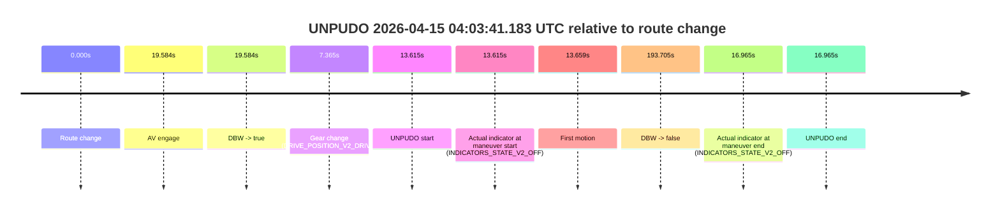
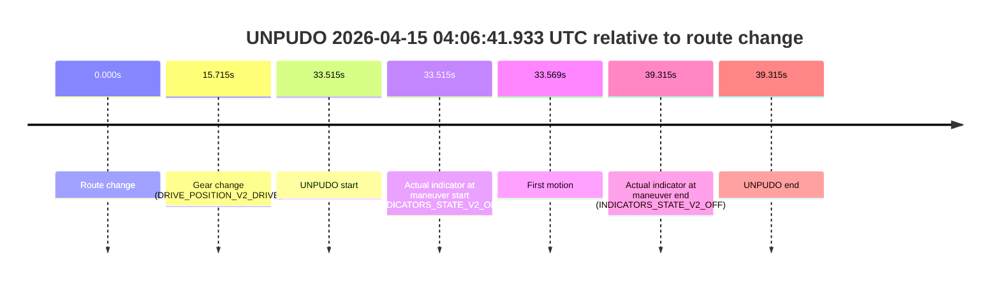
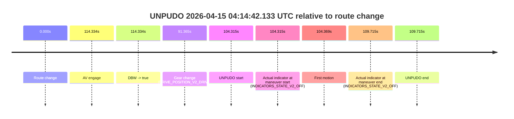

# Run Report: fme10011/2026-04-15--03-54-20--gen2-av-9f30e46a-a838-46da-973e-e2b38b53d74c

| Field | Value |
|---|---|
| Run ID | `fme10011/2026-04-15--03-54-20--gen2-av-9f30e46a-a838-46da-973e-e2b38b53d74c` |
| Date | `2026-04-15` |
| Model(s) | `satisfied-amber-moose` |
| Author | `guy.geva` |
| Event count | `4` |

## unpudo 2026-04-15 04:03:41.183 UTC

| Field | Value |
|---|---|
| Model | `satisfied-amber-moose` |
| Author | `guy.geva` |
| Run ID | `fme10011/2026-04-15--03-54-20--gen2-av-9f30e46a-a838-46da-973e-e2b38b53d74c` |
| Date | `2026-04-15` |
| Time (UTC) | `04:03:41.183` |
| Event type | `unpudo` |
| Disengagement type | `failed_to_unpudo` |
| Route change | `found` |
| Console | [run](https://console.sso.wayve.ai/run/fme10011/2026-04-15--03-54-20--gen2-av-9f30e46a-a838-46da-973e-e2b38b53d74c?id=&time-unixus=1776225821183301) |
| Foxglove | [segment](https://app.foxglove.dev/wayve-on-prem/p/prj_0dX18KZdVHg1fmmI/view?ds=foxglove-stream&ds.deviceName=fme10011&ds.start=2026-04-15T04%3A03%3A17.568289Z&ds.end=2026-04-15T04%3A06%3A51.273764Z&layoutId=lay_0e7VD4WIKDQGU73Y&time=2026-04-15T04%3A03%3A41.183301Z) |

### Event card: accidental

- Accidental: AV ownership is present for less than `2s`, so this is treated as an accidental brush with the maneuver rather than a meaningful model attempt.

| Event | Time (UTC) | Delta from route change |
|---|---:|---:|
| Route change | 2026-04-15 04:03:27.568 | `0.000s` |
| AV engage | 2026-04-15 04:03:47.152 | `19.584s` |
| DBW -> true | 2026-04-15 04:03:47.152 | `19.584s` |
| Gear change (DRIVE_POSITION_V2_DRIVE) | 2026-04-15 04:03:34.933 | `7.365s` |
| UNPUDO start | 2026-04-15 04:03:41.183 | `13.615s` |
| Actual indicator at maneuver start (INDICATORS_STATE_V2_OFF) | 2026-04-15 04:03:41.183 | `13.615s` |
| First motion | 2026-04-15 04:03:41.226 | `13.659s` |
| DBW -> false | 2026-04-15 04:06:41.273 | `193.705s` |
| Actual indicator at maneuver end (INDICATORS_STATE_V2_OFF) | 2026-04-15 04:03:44.533 | `16.965s` |
| UNPUDO end | 2026-04-15 04:03:44.533 | `16.965s` |

| Metric | Value |
|---|---|
| Outcome | `accidental` |
| Effective failure type | `none` |
| Route change status | `found` |
| DBW at event start | `false` |
| DBW at event end | `false` |
| Predicted gear at AV start | `DRIVE_POSITION_V2_DRIVE` |
| Actual gear at AV start | `DRIVE_POSITION_V2_DRIVE` |
| Predicted gear at event start | `DRIVE_POSITION_V2_DRIVE` |
| Actual gear at event start | `DRIVE_POSITION_V2_DRIVE` |
| Planned indicator direction | `INDICATORS_STATE_V2_LEFT_ON` |
| Controller indicator direction | `INDICATORS_STATE_V2_LEFT_ON` |
| Actual indicator direction | `INDICATORS_STATE_V2_OFF` |
| Actual indicator at maneuver end | `INDICATORS_STATE_V2_OFF` |
| Driver accel help in AV | `false` |
| Driver accel help timestamp | `n/a` |
| Max accel pedal pct in AV | `0.0%` |
| Max brake pedal pct in AV | `0.0%` |
| Max speed mps in AV | `0.000` |
| Route -> AV | `19.584s` |
| AV -> event start | `-5.969s` |
| AV -> first motion | `-5.926s` |
| AV duration before disengagement | `174.121s` |
| Trajectory waypoint count | `37` |
| Driving-plan step count | `11` |

The scored portion starts from the AV-owned window, not from the pre-AV setup. Route-change search in the stopped pre-event segment was `found`, with the baseline therefore set to route change. At the event anchor the model predicts `DRIVE_POSITION_V2_DRIVE` and the actual gear is `DRIVE_POSITION_V2_DRIVE`. The effective model outcome is `accidental` because `the AV-owned portion is shorter than 2s`.

### Resolution

| Field | Value |
|---|---|
| Final outcome | `accidental` |
| Do we agree with this label? | `yes` |
| Source disengagement type | `failed_to_unpudo` |
| Resolved effective failure type | `none` |
| Confidence | `high` |

## unpudo 2026-04-15 04:06:41.933 UTC

| Field | Value |
|---|---|
| Model | `satisfied-amber-moose` |
| Author | `guy.geva` |
| Run ID | `fme10011/2026-04-15--03-54-20--gen2-av-9f30e46a-a838-46da-973e-e2b38b53d74c` |
| Date | `2026-04-15` |
| Time (UTC) | `04:06:41.933` |
| Event type | `unpudo` |
| Disengagement type | `failed_to_pudo` |
| Route change | `found` |
| Console | [run](https://console.sso.wayve.ai/run/fme10011/2026-04-15--03-54-20--gen2-av-9f30e46a-a838-46da-973e-e2b38b53d74c?id=&time-unixus=1776226001933312) |
| Foxglove | [segment](https://app.foxglove.dev/wayve-on-prem/p/prj_0dX18KZdVHg1fmmI/view?ds=foxglove-stream&ds.deviceName=fme10011&ds.start=2026-04-15T04%3A05%3A58.418231Z&ds.end=2026-04-15T04%3A06%3A57.733307Z&layoutId=lay_0e7VD4WIKDQGU73Y&time=2026-04-15T04%3A06%3A41.933312Z) |

### Event card: non-av

- Non-AV: the detected unpudo starts outside AV ownership, so it is kept for coverage but excluded from model success / failure scoring.

| Event | Time (UTC) | Delta from route change |
|---|---:|---:|
| Route change | 2026-04-15 04:06:08.418 | `0.000s` |
| Gear change (DRIVE_POSITION_V2_DRIVE) | 2026-04-15 04:06:24.133 | `15.715s` |
| UNPUDO start | 2026-04-15 04:06:41.933 | `33.515s` |
| Actual indicator at maneuver start (INDICATORS_STATE_V2_OFF) | 2026-04-15 04:06:41.933 | `33.515s` |
| First motion | 2026-04-15 04:06:41.987 | `33.569s` |
| Actual indicator at maneuver end (INDICATORS_STATE_V2_OFF) | 2026-04-15 04:06:47.733 | `39.315s` |
| UNPUDO end | 2026-04-15 04:06:47.733 | `39.315s` |

| Metric | Value |
|---|---|
| Outcome | `non-av` |
| Effective failure type | `none` |
| Route change status | `found` |
| DBW at event start | `false` |
| DBW at event end | `false` |
| Predicted gear at AV start | `n/a` |
| Actual gear at AV start | `n/a` |
| Predicted gear at event start | `DRIVE_POSITION_V2_DRIVE` |
| Actual gear at event start | `DRIVE_POSITION_V2_DRIVE` |
| Planned indicator direction | `INDICATORS_STATE_V2_LEFT_ON` |
| Controller indicator direction | `INDICATORS_STATE_V2_LEFT_ON` |
| Actual indicator direction | `INDICATORS_STATE_V2_OFF` |
| Actual indicator at maneuver end | `INDICATORS_STATE_V2_OFF` |
| Driver accel help in AV | `false` |
| Driver accel help timestamp | `n/a` |
| Max accel pedal pct in AV | `0.0%` |
| Max brake pedal pct in AV | `0.0%` |
| Max speed mps in AV | `0.000` |
| Route -> AV | `n/a` |
| AV -> event start | `n/a` |
| AV -> first motion | `n/a` |
| AV duration before disengagement | `n/a` |
| Trajectory waypoint count | `36` |
| Driving-plan step count | `11` |

The scored portion starts from the AV-owned window, not from the pre-AV setup. Route-change search in the stopped pre-event segment was `found`, with the baseline therefore set to route change. At the event anchor the model predicts `DRIVE_POSITION_V2_DRIVE` and the actual gear is `DRIVE_POSITION_V2_DRIVE`. The effective model outcome is `non-av` because `the event does not begin in AV ownership`.

### Resolution

| Field | Value |
|---|---|
| Final outcome | `non-av` |
| Do we agree with this label? | `yes` |
| Source disengagement type | `failed_to_pudo` |
| Resolved effective failure type | `none` |
| Confidence | `high` |

## unpudo 2026-04-15 04:13:19.133 UTC

| Field | Value |
|---|---|
| Model | `satisfied-amber-moose` |
| Author | `guy.geva` |
| Run ID | `fme10011/2026-04-15--03-54-20--gen2-av-9f30e46a-a838-46da-973e-e2b38b53d74c` |
| Date | `2026-04-15` |
| Time (UTC) | `04:13:19.133` |
| Event type | `unpudo` |
| Disengagement type | `failed_to_pudo` |
| Route change | `found` |
| Console | [run](https://console.sso.wayve.ai/run/fme10011/2026-04-15--03-54-20--gen2-av-9f30e46a-a838-46da-973e-e2b38b53d74c?id=&time-unixus=1776226399133293) |
| Foxglove | [segment](https://app.foxglove.dev/wayve-on-prem/p/prj_0dX18KZdVHg1fmmI/view?ds=foxglove-stream&ds.deviceName=fme10011&ds.start=2026-04-15T04%3A12%3A47.818245Z&ds.end=2026-04-15T04%3A14%3A09.272461Z&layoutId=lay_0e7VD4WIKDQGU73Y&time=2026-04-15T04%3A13%3A19.133293Z) |

### Event card: accidental

- Accidental: AV ownership is present for less than `2s`, so this is treated as an accidental brush with the maneuver rather than a meaningful model attempt.

| Event | Time (UTC) | Delta from route change |
|---|---:|---:|
| Route change | 2026-04-15 04:12:57.818 | `0.000s` |
| AV engage | 2026-04-15 04:13:24.493 | `26.675s` |
| DBW -> true | 2026-04-15 04:13:24.493 | `26.675s` |
| Gear change (DRIVE_POSITION_V2_DRIVE) | 2026-04-15 04:13:08.183 | `10.365s` |
| UNPUDO start | 2026-04-15 04:13:19.133 | `21.315s` |
| Actual indicator at maneuver start (INDICATORS_STATE_V2_OFF) | 2026-04-15 04:13:19.133 | `21.315s` |
| First motion | 2026-04-15 04:13:19.187 | `21.369s` |
| DBW -> false | 2026-04-15 04:13:59.272 | `61.454s` |
| Actual indicator at maneuver end (INDICATORS_STATE_V2_OFF) | 2026-04-15 04:13:24.833 | `27.015s` |
| UNPUDO end | 2026-04-15 04:13:24.833 | `27.015s` |

| Metric | Value |
|---|---|
| Outcome | `accidental` |
| Effective failure type | `none` |
| Route change status | `found` |
| DBW at event start | `false` |
| DBW at event end | `true` |
| Predicted gear at AV start | `DRIVE_POSITION_V2_DRIVE` |
| Actual gear at AV start | `DRIVE_POSITION_V2_DRIVE` |
| Predicted gear at event start | `DRIVE_POSITION_V2_DRIVE` |
| Actual gear at event start | `DRIVE_POSITION_V2_DRIVE` |
| Planned indicator direction | `INDICATORS_STATE_V2_LEFT_ON` |
| Controller indicator direction | `INDICATORS_STATE_V2_LEFT_ON` |
| Actual indicator direction | `INDICATORS_STATE_V2_OFF` |
| Actual indicator at maneuver end | `INDICATORS_STATE_V2_OFF` |
| Driver accel help in AV | `false` |
| Driver accel help timestamp | `n/a` |
| Max accel pedal pct in AV | `0.0%` |
| Max brake pedal pct in AV | `0.0%` |
| Max speed mps in AV | `2.344` |
| Route -> AV | `26.675s` |
| AV -> event start | `-5.360s` |
| AV -> first motion | `-5.306s` |
| AV duration before disengagement | `34.779s` |
| Trajectory waypoint count | `36` |
| Driving-plan step count | `11` |

The scored portion starts from the AV-owned window, not from the pre-AV setup. Route-change search in the stopped pre-event segment was `found`, with the baseline therefore set to route change. At the event anchor the model predicts `DRIVE_POSITION_V2_DRIVE` and the actual gear is `DRIVE_POSITION_V2_DRIVE`. The effective model outcome is `accidental` because `the AV-owned portion is shorter than 2s`.

### Resolution

| Field | Value |
|---|---|
| Final outcome | `accidental` |
| Do we agree with this label? | `yes` |
| Source disengagement type | `failed_to_pudo` |
| Resolved effective failure type | `none` |
| Confidence | `high` |

## unpudo 2026-04-15 04:14:42.133 UTC

| Field | Value |
|---|---|
| Model | `satisfied-amber-moose` |
| Author | `guy.geva` |
| Run ID | `fme10011/2026-04-15--03-54-20--gen2-av-9f30e46a-a838-46da-973e-e2b38b53d74c` |
| Date | `2026-04-15` |
| Time (UTC) | `04:14:42.133` |
| Event type | `unpudo` |
| Disengagement type | `failed_to_unpudo` |
| Route change | `found` |
| Console | [run](https://console.sso.wayve.ai/run/fme10011/2026-04-15--03-54-20--gen2-av-9f30e46a-a838-46da-973e-e2b38b53d74c?id=&time-unixus=1776226482133289) |
| Foxglove | [segment](https://app.foxglove.dev/wayve-on-prem/p/prj_0dX18KZdVHg1fmmI/view?ds=foxglove-stream&ds.deviceName=fme10011&ds.start=2026-04-15T04%3A12%3A47.818245Z&ds.end=2026-04-15T04%3A14%3A57.533313Z&layoutId=lay_0e7VD4WIKDQGU73Y&time=2026-04-15T04%3A14%3A42.133289Z) |

### Event card: accidental

- Accidental: AV ownership is present for less than `2s`, so this is treated as an accidental brush with the maneuver rather than a meaningful model attempt.

| Event | Time (UTC) | Delta from route change |
|---|---:|---:|
| Route change | 2026-04-15 04:12:57.818 | `0.000s` |
| AV engage | 2026-04-15 04:14:52.152 | `114.334s` |
| DBW -> true | 2026-04-15 04:14:52.152 | `114.334s` |
| Gear change (DRIVE_POSITION_V2_DRIVE) | 2026-04-15 04:14:29.183 | `91.365s` |
| UNPUDO start | 2026-04-15 04:14:42.133 | `104.315s` |
| Actual indicator at maneuver start (INDICATORS_STATE_V2_OFF) | 2026-04-15 04:14:42.133 | `104.315s` |
| First motion | 2026-04-15 04:14:42.186 | `104.369s` |
| Actual indicator at maneuver end (INDICATORS_STATE_V2_OFF) | 2026-04-15 04:14:47.533 | `109.715s` |
| UNPUDO end | 2026-04-15 04:14:47.533 | `109.715s` |

| Metric | Value |
|---|---|
| Outcome | `accidental` |
| Effective failure type | `none` |
| Route change status | `found` |
| DBW at event start | `false` |
| DBW at event end | `false` |
| Predicted gear at AV start | `DRIVE_POSITION_V2_DRIVE` |
| Actual gear at AV start | `DRIVE_POSITION_V2_DRIVE` |
| Predicted gear at event start | `DRIVE_POSITION_V2_DRIVE` |
| Actual gear at event start | `DRIVE_POSITION_V2_DRIVE` |
| Planned indicator direction | `INDICATORS_STATE_V2_OFF` |
| Controller indicator direction | `INDICATORS_STATE_V2_OFF` |
| Actual indicator direction | `INDICATORS_STATE_V2_OFF` |
| Actual indicator at maneuver end | `INDICATORS_STATE_V2_OFF` |
| Driver accel help in AV | `false` |
| Driver accel help timestamp | `n/a` |
| Max accel pedal pct in AV | `0.0%` |
| Max brake pedal pct in AV | `0.0%` |
| Max speed mps in AV | `0.000` |
| Route -> AV | `114.334s` |
| AV -> event start | `-10.019s` |
| AV -> first motion | `-9.965s` |
| AV duration before disengagement | `n/a` |
| Trajectory waypoint count | `36` |
| Driving-plan step count | `11` |

The scored portion starts from the AV-owned window, not from the pre-AV setup. Route-change search in the stopped pre-event segment was `found`, with the baseline therefore set to route change. At the event anchor the model predicts `DRIVE_POSITION_V2_DRIVE` and the actual gear is `DRIVE_POSITION_V2_DRIVE`. The effective model outcome is `accidental` because `the AV-owned portion is shorter than 2s`.

### Resolution

| Field | Value |
|---|---|
| Final outcome | `accidental` |
| Do we agree with this label? | `yes` |
| Source disengagement type | `failed_to_unpudo` |
| Resolved effective failure type | `none` |
| Confidence | `high` |
