# Run Report: fme10011/2026-04-15--15-39-22--gen2-av-1eff82a8-d97f-4d8e-be75-4f5d130fd5f1

| Field | Value |
|---|---|
| Run ID | `fme10011/2026-04-15--15-39-22--gen2-av-1eff82a8-d97f-4d8e-be75-4f5d130fd5f1` |
| Date | `2026-04-15` |
| Model(s) | `armadillo-amethyst-squeaky` |
| Author | `guy.geva` |
| Event count | `18` |

## unpudo 2026-04-15 15:50:45.783 UTC

| Field | Value |
|---|---|
| Model | `armadillo-amethyst-squeaky` |
| Author | `guy.geva` |
| Run ID | `fme10011/2026-04-15--15-39-22--gen2-av-1eff82a8-d97f-4d8e-be75-4f5d130fd5f1` |
| Date | `2026-04-15` |
| Time (UTC) | `15:50:45.783` |
| Event type | `unpudo` |
| Disengagement type | `none observed` |
| Route change | `found` |
| Console | [run](https://console.sso.wayve.ai/run/fme10011/2026-04-15--15-39-22--gen2-av-1eff82a8-d97f-4d8e-be75-4f5d130fd5f1?id=&time-unixus=1776268245783313) |
| Foxglove | [segment](https://app.foxglove.dev/wayve-on-prem/p/prj_0dX18KZdVHg1fmmI/view?ds=foxglove-stream&ds.deviceName=fme10011&ds.start=2026-04-15T15%3A48%3A58.768356Z&ds.end=2026-04-15T15%3A50%3A59.933297Z&layoutId=lay_0e7VD4WIKDQGU73Y&time=2026-04-15T15%3A50%3A45.783313Z) |

### Event card: fail

- Fail: the credited unpudo does not stay AV-owned. The event window starts with DBW false, and the maneuver outcome lands outside a clean AV-owned segment.

| Event | Time (UTC) | Delta from route change |
|---|---:|---:|
| Route change | 2026-04-15 15:49:08.768 | `0.000s` |
| Actual indicator -> left on | 2026-04-15 15:49:13.218 | `4.450s` |
| First motion | 2026-04-15 15:49:17.118 | `8.350s` |
| Actual indicator -> off | 2026-04-15 15:49:18.338 | `9.570s` |
| AV engage | 2026-04-15 15:50:16.122 | `67.354s` |
| DBW -> true | 2026-04-15 15:50:16.122 | `67.354s` |
| DBW -> false | 2026-04-15 15:50:18.922 | `70.154s` |
| Gear change (DRIVE_POSITION_V2_DRIVE) | 2026-04-15 15:50:35.233 | `86.465s` |
| Actual indicator -> left on | 2026-04-15 15:50:36.398 | `87.630s` |
| UNPUDO start | 2026-04-15 15:50:45.783 | `97.015s` |
| DBW at event start (false) | 2026-04-15 15:50:45.783 | `97.015s` |
| Actual indicator -> off | 2026-04-15 15:50:47.617 | `98.849s` |
| DBW at event end (false) | 2026-04-15 15:50:49.933 | `101.165s` |
| UNPUDO end | 2026-04-15 15:50:49.933 | `101.165s` |

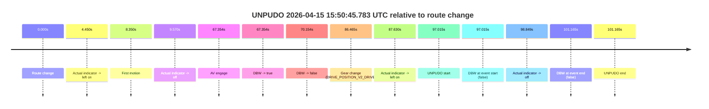

| Metric | Value |
|---|---|
| Outcome | `fail` |
| Effective failure type | `completed_outside_av` |
| Route change status | `found` |
| DBW at event start | `false` |
| DBW at event end | `false` |
| Predicted gear at AV start | `DRIVE_POSITION_V2_DRIVE` |
| Actual gear at AV start | `DRIVE_POSITION_V2_PARK` |
| Predicted gear at event start | `DRIVE_POSITION_V2_DRIVE` |
| Actual gear at event start | `DRIVE_POSITION_V2_DRIVE` |
| Planned indicator direction | `INDICATORS_STATE_V2_LEFT_ON` |
| Controller indicator direction | `INDICATORS_STATE_V2_LEFT_ON` |
| Actual indicator direction | `INDICATORS_STATE_V2_LEFT_ON` |
| Actual indicator at maneuver end | `INDICATORS_STATE_V2_OFF` |
| Driver accel help in AV | `false` |
| Driver accel help timestamp | `n/a` |
| Max accel pedal pct in AV | `0.0%` |
| Max brake pedal pct in AV | `8.0%` |
| Max speed mps in AV | `0.000` |
| Success timing baseline | `route change` |
| Route -> AV | `67.354s` |
| AV -> event start | `29.661s` |
| AV -> first motion | `-59.004s` |
| Success baseline -> event start | `97.015s` |
| Success baseline -> first motion | `8.350s` |
| AV duration before disengagement | `2.800s` |
| Trajectory waypoint count | `37` |
| Driving-plan step count | `11` |

The scored portion starts from the AV-owned window, not from the pre-AV setup. Route-change search in the stopped pre-event segment was `found`, with the baseline therefore set to route change. At the event anchor the model predicts `DRIVE_POSITION_V2_DRIVE` and the actual gear is `DRIVE_POSITION_V2_DRIVE`. The effective model outcome is `fail` because `completed_outside_av.`

### Resolution

| Field | Value |
|---|---|
| Final outcome | `fail` |
| Do we agree with this label? | `yes` |
| Source disengagement type | `none observed` |
| Resolved effective failure type | `completed_outside_av` |
| Confidence | `high` |

## unpudo 2026-04-15 15:51:39.633 UTC

| Field | Value |
|---|---|
| Model | `armadillo-amethyst-squeaky` |
| Author | `guy.geva` |
| Run ID | `fme10011/2026-04-15--15-39-22--gen2-av-1eff82a8-d97f-4d8e-be75-4f5d130fd5f1` |
| Date | `2026-04-15` |
| Time (UTC) | `15:51:39.633` |
| Event type | `unpudo` |
| Disengagement type | `failed_to_unpudo` |
| Route change | `found` |
| Console | [run](https://console.sso.wayve.ai/run/fme10011/2026-04-15--15-39-22--gen2-av-1eff82a8-d97f-4d8e-be75-4f5d130fd5f1?id=&time-unixus=1776268299633319) |
| Foxglove | [segment](https://app.foxglove.dev/wayve-on-prem/p/prj_0dX18KZdVHg1fmmI/view?ds=foxglove-stream&ds.deviceName=fme10011&ds.start=2026-04-15T15%3A50%3A22.318233Z&ds.end=2026-04-15T15%3A51%3A53.733301Z&layoutId=lay_0e7VD4WIKDQGU73Y&time=2026-04-15T15%3A51%3A39.633319Z) |

### Event card: fail

- Fail: AV owns part of the segment, but the event still resolves as a model-performance failure under the AV-only scoring rule.

| Event | Time (UTC) | Delta from route change |
|---|---:|---:|
| Route change | 2026-04-15 15:50:32.318 | `0.000s` |
| Actual indicator -> left on | 2026-04-15 15:50:36.398 | `4.080s` |
| First motion | 2026-04-15 15:50:45.797 | `13.480s` |
| Actual indicator -> off | 2026-04-15 15:50:47.617 | `15.300s` |
| AV engage | 2026-04-15 15:51:30.442 | `58.124s` |
| DBW -> true | 2026-04-15 15:51:30.442 | `58.124s` |
| Gear change (DRIVE_POSITION_V2_DRIVE) | 2026-04-15 15:51:30.883 | `58.565s` |
| DBW -> false | 2026-04-15 15:51:38.562 | `66.245s` |
| UNPUDO start | 2026-04-15 15:51:39.633 | `67.315s` |
| DBW at event start (false) | 2026-04-15 15:51:39.633 | `67.315s` |
| Actual indicator -> left on | 2026-04-15 15:51:40.117 | `67.800s` |
| Actual indicator -> off | 2026-04-15 15:51:41.437 | `69.120s` |
| DBW at event end (false) | 2026-04-15 15:51:43.733 | `71.415s` |
| UNPUDO end | 2026-04-15 15:51:43.733 | `71.415s` |

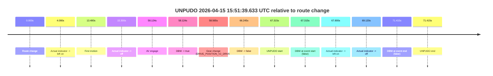

| Metric | Value |
|---|---|
| Outcome | `fail` |
| Effective failure type | `failed_to_unpudo` |
| Route change status | `found` |
| DBW at event start | `false` |
| DBW at event end | `false` |
| Predicted gear at AV start | `DRIVE_POSITION_V2_DRIVE` |
| Actual gear at AV start | `DRIVE_POSITION_V2_PARK` |
| Predicted gear at event start | `DRIVE_POSITION_V2_DRIVE` |
| Actual gear at event start | `DRIVE_POSITION_V2_DRIVE` |
| Planned indicator direction | `INDICATORS_STATE_V2_LEFT_ON` |
| Controller indicator direction | `INDICATORS_STATE_V2_LEFT_ON` |
| Actual indicator direction | `INDICATORS_STATE_V2_OFF` |
| Actual indicator at maneuver end | `INDICATORS_STATE_V2_OFF` |
| Driver accel help in AV | `false` |
| Driver accel help timestamp | `n/a` |
| Max accel pedal pct in AV | `0.0%` |
| Max brake pedal pct in AV | `8.0%` |
| Max speed mps in AV | `0.000` |
| Success timing baseline | `route change` |
| Route -> AV | `58.124s` |
| AV -> event start | `9.191s` |
| AV -> first motion | `-44.645s` |
| Success baseline -> event start | `67.315s` |
| Success baseline -> first motion | `13.480s` |
| AV duration before disengagement | `8.120s` |
| Trajectory waypoint count | `38` |
| Driving-plan step count | `11` |

The scored portion starts from the AV-owned window, not from the pre-AV setup. Route-change search in the stopped pre-event segment was `found`, with the baseline therefore set to route change. At the event anchor the model predicts `DRIVE_POSITION_V2_DRIVE` and the actual gear is `DRIVE_POSITION_V2_DRIVE`. The effective model outcome is `fail` because `failed_to_unpudo.`

### Resolution

| Field | Value |
|---|---|
| Final outcome | `fail` |
| Do we agree with this label? | `yes` |
| Source disengagement type | `failed_to_unpudo` |
| Resolved effective failure type | `failed_to_unpudo` |
| Confidence | `high` |

## unpudo 2026-04-15 16:10:13.483 UTC

| Field | Value |
|---|---|
| Model | `armadillo-amethyst-squeaky` |
| Author | `guy.geva` |
| Run ID | `fme10011/2026-04-15--15-39-22--gen2-av-1eff82a8-d97f-4d8e-be75-4f5d130fd5f1` |
| Date | `2026-04-15` |
| Time (UTC) | `16:10:13.483` |
| Event type | `unpudo` |
| Disengagement type | `failed_to_unpudo` |
| Route change | `unclear` |
| Console | [run](https://console.sso.wayve.ai/run/fme10011/2026-04-15--15-39-22--gen2-av-1eff82a8-d97f-4d8e-be75-4f5d130fd5f1?id=&time-unixus=1776269413483321) |
| Foxglove | [segment](https://app.foxglove.dev/wayve-on-prem/p/prj_0dX18KZdVHg1fmmI/view?ds=foxglove-stream&ds.deviceName=fme10011&ds.start=2026-04-15T16%3A08%3A41.943697Z&ds.end=2026-04-15T16%3A10%3A53.433308Z&layoutId=lay_0e7VD4WIKDQGU73Y&time=2026-04-15T16%3A10%3A13.483321Z) |

### Event card: fail

- Fail: AV owns part of the segment, but the event still resolves as a model-performance failure under the AV-only scoring rule.

| Event | Time (UTC) | Delta from AV start |
|---|---:|---:|
| First motion | 2026-04-15 16:08:43.737 | `-8.206s` |
| Route change unclear | 2026-04-15 16:08:51.943 | `0.000s` |
| AV engage | 2026-04-15 16:08:51.943 | `0.000s` |
| DBW -> true | 2026-04-15 16:08:51.943 | `0.000s` |
| DBW -> false | 2026-04-15 16:09:59.203 | `67.260s` |
| Gear change (DRIVE_POSITION_V2_DRIVE) | 2026-04-15 16:10:12.433 | `80.490s` |
| UNPUDO start | 2026-04-15 16:10:13.483 | `81.540s` |
| DBW at event start (false) | 2026-04-15 16:10:13.483 | `81.540s` |
| DBW at event end (false) | 2026-04-15 16:10:43.433 | `111.490s` |
| UNPUDO end | 2026-04-15 16:10:43.433 | `111.490s` |

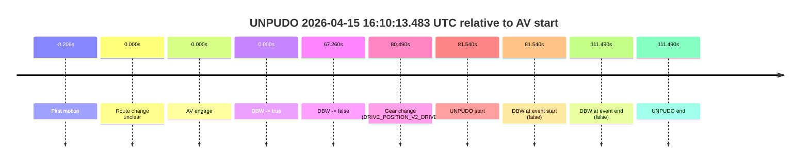

| Metric | Value |
|---|---|
| Outcome | `fail` |
| Effective failure type | `failed_to_unpudo` |
| Route change status | `unclear` |
| DBW at event start | `false` |
| DBW at event end | `false` |
| Predicted gear at AV start | `DRIVE_POSITION_V2_DRIVE` |
| Actual gear at AV start | `DRIVE_POSITION_V2_DRIVE` |
| Predicted gear at event start | `DRIVE_POSITION_V2_DRIVE` |
| Actual gear at event start | `DRIVE_POSITION_V2_DRIVE` |
| Planned indicator direction | `INDICATORS_STATE_V2_OFF` |
| Controller indicator direction | `INDICATORS_STATE_V2_OFF` |
| Actual indicator direction | `INDICATORS_STATE_V2_OFF` |
| Actual indicator at maneuver end | `INDICATORS_STATE_V2_OFF` |
| Driver accel help in AV | `false` |
| Driver accel help timestamp | `n/a` |
| Max accel pedal pct in AV | `0.0%` |
| Max brake pedal pct in AV | `13.3%` |
| Max speed mps in AV | `17.281` |
| Success timing baseline | `AV start` |
| Route -> AV | `n/a` |
| AV -> event start | `81.540s` |
| AV -> first motion | `-8.206s` |
| Success baseline -> event start | `81.540s` |
| Success baseline -> first motion | `-8.206s` |
| AV duration before disengagement | `67.260s` |
| Trajectory waypoint count | `37` |
| Driving-plan step count | `11` |

The scored portion starts from the AV-owned window, not from the pre-AV setup. Route-change search in the stopped pre-event segment was `unclear`, with the baseline therefore set to AV start. At the event anchor the model predicts `DRIVE_POSITION_V2_DRIVE` and the actual gear is `DRIVE_POSITION_V2_DRIVE`. The effective model outcome is `fail` because `failed_to_unpudo.`

### Resolution

| Field | Value |
|---|---|
| Final outcome | `fail` |
| Do we agree with this label? | `yes` |
| Source disengagement type | `failed_to_unpudo` |
| Resolved effective failure type | `failed_to_unpudo` |
| Confidence | `medium` |

## unpudo 2026-04-15 16:36:38.483 UTC

| Field | Value |
|---|---|
| Model | `armadillo-amethyst-squeaky` |
| Author | `guy.geva` |
| Run ID | `fme10011/2026-04-15--15-39-22--gen2-av-1eff82a8-d97f-4d8e-be75-4f5d130fd5f1` |
| Date | `2026-04-15` |
| Time (UTC) | `16:36:38.483` |
| Event type | `unpudo` |
| Disengagement type | `failed_to_unpudo` |
| Route change | `found` |
| Console | [run](https://console.sso.wayve.ai/run/fme10011/2026-04-15--15-39-22--gen2-av-1eff82a8-d97f-4d8e-be75-4f5d130fd5f1?id=&time-unixus=1776270998483313) |
| Foxglove | [segment](https://app.foxglove.dev/wayve-on-prem/p/prj_0dX18KZdVHg1fmmI/view?ds=foxglove-stream&ds.deviceName=fme10011&ds.start=2026-04-15T16%3A34%3A29.669711Z&ds.end=2026-04-15T16%3A36%3A51.583301Z&layoutId=lay_0e7VD4WIKDQGU73Y&time=2026-04-15T16%3A36%3A38.483313Z) |

### Event card: fail

- Fail: AV owns part of the segment, but the event still resolves as a model-performance failure under the AV-only scoring rule.

| Event | Time (UTC) | Delta from route change |
|---|---:|---:|
| Route change | 2026-04-15 16:34:39.669 | `0.000s` |
| First motion | 2026-04-15 16:34:43.257 | `3.588s` |
| Actual indicator -> left on | 2026-04-15 16:34:43.817 | `4.148s` |
| Actual indicator -> off | 2026-04-15 16:34:45.337 | `5.668s` |
| Actual indicator -> right on | 2026-04-15 16:35:43.118 | `63.449s` |
| Actual indicator -> off | 2026-04-15 16:35:44.897 | `65.228s` |
| AV engage | 2026-04-15 16:36:29.982 | `110.313s` |
| DBW -> true | 2026-04-15 16:36:29.982 | `110.313s` |
| Gear change (DRIVE_POSITION_V2_DRIVE) | 2026-04-15 16:36:30.433 | `110.764s` |
| DBW -> false | 2026-04-15 16:36:37.943 | `118.273s` |
| UNPUDO start | 2026-04-15 16:36:38.483 | `118.814s` |
| DBW at event start (false) | 2026-04-15 16:36:38.483 | `118.814s` |
| Actual indicator -> left on | 2026-04-15 16:36:38.618 | `118.948s` |
| Actual indicator -> off | 2026-04-15 16:36:41.397 | `121.728s` |
| DBW at event end (false) | 2026-04-15 16:36:41.583 | `121.914s` |
| UNPUDO end | 2026-04-15 16:36:41.583 | `121.914s` |

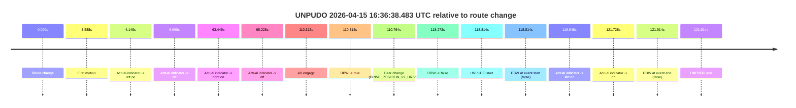

| Metric | Value |
|---|---|
| Outcome | `fail` |
| Effective failure type | `failed_to_unpudo` |
| Route change status | `found` |
| DBW at event start | `false` |
| DBW at event end | `false` |
| Predicted gear at AV start | `DRIVE_POSITION_V2_DRIVE` |
| Actual gear at AV start | `DRIVE_POSITION_V2_PARK` |
| Predicted gear at event start | `DRIVE_POSITION_V2_DRIVE` |
| Actual gear at event start | `DRIVE_POSITION_V2_DRIVE` |
| Planned indicator direction | `INDICATORS_STATE_V2_LEFT_ON` |
| Controller indicator direction | `INDICATORS_STATE_V2_LEFT_ON` |
| Actual indicator direction | `INDICATORS_STATE_V2_OFF` |
| Actual indicator at maneuver end | `INDICATORS_STATE_V2_OFF` |
| Driver accel help in AV | `false` |
| Driver accel help timestamp | `n/a` |
| Max accel pedal pct in AV | `0.0%` |
| Max brake pedal pct in AV | `8.0%` |
| Max speed mps in AV | `0.000` |
| Success timing baseline | `route change` |
| Route -> AV | `110.313s` |
| AV -> event start | `8.501s` |
| AV -> first motion | `-106.725s` |
| Success baseline -> event start | `118.814s` |
| Success baseline -> first motion | `3.588s` |
| AV duration before disengagement | `7.961s` |
| Trajectory waypoint count | `37` |
| Driving-plan step count | `11` |

The scored portion starts from the AV-owned window, not from the pre-AV setup. Route-change search in the stopped pre-event segment was `found`, with the baseline therefore set to route change. At the event anchor the model predicts `DRIVE_POSITION_V2_DRIVE` and the actual gear is `DRIVE_POSITION_V2_DRIVE`. The effective model outcome is `fail` because `failed_to_unpudo.`

### Resolution

| Field | Value |
|---|---|
| Final outcome | `fail` |
| Do we agree with this label? | `yes` |
| Source disengagement type | `failed_to_unpudo` |
| Resolved effective failure type | `failed_to_unpudo` |
| Confidence | `high` |

## unpudo 2026-04-15 16:41:47.083 UTC

| Field | Value |
|---|---|
| Model | `armadillo-amethyst-squeaky` |
| Author | `guy.geva` |
| Run ID | `fme10011/2026-04-15--15-39-22--gen2-av-1eff82a8-d97f-4d8e-be75-4f5d130fd5f1` |
| Date | `2026-04-15` |
| Time (UTC) | `16:41:47.083` |
| Event type | `unpudo` |
| Disengagement type | `failed_to_pudo` |
| Route change | `unclear` |
| Console | [run](https://console.sso.wayve.ai/run/fme10011/2026-04-15--15-39-22--gen2-av-1eff82a8-d97f-4d8e-be75-4f5d130fd5f1?id=&time-unixus=1776271307083302) |
| Foxglove | [segment](https://app.foxglove.dev/wayve-on-prem/p/prj_0dX18KZdVHg1fmmI/view?ds=foxglove-stream&ds.deviceName=fme10011&ds.start=2026-04-15T16%3A39%3A37.092867Z&ds.end=2026-04-15T16%3A41%3A57.083302Z&layoutId=lay_0e7VD4WIKDQGU73Y&time=2026-04-15T16%3A41%3A47.083302Z) |

### Event card: fail

- Fail: AV owns part of the segment, but the event still resolves as a model-performance failure under the AV-only scoring rule.

| Event | Time (UTC) | Delta from AV start |
|---|---:|---:|
| Route change unclear | 2026-04-15 16:39:47.092 | `0.000s` |
| AV engage | 2026-04-15 16:39:47.092 | `0.000s` |
| DBW -> true | 2026-04-15 16:39:47.092 | `0.000s` |
| First motion | 2026-04-15 16:39:55.437 | `8.345s` |
| Gear change (DRIVE_POSITION_V2_REVERSE) | 2026-04-15 16:41:40.433 | `113.340s` |
| DBW -> false | 2026-04-15 16:41:41.761 | `114.669s` |
| UNPUDO start | 2026-04-15 16:41:47.083 | `119.990s` |
| DBW at event start (false) | 2026-04-15 16:41:47.083 | `119.990s` |
| DBW at event end (false) | 2026-04-15 16:41:47.083 | `119.990s` |
| UNPUDO end | 2026-04-15 16:41:47.083 | `119.990s` |

| Metric | Value |
|---|---|
| Outcome | `fail` |
| Effective failure type | `failed_to_pudo` |
| Route change status | `unclear` |
| DBW at event start | `false` |
| DBW at event end | `false` |
| Predicted gear at AV start | `DRIVE_POSITION_V2_DRIVE` |
| Actual gear at AV start | `DRIVE_POSITION_V2_DRIVE` |
| Predicted gear at event start | `DRIVE_POSITION_V2_REVERSE` |
| Actual gear at event start | `DRIVE_POSITION_V2_REVERSE` |
| Planned indicator direction | `INDICATORS_STATE_V2_OFF` |
| Controller indicator direction | `INDICATORS_STATE_V2_OFF` |
| Actual indicator direction | `INDICATORS_STATE_V2_OFF` |
| Actual indicator at maneuver end | `INDICATORS_STATE_V2_OFF` |
| Driver accel help in AV | `false` |
| Driver accel help timestamp | `n/a` |
| Max accel pedal pct in AV | `0.0%` |
| Max brake pedal pct in AV | `18.1%` |
| Max speed mps in AV | `10.583` |
| Success timing baseline | `AV start` |
| Route -> AV | `n/a` |
| AV -> event start | `119.990s` |
| AV -> first motion | `8.345s` |
| Success baseline -> event start | `119.990s` |
| Success baseline -> first motion | `8.345s` |
| AV duration before disengagement | `114.669s` |
| Trajectory waypoint count | `37` |
| Driving-plan step count | `11` |

The scored portion starts from the AV-owned window, not from the pre-AV setup. Route-change search in the stopped pre-event segment was `unclear`, with the baseline therefore set to AV start. At the event anchor the model predicts `DRIVE_POSITION_V2_REVERSE` and the actual gear is `DRIVE_POSITION_V2_REVERSE`. The effective model outcome is `fail` because `failed_to_pudo.`

### Resolution

| Field | Value |
|---|---|
| Final outcome | `fail` |
| Do we agree with this label? | `yes` |
| Source disengagement type | `failed_to_pudo` |
| Resolved effective failure type | `failed_to_pudo` |
| Confidence | `medium` |

## unpudo 2026-04-15 16:49:48.483 UTC

| Field | Value |
|---|---|
| Model | `armadillo-amethyst-squeaky` |
| Author | `guy.geva` |
| Run ID | `fme10011/2026-04-15--15-39-22--gen2-av-1eff82a8-d97f-4d8e-be75-4f5d130fd5f1` |
| Date | `2026-04-15` |
| Time (UTC) | `16:49:48.483` |
| Event type | `unpudo` |
| Disengagement type | `failed_to_pudo` |
| Route change | `unclear` |
| Console | [run](https://console.sso.wayve.ai/run/fme10011/2026-04-15--15-39-22--gen2-av-1eff82a8-d97f-4d8e-be75-4f5d130fd5f1?id=&time-unixus=1776271788483324) |
| Foxglove | [segment](https://app.foxglove.dev/wayve-on-prem/p/prj_0dX18KZdVHg1fmmI/view?ds=foxglove-stream&ds.deviceName=fme10011&ds.start=2026-04-15T16%3A47%3A38.494411Z&ds.end=2026-04-15T16%3A50%3A02.933307Z&layoutId=lay_0e7VD4WIKDQGU73Y&time=2026-04-15T16%3A49%3A48.483324Z) |

### Event card: fail

- Fail: AV owns part of the segment, but the event still resolves as a model-performance failure under the AV-only scoring rule.

| Event | Time (UTC) | Delta from AV start |
|---|---:|---:|
| Route change unclear | 2026-04-15 16:47:48.494 | `0.000s` |
| AV engage | 2026-04-15 16:47:48.494 | `0.000s` |
| DBW -> true | 2026-04-15 16:47:48.494 | `0.000s` |
| First motion | 2026-04-15 16:48:12.158 | `23.664s` |
| Gear change (DRIVE_POSITION_V2_DRIVE) | 2026-04-15 16:49:45.833 | `117.339s` |
| DBW -> false | 2026-04-15 16:49:47.082 | `118.589s` |
| UNPUDO start | 2026-04-15 16:49:48.483 | `119.989s` |
| DBW at event start (false) | 2026-04-15 16:49:48.483 | `119.989s` |
| DBW at event end (false) | 2026-04-15 16:49:52.933 | `124.439s` |
| UNPUDO end | 2026-04-15 16:49:52.933 | `124.439s` |

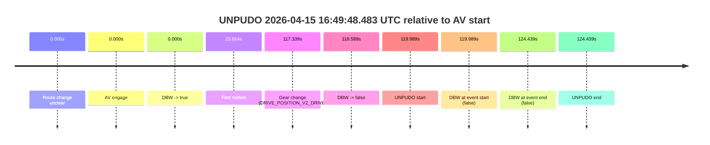

| Metric | Value |
|---|---|
| Outcome | `fail` |
| Effective failure type | `failed_to_pudo` |
| Route change status | `unclear` |
| DBW at event start | `false` |
| DBW at event end | `false` |
| Predicted gear at AV start | `DRIVE_POSITION_V2_DRIVE` |
| Actual gear at AV start | `DRIVE_POSITION_V2_DRIVE` |
| Predicted gear at event start | `DRIVE_POSITION_V2_DRIVE` |
| Actual gear at event start | `DRIVE_POSITION_V2_DRIVE` |
| Planned indicator direction | `INDICATORS_STATE_V2_OFF` |
| Controller indicator direction | `INDICATORS_STATE_V2_OFF` |
| Actual indicator direction | `INDICATORS_STATE_V2_OFF` |
| Actual indicator at maneuver end | `INDICATORS_STATE_V2_OFF` |
| Driver accel help in AV | `false` |
| Driver accel help timestamp | `n/a` |
| Max accel pedal pct in AV | `0.0%` |
| Max brake pedal pct in AV | `16.1%` |
| Max speed mps in AV | `10.556` |
| Success timing baseline | `AV start` |
| Route -> AV | `n/a` |
| AV -> event start | `119.989s` |
| AV -> first motion | `23.664s` |
| Success baseline -> event start | `119.989s` |
| Success baseline -> first motion | `23.664s` |
| AV duration before disengagement | `118.589s` |
| Trajectory waypoint count | `37` |
| Driving-plan step count | `11` |

The scored portion starts from the AV-owned window, not from the pre-AV setup. Route-change search in the stopped pre-event segment was `unclear`, with the baseline therefore set to AV start. At the event anchor the model predicts `DRIVE_POSITION_V2_DRIVE` and the actual gear is `DRIVE_POSITION_V2_DRIVE`. The effective model outcome is `fail` because `failed_to_pudo.`

### Resolution

| Field | Value |
|---|---|
| Final outcome | `fail` |
| Do we agree with this label? | `yes` |
| Source disengagement type | `failed_to_pudo` |
| Resolved effective failure type | `failed_to_pudo` |
| Confidence | `medium` |

## unpudo 2026-04-15 16:55:00.183 UTC

| Field | Value |
|---|---|
| Model | `armadillo-amethyst-squeaky` |
| Author | `guy.geva` |
| Run ID | `fme10011/2026-04-15--15-39-22--gen2-av-1eff82a8-d97f-4d8e-be75-4f5d130fd5f1` |
| Date | `2026-04-15` |
| Time (UTC) | `16:55:00.183` |
| Event type | `unpudo` |
| Disengagement type | `none observed` |
| Route change | `found` |
| Console | [run](https://console.sso.wayve.ai/run/fme10011/2026-04-15--15-39-22--gen2-av-1eff82a8-d97f-4d8e-be75-4f5d130fd5f1?id=&time-unixus=1776272100183291) |
| Foxglove | [segment](https://app.foxglove.dev/wayve-on-prem/p/prj_0dX18KZdVHg1fmmI/view?ds=foxglove-stream&ds.deviceName=fme10011&ds.start=2026-04-15T16%3A53%3A35.868268Z&ds.end=2026-04-15T16%3A59%3A10.562270Z&layoutId=lay_0e7VD4WIKDQGU73Y&time=2026-04-15T16%3A55%3A00.183291Z) |

### Event card: pass

- Pass: AV owns the credited unpudo from route change through the official unpudo window, the gear state is aligned at the anchor, and the vehicle moves without driver accelerator help in AV.

| Event | Time (UTC) | Delta from route change |
|---|---:|---:|
| Route change | 2026-04-15 16:53:45.868 | `0.000s` |
| First motion | 2026-04-15 16:53:50.038 | `4.170s` |
| Actual indicator -> right on | 2026-04-15 16:54:21.958 | `36.090s` |
| Actual indicator -> off | 2026-04-15 16:54:28.497 | `42.630s` |
| AV engage | 2026-04-15 16:54:56.142 | `70.274s` |
| DBW -> true | 2026-04-15 16:54:56.142 | `70.274s` |
| Gear change (DRIVE_POSITION_V2_DRIVE) | 2026-04-15 16:54:56.683 | `70.815s` |
| UNPUDO start | 2026-04-15 16:55:00.183 | `74.315s` |
| DBW at event start (true) | 2026-04-15 16:55:00.183 | `74.315s` |
| DBW at event end (true) | 2026-04-15 16:55:03.583 | `77.715s` |
| UNPUDO end | 2026-04-15 16:55:03.583 | `77.715s` |
| DBW -> false | 2026-04-15 16:59:00.562 | `314.694s` |

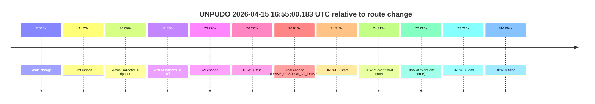

| Metric | Value |
|---|---|
| Outcome | `pass` |
| Effective failure type | `none` |
| Route change status | `found` |
| DBW at event start | `true` |
| DBW at event end | `true` |
| Predicted gear at AV start | `DRIVE_POSITION_V2_DRIVE` |
| Actual gear at AV start | `DRIVE_POSITION_V2_PARK` |
| Predicted gear at event start | `DRIVE_POSITION_V2_DRIVE` |
| Actual gear at event start | `DRIVE_POSITION_V2_DRIVE` |
| Planned indicator direction | `INDICATORS_STATE_V2_OFF` |
| Controller indicator direction | `INDICATORS_STATE_V2_OFF` |
| Actual indicator direction | `INDICATORS_STATE_V2_OFF` |
| Actual indicator at maneuver end | `INDICATORS_STATE_V2_OFF` |
| Driver accel help in AV | `false` |
| Driver accel help timestamp | `n/a` |
| Max accel pedal pct in AV | `0.0%` |
| Max brake pedal pct in AV | `8.0%` |
| Max speed mps in AV | `5.006` |
| Success timing baseline | `route change` |
| Route -> AV | `70.274s` |
| AV -> event start | `4.041s` |
| AV -> first motion | `-66.104s` |
| Success baseline -> event start | `74.315s` |
| Success baseline -> first motion | `4.170s` |
| AV duration before disengagement | `244.420s` |
| Trajectory waypoint count | `37` |
| Driving-plan step count | `11` |

The scored portion starts from the AV-owned window, not from the pre-AV setup. Route-change search in the stopped pre-event segment was `found`, with the baseline therefore set to route change. At the event anchor the model predicts `DRIVE_POSITION_V2_DRIVE` and the actual gear is `DRIVE_POSITION_V2_DRIVE`. The effective model outcome is `pass` because `the credited unpudo stays AV-owned through the official unpudo window.`

### Resolution

| Field | Value |
|---|---|
| Final outcome | `pass` |
| Do we agree with this label? | `yes` |
| Source disengagement type | `none observed` |
| Resolved effective failure type | `none` |
| Confidence | `high` |

## unpudo 2026-04-15 17:04:25.633 UTC

| Field | Value |
|---|---|
| Model | `armadillo-amethyst-squeaky` |
| Author | `guy.geva` |
| Run ID | `fme10011/2026-04-15--15-39-22--gen2-av-1eff82a8-d97f-4d8e-be75-4f5d130fd5f1` |
| Date | `2026-04-15` |
| Time (UTC) | `17:04:25.633` |
| Event type | `unpudo` |
| Disengagement type | `none observed` |
| Route change | `found` |
| Console | [run](https://console.sso.wayve.ai/run/fme10011/2026-04-15--15-39-22--gen2-av-1eff82a8-d97f-4d8e-be75-4f5d130fd5f1?id=&time-unixus=1776272665633321) |
| Foxglove | [segment](https://app.foxglove.dev/wayve-on-prem/p/prj_0dX18KZdVHg1fmmI/view?ds=foxglove-stream&ds.deviceName=fme10011&ds.start=2026-04-15T17%3A04%3A05.818375Z&ds.end=2026-04-15T17%3A06%3A22.101785Z&layoutId=lay_0e7VD4WIKDQGU73Y&time=2026-04-15T17%3A04%3A25.633321Z) |

### Event card: pass

- Pass: AV owns the credited unpudo from route change through the official unpudo window, the gear state is aligned at the anchor, and the vehicle moves without driver accelerator help in AV.

| Event | Time (UTC) | Delta from route change |
|---|---:|---:|
| Route change | 2026-04-15 17:04:15.818 | `0.000s` |
| AV engage | 2026-04-15 17:04:21.042 | `5.224s` |
| DBW -> true | 2026-04-15 17:04:21.042 | `5.224s` |
| Gear change (DRIVE_POSITION_V2_DRIVE) | 2026-04-15 17:04:21.583 | `5.765s` |
| UNPUDO start | 2026-04-15 17:04:25.633 | `9.815s` |
| DBW at event start (true) | 2026-04-15 17:04:25.633 | `9.815s` |
| First motion | 2026-04-15 17:04:25.678 | `9.860s` |
| DBW at event end (true) | 2026-04-15 17:04:29.733 | `13.915s` |
| UNPUDO end | 2026-04-15 17:04:29.733 | `13.915s` |
| DBW -> false | 2026-04-15 17:06:12.101 | `116.283s` |

| Metric | Value |
|---|---|
| Outcome | `pass` |
| Effective failure type | `none` |
| Route change status | `found` |
| DBW at event start | `true` |
| DBW at event end | `true` |
| Predicted gear at AV start | `DRIVE_POSITION_V2_DRIVE` |
| Actual gear at AV start | `DRIVE_POSITION_V2_PARK` |
| Predicted gear at event start | `DRIVE_POSITION_V2_DRIVE` |
| Actual gear at event start | `DRIVE_POSITION_V2_DRIVE` |
| Planned indicator direction | `INDICATORS_STATE_V2_OFF` |
| Controller indicator direction | `INDICATORS_STATE_V2_OFF` |
| Actual indicator direction | `INDICATORS_STATE_V2_OFF` |
| Actual indicator at maneuver end | `INDICATORS_STATE_V2_OFF` |
| Driver accel help in AV | `false` |
| Driver accel help timestamp | `n/a` |
| Max accel pedal pct in AV | `0.0%` |
| Max brake pedal pct in AV | `8.0%` |
| Max speed mps in AV | `3.883` |
| Success timing baseline | `route change` |
| Route -> AV | `5.224s` |
| AV -> event start | `4.591s` |
| AV -> first motion | `4.635s` |
| Success baseline -> event start | `9.815s` |
| Success baseline -> first motion | `9.860s` |
| AV duration before disengagement | `111.059s` |
| Trajectory waypoint count | `36` |
| Driving-plan step count | `11` |

The scored portion starts from the AV-owned window, not from the pre-AV setup. Route-change search in the stopped pre-event segment was `found`, with the baseline therefore set to route change. At the event anchor the model predicts `DRIVE_POSITION_V2_DRIVE` and the actual gear is `DRIVE_POSITION_V2_DRIVE`. The effective model outcome is `pass` because `the credited unpudo stays AV-owned through the official unpudo window.`

### Resolution

| Field | Value |
|---|---|
| Final outcome | `pass` |
| Do we agree with this label? | `yes` |
| Source disengagement type | `none observed` |
| Resolved effective failure type | `none` |
| Confidence | `high` |

## unpudo 2026-04-15 17:06:59.683 UTC

| Field | Value |
|---|---|
| Model | `armadillo-amethyst-squeaky` |
| Author | `guy.geva` |
| Run ID | `fme10011/2026-04-15--15-39-22--gen2-av-1eff82a8-d97f-4d8e-be75-4f5d130fd5f1` |
| Date | `2026-04-15` |
| Time (UTC) | `17:06:59.683` |
| Event type | `unpudo` |
| Disengagement type | `none observed` |
| Route change | `found` |
| Console | [run](https://console.sso.wayve.ai/run/fme10011/2026-04-15--15-39-22--gen2-av-1eff82a8-d97f-4d8e-be75-4f5d130fd5f1?id=&time-unixus=1776272819683324) |
| Foxglove | [segment](https://app.foxglove.dev/wayve-on-prem/p/prj_0dX18KZdVHg1fmmI/view?ds=foxglove-stream&ds.deviceName=fme10011&ds.start=2026-04-15T17%3A06%3A42.918289Z&ds.end=2026-04-15T17%3A10%3A50.423856Z&layoutId=lay_0e7VD4WIKDQGU73Y&time=2026-04-15T17%3A06%3A59.683324Z) |

### Event card: pass

- Pass: AV owns the credited unpudo from route change through the official unpudo window, the gear state is aligned at the anchor, and the vehicle moves without driver accelerator help in AV.

| Event | Time (UTC) | Delta from route change |
|---|---:|---:|
| Route change | 2026-04-15 17:06:52.918 | `0.000s` |
| AV engage | 2026-04-15 17:06:54.842 | `1.924s` |
| DBW -> true | 2026-04-15 17:06:54.842 | `1.924s` |
| Gear change (DRIVE_POSITION_V2_DRIVE) | 2026-04-15 17:06:55.383 | `2.465s` |
| UNPUDO start | 2026-04-15 17:06:59.683 | `6.765s` |
| DBW at event start (true) | 2026-04-15 17:06:59.683 | `6.765s` |
| First motion | 2026-04-15 17:06:59.698 | `6.780s` |
| DBW at event end (true) | 2026-04-15 17:07:03.883 | `10.965s` |
| UNPUDO end | 2026-04-15 17:07:03.883 | `10.965s` |
| DBW -> false | 2026-04-15 17:10:40.423 | `227.506s` |

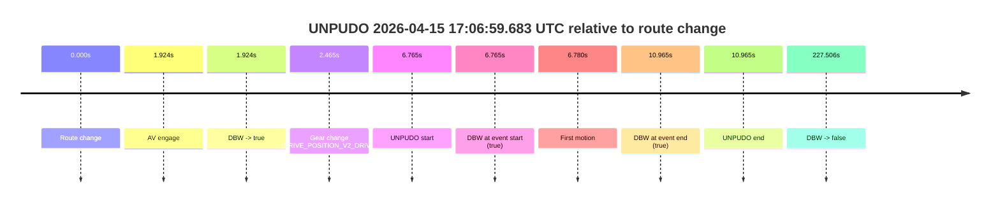

| Metric | Value |
|---|---|
| Outcome | `pass` |
| Effective failure type | `none` |
| Route change status | `found` |
| DBW at event start | `true` |
| DBW at event end | `true` |
| Predicted gear at AV start | `DRIVE_POSITION_V2_DRIVE` |
| Actual gear at AV start | `DRIVE_POSITION_V2_PARK` |
| Predicted gear at event start | `DRIVE_POSITION_V2_DRIVE` |
| Actual gear at event start | `DRIVE_POSITION_V2_DRIVE` |
| Planned indicator direction | `INDICATORS_STATE_V2_OFF` |
| Controller indicator direction | `INDICATORS_STATE_V2_OFF` |
| Actual indicator direction | `INDICATORS_STATE_V2_OFF` |
| Actual indicator at maneuver end | `INDICATORS_STATE_V2_OFF` |
| Driver accel help in AV | `false` |
| Driver accel help timestamp | `n/a` |
| Max accel pedal pct in AV | `0.0%` |
| Max brake pedal pct in AV | `8.0%` |
| Max speed mps in AV | `3.958` |
| Success timing baseline | `route change` |
| Route -> AV | `1.924s` |
| AV -> event start | `4.841s` |
| AV -> first motion | `4.856s` |
| Success baseline -> event start | `6.765s` |
| Success baseline -> first motion | `6.780s` |
| AV duration before disengagement | `225.581s` |
| Trajectory waypoint count | `37` |
| Driving-plan step count | `11` |

The scored portion starts from the AV-owned window, not from the pre-AV setup. Route-change search in the stopped pre-event segment was `found`, with the baseline therefore set to route change. At the event anchor the model predicts `DRIVE_POSITION_V2_DRIVE` and the actual gear is `DRIVE_POSITION_V2_DRIVE`. The effective model outcome is `pass` because `the credited unpudo stays AV-owned through the official unpudo window.`

### Resolution

| Field | Value |
|---|---|
| Final outcome | `pass` |
| Do we agree with this label? | `yes` |
| Source disengagement type | `none observed` |
| Resolved effective failure type | `none` |
| Confidence | `high` |

## unpudo 2026-04-15 17:11:14.033 UTC

| Field | Value |
|---|---|
| Model | `armadillo-amethyst-squeaky` |
| Author | `guy.geva` |
| Run ID | `fme10011/2026-04-15--15-39-22--gen2-av-1eff82a8-d97f-4d8e-be75-4f5d130fd5f1` |
| Date | `2026-04-15` |
| Time (UTC) | `17:11:14.033` |
| Event type | `unpudo` |
| Disengagement type | `none observed` |
| Route change | `unclear` |
| Console | [run](https://console.sso.wayve.ai/run/fme10011/2026-04-15--15-39-22--gen2-av-1eff82a8-d97f-4d8e-be75-4f5d130fd5f1?id=&time-unixus=1776273074033318) |
| Foxglove | [segment](https://app.foxglove.dev/wayve-on-prem/p/prj_0dX18KZdVHg1fmmI/view?ds=foxglove-stream&ds.deviceName=fme10011&ds.start=2026-04-15T17%3A10%3A40.642486Z&ds.end=2026-04-15T17%3A11%3A31.083303Z&layoutId=lay_0e7VD4WIKDQGU73Y&time=2026-04-15T17%3A11%3A14.033318Z) |

### Event card: accidental

- Accidental: AV ownership is present for less than `2s`, so this is treated as an accidental brush with the maneuver rather than a meaningful model attempt.

| Event | Time (UTC) | Delta from AV start |
|---|---:|---:|
| First motion | 2026-04-15 17:09:14.038 | `-96.604s` |
| Route change unclear | 2026-04-15 17:10:50.642 | `0.000s` |
| AV engage | 2026-04-15 17:10:50.642 | `0.000s` |
| DBW -> true | 2026-04-15 17:10:50.642 | `0.000s` |
| DBW -> false | 2026-04-15 17:10:52.002 | `1.360s` |
| Gear change (DRIVE_POSITION_V2_REVERSE) | 2026-04-15 17:11:10.083 | `19.441s` |
| UNPUDO start | 2026-04-15 17:11:14.033 | `23.391s` |
| DBW at event start (false) | 2026-04-15 17:11:14.033 | `23.391s` |
| DBW at event end (false) | 2026-04-15 17:11:21.083 | `30.441s` |
| UNPUDO end | 2026-04-15 17:11:21.083 | `30.441s` |

| Metric | Value |
|---|---|
| Outcome | `accidental` |
| Effective failure type | `none` |
| Route change status | `unclear` |
| DBW at event start | `false` |
| DBW at event end | `false` |
| Predicted gear at AV start | `DRIVE_POSITION_V2_REVERSE` |
| Actual gear at AV start | `DRIVE_POSITION_V2_PARK` |
| Predicted gear at event start | `DRIVE_POSITION_V2_REVERSE` |
| Actual gear at event start | `DRIVE_POSITION_V2_REVERSE` |
| Planned indicator direction | `INDICATORS_STATE_V2_OFF` |
| Controller indicator direction | `INDICATORS_STATE_V2_OFF` |
| Actual indicator direction | `INDICATORS_STATE_V2_OFF` |
| Actual indicator at maneuver end | `INDICATORS_STATE_V2_OFF` |
| Driver accel help in AV | `false` |
| Driver accel help timestamp | `n/a` |
| Max accel pedal pct in AV | `0.0%` |
| Max brake pedal pct in AV | `8.0%` |
| Max speed mps in AV | `0.000` |
| Success timing baseline | `AV start` |
| Route -> AV | `n/a` |
| AV -> event start | `23.391s` |
| AV -> first motion | `-96.604s` |
| Success baseline -> event start | `23.391s` |
| Success baseline -> first motion | `-96.604s` |
| AV duration before disengagement | `1.360s` |
| Trajectory waypoint count | `38` |
| Driving-plan step count | `11` |

The scored portion starts from the AV-owned window, not from the pre-AV setup. Route-change search in the stopped pre-event segment was `unclear`, with the baseline therefore set to AV start. At the event anchor the model predicts `DRIVE_POSITION_V2_REVERSE` and the actual gear is `DRIVE_POSITION_V2_REVERSE`. The effective model outcome is `accidental` because `the AV-owned portion is shorter than 2s.`

### Resolution

| Field | Value |
|---|---|
| Final outcome | `accidental` |
| Do we agree with this label? | `yes` |
| Source disengagement type | `none observed` |
| Resolved effective failure type | `none` |
| Confidence | `medium` |

## unpudo 2026-04-15 17:13:08.983 UTC

| Field | Value |
|---|---|
| Model | `armadillo-amethyst-squeaky` |
| Author | `guy.geva` |
| Run ID | `fme10011/2026-04-15--15-39-22--gen2-av-1eff82a8-d97f-4d8e-be75-4f5d130fd5f1` |
| Date | `2026-04-15` |
| Time (UTC) | `17:13:08.983` |
| Event type | `unpudo` |
| Disengagement type | `none observed` |
| Route change | `found` |
| Console | [run](https://console.sso.wayve.ai/run/fme10011/2026-04-15--15-39-22--gen2-av-1eff82a8-d97f-4d8e-be75-4f5d130fd5f1?id=&time-unixus=1776273188983305) |
| Foxglove | [segment](https://app.foxglove.dev/wayve-on-prem/p/prj_0dX18KZdVHg1fmmI/view?ds=foxglove-stream&ds.deviceName=fme10011&ds.start=2026-04-15T17%3A12%3A45.668303Z&ds.end=2026-04-15T17%3A15%3A02.403703Z&layoutId=lay_0e7VD4WIKDQGU73Y&time=2026-04-15T17%3A13%3A08.983305Z) |

### Event card: pass

- Pass: AV owns the credited unpudo from route change through the official unpudo window, the gear state is aligned at the anchor, and the vehicle moves without driver accelerator help in AV.

| Event | Time (UTC) | Delta from route change |
|---|---:|---:|
| Route change | 2026-04-15 17:12:55.668 | `0.000s` |
| Gear change (DRIVE_POSITION_V2_DRIVE) | 2026-04-15 17:13:05.083 | `9.415s` |
| AV engage | 2026-04-15 17:13:07.402 | `11.734s` |
| DBW -> true | 2026-04-15 17:13:07.402 | `11.734s` |
| UNPUDO start | 2026-04-15 17:13:08.983 | `13.315s` |
| DBW at event start (true) | 2026-04-15 17:13:08.983 | `13.315s` |
| First motion | 2026-04-15 17:13:09.037 | `13.370s` |
| DBW at event end (true) | 2026-04-15 17:13:12.733 | `17.065s` |
| UNPUDO end | 2026-04-15 17:13:12.733 | `17.065s` |
| DBW -> false | 2026-04-15 17:14:52.403 | `116.735s` |

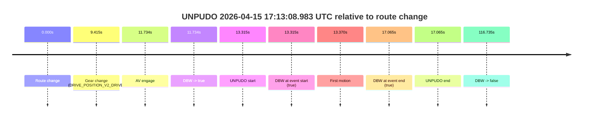

| Metric | Value |
|---|---|
| Outcome | `pass` |
| Effective failure type | `none` |
| Route change status | `found` |
| DBW at event start | `true` |
| DBW at event end | `true` |
| Predicted gear at AV start | `DRIVE_POSITION_V2_DRIVE` |
| Actual gear at AV start | `DRIVE_POSITION_V2_DRIVE` |
| Predicted gear at event start | `DRIVE_POSITION_V2_DRIVE` |
| Actual gear at event start | `DRIVE_POSITION_V2_DRIVE` |
| Planned indicator direction | `INDICATORS_STATE_V2_OFF` |
| Controller indicator direction | `INDICATORS_STATE_V2_OFF` |
| Actual indicator direction | `INDICATORS_STATE_V2_OFF` |
| Actual indicator at maneuver end | `INDICATORS_STATE_V2_OFF` |
| Driver accel help in AV | `false` |
| Driver accel help timestamp | `n/a` |
| Max accel pedal pct in AV | `0.0%` |
| Max brake pedal pct in AV | `8.0%` |
| Max speed mps in AV | `4.531` |
| Success timing baseline | `route change` |
| Route -> AV | `11.734s` |
| AV -> event start | `1.581s` |
| AV -> first motion | `1.635s` |
| Success baseline -> event start | `13.315s` |
| Success baseline -> first motion | `13.370s` |
| AV duration before disengagement | `105.001s` |
| Trajectory waypoint count | `37` |
| Driving-plan step count | `11` |

The scored portion starts from the AV-owned window, not from the pre-AV setup. Route-change search in the stopped pre-event segment was `found`, with the baseline therefore set to route change. At the event anchor the model predicts `DRIVE_POSITION_V2_DRIVE` and the actual gear is `DRIVE_POSITION_V2_DRIVE`. The effective model outcome is `pass` because `the credited unpudo stays AV-owned through the official unpudo window.`

### Resolution

| Field | Value |
|---|---|
| Final outcome | `pass` |
| Do we agree with this label? | `yes` |
| Source disengagement type | `none observed` |
| Resolved effective failure type | `none` |
| Confidence | `high` |

## unpudo 2026-04-15 17:16:10.133 UTC

| Field | Value |
|---|---|
| Model | `armadillo-amethyst-squeaky` |
| Author | `guy.geva` |
| Run ID | `fme10011/2026-04-15--15-39-22--gen2-av-1eff82a8-d97f-4d8e-be75-4f5d130fd5f1` |
| Date | `2026-04-15` |
| Time (UTC) | `17:16:10.133` |
| Event type | `unpudo` |
| Disengagement type | `none observed` |
| Route change | `unclear` |
| Console | [run](https://console.sso.wayve.ai/run/fme10011/2026-04-15--15-39-22--gen2-av-1eff82a8-d97f-4d8e-be75-4f5d130fd5f1?id=&time-unixus=1776273370133312) |
| Foxglove | [segment](https://app.foxglove.dev/wayve-on-prem/p/prj_0dX18KZdVHg1fmmI/view?ds=foxglove-stream&ds.deviceName=fme10011&ds.start=2026-04-15T17%3A14%3A00.133609Z&ds.end=2026-04-15T17%3A16%3A20.133312Z&layoutId=lay_0e7VD4WIKDQGU73Y&time=2026-04-15T17%3A16%3A10.133312Z) |

### Event card: fail

- Fail: the credited unpudo does not stay AV-owned. The event window starts with DBW false, and the maneuver outcome lands outside a clean AV-owned segment.

| Event | Time (UTC) | Delta from AV start |
|---|---:|---:|
| Route change unclear | 2026-04-15 17:14:10.133 | `0.000s` |
| AV engage | 2026-04-15 17:14:10.133 | `0.000s` |
| DBW -> true | 2026-04-15 17:14:10.133 | `0.000s` |
| First motion | 2026-04-15 17:14:10.137 | `0.004s` |
| DBW -> false | 2026-04-15 17:14:52.403 | `42.270s` |
| Gear change (DRIVE_POSITION_V2_DRIVE) | 2026-04-15 17:16:08.733 | `118.600s` |
| UNPUDO start | 2026-04-15 17:16:10.133 | `120.000s` |
| DBW at event start (false) | 2026-04-15 17:16:10.133 | `120.000s` |
| DBW at event end (false) | 2026-04-15 17:16:10.133 | `120.000s` |
| UNPUDO end | 2026-04-15 17:16:10.133 | `120.000s` |

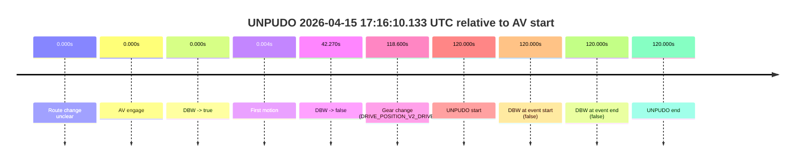

| Metric | Value |
|---|---|
| Outcome | `fail` |
| Effective failure type | `not_av_owned` |
| Route change status | `unclear` |
| DBW at event start | `false` |
| DBW at event end | `false` |
| Predicted gear at AV start | `DRIVE_POSITION_V2_DRIVE` |
| Actual gear at AV start | `DRIVE_POSITION_V2_DRIVE` |
| Predicted gear at event start | `DRIVE_POSITION_V2_DRIVE` |
| Actual gear at event start | `DRIVE_POSITION_V2_DRIVE` |
| Planned indicator direction | `INDICATORS_STATE_V2_OFF` |
| Controller indicator direction | `INDICATORS_STATE_V2_OFF` |
| Actual indicator direction | `INDICATORS_STATE_V2_OFF` |
| Actual indicator at maneuver end | `INDICATORS_STATE_V2_OFF` |
| Driver accel help in AV | `false` |
| Driver accel help timestamp | `n/a` |
| Max accel pedal pct in AV | `0.0%` |
| Max brake pedal pct in AV | `0.0%` |
| Max speed mps in AV | `10.444` |
| Success timing baseline | `AV start` |
| Route -> AV | `n/a` |
| AV -> event start | `120.000s` |
| AV -> first motion | `0.004s` |
| Success baseline -> event start | `120.000s` |
| Success baseline -> first motion | `0.004s` |
| AV duration before disengagement | `42.270s` |
| Trajectory waypoint count | `36` |
| Driving-plan step count | `11` |

The scored portion starts from the AV-owned window, not from the pre-AV setup. Route-change search in the stopped pre-event segment was `unclear`, with the baseline therefore set to AV start. At the event anchor the model predicts `DRIVE_POSITION_V2_DRIVE` and the actual gear is `DRIVE_POSITION_V2_DRIVE`. The effective model outcome is `fail` because `not_av_owned.`

### Resolution

| Field | Value |
|---|---|
| Final outcome | `fail` |
| Do we agree with this label? | `yes` |
| Source disengagement type | `none observed` |
| Resolved effective failure type | `not_av_owned` |
| Confidence | `medium` |

## unpudo 2026-04-15 17:18:30.733 UTC

| Field | Value |
|---|---|
| Model | `armadillo-amethyst-squeaky` |
| Author | `guy.geva` |
| Run ID | `fme10011/2026-04-15--15-39-22--gen2-av-1eff82a8-d97f-4d8e-be75-4f5d130fd5f1` |
| Date | `2026-04-15` |
| Time (UTC) | `17:18:30.733` |
| Event type | `unpudo` |
| Disengagement type | `failed_to_unpudo` |
| Route change | `found` |
| Console | [run](https://console.sso.wayve.ai/run/fme10011/2026-04-15--15-39-22--gen2-av-1eff82a8-d97f-4d8e-be75-4f5d130fd5f1?id=&time-unixus=1776273510733294) |
| Foxglove | [segment](https://app.foxglove.dev/wayve-on-prem/p/prj_0dX18KZdVHg1fmmI/view?ds=foxglove-stream&ds.deviceName=fme10011&ds.start=2026-04-15T17%3A16%3A41.718461Z&ds.end=2026-04-15T17%3A18%3A49.883316Z&layoutId=lay_0e7VD4WIKDQGU73Y&time=2026-04-15T17%3A18%3A30.733294Z) |

### Event card: fail

- Fail: AV owns part of the segment, but the event still resolves as a model-performance failure under the AV-only scoring rule.

| Event | Time (UTC) | Delta from route change |
|---|---:|---:|
| Actual indicator -> right on | 2026-04-15 17:16:48.717 | `-3.001s` |
| Route change | 2026-04-15 17:16:51.718 | `0.000s` |
| First motion | 2026-04-15 17:16:51.737 | `0.019s` |
| Actual indicator -> off | 2026-04-15 17:17:04.878 | `13.160s` |
| Actual indicator -> left on | 2026-04-15 17:17:09.878 | `18.160s` |
| Actual indicator -> off | 2026-04-15 17:17:10.797 | `19.079s` |
| Actual indicator -> left on | 2026-04-15 17:17:12.638 | `20.920s` |
| Actual indicator -> off | 2026-04-15 17:17:24.818 | `33.100s` |
| Actual indicator -> left on | 2026-04-15 17:17:46.498 | `54.780s` |
| Actual indicator -> off | 2026-04-15 17:17:51.797 | `60.079s` |
| AV engage | 2026-04-15 17:18:23.502 | `91.784s` |
| DBW -> true | 2026-04-15 17:18:23.502 | `91.784s` |
| Gear change (DRIVE_POSITION_V2_DRIVE) | 2026-04-15 17:18:23.883 | `92.165s` |
| DBW -> false | 2026-04-15 17:18:30.223 | `98.505s` |
| UNPUDO start | 2026-04-15 17:18:30.733 | `99.015s` |
| DBW at event start (false) | 2026-04-15 17:18:30.733 | `99.015s` |
| Actual indicator -> right on | 2026-04-15 17:18:33.018 | `101.300s` |
| DBW at event end (false) | 2026-04-15 17:18:39.883 | `108.165s` |
| UNPUDO end | 2026-04-15 17:18:39.883 | `108.165s` |
| Actual indicator -> off | 2026-04-15 17:18:42.497 | `110.779s` |

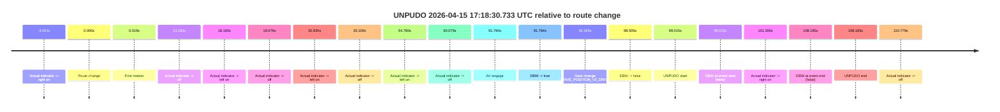

| Metric | Value |
|---|---|
| Outcome | `fail` |
| Effective failure type | `failed_to_unpudo` |
| Route change status | `found` |
| DBW at event start | `false` |
| DBW at event end | `false` |
| Predicted gear at AV start | `DRIVE_POSITION_V2_DRIVE` |
| Actual gear at AV start | `DRIVE_POSITION_V2_PARK` |
| Predicted gear at event start | `DRIVE_POSITION_V2_DRIVE` |
| Actual gear at event start | `DRIVE_POSITION_V2_DRIVE` |
| Planned indicator direction | `INDICATORS_STATE_V2_LEFT_ON` |
| Controller indicator direction | `INDICATORS_STATE_V2_LEFT_ON` |
| Actual indicator direction | `INDICATORS_STATE_V2_OFF` |
| Actual indicator at maneuver end | `INDICATORS_STATE_V2_RIGHT_ON` |
| Driver accel help in AV | `false` |
| Driver accel help timestamp | `n/a` |
| Max accel pedal pct in AV | `0.0%` |
| Max brake pedal pct in AV | `8.5%` |
| Max speed mps in AV | `0.000` |
| Success timing baseline | `route change` |
| Route -> AV | `91.784s` |
| AV -> event start | `7.231s` |
| AV -> first motion | `-91.765s` |
| Success baseline -> event start | `99.015s` |
| Success baseline -> first motion | `0.019s` |
| AV duration before disengagement | `6.721s` |
| Trajectory waypoint count | `36` |
| Driving-plan step count | `11` |

The scored portion starts from the AV-owned window, not from the pre-AV setup. Route-change search in the stopped pre-event segment was `found`, with the baseline therefore set to route change. At the event anchor the model predicts `DRIVE_POSITION_V2_DRIVE` and the actual gear is `DRIVE_POSITION_V2_DRIVE`. The effective model outcome is `fail` because `failed_to_unpudo.`

### Resolution

| Field | Value |
|---|---|
| Final outcome | `fail` |
| Do we agree with this label? | `yes` |
| Source disengagement type | `failed_to_unpudo` |
| Resolved effective failure type | `failed_to_unpudo` |
| Confidence | `high` |

## unpudo 2026-04-15 17:21:42.133 UTC

| Field | Value |
|---|---|
| Model | `armadillo-amethyst-squeaky` |
| Author | `guy.geva` |
| Run ID | `fme10011/2026-04-15--15-39-22--gen2-av-1eff82a8-d97f-4d8e-be75-4f5d130fd5f1` |
| Date | `2026-04-15` |
| Time (UTC) | `17:21:42.133` |
| Event type | `unpudo` |
| Disengagement type | `failed_to_unpudo` |
| Route change | `found` |
| Console | [run](https://console.sso.wayve.ai/run/fme10011/2026-04-15--15-39-22--gen2-av-1eff82a8-d97f-4d8e-be75-4f5d130fd5f1?id=&time-unixus=1776273702133307) |
| Foxglove | [segment](https://app.foxglove.dev/wayve-on-prem/p/prj_0dX18KZdVHg1fmmI/view?ds=foxglove-stream&ds.deviceName=fme10011&ds.start=2026-04-15T17%3A21%3A22.018331Z&ds.end=2026-04-15T17%3A21%3A55.383309Z&layoutId=lay_0e7VD4WIKDQGU73Y&time=2026-04-15T17%3A21%3A42.133307Z) |

### Event card: fail

- Fail: AV owns part of the segment, but the event still resolves as a model-performance failure under the AV-only scoring rule.

| Event | Time (UTC) | Delta from route change |
|---|---:|---:|
| Route change | 2026-04-15 17:21:32.018 | `0.000s` |
| Gear change (DRIVE_POSITION_V2_DRIVE) | 2026-04-15 17:21:34.433 | `2.415s` |
| AV engage | 2026-04-15 17:21:36.762 | `4.744s` |
| DBW -> true | 2026-04-15 17:21:36.762 | `4.744s` |
| DBW -> false | 2026-04-15 17:21:41.642 | `9.624s` |
| UNPUDO start | 2026-04-15 17:21:42.133 | `10.115s` |
| DBW at event start (false) | 2026-04-15 17:21:42.133 | `10.115s` |
| Actual indicator -> left on | 2026-04-15 17:21:44.937 | `12.920s` |
| DBW at event end (false) | 2026-04-15 17:21:45.383 | `13.365s` |
| UNPUDO end | 2026-04-15 17:21:45.383 | `13.365s` |
| Actual indicator -> off | 2026-04-15 17:21:52.258 | `20.240s` |

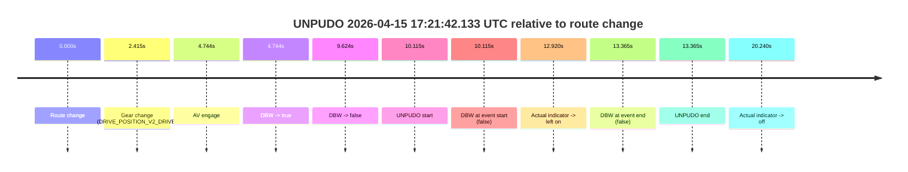

| Metric | Value |
|---|---|
| Outcome | `fail` |
| Effective failure type | `failed_to_unpudo` |
| Route change status | `found` |
| DBW at event start | `false` |
| DBW at event end | `false` |
| Predicted gear at AV start | `DRIVE_POSITION_V2_DRIVE` |
| Actual gear at AV start | `DRIVE_POSITION_V2_DRIVE` |
| Predicted gear at event start | `DRIVE_POSITION_V2_DRIVE` |
| Actual gear at event start | `DRIVE_POSITION_V2_DRIVE` |
| Planned indicator direction | `INDICATORS_STATE_V2_LEFT_ON` |
| Controller indicator direction | `INDICATORS_STATE_V2_LEFT_ON` |
| Actual indicator direction | `INDICATORS_STATE_V2_OFF` |
| Actual indicator at maneuver end | `INDICATORS_STATE_V2_LEFT_ON` |
| Driver accel help in AV | `false` |
| Driver accel help timestamp | `n/a` |
| Max accel pedal pct in AV | `0.0%` |
| Max brake pedal pct in AV | `8.2%` |
| Max speed mps in AV | `0.000` |
| Success timing baseline | `route change` |
| Route -> AV | `4.744s` |
| AV -> event start | `5.371s` |
| AV -> first motion | `n/a` |
| Success baseline -> event start | `10.115s` |
| Success baseline -> first motion | `n/a` |
| AV duration before disengagement | `4.880s` |
| Trajectory waypoint count | `36` |
| Driving-plan step count | `11` |

The scored portion starts from the AV-owned window, not from the pre-AV setup. Route-change search in the stopped pre-event segment was `found`, with the baseline therefore set to route change. At the event anchor the model predicts `DRIVE_POSITION_V2_DRIVE` and the actual gear is `DRIVE_POSITION_V2_DRIVE`. The effective model outcome is `fail` because `failed_to_unpudo.`

### Resolution

| Field | Value |
|---|---|
| Final outcome | `fail` |
| Do we agree with this label? | `yes` |
| Source disengagement type | `failed_to_unpudo` |
| Resolved effective failure type | `failed_to_unpudo` |
| Confidence | `high` |

## unpudo 2026-04-15 17:25:55.833 UTC

| Field | Value |
|---|---|
| Model | `armadillo-amethyst-squeaky` |
| Author | `guy.geva` |
| Run ID | `fme10011/2026-04-15--15-39-22--gen2-av-1eff82a8-d97f-4d8e-be75-4f5d130fd5f1` |
| Date | `2026-04-15` |
| Time (UTC) | `17:25:55.833` |
| Event type | `unpudo` |
| Disengagement type | `failed_to_unpudo` |
| Route change | `found` |
| Console | [run](https://console.sso.wayve.ai/run/fme10011/2026-04-15--15-39-22--gen2-av-1eff82a8-d97f-4d8e-be75-4f5d130fd5f1?id=&time-unixus=1776273955833316) |
| Foxglove | [segment](https://app.foxglove.dev/wayve-on-prem/p/prj_0dX18KZdVHg1fmmI/view?ds=foxglove-stream&ds.deviceName=fme10011&ds.start=2026-04-15T17%3A24%3A11.218274Z&ds.end=2026-04-15T17%3A26%3A09.783300Z&layoutId=lay_0e7VD4WIKDQGU73Y&time=2026-04-15T17%3A25%3A55.833316Z) |

### Event card: fail

- Fail: AV owns part of the segment, but the event still resolves as a model-performance failure under the AV-only scoring rule.

| Event | Time (UTC) | Delta from route change |
|---|---:|---:|
| Route change | 2026-04-15 17:24:21.218 | `0.000s` |
| First motion | 2026-04-15 17:24:26.998 | `5.780s` |
| Actual indicator -> right on | 2026-04-15 17:25:13.098 | `51.880s` |
| Actual indicator -> off | 2026-04-15 17:25:19.857 | `58.640s` |
| AV engage | 2026-04-15 17:25:48.402 | `87.184s` |
| DBW -> true | 2026-04-15 17:25:48.402 | `87.184s` |
| Gear change (DRIVE_POSITION_V2_DRIVE) | 2026-04-15 17:25:48.883 | `87.665s` |
| DBW -> false | 2026-04-15 17:25:55.502 | `94.284s` |
| UNPUDO start | 2026-04-15 17:25:55.833 | `94.615s` |
| DBW at event start (false) | 2026-04-15 17:25:55.833 | `94.615s` |
| DBW at event end (false) | 2026-04-15 17:25:59.783 | `98.565s` |
| UNPUDO end | 2026-04-15 17:25:59.783 | `98.565s` |
| Actual indicator -> left on | 2026-04-15 17:26:01.177 | `99.960s` |
| Actual indicator -> off | 2026-04-15 17:26:13.257 | `112.040s` |

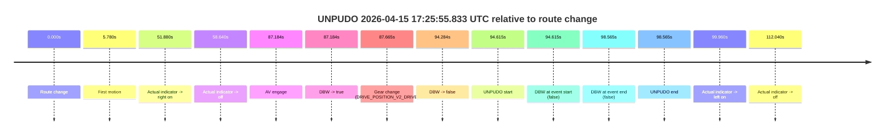

| Metric | Value |
|---|---|
| Outcome | `fail` |
| Effective failure type | `failed_to_unpudo` |
| Route change status | `found` |
| DBW at event start | `false` |
| DBW at event end | `false` |
| Predicted gear at AV start | `DRIVE_POSITION_V2_DRIVE` |
| Actual gear at AV start | `DRIVE_POSITION_V2_PARK` |
| Predicted gear at event start | `DRIVE_POSITION_V2_DRIVE` |
| Actual gear at event start | `DRIVE_POSITION_V2_DRIVE` |
| Planned indicator direction | `INDICATORS_STATE_V2_LEFT_ON` |
| Controller indicator direction | `INDICATORS_STATE_V2_LEFT_ON` |
| Actual indicator direction | `INDICATORS_STATE_V2_OFF` |
| Actual indicator at maneuver end | `INDICATORS_STATE_V2_OFF` |
| Driver accel help in AV | `false` |
| Driver accel help timestamp | `n/a` |
| Max accel pedal pct in AV | `0.0%` |
| Max brake pedal pct in AV | `8.5%` |
| Max speed mps in AV | `0.000` |
| Success timing baseline | `route change` |
| Route -> AV | `87.184s` |
| AV -> event start | `7.431s` |
| AV -> first motion | `-81.404s` |
| Success baseline -> event start | `94.615s` |
| Success baseline -> first motion | `5.780s` |
| AV duration before disengagement | `7.100s` |
| Trajectory waypoint count | `38` |
| Driving-plan step count | `11` |

The scored portion starts from the AV-owned window, not from the pre-AV setup. Route-change search in the stopped pre-event segment was `found`, with the baseline therefore set to route change. At the event anchor the model predicts `DRIVE_POSITION_V2_DRIVE` and the actual gear is `DRIVE_POSITION_V2_DRIVE`. The effective model outcome is `fail` because `failed_to_unpudo.`

### Resolution

| Field | Value |
|---|---|
| Final outcome | `fail` |
| Do we agree with this label? | `yes` |
| Source disengagement type | `failed_to_unpudo` |
| Resolved effective failure type | `failed_to_unpudo` |
| Confidence | `high` |

## unpudo 2026-04-15 17:30:37.783 UTC

| Field | Value |
|---|---|
| Model | `armadillo-amethyst-squeaky` |
| Author | `guy.geva` |
| Run ID | `fme10011/2026-04-15--15-39-22--gen2-av-1eff82a8-d97f-4d8e-be75-4f5d130fd5f1` |
| Date | `2026-04-15` |
| Time (UTC) | `17:30:37.783` |
| Event type | `unpudo` |
| Disengagement type | `failed_to_unpudo` |
| Route change | `found` |
| Console | [run](https://console.sso.wayve.ai/run/fme10011/2026-04-15--15-39-22--gen2-av-1eff82a8-d97f-4d8e-be75-4f5d130fd5f1?id=&time-unixus=1776274237783312) |
| Foxglove | [segment](https://app.foxglove.dev/wayve-on-prem/p/prj_0dX18KZdVHg1fmmI/view?ds=foxglove-stream&ds.deviceName=fme10011&ds.start=2026-04-15T17%3A30%3A16.718484Z&ds.end=2026-04-15T17%3A30%3A54.833299Z&layoutId=lay_0e7VD4WIKDQGU73Y&time=2026-04-15T17%3A30%3A37.783312Z) |

### Event card: fail

- Fail: AV owns part of the segment, but the event still resolves as a model-performance failure under the AV-only scoring rule.

| Event | Time (UTC) | Delta from route change |
|---|---:|---:|
| Route change | 2026-04-15 17:30:26.718 | `0.000s` |
| AV engage | 2026-04-15 17:30:30.862 | `4.144s` |
| DBW -> true | 2026-04-15 17:30:30.862 | `4.144s` |
| Gear change (DRIVE_POSITION_V2_DRIVE) | 2026-04-15 17:30:31.383 | `4.665s` |
| DBW -> false | 2026-04-15 17:30:37.242 | `10.524s` |
| UNPUDO start | 2026-04-15 17:30:37.783 | `11.065s` |
| DBW at event start (false) | 2026-04-15 17:30:37.783 | `11.065s` |
| Actual indicator -> left on | 2026-04-15 17:30:39.237 | `12.519s` |
| Actual indicator -> off | 2026-04-15 17:30:44.718 | `18.000s` |
| DBW at event end (false) | 2026-04-15 17:30:44.833 | `18.115s` |
| UNPUDO end | 2026-04-15 17:30:44.833 | `18.115s` |
| Actual indicator -> right on | 2026-04-15 17:30:46.237 | `19.519s` |
| Actual indicator -> off | 2026-04-15 17:30:56.458 | `29.740s` |

| Metric | Value |
|---|---|
| Outcome | `fail` |
| Effective failure type | `failed_to_unpudo` |
| Route change status | `found` |
| DBW at event start | `false` |
| DBW at event end | `false` |
| Predicted gear at AV start | `DRIVE_POSITION_V2_DRIVE` |
| Actual gear at AV start | `DRIVE_POSITION_V2_PARK` |
| Predicted gear at event start | `DRIVE_POSITION_V2_DRIVE` |
| Actual gear at event start | `DRIVE_POSITION_V2_DRIVE` |
| Planned indicator direction | `INDICATORS_STATE_V2_LEFT_ON` |
| Controller indicator direction | `INDICATORS_STATE_V2_LEFT_ON` |
| Actual indicator direction | `INDICATORS_STATE_V2_OFF` |
| Actual indicator at maneuver end | `INDICATORS_STATE_V2_OFF` |
| Driver accel help in AV | `false` |
| Driver accel help timestamp | `n/a` |
| Max accel pedal pct in AV | `0.0%` |
| Max brake pedal pct in AV | `8.0%` |
| Max speed mps in AV | `0.000` |
| Success timing baseline | `route change` |
| Route -> AV | `4.144s` |
| AV -> event start | `6.921s` |
| AV -> first motion | `n/a` |
| Success baseline -> event start | `11.065s` |
| Success baseline -> first motion | `n/a` |
| AV duration before disengagement | `6.380s` |
| Trajectory waypoint count | `37` |
| Driving-plan step count | `11` |

The scored portion starts from the AV-owned window, not from the pre-AV setup. Route-change search in the stopped pre-event segment was `found`, with the baseline therefore set to route change. At the event anchor the model predicts `DRIVE_POSITION_V2_DRIVE` and the actual gear is `DRIVE_POSITION_V2_DRIVE`. The effective model outcome is `fail` because `failed_to_unpudo.`

### Resolution

| Field | Value |
|---|---|
| Final outcome | `fail` |
| Do we agree with this label? | `yes` |
| Source disengagement type | `failed_to_unpudo` |
| Resolved effective failure type | `failed_to_unpudo` |
| Confidence | `high` |

## unpudo 2026-04-15 17:31:57.183 UTC

| Field | Value |
|---|---|
| Model | `armadillo-amethyst-squeaky` |
| Author | `guy.geva` |
| Run ID | `fme10011/2026-04-15--15-39-22--gen2-av-1eff82a8-d97f-4d8e-be75-4f5d130fd5f1` |
| Date | `2026-04-15` |
| Time (UTC) | `17:31:57.183` |
| Event type | `unpudo` |
| Disengagement type | `none observed` |
| Route change | `found` |
| Console | [run](https://console.sso.wayve.ai/run/fme10011/2026-04-15--15-39-22--gen2-av-1eff82a8-d97f-4d8e-be75-4f5d130fd5f1?id=&time-unixus=1776274317183312) |
| Foxglove | [segment](https://app.foxglove.dev/wayve-on-prem/p/prj_0dX18KZdVHg1fmmI/view?ds=foxglove-stream&ds.deviceName=fme10011&ds.start=2026-04-15T17%3A30%3A16.718484Z&ds.end=2026-04-15T17%3A34%3A13.402415Z&layoutId=lay_0e7VD4WIKDQGU73Y&time=2026-04-15T17%3A31%3A57.183312Z) |

### Event card: pass

- Pass: AV owns the credited unpudo from route change through the official unpudo window, the gear state is aligned at the anchor, and the vehicle moves without driver accelerator help in AV.

| Event | Time (UTC) | Delta from route change |
|---|---:|---:|
| Route change | 2026-04-15 17:30:26.718 | `0.000s` |
| First motion | 2026-04-15 17:30:37.818 | `11.100s` |
| Actual indicator -> left on | 2026-04-15 17:30:39.237 | `12.519s` |
| Actual indicator -> off | 2026-04-15 17:30:44.718 | `18.000s` |
| Actual indicator -> right on | 2026-04-15 17:30:46.237 | `19.519s` |
| Actual indicator -> off | 2026-04-15 17:30:56.458 | `29.740s` |
| Actual indicator -> right on | 2026-04-15 17:31:14.357 | `47.639s` |
| Actual indicator -> off | 2026-04-15 17:31:18.658 | `51.940s` |
| AV engage | 2026-04-15 17:31:52.362 | `85.644s` |
| DBW -> true | 2026-04-15 17:31:52.362 | `85.644s` |
| Gear change (DRIVE_POSITION_V2_DRIVE) | 2026-04-15 17:31:52.483 | `85.765s` |
| UNPUDO start | 2026-04-15 17:31:57.183 | `90.465s` |
| DBW at event start (true) | 2026-04-15 17:31:57.183 | `90.465s` |
| DBW at event end (true) | 2026-04-15 17:32:00.733 | `94.015s` |
| UNPUDO end | 2026-04-15 17:32:00.733 | `94.015s` |
| DBW -> false | 2026-04-15 17:34:03.402 | `216.684s` |
| Actual indicator -> left on | 2026-04-15 17:34:10.197 | `223.479s` |

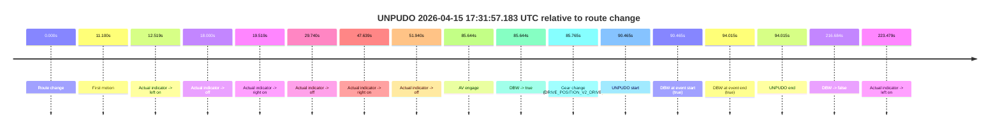

| Metric | Value |
|---|---|
| Outcome | `pass` |
| Effective failure type | `none` |
| Route change status | `found` |
| DBW at event start | `true` |
| DBW at event end | `true` |
| Predicted gear at AV start | `DRIVE_POSITION_V2_DRIVE` |
| Actual gear at AV start | `DRIVE_POSITION_V2_PARK` |
| Predicted gear at event start | `DRIVE_POSITION_V2_DRIVE` |
| Actual gear at event start | `DRIVE_POSITION_V2_DRIVE` |
| Planned indicator direction | `INDICATORS_STATE_V2_LEFT_ON` |
| Controller indicator direction | `INDICATORS_STATE_V2_LEFT_ON` |
| Actual indicator direction | `INDICATORS_STATE_V2_OFF` |
| Actual indicator at maneuver end | `INDICATORS_STATE_V2_OFF` |
| Driver accel help in AV | `false` |
| Driver accel help timestamp | `n/a` |
| Max accel pedal pct in AV | `0.0%` |
| Max brake pedal pct in AV | `8.0%` |
| Max speed mps in AV | `4.489` |
| Success timing baseline | `route change` |
| Route -> AV | `85.644s` |
| AV -> event start | `4.821s` |
| AV -> first motion | `-74.544s` |
| Success baseline -> event start | `90.465s` |
| Success baseline -> first motion | `11.100s` |
| AV duration before disengagement | `131.040s` |
| Trajectory waypoint count | `37` |
| Driving-plan step count | `11` |

The scored portion starts from the AV-owned window, not from the pre-AV setup. Route-change search in the stopped pre-event segment was `found`, with the baseline therefore set to route change. At the event anchor the model predicts `DRIVE_POSITION_V2_DRIVE` and the actual gear is `DRIVE_POSITION_V2_DRIVE`. The effective model outcome is `pass` because `the credited unpudo stays AV-owned through the official unpudo window.`

### Resolution

| Field | Value |
|---|---|
| Final outcome | `pass` |
| Do we agree with this label? | `yes` |
| Source disengagement type | `none observed` |
| Resolved effective failure type | `none` |
| Confidence | `high` |

## unpudo 2026-04-15 17:38:51.283 UTC

| Field | Value |
|---|---|
| Model | `armadillo-amethyst-squeaky` |
| Author | `guy.geva` |
| Run ID | `fme10011/2026-04-15--15-39-22--gen2-av-1eff82a8-d97f-4d8e-be75-4f5d130fd5f1` |
| Date | `2026-04-15` |
| Time (UTC) | `17:38:51.283` |
| Event type | `unpudo` |
| Disengagement type | `failed_to_unpudo` |
| Route change | `found` |
| Console | [run](https://console.sso.wayve.ai/run/fme10011/2026-04-15--15-39-22--gen2-av-1eff82a8-d97f-4d8e-be75-4f5d130fd5f1?id=&time-unixus=1776274731283314) |
| Foxglove | [segment](https://app.foxglove.dev/wayve-on-prem/p/prj_0dX18KZdVHg1fmmI/view?ds=foxglove-stream&ds.deviceName=fme10011&ds.start=2026-04-15T17%3A38%3A32.718290Z&ds.end=2026-04-15T17%3A39%3A05.533303Z&layoutId=lay_0e7VD4WIKDQGU73Y&time=2026-04-15T17%3A38%3A51.283314Z) |

### Event card: fail

- Fail: AV owns part of the segment, but the event still resolves as a model-performance failure under the AV-only scoring rule.

| Event | Time (UTC) | Delta from route change |
|---|---:|---:|
| Route change | 2026-04-15 17:38:42.718 | `0.000s` |
| AV engage | 2026-04-15 17:38:43.162 | `0.444s` |
| DBW -> true | 2026-04-15 17:38:43.162 | `0.444s` |
| Gear change (DRIVE_POSITION_V2_DRIVE) | 2026-04-15 17:38:43.683 | `0.965s` |
| DBW -> false | 2026-04-15 17:38:50.722 | `8.004s` |
| UNPUDO start | 2026-04-15 17:38:51.283 | `8.565s` |
| DBW at event start (false) | 2026-04-15 17:38:51.283 | `8.565s` |
| Actual indicator -> left on | 2026-04-15 17:38:51.658 | `8.940s` |
| Actual indicator -> off | 2026-04-15 17:38:54.417 | `11.700s` |
| DBW at event end (false) | 2026-04-15 17:38:55.533 | `12.815s` |
| UNPUDO end | 2026-04-15 17:38:55.533 | `12.815s` |
| Actual indicator -> left on | 2026-04-15 17:38:55.878 | `13.160s` |
| Actual indicator -> off | 2026-04-15 17:39:10.377 | `27.660s` |

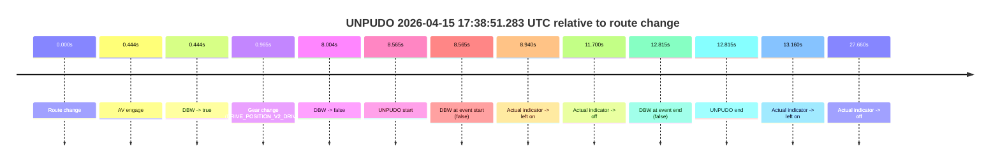

| Metric | Value |
|---|---|
| Outcome | `fail` |
| Effective failure type | `failed_to_unpudo` |
| Route change status | `found` |
| DBW at event start | `false` |
| DBW at event end | `false` |
| Predicted gear at AV start | `DRIVE_POSITION_V2_DRIVE` |
| Actual gear at AV start | `DRIVE_POSITION_V2_PARK` |
| Predicted gear at event start | `DRIVE_POSITION_V2_DRIVE` |
| Actual gear at event start | `DRIVE_POSITION_V2_DRIVE` |
| Planned indicator direction | `INDICATORS_STATE_V2_LEFT_ON` |
| Controller indicator direction | `INDICATORS_STATE_V2_LEFT_ON` |
| Actual indicator direction | `INDICATORS_STATE_V2_OFF` |
| Actual indicator at maneuver end | `INDICATORS_STATE_V2_OFF` |
| Driver accel help in AV | `false` |
| Driver accel help timestamp | `n/a` |
| Max accel pedal pct in AV | `0.0%` |
| Max brake pedal pct in AV | `8.0%` |
| Max speed mps in AV | `0.000` |
| Success timing baseline | `route change` |
| Route -> AV | `0.444s` |
| AV -> event start | `8.121s` |
| AV -> first motion | `n/a` |
| Success baseline -> event start | `8.565s` |
| Success baseline -> first motion | `n/a` |
| AV duration before disengagement | `7.560s` |
| Trajectory waypoint count | `37` |
| Driving-plan step count | `11` |

The scored portion starts from the AV-owned window, not from the pre-AV setup. Route-change search in the stopped pre-event segment was `found`, with the baseline therefore set to route change. At the event anchor the model predicts `DRIVE_POSITION_V2_DRIVE` and the actual gear is `DRIVE_POSITION_V2_DRIVE`. The effective model outcome is `fail` because `failed_to_unpudo.`

### Resolution

| Field | Value |
|---|---|
| Final outcome | `fail` |
| Do we agree with this label? | `yes` |
| Source disengagement type | `failed_to_unpudo` |
| Resolved effective failure type | `failed_to_unpudo` |
| Confidence | `high` |
